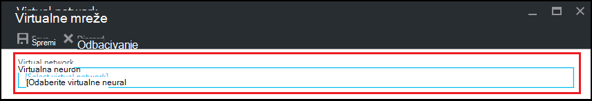

<properties
    pageTitle="Konfiguriranje virtualne mreže u Azure DevTest Labs | Microsoft Azure"
    description="Saznajte kako konfigurirati postojeće virtualne mreže i podmreže i njihovu korištenju u VM s Azure DevTest Labs"
    services="devtest-lab,virtual-machines"
    documentationCenter="na"
    authors="tomarcher"
    manager="douge"
    editor=""/>

<tags
    ms.service="devtest-lab"
    ms.workload="na"
    ms.tgt_pltfrm="na"
    ms.devlang="na"
    ms.topic="article"
    ms.date="09/06/2016"
    ms.author="tarcher"/>

# Konfiguriranje virtualne mreže u Azure DevTest Labs

Kao što je opisano u članku [Dodavanje VM s artefakte da biste na Laboratorija](devtest-lab-add-vm-with-artifacts.md), prilikom stvaranja na VM u Laboratorija, možete odrediti konfigurirani virtualne mreže. Jedan scenarij za to je potrebno da biste pristupili corpnet resursa iz vaše VMs putem virtualne mreže koji je konfiguriran pomoću ExpressRoute ili VPN-a web-mjesto. U sljedećim se odjeljcima prikazuju kako dodati postojeći virtualne mreže u na Laboratorija virtualne mrežne postavke tako da je moguće odabrati prilikom stvaranja VMs.

## Konfiguriranje virtualne mreže za Laboratorija pomoću portala za Azure
Sljedeći koraci će vas voditi kroz Dodavanje programa postojeće virtualne mreže (i podmreže) da biste na Laboratorija tako da se mogu koristiti pri stvaranju na VM u istom Laboratorija. 

1. Prijavite se na [portal za Azure](http://go.microsoft.com/fwlink/p/?LinkID=525040).

1. Odaberite **Više servisa**, a zatim na popisu odaberite **DevTest Labs** .

1. Na popisu labs odaberite željeni Laboratorija. 

1. Na plohu u Laboratorija odaberite **Konfiguracija**.

1. Na plohu **konfiguracije** na Laboratorija, odaberite **virtualne mreže**.

1. Na plohu **virtualne mreža** vidjeti popis virtualne mreža konfigurirana za trenutni Laboratorija, kao i zadani virtualne mreže stvorene za vaš Laboratorija. 

1. Odaberite **Dodaj**.

    
    
1. Na plohu **virtualne mreže** odaberite **[odaberite virtualne mreže]**.

    
    
1. Na plohu **virtualne mreže za odabir** odaberite željeni virtualne mreže. Na plohu prikazuje sve virtualne mreže koje se nalaze ispod isti regija u pretplati kao na Laboratorija.  

1. Nakon odabira virtualne mreže se vraćate plohu **virtualne mreže** i nekoliko polja su te značajke omogućene.  

    

1. Navedite opis virtualne mreže / Laboratorija kombinacija.

1. Da biste omogućili podmreže će se koristiti u Laboratorija VM stvaranja, odaberite **Stvaranje VIRTUALNOG računala za korištenje u**.

1. Da biste omogućili javnu IP adresa u podmreži, odaberite **DOPUSTI JAVNU IP**.

1. U polje **MAKSIMALNI VIRTUALNIM STROJEVIMA po KORISNIKU** Navedite maksimalni VMs po korisniku za svaki podmreže. Ako želite da se neograničen broj VMs, to polje ostavite prazno.

1. Odaberite **Spremi**.

1. Sad kad virtualne mreža bude konfigurirana, može se odabrati prilikom stvaranja na VM. Da biste vidjeli kako stvoriti na VM i odredite virtualna mreže, potražite u članku [Dodavanje VM s artefakte da biste na Laboratorija](devtest-lab-add-vm-with-artifacts.md). 

[AZURE.INCLUDE [devtest-lab-try-it-out](../../includes/devtest-lab-try-it-out.md)]

## Daljnji koraci

Kada dodate željeni virtualne mreže vaše Laboratorija, sljedeći je korak da biste [dodali VM za vaše Laboratorija](devtest-lab-add-vm-with-artifacts.md).