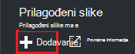
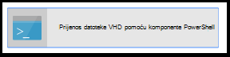
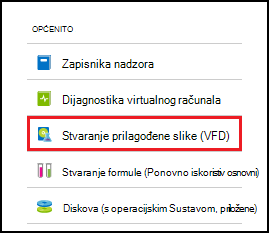
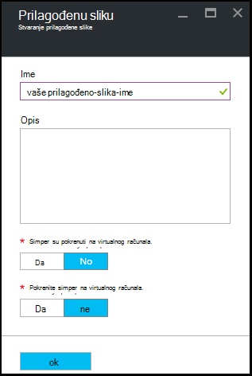

<properties
    pageTitle="Upravljanje Azure DevTest Labs prilagođene slike da biste stvorili VMs | Microsoft Azure"
    description="Saznajte kako stvoriti prilagođenu sliku iz datoteke VHD ili iz postojeće VM u Azure DevTest Labs"
    services="devtest-lab,virtual-machines"
    documentationCenter="na"
    authors="tomarcher"
    manager="douge"
    editor=""/>

<tags
    ms.service="devtest-lab"
    ms.workload="na"
    ms.tgt_pltfrm="na"
    ms.devlang="na"
    ms.topic="article"
    ms.date="09/07/2016"
    ms.author="tarcher"/>

# Upravljanje Azure DevTest Labs prilagođene slike da biste stvorili VMs

U Azure DevTest Labs, prilagođene slike omogućuju vam brzo stvaranje VMs bez čekanja potrebni softver za instalaciju na ciljnom računalu. Prilagođeni slike omogućuju unaprijed instalirati softver koje su vam potrebne u datoteci VHD i koristiti za stvaranje na VM VHD datoteku. Budući da već je instaliran softver, vrijeme stvaranja VM je mnogo brže. Osim toga, prilagođene slike koriste se za Kloniraj VMs stvaranje prilagođenu sliku iz programa VM, a zatim stvaranje VMs iz tog prilagođenu sliku.

U ovom se članku saznati kako:

- [Stvori prilagođenu sliku iz datoteke VHD](#create-a-custom-image-from-a-vhd-file) tako da se nakon toga možete napraviti na VM iz tog prilagođenu sliku. 
- [Stvori prilagođenu sliku iz programa VM](#create-a-custom-image-from-a-vm) za brz kloniranje VM.

## Stvoriti prilagođenu sliku iz datoteke VHD

U ovom ćete odjeljku Saznajte kako stvoriti prilagođenu sliku iz datoteke VHD.
Potreban pristup valjanu datoteku VHD za izvođenje svih koraka u ovom odjeljku.   

1. Prijavite se na [portal za Azure](http://go.microsoft.com/fwlink/p/?LinkID=525040).

1. Odaberite **nove servise**, a zatim na popisu odaberite **DevTest Labs** .

1. Na popisu labs odaberite željeni Laboratorija.  

1. Na plohu u Laboratorija odaberite **Konfiguracija**. 

1. Na **konfiguracije** plohu Laboratorija odaberite **Prilagođeni slike**.

1. Na plohu **slike Prilagođeno** odaberite **+ Prilagođeno slike**.

    

1. Unesite naziv prilagođenu sliku. Taj se naziv prikazuje na popisu osnovni slika prilikom pisanja na VM.

1. Unesite opis prilagođenu sliku. Opis se prikazuje na popisu osnovni slika prilikom pisanja na VM.

1. Odaberite **datoteku VHD**.

1. Ako imate pristup VHD datoteke koji nije naveden, dodajte slijedeći upute u odjeljku [Prijenos VHD datoteke](#upload-a-vhd-file) i vratite se ovamo kada završite.

1. Odaberite željenu datoteku VHD.

1. Odaberite **u redu** da biste zatvorili plohu **VHD datoteke** .

1. Odaberite **Konfiguracija OS**.

1. Na kartici **OS konfiguracije** odaberite **Windows** i **Linux**.

1. Ako je odabran **Windows** , navedite putem potvrdni okvir li pokrenuta *Sysprep* na računalu.

1. Odaberite **u redu** da biste zatvorili plohu **OS konfiguracije** .

1. Odaberite **u redu** da biste stvorili prilagođenu sliku.

1. Prijeđite na odjeljak [Daljnji koraci](#next-steps) .

###Prijenos datoteke VHD

Da biste dodali prilagođenu sliku, morate imati pristup VHD datoteci.

1. Na plohu **VHD datoteke** odaberite **Prijenos datoteke VHD pomoću komponente PowerShell**.

    

1. Sljedeći plohu prikazat će se upute za izmjenu i pokrenuti skriptu PowerShell koja prenosi u pretplatu za Azure VHD datoteke. 
**Bilješke:** Taj postupak može biti dugotrajan ovisno o veličini datoteka VHD i brzini veze.

## Stvoriti prilagođenu sliku iz programa VM
Ako imate VM koje već konfigurirali, možete stvoriti prilagođenu sliku iz tog VM i naknadno koristiti tu prilagođenu sliku da biste stvorili druge identične VMs. Sljedeći koraci objašnjavaju kako stvoriti prilagođenu sliku iz programa VM:

1. Prijavite se na [portal za Azure](http://go.microsoft.com/fwlink/p/?LinkID=525040).

1. Odaberite **nove servise**, a zatim na popisu odaberite **DevTest Labs** .

1. Na popisu labs odaberite željeni Laboratorija.  

1. Na plohu u Laboratorija odaberite **Moj virtualnih računala**.
 
1. Na plohu **Moje virtualnim strojevima** odaberite VM iz kojih želite stvoriti prilagođenu sliku.

1. Na plohu u VM odaberite **Stvori prilagođenu sliku (VHD)**.

    

1. Na plohu **Stvaranje slike** unesite naziv i opis prilagođenu sliku. Ti se podaci prikazuju na popisu baza prilikom stvaranja na VM.

    

1. Odaberite želite li sysprep pokretala na na VM. Ako se na na VM je izvesti sysprep, navedite želite li da sysprep koji se pokreću kada je VM stvara se iz prilagođene sliku.

1. Odaberite **u redu** kada završite s da biste stvorili prilagođenu sliku.

[AZURE.INCLUDE [devtest-lab-try-it-out](../../includes/devtest-lab-try-it-out.md)]

## Srodni bloga

- [Prilagođeni slike ili formula?](https://blogs.msdn.microsoft.com/devtestlab/2016/04/06/custom-images-or-formulas/)
- [Kopiranje slike prilagođene između Labs Azure DevTest](http://www.visualstudiogeeks.com/blog/DevOps/How-To-Move-CustomImages-VHD-Between-AzureDevTestLabs#copying-custom-images-between-azure-devtest-labs)

##Daljnji koraci

Kada dodate prilagođenu sliku za korištenje prilikom stvaranja na VM, sljedeći je korak da biste [dodali VM za vaše Laboratorija](./devtest-lab-add-vm-with-artifacts.md).