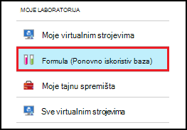
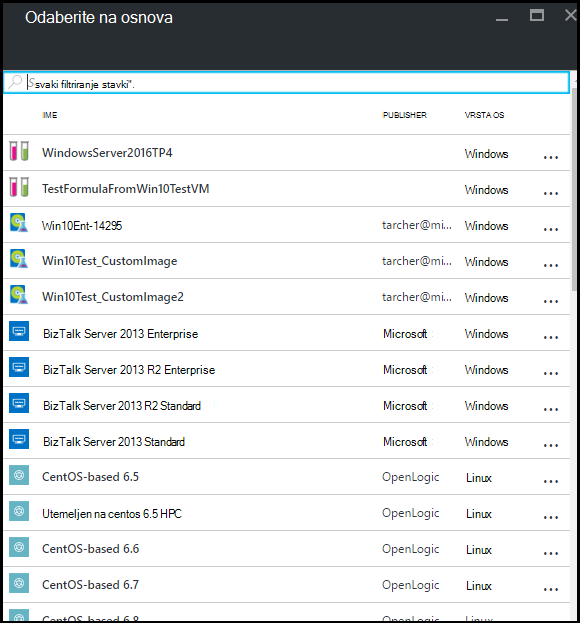
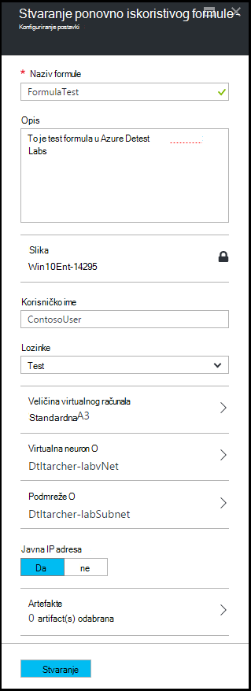
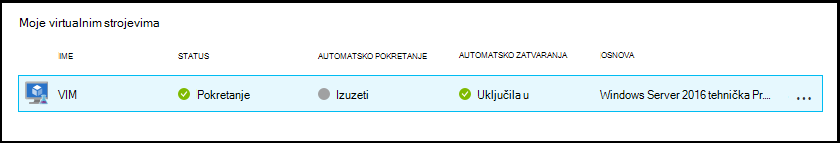
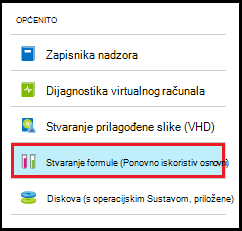
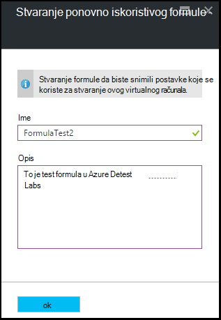
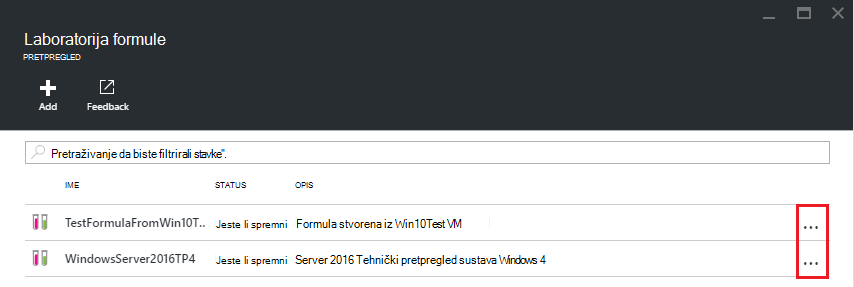
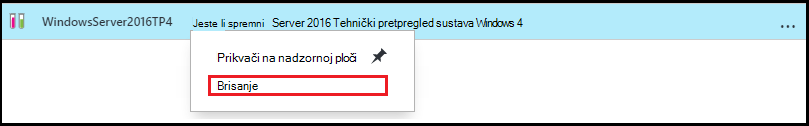

<properties
    pageTitle="Upravljanje formule u Azure DevTest Labs da biste stvorili VMs | Microsoft Azure"
    description="Saznajte kako stvoriti, ažurirati, i uklanjanje formule Azure DevTest Labs i ih koristiti da biste stvorili novi VMs."
    services="devtest-lab,virtual-machines"
    documentationCenter="na"
    authors="tomarcher"
    manager="douge"
    editor=""/>

<tags
    ms.service="devtest-lab"
    ms.workload="na"
    ms.tgt_pltfrm="na"
    ms.devlang="na"
    ms.topic="article"
    ms.date="08/30/2016"
    ms.author="tarcher"/>

# Upravljanje DevTest Labs formule da biste stvorili VMs

Formula u Azure DevTest Labs je popis vrijednosti nekretnina zadanom koristi za stvaranje virtualnog računala (VM). Kada stvarate na VM dobiti formulom, zadane vrijednosti mogu se koristiti kao-je ili izmijenjene. Kao što su [prilagođene slike](./devtest-lab-create-template.md) i [trgovine slike](./devtest-lab-configure-marketplace-images.md), formule nude mehanizam za dodjelu resursa VM za brzo.  

U ovom se članku ćete saznati kako izvedite sljedeće zadatke:

- [Stvaranje formule](#create-a-formula)
- [Dodjela resursa u VM pomoću formule](#use-a-formula-to-provision-a-vm)
- [Izmjena formule](#modify-a-formula)
- [Brisanje formule](#delete-a-formula)

> [AZURE.NOTE] Formule – kao što su [prilagođene slike](./devtest-lab-create-template.md) - omogućuju stvaranje osnovne slike iz datoteke VHD. Osnovni slike mogu pa se Dodjela nove VM. Da biste lakše odlučili koji je oblik najbolje odgovara vašem okruženju, pogledajte članak, [Comparing prilagođene slike i formula u DevTest Labs](./devtest-lab-comparing-vm-base-image-types.md).

## Stvaranje formule
Svi koji imaju dozvole za DevTest Labs *korisnicima* je moći stvoriti VMs pomoću formule kao osnovu. Stvaranje formula na dva načina: 

- Iz baze - koristite kada želite definirati karakteristike formule.
- Iz postojeće Laboratorija VM - koristite kada želite stvoriti formulu na temelju postavke postojeće VM.

### Stvaranje formule iz osnovu
Sljedeći koraci će vas voditi kroz postupak stvaranja formula prilagođenu sliku, trgovine slike ili drugu formulu.

1. Prijavite se na [portal za Azure](http://go.microsoft.com/fwlink/p/?LinkID=525040).

1. Odaberite **Više servisa**, a zatim na popisu odaberite **DevTest Labs** .

1. Na popisu labs odaberite željeni Laboratorija.  

1. Na plohu u Laboratorija odaberite **formule (Ponovno iskoristiv baza)**.

    

1. Na plohu **Laboratorija formule** odaberite **+ Dodaj**.

    

1. Na plohu **Odaberite osnovu** odaberite base (prilagođenu sliku, trgovine sliku ili formule) iz kojih želite stvoriti formulu.

    

1. Na plohu **Stvaranje formula** , navedite sljedeće vrijednosti:

    - **Formule ime** - unesite naziv formulu. Ta vrijednost prikazat će se na popisu osnovni slika prilikom stvaranja na VM. Naziv se provjerava dok upisujete, a ako nije valjan, poruku označili preduvjeti za valjani naziv.
    - **Opis** - unesite neki smisleni opis za formulu. Ta vrijednost dostupna formulu na kontekstnom izborniku prilikom stvaranja na VM.
    - **Korisničko ime** - unesite korisničko ime koje će biti odobren administratorske ovlasti.
    - **Lozinke** – unesite – ili na padajućem izborniku odaberite – vrijednost koja je povezana s tajna (lozinka) koji želite koristiti za navedenog korisnika.  
    - **Slika** – ovo polje prikazuje naziv osnovni slike koju ste odabrali na prethodni plohu. 
    - **Veličina virtualnog računala** – odaberite neku od unaprijed definiranih stavki koje navode jezgri procesora, veličina RAM-a i veličine tvrdog diska VM da biste stvorili.
    - **Virtualna mreže** - navedite željeni virtualne mreže.
    - **Podmreže** - navedite željeni podmreže.
    - **Javnu IP adresa** – ako pravila Laboratorija postavljena na Dopusti javnu IP adresa za odabrani podmreži, navedite želite li da se s IP adresom biti javno tako da odaberete **da** ili **ne**. U suprotnom, onemogućeno i će biti odabrana **bez**tu mogućnost.
    - **Artefakte** - odabrati i konfigurirati artefakte koju želite dodati osnovni slike. Sigurne niz vrijednosti se ne spremaju koja sadrži formulu. Stoga artefakt parametre koje su sigurne nizovi se ne prikazuju. 

        

1. Odaberite **Stvori** da biste stvorili formulu.

### Stvaranje formule iz programa VM
Sljedeći koraci će vas voditi kroz postupak stvaranja formulu na temelju postojeće VM. 

> [AZURE.NOTE] Da biste stvorili formulu u VM, na VM potrebno je stvoriti nakon ožujak 30, 2016. 

1. Prijavite se na [portal za Azure](http://go.microsoft.com/fwlink/p/?LinkID=525040).

1. Odaberite **Više servisa**, a zatim na popisu odaberite **DevTest Labs** .

1. Na popisu labs odaberite željeni Laboratorija.  

1. Na na Laboratorija plohu **Pregled** , odaberite VM iz kojih želite stvoriti formulu.

    

1. Na plohu u VM odaberite **Stvaranje formule (Ponovno iskoristiv osnovni)**.

    

1. Na plohu **Stvaranje formula** unesite **naziv** i **Opis** za novu formulu.

    

1. Odaberite **u redu** da biste stvorili formulu.

## Dodjela resursa u VM pomoću formule
Nakon što stvorite formulu, možete stvoriti VM na temelju tu formulu. U odjeljku [Dodavanje VM s artefakte](devtest-lab-add-vm-with-artifacts.md#add-a-vm-with-artifacts) vodit će vas kroz postupak.

## Izmjena formule
Da biste izmijenili formule, slijedite ove korake:

1. Prijavite se na [portal za Azure](http://go.microsoft.com/fwlink/p/?LinkID=525040).

1. Odaberite **Više servisa**, a zatim na popisu odaberite **DevTest Labs** .

1. Na popisu labs odaberite željeni Laboratorija.  

1. Na plohu u Laboratorija odaberite **formule (Ponovno iskoristiv baza)**.

    

1. Na plohu **Laboratorija formule** odaberite formula koje želite izmijeniti.

1. Na plohu **Ažuriranje formule** unesite željene izmjene, a zatim odaberite **Ažuriraj**.

## Brisanje formule 
Da biste izbrisali formule, slijedite ove korake:

1. Prijavite se na [portal za Azure](http://go.microsoft.com/fwlink/p/?LinkID=525040).

1. Odaberite **Više servisa**, a zatim na popisu odaberite **DevTest Labs** .

1. Na popisu labs odaberite željeni Laboratorija.  

1. Na **Postavke** plohu Laboratorija odaberite **formule**.

    

1. Na plohu **Laboratorija formule** odaberite tri točke s desne strane formulu koju želite izbrisati.

    

1. Na formule kontekstnog izbornika odaberite **Izbriši**.

    

1. Da biste dijaloški okvir za potvrdu brisanja odaberite **da** .

[AZURE.INCLUDE [devtest-lab-try-it-out](../../includes/devtest-lab-try-it-out.md)]

## Srodni bloga

- [Prilagođeni slike ili formula?](https://blogs.msdn.microsoft.com/devtestlab/2016/04/06/custom-images-or-formulas/)

## Daljnji koraci
Nakon stvaranja formula za korištenje prilikom stvaranja na VM, sljedeći je korak da biste [dodali VM za vaše Laboratorija](./devtest-lab-add-vm-with-artifacts.md).