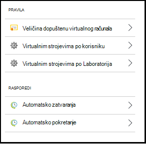
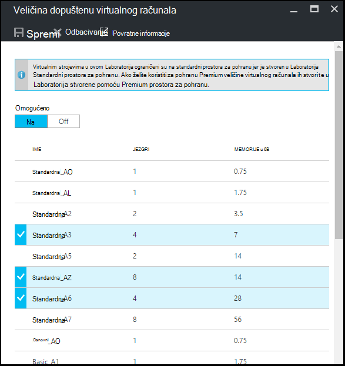
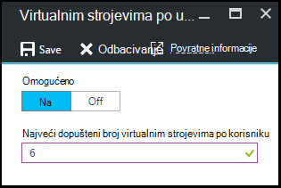
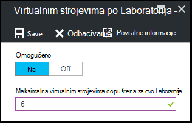
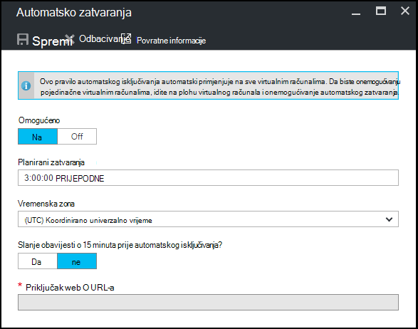
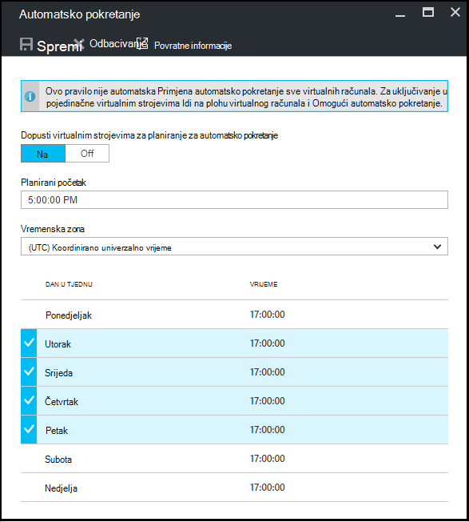

<properties
    pageTitle="Definiranje Laboratorija pravila u Azure DevTest Labs | Microsoft Azure"
    description="Saznajte kako da biste definirali Laboratorija pravila kao što su veličina VM, maksimalna VMs po korisniku i isključivanje automatizaciju."
    services="devtest-lab,virtual-machines"
    documentationCenter="na"
    authors="tomarcher"
    manager="douge"
    editor=""/>

<tags
    ms.service="devtest-lab"
    ms.workload="na"
    ms.tgt_pltfrm="na"
    ms.devlang="na"
    ms.topic="article"
    ms.date="09/12/2016"
    ms.author="tarcher"/>

# Definiranje Laboratorija pravila u Azure DevTest Labs

> [AZURE.VIDEO how-to-set-vm-policies-in-a-devtest-lab]

Azure DevTest Labs omogućuju vam da odredite ključa pravila koja vam kontrolu trošak i minimiziranja otpad u vašem labs. Ta pravila Laboratorija obuhvaćaju maksimalni broj VMs stvorila po korisniku i po Laboratorija i razne mogućnosti automatskog isključivanja i automatsko pokretanje. 

## Pristup police u Laboratorija Azure DevTest Labs

Sljedeći koraci će vas voditi kroz postavljanje pravila za Laboratorija u Azure DevTest Labs:

Prikaz (i promjena) pravila za na Laboratorija, slijedite ove korake:

1. Prijavite se na [portal za Azure](http://go.microsoft.com/fwlink/p/?LinkID=525040).

1. Odaberite **nove servise**, a zatim na popisu odaberite **DevTest Labs** .

1. Na popisu labs odaberite željeni Laboratorija.   

1. Odaberite **Postavke pravila**.

1. **Postavke pravilnika** plohu sadrži izbornik postavke koje možete odrediti: 

    

    Da biste saznali više o postavljanju pravila, odaberite ga s popisa u nastavku:

    - [Veličina virtualnog računala dopuštene](#set-allowed-virtual-machine-sizes) – odaberite na popisu veličina VM dopušteni u na Laboratorija. Korisnik može stvoriti VMs samo s ovog popisa.

    - [Virtualnim strojevima po korisniku](#set-virtual-machines-per-user) - Navedite maksimalni broj VMs koje je moguće stvoriti korisnik. 

    - [Virtualnim strojevima po Laboratorija](#set-virtual-machines-per-lab) - Navedite maksimalni broj VMs koja se mogu stvoriti na Laboratorija. 

    - [Automatsko isključivanje](#set-auto-shutdown) - odredite vrijeme kada je trenutno Laboratorija VMs automatski isključiti.

    - [Automatsko pokretanje](#set-auto-start) - pritisak na kada se trenutni Laboratorija VMs Workspace pokrenuli zajedno.

## Postavljanje dopuštene veličine virtualnog računala

Pravila za postavljanje dopuštene veličine VM pomaže da biste minimizirali Laboratorija otpad omogućujući vam da odredite koji veličina VM dopušteno u na Laboratorija. Ako se to pravilo se aktivira, samo VM veličine s ovog popisa može koristiti da biste stvorili VMs.

1. Na plohu **postavke pravilnika** u Laboratorija, odaberite **Veličina virtualnim strojevima dopuštene**.

    
 
1. Odaberite **na** da biste omogućili ovo pravilo, a zatim **Isključeno** da biste onemogućili.

1. Ako omogućite ovo pravilo, odaberite jedan ili više veličine VM koje je moguće stvoriti u vašem Laboratorija.

1. Odaberite **Spremi**.

## Postavljanje virtualnim strojevima po korisniku

Pravila za **virtualnim strojevima po korisniku** omogućuje određivanje maksimalan broj VMs koje je moguće stvoriti pojedinačnih korisnika. Ako se korisnik pokuša stvaranje na VM kada ispunjeni ograničenje korisničke, poruka o pogrešci upućuje na to nije moguće stvoriti u VM. 

1. Na plohu **postavke pravilnika** u Laboratorija, odaberite **virtualnim strojevima po korisniku**.

    

1. Odaberite **na** da biste omogućili ovo pravilo, a zatim **Isključeno** da biste onemogućili.

1. Ako omogućite ovo pravilo, unesite numeričku vrijednost koja označava maksimalan broj VMs koje je moguće stvoriti korisnik. Ako unesete broj koji nije valjan, korisničkog Sučelja prikazuje maksimalni broj dopuštena za ovo polje.

1. Odaberite **Spremi**.

## Postavljanje virtualnim strojevima po Laboratorija

Pravila za **virtualnim strojevima po Laboratorija** omogućuje vam da navedete maksimalni broj VMs koje je moguće stvoriti za trenutni Laboratorija. Ako se korisnik pokuša stvaranje na VM kada ispunjeni Laboratorija ograničenje, poruka o pogrešci pokazuje na VM nije moguće stvoriti. 

1. Na plohu **postavke pravilnika** u Laboratorija, odaberite **virtualnim strojevima po Laboratorija**.

    

1. Odaberite **na** da biste omogućili ovo pravilo, a zatim **Isključeno** da biste onemogućili.

1. Ako omogućite ovo pravilo, unesite numeričku vrijednost koja označava maksimalan broj VMs koje je moguće stvoriti za trenutni Laboratorija. Ako unesete broj koji nije valjan, korisničkog Sučelja prikazuje najveći broj dopuštena za ovo polje.

1. Odaberite **Spremi**.

## Postavljanje automatskog-zatvaranja

Automatsko isključivanje pravila omogućuje da biste minimizirali Laboratorija otpad omogućujući vam da biste naveli vrijeme koje ovaj Laboratorija VMs isključiti.

1. Na plohu **postavke pravilnika** u Laboratorija, odaberite **Automatsko zatvaranja**.

    

1. Odaberite **na** da biste omogućili ovo pravilo, a zatim **Isključeno** da biste onemogućili.

1. Ako omogućite ovo pravilo, navedite lokalno vrijeme da biste isključili sve VMs u trenutnom Laboratorija.

1. Odaberite **Spremi**.

1. Prema zadanim postavkama, kada je omogućen, to pravilo primjenjuje na sve VMs u trenutnom Laboratorija. Da biste uklonili određene VM tu postavku, otvorite na VM plohu i promijenite njegova postavka **automatskog zatvaranja** 

## Automatsko pokretanje za postavljanje

Pravila za automatsko pokretanje omogućuje vam da navedete kada VMs u trenutnom Laboratorija počne.  

1. Na plohu **postavke pravilnika** u Laboratorija, odaberite **Automatsko pokretanje**.

    

1. Odaberite **na** da biste omogućili ovo pravilo, a zatim **Isključeno** da biste onemogućili.

1. Ako omogućite ovo pravilo, navedite lokalne zakazano pokrenuti vrijeme i dane u tjednu za koju se odnosi na vrijeme. 

1. Odaberite **Spremi**.

1. Kada je omogućen, to pravilo ne primjenjuje na sve VMs u trenutnom Laboratorija. Da biste primijenili tu postavku određene VM, otvorite na VM plohu i promijenite njegova postavka **Automatsko pokretanje** 

[AZURE.INCLUDE [devtest-lab-try-it-out](../../includes/devtest-lab-try-it-out.md)]

## Daljnji koraci

Kad definirani i primijeniti različite postavke pravilnika VM za vaše Laboratorija, Evo nekih Napomena koje valja pokušajte sljedeće:

- [Konfiguriranje trošak upravljanje](./devtest-lab-configure-cost-management.md) – pokazuje kako koristiti **Trend mjesečni Procijenjena trošak** grafikona  
Da biste vidjeli trenutni mjesec je Procijenjena trošak po datumu i Predviđeni trošak Kraj mjeseca.
- [Stvori prilagođenu sliku](./devtest-lab-create-template.md) – kada stvarate na VM, navedite baza, što može biti prilagođenu sliku ili sliku trgovine. U ovom se članku prikazuje kako stvoriti prilagođenu sliku iz datoteke VHD.
- [Konfiguriranje trgovine slike](./devtest-lab-configure-marketplace-images.md) - Azure DevTest Labs podržava stvaranje VMs koji se temelji na slikama trgovine Windows Azure. U ovom se članku prikazuje kako odrediti koja se, ako postoje, trgovine Windows Azure slike mogu koristiti pri stvaranju VMs u na Laboratorija.
- [Stvaranje VM u na Laboratorija](./devtest-lab-add-vm-with-artifacts.md) - ilustrira kako stvoriti na VM s osnovnim slike (ili Prilagođeno ili tržištu), i kako raditi s artefakte u vašem VM.
