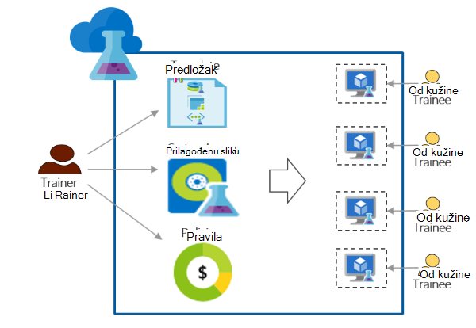

<properties
    pageTitle="Korištenje Azure DevTest Labs za obuku | Microsoft Azure"
    description="Saznajte kako koristiti Azure DevTest Labs scenarijima za obuku za."
    services="devtest-lab,virtual-machines"
    documentationCenter="na"
    authors="steved0x"
    manager="douge"
    editor=""/>

<tags
    ms.service="devtest-lab"
    ms.workload="na"
    ms.tgt_pltfrm="na"
    ms.devlang="na"
    ms.topic="article"
    ms.date="09/12/2016"
    ms.author="sdanie"/>

# Korištenje Azure DevTest Labs za osposobljavanje

Azure DevTest Labs može se koristiti za implementaciju ključni scenariji osim razvojni i testiranje. Jedna od tih scenarija jest da biste postavili Laboratorija za obuku. Azure DevTest Labs omogućuje stvaranje Laboratorija koje možete unijeti prilagođeni predlošci koje svaki od kužine možete koristiti za stvaranje identične i Izolirani okruženja za obuku. Možete omogućiti obuka okruženja su dostupni za svaku od kužine samo kada su potrebne i sadrže dovoljno resursa – kao što su virtualnim strojevima - potrebne za za obuku. Na kraju, možete jednostavno zajednički koristiti s Laboratorija s trainees koji mogu pristupiti jednim klikom.   

Azure DevTest Labs zadovoljava sljedeće preduvjete koje su potrebne za provođenje obuku u bilo kojem okruženje virtualne: 

-   Trainees ne mogu vidjeti VMs koje su stvorile druge trainees
-   Svakom računalu obuka moraju biti jednake
-   Trainees možete brzo Dodjela njihove okruženja za osposobljavanje
-   Osiguravanje trainees nije moguće dobiti dodatne VMs od koje su im potrebne za obuku i i isključivanje VMs kada se ne koriste ih kontrolirati trošak
-   Jednostavno zajedničko korištenje Laboratorija obuka s svaki od kužine
-   Ponovno Laboratorija obuka

U ovom se članku Naučite različite značajke Azure DevTest Labs koje je moguće koristiti da bi odgovarao preduvjeti prethodno opisan obuka i detaljne upute koje možete pratiti da biste postavili Laboratorija za obuku.  

## Obuka za implementaciju s Azure DevTest Labs

1. **Stvaranje na Laboratorija** 

    Labs su početne točke u Azure DevTest Labs. Kada stvorite na Laboratorija, možete obavljati zadatke kao što su kao što je dodavanje korisnika (trainees) u Laboratorija, postaviti pravila kontrolirati troškove, definiranje VM slike koje možete brzo stvoriti i drugo.   

    Dodatne informacije i to klikom na veze u tablici u nastavku:

  	| Zadatak                                                            | Što ste saznali                                                    |
|-----------------------------------------------------------------|----------------------------------------------------------------------|
| [Stvaranje na Laboratorija u Azure DevTest Labs](devtest-lab-create-lab.md) | Saznajte kako stvoriti na Laboratorija u Azure DevTest Labs na portalu za Azure. |

2. **Stvaranje VMs tečaj u minutama pomoću gotovih trgovine slike i prilagođene slike** 
    
    Možete odaberite gotovih slike iz raznih slike u Azure Marketplace i učinite ih dostupnima za trainees u na Laboratorija. Ako gotovih slike ne odgovaraju potrebama, možete stvoriti prilagođenu sliku tako da stvorite Laboratorija VM pomoću gotovih slike iz trgovine Windows Azure, instalaciju softvera koje su vam potrebne za obuku i spremanje na VM kao prilagođenu sliku u na Laboratorija. 

    Dodatne informacije i to klikom na veze u tablici u nastavku:

  	| Zadatak                                                                              | Što ste saznali                                                                                                                                  |
|-----------------------------------------------------------------------------------|-------------------------------------------------------------------------------------------------------------------------------------------------|
| [Konfiguriranje servisa Azure Marketplace slike](devtest-lab-configure-marketplace-images.md) | Saznajte kako možete slike trgovine Windows Azure whitelist; Dostupnost za odabir samo slike koje želite za za obuku.                 |
| [Stvoriti prilagođenu sliku](devtest-lab-create-template.md)                           | Stvorite prilagođenu sliku tako da prije instalacije softver potreban za na obuka tako da se trainees možete brzo stvoriti VM pomoću prilagođenu sliku. |

3. **Stvaranje ponovno iskoristivog predložaka za obuku strojeva** 

    Formula u Azure DevTest Labs je popis vrijednosti nekretnina zadanom koristi za stvaranje na VM. Stvaranje formule u na Laboratorija tako da odaberete slike, veličina VM (kombinacija procesora i RAM-a) i virtualne mreže. Svaki od kužine možete vidjeti formule u na Laboratorija i koristiti za stvaranje na VM. 

    Dodatne informacije i to klikom na veze u tablici u nastavku:

  	| Zadatak                                                                         | Što ste saznali                                                                                                          |
|------------------------------------------------------------------------------|-------------------------------------------------------------------------------------------------------------------------|
| [Upravljanje DevTest Labs formule da biste stvorili VMs](devtest-lab-manage-formulas.md) | Saznajte kako stvoriti formulu tako da odaberete slike, veličina VM (kombinacija procesora i RAM-a) i virtualne mreže. |

4. **Kontrola troškovi**

    Azure DevTest Labs omogućuje vam da biste postavili pravila u Laboratorija da biste odredili maksimalni broj VMs koje je moguće stvoriti od kužine u na Laboratorija. 

    Ako su vođenje obuka više dana, a želite zaustaviti sve VMs u određenom trenutku dana, a zatim automatski ih ponovno pokrenuti sljedeći dan, možete jednostavno izvršiti koji postavljanjem automatskog isključivanja i automatsko pokretanje police u Laboratorija. 

    Na kraju, kada se dovrši obuka možete izbrisati sve VMs odjednom tako da pokrenete jednu skriptu PowerShell. 

    Dodatne informacije i to klikom na veze u tablici u nastavku:

  	| Zadatak                                                                                                                                    | Što ste saznali                                                      |
|-----------------------------------------------------------------------------------------------------------------------------------------|---------------------------------------------------------------------|
| [Definiranje Laboratorija pravilnika](devtest-lab-set-lab-policy.md)                                                                                    | Upravljanje troškove postavljanjem pravila u na Laboratorija.                       |
| [Brisanje Laboratorija VMs pomoću skriptu PowerShell](devtest-lab-faq.md#how-can-i-automate-the-process-of-deleting-all-the-vms-in-my-lab) | Izbrišite sve labs odjednom nakon dovršetka za obuku. |

5. **Zajedničko korištenje na Laboratorija s svaki od kužine**

    Labs možete izravno pristupiti putem veze koju zajednički koristite s vašeg trainees. Vaše trainees čak ne moraju imati račun za Azure pod uvjetom da imaju [Microsoftov račun](devtest-lab-faq.md#what-is-a-microsoft-account). Trainees ne mogu vidjeti VMs koje su stvorile druge trainees.  

    Dodatne informacije i to klikom na veze u tablici u nastavku:

  	| Zadatak                                                                                                                                | Što ste saznali                                                   |
|-------------------------------------------------------------------------------------------------------------------------------------|------------------------------------------------------------------|
| [Dodavanje u od kužine Laboratorija u Azure DevTest Labs](devtest-lab-add-devtest-user.md)                                                     | Dodavanje trainees na vaše Laboratorija obuka pomoću portala za Azure.       |
| [Dodavanje trainees Laboratorija pomoću skriptu PowerShell](devtest-lab-add-devtest-user.md#add-an-external-user-to-a-lab-using-powershell) | Korištenje ljuske PowerShell za automatiziranje dodavanjem trainees za vaše Laboratorija obuka. |
| [Dohvatite vezu na Laboratorija](devtest-lab-faq.md#how-do-i-share-a-direct-link-to-my-lab)                                                  | Saznajte kako u Laboratorija možete izravno pristupiti putem hiperveze.        |

6. **Ponovno se Laboratorija** 

    Možete automatizirati stvaranje Laboratorija, uključujući prilagođene postavke stvaranjem predloška Voditelj resursa i korištenjem da biste ponovno stvorili identične labs. 

    Dodatne informacije i to klikom na veze u tablici u nastavku:

  	| Zadatak                                                                                                                               | Što ste saznali                                                      |
|------------------------------------------------------------------------------------------------------------------------------------|---------------------------------------------------------------------|
| [Stvaranje Laboratorija pomoću predloška Voditelj resursa](devtest-lab-faq.md#how-do-i-create-a-lab-from-an-azure-resource-manager-template) | Stvaranje labs u Azure DevTest Labs pomoću predložaka Voditelj resursa. |

[AZURE.INCLUDE [devtest-lab-try-it-out](../../includes/devtest-lab-try-it-out.md)]  

