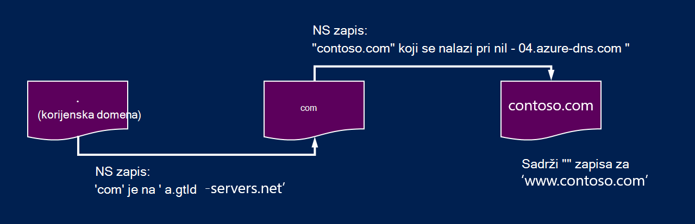
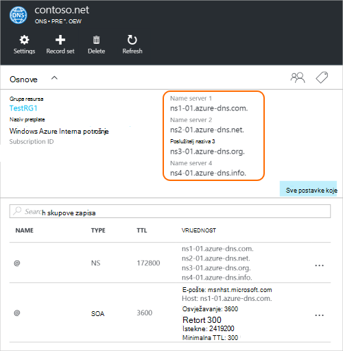

<properties
   pageTitle="Delegiranje vlastite domene u Azure DNS | Microsoft Azure"
   description="Objašnjenje kako promijeniti delegiranje domene i koristiti poslužitelje naziva Azure DNS-a za hostiranje domene."
   services="dns"
   documentationCenter="na"
   authors="sdwheeler"
   manager="carmonm"
   editor=""/>

<tags
   ms.service="dns"
   ms.devlang="na"
   ms.topic="get-started-article"
   ms.tgt_pltfrm="na"
   ms.workload="infrastructure-services"
   ms.date="06/30/2016"
   ms.author="sewhee"/>

# Delegat domene Azure DNS-a

Azure DNS omogućuje hostira DNS zone i upravlja DNS zapisima domene u Azure. Redoslijedom za upite DNS za domenu dosegne Azure DNS domene mora biti delegirana Azure DNS s nadređenom domene. Imajte na umu Azure DNS nije registrara domene. U ovom se članku objašnjava kako funkcionira delegiranje domene i delegatu domene Azure DNS-a.

## Kako funkcionira delegiranje DNS-a

### Domene i zone

Domain Name System je hijerarhiju domena. U hijerarhiji započinje s 'korijensku' domenu, čiji je naziv jednostavno "**.**".  Ispod nje potjecati domena najviše razine, kao što su "com', 'neto', 'ili',"Velika Britanija"ili"jp".  Ispod te je domena druge razine, kao što su 'org.uk' ili 'co.jp'.  I tako dalje. Domena u hijerarhiji DNS nalaze se na korištenje zasebnom DNS zone. Te zone se globalno distribuirali, hostira DNS poslužitelji naziva diljem svijeta.

**DNS zone**

Domena je jedinstveni naziv Domain Name System, primjerice "contoso.com". DNS zone koristi se za hostiranje DNS zapise za određene domene. Na primjer, domene "contoso.com" može sadržavati broj DNS zapisima, kao što su mail.contoso.com (za poslužitelj pošte) i www.contoso.com (za web-mjesto).

**Registrara domena**

Registru domena je tvrtka koja pružaju Internet naziva domena. Će potvrđuju ako je dostupan Internet domenu koju želite koristiti i omogućuju vam da biste ga kupiti. Kada je registrirana naziv domene, bit će vam se pravne vlasnik naziva domene. Ako već imate domenu na Internetu, koristit ćete trenutni registrar domene delegatu Azure DNS-a.

>[AZURE.NOTE] Da biste saznali dodatne informacije na koje je vlasnik naziva domene navedene ili informacije o tome kako kupiti domenu, potražite u članku [Upravljanje domenom Internet u Azure AD](https://msdn.microsoft.com/library/azure/hh969248.aspx).

### Razlučivost i delegiranje

Postoje dvije vrste DNS poslužitelji:

- _Mjerodavne_ DNS poslužitelj hostira DNS zone. Ga odgovore upite DNS zapisa u samo one zone.
- _Rekurzivne_ DNS poslužitelj hostira DNS zone. Ga tako da nazovete mjerodavne DNS poslužitelji da biste prikupili podatke potrebne odgovore sve DNS upite.

>[AZURE.NOTE] Azure DNS-a nudi mjerodavne DNS servis.  Ne nudi rekurzivne DNS servis.

> Servisi u oblaku i VMs u Azure automatski konfigurirana zasebno korištenja servisa za DNS rekurzivne koja se nudi kao dio Azure, Infrastruktura.  Informacije o tome kako promijeniti postavke DNS-a potražite [Razrješavanje imena u Azure](../virtual-network/virtual-networks-name-resolution-for-vms-and-role-instances.md#name-resolution-using-your-own-dns-server).

Klijenti za DNS u računala ili mobilnog uređaja obično nazovite rekurzivne DNS poslužitelj za izvođenje eventualne upite DNS-a potreban klijentske aplikacije.

Kada rekurzivne DNS poslužitelj primi upit za DNS zapis kao što je 'www.contoso.com', najprije ga treba pronaći naziv poslužitelja hostira zone za domenu "contoso.com". Da biste to učinili, datoteka započinje na poslužitelje naziva korijenski i iz nje pronalazi poslužitelje naziva koji se nalaze u zonu "com". Zatim se upiti poslužitelje naziva "com" da biste pronašli poslužitelje naziva koji se nalaze u zonu "contoso.com".  Na kraju se moći upita te naziv poslužitelja za "www.contoso.com".

To se naziva Razrješavanje DNS naziva. Isključivo govoreći, Razrješavanje DNS obuhvaća dodatni koraci kao što su sljedeće CNAMEs, no to nije važno objašnjenje kako funkcionira delegiranje DNS-a.

Kako ne nadređenog zone "pokažite" na poslužitelje naziva za dijete zonu? To čini pomoću posebnoj vrsti DNS zapis pod nazivom zapisa poslužitelja naziva (NS označava za "Poslužitelj naziva"). Ako, na primjer, osnovna zona sadrži NS zapise za "com", a prikazuje poslužitelje naziva 'com' zone. Zone 'com' u njoj NS zapise za "contoso.com", koji pokazuje poslužitelje naziva "contoso.com" zone. Postavljanje NS zapisa zone podređeni u zoni nadređenog zove prenošenjem domene.

Svaki delegiranje zapravo sadrži dvije kopije NS zapise; jedan u zoni nadređenog koja pokazuje na podređeni, a drugi u zoni podređeni sam. Zone 'contoso.com' sadrži NS zapise za contoso.com (osim NS zapise u "com"). One se nazivaju i mjerodavne NS zapise, a oni sjesti na vrh podređeni zone.

## Prenošenjem domene Azure DNS-a

Kada stvorite DNS zone u Azure DNS, morati postaviti NS zapise u zoni nadređenog da biste Azure DNS pouzdanih izvora za razlučivanje naziva zone. Kupiti od registrara domena, registrar nudi mogućnost za postavljanje tih zapisa poslužitelja naziva.

>[AZURE.NOTE] Ne morate vlasnik domene za stvaranje DNS zone tog naziva domene Azure DNS-a. Međutim, morate vlasništvo nad domenom da biste postavili delegiranje za Azure DNS-a kod registrara.

Na primjer, pretpostavimo domene "contoso.com" za kupnju i stvaranje zone s nazivom "contoso.com" u Azure DNS-a. Vlasnik domene registrar nudi mogućnost da biste konfigurirali adrese poslužitelja naziva (to jest, NS zapise) za svoju domenu. Na registrara će sadržavati te NS zapise u domeni nadređenog, u ovom slučaju ".com". Za svoju domenu u Azure DNS zone zatim preusmjereni klijenti diljem svijeta prilikom pokušaja Razrješavanje DNS zapisa u "contoso.com".

### Pronalaženje naziva poslužitelja naziva

Prije nego što možete delegirati ograničenu DNS zone za Azure DNS, najprije morate znati nazive poslužitelja naziva zone. Azure DNS poslužitelji naziva iz skupa dodjeljuje svakog zone.

Da biste vidjeli poslužitelje naziva koji je dodijeljen vašoj zoni najjednostavnije putem portala za Azure.  U ovom primjeru zone 'contoso.net' dodijeljeno poslužitelje naziva "kao ns1-01.azure-dns.com', 'ns2 01.azure dns .net', ' ns3-01.azure-dns.org', i" ns4-01.azure-dns.info':

 

Azure DNS automatski stvara mjerodavne NS zapise u vašoj zoni koja sadrži dodijeljene odrednice.  Da biste vidjeli nazive poslužitelja naziva putem Azure PowerShell ili EŽA Azure, jednostavno potrebno dohvatiti te zapise.

Pomoću komponente PowerShell Azure, mjerodavne NS zapise mogu biti dohvaćeni na sljedeći način. Imajte na umu da naziv zapisa “@” koristi se za upućivanje zapisa na vrh zone.

    PS> $zone = Get-AzureRmDnsZone –Name contoso.net –ResourceGroupName MyResourceGroup
    PS> Get-AzureRmDnsRecordSet –Name “@” –RecordType NS –Zone $zone

    Name              : @
    ZoneName          : contoso.net
    ResourceGroupName : MyResourceGroup
    Ttl               : 3600
    Etag              : 5fe92e48-cc76-4912-a78c-7652d362ca18
    RecordType        : NS
    Records           : {ns1-01.azure-dns.com, ns2-01.azure-dns.net, ns3-01.azure-dns.org,
                        ns4-01.azure-dns.info}
    Tags              : {}

Možete koristiti i Azure EŽA različite platforme za dohvaćanje mjerodavne NS zapise i zato otkrijte poslužitelje naziva koji je dodijeljen vašoj zoni:

    C:\> azure network dns record-set show MyResourceGroup contoso.net @ NS
    info:    Executing command network dns record-set show
        + Looking up the DNS Record Set "@" of type "NS"
    data:    Id                              : /subscriptions/.../resourceGroups/MyResourceGroup/providers/Microsoft.Network/dnszones/contoso.net/NS/@
    data:    Name                            : @
    data:    Type                            : Microsoft.Network/dnszones/NS
    data:    Location                        : global
    data:    TTL                             : 172800
    data:    NS records
    data:        Name server domain name     : ns1-01.azure-dns.com.
    data:        Name server domain name     : ns2-01.azure-dns.net.
    data:        Name server domain name     : ns3-01.azure-dns.org.
    data:        Name server domain name     : ns4-01.azure-dns.info.
    data:
    info:    network dns record-set show command OK

### Da biste postavili delegiranje

Svaki registrara ima vlastite alata za upravljanje DNS-a za promjenu zapisa poslužitelja naziva za domenu. Na stranici Upravljanje DNS-a za registrara na uređivanje NS zapise i zamijenite NS zapise s onima koji je stvorio Azure DNS.

Kada prenošenjem domene Azure DNS-a, morate koristiti nazive poslužitelja naziva nudi Azure DNS-a.  Koristite uvijek sve 4 naziv nazive poslužitelja, bez obzira na naziv vaše domene.  Delegiranje domene ne zahtijeva naziv poslužitelja naziva da biste koristili isti domena najviše razine kao vaše domene.

Nemojte koristiti "zalijepite zapisa" tako da pokazuje na Azure DNS naziv poslužitelja IP adrese, jer ti IP adrese u budućnosti može promijeniti. Delegations pomoću nazive poslužitelja naziva u vlastiti zonu, ponekad se zove "vanity poslužitelji imena" trenutno nisu podržani u Azure DNS.

### Da biste provjerili Razrješavanje naziva funkcionira

Nakon dovršetka postupka u delegiranje, možete provjeriti Razrješavanje naziva funkcionira li pomoću alata kao što su 'nslookup' upit SOA zapisa zone (koji se automatski stvara stvaranja zone).

Imajte na umu da morate navesti Azure DNS poslužitelji naziva, budući da normalno proces razrješenja DNS tražit će poslužitelje naziva automatski ako na delegiranje je postavljen ispravno.

    nslookup –type=SOA contoso.com

    Server: ns1-04.azure-dns.com
    Address: 208.76.47.4

    contoso.com
    primary name server = ns1-04.azure-dns.com
    responsible mail addr = msnhst.microsoft.com
    serial = 1
    refresh = 900 (15 mins)
    retry = 300 (5 mins)
    expire = 604800 (7 days)
    default TTL = 300 (5 mins)

## Delegiranje poddomene u Azure DNS

Ako želite postaviti zasebne podređeni zonu, možete delegirati ograničenu poddomenu u Azure DNS. Ako, na primjer, imate postavljanje i ovlaštenog "contoso.com" u Azure DNS pretpostavimo da želite postaviti u zasebne podređeni zonu 'partners.contoso.com'.

Kao obični delegiranje postavljanju podređenu domene slijedi slične procesa. Jedina razlika koje je u 3 NS zapisi moraju se stvoriti u zoni nadređenog contoso.com Azure DNS umjesto postavljaju putem registrara domena.

1. Stvaranje podređene zone 'partners.contoso.com' u Azure DNS-a.
2. Traženje mjerodavne NS zapise u zoni podređeni da biste dobili poslužitelje naziva hosting zone podređeni u Azure DNS.
3. Delegiranje zone podređeni konfiguriranjem NS zapise u zoni nadređenog koja pokazuje na podređeni zone.

### Da biste delegatu podređenu domene

U sljedećem primjeru PowerShell pokazuje kako to funkcionira. Isti se koraci mogu izvršiti putem portala za Azure ili putem EŽA za različite platforme Azure.

#### Korak 1. Stvaranje nadređenog i podređenog zone

Najprije ćemo stvoriti nadređenog i podređenog zone. To može biti u istoj grupi resursa ili grupe različitih resursa.

    $parent = New-AzureRmDnsZone -Name contoso.com -ResourceGroupName RG1
    $child = New-AzureRmDnsZone -Name partners.contoso.com -ResourceGroupName RG1

#### Korak 2. Dohvaćanje NS zapise

Nakon toga ne možemo dohvatiti mjerodavnih NS zapise iz podređene zone kao što je prikazano u sljedećem primjeru.  Sadrži poslužitelje naziva dodijeljene podređeni zone.

    $child_ns_recordset = Get-AzureRmDnsRecordSet -Zone $child -Name "@" -RecordType NS

#### Korak 3. Delegat podređeni zone

Stvorite odgovarajuće NS zapis postaviti u zoni nadređenog da biste dovršili za delegiranje. Imajte na umu da u skup zapisa naziv u zoni nadređenog nazivu podređeni zone, u ovom slučaju "partneri".

    $parent_ns_recordset = New-AzureRmDnsRecordSet -Zone $parent -Name "partners" -RecordType NS -Ttl 3600
    $parent_ns_recordset.Records = $child_ns_recordset.Records
    Set-AzureRmDnsRecordSet -RecordSet $parent_ns_recordset

### Da biste provjerili Razrješavanje naziva funkcionira

Možete provjeriti je li sve ispravno postavljen traženjem SOA zapisa zone podređenih.

    nslookup –type=SOA partners.contoso.com

    Server: ns1-08.azure-dns.com
    Address: 208.76.47.8

    partners.contoso.com
        primary name server = ns1-08.azure-dns.com
        responsible mail addr = msnhst.microsoft.com
        serial = 1
        refresh = 900 (15 mins)
        retry = 300 (5 mins)
        expire = 604800 (7 days)
        default TTL = 300 (5 mins)

## Daljnji koraci

[Upravljanje DNS zone](dns-operations-dnszones.md)

[Upravljate DNS zapisima](dns-operations-recordsets.md)

