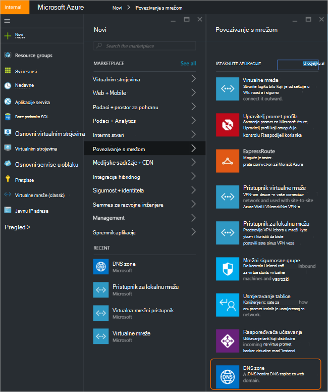
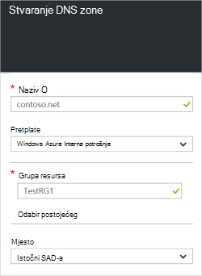
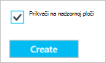
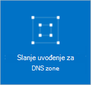
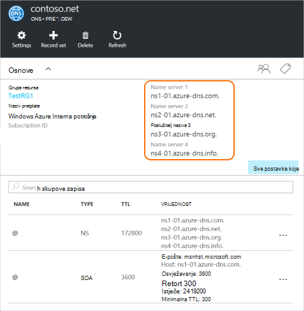
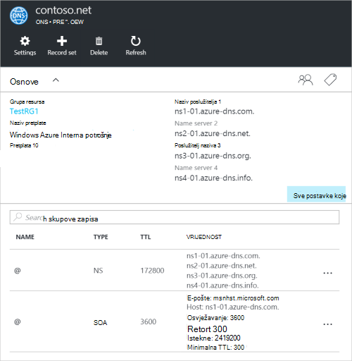

<properties
   pageTitle="Kako stvoriti i upravljanje DNS zone na portalu za Azure | Microsoft Azure"
   description="Saznajte kako stvoriti DNS zone za Azure DNS. Ovo je Postupni vodič za stvaranje i upravljanje DNS-a prvi i pokretanje hostiranje DNS-a domene pomoću portala za Azure."
   services="dns"
   documentationCenter="na"
   authors="sdwheeler"
   manager="carmonm"
   editor=""
   tags="azure-resource-manager"/>

<tags
   ms.service="dns"
   ms.devlang="na"
   ms.topic="article"
   ms.tgt_pltfrm="na"
   ms.workload="infrastructure-services"
   ms.date="08/16/2016"
   ms.author="sewhee"/>

# Stvaranje DNS zone na portalu za Azure

> [AZURE.SELECTOR]
- [Portal za Azure](dns-getstarted-create-dnszone-portal.md)
- [PowerShell](dns-getstarted-create-dnszone.md)
- [Azure EŽA](dns-getstarted-create-dnszone-cli.md)

U ovom se članku će vas voditi kroz korake da biste stvorili DNS zone pomoću portala za Azure. Možete stvoriti i pomoću programa PowerShell ili EŽA DNS zone.

[AZURE.INCLUDE [dns-create-zone-about](../../includes/dns-create-zone-about-include.md)]

### O oznake za Azure DNS-a

Oznake su popis parove naziv vrijednosti i koriste Azure resursa Upravitelj na natpis resurse za naplatu ili grupiranja svrhe. Dodatne informacije o oznake potražite u članku [Korištenje oznake da biste organizirali Azure resurse](../resource-group-using-tags.md).

Dodavanje oznaka na portalu za Azure pomoću plohu **Postavke** za DNS zone.

## Stvaranje DNS zone

1. Prijavite se na portal za Azure

2. Na izborniku koncentrator kliknite pa **Novo > umrežavanje >** pa kliknite **DNS zone** da biste otvorili plohu zone DNS-a.

    

3. Na plohu **DNS zone** na dnu kliknite **Stvori** . Otvorit će se plohu za **Stvaranje DNS zone** .

    

4. Na plohu **Stvaranje DNS zone** naziv DNS zone. Primjerice, *contoso.com*. Potražite u članku [O DNS Zone nazive](#names) u prethodnom odjeljku.

5. Nakon toga navedite grupu resursa koju želite koristiti. Možete stvoriti novu grupu resursa ili odabrati neki koji već postoji.

6. Na padajućem izborniku **lokacije** , navedite mjesto grupu resursa. Imajte na umu da ova postavka upućuje na mjesto grupa resursa, a ne web-lokaciju DNS zone. Stvarni DNS zone resursa automatski "globalni" i nije nešto što možete (ili morati) odredite na portalu.

7. Možete ostaviti **Prikvači na nadzornoj ploči** potvrdni okvir ako želite jednostavno pronaći vaše nove zone na nadzornu ploču. Zatim kliknite **Stvori**.

    

8. Kada kliknete Stvori, vidjet ćete svoje nove zone konfiguriranje na nadzornoj ploči.

    

9. Pri stvaranju novu zonu plohu nove zone će se otvoriti na nadzornoj ploči.

## Prikaz zapisa

Stvaranje DNS zone stvara se sljedeći podaci:

- Zapis "Pokretanje izvora" (SOA). U SOA nalazi se u korijenu svaki DNS zone.
- Na mjerodavne zapisa poslužitelja naziva (NS) zapisa. Te prikazati koji naziv poslužitelja hostira zone. Azure DNS koristi skup poslužitelje naziva i tako da drugi poslužitelje naziva može biti dodijeljena različitim zonama u Azure DNS. Dodatne informacije potražite u članku [delegat domene Azure DNS-a](dns-domain-delegation.md) .

Možete prikazati zapise s portala za Azure

1. Plohu vaš **DNS zone** kliknite **sve postavke** da biste otvorili **Postavke plohu** za DNS zone.

    

2. U donjem dijelu okna Essentials, vidjet ćete zapis postavlja DNS zone.

    

## Test

Pomoću alata za DNS kao što su nslookup, istražujte ili [cmdlet ljuske PowerShell za rješavanje DnsName](https://technet.microsoft.com/library/jj590781.aspx)možete testirati i DNS zone.

Ako još niste delegirani vaše domene koje želite koristiti novu zonu u Azure DNS-a, morat ćete izravno DNS upit izravno na neki od poslužitelje naziva zone. Poslužitelje naziva zone ponudit će vam u NS zapise, kao što je navedeno po `Get-AzureRmDnsRecordSet` iznad. Je li zamjenu odgovarajuće vrijednosti za vašu zonu u nastavku naredbu.

    nslookup
    > set type=SOA
    > server ns1-01.azure-dns.com
    > contoso.com

    Server: ns1-01.azure-dns.com
    Address:  208.76.47.1

    contoso.com
            primary name server = ns1-01.azure-dns.com
            responsible mail addr = msnhst.microsoft.com
            serial  = 1
            refresh = 900 (15 mins)
            retry   = 300 (5 mins)
            expire  = 604800 (7 days)
            default TTL = 300 (5 mins)

## Brisanje DNS zone

Možete izbrisati DNS zone izravno na portalu. Prije brisanja DNS zone u Azure DNS, morate izbrisati sve skupove zapisa, osim NS i SOA zapise u korijenu zoni stvoreni automatski kada je stvorena u zonu.

1. Pronađite plohu **DNS zone** za zonu koju želite izbrisati, a zatim kliknite **Izbriši** pri vrhu na plohu.

2. Pojavit će se poruka vas obavijestiti o tome da morate izbrisati sve skupove zapisa, osim NS i SOA zapise koji se automatski stvara. Ako ste izbrisali svoje skupove zapisa, kliknite **da**. Imajte na umu da prilikom brisanja DNS zone na portalu, neće se izbrisati grupu resursa koji je pridružen DNS zone.

## Daljnji koraci

Nakon stvaranja DNS zone, stvaranje [skupa zapisa i zapisa](dns-getstarted-create-recordset-portal.md) da biste pokrenuli raščlanjuju imena za svoju domenu Internet.
