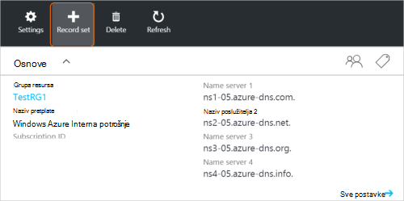
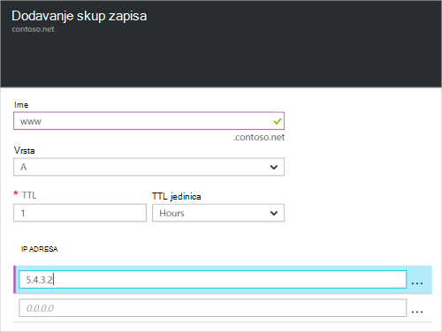

<properties
   pageTitle="Stvaranje skupu zapisa i zapisa za DNS Zone pomoću portala za Azure | Microsoft Azure"
   description="Stvaranje zapisa za glavno računalo za Azure DNS i stvaranje skupove zapisa i zapisa pomoću portala za Azure"
   services="dns"
   documentationCenter="na"
   authors="sdwheeler"
   manager="carmonm"
   editor=""
   tags="azure-resource-manager"/>

<tags
   ms.service="dns"
   ms.devlang="na"
   ms.topic="article"
   ms.tgt_pltfrm="na"
   ms.workload="infrastructure-services"
   ms.date="08/16/2016"
   ms.author="sewhee"/>

# Stvaranje DNS zapisa skupova i zapise pomoću portala za Azure

> [AZURE.SELECTOR]
- [Portal za Azure](dns-getstarted-create-recordset-portal.md)
- [PowerShell](dns-getstarted-create-recordset.md)
- [Azure EŽA](dns-getstarted-create-recordset-cli.md)

U ovom se članku vodit će vas kroz postupak stvaranja zapisa i skupova zapisa pomoću portala za Azure. Kada stvorite DNS zone, dodajte DNS zapise za svoju domenu. Da biste to učinili, najprije morate razumjeti DNS zapise i skupove zapisa.

[AZURE.INCLUDE [dns-about-records-include](../../includes/dns-about-records-include.md)]

## Stvaranje skup zapisa i zapisa

U sljedećem primjeru vodit će vas kroz postupak stvaranja skup zapisa i zapisa pomoću portala za Azure. Ćemo koristiti vrstu zapisa DNS "A".

1. Prijavite se na portal.

2. Idite na plohu **DNS zone** u kojoj želite stvoriti skupu zapisa.

3. Pri vrhu plohu **DNS zone** , odaberite **Postavljanje zapisa** da biste otvorili plohu **Postavljanje Dodavanje zapisa** .

    

4. Na plohu **Dodavanje zapisa postavite** naziv vaše skup zapisa. Na primjer, dodjeljujete naziv vaše skup zapisa "**www**".

    

5. Odaberite vrstu zapisa koju želite stvoriti. Na primjer, odaberite **A**.

6. Postavite **TTL**. Zadano vrijeme Live na portalu je jedan sat.

7. Dodavanje IP adrese IP adresu po retku. Kada koristite predloženi skup zapisa naziv i vrsta zapisa ranije, dodajte IPv4 adresa **A** zapisa za skup zapisa "www".

8. Kada završite s dodavanjem IP adrese, odaberite **u redu** pri dnu zaslona u plohu. Stvorit će se skup zapisa DNS-a.

## Daljnji koraci

Da biste upravljali skup zapisa i zapisa, potražite u članku [Upravljanje DNS zapisima i zapis postavlja pomoću portala za Azure](dns-operations-recordsets-portal.md).

Dodatne informacije o Azure DNS potražite u članku [Pregled Azure DNS-a](dns-overview.md).
