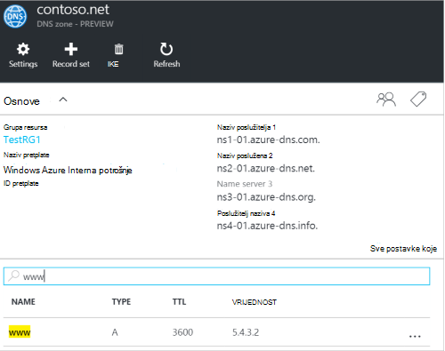
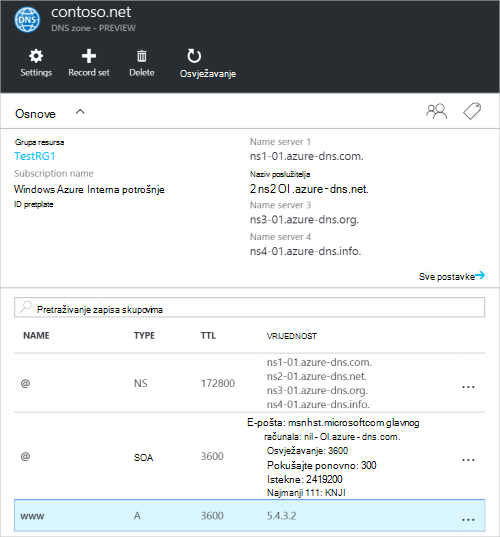
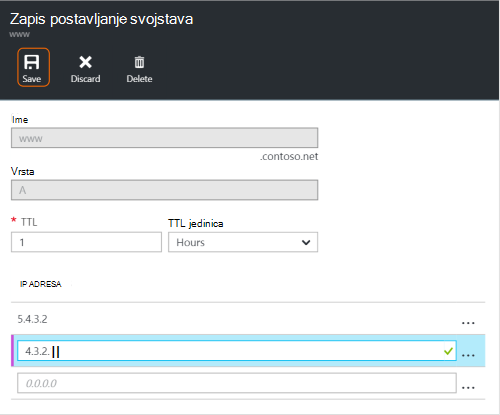
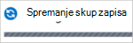
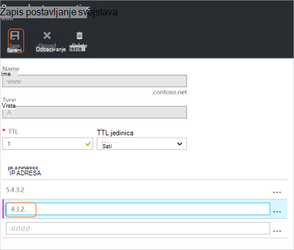
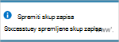
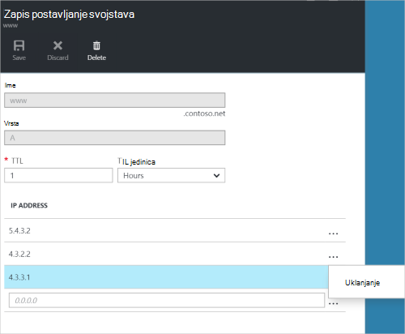
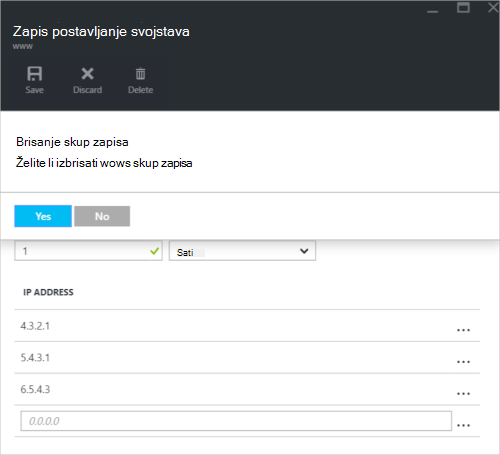

<properties
   pageTitle="Upravljanje DNS zapisa skupova i zapise pomoću portala za Azure | Microsoft Azure"
   description="Upravljanje DNS zapis postavlja i zapisa kada hostiranje vaše domene na Azure DNS-a."
   services="dns"
   documentationCenter="na"
   authors="sdwheeler"
   manager="carmonm"
   editor=""
   tags="azure-resource-manager"/>

<tags
   ms.service="dns"
   ms.devlang="na"
   ms.topic="article"
   ms.tgt_pltfrm="na"
   ms.workload="infrastructure-services"
   ms.date="08/16/2016"
   ms.author="sewhee"/>

# Upravljate DNS zapisima, a zapis postavlja pomoću portala za Azure

> [AZURE.SELECTOR]
- [Portal za Azure](dns-operations-recordsets-portal.md)
- [Azure EŽA](dns-operations-recordsets-cli.md)
- [PowerShell](dns-operations-recordsets.md)

U ovom se članku objašnjava upravljanje skupove zapisa i zapisa zone DNS-a pomoću portala za Azure.

Važno je da razlika između skupove zapisa u DNS-a i pojedinačne DNS zapisa. Skup zapisa je skup zapisa u zoni koji imaju isti naziv i imaju iste vrste. Dodatne informacije potražite u članku [Stvaranje DNS zapisa skupova i zapise pomoću portala za Azure](dns-getstarted-create-recordset-portal.md).

## Stvorite novi skup zapisa i zapisa

Da biste stvorili zapis postavljanje na portalu za Azure, potražite u članku [Stvaranje DNS zapisa pomoću portala za Azure](dns-getstarted-create-recordset-portal.md).

## Prikaz skupu zapisa

1. Na portalu Azure otvorite plohu **DNS zone** .

2. Traženje skup zapisa i odaberite ga. Otvorit će se svojstva skup zapisa.

    

## Dodavanje novog zapisa u skupu zapisa

Možete dodati do 20 zapisa bilo koji skup zapisa. Skup zapisa ne smije sadržavati dva zapisa jednake. Prazan skupove zapisa (s nulom zapisa) mogu se kreirati, ali ne prikazuju se na poslužitelje naziva Azure DNS-a. Skupove zapisa vrste CNAME najviše mogu sadržavati jedan zapis.

1. Na plohu **zapis postavljanje svojstava** za DNS zone kliknite željeni skup zapisa da biste dodali zapis na.

    

2. Navedite zapis postaviti svojstva tako da ispunite polja.

    

2. Kliknite **Spremi** pri vrhu na plohu da biste spremili postavke. Zatvorite u plohu.

3. U kutu, vidjet ćete da je spremite zapis.

    

Nakon spremanja zapisa vrijednosti na plohu **DNS zone** odražavaju novi zapis.

## Ažuriranje zapisa

Prilikom ažuriranja zapisa u postojeći skup zapisa, polja možete ažurirati ovise o vrsti zapisa s kojom radite.

1. Traženje zapis plohu **zapis postavljanje svojstava** za vaše skup zapisa.

2. Izmijenite zapis. Kada mijenjate zapisa, možete promijeniti dostupne postavke za zapis. U sljedećem primjeru je odabrano polje **IP adresa** , a zatim mu je u tijeku onemogućiti izmjenu IP adresa.

    

3. Kliknite **Spremi** pri vrhu na plohu da biste spremili postavke. U gornjem desnom kutu, prikazat će vam obavijest koji je spremljen na zapis.

    

Nakon spremanja zapisa vrijednosti za zapis postavljena na plohu **DNS zone** odražavaju ažurirani zapis.

## Uklanjanje zapisa u skupu zapisa

Portal za Azure možete koristiti da biste uklonili zapisa u skupu zapisa. Imajte na umu da uklanjanjem posljednji zapis u skupu zapisa ne briše skup zapisa.

1. Traženje zapis plohu **zapis postavljanje svojstava** za vaše skup zapisa.

2. Kliknite zapis koji želite ukloniti. Zatim odaberite **Ukloni**.

    

3. Kliknite **Spremi** pri vrhu na plohu da biste spremili postavke.

3. Nakon uklanjanja zapis vrijednosti za zapis u **DNS zone** plohu odražavaju uklanjanje.

## Brisanje skupu zapisa

1. Na **zapis postavite svojstva** plohu za zapis o postaviti, kliknite **Izbriši**.

    

2. Se pojavljuje poruka koja vas pita želite li izbrisati skup zapisa.

3. Provjerite podudara li se naziv skup zapisa koju želite izbrisati, a zatim kliknite **da**.

4. Na plohu **DNS zone** skup zapisa provjerite je li više nisu vidljivi.

## Rad sa zapisima NS i SOA

NS i SOA zapise koji se automatski stvaraju se upravlja drugačije iz drugih vrsta zapisa.

### Izmjena SOA zapisa

Ne možete dodavati niti uklonite zapise iz automatski stvoreni SOA zapisa postavite na vrh zone (naziv = "@"). Međutim, možete mijenjati sve parametre zapisa SOA (osim "glavnog računala)" i zapisa postavite TTL.

### Izmjena NS zapisi na vrh zone

Nije moguće dodavanje, uklanjanje ili mijenjanje zapisa u automatski stvoreni NS zapis postavljeno na vrh zone (naziv = "@"). Samo promjene koje je dopušteno je da biste izmijenili skup zapisa TTL.

### Brisanje skupove SOA ili NS zapisa

Ne možete izbrisati s SOA i postavlja NS zapisa pri vrh zone (naziv = "@") koji se stvaraju automatski prilikom stvaranja zone. Oni se automatski brišu nakon što izbrišete zone.

## Daljnji koraci

-   Dodatne informacije o Azure DNS potražite u članku [Pregled Azure DNS-a](dns-overview.md).
-   Dodatne informacije o automatizaciji DNS potražite u članku [Stvaranje DNS zone i zapis postavlja pomoću .NET SDK-a](dns-sdk.md).
-   Dodatne informacije o obrnutim DNS zapisa potražite [u](dns-reverse-dns-record-operations-ps.md)članku Upravljanje obrnutim DNS zapise za vaše servise pomoću komponente PowerShell.
