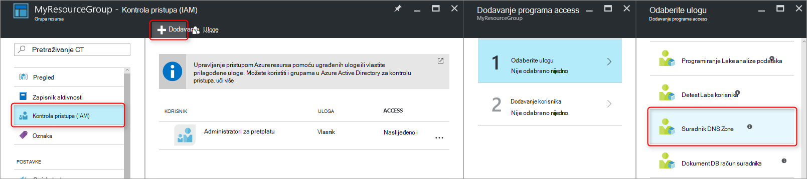
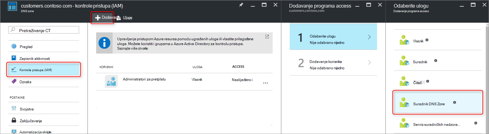
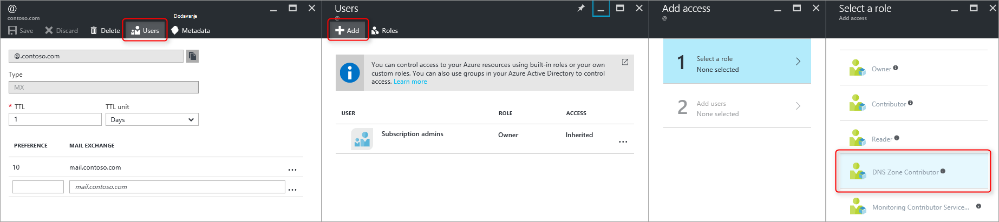
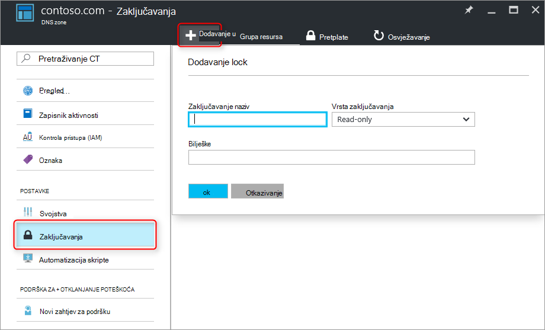

<properties 
   pageTitle="Zaštita DNS zone i zapisi | Microsoft Azure" 
   description="Kako se zaštititi DNS zone i skupove zapisa u Microsoft Azure DNS." 
   services="dns" 
   documentationCenter="na" 
   authors="jtuliani" 
   manager="carmonm" 
   editor=""/>

<tags
   ms.service="dns"
   ms.devlang="na"
   ms.topic="article"
   ms.tgt_pltfrm="na"
   ms.workload="infrastructure-services" 
   ms.date="10/20/2016"
   ms.author="jtuliani"/>

# Kako zaštititi DNS zone i zapisa

DNS zone i zapisi su ključnih resursi. Brisanje DNS zone ili čak i samo jedan DNS zapis može rezultirati ukupni servis prekida.  Stoga je važno su zaštićeni od neovlaštenog ili slučajne promjene ključnih DNS zone i zapisa.

U ovom se članku objašnjava kako Azure DNS omogućuje zaštitu DNS zone i zapise u odnosu na takve promjene.  Ne možemo Primjena dva sigurnost napredne značajke omogućene Azure resursa Upravitelj: [Kontrola pristupa na temelju uloga](../active-directory/role-based-access-control-what-is.md) i [ograničenja resursa](../resource-group-lock-resources.md).

## Kontrola pristupa na temelju uloga

Azure na temelju uloga pristup kontrola (RBAC) omogućuje upravljanje preciznije pristup za Azure korisnike, grupe i resurse. Korištenje RBAC, možete dodijeliti točno razinu pristupa korisnici moraju da svoje zadatke. Dodatne informacije o tome kako RBAC pomaže Upravljanje pristupom potražite u članku [što je na temelju uloga kontrola pristupa](../active-directory/role-based-access-control-what-is.md).

### Uloga "DNS Zone suradnika"

Uloga 'DNS Zone suradnika' je ugrađene uloga nudi Azure za upravljanje DNS-a resursi.  Dodjela dozvola DNS Zone suradničke korisniku ili grupi omogućuje te grupe da biste upravljali DNS resursa, ali ne resursi bilo koju drugu vrstu.

Na primjer, pretpostavimo grupu resursa 'myzones' sadrži pet zone za Tvrtka Contoso. Dodjelu DNS administrator 'DNS Zone suradničke' dozvole u toj grupi resursa, omogućuje potpunu kontrolu nad te DNS zone. Također izbjegava dodjelu nepotrebne dozvola, primjerice DNS administrator nije moguće stvoriti ili prekid virtualnim strojevima.

Da biste dodijelili dozvole RBAC najlakše [putem portala za Azure](../active-directory/role-based-access-control-configure.md).  Otvorite plohu 'Kontrole pristupa (IAM)' za grupu resursa, zatim kliknite "Dodaj", a zatim odaberite ulogu "DNS Zone suradnika" i odaberite potrebne korisnike ili grupe da biste dodijelili dozvole.

Dozvole može biti [odobren pomoću komponente PowerShell Azure](../active-directory/role-based-access-control-manage-access-powershell.md):

    # Grant 'DNS Zone Contributor' permissions to all zones in a resource group
    New-AzureRmRoleAssignment -SignInName <user email address> -RoleDefinitionName "DNS Zone Contributor" -ResourceGroupName <resource group name>

Ekvivalentan naredba je [dostupan putem EŽA Azure](../active-directory/role-based-access-control-manage-access-azure-cli.md):

    # Grant 'DNS Zone Contributor' permissions to all zones in a resource group
    azure role assignment create --signInName  <user email address> --roleName "DNS Zone Contributor" --resourceGroup <resource group name>

### Zone razinu RBAC

Azure RBAC pravila se mogu primijeniti na pretplatu, grupu resursa ili pojedinačnog resursa. U slučaju Azure DNS resursa može biti pojedinačne DNS zone ili čak i za pojedinačne skup zapisa.

Na primjer, pretpostavimo grupu resursa 'myzones' sadrži zone "contoso.com" i na subzone 'customers.contoso.com' stvaraju CNAME zapisa za svaki račun kupca.  Račun koji se koristi za upravljanje te CNAME zapise treba dodijeliti dozvole za stvaranje zapisa u zoni 'customers.contoso.com' samo, trebali biste imati pristup da biste druge zone.

Zone razinom RBAC dozvole se mogu dodijeliti putem portala za Azure.  Otvorite plohu 'Kontrole pristupa (IAM)' zone, zatim kliknite "Dodaj", a zatim odaberite ulogu "DNS Zone suradnika" i odaberite potrebne korisnike ili grupe da biste dodijelili dozvole.

Dozvole može biti [odobren pomoću komponente PowerShell Azure](../active-directory/role-based-access-control-manage-access-powershell.md):

    # Grant 'DNS Zone Contributor' permissions to a specific zone
    New-AzureRmRoleAssignment -SignInName <user email address> -RoleDefinitionName "DNS Zone Contributor" -ResourceGroupName <resource group name> -ResourceName <zone name> -ResourceType Microsoft.Network/DNSZones

Ekvivalentan naredba je [dostupan putem EŽA Azure](../active-directory/role-based-access-control-manage-access-azure-cli.md):

    # Grant 'DNS Zone Contributor' permissions to a specific zone
    azure role assignment create --signInName <user email address> --roleName "DNS Zone Contributor" --resource-name <zone name> --resource-type Microsoft.Network/DNSZones --resource-group <resource group name>

### Zapis Postavljanje razine RBAC

Ne možemo možete dodatno vratiti jedan korak. Razmislite o administrator e-pošte za Tvrtka Contoso koji treba pristup MX i TXT zapisa na vrh zone "contoso.com".  Korisnik ne mora imati pristup za sve ostale MX ili TXT zapise ili na bilo koji zapis bilo koju drugu vrstu.  Azure DNS omogućuje vam da biste precizno zapise koje administrator e-pošte treba pristup dodijelili dozvole na razini skup zapisa.  Administrator e-pošte moguć je točno kontrolu ona mora, a ne može unesite željene promjene.
  
Razine dozvola za RBAC skup zapisa mogu konfigurirati putem Azure portal pomoću gumba "Korisnici" plohu skup zapisa:

Razine dozvola za RBAC skup zapisa može biti [odobren pomoću komponente PowerShell Azure](../active-directory/role-based-access-control-manage-access-powershell.md):

    # Grant permissions to a specific record set
    New-AzureRmRoleAssignment -SignInName <user email address> -RoleDefinitionName "DNS Zone Contributor" -Scope "/subscriptions/<subscription id>/resourceGroups/<resource group name>/providers/Microsoft.Network/dnszones/<zone name>/<record type>/<record name>" 

Ekvivalentan naredba je [dostupan putem EŽA Azure](../active-directory/role-based-access-control-manage-access-azure-cli.md):

    # Grant permissions to a specific record set
    azure role assignment create --signInName <user email address> --roleName "DNS Zone Contributor" --scope "/subscriptions/<subscription id>/resourceGroups/<resource group name>/providers/Microsoft.Network/dnszones/<zone name>/<record type>/<record name>"

### Prilagođene uloge

Ugrađeni ulogu 'DNS Zone suradnika' omogućuje potpunu kontrolu nad DNS resursa. I moguće je da biste sastavili vlastiti kupca Azure uloge, možete unijeti čak i precizniji-grained kontrolu.

Preporučujemo da ponovno primjer nastaje CNAME zapis u zoni 'customers.contoso.com' za svaki račun kupca Tvrtka Contoso.  Račun koji se koristi za upravljanje te CNAMEs treba dodijeliti dozvolu za upravljanje samo CNAME zapisa.  Zatim je nije moguće mijenjati zapise drugih vrsta (kao što su promjena MX zapisa) ili izvođenje zone razinom operacija poput Izbriši zone.

Sljedeći primjer prikazuje definicije prilagođene uloge za upravljanje samo CNAME zapisa:

    {
        "Name": "DNS CNAME Contributor",
        "Id": "",
        "IsCustom": true,
        "Description": "Can manage DNS CNAME records only.",
        "Actions": [
            "Microsoft.Network/dnsZones/CNAME/*",
            "Microsoft.Network/dnsZones/read",
            "Microsoft.Authorization/*/read",
            "Microsoft.Insights/alertRules/*",
            "Microsoft.ResourceHealth/availabilityStatuses/read",
            "Microsoft.Resources/deployments/*",
            "Microsoft.Resources/subscriptions/resourceGroups/read",
            "Microsoft.Support/*"
        ],
        "NotActions": [
        ],
        "AssignableScopes": [
            "/subscriptions/ c276fc76-9cd4-44c9-99a7-4fd71546436e"
        ]
    }

Svojstvo akcija definira sljedeće DNS specifične dozvole:

- `Microsoft.Network/dnsZones/CNAME/*`daje potpunu kontrolu nad CNAME zapisa
- `Microsoft.Network/dnsZones/read`Dodijeli dozvole za čitanje DNS zone, ali nije ih želite mijenjati, omogućujući vam da biste vidjeli zonu u kojoj je stvoren u CNAME.

Preostali akcije kopiraju iz [ugrađenih ulogu suradnika DNS Zone](../active-directory/role-based-access-built-in-roles.md#dns-zone-contributor).

>[AZURE.NOTE] Korištenje prilagođene uloge RBAC da biste spriječili brisanje zapisa skupovima dok se i dalje što im omogućuje da ažurirate nije važeća kontrola. Skupovi zapis onemogućuje brisanja, no to ga neće spriječiti ih onemogućiti izmjenu.  Dopušteno izmjene obuhvaćaju Dodavanje i uklanjanje zapisa s skup zapisa, uključujući uklonite sve zapise da biste napustili 'prazan skup zapisa. To ima isti učinak kao i brisanje zapisa postavite od perspektivu za razrješavanje DNS-a.

Definicija prilagođene uloga trenutno ne može biti definiran putem portala za Azure. Prilagođeni ulogu na temelju ove definicije uloga moguće stvoriti pomoću Azure PowerShell:

    # Create new role definition based on input file
    New-AzureRmRoleDefinition -InputFile <file path>

Mogu se kreirati i putem EŽA Azure:

    # Create new role definition based on input file
    azure role create –inputfile <file path>

Uloga mogu zatim dodijeliti na isti način kao ugrađene uloge, kao što je opisano u ovom članku.

Dodatne informacije o stvaranju kojima upravljate, i dodjeljivanje prilagođene uloge, pročitajte članak [Prilagođene uloge u Azure RBAC](../active-directory/role-based-access-control-custom-roles.md).

## Ograničenja resursa

Osim RBAC, Voditelj resursa Azure podržava neku drugu vrstu kontrole za sigurnost, odnosno mogućnost "zaključani" resursi. Gdje RBAC pravila omogućuju kontrolu akcije određene korisnike i grupe, resursa zaključavanja primjenjuju se na resursa, te su učinkoviti preko svih korisnika i uloga. Dodatne informacije potražite u članku [Lock resursi s Azure Voditelj resursa](../resource-group-lock-resources.md).

Postoje dvije vrste resursa lock: **DoNotDelete** i **samo za čitanje**. Te se mogu primijeniti u zonu DNS-a ili za pojedinačne skup zapisa.  U sljedećim odjeljcima opisuju nekoliko uobičajeni scenariji te kako ih podržava pomoću zaključavanja resursa.

### Zaštita protiv sve promjene

Da biste spriječili sve promjene u tijeku, primijenite zaključati samo za čitanje u zonu.  To sprječava novi skupovi zapisa koji se stvaraju te postojeće skupove zapisa iz promijenili ili izbrisali.

Zaključavanja zone razine resursa možete stvoriti putem portala za Azure.  Zone plohu DNS kliknite "Zaključavanja", zatim "Add":

Zone razinom resursa zaključavanja mogu stvoriti i putem Azure PowerShell:

    # Lock a DNS zone
    New-AzureRmResourceLock -LockLevel <lock level> -LockName <lock name> -ResourceName <zone name> -ResourceType Microsoft.Network/DNSZones -ResourceGroupName <resource group name> 

Konfiguriranje Azure resursa zaključavanja trenutno nisu podržani putem EŽA Azure.

### Zaštita pojedinačnih zapisa
Da biste spriječili postojećeg DNS zapisa postavite na temelju izmjene, primijeniti samo za čitanje lock skup zapisa.

>[AZURE.NOTE] Primjena DoNotDelete zaključavanja na skupu zapisa nije važeća kontrole. Ne dopušta postavljanje od brisanja zapisa, no to ga neće spriječiti ga onemogućiti izmjenu.  Dopušteno izmjene obuhvaćaju Dodavanje i uklanjanje zapisa s skup zapisa, uključujući uklonite sve zapise da biste napustili 'prazan skup zapisa. To ima isti učinak kao i brisanje zapisa postavite od perspektivu za razrješavanje DNS-a.

Skup slogova razine resursa zaključavanja trenutno možete biti samo konfiguriran pomoću komponente PowerShell Azure.  Nije podržana u Azure portal ili Azure EŽA.

    # Lock a DNS record set
    New-AzureRmResourceLock -LockLevel <lock level> -LockName <lock name> -ResourceName <zone name>/<record set name> -ResourceType Microsoft.Network/DNSZones/<record type> -ResourceGroupName <resource group name> 

### Zaštita protiv brisanja zone

Nakon brisanja zonu u Azure DNS brišu se i sve skupove zapisa u zoni.  Ovaj postupak ne može poništiti.  Slučajno izbrišete ključnih zone ima mogle imati utjecaj znatnog tvrtke.  Stoga je važno da biste zaštitili zone nenamjerno brisanje.

Primjena DoNotDelete zaključavanja u zonu onemogućuje zoni brisanja.  Međutim, budući da zaključavanja nasljeđuju podređeni resursima, je također sprječava sve skupove zapisa u zoni od brisanja, koja može biti neželjenog.  Osim toga, kao što je opisano u bilješci iznad, preporučuje se i Neučinkovit jer zapise i dalje mogu se ukloniti iz postojeće skupove zapisa.

Umjesto toga, razmislite o primjene DoNotDelete zaključavanja zapisa u zonu, kao što je skup zapisa SOA.  Budući da u zonu nije moguće izbrisati bez i brisanje skupove zapisa, to štiti od brisanja zone, istovremeni i dalje skupove zapisa u zoni slobodno izmijeniti. Ako je došlo je do pokušaja brisanje zoni, Voditelj resursa Azure otkriva to želite izbrisati i skup zapisa SOA i blokira poziv jer je zaključan na SOA.  Nema zapisa postavlja se briše.

Sljedeću naredbu komponente PowerShell stvara DoNotDelete lock protiv SOA zapis o određenoj zoni:

    # Protect against zone delete with DoNotDelete lock on the record set
    New-AzureRmResourceLock -LockLevel DoNotDelete -LockName <lock name> -ResourceName <zone name>/@ -ResourceType Microsoft.Network/DNSZones/SOA -ResourceGroupName <resource group name> 

Drugi način da biste spriječili brisanje slučajne zone je pomoću prilagođenih uloga da biste bili sigurni operator i servisa račune koji se koriste za upravljanje zona na imaju zone brisanje dozvola. Kada je potrebno da biste izbrisali zonu, možete nametnuti dva koraka Izbriši, prvi Izbriši dozvole dodjelu zone (na opseg zone da biste spriječili brisanje pogrešan zone) i druge da biste izbrisali zone.

Drugi odlučile ima prednost koji odgovara sve zone pristupa te račune bez potrebe za Imajte na umu da biste stvorili neki zaključavanja. Ima nedostatak da svih računa s dozvolama za brisanje zone, kao što su vlasnik pretplate možete i dalje slučajno izbrišete ključnih zone.

Nije moguće koristiti oba pristupa - zaključavanja resursa i prilagođene uloge - u isto vrijeme kao obrane u dubine pristup zaštita DNS zone.

## Daljnji koraci

- Dodatne informacije o radu s RBAC potražite u članku [Početak rada s upravljanjem pristup portalu za Azure](../active-directory/role-based-access-control-what-is.md). 
- Dodatne informacije o radu s zaključavanja resursa potražite u članku [Lock resursi s Azure Voditelj resursa](../resource-group-lock-resources.md).
- Dodatne informacije o zaštiti Azure resursa potražite u članku [Sigurnosna pitanja vezana uz za Azure Voditelj resursa](../best-practices-resource-manager-security.md).
