<properties 
    pageTitle="DocumentDB promjena obavijesti o korištenju aplikacija logike | Microsoft Azure" 
    description="." 
    keywords="Promjena obavijesti"
    services="documentdb" 
    authors="hedidin" 
    manager="jhubbard" 
    editor="mimig" 
    documentationCenter=""/>

<tags 
    ms.service="documentdb" 
    ms.workload="data-services" 
    ms.tgt_pltfrm="na" 
    ms.devlang="rest-api" 
    ms.topic="article" 
    ms.date="09/23/2016" 
    ms.author="b-hoedid"/>

# <a name="notifications-for-new-or-changed-documentdb-resources-using-logic-apps"></a>Obavijesti za nove ili promijenjene resurse DocumentDB korištenje logika aplikacija

U ovom se članku dolazi od pitanje se prikazivalo nešto forumi zajednice korisnika Azure DocumentDB objavljena. Pitanje je **DocumentDB ne podržava obavijesti za izmijenjenu resursa**?

Koje ste radili s poslužiteljem BizTalk broj godina, a to je vrlo uobičajeni scenarij kada koristite [WCF LOB prilagodnika](https://msdn.microsoft.com/library/bb798128.aspx). Tako da se odlučili da biste vidjeli ako nije moguće duplicirati funkcionalnost u DocumentDB za nove i/ili izmijenjene dokumente.

Ovaj članak sadrži pregled komponenti rješenja promjena obavijesti koja obuhvaća [okidača](documentdb-programming.md#trigger) i [Logike aplikacije](../app-service-logic/app-service-logic-what-are-logic-apps.md). Važne dijelove koda navedene u istoj razini i cijeli rješenje dostupna je na [GitHub](https://github.com/HEDIDIN/DocDbNotifications).

## <a name="use-case"></a>Slučaj upotrebe

Sljedeći članak vrijedi koristi za ovog članka.

DocumentDB je spremište za dokumente stanja razinu sedam međunarodni (HL7) brzo Zdravstvena zaštita interoperabilnost resursi (FHIR). Pogledajmo pretpostavlja da DocumentDB baze podataka u kombinaciji s vaše API i logike aplikacije čine poslužitelj za HL7 FHIR.  Zdravstvene funkcijom je pohranjivanje pacijenta podataka u DocumentDB "Bolesnike koji dolaze" baze podataka. Postoji nekoliko zbirki unutar pacijenta baze podataka. Početak Kliničkih identifikacijski, itd. U odjeljku identifikacijski pada se pacijenta informacije.  Imate zbirku pod nazivom "Strpljivi".

Odjel Cardiology prati osobne podatke heath i vježbu. Traženje nove ili izmijenjene pacijenta zapisa traje dulje vrijeme. Oni od vas zatraži IT odjel pojavio na način koji nije primiti obavijest za nove ili izmijenjene pacijenta zapise.  

IT odjel rečeno da nije jednostavno pružaju to. Oni također rečeno i da ih nije moguće automatske dokumenata u [Spremište blobova platforme Azure](https://azure.microsoft.com/services/storage/) da odjel Cardiology nije jednostavno im pristupati.

## <a name="how-the-it-department-solved-the-problem"></a>Kako IT odjel otkloniti problem

Da biste stvorili ovu aplikaciju, IT odjel odlučili je najprije modela.  Bolje što o korištenju Model poslovnog procesa i označavanje (BPMN) jest da je tehnička i nisu tehničke prirode osobe mogu lako razumjeti. Ovaj postupak cijeli obavijesti smatra poslovni proces. 

## <a name="high-level-view-of-notification-process"></a>Više razine prikaz postupaka obavijesti

1. Započnite logike aplikacije koja ima okidač mjerača vremena. Prema zadanim postavkama okidača pokreće svaki sat.
2. Zatim učinite HTTP POST aplikaciju logika.
3. Logika aplikaciju ne sav rad.

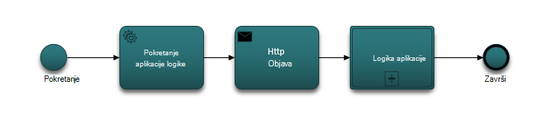

### <a name="lets-take-a-look-at-what-this-logic-app-does"></a>Pogledajmo je što označava logike aplikacije
Ako vam se prikazivati na sljedećoj slici postoji nekoliko koraka u tijeku rada LogicApp.

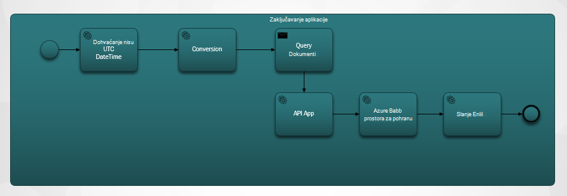

Koraci su na sljedeći način:

1. Morate nabaviti trenutnog datuma i vremena UTC-a iz aplikacije programa API-JA.  Zadana vrijednost je prethodno jedan sat.

2. UTC DateTime pretvara se u obliku Unix vremenske oznake. To je zadani oblik za vremenske oznake u DocumentDB.

3. OBJAVLJIVANJE vrijednost aplikaciju API koji ne na DocumentDB upita. Vrijednost se koristi u upitu.

    ```SQL
        SELECT * FROM Patients p WHERE (p._ts >= @unixTimeStamp)
    ```

    > [AZURE.NOTE] Na _ts predstavlja vremenska oznaka metapodataka za sve DocumentDB resurse.

4. Ako postoje pronađenih dokumenata, tijelo odgovor šalju se u spremištu blobova platforme Azure.

    > [AZURE.NOTE] Spremište blobova platforme potreban je račun za Azure prostora za pohranu. Morate Dodjela računa spremišta blobova platforme Azure i dodajte nove Blob pod nazivom bolesnike koji dolaze. Dodatne informacije potražite u članku [o Azure prostora za pohranu računa](../storage/storage-create-storage-account.md) i [Početak rada s spremište blobova platforme Azure](../storage/storage-dotnet-how-to-use-blobs.md).

5. Na kraju poruke e-pošte šalje se koja obavještava primatelj broj pronađenih dokumenata. Ako nije pronađen nijedan dokument, tijelo e-pošte bi "0 Found dokumenti". 

Sad kad ste uvid funkcija tijeka rada, recimo pogledajte kako implementirati.

### <a name="lets-start-with-the-main-logic-app"></a>Započnimo s glavnom logike aplikacije

Ako niste upoznati s aplikacijama logike postanu dostupne [Trgovine Windows Azure](https://portal.azure.com/), a možete saznati više o njima u [koje su aplikacije logike?](../app-service-logic/app-service-logic-what-are-logic-apps.md)

Prilikom stvaranja nove aplikacije logike se od vas zatraži **kako biste željeli da biste pokrenuli?**

Kada kliknete unutar tekstnog okvira, imate izbor događaja. Za ovu aplikaciju logika odaberite **ručno – kada an HTTP zahtjev je primili** kao što je prikazano u nastavku.

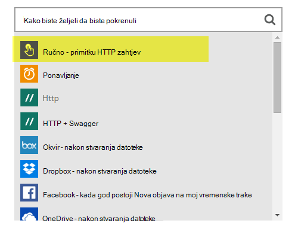

### <a name="design-view-of-your-completed-logic-app"></a>Dizajniranje prikaza dovršeni logika aplikacije
Pogledajmo prebaciti i pogledajte prikaza dovršene dizajna za aplikaciju logiku koja je DocDB.


Prilikom uređivanja akcije u dizajneru logike aplikacije, imate mogućnost odabira **izlaza** iz HTTP zahtjev ili iz prethodne radnje kao što je prikazano u nastavku sendMail akciju.

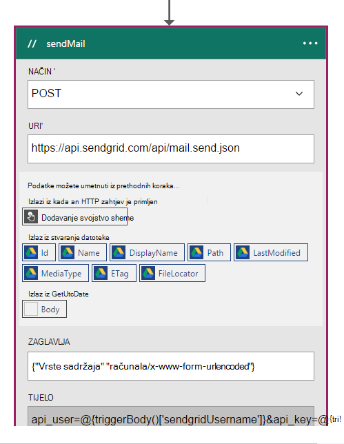

Prije svake akcije u tijeku rada možete donošenje odluka; **Dodaj akciju** ili **Dodaj uvjet** kao što je prikazano na sljedećoj slici.

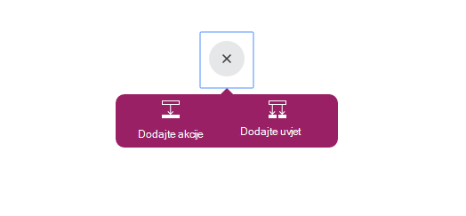

Ako odaberete **Dodaj uvjet**, su usmjereni u obrascu, kao što je prikazano na sljedećoj slici unesite logiku.  Ovo je zapravo, poslovna pravila.  Ako kliknete unutar polja, imate izbor odabir parametara iz prethodne radnje. Vrijednosti možete unijeti i izravno.

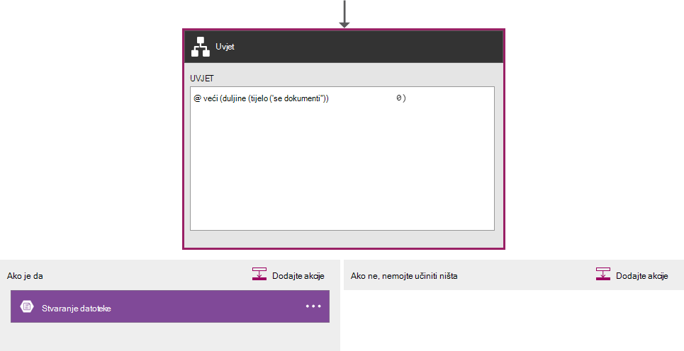

> [AZURE.NOTE] Imate mogućnost unesite sve u prikazu koda.

Pogledajmo na aplikaciju dovršene logike u prikazu koda.  

```JSON
   
    "$schema": "https://schema.management.azure.com/providers/Microsoft.Logic/schemas/2015-08-01-preview/workflowdefinition.json#",
    "actions": {
        "Conversion": {
            "conditions": [
                {
                    "dependsOn": "GetUtcDate"
                }
            ],
            "inputs": {
                "method": "post",
                "queries": {
                    "currentdateTime": "@{body('GetUtcDate')}"
                },
                "uri": "https://docdbnotificationapi-debug.azurewebsites.net/api/Conversion"
            },
            "metadata": {
                "apiDefinitionUrl": "https://docdbnotificationapi-debug.azurewebsites.net/swagger/docs/v1",
                "swaggerSource": "custom"
            },
            "type": "Http"
        },
        "Createfile": {
            "conditions": [
                {
                    "expression": "@greater(length(body('GetDocuments')), 0)"
                },
                {
                    "dependsOn": "GetDocuments"
                }
            ],
            "inputs": {
                "body": "@body('GetDocuments')",
                "host": {
                    "api": {
                        "runtimeUrl": "https://logic-apis-westus.azure-apim.net/apim/azureblob"
                    },
                    "connection": {
                        "name": "@parameters('$connections')['azureblob']['connectionId']"
                    }
                },
                "method": "post",
                "path": "/datasets/default/files",
                "queries": {
                    "folderPath": "/patients",
                    "name": "Patient_@{guid()}.json"
                }
            },
            "type": "ApiConnection"
        },
        "GetDocuments": {
            "conditions": [
                {
                    "dependsOn": "Conversion"
                }
            ],
            "inputs": {
                "method": "post",
                "queries": {
                    "unixTimeStamp": "@body('Conversion')"
                },
                "uri": "https://docdbnotificationapi-debug.azurewebsites.net/api/Patient"
            },
            "metadata": {
                "apiDefinitionUrl": "https://docdbnotificationapi-debug.azurewebsites.net/swagger/docs/v1",
                "swaggerSource": "custom"
            },
            "type": "Http"
        },
        "GetUtcDate": {
            "conditions": [],
            "inputs": {
                "method": "get",
                "queries": {
                    "hoursBack": "@{int(triggerBody()['GetUtcDate_HoursBack'])}"
                },
                "uri": "https://docdbnotificationapi-debug.azurewebsites.net/api/Authorization"
            },
            "metadata": {
                "apiDefinitionUrl": "https://docdbnotificationapi-debug.azurewebsites.net/swagger/docs/v1",
                "swaggerSource": "custom"
            },
            "type": "Http"
        },
        "sendMail": {
            "conditions": [
                {
                    "dependsOn": "GetDocuments"
                }
            ],
            "inputs": {
                "body": "api_user=@{triggerBody()['sendgridUsername']}&api_key=@{triggerBody()['sendgridPassword']}&from=@{parameters('fromAddress')}&to=@{triggerBody()['EmailTo']}&subject=@{triggerBody()['Subject']}&text=@{int(length(body('GetDocuments')))} Documents Found",
                "headers": {
                    "Content-type": "application/x-www-form-urlencoded"
                },
                "method": "POST",
                "uri": "https://api.sendgrid.com/api/mail.send.json"
            },
            "type": "Http"
        }
    },
    "contentVersion": "1.0.0.0",
    "outputs": {
        "Results": {
            "type": "String",
            "value": "@{int(length(body('GetDocuments')))} Records Found"
        }
    },
    "parameters": {
        "$connections": {
            "defaultValue": {},
            "type": "Object"
        },
        "fromAddress": {
            "defaultValue": "user@msn.com",
            "type": "String"
        },
        "toAddress": {
            "defaultValue": "XXXXX@XXXXXXX.net",
            "type": "String"
        }
    },
    "triggers": {
        "manual": {
            "inputs": {
                "schema": {
                    "properties": {},
                    "required": [],
                    "type": "object"
                }
            },
            "type": "Manual"
        }
    
```

Ako niste upoznati s što predstavlja različite odjeljke u kodu, možete pogledati u dokumentaciji [Jezika za definiranje logike aplikacije tijeka rada](http://aka.ms/logicappsdocs) .

Za ovaj tijek rada koristite [Okidač Webhook HTTP -a](https://sendgrid.com/blog/whats-webhook/). Ako pogledate gore navedeni kod, vidjet ćete parametre kao u sljedećem primjeru.

```C#

    =@{triggerBody()['Subject']}

```

Na `triggerBody()` predstavlja parametre uvrštene u tijelu na OSTALE OBJAVA da biste logike aplikacije REST API-JA. Na `()['Subject']` predstavlja polje. Sve parametara čine na JSON oblikovani tijelo. 

> [AZURE.NOTE] Pomoću Web priključak imate puni pristup zaglavlje i tijelo zahtjeva za okidača. U ovoj aplikaciji želite tijelo.

Kao što je već rečeno, možete koristiti dizajner dodjeljivanje parametre i u prikazu koda.
Ako radite u prikazu koda, zatim definirajte svojstva koja zahtijevaju vrijednost kao što je prikazano u sljedećim primjerom koda. 

```JSON

    "triggers": {
        "manual": {
            "inputs": {
            "schema": {
                "properties": {
            "Subject": {
                "type" : "String"   

            }
            },
                "required": [
            "Subject"
                 ],
                "type": "object"
            }
            },
            "type": "Manual"
        }
        }
```

Onome što radite stvara shemu JSON koji će se proslijediti u iz tijela HTTP POST.
Početka vašeg okidača, trebat će vam povratnog URL-a.  Ćete naučiti za generiranje kasnije u ovom praktičnom vodiču.  

## <a name="actions"></a>Akcija
Pogledajmo što označava svaku akciju u našem logika aplikaciji.

### <a name="getutcdate"></a>GetUTCDate

**Prikaz dizajnera**

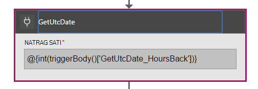

**Prikaz koda**

```JSON

    "GetUtcDate": {
            "conditions": [],
            "inputs": {
            "method": "get",
            "queries": {
                "hoursBack": "@{int(triggerBody()['GetUtcDate_HoursBack'])}"
            },
            "uri": "https://docdbnotificationapi-debug.azurewebsites.net/api/Authorization"
            },
            "metadata": {
            "apiDefinitionUrl": "https://docdbnotificationapi-debug.azurewebsites.net/swagger/docs/v1"
            },
            "type": "Http"
        },

```

Ova akcija HTTP izvodi operacije na početak.  Poziva metodu GetUtcDate Aplikacije API-JA. Uri koristi to svojstvo 'GetUtcDate_HoursBack' ušli u tijelu okidača.  Vrijednost 'GetUtcDate_HoursBack' postavlja se u aplikaciju prvi logika. Saznajte više o aplikaciju logike okidača će kasnije u ovom praktičnom vodiču.

Ova akcija poziva API aplikacije da biste se vratili vrijednost datuma UTC-a.

#### <a name="operations"></a>Operacije

**Zahtjev**

```JSON

    {
        "uri": "https://docdbnotificationapi-debug.azurewebsites.net/api/Authorization",
        "method": "get",
        "queries": {
          "hoursBack": "24"
        }
    }

```

**Odgovor**

```JSON

    {
        "statusCode": 200,
        "headers": {
          "pragma": "no-cache",
          "cache-Control": "no-cache",
          "date": "Fri, 26 Feb 2016 15:47:33 GMT",
          "server": "Microsoft-IIS/8.0",
          "x-AspNet-Version": "4.0.30319",
          "x-Powered-By": "ASP.NET"
        },
        "body": "Fri, 15 Jan 2016 23:47:33 GMT"
    }

```

Sljedeći je korak da biste pretvorili vrijednosti datuma i vremena UTC pečata Unix koji je vrsta dvostruki .NET.

### <a name="conversion"></a>Pretvorba

##### <a name="designer-view"></a>Prikaz dizajnera

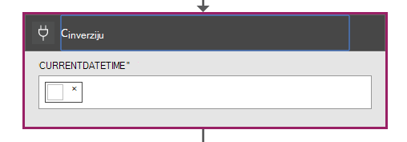

##### <a name="code-view"></a>Prikaz koda

```JSON

    "Conversion": {
        "conditions": [
        {
            "dependsOn": "GetUtcDate"
        }
        ],
        "inputs": {
        "method": "post",
        "queries": {
            "currentDateTime": "@{body('GetUtcDate')}"
        },
        "uri": "https://docdbnotificationapi-debug.azurewebsites.net/api/Conversion"
        },
        "metadata": {
        "apiDefinitionUrl": "https://docdbnotificationapi-debug.azurewebsites.net/swagger/docs/v1"
        },
        "type": "Http"
    },

```

U ovom ćete koraku proslijedite vrijednost vraća u GetUTCDate.  Postoji dependsOn uvjeta, što znači da morate akciju GetUTCDate uspješno dovršeno. Ako nije, zatim je preskočeno ovu akciju. 

Ova akcija poziva aplikacije API-JA za rukovanje pretvorbe.

#### <a name="operations"></a>Operacije

##### <a name="request"></a>Zahtjev

```JSON

    {
        "uri": "https://docdbnotificationapi-debug.azurewebsites.net/api/Conversion",
        "method": "post",
        "queries": {
        "currentDateTime": "Fri, 15 Jan 2016 23:47:33 GMT"
        }
    }   
```

##### <a name="response"></a>Odgovor

```JSON

    {
        "statusCode": 200,
        "headers": {
          "pragma": "no-cache",
          "cache-Control": "no-cache",
          "date": "Fri, 26 Feb 2016 15:47:33 GMT",
          "server": "Microsoft-IIS/8.0",
          "x-AspNet-Version": "4.0.30319",
          "x-Powered-By": "ASP.NET"
        },
        "body": 1452901653
    }
```

U sljedeću akciju će učiniti operacije na objavu naša aplikacija za API-JA.

### <a name="getdocuments"></a>GetDocuments 

##### <a name="designer-view"></a>Prikaz dizajnera


##### <a name="code-view"></a>Prikaz koda

```JSON

    "GetDocuments": {
        "conditions": [
        {
            "dependsOn": "Conversion"
        }
        ],
        "inputs": {
        "method": "post",
        "queries": {
            "unixTimeStamp": "@{body('Conversion')}"
        },
        "uri": "https://docdbnotificationapi-debug.azurewebsites.net/api/Patient"
        },
        "metadata": {
        "apiDefinitionUrl": "https://docdbnotificationapi-debug.azurewebsites.net/swagger/docs/v1"
        },
        "type": "Http"
    },

```

Za akciju GetDocuments namjeravate proći u tijelu odgovor od akcija pretvorbe. To je parametar u Uri:

 
```C#

    unixTimeStamp=@{body('Conversion')}

```

Akcija QueryDocuments ne operacije HTTP POST aplikaciju API-JA. 

Način naziva je **QueryForNewPatientDocuments**.

#### <a name="operations"></a>Operacije

##### <a name="request"></a>Zahtjev

```JSON

    {
        "uri": "https://docdbnotificationapi-debug.azurewebsites.net/api/Patient",
        "method": "post",
        "queries": {
        "unixTimeStamp": "1452901653"
        }
    }
```

##### <a name="response"></a>Odgovor

```JSON

    {
        "statusCode": 200,
        "headers": {
        "pragma": "no-cache",
        "cache-Control": "no-cache",
        "date": "Fri, 26 Feb 2016 15:47:35 GMT",
        "server": "Microsoft-IIS/8.0",
        "x-AspNet-Version": "4.0.30319",
        "x-Powered-By": "ASP.NET"
        },
        "body": [
        {
            "id": "xcda",
            "_rid": "vCYLAP2k6gAXAAAAAAAAAA==",
            "_self": "dbs/vCYLAA==/colls/vCYLAP2k6gA=/docs/vCYLAP2k6gAXAAAAAAAAAA==/",
            "_ts": 1454874620,
            "_etag": "\"00007d01-0000-0000-0000-56b79ffc0000\"",
            "resourceType": "Patient",
            "text": {
            "status": "generated",
            "div": "<div>\n      \n      <p>Henry Levin the 7th</p>\n    \n    </div>"
            },
            "identifier": [
            {
                "use": "usual",
                "type": {
                "coding": [
                    {
                    "system": "http://hl7.org/fhir/v2/0203",
                    "code": "MR"
                    }
                ]
                },
                "system": "urn:oid:2.16.840.1.113883.19.5",
                "value": "12345"
            }
            ],
            "active": true,
            "name": [
            {
                    "family": [
                        "Levin"
                    ],
                    "given": [
                        "Henry"
                    ]
                }
            ],
            "gender": "male",
            "birthDate": "1932-09-24",
            "managingOrganization": {
                "reference": "Organization/2.16.840.1.113883.19.5",
                "display": "Good Health Clinic"
            }
        },

```

Nikakvu akciju je u dokumente spremiti na [Azure Blog prostora za pohranu](https://azure.microsoft.com/services/storage/). 

> [AZURE.NOTE] Spremište blobova platforme potreban je račun za Azure prostora za pohranu. Morate Dodjela računa spremišta blobova platforme Azure i dodajte nove Blob pod nazivom bolesnike koji dolaze. Dodatne informacije potražite u članku [Početak rada s spremište blobova platforme Azure](../storage/storage-dotnet-how-to-use-blobs.md).

### <a name="create-file"></a>Stvaranje datoteke

##### <a name="designer-view"></a>Prikaz dizajnera

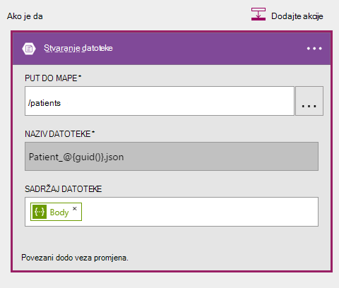

##### <a name="code-view"></a>Prikaz koda

```JSON

    {
    "host": {
        "api": {
            "runtimeUrl": "https://logic-apis-westus.azure-apim.net/apim/azureblob"
        },
        "connection": {
            "name": "subscriptions/fxxxxxc079-4e5d-b002-xxxxxxxxxx/resourceGroups/Api-Default-Central-US/providers/Microsoft.Web/connections/azureblob"
        }
    },
    "method": "post",
    "path": "/datasets/default/files",
    "queries": {
        "folderPath": "/patients",
        "name": "Patient_17513174-e61d-4b56-88cb-5cf383db4430.json"
    },
    "body": [
        {
            "id": "xcda",
            "_rid": "vCYLAP2k6gAXAAAAAAAAAA==",
            "_self": "dbs/vCYLAA==/colls/vCYLAP2k6gA=/docs/vCYLAP2k6gAXAAAAAAAAAA==/",
            "_ts": 1454874620,
            "_etag": "\"00007d01-0000-0000-0000-56b79ffc0000\"",
            "resourceType": "Patient",
            "text": {
                "status": "generated",
                "div": "<div>\n      \n      <p>Henry Levin the 7th</p>\n    \n    </div>"
            },
            "identifier": [
                {
                    "use": "usual",
                    "type": {
                        "coding": [
                            {
                                "system": "http://hl7.org/fhir/v2/0203",
                                "code": "MR"
                            }
                        ]
                    },
                    "system": "urn:oid:2.16.840.1.113883.19.5",
                    "value": "12345"
                }
            ],
            "active": true,
            "name": [
                {
                    "family": [
                        "Levin"
                    ],
                    "given": [
                        "Henry"
                    ]
                }
            ],
            "gender": "male",
            "birthDate": "1932-09-24",
            "managingOrganization": {
                "reference": "Organization/2.16.840.1.113883.19.5",
                "display": "Good Health Clinic"
            }
        },

```

Kod je generirao akcija u alatu za dizajniranje. Ne morate da biste izmijenili kod.

Ako niste upoznati s komponentom API blobova platforme Azure, potražite u članku [Početak rada s spremište blobova platforme Azure API-JA](../connectors/connectors-create-api-azureblobstorage.md).

#### <a name="operations"></a>Operacije

##### <a name="request"></a>Zahtjev

```JSON

    "host": {
        "api": {
            "runtimeUrl": "https://logic-apis-westus.azure-apim.net/apim/azureblob"
        },
        "connection": {
            "name": "subscriptions/fxxxxxc079-4e5d-b002-xxxxxxxxxx/resourceGroups/Api-Default-Central-US/providers/Microsoft.Web/connections/azureblob"
        }
    },
    "method": "post",
    "path": "/datasets/default/files",
    "queries": {
        "folderPath": "/patients",
        "name": "Patient_17513174-e61d-4b56-88cb-5cf383db4430.json"
    },
    "body": [
        {
            "id": "xcda",
            "_rid": "vCYLAP2k6gAXAAAAAAAAAA==",
            "_self": "dbs/vCYLAA==/colls/vCYLAP2k6gA=/docs/vCYLAP2k6gAXAAAAAAAAAA==/",
            "_ts": 1454874620,
            "_etag": "\"00007d01-0000-0000-0000-56b79ffc0000\"",
            "resourceType": "Patient",
            "text": {
                "status": "generated",
                "div": "<div>\n      \n      <p>Henry Levin the 7th</p>\n    \n    </div>"
            },
            "identifier": [
                {
                    "use": "usual",
                    "type": {
                        "coding": [
                            {
                                "system": "http://hl7.org/fhir/v2/0203",
                                "code": "MR"
                            }
                        ]
                    },
                    "system": "urn:oid:2.16.840.1.113883.19.5",
                    "value": "12345"
                }
            ],
            "active": true,
            "name": [
                {
                    "family": [
                        "Levin"
                    ],
                    "given": [
                        "Henry"
                    ]
                }
            ],
            "gender": "male",
            "birthDate": "1932-09-24",
            "managingOrganization": {
                "reference": "Organization/2.16.840.1.113883.19.5",
                "display": "Good Health Clinic"
            }
        },….


```

##### <a name="response"></a>Odgovor

```JSON

    {
        "statusCode": 200,
        "headers": {
        "pragma": "no-cache",
        "x-ms-request-id": "2b2f7c57-2623-4d71-8e53-45c26b30ea9d",
        "cache-Control": "no-cache",
        "date": "Fri, 26 Feb 2016 15:47:36 GMT",
        "set-Cookie": "ARRAffinity=29e552cea7db23196f7ffa644003eaaf39bc8eb6dd555511f669d13ab7424faf;Path=/;Domain=127.0.0.1",
        "server": "Microsoft-HTTPAPI/2.0",
        "x-AspNet-Version": "4.0.30319",
        "x-Powered-By": "ASP.NET"
        },
        "body": {
        "Id": "0B0nBzHyMV-_NRGRDcDNMSFAxWFE",
        "Name": "Patient_47a2a0dc-640d-4f01-be38-c74690d085cb.json",
        "DisplayName": "Patient_47a2a0dc-640d-4f01-be38-c74690d085cb.json",
        "Path": "/Patient/Patient_47a2a0dc-640d-4f01-be38-c74690d085cb.json",
        "LastModified": "2016-02-26T15:47:36.215Z",
        "Size": 65647,
        "MediaType": "application/octet-stream",
        "IsFolder": false,
        "ETag": "\"c-g_a-1OtaH-kNQ4WBoXLp3Zv9s/MTQ1NjUwMTY1NjIxNQ\"",
        "FileLocator": "0B0nBzHyMV-_NRGRDcDNMSFAxWFE"
        }
    }
```

Potrebno je još poslati obavijest e-poštom

### <a name="sendemail"></a>PošaljiE-poštu

##### <a name="designer-view"></a>Prikaz dizajnera

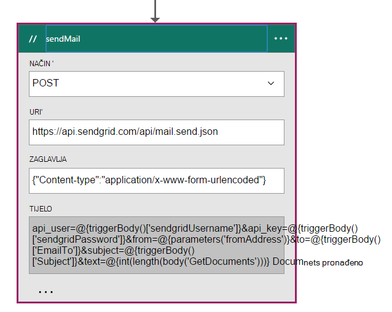

##### <a name="code-view"></a>Prikaz koda

```JSON


    "sendMail": {
        "conditions": [
        {
            "dependsOn": "GetDocuments"
        }
        ],
        "inputs": {
        "body": "api_user=@{triggerBody()['sendgridUsername']}&api_key=@{triggerBody()['sendgridPassword']}&from=@{parameters('fromAddress')}&to=@{triggerBody()['EmailTo']}&subject=@{triggerBody()['Subject']}&text=@{int(length(body('GetDocuments')))} Documents Found",
        "headers": {
            "Content-type": "application/x-www-form-urlencoded"
        },
        "method": "POST",
        "uri": "https://api.sendgrid.com/api/mail.send.json"
        },
        "type": "Http"
    }
```

U ovu akciju poslati obavijest e-poštom.  Koristite [SendGrid](https://sendgrid.com/marketing/sendgrid-services?cvosrc=PPC.Bing.sendgrib&cvo_cid=SendGrid%20-%20US%20-%20Brand%20-%20&mc=Paid%20Search&mcd=BingAds&keyword=sendgrib&network=o&matchtype=e&mobile=&content=&search=1&utm_source=bing&utm_medium=cpc&utm_term=%5Bsendgrib%5D&utm_content=%21acq%21v2%2134335083397-8303227637-1649139544&utm_campaign=SendGrid+-+US+-+Brand+-+%28English%29).   

Kod za to je generirana pomoću predloška za logike aplikacije i SendGrid koji se nalazi u [spremištu Github 101-logike – aplikacije-sendgrid](https://github.com/Azure/azure-quickstart-templates/tree/master/101-logic-app-sendgrid).
 
Operacija HTTP je objavu. 

Parametri autorizacije nisu u svojstvima okidača

```JSON

    },
        "sendgridPassword": {
             "type": "SecureString"
         },
         "sendgridUsername": {
            "type": "String"
         }

        In addition, other parameters are static values set in the Parameters section of the Logic App. These are:
        },
        "toAddress": {
            "defaultValue": "XXXX@XXXX.com",
            "type": "String"
        },
        "fromAddress": {
            "defaultValue": "XXX@msn.com",
            "type": "String"
        },
        "emailBody": {
            "defaultValue": "@{string(concat(int(length(actions('QueryDocuments').outputs.body)) Records Found),'/n', actions('QueryDocuments').outputs.body)}",
            "type": "String"
        },

```

U emailBody je Ulančavanje broj dokumenata vratio upit, što može biti "0" ili više s, "Zapisa nije pronađena". Ostatak parametre postavljaju se iz parametara okidača.

Ova akcija ovisi o **GetDocuments** akciju.

#### <a name="operations"></a>Operacije

##### <a name="request"></a>Zahtjev
```JSON

    {
        "uri": "https://api.sendgrid.com/api/mail.send.json",
        "method": "POST",
        "headers": {
        "Content-type": "application/x-www-form-urlencoded"
        },
        "body": "api_user=azureuser@azure.com&api_key=Biz@Talk&from=user@msn.com&to=XXXX@XXXX.com&subject=New Patients&text=37 Documents Found"
    }

```

##### <a name="response"></a>Odgovor

```JSON

    {
        "statusCode": 200,
        "headers": {
        "connection": "keep-alive",
        "x-Frame-Options": "DENY,DENY",
        "access-Control-Allow-Origin": "https://sendgrid.com",
        "date": "Fri, 26 Feb 2016 15:47:35 GMT",
        "server": "nginx"
        },
        "body": {
        "message": "success"
        }
    }
```

Na kraju želite omogućiti da biste vidjeli rezultate iz aplikacije programa logike portala za Azure. Da biste to učinili, dodajte parametar do odjeljka izlaza.


```JSON

    "outputs": {
        "Results": {
            "type": "String",
            "value": "@{int(length(actions('QueryDocuments').outputs.body))} Records Found"
        }

```

Vratit će se iste vrijednost koja se šalje u tijelu e-pošte. Na sljedećoj je slici prikazan primjer gdje "29 zapisa nije pronađena".

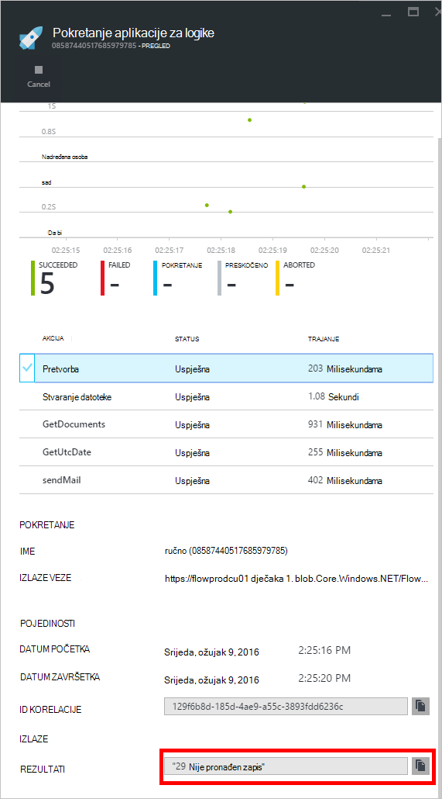

## <a name="metrics"></a>Mjerenja
Možete konfigurirati nadzor glavni logike aplikacije na portalu. Omogućuje prikaz latencije pokrenuti i druge događaje kao što je prikaz na sljedećoj slici.

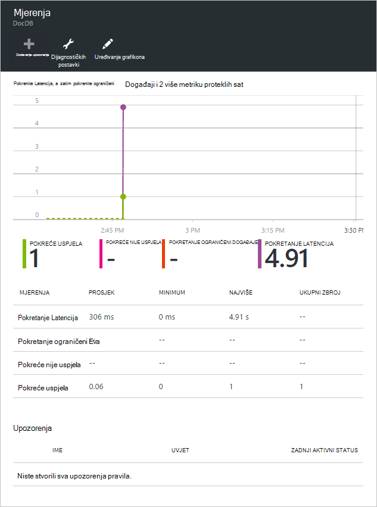

## <a name="docdb-trigger"></a>DocDb okidača

Logika aplikacija nije okidača koji će se pokrenuti tijek rada na glavnom logika aplikacije.

Sljedeća slika prikazuje prikaz dizajnera.

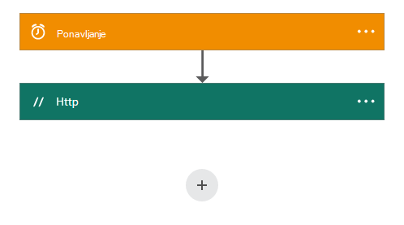

```JSON

    {
        "$schema": "https://schema.management.azure.com/providers/Microsoft.Logic/schemas/2015-08-01-preview/workflowdefinition.json#",
        "actions": {
        "Http": {
            "conditions": [],
            "inputs": {
            "body": {
                "EmailTo": "XXXXXX@XXXXX.net",
                "GetUtcDate_HoursBack": "24",
                "Subject": "New Patients",
                "sendgridPassword": "********",
                "sendgridUsername": "azureuser@azure.com"
            },
            "method": "POST",
            "uri": "https://prod-01.westus.logic.azure.com:443/workflows/12a1de57e48845bc9ce7a247dfabc887/triggers/manual/run?api-version=2015-08-01-preview&sp=%2Ftriggers%2Fmanual%2Frun&sv=1.0&sig=ObTlihr529ATIuvuG-dhxOgBL4JZjItrvPQ8PV6973c"
            },
            "type": "Http"
        }
        },
        "contentVersion": "1.0.0.0",
        "outputs": {
        "Results": {
            "type": "String",
            "value": "@{body('Http')['status']}"
        }
        },
        "parameters": {},
        "triggers": {
        "recurrence": {
            "recurrence": {
            "frequency": "Hour",
            "interval": 24
            },
            "type": "Recurrence"
        }
        }
    }

```

Okidača postavljen za ponavljanje od dvadeset i četiri sata. Akciju je HTTP POST koji koristi URL povratnog glavni logike aplikacije. Tijelo sadrži parametre koje su navedene u shemi JSON. 

#### <a name="operations"></a>Operacije

##### <a name="request"></a>Zahtjev

```JSON

    {
        "uri": "https://prod-01.westus.logic.azure.com:443/workflows/12a1de57e48845bc9ce7a247dfabc887/triggers/manual/run?api-version=2015-08-01-preview&sp=%2Ftriggers%2Fmanual%2Frun&sv=1.0&sig=ObTlihr529ATIuvuG-dhxOgBL4JZjItrvPQ8PV6973c",
        "method": "POST",
        "body": {
        "EmailTo": "XXXXXX@XXXXX.net",
        "GetUtcDate_HoursBack": "24",
        "Subject": "New Patients",
        "sendgridPassword": "********",
        "sendgridUsername": "azureuser@azure.com"
        }
    }

```

##### <a name="response"></a>Odgovor

```JSON

    {
        "statusCode": 202,
        "headers": {
        "pragma": "no-cache",
        "x-ms-ratelimit-remaining-workflow-writes": "7486",
        "x-ms-ratelimit-burst-remaining-workflow-writes": "1248",
        "x-ms-request-id": "westus:2d440a39-8ba5-4a9c-92a6-f959b8d2357f",
        "cache-Control": "no-cache",
        "date": "Thu, 25 Feb 2016 21:01:06 GMT"
        }
    }
```

Sada Pogledajmo aplikaciju API-JA.

## <a name="docdbnotificationapi"></a>DocDBNotificationApi

Iako je nekoliko postupaka u aplikaciji, samo namjeravate koristiti tri.

* GetUtcDate
* ConvertToTimeStamp
* QueryForNewPatientDocuments

### <a name="docdbnotificationapi-operations"></a>Operacija DocDBNotificationApi
Pogledajmo u dokumentaciji Swagger

> [AZURE.NOTE] Da biste omogućili vanjsko poziva operacije, najprije morate dodati CORS dopuštena vrijednost polazište "*" (bez navodnika) u odjeljku postavke aplikacije API kao što je prikazano na sljedećoj slici.

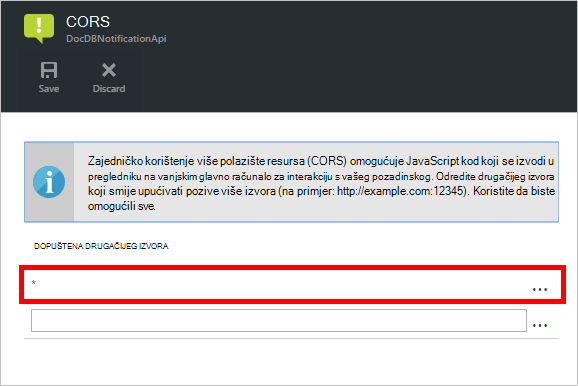

#### <a name="getutcdate"></a>GetUtcDate

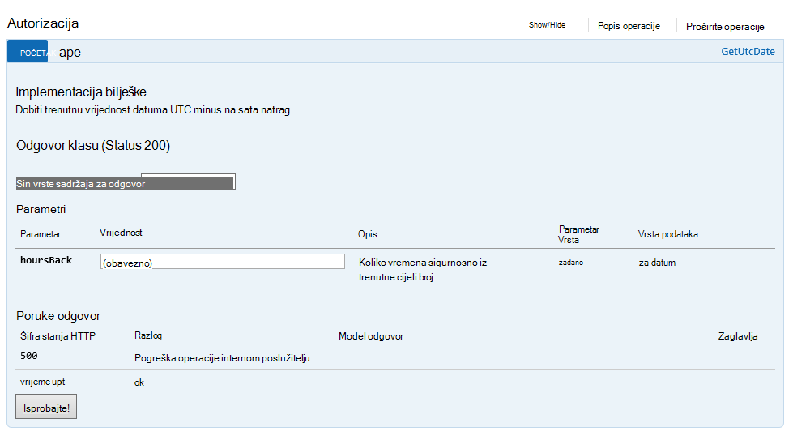

#### <a name="converttotimestamp"></a>ConvertToTimeStamp

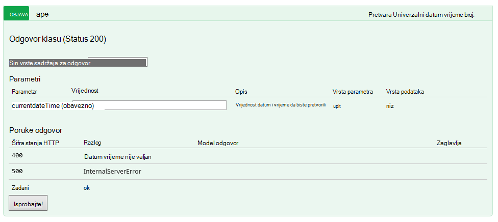

#### <a name="queryfornewpatientdocuments"></a>QueryForNewPatientDocuments

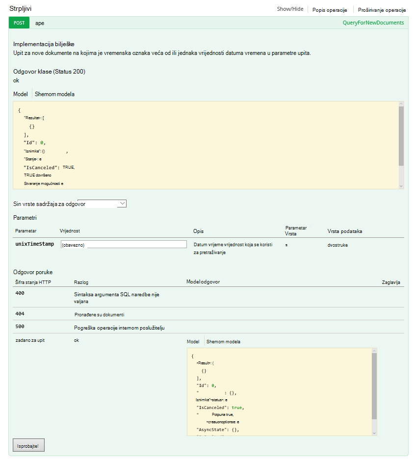

Pogledajmo u kod u pozadini ovaj postupak.

#### <a name="getutcdate"></a>GetUtcDate

```C#

    /// <summary>
    /// Gets the current UTC Date value
    /// </summary>
    /// <returns></returns>
    [H ttpGet]
    [Metadata("GetUtcDate", "Gets the current UTC Date value minus the Hours Back")]
    [SwaggerOperation("GetUtcDate")]
    [SwaggerResponse(HttpStatusCode.OK, type: typeof (string))]
    [SwaggerResponse(HttpStatusCode.InternalServerError, "Internal Server Operation Error")]
    public string GetUtcDate(
       [Metadata("Hours Back", "How many hours back from the current Date Time")] int hoursBack)
    {


        return DateTime.UtcNow.AddHours(-hoursBack).ToString("r");
    }
```

Ovaj postupak jednostavno vraća vraća trenutni DateTime UTC minus HoursBack vrijednost.

#### <a name="converttotimestamp"></a>ConvertToTimeStamp

``` C#

        /// <summary>
        ///     Converts DateTime to double
        /// </summary>
        /// <param name="currentdateTime"></param>
        /// <returns></returns>
        [Metadata("Converts Universal DateTime to number")]
        [SwaggerResponse(HttpStatusCode.OK, null, typeof (double))]
        [SwaggerResponse(HttpStatusCode.BadRequest, "DateTime is invalid")]
        [SwaggerResponse(HttpStatusCode.InternalServerError)]
        [SwaggerOperation(nameof(ConvertToTimestamp))]
        public double ConvertToTimestamp(
            [Metadata("currentdateTime", "DateTime value to convert")] string currentdateTime)
        {
            double result;

            try
            {
                var uncoded = HttpContext.Current.Server.UrlDecode(currentdateTime);

                var newDateTime = DateTime.Parse(uncoded);
                //create Timespan by subtracting the value provided from the Unix Epoch
                var span = newDateTime - new DateTime(1970, 1, 1, 0, 0, 0, 0).ToLocalTime();

                //return the total seconds (which is a UNIX timestamp)
                result = span.TotalSeconds;
            }
            catch (Exception e)
            {
                throw new Exception("unable to convert to Timestamp", e.InnerException);
            }

            return result;
        }

```

Ovaj postupak pretvara odgovor iz operacije GetUtcDate dvostruke vrijednosti.

#### <a name="queryfornewpatientdocuments"></a>QueryForNewPatientDocuments

```C#

        /// <summary>
        ///     Query for new Patient Documents
        /// </summary>
        /// <param name="unixTimeStamp"></param>
        /// <returns>IList</returns>
        [Metadata("QueryForNewDocuments",
            "Query for new Documents where the Timestamp is greater than or equal to the DateTime value in the query parameters."
            )]
        [SwaggerOperation("QueryForNewDocuments")]
        [SwaggerResponse(HttpStatusCode.OK, type: typeof (Task<IList<Document>>))]
        [SwaggerResponse(HttpStatusCode.BadRequest, "The syntax of the SQL Statement is incorrect")]
        [SwaggerResponse(HttpStatusCode.NotFound, "No Documents were found")]
        [SwaggerResponse(HttpStatusCode.InternalServerError, "Internal Server Operation Error")]
        // ReSharper disable once ConsiderUsingAsyncSuffix
        public IList<Document> QueryForNewPatientDocuments(
            [Metadata("UnixTimeStamp", "The DateTime value used to search from")] double unixTimeStamp)
        {
            var context = new DocumentDbContext();
            var filterQuery = string.Format(InvariantCulture, "SELECT * FROM Patient p WHERE p._ts >=  {0}",
                unixTimeStamp);
            var options = new FeedOptions {MaxItemCount = -1};


            var collectionLink = UriFactory.CreateDocumentCollectionUri(DocumentDbContext.DatabaseId,
                DocumentDbContext.CollectionId);

            var response =
                context.Client.CreateDocumentQuery<Document>(collectionLink, filterQuery, options).AsEnumerable();

            return response.ToList();
    }

```

Ovaj postupak koristi [DocumentDB.NET SDK](documentdb-sdk-dotnet.md) za stvaranje upita za dokument. 

```C#
     CreateDocumentQuery<Document>(collectionLink, filterQuery, options).AsEnumerable();
```

Odgovor operacija ConvertToTimeStamp (unixTimeStamp) se prenosi u. Postupak vraća popis dokumenata, `IList<Document>`.

Prethodno smo bila riječ o na CallbackURL. Da biste pokrenuli tijek rada u glavnom logike aplikacije, morat ćete ga na CallbackURL poziva.

## <a name="callbackurl"></a>CallbackURL

Da biste započeli, trebat će vam vaše Azure AD tokena.  Možda ćete teško da biste to tokena. Je tražim jednostavan način i Jeff Hollan tko je upravitelj Azure logike aplikacije programa, preporučuje se korištenje [armclient](http://blog.davidebbo.com/2015/01/azure-resource-manager-client.html) u PowerShell.  Sustav možete instalirati slijedeći upute.

Operacije koji želite koristiti su prijava i poziva ARM API-JA.
 
Prijava: Koristite iste vjerodajnice za prijaviti na Azure Portal. 

Operacija poziva Api ARM je onaj koji će generirati vaše CallBackURL.

U ljusci PowerShell, pozovete ga na sljedeći način:  

```powershell

    ArmClient.exe post https://management.azure.com/subscriptions/[YOUR SUBSCRIPTION ID/resourcegroups/[YOUR RESOURCE GROUP]/providers/Microsoft.Logic/workflows/[YOUR LOGIC APP NAME/triggers/manual/listcallbackurl?api-version=2015-08-01-preview

```

Rezultat trebao bi izgledati ovako:

```powershell

    https://prod-02.westus.logic.azure.com:443/workflows/12a1de57e48845bc9ce7a247dfabc887/triggers/manual/run?api-version=2015-08-01-prevaiew&sp=%2Ftriggers%2Fmanual%2Frun&sv=1.0&sig=XXXXXXXXXXXXXXXXXXX

```

Možete koristiti alat kao što su [postman](http://www.getpostman.com/) da biste testirali glavni logike aplikacije kao što je prikazano na sljedećoj slici.

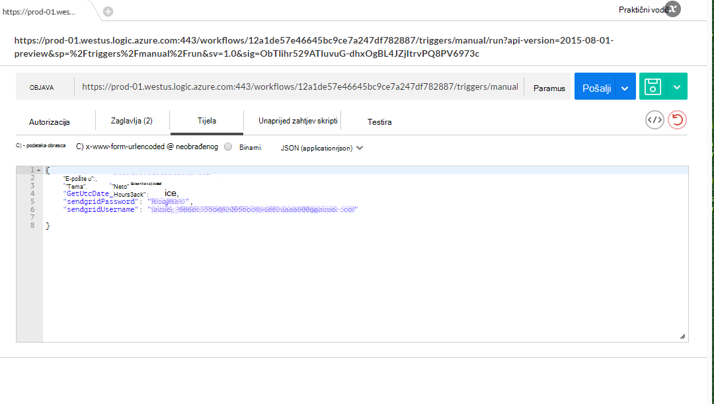

U sljedećoj su tablici navedeni okidača parametre koje čine tijelo DocDB okidača logike aplikacije.

Parametar | Opis 
--- | --- 
GetUtcDate_HoursBack | Koristi za određivanje broja sati za datum početka pretraživanja
sendgridUsername | Koristi za određivanje broja sati za datum početka pretraživanja
sendgridPassword | Korisničko ime za e-pošte poslati rešetke
Poruku | Adresa e-pošte koja će primiti obavijest e-pošte
Predmet | Predmet e-pošte

## <a name="viewing-the-patient-data-in-the-azure-blob-service"></a>Prikaz pacijenta podataka u servisu blobova platforme Azure

Idite na račun servisa Azure prostora za pohranu i odaberite blob-ova u odjeljku servise kao što je prikazano na sljedećoj slici.

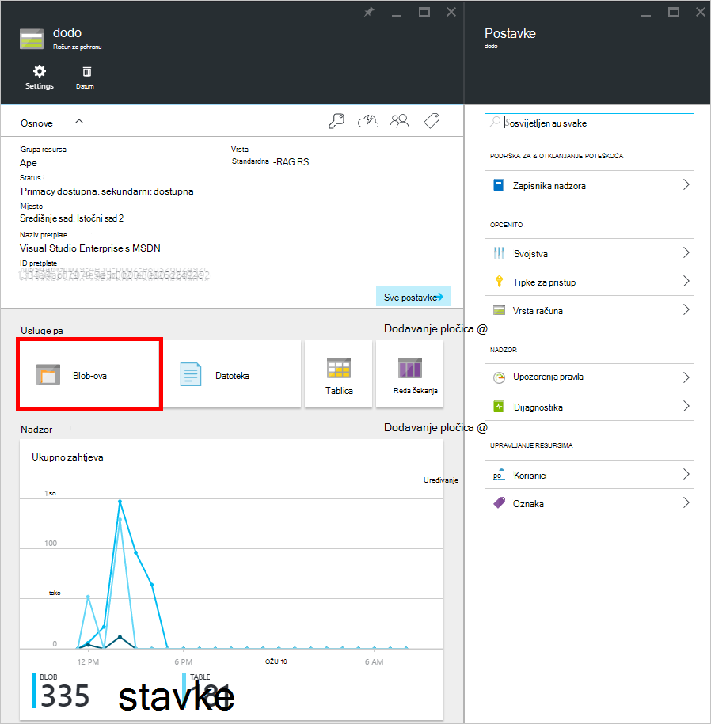 

Moći da biste pregledali informacije datoteke pacijenta blob kao što je prikazano u nastavku.

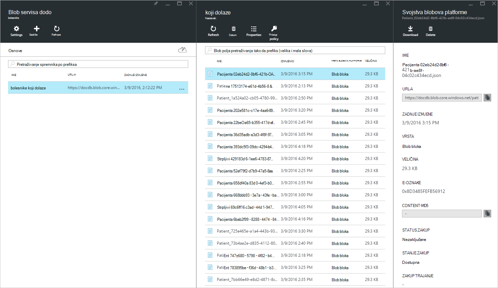


## <a name="summary"></a>Sažetak

U ovom vodiču ste naučili sljedeće:

* Moguće je implementirati obavijesti u DocumentDB.
* Pomoću aplikacije logike možete automatizirati proces.
* Pomoću aplikacije logike možete smanjiti vrijeme potrebno za isporuku aplikacije.
* Pomoću HTTP možete jednostavno zauzimaju aplikaciju API-JA u aplikaciji za logiku.
* Jednostavno možete stvoriti CallBackURL koji zamjenjuje ga Slušatelj HTTP-a.
* Jednostavno možete stvoriti prilagođene tijekove rada s programom dizajner logike aplikacije.

Ključno je unaprijed planirati i Modeliranje tijekova rada.

## <a name="next-steps"></a>Daljnji koraci
Preuzimanje i korištenje kod logike aplikacije navedeni su na [Github](https://github.com/HEDIDIN/DocDbNotifications). Sastavljanje na aplikacije i poslati promjene na repo pozvati. 

Da biste saznali više o DocumentDB, posjetite [Tečaj](https://azure.microsoft.com/documentation/learning-paths/documentdb/).
