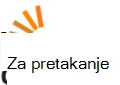

<properties
  pageTitle="DocumentDB zajednica i novosti | Microsoft Azure"
  description="Pridružite se zajednici Azure DocumentDB za stvaranje odnosa, demonstracije svoj rad i Izoštri svojih vještina."
  services="documentdb"
  documentationCenter=""
  authors="aliuy"
  manager="johnmac"
  editor="mimig"/>

<tags
  ms.service="documentdb"
  ms.devlang="na"
  ms.topic="article"
  ms.tgt_pltfrm="na"
  ms.workload="data-services"
  ms.date="09/26/2016"
  ms.author="andrl"/>

# Portal zajednice

## Značajka u središtu zajednice

Javite nam Promicanje projekta! Pokazuju fenomenalna projekt na kojima radite s DocumentDB pa ćemo vam pomoći zajedničko korištenje svoje genius za sve korisnike. Da biste poslali projekta, pošaljite nam poruku e-pošte na: [askdocdb@microsoft.com](mailto:askdocdb@microsoft.com).

### documentdb-lumenize

*po kliknite Maccherone*

Agregacije (-grupiranja, zaokretne tablice, a N dimenzionalni kocke) i vremena transformacije niz kao pohranjene procedure u DocumentDB.

Pogledajte ga na [Github](https://github.com/lmaccherone/documentdb-lumenize) i [npm](https://www.npmjs.com/package/lumenize).

### DocumentDB Studio

*po Ming Liu*

Na klijentskom upravljanje preglednik/explorer servisa Microsoft Azure DocumentDB.

Pogledajte ga na [Github](https://github.com/mingaliu/DocumentDBStudio).

### DoQmentDB

*po Ariel Mashraki*

DoQmentDB je Node.js utemeljen na obećanje klijent, koja omogućuje sloj MongoDB nalik pri vrhu DocumentDB.

Pogledajte ga na [Github](https://github.com/a8m/doqmentdb) i [npm](https://www.npmjs.com/package/doqmentdb).

### Swagger REST API-JA za DocumentDB

*po Howard Edidin*

DocumentDB REST API Swagger datoteka koja se jednostavno uvesti kao aplikaciju API-JA.

Pogledajte ga na [Github](https://github.com/HEDIDIN/DocumentDB-REST/tree/master/DocumentDBRestApi).

### Fluent-dodatak-documentdb

*po Yoichi Kawasaki*

Fluent-dodatak-documentdb je Fluentd dodatak za bilježiti Azure DocumentDB.

Pogledajte ga na [Github](https://github.com/yokawasa/fluent-plugin-documentdb) i [rubygems](https://rubygems.org/gems/fluent-plugin-documentdb).

*Pronađite više Otvori izvor projektima DocumentDB na [GitHub](https://github.com/search?p=4&q=documentdb&type=Repositories).*

## Novosti, blogovi i članci

Možete zadržati najnovije najnovije vijesti DocumentDB i značajke tako da sljedeće [naš bloga](https://azure.microsoft.com/blog/tag/documentdb/).

**Zajednica objave:**

- [**Odlazak društvenih s DocumentDB**](https://blogs.msdn.microsoft.com/mvpawardprogram/2016/03/15/going-social-with-documentdb/) - *po Matias Quarantaas*

- [**UWP, servisa Azure aplikacije i DocumentDB juha: aplikacija za zajedničko korištenje fotografija**](https://blogs.windows.com/buildingapps/2016/03/17/uwp-azure-app-services-and-documentdb-soup-a-photo-sharing-app/) - *po Eric Langland*

- [**Obavijesti za nove ili promijenjene resurse DocumentDB pomoću aplikacije logike**](documentdb-change-notification.md) - *po Howard Edidin*

- [**Prikupljanje zapisnika u da biste DocumentDB Azure pomoću fluent-dodatak-documentdb**](http://unofficialism.info/posts/collecting-logs-into-azure-documentdb-using-fluent-plugin-documentdb/) - *po Yoichi Kawasaki*

- [**DocumentDB revisited dio 1/2 – na teorija**](https://peterintheazuresky.wordpress.com/2016/02/19/documentdb-revisited-part-12-the-theory/) - *po Peter Mannerhult*

- [**Što ih i hate o Azure, DocumentDB**](http://blog.falafel.com/4-what-to-love-and-hate-about-azures-documentdb/) - *po Saadeh Goran*

- [**Azure DocumentDB poslužiteljsko skriptiranje**](https://www.simple-talk.com/cloud/cloud-data/azure-documentdb-server-side-scripting/) - *po Robert Sheldon*

- [**DocumentDB obliku podataka sita Azure strujanje analitičkih**](http://janatdevelopment.com/2015/12/11/documentdb-as-a-data-sink-for-azure-stream-analytics/?utm_source=twitterfeed&utm_medium=twitter) - *po Hentschel Sij*

- [**Azure DocumentDB u radnog!** ](http://blog.nexapp.ca/2015/11/30/azure-documentdb-in-production/)  -  *Alexandre Walsh i Marc Olivier Duval*

- [**Azure pretraživanja Indexers – DocumentDB upiti (španjolski)**](http://www.ealsur.com.ar/wp/index.php/2015/11/19/azure-search-indexers-documentdb-queries/) - *po Matthias Quaranta*

- [**Azure DocumentDB SQL upita osnove (japanski)**](http://beachside.hatenablog.com/entry/2015/12/06/000045) - *po Atsushi Yokohama*

- [**Točke podataka – Aurelia zadovoljava DocumentDB: Putovanja U Matchmaker**](https://msdn.microsoft.com/magazine/mt620011.aspx) - *po Julie Lerman*

- [**Infrastruktura kao kod, a neprekinuti implementacije Node.js + rješenja Azure DocumentDB**](http://www.talmeida.net/blog/2015/10/26/infrastructure-as-code-and-continuous-deployment-of-a-nodejs-azure-documentdb-solution) - *po Almedia slika*

- [**Zašto DocumentDb smisla ispravnih poslovnih za neke projekte**](http://www.iquestllc.com/blogs/read/405/why-documentdb-makes-good-business-sense-for-some-projects) - *po Samuel Uresin*

- [**Azure DocumentDB razvoj Premještanje naprijed – razvoj klase klijenta (1 2) (japanski)**](http://beachside.hatenablog.com/entry/2015/10/01/202734) - *po Atsushi Yokohama*

- [**Što trebate znati prilikom korištenja Azure DocumentDB (japanski)**](http://beachside.hatenablog.com/entry/2015/10/01/202734) - *po Atsushi Yokohama*

- [**Povezanima s RequestRateTooLarge pogreške u Azure DocumentDB i testiranje performanse**](http://blogs.msdn.com/b/bigdatasupport/archive/2015/09/02/dealing-with-requestratetoolarge-errors-in-azure-documentdb-and-testing-documentdb-performance.aspx) - *po Azim Uddin*

- [**Točke podataka – pregled Microsoft Azure DocumentDB**](https://msdn.microsoft.com/magazine/mt147238.aspx) - *po Julie Lerman*

- [**Pomoću DocumentDB F #**](https://jamessdixon.wordpress.com/2014/12/30/using-documentdb-with-f/) - *po Jamie Dixon*

- [**Pri analizi aplikacije zapisnike s DocumentDB**](http://vincentlauzon.com/2015/09/06/analysing-application-logs-with-documentdb/) - *po Lauzon Vincent Philippe*

- [**Azure DocumentDB – točke u vrijeme kopija**](http://softwarejuancarlos.com/2015/09/06/azure-documentdb-point-in-time-backups/) - *po Juan Carlos Sanchez*

*Imate li objava na blogu, uzorak koda ili studiju slučaja kojima želite omogućiti zajedničko korištenje? [Javite nam](mailto:askdocdb@microsoft.com)!*

## Događaji i snimke

### Nedavno otvorenih i nadolazeće događaje

| Naziv događaja                                                                                                                 | Zvučnik                                                     | Mjesto             | Datum                     | Oznake |
| -------------------------------------------------------------------------------------------------------------------------- | ----------------------------------------------------------- | -------------------- | ------------------------ | ------- |
| [Ignite 2016](https://myignite.microsoft.com/sessions?q=documentdb)  [Glavni: Omogućivanje digitalni transformacije u Unreasonable učinkovitosti od A.C.I.D pomoću Joseph Sirosh](https://myignite.microsoft.com/sessions/34953)  [Sesije: Azure DocumentDB na razini pretraživanje velikog: uzorci uspjeh i dizajna klijenta s Syam Kumar Nair i Liu promjena](https://myignite.microsoft.com/sessions/3066)  [Sesije: Upravljanje resursima IoT s Node.js i DocumentDB s Joshua Katić](https://myignite.microsoft.com/sessions/39704)  [Sesije: Izraditi pametnije i skalabilni aplikacije pomoću servisa Microsoft Azure baze podataka Services Tara Jana i Moshe Gutman](https://myignite.microsoft.com/sessions/2633)| Promjena Liu, Syam Kumar Nair i Tara Jana | Atlanta, GA | Rujan 26 30, 2016 | [#MSIgnite](https://twitter.com/MS_Ignite) |
| [Meetup pri Ignite: DocumentDB: Napredne značajke za veliki aplikacije](http://www.meetup.com/Azure-in-the-ATL/events/234252070/) | Promjena Liu, Syam Kumar Nair |  Atlanta, GA | Rujan 27, 2016 | [#MSIgnite](https://twitter.com/MS_Ignite)[@FlatironCity](https://twitter.com/FlatironCity) |
| [Strata + Hadoop svijeta](http://conferences.oreilly.com/strata/hadoop-big-data-ny/?cmp=kn-data-confreg-home-stny16_bing_branded) | Dođite posjetite naš štandu! | New York, NY | Rujan 26 29, 2016 | [#StrataConf](https://twitter.com/strataconf) |
| [Grupa korisnika za veliko slovo grad .NET](http://www.meetup.com/tally-dot-net/events/233768568/) | Santosh Hari | Tallahassee, FL | Studenom 3, 2016 | n/d |

*Su govor na ili hosting događaja? [Javite nam](mailto:askdocdb@microsoft.com) kako možete pridonosimo!*

### Prethodni događaja i snimke

| Naziv događaja                                                                                                                 | Zvučnik                                                     | Mjesto             | Datum                   | Snimanje |
| -------------------------------------------------------------------------------------------------------------------------- | ----------------------------------------------------------- | -------------------- | ---------------------- | --------- |
| [DevTeach](http://devteach.com/) | Ime Cenerelli  | Montreal Kanadi | Srpanj 4-8, 2016 | [NoSQL, nema problema, pomoću Azure DocumentDB](http://www.slideshare.net/KenCenerelli) |
| [Integracija i IoT](http://www.btug.be/events) | Eldert Grootenboer | Kontich, Belgija | Lipnja 30, 2016 | n/d |
| [MongoDB svijeta 2016](https://www.mongodb.com/world16) | Kirill Gavrylyuk | New York, New York | Lipnja 28 29, 2016 | n/d |
| [Grupiranje korisnika za integraciju](http://www.integrationusergroup.com/do-logic-apps-support-error-handling/) | Howard S. Edidin | Web-prijenos | Lipnja 20, 2016 | [Logika aplikacije podržavaju pogreškama?](http://www.integrationusergroup.com/do-logic-apps-support-error-handling/) |
| [Meetup: Grupiranje korisnika velika Britanija Azure](http://www.meetup.com/UKAzureUserGroup/events/229673468/)| Promjena Liu  | London, velika Britanija | Možda 12, 2016 | n/d
|[Meetup: ONETUG - Orlando .NET korisnika grupe](http://www.meetup.com/ONETUG/events/230797164/)| Santosh Hari| Orlando, FL| Možda 12, 2016| n/d 
| [SQLBits XV](https://sqlbits.com/)                                                                                         | Promjena Liu, Aravind Ramachandran                            | Kninska, velika Britanija        | Možda 4-7, 2016            | n/d| 
| [Meetup: NEW .NET razvojnim inženjerima grupe](http://www.meetup.com/NYC-NET-Developers/events/230396260/)                            | Leonard Lobel                                               | New Yorku, NY    | Travanj 21, 2016           | n/d |
| [Grupiranje korisnika za integraciju](http://www.integrationusergroup.com/#)                                                            | Howard Edidin                                               | Web-seminar              | Travanj 25, 2016           | n/d |
| [Globalni Azure Bootcamp: SoCal](http://xprs.imcreator.com/free/vishalishere/gab2016)                                        | Leonard Lobel                                               | Narančasta, CA           | Travanj 16, 2016           | n/d |
| [Globalni Azure Bootcamp: Redmond](https://www.eventbrite.com/e/2016-global-azure-bootcamp-redmond-wa-tickets-21387752343)   | Neven Makogon                                               | Redmond, WA          | Travanj 16, 2016           | n/d |
| [SQL subota #481-2016 Izrael](http://www.sqlsaturday.com/481/Sessions/Details.aspx?sid=40912)                          | Leonard Lobel                                               | HaMerkaz, Izrael     | Travanj 04, 2016         | n/d |
| [Sastavljanje 2016](https://build.microsoft.com/)                                                                                 | Nevena Macintyre                                              | Pula, CA    | Ožujak 31, 2016         | [Izlaganja aplikacije na Skaliranje s DocumentDB, baze podataka za Azure, NoSQL dokumenta](https://channel9.msdn.com/Events/Build/2016/B840)
| [SQL subota #505-2016 Belgija](http://www.sqlsaturday.com/505/Sessions/Details.aspx?sid=44217)                         | Mihail Mateev                                               | ANTWERPEN, Belgija     | Ožujak 19, 2016         | n/d |
| [Meetup: CloudTalk](http://www.meetup.com/CloudTalk/events/227963695/)                                                     | Kirat Pandya                                                | S, WA         | Ožujak 3, 2016          | n/d |
| [Meetup: Azure Austin](http://www.meetup.com/azureaustin/events/228209275/)                                                | Merwan Chinta                                               | Austin, TX           | Siječanj 28, 2016       | n/d |
| [Meetup: msdevmtl](http://www.meetup.com/msdevmtl/events/223839818/)                                                       | Vincent Philippe Lauzon                                     | Montreal bez Protoka, Kanadi | 1. prosinac 2015.       | n/d |
| [Meetup: SeattleJS](http://www.meetup.com/seattlejs/events/220102664/)                                                     | Neven Makogon                                               | Seattle, WA          | 12. studenom 2015.      | n/d |
| [PRENESITE Summit 2015.](http://www.sqlpass.org/summit/2015/)                                                                    | Jeff Renz, promjena Hoh, Aravind Ramachandran, Ivica Macintyre | Seattle, WA          | Listopad 27 30 2015.    | [Razvoj Moderna aplikacije na Azure](https://www.youtube.com/watch?v=k5Z24HX-RyQ) |
| [CloudDevelop 2015.](http://www.clouddevelop.org/)                                                                          | Neven Makogon, Ryan Crawcour                                | Kolumbov, OH         | 23. listopad 2015.       | n/d |
| [SQL subota #454 - Turin 2015.](http://www.sqlsaturday.com/454/Sessions/Details.aspx?sid=40130)                           | Osobnu De Nittis                                             | Turin, Italija         | Listopad 10, 2015.       | n/d |
| [SQL subota #430 - Sofija 2015.](http://www.sqlsaturday.com/430/Sessions/Details.aspx?sid=36090)                           | Leonard Lobel                                               | Sofija, Bugarska      | Listopad 10, 2015.       | n/d |
| [SQL subota #444 – grad Kansas 2015.](http://www.sqlsaturday.com/444/Sessions/Details.aspx?sid=38576)                     | Jeff Renz                                                   | Grad Kansas, Premjesti      | 3. listopad 2015.        | n/d |
| [SQL subota #429 - Oporto 2015.](http://www.sqlsaturday.com/429/Sessions/Details.aspx?sid=36089)                          | Leonard Lobel                                               | Oporto, Portugal     | 3. listopad 2015.        | n/d |
| [AzureCon](https://azure.microsoft.com/azurecon/)                                                                          | Neven Makogon, Ryan Crawcour, Ivica Macintyre                | Virtualni događaj        | 29. rujan 2015.     | [Platforme Azure i analize podataka](https://channel9.msdn.com/events/Microsoft-Azure/AzureCon-2015/ACON207) [Rad s podacima NoSQL u DocumentDB](https://channel9.msdn.com/Events/Microsoft-Azure/AzureCon-2015/ACON338) |
| [SQL subota #434 - Nizozemska 2015.](http://www.sqlsaturday.com/434/Sessions/Details.aspx?sid=36413)                         | Leonard Lobel                                               | Utrecht, Nizozemska | 26. rujan 2015.     | [Uvod u Azure DocumentDB](https://channel9.msdn.com/Blogs/Windows-Azure/SQL-Saturday-Holland-2015-Introduction-to-Azure-DocumentDB) |
| [SQL subota #441 - Denver 2015.](http://www.sqlsaturday.com/441/Sessions/Details.aspx?sid=39191)                          | Jeff Renz                                                   | Denver, KO           | Rujan 19, 2015.     | n/d |
| [Meetup: Područje San Francisco servis Azure razvojni inženjeri](http://www.meetup.com/bayazure/events/223943785/)                        | Promjena Liu                                                  | Pula, CA    | Rujan 15, 2015.     | n/d |
| [Sastajanje kopirane Bjelarus Azure korisnika grupe](https://www.facebook.com/events/786540124800276/)                                       | Zyl pošiljatelja imenom                                                    | Minsk, Bjelarus       | 9. rujan 2015.      | [Uvod u DocumentDB pojam pregled, dosljednost razine, a zatim sharding strategije](https://www.youtube.com/watch?v=Uc_qwWzJKH8) |
| [Sada NoSQL!](http://nosql2015.dataversity.net/)                                                                            | Neven Makogon, Ryan Crawcour                                | Goran san, CA         | Kolovoz 18 20 2015.     | n/d |
| [@ScaleIz Seattlea](http://www.atscaleconference.com/)                                                                        | Dharma Shukla                                               | Seattle, WA          | 17. lipnja 2015.          | [Shema Agnostic indeksiranje s Azure DocumentDB](https://www.youtube.com/watch?v=VJQ_5qFFVP4) |
| [Tehnički osvježavanja 2015.](https://channel9.msdn.com/Events/DXPortugal/Tech-Refresh-2015)                                         | Bruno Lopes                                                 | Lisabon, Portugal     | 15. lipnja 2015.          | [DocumentDB 101](https://channel9.msdn.com/Events/DXPortugal/Tech-Refresh-2015/DPDEV01) |
| [SQL subota #417 - Šri Lanka 2015.](http://www.sqlsaturday.com/417/Sessions/Details.aspx?sid=21415)                       | Mihail Mateev                                               | Colombo, Šri Lanka   | 06. lipnja 2015.          | n/d |
| [Meetup: Seattle skalabilnost Meetup](http://www.meetup.com/Seattle-Scalability-Meetup/events/204010442/)                    | Dharma Shukla                                               | Seattle, WA          | 27. svibanj 2015.           | n/d |
| [SQL subota #377 - Kiev 2015.](http://www.sqlsaturday.com/377/Sessions/Details.aspx?sid=20322)                            | Mihail Mateev                                               | Kiev, Ukrajina        | 23. svibanj 2015.           | n/d |
| [Mjesec baze podataka](http://www.databasemonth.com/database/azure-documentdb)                                                   | Dharma Shukla                                               | New York, NY         | 19. svibanj 2015.           | [Azure DocumentDB: Massively prilagodljivi, više klijentu dokument baze podataka usluge](https://www.youtube.com/watch?v=iZsqBc3Dkbk) |
| [Meetup: Grupiranje korisnika London SQL Server](http://www.meetup.com/London-SQL-Server-User-Group/events/221525058/)               | Abrus Allan                                              | London, velika Britanija           | 19. svibanj 2015.           | n/d |
| [DevIntersection](https://devintersection.com/)                                                                            | Promjena Liu                                                  | Scottsdale, AZ       | Možda 18 21 2015.        | n/d |
| [Meetup: Razvojni inženjeri grupe Seattle Web App](http://www.meetup.com/Seattle-Web-App-Developers-Group/events/220591071/)       | Promjena Liu                                                  | Seattle, WA          | 14. svibanj 2015.           | n/d |
| [Ignite](http://ignite.microsoft.com/)                                                                                     | Promjena Hoh, Ivica Macintyre                                  | Chicago, IL          | Možda 4-8 2015.          | [Odaberite najnoviju iz DocumentDB videozapisa](https://azure.microsoft.com/documentation/videos/microsoft-ignite-2015-select-latest-from-microsoft-azure-documentdb/) [DocumentDB i Azure HDInsight: bolje zajedno videozapis](https://azure.microsoft.com/documentation/videos/microsoft-ignite-2015-microsoft-azure-documentdb-and-azure-hdinsight-better-together/) |
| [Sastavljanje 2015.](http://www.buildwindows.com/)                                                                                 | Ryan Crawcour                                               | Pula, CA    | Travanj 29-1. svibanj 2015. | [Sastavljanje sljedeći veliki stvar sa servisom Azure, NoSQL: DocumentDB](https://channel9.msdn.com/Events/Build/2015/2-729) |
| [Globalni Azure Bootcamp 2015 - Španjolska](http://azurebootcamp.es/)                                                             | Luis Ruizu Pavon, Roberto Gonzalez                           | Madrid, Španjolska        | 25. Travanj 2015.         | [#DEAN DocumentDB + Express + AngularJS + NodeJS sustavom Azure](https://channel9.msdn.com/events/Developers-Spain-Events/Global-Azure-Bootcamp-2015/DEAN-DocumentDB--Express--AngularJS--NodeJS-running-on-Azure) |
| [Meetup: Danska Azure Usergroup](http://www.meetup.com/Azure-Usergroup-Denmark/events/221026670/)                         | Tihomir Holm Diget                                        | Kopenhagen, Danska  | 16. Travanj 2015.         | n/d |
| [Meetup: Charlotte Microsoft Cloud](http://www.meetup.com/Charlotte-Microsoft-Cloud/events/221503519/)                     | Jamie Rance                                                 | Charlotte, NC        | 8. Travanj 2015.          | n/d |
| [SQL subota #375 - Silicon udubljenje 2015.](http://www.sqlsaturday.com/375/Sessions/Details.aspx?sid=15289)                  | IKE Ellis                                                   | Prikaz planine, CA    | 28. ožujak 2015.         | n/d |
| [Meetup: Istambul Azure Meetup](http://www.meetup.com/istanbul-azure-meetup/events/220325538/)                             | Daron Yondem                                                | Istambul, Turska     | 7. ožujak 2015.          | n/d |
| [Meetup: grupiranje korisnika jezera smrznu odlično područje .net](http://www.meetup.com/Great-Lakes-Area-NET-User-Group-MIGANG/events/220364576/) | Goran Collier                                             | Southfield, MI       | 18. veljača 2015.      | n/d |
| [TechX Azure](https://www.youtube.com/channel/UCDRlI2E4z5qmHsBXTrFOE2Q)                                                    | Magnus Mårtensson                                           | Stockholm, Švedska    | Siječanj 28 29 2015.    | [DocumentDB u Azure novi NoSQL mogućnost za oblaka](https://www.youtube.com/watch?v=Hw7hDYoChNI) |

### Videozapisi i Podcasts

| Prikaz                                        | Zvučnik                     | Datum               | Epizode |
| ------------------------------------------- | --------------------------- | ------------------ | ------- |
| Kanal 9: Microsoft + Otvori izvor          | Goran Miguel Parrella         | Travanj 14, 2016    | [Od srednje vrijednosti za DEAN u Azure s Bitnami, VM skaliranje skupova i DocumentDB](https://channel9.msdn.com/Blogs/Open/From-MEAN-to-DEAN-in-Azure-with-Bitnami-VM-Scale-Sets-and-DocumentDB) |
| Wired2WinWebinar                            | Sai Sankar Kunnathukuzhiyil | Ožujak 9, 2016      | [Razvoj rješenja s Azure DocumentDB](https://www.youtube.com/watch?v=xKttEwXv_bs)
| Grupiranje korisnika za integraciju                      | Pretvorba Wong                    | Veljača 17, 2016  | [Analiziranje i vizualiziranje koje nisu relacijskih podataka pomoću DocumentDB + Power BI](http://www.integrationusergroup.com/analyze-visualize-non-relational-data-documentdb-power-bi/) |
| Azure Podcast                           | Skaliranje Teeter                 | Siječanj 14, 2016   | [Epizode 110: Korištenje web-mjesto DocumentDB i u okvir za pretraživanje](http://azpodcast.azurewebsites.net/post/Episode-110-Using-DocumentDB-Search) |
| Kanal 9: Moderna aplikacije              | Tara Shankar Jana           | Prosinac 13, 2016  | [Iskoristite Moderna pristup s podacima u aplikacijama](https://channel9.msdn.com/Series/Modern-Applications/Take-a-modern-approach-to-data-in-your-apps) |
| NinjaTips                                   | Miguel Quintero             | Prosinac 10, 2015.  | [DocumentDB - poništavanje vistazo Općenito](https://channel9.msdn.com/Series/Ninja-Tips/31-NinjaTips-Desarrollo-DocumentDB-1-Vistazo-general) |
| Grupiranje korisnika za integraciju                      | Howard Edidin               | 9. studenom 2015.   | [Azure DocumentDB za zdravstvene integraciju – 2.dio](http://www.integrationusergroup.com/azure-documentdb-for-healthcare-integration-part-2/) |
| Grupiranje korisnika za integraciju                      | Howard Edidin               | Listopad 5, 2015.    | [Azure DocumentDB za zdravstvene integraciju](http://www.integrationusergroup.com/?event=azure-documentdb-and-biztalk) |
| DX-a Italija – #TecHeroes                       | Alessandro Melchiori        | 2. listopad 2015.    | [#TecHeroes - DocumentDB](https://channel9.msdn.com/Shows/TecHeroes/TecHeroes-DocumentDB) |
| Prikaži Microsoft Cloud - Podcast              | Promjena Liu                  | Rujan 30, 2015. | [Epizode 099 - Azure DocumentDB s Liu promjena](http://www.microsoftcloudshow.com/podcast/Episodes/099-azure-documentdb-with-andrew-liu) |
| .NET rocks!  -Podcast                      | Ryan Crawcour               | 29. rujan 2015. | [Podaci na DocumentDB s Ryan CrawCour](https://www.dotnetrocks.com/?show=1197) |
| Podaci koji prikazuje                                | Ryan Crawcour               | 28. rujan 2015. | [Novosti Azure DocumentDB jer GA](https://channel9.msdn.com/Shows/Data-Exposed/Whats-New-with-Azure-DocumentDB-Since-GA) |
| Azure Podcast                           | Skaliranje Teeter                 | 17. rujan 2015. | [94 epizode: Ukloni-arhitektura azpodcast.com](http://azpodcast.azurewebsites.net/post/Episode-94-azpodcastcom-re-architecture) |
| Naslovnica oblaka                                 | Ryan Crawcour               | 4. rujan 2015.  | [Epizode 185: DocumentDB ažurirat Ryan CrawCour](https://channel9.msdn.com/Shows/Cloud+Cover/Episode-185-DocDB-Updates-with-Ryan-CrawCour) |
| CodeChat 033                                | Gregu Doerr                  | 28. srpnja 2015.      | [Gregu Doerr na Azure DocumentDB](https://channel9.msdn.com/Shows/codechat/033) |
| Središnje NoSql                               | Kralja Wilder                 | 25. svibanj 2015.       | [Evidencija Golf - video pregled opisuje sastavljanje web-aplikacija pri vrhu AngularJS, WebApi 2 i DocumentDB.](http://www.nosqlcentral.net/Story/Details/videos/kahanu/1-documentdb-golf-tracker-overview) |
| U memorije tehnologije RAČUNANJA virtualne poglavlja | Ikona Baron               | 25. svibanj 2015.       | [DocumentDB pozdrav](https://www.youtube.com/watch?v=itFXQCd9-dI) |
| Podaci koji prikazuje                                | Ryan Crawcour               | 8. Travanj 2015.      | [Općenito Availibility DocumentDB i što je novo!](https://channel9.msdn.com/Shows/Data-Exposed/DocumentDB-General-Availability-and-Whats-New) |
| Podaci koji prikazuje                                | Promjena Liu                  | 17. ožujak 2015.     | [Java SDK DocumentDB](https://channel9.msdn.com/Shows/Data-Exposed/Java-SDK-for-DocumentDB) |
| #DevHangout                                 | Gustavo Alzate Sandoval     | 11. ožujak 2015.     | [DocumentDB, la temeljiti de datos NoSql de Microsoft Azure](https://www.youtube.com/watch?v=8Ud3jB8KOBA) |
| Podaci arhitektura virtualne RAČUNANJA poglavlja      | IKE Ellis                   | 25. veljača 2015.  | [Uvod u DocumentDB](https://www.youtube.com/watch?v=7BQYdFUkz6s) |

### Online klase

| Partner za učenje                                                                                                                                                                      | Opis |
| ------------------------------------------------------------------------------------------------------------------------------------------------------------------------------------- | ----------- |
|  | [**Microsoftova virtualna akademija**](https://mva.microsoft.com/en-US/training-courses/deploying-web-apps-to-azure-app-service-16629) nudi obuka od osoba pomoći sastavljanje Azure DocumentDB. |
|                                                       | [**Pluralsight**](http://www.pluralsight.com/courses/azure-documentdb-introduction) je ključa Microsoftova partnera koja nudi Azure obuku. Ako ste na MSDN pretplatnik, pristup obuka za Microsoft Azure pomoću svoje prednosti. |
|                                                  | [**OpsGility**](https://www.opsgility.com/courses/player/introduction_to_azure_documentdb) daju duboke tehničku obuku Microsoft Azure. Pronađite tečaj pod vodstvom instruktora on-site ili putem udaljene učionici prema svojim voditelje tečajeva industrijskih označeni. |

## Rasprave

### Twitter

Pratite nam na twitteru [@DocumentDB](https://twitter.com/DocumentDB) i Ostanite u tijeku s najnovijim razgovora na oznaku [#DocumentDB](https://twitter.com/hashtag/DocumentDB) .

### Forumi za Online

| Forum davatelja                                                                                                                  | Opis |
| ------------------------------------------------------------------------------------------------------------------------------- | ----------- |
|  | Neovisno jezik zajedničkom uređivati pitanja i odgovora web-mjesta za programere. Slijedite naše oznaka: [azure documentdb](http://stackoverflow.com/questions/tagged/azure-documentdb) |
|                                 | Dobro mjesto za podršku i povratne informacije o značajkama sustava Microsoft Azure i servise kao što su web-mjesta, DocumentDB itd. |

## Obratite se timu

Trebate li tehničku pomoć? Imate pitanja? Pitate li se je li NoSQL dobro rješenje za vas? Možete [rasporeda razgovora 1:1 izravno s tim DocumentDB](http://www.askdocdb.com/). Možete nam igrati [e-pošte](mailto:askdocdb@microsoft.com) ili nam se na tweet [@DocumentDB](https://twitter.com/DocumentDB). 

## Otvori izvor projekata

Azure DocumentDB tim u suradnji s oglednim zajednice Otvori izvor aktivno razvio tih projekata.

### SDK-ovi

| Platforme | Github                                                                      | Paket |
| -------- | --------------------------------------------------------------------------- | ------- |
| Node.js  | [Azure documentdb čvor](https://github.com/Azure/azure-documentdb-node)     | [npm](https://www.npmjs.com/package/documentdb) |
| Java     | [Azure documentdb java](https://github.com/Azure/azure-documentdb-java)     | [Maven](http://search.maven.org/#search%7Cga%7C1%7Ca%3A%22azure-documentdb%22) |
| Python   | [Azure documentdb python](https://github.com/Azure/azure-documentdb-python) | [PyPI](https://pypi.python.org/pypi/pydocumentdb) |

### Projekata

| Ime                | Github                                                                                            | Web-mjesta |
| ------------------- | ------------------------------------------------------------------------------------------------- | ------- |
| Dokumentacija       | [Azure sadržaja](https://github.com/Azure/azure-content/tree/master/articles/documentdb)           | [Dokumentacija web-mjesta](https://azure.microsoft.com/documentation/services/documentdb/) |
| Hadoop poveznika    | [Azure documentdb hadoop](https://github.com/Azure/azure-documentdb-hadoop)                       | [Maven](http://search.maven.org/#search%7Cga%7C1%7Ca%3A%22azure-documentdb-hadoop%22) |
| Alat za migraciju podataka | [Azure documentdb datamigrationtool](https://github.com/Azure/azure-documentdb-datamigrationtool) | [Microsoftova centra za preuzimanje](http://www.microsoft.com/en-us/download/details.aspx?id=46436) |

## DocumentDB čarobnjaci

Čarobnjaci DocumentDB su voditelji zajednice koje ste planirati exemplary izvršenja pomažu drugima korištenje svih pogodnosti njihove doživljaj Azure DocumentDB. Oni zajednički koriste izvanredne strast, stvarnog života znanja i stručne osobe s zajednice i DocumentDB tima.

Čarobnjak za | Slika 
 --- | --- 
 [Abrus Allan](https://twitter.com/allansqlis) |  
 [Jen Stirrup](https://twitter.com/jenstirrup) |             
 [Lenni Lobel](https://twitter.com/lennilobel) |  |          
 [Mihail Mateev](https://twitter.com/mihailmateev) |  |
 [Kliknite Maccherone](https://twitter.com/lmaccherone) |  
 [Howard Edidin](https://twitter.com/hsedidin) |  
 [Santosh Hari](https://twitter.com/_s_hari) |  

Želite li postaju DocumentDB čarobnjak? Dok ne usporednih za postanete DocumentDB čarobnjaka, kriterij smo procijeniti obuhvaćaju utjecaj na nominee prilozima online forume kao što su StackOverflow i MSDN; Wiki web-mjestima i mrežnog sadržaja konferencije i grupe korisnika; podcasts, web-mjesta, blogovi i društvene mreže i članke i knjige. Sami ili netko drugi možete postaviti tako da [nam pošaljete poruku e-pošte](mailto:askdocdb@microsoft.com).
