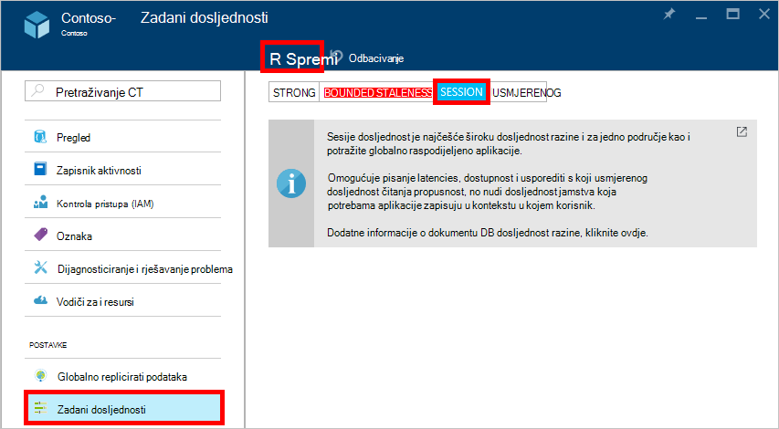

<properties
    pageTitle="Razina dosljednost u DocumentDB | Microsoft Azure"
    description="DocumentDB ima četiri razine dosljednost radi usmjerenog dosljednost saldo, dostupnost i Latencija gubitke."
    keywords="usmjerenog dosljednost, documentdb, azure, Microsoft azure"
    services="documentdb"
    authors="syamkmsft"
    manager="jhubbard"
    editor="cgronlun"
    documentationCenter=""/>

<tags
    ms.service="documentdb"
    ms.workload="data-services"
    ms.tgt_pltfrm="na"
    ms.devlang="na"
    ms.topic="article"
    ms.date="08/24/2016"
    ms.author="syamk"/>

# Razina dosljednost u DocumentDB

Azure DocumentDB osmišljene na gore s globalnog raspodjele na umu. Osmišljena je za nude predvidljivi niske latencije jamstva, SLA za dostupnost 99,99% i više dobro definiranom Opuštena dosljednost modela. Trenutno DocumentDB nudi četiri razine dosljednost: istaknuti, bounded-staleness, sesije i usmjerenog. Osim na **istaknuti** i **usmjerenog dosljednost** modelima obično nudi drugih baza podataka NoSQL DocumentDB nudi dva pažljivo codified i operationalized dosljednost modelima – **bounded staleness** i **sesije**i je potvrdio njihove upotrebljivost protiv slučajeva koristi realni svijeta. Skupno te dosljednost četiri razine omogućuju vam da biste dobro utemeljena gubitke između dosljednost, dostupnost i Latencija. 

## Opseg dosljednosti

Preciznosti dosljednost implementaciju ograničen je na zahtjev za jednog korisnika. Zahtjev za pisanje mogu odgovarati na umetanje, Zamijeni, upsert ili izbrišite transakcije (sa ili bez izvođenja pridružene pre ili objavu okidača). Ili zahtjev za pisanje odgovarati transakcijskih izvođenja JavaScript pohranjene procedure operacijskom putem većeg broja dokumenata unutar particije. Kao i kod pisanja, transakcije za čitanje/upit i implementaciju ograničen je na zahtjev za jednog korisnika. Korisnik možda morati paginate putem velikih skup rezultata, koje se protežu na više particija, no svaki čitati transakcije je usmjeren na jednu stranicu i poslužena iz unutar jedna particija.

## Dosljednost razine

Zadana razina dosljednost možete konfigurirati na računu za baze podataka koji se primjenjuje na sve zbirke (preko svih baza podataka) u odjeljku račun baze podataka. Po zadanom sve čitanja i upiti poslani protiv resursi korisnički definirane koristit će Zadana razina dosljednost naveden na računu za bazu podataka. Međutim, možete Opustite razinu dosljednosti zahtjeva za određene čitanje/upit navođenjem zaglavlje zahtjev [[x ms-dosljednosti-razinom]](https://msdn.microsoft.com/library/azure/mt632096.aspx) . Postoje četiri vrste dosljednost razine podržava protokol za replikaciju DocumentDB, a omogućuju Očisti trade-off između određenih dosljednost jamstva i performanse, prema uputama u nastavku.

![DocumentDB nudi više, dobro definiran (Opuštena) dosljednost modela na raspolaganju][1]

**Strong**: 

- Istaknuti dosljednost nudi [linearizability](https://aphyr.com/posts/313-strong-consistency-models) jamstva s čitanja zajamčiti da biste se vratili na najnoviju verziju dokumenta. 
- Istaknuti dosljednost jamčiti da pisanje vidljiv je samo kada je pridaje durably po kvorum Većina od replike. Pisanje ili sinkrono pridaje durably primarnih i kvorum secondaries ili ga je prekinut. Čitanje uvijek označeni tako da većina čitati kvorum, klijent nikad ne mogu vidjeti na nepotvrđenim ili djelomično pisanje i uvijek zajamčena za čitanje najnovijih acknowledged unos. 
- DocumentDB računima koje ste konfigurirali za korištenje jaku dosljednosti ne možete pridružiti svoj račun DocumentDB više Azure regija. 
- Trošak operacija čitanja (pomoću [jedinice zahtjev](documentdb-request-units.md) potrošena) s istaknuti dosljednost je veće od sesije i usmjerenog, ali isto kao bounded staleness.
 

**Bounded staleness**: 

- Bounded staleness dosljednost jamstva koja možda na čitanja kašnjenja iza zapisivanja najviše verzije *K* ili prefiksi dokumenta ili *t* vremenski interval. 
- Zbog toga kada odaberete bounded staleness, "staleness" moguće je konfigurirati na dva načina: 
    - Broj verzije *K* dokumenta koji se na čitanja kašnjenja iza u zapisivanja
    - Vremenski interval *t* 
- Bounded staleness ponuda globalni potpunim osim prozora"staleness". Imajte na umu da monotonic čitanje jamčiti postoji unutar područja unutrašnji i vanjski "staleness prozora". 
- Bounded staleness nudi jači jamstva dosljednost od sesija ili konačnog dosljednost. Za globalno raspodijeljeno aplikacije, preporučujemo da koristite bounded staleness scenarijima za koju želite imati istaknuti dosljednost, ali želite dostupnost 99,99% i niske latencije. 
- Računi DocumentDB konfiguriranih pomoću bounded staleness dosljednost možete pridružiti svoj račun DocumentDB bilo koji broj Azure područja. 
- Trošak operacija čitanja (pomoću RUs potrošena) bounded staleness je veće od sesije i usmjerenog dosljednost, ali jednaki istaknuti dosljednost.

**Sesije**: 

- Za razliku od modele globalni dosljednost nudi istaknuti i bounded staleness dosljednost razine sesiju dosljednost implementaciju ograničen je na sesije klijenta. 
- Sesije dosljednost idealna je za sve scenariji kojima sesije uređaj ili korisnika sudjeluje jer jamčiti monotonic čitanja, monotonic zapisivanja i čitanje jamčiti vlastite zapisivanje (RYW). 
- Sesije dosljednost omogućuje predvidljivi dosljednost za sesiju, a najviše čitati propusnost tijekom koja nudi najnižih Latencija zapisivanja i čitanja. 
- Računi DocumentDB konfiguriranih pomoću sesiju dosljednost možete pridružiti svoj račun DocumentDB bilo koji broj Azure područja. 
- Trošak operacija čitanja (pomoću RUs potrošena) razinom dosljednost sesije je manji od istaknuti i bounded staleness, ali više usmjerenog dosljednosti
 

**Usmjerenog**: 

- Usmjerenog dosljednost jamčiti da u Izostanak sve daljnje zapisivanje, replike unutar grupe će naposljetku Spoji. 
- Usmjerenog dosljednost je najslabija oblik dosljednost gdje klijent mogla bi vam se vrijednosti koje su starije od one prije koji ste vidjeti.
- Usmjerenog dosljednosti nudi najslabija dosljednosti čitanja, ali nudi najnižu Latencija čitanja i pisanja.
- Računi DocumentDB konfiguriranih pomoću usmjerenog dosljednost možete pridružiti svoj račun DocumentDB bilo koji broj Azure područja. 
- Trošak operacija čitanja (pomoću RUs potrošena) usmjerenog dosljednost razinu je najniže svih razina dosljednost DocumentDB.

## Jamstva dosljednosti

U sljedećoj su tablici hvata različite dosljednost jamstva koja odgovara dosljednost četiri razine.

| Jamstva                                                         |    Strong                                       |    Bounded Staleness                                                                           |    Sesije                                       |    Usmjerenog                                 |
|----------------------------------------------------------|-------------------------------------------------|------------------------------------------------------------------------------------------------|--------------------------------------------------|--------------------------------------------------|
|    **Globalni potpunim**                                |    Da                                          |    Da, izvan "staleness prozora"                                                      |    Ne, redoslijed djelomične "sesiju"                   |    ne                                            |
|    **Jamstva dosljedan prefiksa**                       |    Da                                          |    Da                                                                                         |    Da                                           |    Da                                           |
|    **Monotonic čitanja**                                   |    Da                                          |    Da, preko područja izvan prozora staleness i unutar područja cijelo vrijeme.     |    Da, za u sesiji                    |    ne                                            |
|    **Monotonic zapisivanja**                                  |    Da                                          |    Da                                                                                         |    Da                                           |    Da                                           |
|    **Čitanje vaše zapisivanja**                                  |    Da                                          |    Da                                                                                         |    Da (u područje za unos)                      |    ne                                            |

## Konfiguriranje Zadana razina dosljednosti

1.  [Portal za Azure](https://portal.azure.com/)u Jumpbar, kliknite **DocumentDB (NoSQL)**.

2. U plohu **DocumentDB (NoSQL)** odaberite račun baze podataka da biste izmijenili.

3. U plohu računa kliknite **Zadana dosljednost**.

4. U plohu **Zadani dosljednost** odaberite novu razinu dosljednost, a zatim kliknite **Spremi**.

    

## Dosljednost razine za upite

Prema zadanim postavkama za resurse korisnički definirane razinu dosljednost za upite jednak razinu dosljednost za čitanje. Po zadanom je ažuriranje indeksa sinkrono na svakom Umetanje, zamjena ili Izbriši dokument u zbirku. Time se omogućuje upite za proslavu iste razine dosljednost kao čitanja dokumenta. Dok DocumentDB pisanja Optimizirano te podržava osigurale trajne jedinicama zapisivanja dokumenta, održavanja sinkrono indeksa i posluživanje dosljedan upite, možete konfigurirati određene zbirke lazily ažurirati njihove indeksa. Drži indeksiranje dodatno pojačava performanse pisanje i idealna je za skupno ingestion scenariji kada je radno opterećenje prvenstveno čitanje podebljano.  

Način rada za indeksiranje|  Čita|  Upiti  
-------------|-------|---------
Jednak (zadano)|   Odaberite istaknuti, bounded staleness sesiju ili konačnog|    Odaberite istaknuti, bounded staleness sesiju ili konačnog|
Drži|   Odaberite istaknuti, bounded staleness sesiju, ili usmjerenog|    Usmjerenog  

Kao s zahtjeva za čitanje možete smanjite razinu dosljednost zahtjeva za određene upita navođenjem zaglavlje [x ms-dosljednost-razini](https://msdn.microsoft.com/library/azure/mt632096.aspx) zahtjev.

## Daljnji koraci

Ako želite učiniti čitanje više o razinama dosljednosti i tradeoffs, preporučujemo u sljedećim resursima:

-   Doug Terry. Repliciranu dosljednost podataka objašnjenje putem bejzbol (videozapis).   
[https://www.Youtube.com/watch?v=gluIh8zd26I](https://www.youtube.com/watch?v=gluIh8zd26I)
-   Doug Terry. Repliciranu dosljednost podataka objašnjenje kroz bejzbol.   
[http://Research.microsoft.com/pubs/157411/ConsistencyAndBaseballReport.PDF](http://research.microsoft.com/pubs/157411/ConsistencyAndBaseballReport.pdf)
-   Doug Terry. Sesije jamstva za Weakly dosljedan repliciranu podatke.   
[http://DL.ACM.org/CITATION.cfm?id=383631](http://dl.acm.org/citation.cfm?id=383631)
-   Abadi dan. Tradeoffs dosljednost u Moderna Distributed dizajna baze podataka sustava: KAPICA je samo dio priče ".   
[http://Computer.org/CSDL/mags/CO/2012/02/mco2012020037-ABS.HTML](http://computer.org/csdl/mags/co/2012/02/mco2012020037-abs.html)
-   Peter Bailis, Shivaram Venkataraman, Franklin J. Goran, Joseph s. Hellerstein, zaštita Stoica. Probabilistic Bounded Staleness (PBS) za praktično djelomična Quorums.   
[http://vldb.org/pvldb/vol5/p776_peterbailis_vldb2012.PDF](http://vldb.org/pvldb/vol5/p776_peterbailis_vldb2012.pdf)
-   Werner Vogels. Usmjerenog dosljedan - Revisited.    
[http://allthingsdistributed.com/2008/12/eventually_consistent.HTML](http://allthingsdistributed.com/2008/12/eventually_consistent.html)

[1]: ./media/documentdb-consistency-levels/consistency-tradeoffs.png
