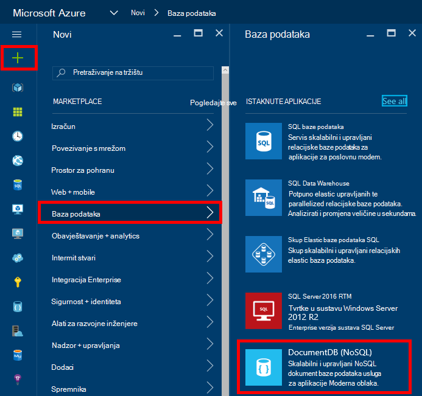
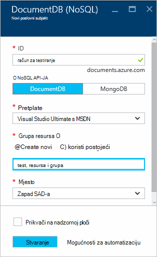
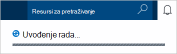
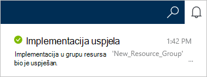
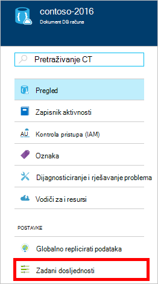
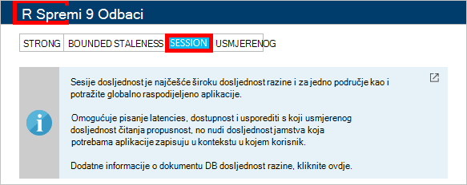

<properties
    pageTitle="Kako stvoriti račun DocumentDB | Microsoft Azure"
    description="Sastavljanje NoSQL baze podataka pomoću Azure DocumentDB. Slijedite ove upute za stvaranje računa DocumentDB i počeli raditi blazing brzo, globalnoj razini NoSQL bazu podataka." 
    keywords="Stvaranje baze podataka"
    services="documentdb"
    documentationCenter=""
    authors="mimig1"
    manager="jhubbard"
    editor="monicar"/>

<tags
    ms.service="documentdb"
    ms.workload="data-services"
    ms.tgt_pltfrm="na"
    ms.devlang="na"
    ms.topic="get-started-article"
    ms.date="10/17/2016"
    ms.author="mimig"/>

# Kako stvoriti račun DocumentDB NoSQL pomoću portala za Azure

> [AZURE.SELECTOR]
- [Portal za Azure](documentdb-create-account.md)
- [Azure EŽA i Azure Voditelj resursa](documentdb-automation-resource-manager-cli.md)

Da biste sastavili baze podataka pomoću Microsoft Azure DocumentDB, morate:

- Imate račun za Azure. [Besplatni račun za Azure](https://azure.microsoft.com/free) možete dobiti ako još nemate jedno mjesto. 
- Stvaranje računa DocumentDB.  

Možete stvoriti račun DocumentDB pomoću portala za Azure, predlošci Voditelj resursa Azure ili Azure sučelje naredbenog retka (EŽA). U ovom se članku prikazuje kako stvoriti račun DocumentDB pomoću portala za Azure. Da biste stvorili račun pomoću upravitelja resursa Azure ili EŽA Azure, potražite u članku [Stvaranje računa za automatiziranje DocumentDB baze podataka](documentdb-automation-resource-manager-cli.md).

Novi ste korisnik DocumentDB? Pogledajte [ovaj](https://azure.microsoft.com/documentation/videos/create-documentdb-on-azure/) videozapis četiri minute po luka Hanselman da biste vidjeli kako se najčešće zadatke na portalu.

1.  Prijavite se na [portal za Azure](https://portal.azure.com/).
2.  U Jumpbar, kliknite **Novo**, kliknite **baze podataka**, a zatim **DocumentDB (NoSQL)**. 

      

3. U plohu **novog računa** navedite željena konfiguracija računa DocumentDB.

    

    - U okviru **ID-a** unesite naziv za identifikaciju DocumentDB računa.  Kada se provjerava **ID-a** , u okviru **ID** pojavit će se Zelena kvačica. Vrijednost za **ID-a** postaje naziv glavnog računala unutar URI. **ID-a** mogu sadržavati samo mala slova, brojeve i "-" znakova i mora biti između 3 i 50 znakova. Imajte na umu *documents.azure.com* dodaju se na krajnjoj točki naziv odaberete, rezultat koji postaje na krajnjoj točki računa DocumentDB.

    - U okviru **NoSQL API** odaberite model programiranja koristiti:
        - **DocumentDB**: API-DocumentDB JA je dostupan putem .NET, Java, Node.js, Python i JavaScript [SDK-ovi](documentdb-sdk-dotnet.md), kao i HTTP [OSTALE](https://msdn.microsoft.com/library/azure/dn781481.aspx)i nudi programatski pristup DocumentDB funkcionalnost. 
       
        - **MongoDB**: DocumentDB **MongoDB** API-ji nudi u [razinu protokola podrška](documentdb-protocol-mongodb.md) . Kada odaberete mogućnost MongoDB API-JA, možete koristiti postojeće MongoDB SDK-ovi i [Alati](documentdb-mongodb-mongochef.md) razgovarati s DocumentDB. Možete [premjestiti](documentdb-import-data.md) postojeće MongoDB aplikacije da biste koristili DocumentDB, [bez promjena kod potrebne](documentdb-connect-mongodb-account.md)i iskoristiti potpuno upravljanih bazu podataka kao usluga s neograničen mjerilo, globalni replikacije i druge mogućnosti.

    - Za **pretplate**odaberite Azure pretplatu u koju želite koristiti za DocumentDB račun. Ako račun sadrži samo jedan pretplatu, taj račun nije odabrano po zadanom.

    - U **Grupi resursa**, odaberite ili stvorite grupu resursa za vaš račun DocumentDB.  Po zadanom stvara novu grupu resursa. Dodatne informacije potražite u članku [pomoću portala za Azure upravljanja Azure resurse](../articles/azure-portal/resource-group-portal.md).

    - Da biste odredili zemljopisnu lokaciju u kojem će biti DocumentDB račun koristiti **mjesto** . 

4.  Kada niste konfigurirali novim mogućnostima DocumentDB račun, kliknite **Stvori**. Da biste provjerili status implementacije, potvrdite okvir središtu obavijesti.  

      

    

5.  Nakon stvaranja računa DocumentDB spremna je za korištenje sa zadanim postavkama. Zadani dosljednost računa DocumentDB postavljen je na **sesiju**.  Zadani dosljednost možete prilagoditi tako da kliknete **Zadani dosljednost** na izborniku resursa. Da biste saznali više o razinama dosljednost nudi DocumentDB, potražite u članku [dosljednost razine u DocumentDB](documentdb-consistency-levels.md).

      

      

[How to: Create a DocumentDB account]: #Howto
[Next steps]: #NextSteps
[documentdb-manage]:../articles/documentdb/documentdb-manage.md

## Daljnji koraci

Sad kad imate DocumentDB račun, sljedeći je korak da biste stvorili DocumentDB zbirke i baza podataka. 

Možete stvoriti novu zbirku i baze podataka pomoću nešto od sljedećeg:

- Azure portal, kao što je opisano u [Stvaranje zbirke DocumentDB pomoću portala za Azure](documentdb-create-collection.md).
- All-inclusive praktične vodiče, što obuhvaća ogledne podatke: [.NET](documentdb-get-started.md), [.NET MVC](documentdb-dotnet-application.md), [Java](documentdb-java-application.md), [Node.js](documentdb-nodejs-application.md)i [Python](documentdb-python-application.md).
- [.NET](documentdb-dotnet-samples.md#database-examples), [Node.js](documentdb-nodejs-samples.md#database-examples)i [Python](documentdb-python-samples.md#database-examples) ogledne kod dostupne u GitHub.
- U [.NET](documentdb-sdk-dotnet.md), [Node.js](documentdb-sdk-node.md), [jezika Java](documentdb-sdk-java.md), [Python](documentdb-sdk-python.md)i SDK-ovi [ostalih](https://msdn.microsoft.com/library/azure/mt489072.aspx) .

Nakon stvaranja baze podataka i zbirka, morate da biste [dodali dokumente sa](documentdb-view-json-document-explorer.md) zbirke.

Nakon dokumenata u zbirci možete koristiti [DocumentDB SQL](documentdb-sql-query.md) izvršavanja [upita](documentdb-sql-query.md#executing-queries) protiv dokumenata. Upite možete izvršiti pomoću [Programa Explorer upita](documentdb-query-collections-query-explorer.md) u portal, [REST API -JA](https://msdn.microsoft.com/library/azure/dn781481.aspx)ili nešto [SDK-ovi](documentdb-sdk-dotnet.md).

### uči više

Da biste saznali više o DocumentDB, proučite ove resurse:

-   [Tečaj za DocumentDB](https://azure.microsoft.com/documentation/learning-paths/documentdb/)
-   [Model DocumentDB hijerarhijski resursa i koncepti](documentdb-resources.md)
