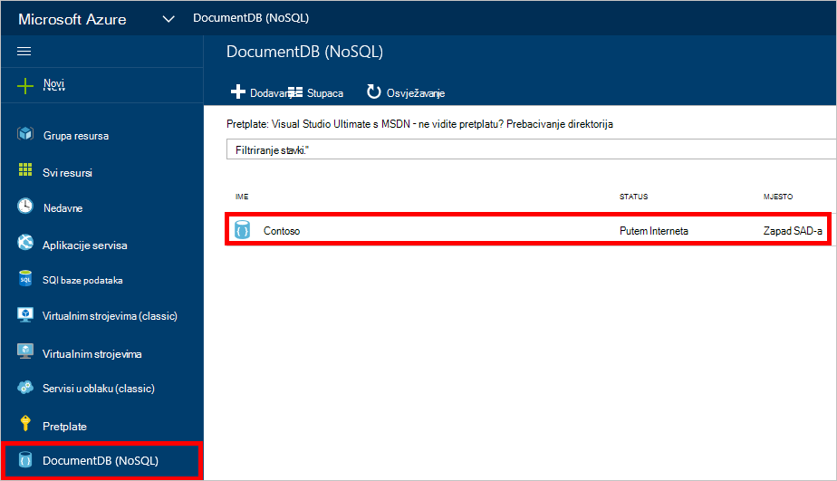
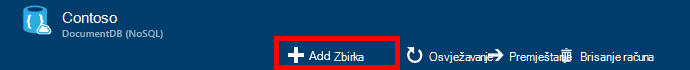
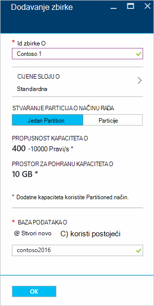
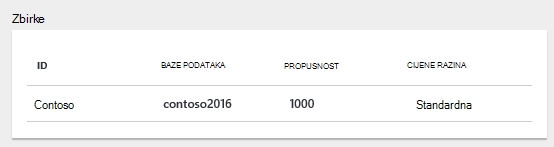
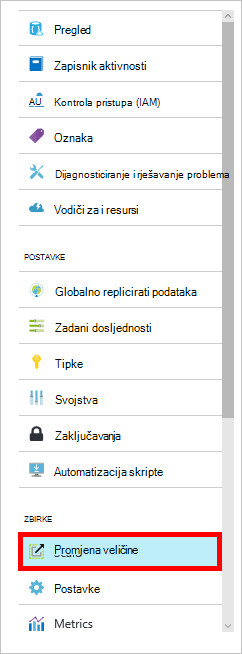

<properties 
    pageTitle="Stvaranje baze podataka DocumentDB i zbirka | Microsoft Azure" 
    description="Saznajte kako stvoriti NoSQL baze podataka i JSON dokument zbirke pomoću portala za mrežni servis za Azure DocumentDB temelje tijekom spremanja dokumenta baze podataka. Dobiti besplatnu probnu verziju danas." 
    services="documentdb" 
    authors="mimig1" 
    manager="jhubbard" 
    editor="monicar" 
    documentationCenter=""/>

<tags 
    ms.service="documentdb" 
    ms.workload="data-services" 
    ms.tgt_pltfrm="na" 
    ms.devlang="na" 
    ms.topic="article" 
    ms.date="10/17/2016" 
    ms.author="mimig"/>

# Kako stvoriti DocumentDB zbirke i baze podataka pomoću portala za Azure

Da biste koristili Microsoft Azure DocumentDB, morate imati [račun DocumentDB](documentdb-create-account.md), baze podataka, zbirka i dokumenata. U ovoj se temi opisuje kako stvoriti DocumentDB zbirke na portalu za Azure. 

Niste sigurni koje zbirka je? U odjeljku [što je zbirka DocumentDB?](#what-is-a-documentdb-collection)

1.  [Portal za Azure](https://portal.azure.com/)u Jumpbar, kliknite **DocumentDB (NoSQL)**, a zatim plohu **DocumentDB (NoSQL)** odaberite račun u koju želite dodati zbirku. Ako nemate sve poslovne kontakte na popisu, morat ćete [stvoriti račun DocumentDB](documentdb-create-account.md).

    
    
    Ako **DocumentDB (NoSQL)** nije vidljiv u na Jumpbar, kliknite **Više servisa** , a zatim kliknite **DocumentDB (NoSQL)**. Ako nemate sve poslovne kontakte na popisu, morat ćete [stvoriti račun DocumentDB](documentdb-create-account.md).

2. U plohu **DocumentDB računa** za odabrani račun, kliknite **Dodaj zbirku**.

    

3. U plohu **Dodaj zbirku** , u okviru **ID** unesite ID za nove zbirke. Imena zbirki mora biti od 1 do 255 znakova, a ne smije sadržavati `/ \ # ?` ili praznina. Kada se provjerava naziv, u okviru ID pojavit će se Zelena kvačica.

    

4. Prema zadanim postavkama **Cijene sloju** postavljen na **standardni** tako da možete prilagoditi propusnost i prostora za pohranu za vašu zbirku. Dodatne informacije o cijenama sloju potražite u članku [performanse razine u DocumentDB](documentdb-performance-levels.md).  

5. Odabir **načinu Partitioning** zbirke, **Jedan particije** ili **Partitioned**. 

    **Jedan particija** ima kapacitet rezervirane prostora za pohranu od 10 GB, a može imati propusnost razine iz 400-10 000 zahtjev jedinica/drugoj (Pravi na s). Jedan Pravi odgovara propusnost čitanje dokumenta 1KB. Dodatne informacije o zahtjevu jedinice potražite u članku [jedinice zahtjev](documentdb-request-units.md). 

    **Particioniranom zbirke** mogu mijenjati veličinu obraditi neograničeno količinu prostora za pohranu preko više particija, a možete imati propusnost razine počevši od 10,100 Pravi/s. Na portalu najveću prostora za pohranu možete rezervirati 250 GB, a većina propusnost možete rezervirati 250.000 Pravi/s. Da biste povećali ili kvote, ispunite zahtjev prema uputama u [zahtjev za povećati DocumentDB kvote za račun](documentdb-increase-limits.md). Dodatne informaiton o particioniranom zbirkama potražite u [jednom particija i particioniranom zbirke](documentdb-partition-data.md#single-partition-and-partitioned-collections).

    Prema zadanim postavkama propusnost za novu zbirku jedan particija postavljen je na 1000 Pravi/s s kapacitetom za pohranu od 10 GB. Za zbirku particioniranom propusnost zbirke postavljen je na 10100 Pravi/s s kapacitetom za pohranu od 250 GB. Propusnost i prostora za pohranu za zbirku možete promijeniti nakon stvaranja zbirke. 

6. Ako stvarate particioniranom zbirke, odaberite **Particija ključ** za zbirku. Odabir tipku točan particija je važno u stvaranju performant zbirke. Dodatne informacije o odabirom particija ključ, potražite u članku [dizajniranje za particija](documentdb-partition-data.md#designing-for-partitioning).

7. U plohu **baze podataka** , stvoriti novu bazu podataka ili koristite postojećeg. Nazivi baze podataka mora biti od 1 do 255 znakova, a ne smije sadržavati `/ \ # ?` ili praznina. Da biste provjerili valjanost naziv, kliknite izvan okvira. Kada se provjerava naziv, u okviru prikazat će se Zelena kvačica.

8. Kliknite **u redu** pri dnu zaslona da biste stvorili novu zbirku. 

9. Novu zbirku sada se pojavljuje u leće **zbirke** na **Pregled** plohu.
 
    

10. **Neobavezno:** Da biste izmijenili propusnost zbirke na portalu, kliknite **Prilagodi** na izborniku resursa. 

    

## Što je zbirka DocumentDB? 

Zbirka je spremnik JSON dokumenata i pridruženi logike aplikacije JavaScript. Zbirka je naplatu entitet, gdje [trošak](documentdb-performance-levels.md) određen dodijeljenu propusnost zbirke. Zbirke mogu obuhvaćati jedan ili više particija/poslužitelja, a mogu mijenjati veličinu učiniti gotovo neograničeno količine prostora za pohranu ili propusnost.

Zbirke automatski particije u jednom ili više fizičke poslužitelja tako da DocumentDB. Prilikom stvaranja zbirke možete odrediti dodijeljenu propusnost pomoću zahtjev jedinica po i druga particija ključa svojstvo. Vrijednost tog svojstva koristit će DocumentDB za raspodjelu dokumenata među particije i zahtjevi za usmjeravanje kao što su upiti. Vrijednost ključa particije i djeluje kao granicu naslova transakcijom za pohranjene procedure i okidača. Svaku zbirku sadrži rezervirana količinu propusnost specifične za tu zbirku koji se zajednički koristi s drugim zbirkama u isti račun. Stoga skaliranje izvan vaše aplikacije i za pohranu i propusnost. 

Zbirke nisu jednaki tablica u relacijskih baza podataka. Zbirke nametanje shemu, zapravo DocumentDB nametanje sve sheme, to je shema slobodno baze podataka. Stoga različite vrste dokumenata s raznih sheme možete spremiti u istoj zbirci. Možete odabrati da biste koristili zbirke za pohranu objekte jedne vrste kao što činite s tablicama. Najbolji modela ovisi o samo kako podatke pojavit će se zajedno u upitima i transakcije.

## Ostali načini stvaranja DocumentDB zbirke

Zbirke nemaju će biti stvoren pomoću portala, možete stvoriti pomoću [DocumentDB SDK-ovi](documentdb-sdk-dotnet.md) i REST API-JA. 

- C# kod uzorka, potražite u članku [uzoraka zbirke C#](documentdb-dotnet-samples.md#collection-examples). 
- Kod uzorak Node.js potražite u članku [Node.js zbirke uzorka](documentdb-nodejs-samples.md#collection-examples).
- Kod uzorak Python potražite u članku [Python zbirke uzorka](documentdb-python-samples.md#collection-examples).
- Uzorak REST API-JA potražite u članku [Stvaranje zbirke](https://msdn.microsoft.com/library/azure/mt489078.aspx).

## Otklanjanje poteškoća

Ako **Dodaj zbirku** je onemogućen na portalu za Azure, to znači da vaš račun trenutno je onemogućen, koje obično pojavljuje kada se koriste sve prednosti kredita za mjesec.   

## Daljnji koraci

Sad kad imate zbirku, sljedeći je korak da biste dodali dokumente ili uvoz dokumenata u zbirci. Kada je riječ o dodavanje dokumenata u zbirci, imate nekoliko mogućnosti:

- Možete [dodati dokumenata](documentdb-view-json-document-explorer.md) pomoću programa Explorer dokument na portalu.
- [Uvoz dokumenata i podataka](documentdb-import-data.md) možete pomoću DocumentDB podataka alata za migraciju, koji omogućuje uvoz JSON i CSV datoteke, kao i podatke iz sustava SQL Server, MongoDB, spremište tablica platforme Azure i druge zbirke DocumentDB. 
- Ili dokumente možete dodati pomoću neke od [DocumentDB SDK-ovi](documentdb-sdk-dotnet.md). DocumentDB ima .NET, Java, Python, Node.js i JavaScript API SDK-ovi. C# kod uzorka s prikazom načina za rad s dokumentima pomoću DocumentDB .NET SDK, potražite u članku [uzoraka dokument C#](documentdb-dotnet-samples.md#document-examples). Primjere koda Node.js s prikazom načina za rad s dokumentima pomoću DocumentDB Node.js SDK, potražite u članku [Node.js dokument uzorka](documentdb-nodejs-samples.md#document-examples).

Nakon dokumenata u zbirci [DocumentDB SQL](documentdb-sql-query.md) možete koristiti za [izvršavanje upita](documentdb-sql-query.md#executing-queries) protiv dokumenata pomoću [Programa Explorer upita](documentdb-query-collections-query-explorer.md) na portalu, [REST API -JA](https://msdn.microsoft.com/library/azure/dn781481.aspx)ili nešto [SDK-ovi](documentdb-sdk-dotnet.md). 
