<properties 
    pageTitle="Implementacija DocumentDB i Azure aplikacije servisa Web Apps pomoću predloška Azure resursima | Microsoft Azure" 
    description="Saznajte kako implementirati DocumentDB računa, Azure aplikacije servisa web-aplikacije i uzorak web-aplikacije pomoću predloška Azure Voditelj resursa." 
    services="documentdb, app-service\web" 
    authors="h0n" 
    manager="jhubbard" 
    editor="monicar" 
    documentationCenter=""/>

<tags 
    ms.service="documentdb" 
    ms.workload="data-services" 
    ms.tgt_pltfrm="na" 
    ms.devlang="na" 
    ms.topic="article" 
    ms.date="08/02/2016" 
    ms.author="hawong"/>

# Implementacija DocumentDB i Azure aplikacije servisa Web Apps pomoću predloška Azure Voditelj resursa

Pomoću ovog praktičnog vodiča prikazuje kako koristiti predložak Azure Voditelj resursa za implementaciju i integracija [Microsoft Azure DocumentDB](https://azure.microsoft.com/services/documentdb/), web-aplikacije programa [Aplikacije servisa za Azure](http://go.microsoft.com/fwlink/?LinkId=529714) i uzorak web-aplikacije.

Korištenje predložaka Azure Voditelj resursa, možete jednostavno automatizirati implementaciji i konfiguraciji Azure resurse.  Pomoću ovog praktičnog vodiča pokazuje kako implementacija web-aplikacije i automatski konfigurirao podatke za povezivanje DocumentDB računa.

Po dovršetku ovog praktičnog vodiča će se moći odgovaraju na sljedeća pitanja:  

-   Kako koristiti predložak Azure Voditelj resursa za implementaciju i integracija DocumentDB računa i web-aplikacijama u aplikacije servisa za Azure?
-   Kako koristiti predložak Azure Voditelj resursa za implementaciju i integracija DocumentDB račun, web-aplikacijama u aplikaciju servisa web-aplikacijama i Webdeploy aplikacije?

## Preduvjeti
> [AZURE.TIP] Tijekom ovog praktičnog vodiča pretpostavlja prethodnog doživljaj Voditelj resursa Azure predložaka ili JSON, trebali biste koje želite izmijeniti referencirani predložaka ili mogućnosti implementacije, zatim poznavanje svako od tih područja bit će potrebno.

Prije nego što slijedeći upute u ovom ćete praktičnom vodiču, provjerite možete li se sljedeće:

- Azure pretplate. Azure je pretplatu.  Dodatne informacije o Nabavljanje pretplate, pročitajte članak [Mogućnosti za kupnju](https://azure.microsoft.com/pricing/purchase-options/), [Nudi člana](https://azure.microsoft.com/pricing/member-offers/)ili [Besplatnu probnu verziju](https://azure.microsoft.com/pricing/free-trial/).

##Korak 1: Preuzimanje datoteke predložaka ##
Započnimo preuzimanje datoteke predložaka koristit ćemo ovog praktičnog vodiča.

1. Preuzimanje predloška za [Stvaranje računa DocumentDB, web-aplikacijama i implementacija aplikacije uzorka pokazni videozapis](https://portalcontent.blob.core.windows.net/samples/DocDBWebsiteTodo.json) u lokalnu mapu (npr. C:\DocumentDBTemplates). Ovaj predložak će implementirati DocumentDB račun, web-aplikacije programa aplikacije servisa i web-aplikacije.  Automatski će konfigurirati web-aplikaciju za povezivanje s računom DocumentDB.

2. Preuzimanje predloška za [Stvaranje računa DocumentDB i uzorak web-aplikacije](https://portalcontent.blob.core.windows.net/samples/DocDBWebSite.json) u lokalnu mapu (npr. C:\DocumentDBTemplates). Ovaj predložak će uvesti DocumentDB račun, web-aplikacije programa aplikacije servisa i će promijeniti postavke aplikacije na web-mjesta da biste jednostavno ponuditi podatke o vezi DocumentDB, ali ne obuhvaća web-aplikacije.  

##Korak 2: Implementacija DocumentDB račun, aplikacije servisa za web app i pokazni videozapis aplikacije primjera

Sada ćemo uvesti naš prvi predložak.

> [AZURE.TIP] Predložak valjanost web app ime i naziv računa DocumentDB koje su unijeli ispod jesu li a) valjani i b) dostupni.  Preporučuje se da provjerava dostupnost nazive namjeravate navesti prije slanja uvođenje.

1. Prijavite se na [Portal za Azure](https://portal.azure.com), kliknite Novo i traženje "Predložak implementacije".
    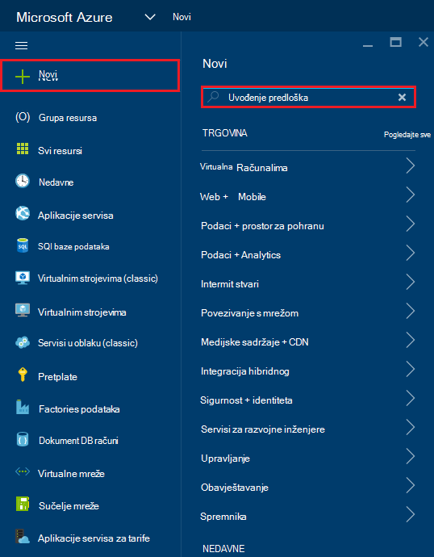

2. Odaberite stavku uvođenje predloška, a zatim kliknite **Stvori**
    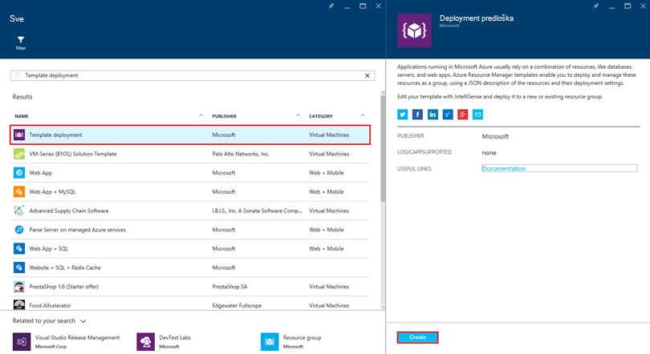

3.  Kliknite **Uređivanje predloška**, lijepljenje sadržaja DocDBWebsiteTodo.json datoteku predloška i kliknite **Spremi**.
    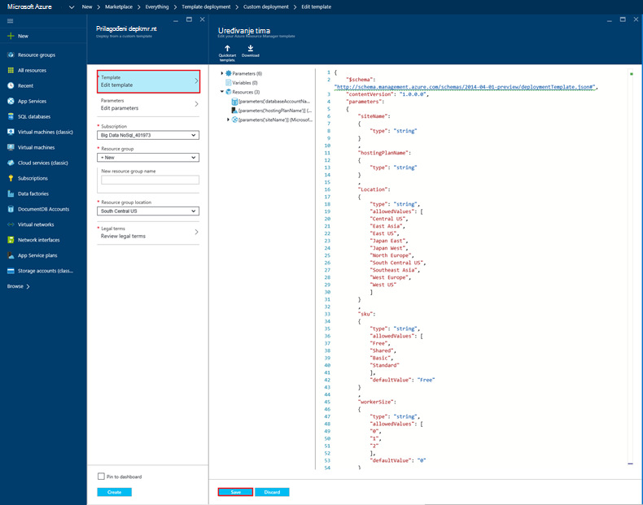

4. Kliknite **Uređivanje parametara**, unesite vrijednosti za svaku obavezno parametara pa kliknite **u redu**.  Parametri se na sljedeći način:

    1. NAZIVWEBMJESTA: Određuje naziv aplikacije servisa za web app i koristi se za sastavljanje URL koji će se koristiti za pristup web-aplikaciji (npr. Ako navedete "mydemodocdbwebapp", a zatim URL koji će pristupiti web-aplikaciji bit će mydemodocdbwebapp.azurewebsites.net).

    2. HOSTINGPLANNAME: Određuje naziv aplikacije servisa za hosting plan da biste stvorili.

    3. LOKACIJA: Određuje Azure mjesto na kojem želite stvoriti DocumentDB i web-resursi vezani uz aplikaciju.

    4. DATABASEACCOUNTNAME: Određuje naziv računa DocumentDB da biste stvorili.   

    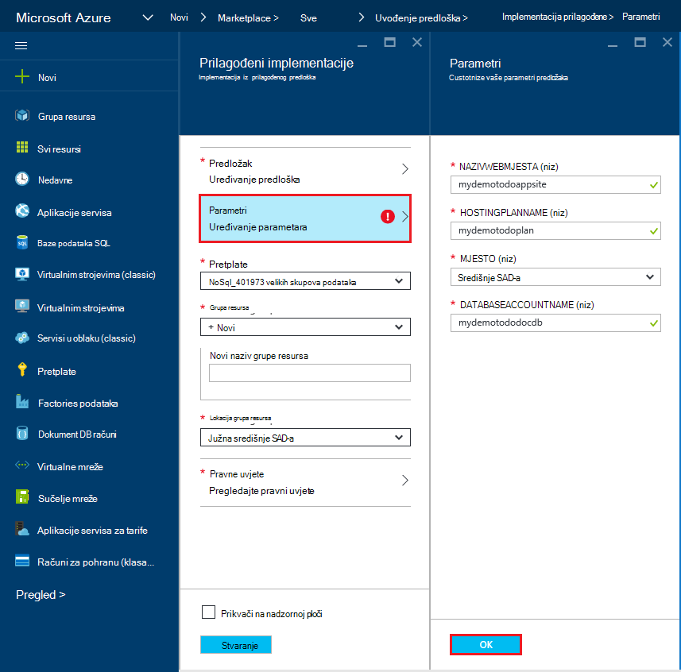

5. Odaberite postojeću grupu resursa ili navedite naziv za novu grupu resursa i odaberite mjesto za grupu resursa.
    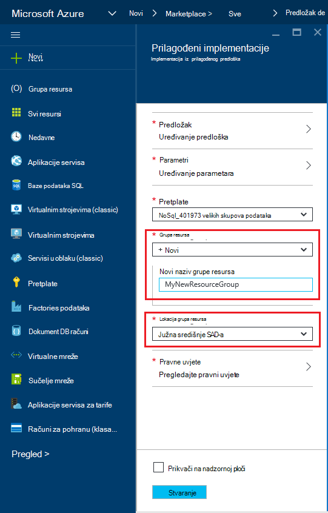
  
6.  Kliknite **Pregled pravne uvjete**, **kupnju**, a zatim kliknite **Stvori** da biste započeli uvođenje.  Odaberite **Prikvači na nadzornu ploču** tako dobivene implementacije je lako vidljivima na vašem Azure početnoj stranici portala.
    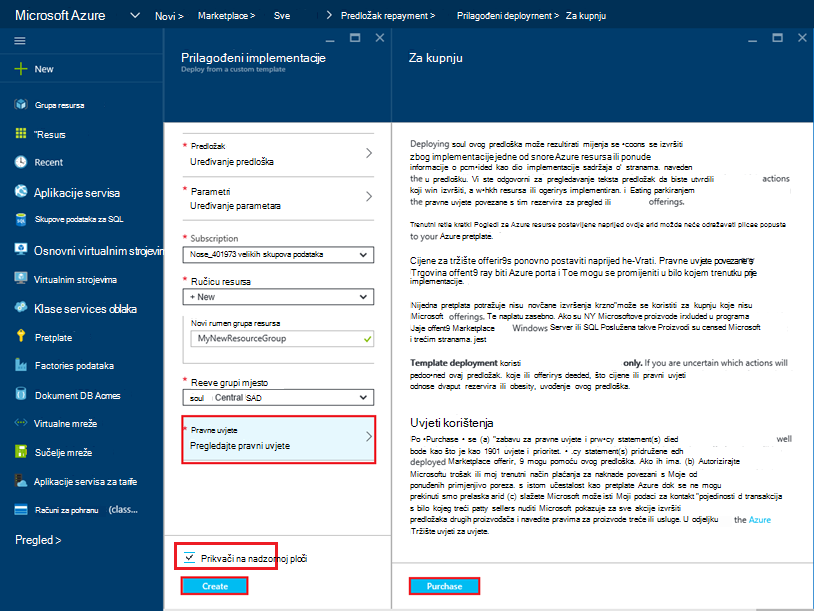

7.  Kada se dovrši implementaciju, otvorit će se plohu grupu resursa.
      

8.  Da biste koristili aplikaciju, jednostavno idite na web app URL (u primjeru iznad, URL će biti http://mydemodocdbwebapp.azurewebsites.net).  Primijetit ćete sljedeće web-aplikacije:

    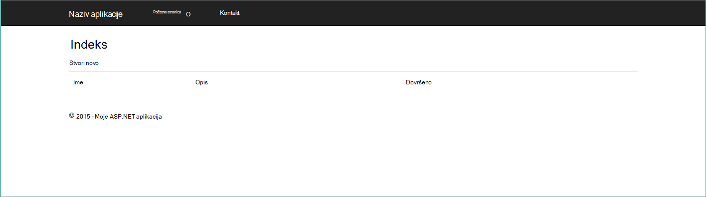

9. Nastaviti i stvoriti nekoliko zadataka u web-aplikaciji, a zatim se vratite u grupi plohu resursa na portalu za Azure. Kliknite račun resursa DocumentDB na popisu resursa, a zatim kliknite **Explorer upita**.
    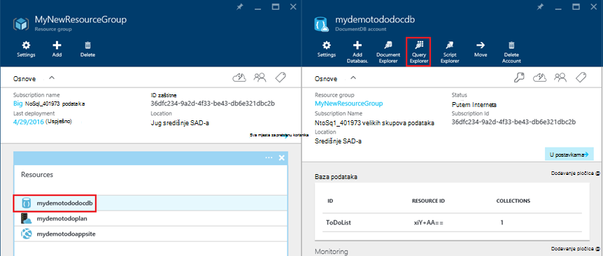  

10. Pokrenite zadani upit, "SELECT *FROM c" i pregledati rezultate.  Imajte na umu da se upit sadrži dohvatiti predstavljanje JSON obveze stavki koje ste stvorili u koraku 7 iznad.  Slobodno isprobajte ih s upitima; na primjer, pokušajte pokrenuti odaberite* iz c gdje c.isComplete = true da biste se vratili sve obveze stavke koje su označene kao dovršenu.

    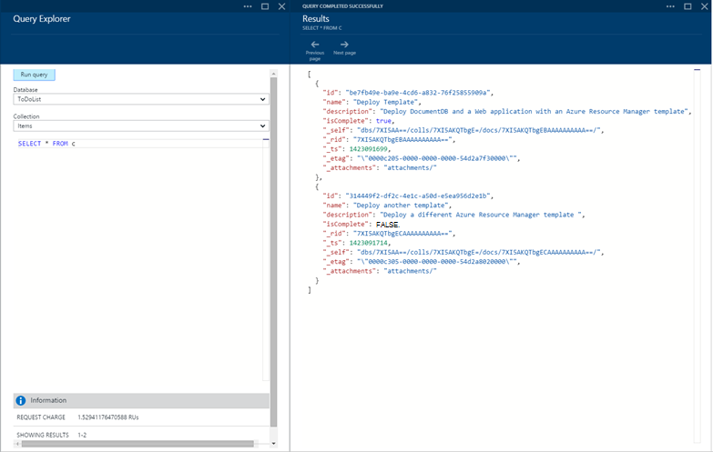

11. Slobodno Upoznavanje portala sučelje za DocumentDB ili izmjena obveze aplikacije uzorka.  Kada budete spremni, recimo uvođenje predloška.
    
 
## Korak 3: Implementacija dokument računa i web-aplikacije uzorka

Sada ćemo uvesti naš drugi predložak.  Ovaj predložak je korisno da biste prikazali kako vam možete ubaciti podatke o vezi u DocumentDB, kao što je račun krajnjoj točki i glavni ključ u web-aplikacijama kao postavke aplikacije ili kao prilagođeni niz. Na primjer, možda imate vlastitu web-aplikaciju koju želite uvesti pomoću DocumentDB računa, a imate podatke o vezi automatski popunjavaju tijekom implementacije.

> [AZURE.TIP] Predložak valjanost web app ime i naziv računa DocumentDB koje su unijeli ispod jesu li a) valjani i b) dostupni.  Preporučuje se da provjerava dostupnost nazive namjeravate navesti prije slanja uvođenje.

1. [Portal za Azure](https://portal.azure.com)kliknite Novo i traženje "Predložak implementacije".
    

2. Odaberite stavku uvođenje predloška, a zatim kliknite **Stvori**
    

3.  Kliknite **Uređivanje predloška**, lijepljenje sadržaja DocDBWebSite.json datoteku predloška i kliknite **Spremi**.
    

4. Kliknite **Uređivanje parametara**, unesite vrijednosti za svaku obavezno parametara pa kliknite **u redu**.  Parametri se na sljedeći način:

    1. NAZIVWEBMJESTA: Određuje naziv aplikacije servisa za web app i koristi se za sastavljanje URL koji će se koristiti za pristup web-aplikaciji (npr. Ako navedete "mydemodocdbwebapp", a zatim URL koji će pristupiti web-aplikaciji bit će mydemodocdbwebapp.azurewebsites.net).

    2. HOSTINGPLANNAME: Određuje naziv aplikacije servisa za hosting plan da biste stvorili.

    3. LOKACIJA: Određuje Azure mjesto na kojem želite stvoriti DocumentDB i web-resursi vezani uz aplikaciju.

    4. DATABASEACCOUNTNAME: Određuje naziv računa DocumentDB da biste stvorili.   

    

5. Odaberite postojeću grupu resursa ili navedite naziv za novu grupu resursa i odaberite mjesto za grupu resursa.
    
  
6.  Kliknite **Pregled pravne uvjete**, **kupnju**, a zatim kliknite **Stvori** da biste započeli uvođenje.  Odaberite **Prikvači na nadzornu ploču** tako dobivene implementacije je lako vidljivima na vašem Azure početnoj stranici portala.
    

7.  Kada se dovrši implementaciju, otvorit će se plohu grupu resursa.
      

8. Kliknite resursi web-aplikacije na popisu resursa, a zatim kliknite **Postavke aplikacije**
    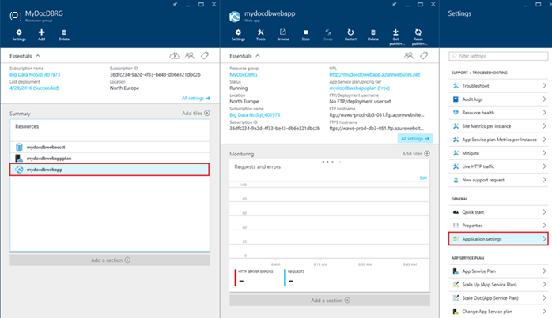  

9. Imajte na umu kako postoje izlaganje za krajnju točku DocumentDB i svih tipki matrica DocumentDB postavke aplikacije.
    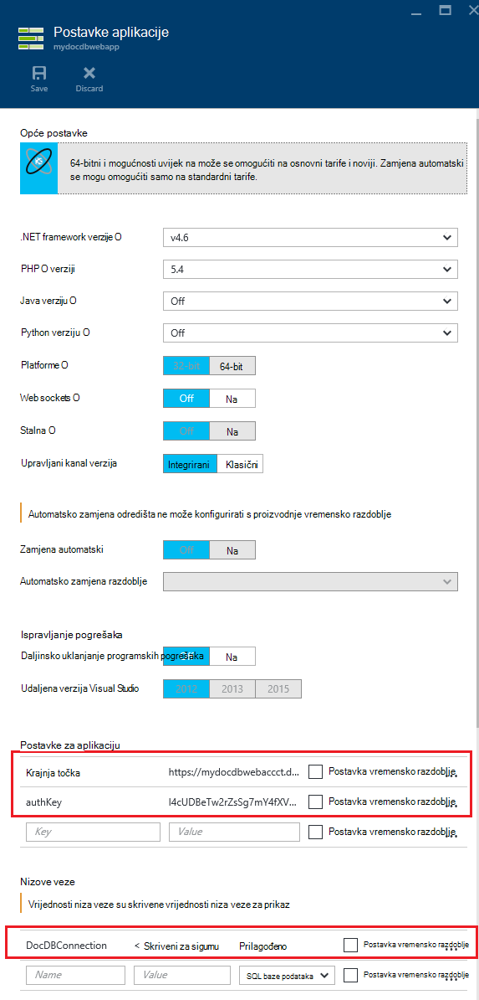  

10. Slobodno da biste nastavili Upoznavanje portala za Azure ili slijedite jedan od naše DocumentDB [uzoraka](http://go.microsoft.com/fwlink/?LinkID=402386) da biste stvorili DocumentDB aplikacije.

    
    

## Daljnji koraci

Čestitamo! Ste implementiran DocumentDB aplikacije servisa za web-aplikacije i uzorak web-aplikacije pomoću predložaka Azure Voditelj resursa.

- Da biste saznali više o DocumentDB, kliknite [ovdje](http://azure.com/docdb).
- Da biste saznali više o web-aplikacije servisa za Azure aplikacijama, kliknite [ovdje](http://go.microsoft.com/fwlink/?LinkId=325362).
- Da biste saznali više o predlošcima Azure Voditelj resursa, kliknite [ovdje](https://msdn.microsoft.com/library/azure/dn790549.aspx).

## Što se promijenilo
* Vodič za promjenu iz aplikacije servisa za web-mjestima potražite u članku: [aplikacije servisa za Azure i Its utjecaj na postojećim Azure servisima](http://go.microsoft.com/fwlink/?LinkId=529714)
* Vodič za promjenu stare portal da biste na novom portalu potražite u članku: [Referenca za navigaciju klasični Portal za Azure](http://go.microsoft.com/fwlink/?LinkId=529715)

>[AZURE.NOTE] Ako želite započeti s aplikacije servisa za Azure prije registracije za račun za Azure, idite na [Pokušajte aplikacije servisa](http://go.microsoft.com/fwlink/?LinkId=523751), gdje možete odmah stvoriti web-aplikacijama short-lived starter u aplikacije servisa. Nema kreditne kartice potrebna; Nema preuzete obveze.
 
