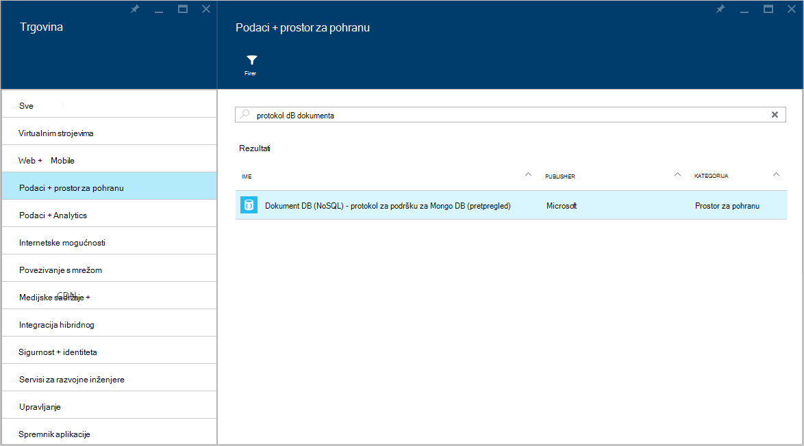
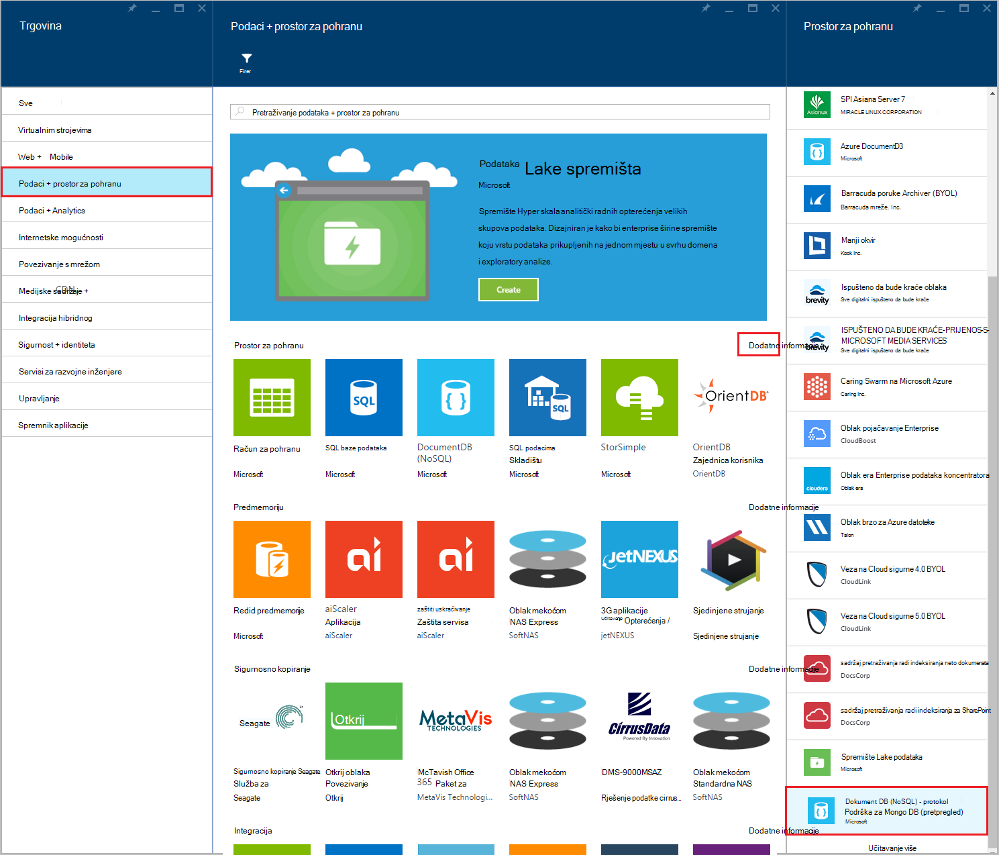
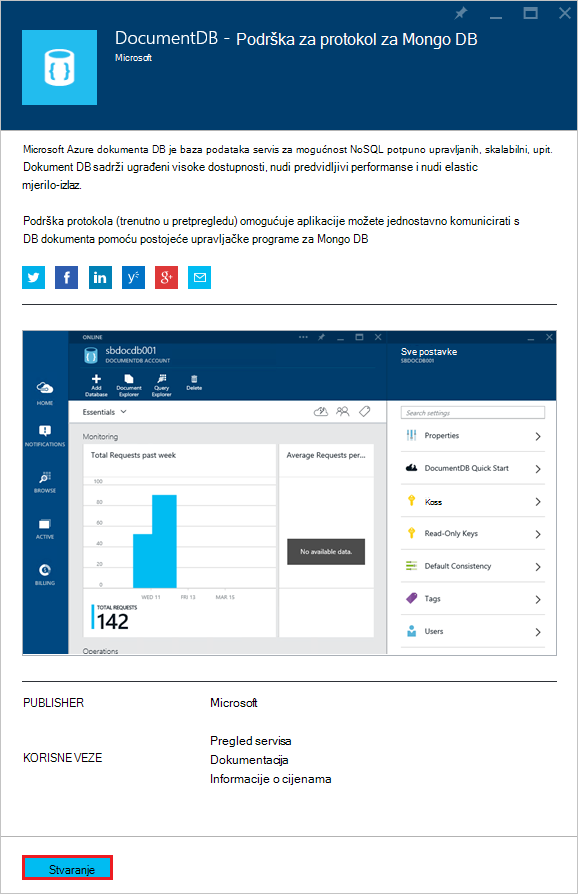
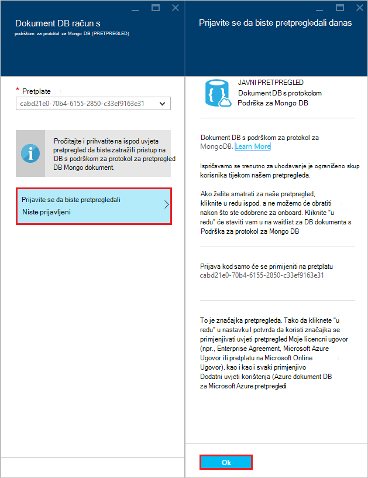
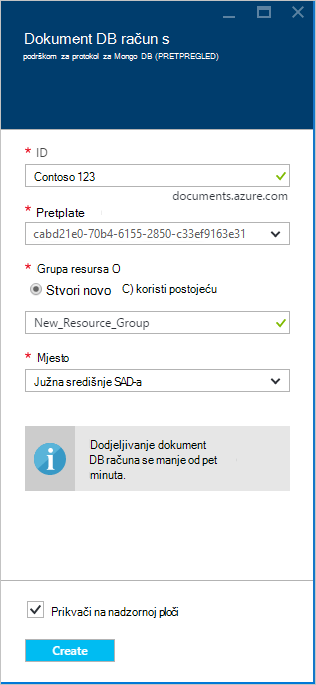
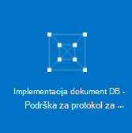
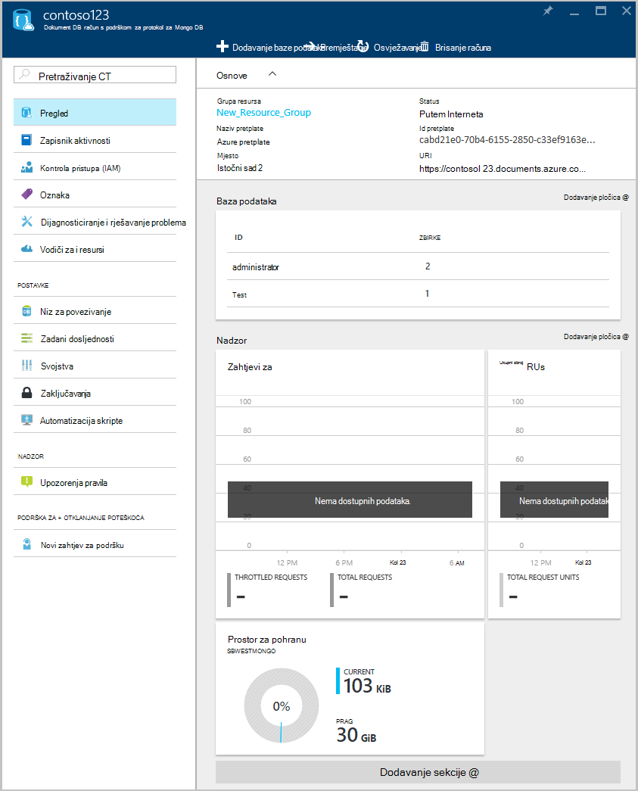

<properties 
    pageTitle="Stvaranje računa DocumentDB s podrškom za protokol za MongoDB | Microsoft Azure" 
    description="Saznajte kako stvoriti DocumentDB račun s podrškom za protokol za MongoDB, sada dostupni za pretpregled." 
    services="documentdb" 
    authors="AndrewHoh" 
    manager="jhubbard" 
    editor="" 
    documentationCenter=""/>

<tags 
    ms.service="documentdb" 
    ms.workload="data-services" 
    ms.tgt_pltfrm="na" 
    ms.devlang="na" 
    ms.topic="article" 
    ms.date="10/20/2016" 
    ms.author="anhoh"/>

# Kako stvoriti račun DocumentDB s podrškom za protokol za MongoDB pomoću portala za Azure

Da biste stvorili račun za Azure DocumentDB protokol podrška za MongoDB, morate:

- Imate račun za Azure. [Besplatni račun za Azure](https://azure.microsoft.com/free/) možete dobiti ako još nemate jedno mjesto.

## Stvaranje računa  

Da biste stvorili DocumentDB račun s podrškom za protokol za MongoDB, poduzeti sljedeće korake.

1. U novom prozoru, prijavite se na [Portal za Azure](https://portal.azure.com).
2. Kliknite **NOVO**, kliknite **podataka + prostor za pohranu**, kliknite **Pogledajte sve**, a pretraživanje kategorija **podataka + prostor za pohranu** za "DocumentDB protokol". Kliknite **DocumentDB - protokol za podršku za MongoDB**.

    

3. Umjesto toga, u kategoriji **podataka + prostor za pohranu** , u odjeljku **Spremanje**, kliknite **više**, a zatim **učitati dodatne** jedan ili više puta da biste prikazali **DocumentDB - protokol za podršku za MongoDB**. Kliknite **DocumentDB - protokol za podršku za MongoDB**.

    

4. U plohu **DocumentDB - protokol za podršku za MongoDB (pretpregled)** kliknite **Stvori** da biste pokrenuli proces prijave za pretpregled.

    

5. U plohu **DocumentDB računa** kliknite **prijavite se da biste pretpregledali**. Pročitajte informacije, a zatim kliknite **u redu**.

    

6.  Nakon prihvaćanja uvjete pretpregled, vratit ćete se na plohu Stvori.  U plohu **DocumentDB računa** navedite željena konfiguracija računa.

    

    - U okviru **ID-a** unesite naziv za prepoznavanje računa.  Kada se provjerava **ID-a** , u okviru **ID** pojavit će se Zelena kvačica. Vrijednost za **ID-a** postaje naziv glavnog računala unutar URI. **ID-a** mogu sadržavati samo mala slova, brojeve i "-" znakova i mora biti između 3 i 50 znakova. Imajte na umu *documents.azure.com* dodaju se na krajnjoj točki naziv odaberete, rezultat koji će postati krajnjoj točki vaš račun.

    - Za **pretplate**odaberite pretplatu za Azure koju želite koristiti za račun. Ako račun sadrži samo jedan pretplatu, taj račun nije odabrano po zadanom.

    - U **Grupi resursa**, odaberite ili stvorite grupu resursa za račun.  Po zadanom će biti odabran postojeću grupu resursa u odjeljku Azure pretplate.  Međutim, možete odabrati da biste stvorili novu grupu resursa na koji želite da biste dodali račun. Dodatne informacije potražite u članku [pomoću portala za Azure upravljanja Azure resurse](resource-group-portal.md).

    - Da biste odredili zemljopisnu lokaciju u kojem će biti račun koristiti **mjesto** .
    
    - Neobavezno: Potvrdite **Prikvači na nadzornoj ploči**. Ako je fiksiran nadzorne ploče, slijedite **korak 8** dolje da biste pogledali navigaciji na novi račun.

7.  Kada niste konfigurirali nove mogućnosti računa, kliknite **Stvori**.  Može potrajati nekoliko minuta da biste stvorili račun.  Ako prikvačena na nadzornu ploču, možete pratiti napredak dodjele resursa u Startboard.  
      

    Ako nije prikvačena na nadzornu ploču, možete pratiti tijek rada u središtu obavijesti.  

      

    

8.  Da biste pristupili na novi račun, na izborniku s lijeve strane kliknite **DocumentDB (NoSQL)** . Na popisu običnog DocumentDB i DocumentDB s računima za podršku protokol Mongo kliknite naziv novog računa.

9.  Sada je spremna za korištenje sa zadanim postavkama. 

    
    

## Daljnji koraci

- Saznajte kako da biste se [povezali](documentdb-connect-mongodb-account.md) s računom DocumentDB s protokolom podrške za MongoDB.

 
