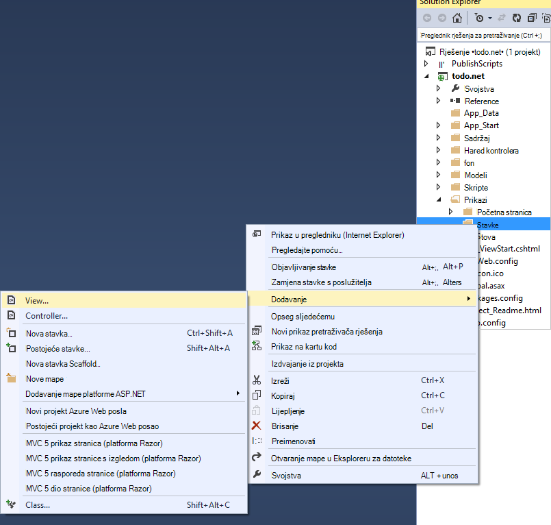

<properties 
    pageTitle="Praktični vodič ASP.NET MVC za DocumentDB: razvoj aplikacija za Web | Microsoft Azure" 
    description="ASP.NET MVC Praktični vodič da biste stvorili MVC web-aplikacije pomoću DocumentDB. Će se spremiti JSON i pristup podacima iz aplikacije popis obveza nalaze na web-mjesta Azure - ASP neto MVC vodič korak po korak." 
    keywords="Praktični vodič mvc ASP.NET, razvoj aplikacija za web, mvc web-aplikaciju, neto mvc asp Praktični vodič korak po korak"
    services="documentdb" 
    documentationCenter=".net" 
    authors="syamkmsft" 
    manager="jhubbard" 
    editor="cgronlun"/>

<tags 
    ms.service="documentdb" 
    ms.workload="data-services" 
    ms.tgt_pltfrm="na" 
    ms.devlang="dotnet" 
    ms.topic="hero-article" 
    ms.date="08/25/2016" 
    ms.author="syamk"/>

# ASP.NET MVC Praktični vodič: Razvoj aplikacija s DocumentDB web-

> [AZURE.SELECTOR]
- [.NET](documentdb-dotnet-application.md)
- [Node.js](documentdb-nodejs-application.md)
- [Java](documentdb-java-application.md)
- [Python](documentdb-python-application.md) 

Da biste istaknuli kako omogućuje učinkovito korištenje Azure DocumentDB za pohranu i upit JSON dokumenata, ovaj članak sadrži do kraja do kraja walk-through pokazuje kako stvoriti popis obveza aplikaciju pomoću Azure DocumentDB. Zadaci spremit će se kao JSON dokumenata u Azure DocumentDB.

U ovom walk-through pokazuje kako koristiti servis DocumentDB nudi Azure za pohranu i dohvaćanje podataka iz ASP.NET MVC web-aplikacije hostirane na Azure. Ako tražite vodič koji usredotočuje se samo na DocumentDB, a ne komponente ASP.NET MVC, potražite u članku [Sastavljanje na aplikacije konzole za DocumentDB C#](documentdb-get-started.md).

> [AZURE.TIP] Pomoću ovog praktičnog vodiča podrazumijeva prethodnog sučelje pomoću ASP.NET MVC i Azure web-mjesta. Ako ste novi korisnik ASP.NET ili [pripremni Alati](#_Toc395637760), preporučujemo da preuzmete gotovi ogledni projekta iz [GitHub][] , a zatim slijedite upute u ovom primjeru. Nakon što dodate ga u komponenti, možete pregledati ovaj članak da biste dobili uvid kod u kontekstu projekta.

## Preduvjeti za ovog praktičnog vodiča baze podataka

Prije nego što slijedeći upute u ovom članku, potrebno je provjeriti imate li sljedeće:

- Aktivni Azure račun. Ako nemate račun, možete stvoriti besplatnu probnu računa u samo nekoliko minuta. Detalje potražite u članku [Azure besplatnu probnu verziju](https://azure.microsoft.com/pricing/free-trial/).
- [Visual Studio 2015](http://www.visualstudio.com/) ili Visual Studio 2013 ažuriranje 4 ili noviji. Ako koristite Visual Studio 2013, morat ćete instalirati [paket nuget Microsoft.Net.Compilers](https://www.nuget.org/packages/Microsoft.Net.Compilers/) da biste dodali podrška za C# 6.0. 
- Azure SDK za .NET verzije 2.5.1 ili noviji, dostupne putem [Instalacijskog programa sustava Microsoft Web platforme][].

Sve snimke zaslona u ovom članku su provedena pomoću Visual Studio 2013 s ažuriranjem 4 primijeniti i Azure SDK za .NET verzije 2.5.1. Ako vaš sustav konfiguriran s različitim verzijama moguće je da zaslone i mogućnosti neće odgovarati potpuno, ali ako zadovoljavate iznad preduvjeti rješenje surađivati.

## Korak 1: Stvaranje računa DocumentDB baze podataka

Započnimo stvaranjem DocumentDB računa. Ako već imate postavljen račun, možete preskočiti [Stvori novu aplikaciju ASP.NET MVC](#_Toc395637762).

[AZURE.INCLUDE [documentdb-create-dbaccount](../../includes/documentdb-create-dbaccount.md)]

[AZURE.INCLUDE [documentdb-keys](../../includes/documentdb-keys.md)]

 
Ne možemo sada će voditi kroz stvaranja nove aplikacije ASP.NET MVC od dna naviše. 

## Korak 2: Stvorite novu aplikaciju MVC platforme ASP.NET

Sad kad imate postavljen račun, stvaranje naš novi projekt ASP.NET.

1. U Visual Studio, na izborniku **datoteka** , pokažite na **Novo**, a zatim **projekta**.

    Pojavit će se dijaloški okvir **Novi projekt** .
2. U oknu **projekta vrste** proširite **Predlošci**, **Visual C#**, **Web**, a zatim **ASP.NET web-aplikacije**.

    

3. U okvir **naziv** upišite naziv projekta. Pomoću ovog praktičnog vodiča koristi naziv "obveze". Ako odlučite koristiti brojem koji nije to, zatim kad god ovog praktičnog vodiča govori o naziva obveze morate prilagoditi uzoraka navedeni kod da biste koristili ono koje pod nazivom aplikacije. 

4. Kliknite **Pregledaj** da biste dođite do mape u koju želite stvoriti projekta, a zatim kliknite **u redu**.

    Pojavit će se dijaloški okvir **Novi projekt ASP.NET** .

    

5. U oknu predlošci odaberite **MVC**.

6. Ako planirate na hostiranje vaše aplikacije u Azure odaberite **glavnog računala u oblaku** na desnoj da bi Azure hostira aplikacije. Ne možemo ste odabrali za hostiranje u oblaku i pokrenuti program koji se nalaze na web-mjestu servisa Azure. Odabirom te mogućnosti preprovision programa Azure web-mjesto za koje će se i trajanja uvelike olakšali kad dođe vrijeme za implementaciju konačni aplikacija za rad. Ako želite hostira ovaj negdje drugdje ili ne želite da biste konfigurirali Azure upfront, samo isključite **glavnog računala u Oblaku**.

7. Kliknite **u redu** i pričekajte Visual Studio učinite njegov stvar oko scaffolding prazni predložak ASP.NET MVC. 

8. Ako ste odabrali za to hostiranje u oblaku vidjet ćete barem jedan dodatni zaslona s pitanjem želite li Prijava na račun za Azure i dati neke vrijednosti za novo web-mjesto. Navedite dodatne vrijednosti i nastaviti. 

    Koje niste odabrali "poslužitelj baze podataka" ovdje jer smo ne koristite Azure baze podataka SQL Server ovdje, ne možemo ćete stvoriti novi račun za Azure DocumentDB kasnije na portalu za Azure.

    Dodatne informacije o odabiru **aplikacije servisa za planiranje** i **grupa resursa**potražite u članku [aplikacije servisa za Azure tarife detaljnije pregled](../app-service/azure-web-sites-web-hosting-plans-in-depth-overview.md).

    

9. Kada završite stvaranje predloženog MVC aplikacije Visual Studio imate prazan ASP.NET aplikacija koje možete pokrenuti lokalno.

    Ne možemo ćete preskočiti pokrenut projekta lokalno znam smo ste sve vidjeti ASP.NET "Pozdrav svijeta" aplikacije. Podsjetimo se izravno u dodate DocumentDB taj projekt, a zatim stvaranje naš aplikacije.

## Korak 3: Dodavanje DocumentDB MVC web aplikacije projekta

Imamo Većina plumbing ASP.NET MVC koje su mi potrebne za rješenja, recimo pristupiti realni Svrha ovog praktičnog vodiča, dodavanje Azure DocumentDB naše MVC web-aplikaciju.

1. DocumentDB .NET SDK je pakirat i distribuirati kao paket NuGet. Da biste dobili pakiranje NuGet u Visual Studio, pomoću upravitelja NuGet paketa u Visual Studio klikom desne tipke miša na projektu u **Pregledniku rješenja** , a zatim kliknite **Upravljanje NuGet paketa**.

    

    Pojavit će se dijaloški okvir **Upravljanje NuGet paketa** .

2. U okviru NuGet **Pregled** upišite ***Azure DocumentDB***.
    
    U rezultatima instalirati paket **Microsoft Azure DocumentDB klijentska biblioteka** . To će preuzmite i instalirajte paket DocumentDB, kao i sve ovisnosti, kao što je Newtonsoft.Json. Kliknite **u redu** u prozoru **pregleda** , a **prihvaćam** u prozoru **Gumb Izbriši** da biste dovršili instalaciju.

    

    Umjesto toga koristite konzole za Upravitelj paketa da biste instalirali paket. Da biste to učinili, na izborniku **Alati** kliknite **Upravitelj NuGet paket**, a zatim **Konzole za Upravitelj paketa**. U naredbeni redak upišite sljedeće.

        Install-Package Microsoft.Azure.DocumentDB

3. Nakon instalacije paketa Visual Studio rješenje potrebno oblik sličan s dva nova reference dodali, Microsoft.Azure.Documents.Client i Newtonsoft.Json.

    

##Korak 4: Postavljanje aplikacije MVC platforme ASP.NET
 
Sada ćemo dodati modeli, prikazima i kontrolera ovu aplikaciju MVC:

- [Dodavanje modela](#_Toc395637764).
- [Dodavanje kontroler](#_Toc395637765).
- [Dodavanje prikaza](#_Toc395637766).

### Dodavanje JSON podatkovnog modela

Počnimo stvaranjem **M** u MVC, model. 

1. U **Pregledniku rješenja**, desnom tipkom miša kliknite mapu **modela** , kliknite **Dodaj**, a zatim kliknite **Predmet**.

    Pojavit će se dijaloški okvir **Dodaj novu stavku** .

2. Naziv nove klase **Item.cs** , a zatim kliknite **Dodaj**. 

3. U novu **Item.cs** datoteku dodajte sljedeće nakon zadnjeg *pomoću izjave*.
        
        using Newtonsoft.Json;
    
4. Sada zamijeniti kod 
        
        public class Item
        {
        }

    Sljedeći kod.

        public class Item
        {
            [JsonProperty(PropertyName = "id")]
            public string Id { get; set; }
             
            [JsonProperty(PropertyName = "name")]
            public string Name { get; set; }

            [JsonProperty(PropertyName = "description")]
            public string Description { get; set; }

            [JsonProperty(PropertyName = "isComplete")]
            public bool Completed { get; set; }
        }

    Sve podatke u DocumentDB je proslijeđena putem na žičani i pohranjenih kao JSON. Da biste odredili način na koji vaši objekti su serijalizirani/deserijalizirati po JSON.NET atribut **JsonProperty** možete koristiti kao što je prikazano u razredu **stavke** smo upravo stvorili. Ne **ste** učiniti ovo ali želim Pobrinite se da je Moja svojstva slijede JSON konvencije imenovanja camelCase. 
    
    Ne samo da vam kontrolirajte oblik naziva svojstvo stupa JSON, ali možete potpuno preimenovati svojstva .NET kao da se koristila za svojstvo **Opis** . 
    

### Dodavanje kontroler

Koji vodi brigu o **M**sada ćemo stvoriti **C** u MVC, kontroler predmete.

1. U **Pregledniku rješenja**, desnom tipkom miša kliknite mapu **kontrolera** , kliknite **Dodaj**, a zatim kliknite **kontroler**.

    Pojavit će se dijaloški okvir **Dodavanje Scaffold** .

2. Odaberite **MVC 5 kontroler - prazan** , a zatim kliknite **Dodaj**.

    

3. Naziv upravljaču novi **ItemController.**

    

    Nakon stvaranja datoteke rješenje Visual Studio treba oblik sličan sljedeće s nove datotekom ItemController.cs u **Pregledniku rješenja**. Prikazuje se i novu datoteku Item.cs ste ranije stvorili.

    

    Možete zatvoriti ItemController.cs, ne možemo ćete se vratite u nju kasnije. 

### Dodavanje prikaza

Sada ćemo stvoriti **V** u MVC, prikaza:

- [Dodavanje prikaza za stavke indeksa](#AddItemIndexView).
- [Dodavanje nove stavke prikaza](#AddNewIndexView).
- [Dodavanje prikaza programa Uredi stavku](#_Toc395888515).

#### Dodali prikaz stavke indeksa

1. U **Pregledniku rješenja**, proširite mapu **prikaza** , desnom tipkom miša kliknite Isprazni mapu **stavke** koje Visual Studio stvoriti prilikom koju ste prethodno dodali **ItemController** , kliknite **Dodaj**, a zatim **Prikaz**.

    

2. U dijaloškom okviru **Dodavanje prikaza** učinite sljedeće:
    - U okvir **naziv prikaza** unesite ***indeksa***.
    - U okviru **predloška** odaberite ***popis***.
    - U okvir **Predmet modela** odaberite ***stavke (obveze. Modeli)***.
    - Okvir **Predmet kontekst podataka** ostavite praznim. 
    - U okviru raspored stranice, upišite ***~/Views/Shared/_Layout.cshtml***.
    
    

3. Nakon postavljanja te vrijednosti kliknite **Dodaj** , a omogućuju Visual Studio stvaranje novog predloška prikaza. Kada završi, on će se otvoriti cshtml datoteku koja je stvorena. Ne možemo možete zatvoriti tu datoteku u Visual Studio kao što smo će se vratite u nju kasnije.

#### Dodajte novu stavku prikaz

Slično kako koju smo stvorili prikazu **Stavke indeksa** , ne možemo će sada stvoriti novi prikaz za stvaranje novih **stavki**.

1. U **Pregledniku rješenja**ponovno dvokliknite mapu **stavke** , kliknite **Dodaj**, a zatim kliknite **Prikaz**.

2. U dijaloškom okviru **Dodavanje prikaza** učinite sljedeće:
    - U okvir **naziv prikaza** unesite ***Stvori***.
    - U okviru **predloška** odaberite ***Stvori***.
    - U okvir **Predmet modela** odaberite ***stavke (obveze. Modeli)***.
    - Okvir **Predmet kontekst podataka** ostavite praznim.
    - U okviru raspored stranice, upišite ***~/Views/Shared/_Layout.cshtml***.
    - Kliknite **Dodaj**.

#### Dodali prikaz Uredi stavku

I na kraju, dodajte posljednji prikaz za uređivanje **stavke** u isti način kao i prije.

1. U **Pregledniku rješenja**ponovno dvokliknite mapu **stavke** , kliknite **Dodaj**, a zatim kliknite **Prikaz**.

2. U dijaloškom okviru **Dodavanje prikaza** učinite sljedeće:
    - U okvir **naziv prikaza** unesite ***Uređivanje***.
    - U okviru **predloška** odaberite ***Uređivanje***.
    - U okvir **Predmet modela** odaberite ***stavke (obveze. Modeli)***.
    - Okvir **Predmet kontekst podataka** ostavite praznim. 
    - U okviru raspored stranice, upišite ***~/Views/Shared/_Layout.cshtml***.
    - Kliknite **Dodaj**.

Kada to učinite, zatvorite sve dokumente cshtml u Visual Studio kao vratit ćemo te poglede kasnije.

## Korak 5: Linije gore DocumentDB

Sad kad standardne sadržaji MVC je snimanja brigu o, recimo uključiti dodavanje koda za DocumentDB. 

U ovom ćete odjeljku ćemo dodati kod učiniti sljedeće:

- [Potpuna artikala](#_Toc395637770).
- [Dodavanje stavki](#_Toc395637771).
- [Uređivanje stavki](#_Toc395637772).

### Potpuna artikala u web-aplikacije MVC

Prvo što učiniti ovdje je dodati klasa koja sadrži sve logike za povezivanje i koristiti DocumentDB. Za ovaj vodič smo ćete Enkapsulacija sve ovo logike u spremište klase pod nazivom DocumentDBRepository. 

1. U **Pregledniku rješenja**desnom tipkom miša kliknite na projektu, kliknite **Dodaj**, a zatim kliknite **Predmet**. Naziv nove klase **DocumentDBRepository** , a zatim kliknite **Dodaj**.
 
2. U novostvorenom **DocumentDBRepository** klase i dodajte na sljedeći *pomoću naredbe* iznad deklariranje *prostor naziva*
        
        using Microsoft.Azure.Documents; 
        using Microsoft.Azure.Documents.Client; 
        using Microsoft.Azure.Documents.Linq; 
        using System.Configuration;
        using System.Linq.Expressions;
        using System.Threading.Tasks;

    Sada zamijeniti kod 

        public class DocumentDBRepository
        {
        }

    Sljedeći kod.

        public static class DocumentDBRepository<T> where T : class
        {
            private static readonly string DatabaseId = ConfigurationManager.AppSettings["database"];
            private static readonly string CollectionId = ConfigurationManager.AppSettings["collection"];
            private static DocumentClient client;
    
            public static void Initialize()
            {
                client = new DocumentClient(new Uri(ConfigurationManager.AppSettings["endpoint"]), ConfigurationManager.AppSettings["authKey"]);
                CreateDatabaseIfNotExistsAsync().Wait();
                CreateCollectionIfNotExistsAsync().Wait();
            }
    
            private static async Task CreateDatabaseIfNotExistsAsync()
            {
                try
                {
                    await client.ReadDatabaseAsync(UriFactory.CreateDatabaseUri(DatabaseId));
                }
                catch (DocumentClientException e)
                {
                    if (e.StatusCode == System.Net.HttpStatusCode.NotFound)
                    {
                        await client.CreateDatabaseAsync(new Database { Id = DatabaseId });
                    }
                    else
                    {
                        throw;
                    }
                }
            }
    
            private static async Task CreateCollectionIfNotExistsAsync()
            {
                try
                {
                    await client.ReadDocumentCollectionAsync(UriFactory.CreateDocumentCollectionUri(DatabaseId, CollectionId));
                }
                catch (DocumentClientException e)
                {
                    if (e.StatusCode == System.Net.HttpStatusCode.NotFound)
                    {
                        await client.CreateDocumentCollectionAsync(
                            UriFactory.CreateDatabaseUri(DatabaseId),
                            new DocumentCollection { Id = CollectionId },
                            new RequestOptions { OfferThroughput = 1000 });
                    }
                    else
                    {
                        throw;
                    }
                }
            }
        }

    > [AZURE.TIP] Prilikom stvaranja novog DocumentCollection možete navesti neobavezan parametar RequestOptions od OfferType koja vam omogućuje da odredite razinu performanse novu zbirku. Ako taj parametar nije prošao koristit će se zadana vrsta ponudu. Dodatne informacije o DocumentDB ponudu vrsta pogledajte [DocumentDB performanse razine](documentdb-performance-levels.md)

3. Ne možemo čitate neke vrijednosti iz konfiguracije, tako da otvorite datoteku **Web.config** aplikacije i dodajte sljedeće retke u odjeljku s `<AppSettings>` sekciju.
    
        <add key="endpoint" value="enter the URI from the Keys blade of the Azure Portal"/>
        <add key="authKey" value="enter the PRIMARY KEY, or the SECONDARY KEY, from the Keys blade of the Azure  Portal"/>
        <add key="database" value="ToDoList"/>
        <add key="collection" value="Items"/>
    
4. Sada, ažurirati vrijednosti za *krajnjoj točki* i *authKey* pomoću tipke plohu portala za Azure. Korištenje **URI** iz plohu tipke kao vrijednost postavke krajnje točke, a pomoću **PRIMARNI KLJUČ**ili **SEKUNDARNI KLJUČ** iz plohu tipke kao vrijednost authKey postavke.

    Oprez traje od linije gore spremište DocumentDB sada ćemo dodati naš logike aplikacije.

5. Najprije želimo moći učiniti s aplikacijom popis obveze je da biste prikazali nepotpuna stavke.  Kopirajte i zalijepite sljedeće koda bilo gdje unutar **DocumentDBRepository** predmete.

        public static async Task<IEnumerable<T>> GetItemsAsync(Expression<Func<T, bool>> predicate)
        {
            IDocumentQuery<T> query = client.CreateDocumentQuery<T>(
                UriFactory.CreateDocumentCollectionUri(DatabaseId, CollectionId))
                .Where(predicate)
                .AsDocumentQuery();

            List<T> results = new List<T>();
            while (query.HasMoreResults)
            {
                results.AddRange(await query.ExecuteNextAsync<T>());
            }

            return results;
        }

6. Otvorite **ItemController** ćemo prethodno dodali i dodajte na sljedeći *pomoću naredbe* iznad prostor za naziv izvješća.

        using System.Net;
        using System.Threading.Tasks;
        using todo.Models;

    Ako projekt ima naziv "obveze", pa ćete morati ažurirati pomoću "obveze. Modeli;" u skladu s vizualnim naziv projekta.

    Sada zamijeniti kod

        //GET: Item
        public ActionResult Index()
        {
            return View();
        }

    Sljedeći kod.

        [ActionName("Index")]
        public async Task<ActionResult> IndexAsync()
        {
            var items = await DocumentDBRepository<Item>.GetItemsAsync(d => !d.Completed);
            return View(items);
        }
    
7. Otvorite **Global.asax.cs** i dodajte sljedeći redak metodu **Application_Start** 
 
        DocumentDBRepository<todo.Models.Item>.Initialize();
    
Sada rješenje trebali biste moći da biste sastavili bez pogrešaka.

Ako ste pokrenuli aplikaciju sada, želite otvorite **HomeController** i prikaz **indeksa** tog kontrolera. To je zadano ponašanje projekta predloška MVC ćemo odabrali na početku, ali ne možemo koje ne želite! Pogledajmo promijenite usmjeravanje u ovoj aplikaciji MVC mijenjanja takvo ponašanje.

Otvaranje ***aplikacije\_Start\RouteConfig.cs*** i pronađite redak počevši od "zadane postavke:" i promijenite ga u oblik sličan na sljedeći način.

        defaults: new { controller = "Item", action = "Index", id = UrlParameter.Optional }

U ovom sada govori ASP.NET MVC koji ako vrijednost u URL-a da biste odredili usmjeravanje ponašanje umjesto da **Početna**nije naveden koristiti **stavke** kao kontroler i korisnik **indeksa** s prikazom.

Sada ako pokrenete aplikaciju, će poziv u svoje **ItemController** koji će se pridružuju predmete spremište i upotrijebite metodu GetItems da biste se vratili nepotpuna stavke **Prikazi**\\**stavke**\\prikaz**indeksa** . 

Ako Sastavljanje i odmah Pokreni taj projekt, koje trebao bi se pojaviti nešto što to izgleda.    

### Dodavanje stavki

Pogledajmo staviti neke stavke u našem bazu podataka pa imamo nešto veći od prazne rešetke možete pogledati.

Dodat ćemo neka kod DocumentDBRepository i ItemController održati zapisa u DocumentDB.

1.  Dodajte na sljedeći način u svojoj učionici **DocumentDBRepository** .

        public static async Task<Document> CreateItemAsync(T item)
        {
            return await client.CreateDocumentAsync(UriFactory.CreateDocumentCollectionUri(DatabaseId, CollectionId), item);
        }

    Ovaj postupak jednostavno vodi objekta joj proslijeđen i nastavi u DocumentDB.

2. Otvorite datoteku ItemController.cs i dodajte sljedeće koda unutar klasu. Ovo je kako ASP.NET MVC znali što učiniti za **Stvaranje** akciju. U ovom slučaju samo prikaz pridruženi prikaz Create.cshtml ste ranije stvorili.

        [ActionName("Create")]
        public async Task<ActionResult> CreateAsync()
        {
            return View();
        }

    Sada moramo neke dodatne kod u ovom kontroler koji ćete prihvatiti slanje iz prikaza za **Stvaranje** .

2. Dodavanje sljedećeg bloka kod klase ItemController.cs koja govori ASP.NET MVC što učiniti s obrascem objavu za ovaj kontroler.
    
        [HttpPost]
        [ActionName("Create")]
        [ValidateAntiForgeryToken]
        public async Task<ActionResult> CreateAsync([Bind(Include = "Id,Name,Description,Completed")] Item item)
        {
            if (ModelState.IsValid)
            {
                await DocumentDBRepository<Item>.CreateItemAsync(item);
                return RedirectToAction("Index");
            }

            return View(item);
        }

    Kod poziva u da biste na DocumentDBRepository i koristi metodu CreateItemAsync održati novu stavku obveze u bazu podataka. 
 
    **Napomena o sigurnosti**: atribut **ValidateAntiForgeryToken** se koristi za zaštitu ovu aplikaciju protiv napada krivotvorina zahtjev za web-mjesta. Postoji više da biste ga samo dodavanje taj atribut, svoje prikaze morati raditi kao i u ovom protiv krivotvorina token. Dodatne informacije o predmet i primjeri kako implementirati to pravilno, pročitajte članak [Sprječavaju krivotvorina zahtjev za web-mjesta][]. Izvorni kod navedeni su na [GitHub][] ima puni implementacije na mjestu.

    **Napomena o sigurnosti**: također koristimo atribut **povezati** na parametar metode da biste zaštitili previše objavljivanje napada. Dodatne informacije potražite u članku [Osnovni CRUD postupke u ASP.NET MVC][].

To završava koda potrebnog za dodavanje novih stavki u našem bazu podataka.

### Uređivanje stavki

Postoji jedan preostaje bismo učiniti, a to je da biste dodali mogućnost za uređivanje **stavki** u bazi podataka, a da biste ih označili dovršenim. U prikazu za uređivanje već dodali projekta, tako da samo moramo neke kod za naše kontroler i klase **DocumentDBRepository** ponovno dodajte.

1. Dodajte sljedeće **DocumentDBRepository** predmete.

        public static async Task<Document> UpdateItemAsync(string id, T item)
        {
            return await client.ReplaceDocumentAsync(UriFactory.CreateDocumentUri(DatabaseId, CollectionId, id), item);
        }

        public static async Task<T> GetItemAsync(string id)
        {
            try
            {
                Document document = await client.ReadDocumentAsync(UriFactory.CreateDocumentUri(DatabaseId, CollectionId, id));
                return (T)(dynamic)document;
            }
            catch (DocumentClientException e)
            {
                if (e.StatusCode == HttpStatusCode.NotFound)
                {
                    return null;
                }
                else
                {
                    throw;
                }
            }
        }
    
    Prvi od ovih metoda **GetItem** fetches neku stavku iz DocumentDB koji se prenosi natrag na **ItemController** , a zatim u prikazu za **Uređivanje** .
    
    Drugi načini upravo dodali smo zamjenjuje **dokumenta** u DocumentDB s verziju **dokumenta** proslijeđen iz **ItemController**.

2. Dodajte sljedeće **ItemController** predmete.

        [HttpPost]
        [ActionName("Edit")]
        [ValidateAntiForgeryToken]
        public async Task<ActionResult> EditAsync([Bind(Include = "Id,Name,Description,Completed")] Item item)
        {
            if (ModelState.IsValid)
            {
                await DocumentDBRepository<Item>.UpdateItemAsync(item.Id, item);
                return RedirectToAction("Index");
            }

            return View(item);
        }

        [ActionName("Edit")]
        public async Task<ActionResult> EditAsync(string id)
        {
            if (id == null)
            {
                return new HttpStatusCodeResult(HttpStatusCode.BadRequest);
            }

            Item item = await DocumentDBRepository<Item>.GetItemAsync(id);
            if (item == null)
            {
                return HttpNotFound();
            }

            return View(item);
        }
    
    Prva metoda rukuje Http GET koji se događa prilikom klika na vezu za **Uređivanje** iz prikaza **indeksa** . Ovaj postupak dohvaćanja [**dokumenta**](http://msdn.microsoft.com/library/azure/microsoft.azure.documents.document.aspx) iz DocumentDB i prosljeđuje prikazu za **Uređivanje** .

    **Uređivanje** prikaza pa će učiniti Http POST **IndexController**. 
    
    Druga metoda dodali smo rukuje prosljeđivanje ažurirane objekta u DocumentDB da biste je ista i u bazi podataka.

To je to, koji je sve potrebno je pokrenuti naš program, navedite nepotpuna **stavki**, dodavanje nove **stavke**i uređivanje **stavki**.

## Korak 6: Lokalno pokrenuti aplikaciju

Da biste testirali aplikacije na lokalnom računalu, učinite sljedeće:

1. Pritisnite F5 u Visual Studio da biste sastavili aplikacije u načinu rada za ispravljanje pogrešaka. Ga treba sastavljanje aplikacije i pokretanje preglednika stranicom prazne rešetke smo vidjeli prije:

    

    Ako koristite Visual Studio 2013 te će se pogreška "Nije moguće await u tijelu uvjet zamka." morate instalirati [paket nuget Microsoft.Net.Compilers](https://www.nuget.org/packages/Microsoft.Net.Compilers/). Možete usporediti i kod na temelju uzorka projekt na [GitHub][]. 

2. Kliknite **Stvori novu** vezu i dodajte vrijednosti polja **naziv** i **Opis** . Napusti **dovršiti** potvrdite okvir nije odabrano inače novu **stavku** dodat će se u dovršenom stanje i prikazat će se na popisu Početna.

    

3. Kliknite **Stvori** i bit ćete preusmjereni na prikaz **indeksa** i pojavit će se **stavke** na popisu.

    

    Slobodno dodavanje nekoliko **stavki** na popis obveze.

3. Kliknite **Uređivanje** pokraj **stavke** na popisu i prijeći ćete u prikazu za **Uređivanje** gdje možete ažurirati neko svojstvo objekta, uključujući zastavice **Dovršeno** . Ako označite zastavicom **Dovršeno** i kliknite **Spremi**, **stavke** je uklonjena iz popisa nedovršeni zadaci.

    

4. Jednom koju ste testirati aplikaciju, pritisnite Ctrl + F5 da biste prekinuli aplikaciju za ispravljanje pogrešaka. Spremni ste za implementaciju!

## Korak 7: Implementacija aplikacije na web-mjesta za Azure

Sad kad imate potpuni računala radi ispravno s DocumentDB ćemo ćete implementacija web aplikacije Azure web-mjesta. Ako ste odabrali **glavnog računala u oblaku** stvaranja prazni projekt ASP.NET MVC zatim Visual Studio olakšano to zaista i ne većinu posla za vas. 

1. Da biste objavili ove aplikacije sve što trebate napraviti je kliknite desnom tipkom miša na projektu u **Pregledniku rješenja** , a zatim kliknite **Objavi**.

    

2. Sve mora već biti konfigurirana prema vjerodajnice; zapravo web-mjesto je već stvoren u Azure umjesto vas na **Odredišni URL** prikazan, sve što trebate napraviti je kliknite **Objavi**.

    

U nekoliko sekundi Visual Studio će završiti objavljivanje web-aplikacije i pokretanje preglednika prikazuju se pri ruci rad sa servisu Azure!

## Daljnji koraci

Čestitamo! Samo temelji na prvom MVC ASP.NET web-aplikacije pomoću Azure DocumentDB i objaviti na web-mjesta Azure. Izvorni kod za dovršavanje aplikaciju, uključujući pojedinosti i brisanje funkcije koje nisu obuhvaćeni ovog praktičnog vodiča mogu preuzeti ili klonirana iz [GitHub][]. Tako da vas zanima koje dodavanje aplikacije, privucite kod i njezino dodavanje aplikacije.

Da biste dodali dodatne funkcije aplikacije, pregledajte dostupne u [Biblioteci .NET DocumentDB](https://msdn.microsoft.com/library/azure/dn948556.aspx) API-ji i slobodno doprinos biblioteci .NET DocumentDB na [GitHub][]. 

[\*]: https://microsoft.sharepoint.com/teams/DocDB/Shared%20Documents/Documentation/Docs.LatestVersions/PicExportError
[Visual Studio Express]: http://www.visualstudio.com/products/visual-studio-express-vs.aspx
[Instalacijski program platformu Microsoft Web]: http://www.microsoft.com/web/downloads/platform.aspx
[Sprječavanje krivotvorina zahtjev za web-mjesta]: http://go.microsoft.com/fwlink/?LinkID=517254
[Osnovni CRUD postupke u ASP.NET MVC]: http://go.microsoft.com/fwlink/?LinkId=317598
[GitHub]: https://github.com/Azure-Samples/documentdb-net-todo-app
