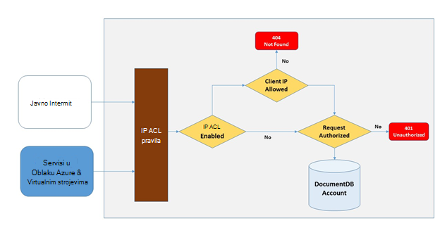
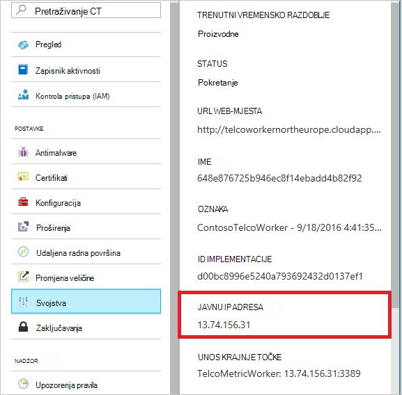
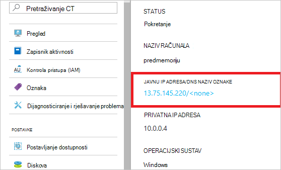
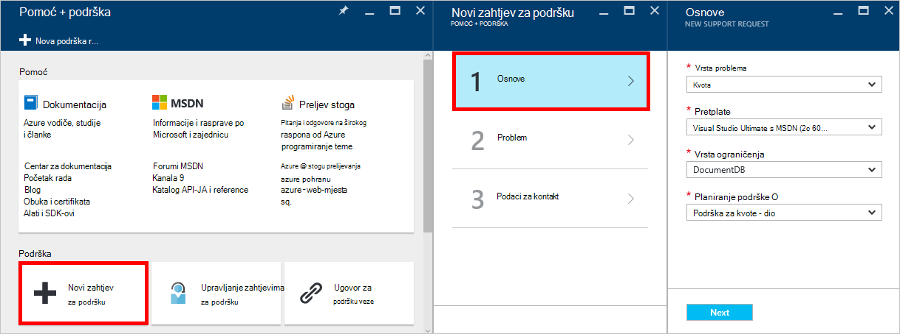
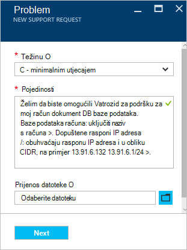

<properties
    pageTitle="Podrška za vatrozid DocumentDB | Microsoft Azure"
    description="Saznajte kako koristiti pravila za kontrolu pristupa IP za podršku za vatrozid Azure DocumentDB baze podataka računa."
    keywords="Kontrola pristupa IP, podršku za vatrozid"
    services="documentdb"
    authors="shahankur11"
    manager="jhubbard"
    editor=""
    tags="azure-resource-manager"
    documentationCenter=""/>

<tags 
    ms.service="documentdb" 
    ms.workload="data-services" 
    ms.tgt_pltfrm="na" 
    ms.devlang="na" 
    ms.topic="article" 
    ms.date="10/17/2016" 
    ms.author="ankshah; kraman"/>

# Podrška za vatrozid DocumentDB

Sigurnost podataka pohranjenih u račun za Azure DocumentDB baze podataka, DocumentDB nudi podršku za tajnu na temelju [autorizacije modela](https://msdn.microsoft.com/library/azure/dn783368.aspx) koji koristi kod istaknuti utemeljen na raspršivanje poruka provjere autentičnosti (HMAC). Sada, osim modela tajnu na temelju autorizacije DocumentDB podržava pravila utemeljenima na koji se temelji na IP pristup kontrolama za podršku za dolazni vatrozid. Ovaj model vrlo je sličan pravila vatrozida običnoj bazi podataka sustava i nudi dodatnu razinu sigurnosti na račun DocumentDB baze podataka. Uz ovaj model sada možete konfigurirati DocumentDB račun moći pristupiti samo odobrene skup strojeva i/ili servisa u oblaku za bazi podataka. Pristup DocumentDB resursa iz tih odobrene skupova računala i servisa i dalje potreban pozivatelja kako bi se prikazao valjani ovlaštenja.

## Pregled za kontrolu pristupa IP

Račun za baze podataka DocumentDB po zadanom se može pristupiti iz javni internet pod uvjetom da je valjan ovlaštenja praćeni zahtjev. Da biste konfigurirali IP pristupom utemeljeno na pravila kontrola, korisnik mora pružati uslugu IP adresa ili rasponi IP adresa u CIDR obrasca koji će se kao popis dopuštenih IP-ovi klijenta za račun danu bazu podataka. Kada se primjenjuje tu konfiguraciju sve zahtjeve za potječu strojeva izvan ovaj popis dopuštenih bit će blokirane poslužitelj.  Veza obrada tijeka za kontrolu pristupa koji se temelji na IP opisan u sljedećem dijagramu.

## Veze servisa u oblaku

U Azure, servise u oblaku su vrlo uobičajeni način za hostiranje Srednji sloj servisa logike pomoću DocumentDB. Da biste omogućili pristup računu DocumentDB baze podataka na neki servis u oblaku, javnu IP adrese servisa u oblaku mora biti dodan na popis dopuštenih IP adresu povezanu sa svojim računom DocumentDB baze podataka tako da se [obratite podršci za Azure](#configure-ip-policy).  Time se osigurava da sve instance uloge servisa u oblaku imaju pristup računu DocumentDB baze podataka. Možete dohvatiti IP adresa za vaše servise u oblaku na portalu Azure kao što je prikazano u sljedećim snimku zaslona. 

Kada skaliranje out servis u oblaku dodavanjem dodatnih uloga instance tih novih instanci će automatski imati pristup računu DocumentDB baze podataka jer su dio iste servis u oblaku.

## Veze s virtualnim strojevima

[Virtualnim strojevima](https://azure.microsoft.com/services/virtual-machines/) ili [postavlja skaliranje virtualnog računala](../virtual-machine-scale-sets/virtual-machine-scale-sets-overview.md) također se poslužite za hostiranje Srednji sloj servisa pomoću DocumentDB.  Da biste konfigurirali na DocumentDB račun baze podataka da biste omogućili pristup s virtualnim strojevima, javnu IP adrese virtualnog računala i/ili skup skaliranje virtualnog računala mora biti konfigurirano u nekom od dopuštene IP adrese za vaš račun DocumentDB baze podataka tako da se [obratite podršci za Azure](#configure-ip-policy). IP adrese za virtualnim strojevima na portalu Azure možete dohvatiti kao što je prikazano u sljedećim snimku zaslona.

Prilikom dodavanja dodatnih virtualnog računala instance u grupu, oni se automatski daju pristup računu DocumentDB baze podataka.

## Veza s Internetom

Kada je račun za baze podataka DocumentDB pristupiti s računala na Internetu, IP adresu klijenta ili rasponu IP adresa na ovom računalu mora biti dodan na popis dopuštenih IP adresa za račun DocumentDB bazi podataka. 

## Konfiguriranje pravilnika za kontrolu pristupa IP

Zahtjev za s [Podrškom za Azure](https://portal.azure.com/?#blade/Microsoft_Azure_Support/HelpAndSupportBlade) da biste omogućili Pravilnik za kontrolu pristupa IP na računu za baze podataka pomoću portala za Azure.

1. U plohu [Pomoć + podršku](https://portal.azure.com/?#blade/Microsoft_Azure_Support/HelpAndSupportBlade) , odaberite **Novi zahtjev za podršku**.
2. U plohu **Novi zahtjev za podršku** odaberite **Osnove**.
3. U plohu **Osnove** odaberite sljedeće:
    - **Vrsta problema**: kvote
    - **Pretplate**: pretplate povezanu s računom u koju želite dodati Pravilnik za kontrolu pristupa IP.
    - **Vrsta ograničenja**: DocumentDB
    - **Podrška za planiranje**: podrška za kvote - dio.
4. U plohu **Problem** , učinite sljedeće:
    - **Težinu**: Odaberite C - minimalnim utjecajem
    - **Detalji**: kopirajte sljedeći tekst u okvir, a naziv s računa i IP adrese/es: "Želim da biste omogućili Vatrozid za podršku za moj račun DocumentDB baze podataka. Baze podataka računa: *naziv računa Uključi/s*. Dopuštene rasponi IP adresa /: *obuhvaćaju rasponu IP adresa i u obliku CIDR, na primjer 13.91.6.132, 13.91.6.1/24*. "
    - Kliknite **Dalje**. 
5. U plohu **Podaci za kontakt** ispunite detalje o kontaktu, a zatim kliknite **Stvori**. 

Kada je primiti zahtjev, kontrola pristupa IP želite omogućiti roku od 24 sata. Bit ćete obaviješteni nakon dovršetka zahtjev.

## Pravilnik za kontrolu pristupa IP za otklanjanje poteškoća

### Operacije portala

Omogućivanjem pravilnik kontrolu pristupa IP za vaš račun DocumentDB baze podataka sve pristup računu DocumentDB baze podataka iz strojeva izvan u konfigurirano dopušteno blokiraju popis rasponi IP adresa. By virtue of ovaj model pregledavanja postupka ravnini podataka na portalu bit će i blokirane u cilju integriteta kontrola pristupa. 

### SDK & Rest API-JA

Za sigurnosnih vam razloga pristup putem SDK ili REST API-JA s računala nisu na popis dopuštenih će vratiti generički 404 nije pronađeno odgovor bez dodatne pojedinosti. Provjerite je li IP dopušteno popis konfiguriran za vaš račun DocumentDB baze podataka da biste bili sigurni konfiguracija točan pravila primjenjuje se na svoj račun DocumentDB baze podataka.

## Daljnji koraci

Informacije o mreži savjeta za povezane performansi potražite u članku [Savjeti performansi](documentdb-performance-tips.md).