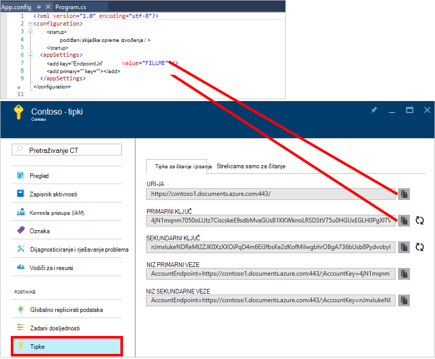
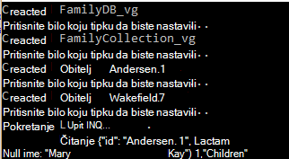
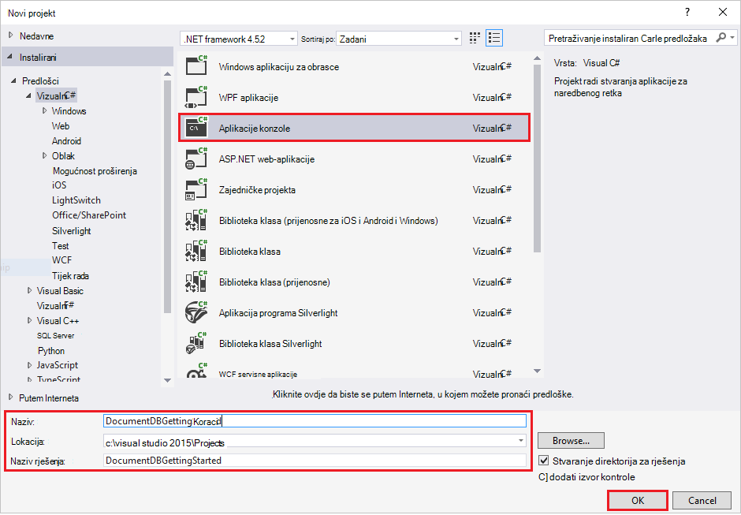
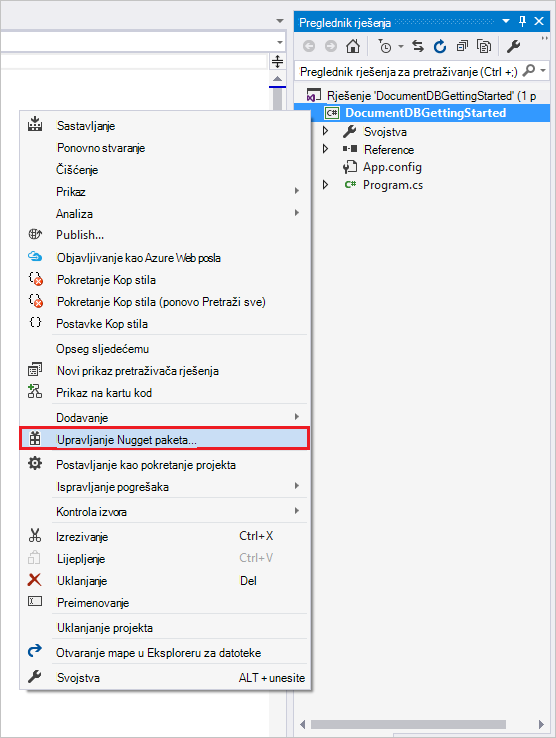
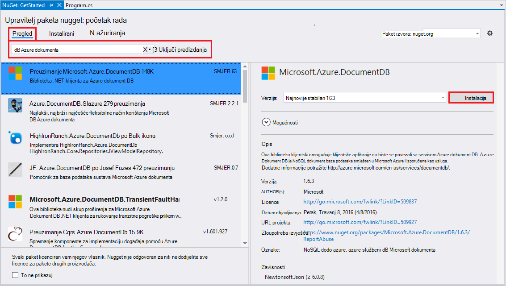
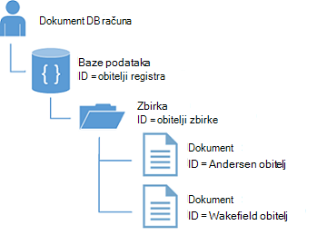
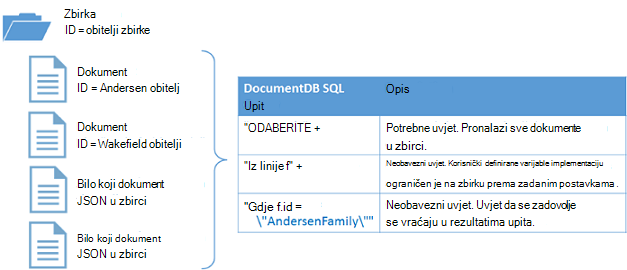

<properties
    pageTitle="Praktični vodič NoSQL: DocumentDB .NET SDK | Microsoft Azure"
    description="Vodič za NoSQL koji stvara internetske baze podataka i C# konzole aplikacije pomoću DocumentDB .NET SDK. DocumentDB je NoSQL baze podataka za JSON."
    keywords="nosql ćete praktičnom vodiču internetske baze podataka aplikacije konzole za c#"
    services="documentdb"
    documentationCenter=".net"
    authors="AndrewHoh"
    manager="jhubbard"
    editor="monicar"/>

<tags
    ms.service="documentdb"
    ms.workload="data-services"
    ms.tgt_pltfrm="na"
    ms.devlang="dotnet"
    ms.topic="hero-article"
    ms.date="09/01/2016"
    ms.author="anhoh"/>

# Praktični vodič NoSQL: sastavljanje u C DocumentDB # aplikacije konzole

> [AZURE.SELECTOR]
- [.NET](documentdb-get-started.md)
- [Node.js](documentdb-nodejs-get-started.md)

Dobro došli u NoSQL vodič za .NET SDK za Azure DocumentDB! Nakon početak projekta za brzo pokretanje ili dovršavanje vodič, imat ćete aplikacije konzole za stvara i upiti DocumentDB resursi.

- **[Brzi početak rada](#quickstart)**: preuzimanje oglednih projekta, dodajte podatke za povezivanje i DocumentDB aplikacija izvodi u manje od 10 minuta.
- **[Praktični vodič](#tutorial)**: Stvaranje aplikacije za brzi početak rada ispočetka 30 minuta.

## Preduvjeti

- Aktivni Azure račun. Ako ga nemate, možete se prijaviti [pomoću računa](https://azure.microsoft.com/free/).
- [Visual Studio 2013 ili Visual Studio 2015](http://www.visualstudio.com/).
- .NET framework 4.6

## Brzi početak rada

1. Preuzmite projekta .zip uzorak iz [GitHub](https://github.com/Azure-Samples/documentdb-dotnet-getting-started-quickstart/archive/master.zip) ili Kloniraj repo [documentdb-dotnet-početak-rada – brzi početak rada](https://github.com/Azure-Samples/documentdb-dotnet-getting-started-quickstart) .
2. Pomoću portala za Azure da biste [stvorili DocumentDB račun](documentdb-create-account.md).
3. U datoteci App.config zamijenite vrijednosti EndpointUri i primarni ključ vrijednosti dohvaćene s [portala za Azure](https://portal.azure.com/)tako da odete plohu **DocumentDB (NoSQL)** , a zatim kliknete **naziv računa**, a zatim **tipke** na izborniku resursa.
    
4. Stvaranje projekta. Prozor konzole prikazuje nove resurse koji se stvara mu i zatim očistiti.
    
    

## Praktični vodič

Pomoću ovog praktičnog vodiča vodit će vas kroz stvaranje DocumentDB baze podataka, DocumentDB zbirke i JSON dokumenata. Ćete zatim upita za zbirku i čišćenja i brisanje baze podataka. Pomoću ovog praktičnog vodiča sastavlja isti projekt kao brzi početak rada projekta, ali ćete ga postupno Sastavljanje i primati objašnjenje kod koji dodajete u projekt.

## Korak 1: Stvaranje DocumentDB računa

Stvaranje DocumentDB računa. Ako već imate račun koji želite koristiti, možete preskočiti unaprijed postavljanje [Visual Studio rješenje](#SetupVS).

[AZURE.INCLUDE [documentdb-create-dbaccount](../../includes/documentdb-create-dbaccount.md)]

## Korak 2: Postavite rješenje Visual Studio

1. Da biste otvorili **Visual Studio 2015** na vašem računalu.
2. Na izborniku **datoteka** , odaberite **Novo**, a zatim **projekta**.
3. U dijaloškom okviru **Novi projekt** odaberite **Predlošci** / **Visual C#** / **Aplikacije konzole za**naziv projekta, a zatim kliknite **u redu**.

4. U **Pregledniku rješenja**, desnom tipkom miša kliknite novu aplikaciju konzole, koja se nalazi ispod Visual Studio rješenje.
5. Ne napuštajući izbornik, zatim na **Upravljanje NuGet paketa...** 
 
6. Na kartici **Nuget** kliknite **Pregledaj**, a zatim u okvir za pretraživanje upišite **azure documentdb** .
7. U rezultatima pronaći **Microsoft.Azure.DocumentDB** , a zatim kliknite **Instaliraj**.
ID paketa za biblioteku klijent DocumentDB je [Microsoft.Azure.DocumentDB](https://www.nuget.org/packages/Microsoft.Azure.DocumentDB)

Sjajan! Nakon što smo Završi postavljanje, Započnimo pisanja neke koda. Projekt dovršene koda ovog praktičnog vodiča možete pronaći na [GitHub](https://github.com/Azure-Samples/documentdb-dotnet-getting-started/blob/master/src/Program.cs).

## Korak 3: Povezivanje s računom DocumentDB

Najprije dodajte ove reference na početku C# aplikacije, u datoteci Program.cs:

    using System;
    using System.Linq;
    using System.Threading.Tasks;

    // ADD THIS PART TO YOUR CODE
    using System.Net;
    using Microsoft.Azure.Documents;
    using Microsoft.Azure.Documents.Client;
    using Newtonsoft.Json;

> [AZURE.IMPORTANT] Da biste dovršili ovaj Praktični vodič NoSQL, provjerite je li dodati ovisnosti iznad.

Sada dodajte ove dvije konstante i varijablu *klijent* odjeljku javni klasa *Program*.

    public class Program
    {
        // ADD THIS PART TO YOUR CODE
        private const string EndpointUri = "<your endpoint URI>";
        private const string PrimaryKey = "<your key>";
        private DocumentClient client;

Sljedeći, lakši [Azure Portal](https://portal.azure.com) za dohvaćanje URI i primarni ključ. DocumentDB URI i primarnog ključa su potrebne za svoju aplikaciju da biste shvatili gdje želite povezati, a za DocumentDB pouzdana veza vaše aplikacije.

Na portalu za Azure dođite do DocumentDB račun, a zatim **tipke**.

Kopirajte URI s portala i zalijepite ih u `<your endpoint URI>` u datoteci program.cs. Zatim kopirajte PRIMARNOG ključa s portala i zalijepite ih u `<your key>`.

![Snimka zaslona s portala za Azure koristi NoSQL vodič za stvaranje konzole aplikacije C#. Prikazuje računom DocumentDB s središtu AKTIVNI istaknuta, gumb tipke istaknuta na račun plohu DocumentDB i vrijednosti URI, PRIMARNI KLJUČ i SEKUNDARNE KLJUČ istaknuta na plohu tipke][keys]

Stvaranjem nove instance programa **DocumentClient**ćemo ćete pokrenuti dohvaćanje rada aplikaciju.

Ispod metodu **glavne** dodajte novi zadatak asinkronog naziva **GetStartedDemo**, koji će stvoriti instancu naš novi **DocumentClient**.

    static void Main(string[] args)
    {
    }

    // ADD THIS PART TO YOUR CODE
    private async Task GetStartedDemo()
    {
        this.client = new DocumentClient(new Uri(EndpointUri), PrimaryKey);
    }

Dodajte sljedeći kod da biste pokrenuli asinkronog zadatka iz načina **glavne** . Način **glavne** će Uhvatite iznimke i pisati konzoli sustava.

    static void Main(string[] args)
    {
            // ADD THIS PART TO YOUR CODE
            try
            {
                    Program p = new Program();
                    p.GetStartedDemo().Wait();
            }
            catch (DocumentClientException de)
            {
                    Exception baseException = de.GetBaseException();
                    Console.WriteLine("{0} error occurred: {1}, Message: {2}", de.StatusCode, de.Message, baseException.Message);
            }
            catch (Exception e)
            {
                    Exception baseException = e.GetBaseException();
                    Console.WriteLine("Error: {0}, Message: {1}", e.Message, baseException.Message);
            }
            finally
            {
                    Console.WriteLine("End of demo, press any key to exit.");
                    Console.ReadKey();
            }

Pritisnite **F5** da biste pokrenuli aplikaciju.

Čestitamo! Uspješno povezati s računom DocumentDB, sada Pogledajmo u rad s resursima DocumentDB.  

## Korak 4: Stvaranje baze podataka
Prije nego što dodate kod za stvaranje baze podataka, dodajte metode Pomoćnik za pisanje konzoli sustava.

Kopiranje i lijepljenje metodu **WriteToConsoleAndPromptToContinue** ispod metodu **GetStartedDemo** .

    // ADD THIS PART TO YOUR CODE
    private void WriteToConsoleAndPromptToContinue(string format, params object[] args)
    {
            Console.WriteLine(format, args);
            Console.WriteLine("Press any key to continue ...");
            Console.ReadKey();
    }

Pomoću metode [CreateDatabaseAsync](https://msdn.microsoft.com/library/microsoft.azure.documents.client.documentclient.createdatabaseasync.aspx) klase **DocumentClient** moguće je stvoriti DocumentDB [baze podataka](documentdb-resources.md#databases) . Baza podataka nije logičke spremnik za pohranu dokumenata JSON particije u zbirkama.

Kopiranje i lijepljenje metodu **CreateDatabaseIfNotExists** ispod metodu **WriteToConsoleAndPromptToContinue** .

    // ADD THIS PART TO YOUR CODE
    private async Task CreateDatabaseIfNotExists(string databaseName)
    {
            // Check to verify a database with the id=FamilyDB does not exist
            try
            {
                    await this.client.ReadDatabaseAsync(UriFactory.CreateDatabaseUri(databaseName));
                    this.WriteToConsoleAndPromptToContinue("Found {0}", databaseName);
            }
            catch (DocumentClientException de)
            {
                    // If the database does not exist, create a new database
                    if (de.StatusCode == HttpStatusCode.NotFound)
                    {
                            await this.client.CreateDatabaseAsync(new Database { Id = databaseName });
                            this.WriteToConsoleAndPromptToContinue("Created {0}", databaseName);
                    }
                    else
                    {
                            throw;
                    }
            }
    }

Kopirajte i zalijepite sljedeći kod na način **GetStartedDemo** ispod stvaranja klijenta. To će stvoriti bazu podataka s nazivom *FamilyDB*.

    private async Task GetStartedDemo()
    {
        this.client = new DocumentClient(new Uri(EndpointUri), PrimaryKey);

        // ADD THIS PART TO YOUR CODE
        await this.CreateDatabaseIfNotExists("FamilyDB_va");

Pritisnite **F5** da biste pokrenuli aplikaciju.

Čestitamo! Stvorili ste uspješno DocumentDB baze podataka.  

## Korak 5: Stvaranje zbirke  

> [AZURE.WARNING] **CreateDocumentCollectionAsync** će stvoriti novu zbirku s rezerviranim propusnost koja ima cijene posljedice. Dodatne informacije, posjetite naš [cijene stranice](https://azure.microsoft.com/pricing/details/documentdb/).

[Zbirka](documentdb-resources.md#collections) moguće je pomoću metode [CreateDocumentCollectionAsync](https://msdn.microsoft.com/library/microsoft.azure.documents.client.documentclient.createdocumentcollectionasync.aspx) klase **DocumentClient** . Zbirka je spremnik JSON dokumenata i pridruženi logike aplikacije JavaScript.

Kopiranje i lijepljenje metodu **CreateDocumentCollectionIfNotExists** ispod načina **CreateDatabaseIfNotExists** .

    // ADD THIS PART TO YOUR CODE
    private async Task CreateDocumentCollectionIfNotExists(string databaseName, string collectionName)
    {
        try
        {
            await this.client.ReadDocumentCollectionAsync(UriFactory.CreateDocumentCollectionUri(databaseName, collectionName));
            this.WriteToConsoleAndPromptToContinue("Found {0}", collectionName);
        }
        catch (DocumentClientException de)
        {
            // If the document collection does not exist, create a new collection
            if (de.StatusCode == HttpStatusCode.NotFound)
            {
                DocumentCollection collectionInfo = new DocumentCollection();
                collectionInfo.Id = collectionName;

                // Configure collections for maximum query flexibility including string range queries.
                collectionInfo.IndexingPolicy = new IndexingPolicy(new RangeIndex(DataType.String) { Precision = -1 });

                // Here we create a collection with 400 RU/s.
                await this.client.CreateDocumentCollectionAsync(
                    UriFactory.CreateDatabaseUri(databaseName),
                    collectionInfo,
                    new RequestOptions { OfferThroughput = 400 });

                this.WriteToConsoleAndPromptToContinue("Created {0}", collectionName);
            }
            else
            {
                throw;
            }
        }
    }

Kopirajte i zalijepite sljedeći kod na način **GetStartedDemo** ispod stvaranje baze podataka. To će stvoriti zbirke dokumenata pod nazivom *FamilyCollection_va*.

        this.client = new DocumentClient(new Uri(EndpointUri), PrimaryKey);

        await this.CreateDatabaseIfNotExists("FamilyDB_oa");

        // ADD THIS PART TO YOUR CODE
        await this.CreateDocumentCollectionIfNotExists("FamilyDB_va", "FamilyCollection_va");

Pritisnite **F5** da biste pokrenuli aplikaciju.

Čestitamo! Stvorili ste uspješno DocumentDB zbirke dokumenata.  

## Korak 6: Stvaranje JSON dokumenata
Pomoću metode [CreateDocumentAsync](https://msdn.microsoft.com/library/microsoft.azure.documents.client.documentclient.createdocumentasync.aspx) klase **DocumentClient** moguće je stvoriti u [dokument](documentdb-resources.md#documents) . Dokumenti su korisnički definirane (proizvoljne) JSON sadržaj. Ne možemo sada možete umetnuti jedan ili više dokumenata. Ako već imate podatke koje želite pohraniti u bazi podataka, možete koristiti na DocumentDB [alata za migraciju podataka](documentdb-import-data.md).

Najprije ćemo potrebnih za stvaranje klasu **obitelji** koja će predstavljati objekte koji su pohranjeni u DocumentDB u ovom primjeru. Smo također će se stvoriti **nadređenog**, **podređeni**, **ljubimac**, podklase **Adresa** koji se koriste unutar **iste linije**. Imajte na umu da se dokumenti, morate imati svojstvo **Id** programa serijalizirani kao **id** u JSON. Stvaranje ove klase dodavanjem sljedeće Interna podređenu klase nakon metodu **GetStartedDemo** .

Kopirajte i zalijepite **obitelji**, **nadređeni**, **podređeni**, **ljubimac**i **adresu** klase ispod metodu **WriteToConsoleAndPromptToContinue** .

    private void WriteToConsoleAndPromptToContinue(string format, params object[] args)
    {
        Console.WriteLine(format, args);
        Console.WriteLine("Press any key to continue ...");
        Console.ReadKey();
    }

    // ADD THIS PART TO YOUR CODE
    public class Family
    {
        [JsonProperty(PropertyName = "id")]
        public string Id { get; set; }
        public string LastName { get; set; }
        public Parent[] Parents { get; set; }
        public Child[] Children { get; set; }
        public Address Address { get; set; }
        public bool IsRegistered { get; set; }
        public override string ToString()
        {
                return JsonConvert.SerializeObject(this);
        }
    }

    public class Parent
    {
        public string FamilyName { get; set; }
        public string FirstName { get; set; }
    }

    public class Child
    {
        public string FamilyName { get; set; }
        public string FirstName { get; set; }
        public string Gender { get; set; }
        public int Grade { get; set; }
        public Pet[] Pets { get; set; }
    }

    public class Pet
    {
        public string GivenName { get; set; }
    }

    public class Address
    {
        public string State { get; set; }
        public string County { get; set; }
        public string City { get; set; }
    }

Kopiranje i lijepljenje metodu **CreateFamilyDocumentIfNotExists** ispod načina **CreateDocumentCollectionIfNotExists** .

    // ADD THIS PART TO YOUR CODE
    private async Task CreateFamilyDocumentIfNotExists(string databaseName, string collectionName, Family family)
    {
        try
        {
            await this.client.ReadDocumentAsync(UriFactory.CreateDocumentUri(databaseName, collectionName, family.Id));
            this.WriteToConsoleAndPromptToContinue("Found {0}", family.Id);
        }
        catch (DocumentClientException de)
        {
            if (de.StatusCode == HttpStatusCode.NotFound)
            {
                await this.client.CreateDocumentAsync(UriFactory.CreateDocumentCollectionUri(databaseName, collectionName), family);
                this.WriteToConsoleAndPromptToContinue("Created Family {0}", family.Id);
            }
            else
            {
                throw;
            }
        }
    }

I umetnite dva dokumenta jedna za Andersen obitelj i prijatelji Wakefield.

Kopirajte i zalijepite sljedeći kod na način **GetStartedDemo** ispod stvaranja zbirke dokumenata.

    await this.CreateDatabaseIfNotExists("FamilyDB_va");

    await this.CreateDocumentCollectionIfNotExists("FamilyDB_va", "FamilyCollection_va");

    // ADD THIS PART TO YOUR CODE
    Family andersenFamily = new Family
    {
            Id = "Andersen.1",
            LastName = "Andersen",
            Parents = new Parent[]
            {
                    new Parent { FirstName = "Thomas" },
                    new Parent { FirstName = "Mary Kay" }
            },
            Children = new Child[]
            {
                    new Child
                    {
                            FirstName = "Henriette Thaulow",
                            Gender = "female",
                            Grade = 5,
                            Pets = new Pet[]
                            {
                                    new Pet { GivenName = "Fluffy" }
                            }
                    }
            },
            Address = new Address { State = "WA", County = "King", City = "Seattle" },
            IsRegistered = true
    };

    await this.CreateFamilyDocumentIfNotExists("FamilyDB_va", "FamilyCollection_va", andersenFamily);

    Family wakefieldFamily = new Family
    {
            Id = "Wakefield.7",
            LastName = "Wakefield",
            Parents = new Parent[]
            {
                    new Parent { FamilyName = "Wakefield", FirstName = "Robin" },
                    new Parent { FamilyName = "Miller", FirstName = "Ben" }
            },
            Children = new Child[]
            {
                    new Child
                    {
                            FamilyName = "Merriam",
                            FirstName = "Jesse",
                            Gender = "female",
                            Grade = 8,
                            Pets = new Pet[]
                            {
                                    new Pet { GivenName = "Goofy" },
                                    new Pet { GivenName = "Shadow" }
                            }
                    },
                    new Child
                    {
                            FamilyName = "Miller",
                            FirstName = "Lisa",
                            Gender = "female",
                            Grade = 1
                    }
            },
            Address = new Address { State = "NY", County = "Manhattan", City = "NY" },
            IsRegistered = false
    };

    await this.CreateFamilyDocumentIfNotExists("FamilyDB_va", "FamilyCollection_va", wakefieldFamily);

Pritisnite **F5** da biste pokrenuli aplikaciju.

Čestitamo! Uspješno ste stvorili dva DocumentDB dokumenta.  

##Korak 7: Resursi za upit DocumentDB

DocumentDB podržava obogaćeni [upita](documentdb-sql-query.md) odabiranja JSON dokumente pohranjene u svakoj zbirci.  Sljedeći ogledni kod prikazuje različite upita – pomoću oba DocumentDB SQL sintaksa te LINQ - da ne možemo možete pokrenuti dokumente smo umetnuli u prethodnom koraku.

Kopiranje i lijepljenje metodu **ExecuteSimpleQuery** ispod načina **CreateFamilyDocumentIfNotExists** .

    // ADD THIS PART TO YOUR CODE
    private void ExecuteSimpleQuery(string databaseName, string collectionName)
    {
        // Set some common query options
        FeedOptions queryOptions = new FeedOptions { MaxItemCount = -1 };

            // Here we find the Andersen family via its LastName
            IQueryable<Family> familyQuery = this.client.CreateDocumentQuery<Family>(
                    UriFactory.CreateDocumentCollectionUri(databaseName, collectionName), queryOptions)
                    .Where(f => f.LastName == "Andersen");

            // The query is executed synchronously here, but can also be executed asynchronously via the IDocumentQuery<T> interface
            Console.WriteLine("Running LINQ query...");
            foreach (Family family in familyQuery)
            {
                    Console.WriteLine("\tRead {0}", family);
            }

            // Now execute the same query via direct SQL
            IQueryable<Family> familyQueryInSql = this.client.CreateDocumentQuery<Family>(
                    UriFactory.CreateDocumentCollectionUri(databaseName, collectionName),
                    "SELECT * FROM Family WHERE Family.LastName = 'Andersen'",
                    queryOptions);

            Console.WriteLine("Running direct SQL query...");
            foreach (Family family in familyQueryInSql)
            {
                    Console.WriteLine("\tRead {0}", family);
            }

            Console.WriteLine("Press any key to continue ...");
            Console.ReadKey();
    }

Kopirajte i zalijepite sljedeći kod na način **GetStartedDemo** ispod drugog stvaranje dokumenata.

    await this.CreateFamilyDocumentIfNotExists("FamilyDB_va", "FamilyCollection_va", wakefieldFamily);

    // ADD THIS PART TO YOUR CODE
    this.ExecuteSimpleQuery("FamilyDB_va", "FamilyCollection_va");

Pritisnite **F5** da biste pokrenuli aplikaciju.

Čestitamo! Uspješno su mu protiv DocumentDB zbirke.

Sljedeći dijagram prikazuje kako DocumentDB SQL sintaksa upita zove protiv zbirke koju ste stvorili i isti logika primjenjuje na upit LINQ.

Ključna riječ [FROM](documentdb-sql-query.md#from-clause) nisu obavezni u upitu jer DocumentDB upiti već iz djelokruga jednu zbirku. Zbog toga "Iz linije f" može se zamjenjuju s "Iz korijenske sa r" ili bilo koju varijablu ime koje odaberete. DocumentDB će izvesti tu linije, korijenski ili naziv varijable koju ste odabrali, referencu trenutne zbirke prema zadanim postavkama.

##8 korak: Zamjena JSON dokumenta

DocumentDB podržava zamjene JSON dokumenata.  

Kopiranje i lijepljenje metodu **ReplaceFamilyDocument** ispod načina **ExecuteSimpleQuery** .

    // ADD THIS PART TO YOUR CODE
    private async Task ReplaceFamilyDocument(string databaseName, string collectionName, string familyName, Family updatedFamily)
    {
        try
        {
            await this.client.ReplaceDocumentAsync(UriFactory.CreateDocumentUri(databaseName, collectionName, familyName), updatedFamily);
            this.WriteToConsoleAndPromptToContinue("Replaced Family {0}", familyName);
        }
        catch (DocumentClientException de)
        {
            throw;
        }
    }

Kopirajte i zalijepite sljedeći kod na način **GetStartedDemo** ispod izvršavanje upita. Nakon zamjene dokument, to će pokrenuti istog upita da biste pogledali promijenjeni dokument.

    await this.CreateFamilyDocumentIfNotExists("FamilyDB_va", "FamilyCollection_va", wakefieldFamily);

    this.ExecuteSimpleQuery("FamilyDB_va", "FamilyCollection_va");

    // ADD THIS PART TO YOUR CODE
    // Update the Grade of the Andersen Family child
    andersenFamily.Children[0].Grade = 6;

    await this.ReplaceFamilyDocument("FamilyDB_va", "FamilyCollection_va", "Andersen.1", andersenFamily);

    this.ExecuteSimpleQuery("FamilyDB_va", "FamilyCollection_va");

Pritisnite **F5** da biste pokrenuli aplikaciju.

Čestitamo! Uspješno zamijenili DocumentDB dokumenta.

##Korak 9: Brisanje JSON dokumenta

DocumentDB podržava brisanje JSON dokumente.  

Kopiranje i lijepljenje metodu **DeleteFamilyDocument** ispod načina **ReplaceFamilyDocument** .

    // ADD THIS PART TO YOUR CODE
    private async Task DeleteFamilyDocument(string databaseName, string collectionName, string documentName)
    {
        try
        {
            await this.client.DeleteDocumentAsync(UriFactory.CreateDocumentUri(databaseName, collectionName, documentName));
            Console.WriteLine("Deleted Family {0}", documentName);
        }
        catch (DocumentClientException de)
        {
            throw;
        }
    }

Kopirajte i zalijepite sljedeći kod na način **GetStartedDemo** ispod drugog izvršavanje upita.

    await this.ReplaceFamilyDocument("FamilyDB_va", "FamilyCollection_va", "Andersen.1", andersenFamily);

    this.ExecuteSimpleQuery("FamilyDB_va", "FamilyCollection_va");

    // ADD THIS PART TO CODE
    await this.DeleteFamilyDocument("FamilyDB_va", "FamilyCollection_va", "Andersen.1");

Pritisnite **F5** da biste pokrenuli aplikaciju.

Čestitamo! Uspješno ste izbrisali DocumentDB dokumenta.

##10 korak: Brisanje baze podataka

Brisanje baze podataka stvorene uklonit će baza podataka i svih podređenih resursa (zbirke dokumenata, i Dr.).

Kopirajte i zalijepite sljedeći kod na način **GetStartedDemo** ispod dokument Izbriši ili Izbriši cijelu bazu podataka i sve podređene resurse.

    this.ExecuteSimpleQuery("FamilyDB_va", "FamilyCollection_va");

    await this.DeleteFamilyDocument("FamilyDB_va", "FamilyCollection_va", "Andersen.1");

    // ADD THIS PART TO CODE
    // Clean up/delete the database
    await this.client.DeleteDatabaseAsync(UriFactory.CreateDatabaseUri("FamilyDB_va"));

Pritisnite **F5** da biste pokrenuli aplikaciju.

Čestitamo! Uspješno ste izbrisali DocumentDB baze podataka.

##Korak 11: Pokreni C# konzole aplikacija sve zajedno!

Pritisnite F5 u Visual Studio da biste sastavili aplikacije u načinu rada za ispravljanje pogrešaka.

Trebali biste vidjeti Izlaz iz aplikacije početak rada. Izlaz će prikazati rezultate upita ćemo dodati i moraju se podudarati primjer teksta.

    Created FamilyDB_va
    Press any key to continue ...
    Created FamilyCollection_va
    Press any key to continue ...
    Created Family Andersen.1
    Press any key to continue ...
    Created Family Wakefield.7
    Press any key to continue ...
    Running LINQ query...
        Read {"id":"Andersen.1","LastName":"Andersen","District":"WA5","Parents":[{"FamilyName":null,"FirstName":"Thomas"},{"FamilyName":null,"FirstName":"Mary Kay"}],"Children":[{"FamilyName":null,"FirstName":"Henriette Thaulow","Gender":"female","Grade":5,"Pets":[{"GivenName":"Fluffy"}]}],"Address":{"State":"WA","County":"King","City":"Seattle"},"IsRegistered":true}
    Running direct SQL query...
        Read {"id":"Andersen.1","LastName":"Andersen","District":"WA5","Parents":[{"FamilyName":null,"FirstName":"Thomas"},{"FamilyName":null,"FirstName":"Mary Kay"}],"Children":[{"FamilyName":null,"FirstName":"Henriette Thaulow","Gender":"female","Grade":5,"Pets":[{"GivenName":"Fluffy"}]}],"Address":{"State":"WA","County":"King","City":"Seattle"},"IsRegistered":true}
    Replaced Family Andersen.1
    Press any key to continue ...
    Running LINQ query...
        Read {"id":"Andersen.1","LastName":"Andersen","District":"WA5","Parents":[{"FamilyName":null,"FirstName":"Thomas"},{"FamilyName":null,"FirstName":"Mary Kay"}],"Children":[{"FamilyName":null,"FirstName":"Henriette Thaulow","Gender":"female","Grade":6,"Pets":[{"GivenName":"Fluffy"}]}],"Address":{"State":"WA","County":"King","City":"Seattle"},"IsRegistered":true}
    Running direct SQL query...
        Read {"id":"Andersen.1","LastName":"Andersen","District":"WA5","Parents":[{"FamilyName":null,"FirstName":"Thomas"},{"FamilyName":null,"FirstName":"Mary Kay"}],"Children":[{"FamilyName":null,"FirstName":"Henriette Thaulow","Gender":"female","Grade":6,"Pets":[{"GivenName":"Fluffy"}]}],"Address":{"State":"WA","County":"King","City":"Seattle"},"IsRegistered":true}
    Deleted Family Andersen.1
    End of demo, press any key to exit.

Čestitamo! Provođenja ovog praktičnog vodiča NoSQL i imati radni C# konzole za aplikaciju!

## Daljnji koraci

- Želite složenije vodič ASP.NET MVC NoSQL? Potražite u članku [Stvaranje web-aplikacije s MVC ASP.NET pomoću DocumentDB](documentdb-dotnet-application.md).
- Želite li izvesti promjenom veličine i performanse testiranjem DocumentDB? Potražite u članku [performanse i skaliranje testiranjem Azure DocumentDB](documentdb-performance-testing.md)
-   Saznajte kako [monitor DocumentDB računa](documentdb-monitor-accounts.md).
-   Izvoditi upite na naše dataset uzorak u [Playground upita](https://www.documentdb.com/sql/demo).
-   Saznajte više o model programiranja u odjeljku razvoju [DocumentDB dokumentaciju stranice](https://azure.microsoft.com/documentation/services/documentdb/).

[documentdb-create-account]: documentdb-create-account.md
[documentdb-manage]: documentdb-manage.md
[keys]: media/documentdb-get-started-quickstart/nosql-tutorial-keys.png

