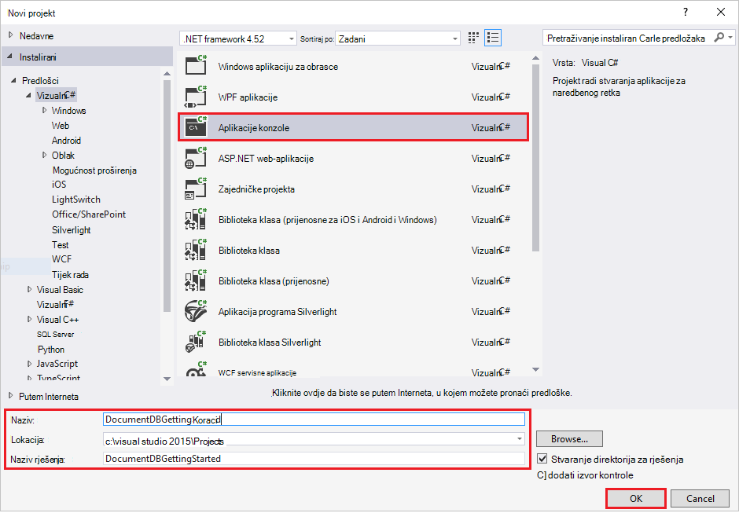
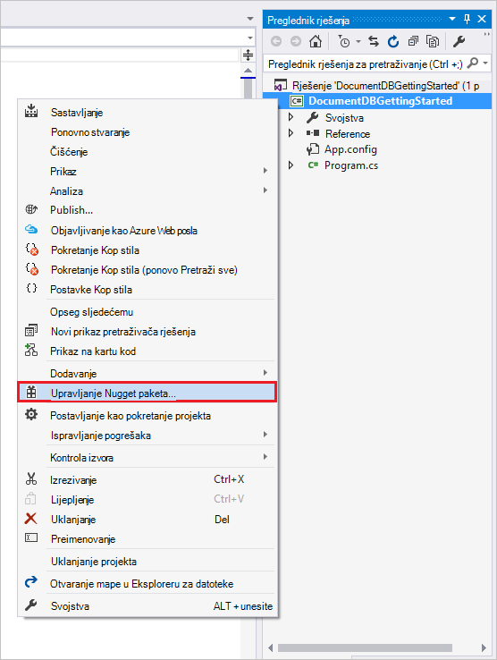
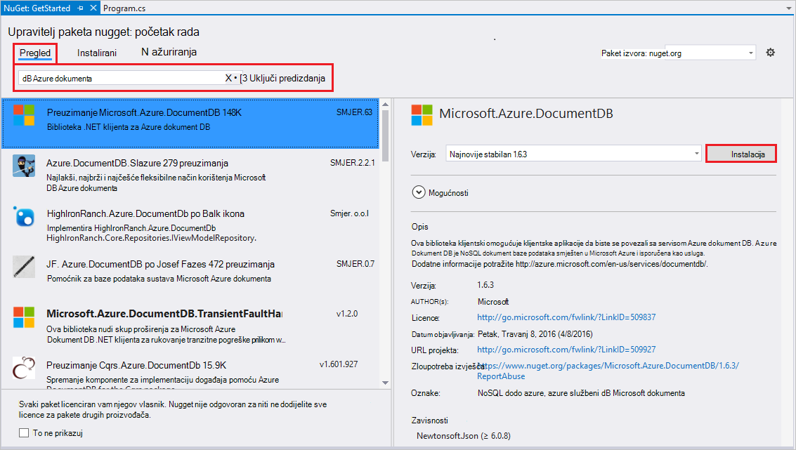
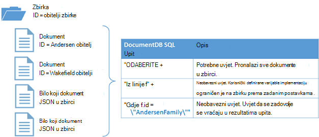

<properties
    pageTitle="Praktični vodič NoSQL: DocumentDB .NET SDK | Microsoft Azure"
    description="Vodič za NoSQL koji stvara internetske baze podataka i C# konzole aplikacije pomoću DocumentDB .NET SDK. DocumentDB je NoSQL baze podataka za JSON."
    keywords="nosql ćete praktičnom vodiču internetske baze podataka aplikacije konzole za c#"
    services="documentdb"
    documentationCenter=".net"
    authors="AndrewHoh"
    manager="jhubbard"
    editor="monicar"/>

<tags
    ms.service="documentdb"
    ms.workload="data-services"
    ms.tgt_pltfrm="na"
    ms.devlang="dotnet"
    ms.topic="hero-article"
    ms.date="08/29/2016"
    ms.author="anhoh"/>

# Praktični vodič NoSQL: sastavljanje u C DocumentDB # aplikacije konzole

> [AZURE.SELECTOR]
- [.NET](documentdb-get-started.md)
- [Node.js](documentdb-nodejs-get-started.md)

Dobro došli u NoSQL vodič za .NET SDK za Azure DocumentDB! Nakon ovog praktičnog vodiča, imat ćete aplikacije konzole za stvara i upiti DocumentDB resursi.

Ćemo objasniti:

- Stvaranje i veze s računom DocumentDB
- Konfiguriranje rješenje Visual Studio
- Stvaranje internetske baze podataka
- Stvaranje zbirke
- Stvaranje JSON dokumenata
- Slanje upita za zbirku
- Zamjena dokumenta
- Brisanje dokumenta
- Brisanje baze podataka

Nemate vremena? ne brini! Potpuno rješenje dostupna je na [GitHub](https://github.com/Azure-Samples/documentdb-dotnet-getting-started). Prijelaz na [Početak u odjeljku potpuno rješenje](#GetSolution) brze upute.

Nakon toga koristite gumbe za glasovanje na vrhu ili dnu ove stranice da biste nam poslali povratne informacije. Želite li nam da biste izravno obratiti, slobodno da biste dodali adrese e-pošte u svoje komentare.

Sada krenimo!

## Preduvjeti

Provjerite sljedeće:

- Aktivni Azure račun. Ako ga nemate, možete se prijaviti [pomoću računa](https://azure.microsoft.com/free/).
- [Visual Studio 2013 / Visual Studio 2015](http://www.visualstudio.com/).
- .NET framework 4.6

## Korak 1: Stvaranje DocumentDB računa

Stvaranje DocumentDB računa. Ako već imate račun koji želite koristiti, možete preskočiti unaprijed postavljanje [Visual Studio rješenje](#SetupVS).

[AZURE.INCLUDE [documentdb-create-dbaccount](../../includes/documentdb-create-dbaccount.md)]

## Korak 2: Postavite rješenje Visual Studio

1. Da biste otvorili **Visual Studio 2015** na vašem računalu.
2. Na izborniku **datoteka** , odaberite **Novo**, a zatim **projekta**.
3. U dijaloškom okviru **Novi projekt** odaberite **Predlošci** / **Visual C#** / **Aplikacije konzole za**naziv projekta, a zatim kliknite **u redu**.

4. U **Pregledniku rješenja**, desnom tipkom miša kliknite novu aplikaciju konzole, koja se nalazi ispod Visual Studio rješenje.
5. Ne napuštajući izbornik, zatim na **Upravljanje NuGet paketa...** 
 
6. Na kartici **Nuget** kliknite **Pregledaj**, a zatim u okvir za pretraživanje upišite **azure documentdb** .
7. U rezultatima pronaći **Microsoft.Azure.DocumentDB** , a zatim kliknite **Instaliraj**.
ID paketa za biblioteku klijent DocumentDB je [Microsoft.Azure.DocumentDB](https://www.nuget.org/packages/Microsoft.Azure.DocumentDB)

Sjajan! Nakon što smo Završi postavljanje, Započnimo pisanja neke koda. Projekt dovršenom koda ovog praktičnog vodiča možete pronaći na [GitHub](https://github.com/Azure-Samples/documentdb-dotnet-getting-started/blob/master/src/Program.cs).

## Korak 3: Povezivanje s računom DocumentDB

Najprije dodajte ove reference na početku C# aplikacije, u datoteci Program.cs:

    using System;
    using System.Linq;
    using System.Threading.Tasks;

    // ADD THIS PART TO YOUR CODE
    using System.Net;
    using Microsoft.Azure.Documents;
    using Microsoft.Azure.Documents.Client;
    using Newtonsoft.Json;

> [AZURE.IMPORTANT] Da biste dovršili ovaj Praktični vodič NoSQL, provjerite je li dodati ovisnosti iznad.

Sada dodajte ove dvije konstante i varijablu *klijent* odjeljku javni klasa *Program*.

    public class Program
    {
        // ADD THIS PART TO YOUR CODE
        private const string EndpointUri = "<your endpoint URI>";
        private const string PrimaryKey = "<your key>";
        private DocumentClient client;

Sljedeći, lakši [Azure Portal](https://portal.azure.com) za dohvaćanje URI i primarni ključ. DocumentDB URI i primarnog ključa su potrebne za svoju aplikaciju da biste shvatili gdje želite povezati, a za DocumentDB pouzdana veza vaše aplikacije.

Na portalu za Azure dođite do DocumentDB račun, a zatim **tipke**.

Kopirajte URI s portala i zalijepite ih u `<your endpoint URI>` u datoteci program.cs. Zatim kopirajte PRIMARNOG ključa s portala i zalijepite ih u `<your key>`.

![Snimka zaslona s portala za Azure koristi NoSQL vodič za stvaranje konzole aplikacije C#. Prikazuje računom DocumentDB s središtu AKTIVNI istaknuta, gumb tipke istaknuta na račun plohu DocumentDB i vrijednosti URI, PRIMARNI KLJUČ i SEKUNDARNE KLJUČ istaknuta na plohu tipke][keys]

Stvaranjem nove instance programa **DocumentClient**ćemo ćete pokrenuti dohvaćanje rada aplikaciju.

Ispod metodu **glavne** dodajte novi zadatak asinkronog naziva **GetStartedDemo**, koji će stvoriti instancu naš novi **DocumentClient**.

    static void Main(string[] args)
    {
    }

    // ADD THIS PART TO YOUR CODE
    private async Task GetStartedDemo()
    {
        this.client = new DocumentClient(new Uri(EndpointUri), PrimaryKey);
    }

Dodajte sljedeći kod da biste pokrenuli asinkronog zadatka iz načina **glavne** . Način **glavne** će Uhvatite iznimke i pisati konzoli sustava.

    static void Main(string[] args)
    {
            // ADD THIS PART TO YOUR CODE
            try
            {
                    Program p = new Program();
                    p.GetStartedDemo().Wait();
            }
            catch (DocumentClientException de)
            {
                    Exception baseException = de.GetBaseException();
                    Console.WriteLine("{0} error occurred: {1}, Message: {2}", de.StatusCode, de.Message, baseException.Message);
            }
            catch (Exception e)
            {
                    Exception baseException = e.GetBaseException();
                    Console.WriteLine("Error: {0}, Message: {1}", e.Message, baseException.Message);
            }
            finally
            {
                    Console.WriteLine("End of demo, press any key to exit.");
                    Console.ReadKey();
            }

Pritisnite **F5** da biste pokrenuli aplikaciju.

Čestitamo! Uspješno povezati s računom DocumentDB, sada Pogledajmo u rad s resursima DocumentDB.  

## Korak 4: Stvaranje baze podataka
Prije nego što dodate kod za stvaranje baze podataka, dodajte metode Pomoćnik za pisanje konzoli sustava.

Kopiranje i lijepljenje metodu **WriteToConsoleAndPromptToContinue** ispod metodu **GetStartedDemo** .

    // ADD THIS PART TO YOUR CODE
    private void WriteToConsoleAndPromptToContinue(string format, params object[] args)
    {
            Console.WriteLine(format, args);
            Console.WriteLine("Press any key to continue ...");
            Console.ReadKey();
    }

Pomoću metode [CreateDatabaseAsync](https://msdn.microsoft.com/library/microsoft.azure.documents.client.documentclient.createdatabaseasync.aspx) klase **DocumentClient** moguće je stvoriti DocumentDB [baze podataka](documentdb-resources.md#databases) . Baza podataka nije logičke spremnik za pohranu dokumenata JSON particije u zbirkama.

Kopiranje i lijepljenje metodu **CreateDatabaseIfNotExists** ispod metodu **WriteToConsoleAndPromptToContinue** .

    // ADD THIS PART TO YOUR CODE
    private async Task CreateDatabaseIfNotExists(string databaseName)
    {
            // Check to verify a database with the id=FamilyDB does not exist
            try
            {
                    await this.client.ReadDatabaseAsync(UriFactory.CreateDatabaseUri(databaseName));
                    this.WriteToConsoleAndPromptToContinue("Found {0}", databaseName);
            }
            catch (DocumentClientException de)
            {
                    // If the database does not exist, create a new database
                    if (de.StatusCode == HttpStatusCode.NotFound)
                    {
                            await this.client.CreateDatabaseAsync(new Database { Id = databaseName });
                            this.WriteToConsoleAndPromptToContinue("Created {0}", databaseName);
                    }
                    else
                    {
                            throw;
                    }
            }
    }

Kopirajte i zalijepite sljedeći kod na način **GetStartedDemo** ispod stvaranja klijenta. To će stvoriti bazu podataka s nazivom *FamilyDB*.

    private async Task GetStartedDemo()
    {
        this.client = new DocumentClient(new Uri(EndpointUri), PrimaryKey);

        // ADD THIS PART TO YOUR CODE
        await this.CreateDatabaseIfNotExists("FamilyDB_oa");

Pritisnite **F5** da biste pokrenuli aplikaciju.

Čestitamo! Stvorili ste uspješno DocumentDB baze podataka.  

## Korak 5: Stvaranje zbirke  

> [AZURE.WARNING] **CreateDocumentCollectionAsync** će stvoriti novu zbirku s rezerviranim propusnost koja ima cijene posljedice. Dodatne informacije, posjetite naš [cijene stranice](https://azure.microsoft.com/pricing/details/documentdb/).

[Zbirka](documentdb-resources.md#collections) moguće je pomoću metode [CreateDocumentCollectionAsync](https://msdn.microsoft.com/library/microsoft.azure.documents.client.documentclient.createdocumentcollectionasync.aspx) klase **DocumentClient** . Zbirka je spremnik JSON dokumenata i pridruženi logike aplikacije JavaScript.

Kopiranje i lijepljenje metodu **CreateDocumentCollectionIfNotExists** ispod načina **CreateDatabaseIfNotExists** .

    // ADD THIS PART TO YOUR CODE
    private async Task CreateDocumentCollectionIfNotExists(string databaseName, string collectionName)
    {
        try
        {
            await this.client.ReadDocumentCollectionAsync(UriFactory.CreateDocumentCollectionUri(databaseName, collectionName));
            this.WriteToConsoleAndPromptToContinue("Found {0}", collectionName);
        }
        catch (DocumentClientException de)
        {
            // If the document collection does not exist, create a new collection
            if (de.StatusCode == HttpStatusCode.NotFound)
            {
                DocumentCollection collectionInfo = new DocumentCollection();
                collectionInfo.Id = collectionName;

                // Configure collections for maximum query flexibility including string range queries.
                collectionInfo.IndexingPolicy = new IndexingPolicy(new RangeIndex(DataType.String) { Precision = -1 });

                // Here we create a collection with 400 RU/s.
                await this.client.CreateDocumentCollectionAsync(
                    UriFactory.CreateDatabaseUri(databaseName),
                    collectionInfo,
                    new RequestOptions { OfferThroughput = 400 });

                this.WriteToConsoleAndPromptToContinue("Created {0}", collectionName);
            }
            else
            {
                throw;
            }
        }
    }

Kopirajte i zalijepite sljedeći kod na način **GetStartedDemo** ispod stvaranje baze podataka. To će stvoriti zbirke dokumenata pod nazivom *FamilyCollection_oa*.

        this.client = new DocumentClient(new Uri(EndpointUri), PrimaryKey);

        await this.CreateDatabaseIfNotExists("FamilyDB_oa");

        // ADD THIS PART TO YOUR CODE
        await this.CreateDocumentCollectionIfNotExists("FamilyDB_oa", "FamilyCollection_oa");

Pritisnite **F5** da biste pokrenuli aplikaciju.

Čestitamo! Stvorili ste uspješno DocumentDB zbirke dokumenata.  

## Korak 6: Stvaranje JSON dokumenata
Pomoću metode [CreateDocumentAsync](https://msdn.microsoft.com/library/microsoft.azure.documents.client.documentclient.createdocumentasync.aspx) klase **DocumentClient** moguće je stvoriti u [dokument](documentdb-resources.md#documents) . Dokumenti su korisnički definirane (proizvoljne) JSON sadržaj. Ne možemo sada možete umetnuti jedan ili više dokumenata. Ako već imate podatke koje želite pohraniti u bazi podataka, možete koristiti na DocumentDB [alata za migraciju podataka](documentdb-import-data.md).

Najprije ćemo potrebnih za stvaranje klasu **obitelji** koja će predstavljati objekte koji su pohranjeni u DocumentDB u ovom primjeru. Smo također će se stvoriti **nadređenog**, **podređeni**, **ljubimac**, podklase **Adresa** koji se koriste unutar **iste linije**. Imajte na umu da se dokumenti, morate imati svojstvo **Id** programa serijalizirani kao **id** u JSON. Stvaranje ove klase dodavanjem sljedeće Interna podređenu klase nakon metodu **GetStartedDemo** .

Kopirajte i zalijepite **obitelji**, **nadređeni**, **podređeni**, **ljubimac**i **adresu** klase ispod metodu **WriteToConsoleAndPromptToContinue** .

    private void WriteToConsoleAndPromptToContinue(string format, params object[] args)
    {
        Console.WriteLine(format, args);
        Console.WriteLine("Press any key to continue ...");
        Console.ReadKey();
    }

    // ADD THIS PART TO YOUR CODE
    public class Family
    {
        [JsonProperty(PropertyName = "id")]
        public string Id { get; set; }
        public string LastName { get; set; }
        public Parent[] Parents { get; set; }
        public Child[] Children { get; set; }
        public Address Address { get; set; }
        public bool IsRegistered { get; set; }
        public override string ToString()
        {
                return JsonConvert.SerializeObject(this);
        }
    }

    public class Parent
    {
        public string FamilyName { get; set; }
        public string FirstName { get; set; }
    }

    public class Child
    {
        public string FamilyName { get; set; }
        public string FirstName { get; set; }
        public string Gender { get; set; }
        public int Grade { get; set; }
        public Pet[] Pets { get; set; }
    }

    public class Pet
    {
        public string GivenName { get; set; }
    }

    public class Address
    {
        public string State { get; set; }
        public string County { get; set; }
        public string City { get; set; }
    }

Kopiranje i lijepljenje metodu **CreateFamilyDocumentIfNotExists** ispod načina **CreateDocumentCollectionIfNotExists** .

    // ADD THIS PART TO YOUR CODE
    private async Task CreateFamilyDocumentIfNotExists(string databaseName, string collectionName, Family family)
    {
        try
        {
            await this.client.ReadDocumentAsync(UriFactory.CreateDocumentUri(databaseName, collectionName, family.Id));
            this.WriteToConsoleAndPromptToContinue("Found {0}", family.Id);
        }
        catch (DocumentClientException de)
        {
            if (de.StatusCode == HttpStatusCode.NotFound)
            {
                await this.client.CreateDocumentAsync(UriFactory.CreateDocumentCollectionUri(databaseName, collectionName), family);
                this.WriteToConsoleAndPromptToContinue("Created Family {0}", family.Id);
            }
            else
            {
                throw;
            }
        }
    }

I umetnite dva dokumenta jedna za Andersen obitelj i prijatelji Wakefield.

Kopirajte i zalijepite sljedeći kod na način **GetStartedDemo** ispod stvaranja zbirke dokumenata.

    await this.CreateDatabaseIfNotExists("FamilyDB_oa");

    await this.CreateDocumentCollectionIfNotExists("FamilyDB_oa", "FamilyCollection_oa");

    // ADD THIS PART TO YOUR CODE
    Family andersenFamily = new Family
    {
            Id = "Andersen.1",
            LastName = "Andersen",
            Parents = new Parent[]
            {
                    new Parent { FirstName = "Thomas" },
                    new Parent { FirstName = "Mary Kay" }
            },
            Children = new Child[]
            {
                    new Child
                    {
                            FirstName = "Henriette Thaulow",
                            Gender = "female",
                            Grade = 5,
                            Pets = new Pet[]
                            {
                                    new Pet { GivenName = "Fluffy" }
                            }
                    }
            },
            Address = new Address { State = "WA", County = "King", City = "Seattle" },
            IsRegistered = true
    };

    await this.CreateFamilyDocumentIfNotExists("FamilyDB_oa", "FamilyCollection_oa", andersenFamily);

    Family wakefieldFamily = new Family
    {
            Id = "Wakefield.7",
            LastName = "Wakefield",
            Parents = new Parent[]
            {
                    new Parent { FamilyName = "Wakefield", FirstName = "Robin" },
                    new Parent { FamilyName = "Miller", FirstName = "Ben" }
            },
            Children = new Child[]
            {
                    new Child
                    {
                            FamilyName = "Merriam",
                            FirstName = "Jesse",
                            Gender = "female",
                            Grade = 8,
                            Pets = new Pet[]
                            {
                                    new Pet { GivenName = "Goofy" },
                                    new Pet { GivenName = "Shadow" }
                            }
                    },
                    new Child
                    {
                            FamilyName = "Miller",
                            FirstName = "Lisa",
                            Gender = "female",
                            Grade = 1
                    }
            },
            Address = new Address { State = "NY", County = "Manhattan", City = "NY" },
            IsRegistered = false
    };

    await this.CreateFamilyDocumentIfNotExists("FamilyDB_oa", "FamilyCollection_oa", wakefieldFamily);

Pritisnite **F5** da biste pokrenuli aplikaciju.

Čestitamo! Uspješno ste stvorili dva DocumentDB dokumenta.  

##Korak 7: Resursi za upit DocumentDB

DocumentDB podržava obogaćeni [upita](documentdb-sql-query.md) odabiranja JSON dokumente pohranjene u svakoj zbirci.  Sljedeći ogledni kod prikazuje različite upita – pomoću oba DocumentDB SQL sintaksa te LINQ - da ne možemo možete pokrenuti dokumente smo umetnuli u prethodnom koraku.

Kopiranje i lijepljenje metodu **ExecuteSimpleQuery** ispod načina **CreateFamilyDocumentIfNotExists** .

    // ADD THIS PART TO YOUR CODE
    private void ExecuteSimpleQuery(string databaseName, string collectionName)
    {
        // Set some common query options
        FeedOptions queryOptions = new FeedOptions { MaxItemCount = -1 };

            // Here we find the Andersen family via its LastName
            IQueryable<Family> familyQuery = this.client.CreateDocumentQuery<Family>(
                    UriFactory.CreateDocumentCollectionUri(databaseName, collectionName), queryOptions)
                    .Where(f => f.LastName == "Andersen");

            // The query is executed synchronously here, but can also be executed asynchronously via the IDocumentQuery<T> interface
            Console.WriteLine("Running LINQ query...");
            foreach (Family family in familyQuery)
            {
                    Console.WriteLine("\tRead {0}", family);
            }

            // Now execute the same query via direct SQL
            IQueryable<Family> familyQueryInSql = this.client.CreateDocumentQuery<Family>(
                    UriFactory.CreateDocumentCollectionUri(databaseName, collectionName),
                    "SELECT * FROM Family WHERE Family.LastName = 'Andersen'",
                    queryOptions);

            Console.WriteLine("Running direct SQL query...");
            foreach (Family family in familyQueryInSql)
            {
                    Console.WriteLine("\tRead {0}", family);
            }

            Console.WriteLine("Press any key to continue ...");
            Console.ReadKey();
    }

Kopirajte i zalijepite sljedeći kod na način **GetStartedDemo** ispod drugog stvaranje dokumenata.

    await this.CreateFamilyDocumentIfNotExists("FamilyDB_oa", "FamilyCollection_oa", wakefieldFamily);

    // ADD THIS PART TO YOUR CODE
    this.ExecuteSimpleQuery("FamilyDB_oa", "FamilyCollection_oa");

Pritisnite **F5** da biste pokrenuli aplikaciju.

Čestitamo! Uspješno su mu protiv DocumentDB zbirke.

Sljedeći dijagram prikazuje kako DocumentDB SQL sintaksa upita zove protiv zbirke koju ste stvorili i isti logika primjenjuje na upit LINQ.

Ključna riječ [FROM](documentdb-sql-query.md#from-clause) nisu obavezni u upitu jer DocumentDB upiti već iz djelokruga jednu zbirku. Zbog toga "Iz linije f" može se zamjenjuju s "Iz korijenske sa r" ili bilo koju varijablu ime koje odaberete. DocumentDB će izvesti tu linije, korijenski ili naziv varijable koju ste odabrali, referencu trenutne zbirke prema zadanim postavkama.

##8 korak: Zamjena JSON dokumenta

DocumentDB podržava zamjene JSON dokumenata.  

Kopiranje i lijepljenje metodu **ReplaceFamilyDocument** ispod načina **ExecuteSimpleQuery** .

    // ADD THIS PART TO YOUR CODE
    private async Task ReplaceFamilyDocument(string databaseName, string collectionName, string familyName, Family updatedFamily)
    {
        try
        {
            await this.client.ReplaceDocumentAsync(UriFactory.CreateDocumentUri(databaseName, collectionName, familyName), updatedFamily);
            this.WriteToConsoleAndPromptToContinue("Replaced Family {0}", familyName);
        }
        catch (DocumentClientException de)
        {
            throw;
        }
    }

Kopirajte i zalijepite sljedeći kod na način **GetStartedDemo** ispod izvršavanje upita. Nakon zamjene dokument, to će pokrenuti istog upita da biste pogledali promijenjeni dokument.

    await this.CreateFamilyDocumentIfNotExists("FamilyDB_oa", "FamilyCollection_oa", wakefieldFamily);

    this.ExecuteSimpleQuery("FamilyDB_oa", "FamilyCollection_oa");

    // ADD THIS PART TO YOUR CODE
    // Update the Grade of the Andersen Family child
    andersenFamily.Children[0].Grade = 6;

    await this.ReplaceFamilyDocument("FamilyDB_oa", "FamilyCollection_oa", "Andersen.1", andersenFamily);

    this.ExecuteSimpleQuery("FamilyDB_oa", "FamilyCollection_oa");

Pritisnite **F5** da biste pokrenuli aplikaciju.

Čestitamo! Uspješno zamijenili DocumentDB dokumenta.

##Korak 9: Brisanje JSON dokumenta

DocumentDB podržava brisanje JSON dokumente.  

Kopiranje i lijepljenje metodu **DeleteFamilyDocument** ispod načina **ReplaceFamilyDocument** .

    // ADD THIS PART TO YOUR CODE
    private async Task DeleteFamilyDocument(string databaseName, string collectionName, string documentName)
    {
        try
        {
            await this.client.DeleteDocumentAsync(UriFactory.CreateDocumentUri(databaseName, collectionName, documentName));
            Console.WriteLine("Deleted Family {0}", documentName);
        }
        catch (DocumentClientException de)
        {
            throw;
        }
    }

Kopirajte i zalijepite sljedeći kod na način **GetStartedDemo** ispod drugog izvršavanje upita.

    await this.ReplaceFamilyDocument("FamilyDB_oa", "FamilyCollection_oa", "Andersen.1", andersenFamily);

    this.ExecuteSimpleQuery("FamilyDB_oa", "FamilyCollection_oa");

    // ADD THIS PART TO CODE
    await this.DeleteFamilyDocument("FamilyDB_oa", "FamilyCollection_oa", "Andersen.1");

Pritisnite **F5** da biste pokrenuli aplikaciju.

Čestitamo! Uspješno ste izbrisali DocumentDB dokumenta.

##10 korak: Brisanje baze podataka

Brisanje baze podataka stvorene uklonit će baza podataka i svih podređenih resursa (zbirke dokumenata, i Dr.).

Kopirajte i zalijepite sljedeći kod na način **GetStartedDemo** ispod dokument Izbriši ili Izbriši cijelu bazu podataka i sve podređene resurse.

    this.ExecuteSimpleQuery("FamilyDB_oa", "FamilyCollection_oa");

    await this.DeleteFamilyDocument("FamilyDB_oa", "FamilyCollection_oa", "Andersen.1");

    // ADD THIS PART TO CODE
    // Clean up/delete the database
    await this.client.DeleteDatabaseAsync(UriFactory.CreateDatabaseUri("FamilyDB_oa"));

Pritisnite **F5** da biste pokrenuli aplikaciju.

Čestitamo! Uspješno ste izbrisali DocumentDB baze podataka.

##Korak 11: Pokreni C# konzole aplikacija sve zajedno!

Pritisnite F5 u Visual Studio da biste sastavili aplikacije u načinu rada za ispravljanje pogrešaka.

Trebali biste vidjeti Izlaz iz aplikacije početak rada. Izlaz će prikazati rezultate upita ćemo dodati i moraju se podudarati primjer teksta.

    Created FamilyDB_oa
    Press any key to continue ...
    Created FamilyCollection_oa
    Press any key to continue ...
    Created Family Andersen.1
    Press any key to continue ...
    Created Family Wakefield.7
    Press any key to continue ...
    Running LINQ query...
        Read {"id":"Andersen.1","LastName":"Andersen","District":"WA5","Parents":[{"FamilyName":null,"FirstName":"Thomas"},{"FamilyName":null,"FirstName":"Mary Kay"}],"Children":[{"FamilyName":null,"FirstName":"Henriette Thaulow","Gender":"female","Grade":5,"Pets":[{"GivenName":"Fluffy"}]}],"Address":{"State":"WA","County":"King","City":"Seattle"},"IsRegistered":true}
    Running direct SQL query...
        Read {"id":"Andersen.1","LastName":"Andersen","District":"WA5","Parents":[{"FamilyName":null,"FirstName":"Thomas"},{"FamilyName":null,"FirstName":"Mary Kay"}],"Children":[{"FamilyName":null,"FirstName":"Henriette Thaulow","Gender":"female","Grade":5,"Pets":[{"GivenName":"Fluffy"}]}],"Address":{"State":"WA","County":"King","City":"Seattle"},"IsRegistered":true}
    Replaced Family Andersen.1
    Press any key to continue ...
    Running LINQ query...
        Read {"id":"Andersen.1","LastName":"Andersen","District":"WA5","Parents":[{"FamilyName":null,"FirstName":"Thomas"},{"FamilyName":null,"FirstName":"Mary Kay"}],"Children":[{"FamilyName":null,"FirstName":"Henriette Thaulow","Gender":"female","Grade":6,"Pets":[{"GivenName":"Fluffy"}]}],"Address":{"State":"WA","County":"King","City":"Seattle"},"IsRegistered":true}
    Running direct SQL query...
        Read {"id":"Andersen.1","LastName":"Andersen","District":"WA5","Parents":[{"FamilyName":null,"FirstName":"Thomas"},{"FamilyName":null,"FirstName":"Mary Kay"}],"Children":[{"FamilyName":null,"FirstName":"Henriette Thaulow","Gender":"female","Grade":6,"Pets":[{"GivenName":"Fluffy"}]}],"Address":{"State":"WA","County":"King","City":"Seattle"},"IsRegistered":true}
    Deleted Family Andersen.1
    End of demo, press any key to exit.

Čestitamo! Provođenja ovog praktičnog vodiča NoSQL i imati radni C# konzole za aplikaciju!

##Početak potpuno rješenje vodiča NoSQL
Da biste sastavili GetStarted rješenja koja sadrži sve uzorke u ovom članku, morate sljedeće:

- Aktivni Azure račun. Ako ga nemate, možete se prijaviti [pomoću računa](https://azure.microsoft.com/free/).
-   [Račun DocumentDB][documentdb-create-account].
-   [GetStarted](https://github.com/Azure-Samples/documentdb-dotnet-getting-started) rješenje dostupna na GitHub.

Da biste vratili reference za .NET SDK DocumentDB u Visual Studio, desnom tipkom miša kliknite **GetStarted** rješenje u pregledniku rješenja, a zatim **Omogući vraćanje NuGet paketa**. Nakon toga u datoteci App.config ažurirati EndpointUrl i AuthorizationKey vrijednosti kao što je opisano u [Povezivanje s računom DocumentDB](#Connect).

## Daljnji koraci

- Želite složenije vodič ASP.NET MVC NoSQL? Potražite u članku [Stvaranje web-aplikacije s MVC ASP.NET pomoću DocumentDB](documentdb-dotnet-application.md).
- Želite li izvesti promjenom veličine i performanse testiranjem DocumentDB? Potražite u članku [performanse i skaliranje testiranjem Azure DocumentDB](documentdb-performance-testing.md)
-   Saznajte kako [monitor DocumentDB računa](documentdb-monitor-accounts.md).
-   Izvoditi upite na naše dataset uzorak u [Playground upita](https://www.documentdb.com/sql/demo).
-   Saznajte više o model programiranja u odjeljku razvoju [DocumentDB dokumentaciju stranice](https://azure.microsoft.com/documentation/services/documentdb/).

[documentdb-create-account]: documentdb-create-account.md
[documentdb-manage]: documentdb-manage.md
[keys]: media/documentdb-get-started/nosql-tutorial-keys.png
