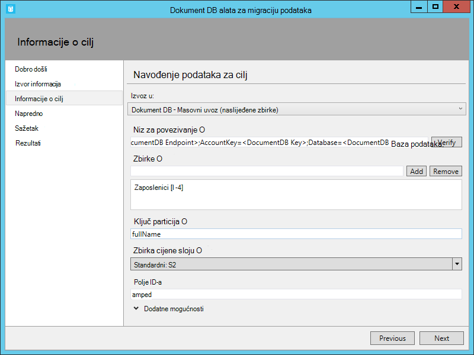

<properties
    pageTitle="Alat za migraciju baze podataka za DocumentDB | Microsoft Azure"
    description="Saznajte kako pomoću alata za migraciju Otvori izvor DocumentDB podataka za uvoz podataka iz različitih izvora, uključujući MongoDB SQL Server, tablice za pohranu, Amazon DynamoDB, CSV datoteke, i JSON u DocumentDB. CSV ili JSON prijelaza."
    keywords="CSV da biste json, Alati za migraciju baze podataka, pretvorite csv json"
    services="documentdb"
    authors="andrewhoh"
    manager="jhubbard"
    editor="monicar"
    documentationCenter=""/>

<tags
    ms.service="documentdb"
    ms.workload="data-services"
    ms.tgt_pltfrm="na"
    ms.devlang="na"
    ms.topic="article"
    ms.date="10/06/2016"
    ms.author="anhoh"/>

# Uvoz podataka u DocumentDB pomoću alata za migraciju baze podataka

U ovom se članku objašnjava korištenje službeni Otvori izvor DocumentDB alata za migraciju podataka radi uvoza podataka [Microsoft Azure DocumentDB](https://azure.microsoft.com/services/documentdb/) iz različitih izvora, uključujući datoteke JSON, CSV datoteke, SQL, MongoDB, spremište tablica platforme Azure, Amazon DynamoDB i DocumentDB zbirke.

Kad pročitate članak ćete je moći odgovaraju na sljedeća pitanja:  

-   Kako možete I uvesti datoteke JSON, CSV datoteku, podacima sustava SQL Server ili MongoDB podataka DocumentDB?
-   Kako mogu podatke možete uvesti iz tablice Azure prostora za pohranu, Amazon DynamoDB i HBase za DocumentDB?
-   Kako migrirati podataka između zbirki DocumentDB?

##Preduvjeti

Prije nego što slijedeći upute u ovom članku, provjerite imate li instalirano sljedeće:

- [Microsoft .NET Framework 4.51](https://www.microsoft.com/download/developer-tools.aspx) ili noviji.

##Pregled alata za migraciju podataka DocumentDB

Alat za migraciju podataka DocumentDB je rješenje Otvori izvor koja se uvozi podatke DocumentDB iz raznih izvora, uključujući:

- JSON datoteke
- MongoDB
- SQL Server
- CSV datoteke
- Azure spremište tablica
- Amazon DynamoDB
- HBase
- DocumentDB zbirke

Dok alat za uvoz obuhvaća grafičko korisničko sučelje (dtui.exe), to možete također biti utemeljenima na iz naredbenog retka (dt.exe). Zapravo, postoji mogućnost izlaz naredbu pridružene nakon postavljanja uvoza putem korisničkog Sučelja. Tablični izvorišnih podataka (primjerice SQL Server ili CSV datoteke) možete pretvoriti tako da se tijekom uvoza mogu se kreirati hijerarhijskih (poddokumentima). Nastavite čitati da biste dodatne informacije o mogućnostima izvora, ogledni naredba retke za uvoz iz svakog izvora, mogućnosti ciljnog i uvoz prikaz rezultata.

##Prilikom instaliranja alata za migraciju podataka DocumentDB

Izvorni kod alata za migraciju je dostupan na GitHub [Ovo spremište](https://github.com/azure/azure-documentdb-datamigrationtool) i kompilirane verzija nije dostupan iz [Microsoftova centra za preuzimanje](http://www.microsoft.com/downloads/details.aspx?FamilyID=cda7703a-2774-4c07-adcc-ad02ddc1a44d). Možete ili Kompiliranje rješenja ili samo preuzeti i izdvajanje kompilirane verziju direktorij po izboru. Izvedite nešto od sljedećeg:

- **Dtui.exe**: grafičkog sučelja verziju alata
- **Dt.exe**: naredbenog retka verziju alata

##Uvoz JSON datoteka

Mogućnost Uvoz izvorne datoteke JSON omogućuje uvoz jedan ili više datoteka JSON jedan dokument ili JSON datotekama svaki sadrže polja JSON dokumenata. Prilikom dodavanja mape koje sadrže JSON datoteke za uvoz, imate mogućnost rekurzivno traženje datoteka u podmape.

Evo nekih uzoraka naredbenog retka za uvoz JSON datoteka:

    #Import a single JSON file
    dt.exe /s:JsonFile /s.Files:.\Sessions.json /t:DocumentDBBulk /t.ConnectionString:"AccountEndpoint=<DocumentDB Endpoint>;AccountKey=<DocumentDB Key>;Database=<DocumentDB Database>;" /t.Collection:Sessions /t.CollectionThroughput:2500

    #Import a directory of JSON files
    dt.exe /s:JsonFile /s.Files:C:\TESessions\*.json /t:DocumentDBBulk /t.ConnectionString:" AccountEndpoint=<DocumentDB Endpoint>;AccountKey=<DocumentDB Key>;Database=<DocumentDB Database>;" /t.Collection:Sessions /t.CollectionThroughput:2500

    #Import a directory (including sub-directories) of JSON files
    dt.exe /s:JsonFile /s.Files:C:\LastFMMusic\**\*.json /t:DocumentDBBulk /t.ConnectionString:" AccountEndpoint=<DocumentDB Endpoint>;AccountKey=<DocumentDB Key>;Database=<DocumentDB Database>;" /t.Collection:Music /t.CollectionThroughput:2500

    #Import a directory (single), directory (recursive), and individual JSON files
    dt.exe /s:JsonFile /s.Files:C:\Tweets\*.*;C:\LargeDocs\**\*.*;C:\TESessions\Session48172.json;C:\TESessions\Session48173.json;C:\TESessions\Session48174.json;C:\TESessions\Session48175.json;C:\TESessions\Session48177.json /t:DocumentDBBulk /t.ConnectionString:"AccountEndpoint=<DocumentDB Endpoint>;AccountKey=<DocumentDB Key>;Database=<DocumentDB Database>;" /t.Collection:subs /t.CollectionThroughput:2500

    #Import a single JSON file and partition the data across 4 collections
    dt.exe /s:JsonFile /s.Files:D:\\CompanyData\\Companies.json /t:DocumentDBBulk /t.ConnectionString:"AccountEndpoint=<DocumentDB Endpoint>;AccountKey=<DocumentDB Key>;Database=<DocumentDB Database>;" /t.Collection:comp[1-4] /t.PartitionKey:name /t.CollectionThroughput:2500

##Uvoz iz MongoDB

Mogućnost za uvoz izvora MongoDB omogućuje uvoz iz pojedine zbirke za MongoDB i filtrirati po izboru dokumenata pomoću upita i/ili izmjenu strukture dokumenta pomoću programa projekciju.  

Niz za povezivanje nalazi se u standardni oblik MongoDB:

    mongodb://<dbuser>:<dbpassword>@<host>:<port>/<database>

> [AZURE.NOTE] Koristite naredbu Provjera da biste bili sigurni da se može pristupiti navedenu u polje niza za povezivanje instancu MongoDB.

Unesite naziv zbirke iz kojeg će uvezene podatke. Po želji mogu navedite ili pružaju datoteke za upit (npr. {pop: {$gt: 5000}}) i/ili projekcije (npr. {loc:0}) i filtrirati i oblikovanje podataka koja će biti uvezena.

Evo nekih uzoraka naredbenog retka za uvoz iz MongoDB:

    #Import all documents from a MongoDB collection
    dt.exe /s:MongoDB /s.ConnectionString:mongodb://<dbuser>:<dbpassword>@<host>:<port>/<database> /s.Collection:zips /t:DocumentDBBulk /t.ConnectionString:"AccountEndpoint=<DocumentDB Endpoint>;AccountKey=<DocumentDB Key>;Database=<DocumentDB Database>;" /t.Collection:BulkZips /t.IdField:_id /t.CollectionThroughput:2500

    #Import documents from a MongoDB collection which match the query and exclude the loc field
    dt.exe /s:MongoDB /s.ConnectionString:mongodb://<dbuser>:<dbpassword>@<host>:<port>/<database> /s.Collection:zips /s.Query:{pop:{$gt:50000}} /s.Projection:{loc:0} /t:DocumentDBBulk /t.ConnectionString:"AccountEndpoint=<DocumentDB Endpoint>;AccountKey=<DocumentDB Key>;Database=<DocumentDB Database>;" /t.Collection:BulkZipsTransform /t.IdField:_id/t.CollectionThroughput:2500

##Uvoz MongoDB izvoz datoteka

Mogućnost za uvoz JSON paketa MongoDB Izvoz datoteke izvora omogućuje uvoz jednu ili više datoteka JSON proizvodi iz uslužni mongoexport.  

Prilikom dodavanja mape koje sadrže MongoDB izvoz JSON datoteke za uvoz, imate mogućnost rekurzivno pretraživanje datoteka u podmape.

Slijedi primjer naredbenog retka za uvoz iz MongoDB izvoz JSON datoteke:

    dt.exe /s:MongoDBExport /s.Files:D:\mongoemployees.json /t:DocumentDBBulk /t.ConnectionString:"AccountEndpoint=<DocumentDB Endpoint>;AccountKey=<DocumentDB Key>;Database=<DocumentDB Database>;" /t.Collection:employees /t.IdField:_id /t.Dates:Epoch /t.CollectionThroughput:2500

##Uvoz iz sustava SQL Server

Mogućnost za uvoz izvora SQL omogućuje uvoz iz pojedinačne baze podataka SQL Server i po želji filtrirati zapise koje želite uvesti pomoću upita. Osim toga, možete izmijeniti strukturi dokumenta navođenjem gniježđenja razdjelnik (više o tome u trenutak).  

Oblik niz za povezivanje nije standardni oblik niza veze za SQL.

> [AZURE.NOTE] Koristite naredbu Provjera da biste bili sigurni da se može pristupiti instancu sustava SQL Server naveden u polje niza za povezivanje.

Svojstvo gniježđenja razdjelnik se koristi za stvaranje hijerarhijskih (pod dokumenti) tijekom uvoza. Imajte na umu sljedeće SQL upita:

*Odaberite GLUMCIMA (BusinessEntityID kao varchar) kao Id, naziv, AddressType kao [Address.AddressType], AddressLine1 kao [Address.AddressLine1], Grad kao [Address.Location.City], naziv države/županije kao [Address.Location.StateProvinceName], PoštanskiBroj kao [Address.PostalCode], CountryRegionName kao [Address.CountryRegionName] iz Sales.vStoreWithAddresses gdje AddressType = "Glavne Office"*

Koja vraća sljedeće rezultate (djelomična):

Imajte na umu pseudonima kao što su Address.AddressType i Address.Location.StateProvinceName. Navođenjem gniježđenja razdjelnik od ".", alat za uvoz stvara adresu i Address.Location poddokumentima tijekom uvoza. Evo primjera nastali dokument u DocumentDB:

*{"id": "956", "naziv": "Precizniji prodaje i usluge", "Adresa": {"AddressType": "Glavne Office", "AddressLine1": "#500 75 O'Connor ulica", "Mjesto": {"Grad": "Ottawa", "Naziv države/županije": "Ontario"}, "PoštanskiBroj": "K4B 1S2", "CountryRegionName": "Kanada"}}*

Evo nekih uzoraka naredbenog retka za uvoz iz sustava SQL Server:

    #Import records from SQL which match a query
    dt.exe /s:SQL /s.ConnectionString:"Data Source=<server>;Initial Catalog=AdventureWorks;User Id=advworks;Password=<password>;" /s.Query:"select CAST(BusinessEntityID AS varchar) as Id, * from Sales.vStoreWithAddresses WHERE AddressType='Main Office'" /t:DocumentDBBulk /t.ConnectionString:" AccountEndpoint=<DocumentDB Endpoint>;AccountKey=<DocumentDB Key>;Database=<DocumentDB Database>;" /t.Collection:Stores /t.IdField:Id /t.CollectionThroughput:2500

    #Import records from sql which match a query and create hierarchical relationships
    dt.exe /s:SQL /s.ConnectionString:"Data Source=<server>;Initial Catalog=AdventureWorks;User Id=advworks;Password=<password>;" /s.Query:"select CAST(BusinessEntityID AS varchar) as Id, Name, AddressType as [Address.AddressType], AddressLine1 as [Address.AddressLine1], City as [Address.Location.City], StateProvinceName as [Address.Location.StateProvinceName], PostalCode as [Address.PostalCode], CountryRegionName as [Address.CountryRegionName] from Sales.vStoreWithAddresses WHERE AddressType='Main Office'" /s.NestingSeparator:. /t:DocumentDBBulk /t.ConnectionString:" AccountEndpoint=<DocumentDB Endpoint>;AccountKey=<DocumentDB Key>;Database=<DocumentDB Database>;" /t.Collection:StoresSub /t.IdField:Id /t.CollectionThroughput:2500

##Uvoz CSV datoteke – pretvaranje CSV JSON

Mogućnost za uvoz izvora CSV datoteka omogućuje vam da biste uvezli CSV datoteke. Prilikom dodavanja mape koje sadrže CSV datoteke za uvoz, imate mogućnost rekurzivno pretraživanje datoteka u podmape.

Slično kao izvor SQL, svojstvo gniježđenja razdjelnik možda moguće koristiti za stvaranje hijerarhijskih (pod dokumenti) tijekom uvoza. Imajte na umu sljedeće CSV zaglavlja redaka i podataka redaka:

Imajte na umu pseudonima kao što su DomainInfo.Domain_Name i RedirectInfo.Redirecting. Navođenjem gniježđenja razdjelnik od ".", alat za uvoz će stvoriti DomainInfo i RedirectInfo poddokumentima tijekom uvoza. Evo primjera nastali dokument u DocumentDB:

*{"DomainInfo": {"Naziv_domene": "ACUS.GOV", "Domain_Name_Address": "http://www.ACUS.GOV"}, "Savezna agencija": "administratora konferencijski od u Sjedinjenim Američkim Državama", "RedirectInfo": {"Preusmjeravanja": "0", "Redirect_Destination": ""}, "id": "9cc565c5-ebcd-1c03-ebd3-cc3e2ecd814d"}*

Alat za uvoz će pokušati izvesti informacije o vrsti bez navodnika vrijednosti u CSV datoteke (Ponuđeni vrijednosti se uvijek smatraju nizove).  Vrste prepoznaju sljedećim redoslijedom: broja, datuma i vremena, Booleove vrijednosti.  

Postoje dvije stvari napomena o uvoz CSV:

1.  Prema zadanim postavkama, bez navodnika vrijednosti uvijek obrezivanja za kartice i razmake, dok Ponuđeni vrijednosti zadržavaju kao-je. Takvo ponašanje moguće poništiti potvrdni okvir Trim Ponuđeni vrijednosti ili mogućnost /s.TrimQuoted naredbenog retka.

2.  Prema zadanim postavkama, bez navodnika null je tretira kao vrijednost null. Takvo ponašanje možete nadjačati (odnosno smatrao bez navodnika null kao niz "null") s na smatrao bez navodnika NULL kao niz potvrdni okvir ili mogućnost /s.NoUnquotedNulls naredbenog retka.

Slijedi primjer naredbenog retka za uvoz u obliku CSV:

    dt.exe /s:CsvFile /s.Files:.\Employees.csv /t:DocumentDBBulk /t.ConnectionString:"AccountEndpoint=<DocumentDB Endpoint>;AccountKey=<DocumentDB Key>;Database=<DocumentDB Database>;" /t.Collection:Employees /t.IdField:EntityID /t.CollectionThroughput:2500

##Uvoz iz spremišta tablica Azure

Mogućnost za uvoz tablice Azure prostora za pohranu izvora omogućuje uvoz iz pojedinačne Azure tablice tablicu za pohranu i filtrirati po izboru entiteti tablice za uvoz.  

Oblikovanje tablice Azure niz za povezivanje za pohranu je:

    DefaultEndpointsProtocol=<protocol>;AccountName=<Account Name>;AccountKey=<Account Key>;

> [AZURE.NOTE] Da biste bili sigurni da se može pristupiti navedenu u polje niza veze za pohranu instancu Azure tablice, koristite naredbu Provjera.

Unesite naziv Azure tablice iz koje će biti uvezene podatke. Po želji možete navesti [Filtar](https://msdn.microsoft.com/library/azure/ff683669.aspx).

Mogućnost za uvoz tablice Azure prostora za pohranu izvora sadrži sljedeće dodatne mogućnosti:

1. Uključivanje Interna polja
    2. Sve - uključiti sva Interna polja (PartitionKey, RowKey i vremenske oznake)
    3. Ništa – Isključi sve Interna polja
    4. RowKey – samo uključiti polje RowKey
3. Odabir stupaca
    1. Azure tablične filtre za pohranu ne podržavaju projekcija. Ako želite uvesti samo određenih svojstava tablice Azure entitet, dodajte ih na popis za odabir stupaca. Sva druga svojstva entitet će je zanemariti.

Slijedi primjer naredbenog retka za uvoz iz spremišta tablica Azure:

    dt.exe /s:AzureTable /s.ConnectionString:"DefaultEndpointsProtocol=https;AccountName=<Account Name>;AccountKey=<Account Key>" /s.Table:metrics /s.InternalFields:All /s.Filter:"PartitionKey eq 'Partition1' and RowKey gt '00001'" /s.Projection:ObjectCount;ObjectSize  /t:DocumentDBBulk /t.ConnectionString:" AccountEndpoint=<DocumentDB Endpoint>;AccountKey=<DocumentDB Key>;Database=<DocumentDB Database>;" /t.Collection:metrics /t.CollectionThroughput:2500

##Uvoz iz Amazon DynamoDB

Mogućnost za uvoz izvora Amazon DynamoDB omogućuje uvoz iz tablice programa za pojedinačne Amazon DynamoDB i filtrirati po izboru entiteti za uvoz. Nekoliko predložaka postoje tako da postavite uvoza, dovoljno je moguće.

Oblik niz za povezivanje Amazon DynamoDB je:

    ServiceURL=<Service Address>;AccessKey=<Access Key>;SecretKey=<Secret Key>;

> [AZURE.NOTE] Koristite naredbu Provjera da biste bili sigurni da se može pristupiti instancu Amazon DynamoDB naveden u polje niza za povezivanje.

Slijedi primjer naredbenog retka za uvoz iz Amazon DynamoDB:

    dt.exe /s:DynamoDB /s.ConnectionString:ServiceURL=https://dynamodb.us-east-1.amazonaws.com;AccessKey=<accessKey>;SecretKey=<secretKey> /s.Request:"{   """TableName""": """ProductCatalog""" }" /t:DocumentDBBulk /t.ConnectionString:"AccountEndpoint=<DocumentDB Endpoint>;AccountKey=<DocumentDB Key>;Database=<DocumentDB Database>;" /t.Collection:catalogCollection /t.CollectionThroughput:2500

##Uvoz datoteke iz spremište blobova platforme Azure

Datoteka JSON, MongoDB izvezene datoteke i mogućnosti za uvoz izvora u CSV datoteku omogućuju vam da biste uvezli jednu ili više datoteka iz spremišta blobova Azure. Nakon što odredite Blob spremnik URL i ključ računa, jednostavno pružaju Uobičajeni izraz za odabir datoteke za uvoz.

Evo oglednih naredbenog retka da biste uvezli JSON datoteke iz spremišta blobova Azure:

    dt.exe /s:JsonFile /s.Files:"blobs://<account key>@account.blob.core.windows.net:443/importcontainer/.*" /t:DocumentDBBulk /t.ConnectionString:"AccountEndpoint=<DocumentDB Endpoint>;AccountKey=<DocumentDB Key>;Database=<DocumentDB Database>;" /t.Collection:doctest

##Uvoz iz DocumentDB

Mogućnost za uvoz izvora DocumentDB omogućuje uvoz podataka iz jednog ili više zbirki DocumentDB i filtrirati po izboru dokumenata pomoću upita.  

Oblik niz za povezivanje DocumentDB je:

    AccountEndpoint=<DocumentDB Endpoint>;AccountKey=<DocumentDB Key>;Database=<DocumentDB Database>;

DocumentDB niz za povezivanje računa koje će biti dohvaćeni iz plohu tipke portala za Azure, kao što je opisano [kako upravljati računom DocumentDB](documentdb-manage-account.md), no naziv baze podataka mora biti dodan niz za povezivanje u sljedećem obliku:

    Database=<DocumentDB Database>;

> [AZURE.NOTE] Koristite naredbu Provjera da biste bili sigurni da se može pristupiti instancu DocumentDB naveden u polje niza za povezivanje.

Da biste uvezli podatke iz jedne zbirke DocumentDB, unesite naziv zbirke iz kojeg će uvezene podatke. Da biste uvezli podatke iz više zbirki DocumentDB, unesite Uobičajeni izraz u skladu s nazivima neke zbirke (npr. collection01 | collection02 | collection03). Po želji mogu odredite ili pružaju datoteke za upit za filtriranje i oblika podatke koje želite uvesti.

> [AZURE.NOTE] Budući da se polje zbirke Prihvati regularne izraze ako uvozite iz jedne zbirke čiji naziv sadrži znakove Uobičajeni izraz, zatim te znakove morate unijeti prespojni znak sukladno tome.

Mogućnost za uvoz izvora DocumentDB sadrži sljedeće dodatne mogućnosti:

1. Sadrže Interna polja: Određuje hoće li uključiti DocumentDB dokumenta sustava svojstva u odjeljku Izvezi (npr. _rid, _ts).
2. Broj ponovne pokušaje pogreške: određuje koliko je puta pokušati veza DocumentDB u slučaju tranzitne pogreške (primjerice mreže povezivanje prekida).
3. Pokušaj Interval: Određuje koliko čekanja između ponovni veza DocumentDB u slučaju tranzitne pogreške (primjerice mreže povezivanje prekida).
4. Način povezivanja: Određuje način povezivanja za uporabu DocumentDB. Dostupne mogućnosti su DirectTcp, DirectHttps i pristupnik. Načini izravne veze su brže, dok je način pristupnika više vatrozid neslužbeni kao samo koristi priključak 443.

> [AZURE.TIP] Alat za uvoz po zadanom odabrana način povezivanja DirectTcp. Ako naiđete na poteškoće s vatrozidom, prijeđite u način povezivanja pristupnika, kao što je samo potreban priključak 443.

Evo nekih uzoraka naredbenog retka za uvoz iz DocumentDB:

    #Migrate data from one DocumentDB collection to another DocumentDB collections
    dt.exe /s:DocumentDB /s.ConnectionString:"AccountEndpoint=<DocumentDB Endpoint>;AccountKey=<DocumentDB Key>;Database=<DocumentDB Database>;" /s.Collection:TEColl /t:DocumentDBBulk /t.ConnectionString:" AccountEndpoint=<DocumentDB Endpoint>;AccountKey=<DocumentDB Key>;Database=<DocumentDB Database>;" /t.Collection:TESessions /t.CollectionThroughput:2500

    #Migrate data from multiple DocumentDB collections to a single DocumentDB collection
    dt.exe /s:DocumentDB /s.ConnectionString:"AccountEndpoint=<DocumentDB Endpoint>;AccountKey=<DocumentDB Key>;Database=<DocumentDB Database>;" /s.Collection:comp1|comp2|comp3|comp4 /t:DocumentDBBulk /t.ConnectionString:"AccountEndpoint=<DocumentDB Endpoint>;AccountKey=<DocumentDB Key>;Database=<DocumentDB Database>;" /t.Collection:singleCollection /t.CollectionThroughput:2500

    #Export a DocumentDB collection to a JSON file
    dt.exe /s:DocumentDB /s.ConnectionString:"AccountEndpoint=<DocumentDB Endpoint>;AccountKey=<DocumentDB Key>;Database=<DocumentDB Database>;" /s.Collection:StoresSub /t:JsonFile /t.File:StoresExport.json /t.Overwrite /t.CollectionThroughput:2500

##Uvoz iz HBase

Mogućnost za uvoz izvora HBase omogućuje uvoz podataka iz tablice HBase i po želji filtriranje podataka. Nekoliko predložaka služe tako da postavite uvoza, dovoljno je moguće.

Oblik niz za povezivanje HBase Stargate je:

    ServiceURL=<server-address>;Username=<username>;Password=<password>

> [AZURE.NOTE] Koristite naredbu Provjera da biste bili sigurni da se može pristupiti navedenu u polje niza za povezivanje instancu HBase.

Slijedi primjer naredbenog retka za uvoz iz HBase:

    dt.exe /s:HBase /s.ConnectionString:ServiceURL=<server-address>;Username=<username>;Password=<password> /s.Table:Contacts /t:DocumentDBBulk /t.ConnectionString:"AccountEndpoint=<DocumentDB Endpoint>;AccountKey=<DocumentDB Key>;Database=<DocumentDB Database>;" /t.Collection:hbaseimport

##Uvoz DocumentDB (Masovni uvoz)

Uvoz DocumentDB skupno omogućuje uvoz iz bilo koju od mogućnosti dostupnih izvora, pomoću DocumentDB pohranjene procedure za učinkovitosti. Alat za podržava uvoz jedan particije za jednu zbirku DocumentDB te sharded uvoz što će se podaci particije u zbirkama DocumentDB više jedne particije. Dodatne informacije o stvaranju particija podataka potražite u članku [Partitioning i skaliranja u Azure DocumentDB](documentdb-partition-data.md). Alat će stvoriti, izvršavanje, a zatim izbrišite pohranjena procedura od one cilj.  

Oblik niz za povezivanje DocumentDB je:

    AccountEndpoint=<DocumentDB Endpoint>;AccountKey=<DocumentDB Key>;Database=<DocumentDB Database>;

DocumentDB niz za povezivanje računa koje će biti dohvaćeni iz plohu tipke portala za Azure, kao što je opisano [kako upravljati računom DocumentDB](documentdb-manage-account.md), no naziv baze podataka mora biti dodan niz za povezivanje u sljedećem obliku:

    Database=<DocumentDB Database>;

> [AZURE.NOTE] Koristite naredbu Provjera da biste bili sigurni da se može pristupiti instancu DocumentDB naveden u polje niza za povezivanje.

Da biste uvezli u jednu zbirku, unesite naziv zbirke na koji podaci će biti uvezeni i kliknite gumb Dodaj. Da biste uvezli u više zbirki, unesite naziv svake zbirke pojedinačno/ili upotrijebite sljedeću sintaksu da biste naveli više zbirki: *collection_prefix*[start indeks - end indeks]. Prilikom određivanja više zbirki putem sintaksa ispunjavaju prethodno navedene imajte sljedeće na umu:

1. Podržani su samo cijeli broj uzoraka naziv raspona. Ako, na primjer, određivanje zbirke [0-3] će stvoriti sljedeće zbirke: collection0, collection1, collection2, collection3.
2. Možete koristiti skraćeni sintakse: zbirke [3] će šalji isti skup zbirke spomenute u koraku 1.
3. Više zamjenskih se može pružati. Na primjer, zbirke [0-1] [0 do 9] generirat će 20 zbirke imena s početnim nulama (collection01,... 02... 03).

Kada se nisu navedeni zbirke imena, odaberite željeni propusnost one (400 RUs na 10 000 RUs). Za najbolje performanse za uvoz odaberite veću propusnost. Dodatne informacije o razinama performanse, potražite u članku [performanse razine u DocumentDB](documentdb-performance-levels.md).

> [AZURE.NOTE] Postavka propusnost performanse odnosi se samo na stvaranje zbirke. Ako navedeni zbirka već postoji, njegov propusnost nije moguće mijenjati.

Prilikom uvoza u više zbirki, raspršivanje podržava alat za uvoz temelji sharding. U ovom slučaju, navedite svojstva dokumenta koji želite koristiti kao ključ particija (ako particija ključ prazna, dokumenti bit će sharded slučajno svim zbirkama cilj).

Po želji mogu odrediti koje polje u izvoru uvoz treba koristiti kao svojstva za ID-a dokumenta DocumentDB tijekom uvoza (Imajte na umu da ako dokumenata sadrže to svojstvo, zatim alat za uvoz generirat će GUID kao vrijednost svojstvo ID-a).

Postoji nekoliko Napredne mogućnosti dostupne tijekom uvoza. Najprije dok alat sadrži zadana masovne uvoz pohranjena procedura (BulkInsert.js), možete odabrati da biste odredili uvoz pohranjen postupak:

 

Osim toga, prilikom uvoza tipovi datuma (primjerice iz sustava SQL Server ili MongoDB), možete odabrati između tri mogućnosti uvoza:

 

-   Niz: Zadržava kao vrijednost niza
-   Epoch: Zadržava kao Epoch brojčanu vrijednost
-   Oba: Zadržava niz i Epoch brojčane vrijednosti. Ta mogućnost će stvoriti podređeni dokument, na primjer: "date_joined": {"Vrijednost": "2013-10-21T21:17:25.2410000Z", "Epoch": 1382390245}

Uvoz DocumentDB skupno sadrži sljedeće dodatne dodatne mogućnosti:

1. Veličina grupe: Alat za zadano veličinu serije od 50.  Ako su dokumenti da biste se uvesti velike, razmislite o smanjiti veličinu serije. Obratno, ako su dokumenti da biste se uvesti small, razmislite o prilikom otvaranja okvira podešavanje veličinu serije.
2. Maksimalna veličina skripte (bajtova): alat za zadane postavke na veličinu Maks skripte 512 KB
3. Onemogući automatsko generiranje Id: Ako svaki dokument da biste se uvesti sadrži polje id, zatim odabirom te mogućnosti možete poboljšati performanse. Dokumenti nedostaje jedinstveni id polje se ne uvoze.
4. Ažuriranje postojeće dokumente: U dijaloškom okviru alata dozvole ne zamjenjuje postojeće dokumente id sukobe. Tom se mogućnošću omogućuje Prebrisivanje postojeće dokumente s odgovarajućim ID-a. Ova značajka je korisna za migracije zakazanih podataka koji se ažurirati postojeće dokumente.
5. Broj ponovne pokušaje pogreške: određuje koliko je puta pokušati veza DocumentDB u slučaju tranzitne pogreške (primjerice mreže povezivanje prekida).
6. Pokušaj Interval: Određuje koliko čekanja između ponovni veza DocumentDB u slučaju tranzitne pogreške (primjerice mreže povezivanje prekida).
7. Način povezivanja: Određuje način povezivanja za uporabu DocumentDB. Dostupne mogućnosti su DirectTcp, DirectHttps i pristupnik. Načini izravne veze su brže, dok je način pristupnika više vatrozid neslužbeni kao samo koristi priključak 443.

> [AZURE.TIP] Alat za uvoz po zadanom odabrana način povezivanja DirectTcp. Ako naiđete na poteškoće s vatrozidom, prijeđite u način povezivanja pristupnika, kao što je samo potreban priključak 443.

##Uvoz DocumentDB (Uvoz nizu zapis)

Uvoz uzastopnih zapis DocumentDB omogućuje uvoz iz bilo koju od mogućnosti dostupnih izvora na temelju zapisa po zapisa. Možda odaberite ovu mogućnost ako uvozite u postojeću zbirku koja je Pristigla kvota od pohranjene procedure. Alat za podržava uvoza u jednoj (jednom i više particija) DocumentDB zbirke, kao i kao sharded uvoz whereby podataka ima particije u više jednom i/ili više particija DocumentDB zbirkama. Dodatne informacije o stvaranju particija podataka potražite u članku [Partitioning i skaliranja u Azure DocumentDB](documentdb-partition-data.md).

Oblik niz za povezivanje DocumentDB je:

    AccountEndpoint=<DocumentDB Endpoint>;AccountKey=<DocumentDB Key>;Database=<DocumentDB Database>;

DocumentDB niz za povezivanje računa koje će biti dohvaćeni iz plohu tipke portala za Azure, kao što je opisano [kako upravljati računom DocumentDB](documentdb-manage-account.md), no naziv baze podataka mora biti dodan niz za povezivanje u sljedećem obliku:

    Database=<DocumentDB Database>;

> [AZURE.NOTE] Koristite naredbu Provjera da biste bili sigurni da se može pristupiti instancu DocumentDB naveden u polje niza za povezivanje.

Da biste uvezli u jednu zbirku, unesite naziv zbirke na koji podaci će biti uvezeni i kliknite gumb Dodaj. Da biste uvezli u više zbirki, unesite naziv svake zbirke pojedinačno/ili upotrijebite sljedeću sintaksu da biste naveli više zbirki: *collection_prefix*[start indeks - end indeks]. Prilikom određivanja više zbirki putem sintaksa ispunjavaju prethodno navedene imajte sljedeće na umu:

1. Podržani su samo cijeli broj uzoraka naziv raspona. Ako, na primjer, određivanje zbirke [0-3] će stvoriti sljedeće zbirke: collection0, collection1, collection2, collection3.
2. Možete koristiti skraćeni sintakse: zbirke [3] će šalji isti skup zbirke spomenute u koraku 1.
3. Više zamjenskih se može pružati. Na primjer, zbirke [0-1] [0 do 9] generirat će 20 zbirke imena s početnim nulama (collection01,... 02... 03).

Kada se nisu navedeni zbirke imena, odaberite željeni propusnost one (400 RUs da biste 250.000 RUs). Za najbolje performanse za uvoz odaberite veću propusnost. Dodatne informacije o razinama performanse, potražite u članku [performanse razine u DocumentDB](documentdb-performance-levels.md). Uvoz zbirke s propusnost > 10 000 RUs potrebno ključa particije. Ako imate više od 250.000 RUs potražite u članku [zahtjev veća ograničenja DocumentDB računa](documentdb-increase-limits.md).

> [AZURE.NOTE] Propusnost postavka odnosi samo na stvaranje zbirke. Ako navedeni zbirka već postoji, njegov propusnost nije moguće mijenjati.

Prilikom uvoza u više zbirki, raspršivanje podržava alat za uvoz temelji sharding. U ovom slučaju, navedite svojstva dokumenta koji želite koristiti kao ključ particija (ako particija ključ prazna, dokumenti bit će sharded slučajno svim zbirkama cilj).

Po želji mogu odrediti koje polje u izvoru uvoz treba koristiti kao svojstva za ID-a dokumenta DocumentDB tijekom uvoza (Imajte na umu da ako dokumenata sadrže to svojstvo, zatim alat za uvoz generirat će GUID kao vrijednost svojstvo ID-a).

Postoji nekoliko Napredne mogućnosti dostupne tijekom uvoza. Najprije prilikom uvoza tipovi datuma (primjerice iz sustava SQL Server ili MongoDB), možete odabrati između tri mogućnosti uvoza:

 

-   Niz: Zadržava kao vrijednost niza
-   Epoch: Zadržava kao Epoch brojčanu vrijednost
-   Oba: Zadržava niz i Epoch brojčane vrijednosti. Ta mogućnost će stvoriti podređeni dokument, na primjer: "date_joined": {"Vrijednost": "2013-10-21T21:17:25.2410000Z", "Epoch": 1382390245}

DocumentDB - uvoz uzastopnih zapis sadrži sljedeće dodatne dodatne mogućnosti:

1. Broj zahtjeva za paralelne: alat zadanih postavki 2 paralelno zahtjeve za. Ako su dokumenti da biste se uvesti small, razmislite o prilikom otvaranja okvira podešavanje broj zahtjeva za paralelne. Imajte na umu da ako taj broj previše podignut, Uvoz može doći ograničavanje.
2. Onemogući automatsko generiranje Id: Ako svaki dokument da biste se uvesti sadrži polje id, zatim odabirom te mogućnosti možete poboljšati performanse. Dokumenti nedostaje jedinstveni id polje se ne uvoze.
3. Ažuriranje postojeće dokumente: U dijaloškom okviru alata dozvole ne zamjenjuje postojeće dokumente id sukobe. Tom se mogućnošću omogućuje Prebrisivanje postojeće dokumente s odgovarajućim ID-a. Ova značajka je korisna za migracije zakazano podataka koji se ažurirati postojeće dokumente.
4. Broj ponovne pokušaje pogreške: određuje koliko je puta pokušati veza DocumentDB u slučaju tranzitne pogreške (primjerice mreže povezivanje prekida).
5. Pokušaj Interval: Određuje koliko čekanja između ponovni veza DocumentDB u slučaju tranzitne pogreške (primjerice mreže povezivanje prekida).
6. Način povezivanja: Određuje način povezivanja za uporabu DocumentDB. Dostupne mogućnosti su DirectTcp, DirectHttps i pristupnik. Načini izravne veze su brže, dok je način pristupnika više vatrozid neslužbeni kao samo koristi priključak 443.

> [AZURE.TIP] Alat za uvoz po zadanom odabrana način povezivanja DirectTcp. Ako naiđete na poteškoće s vatrozidom, prijeđite u način povezivanja pristupnika, kao što je samo potreban priključak 443.

##Kada stvarate DocumentDB zbirke navesti indeksiranja pravila

Kada omogućite alata za migraciju da biste stvorili zbirke tijekom uvoza, možete odrediti indeksiranja pravilo zbirki. U okno Napredne mogućnosti dio skupno DocumentDB uvesti, a zatim DocumentDB uzastopnih mogućnosti zapisa, otvorite odjeljak indeksiranje pravila.

Pomoću pravila za indeksiranje Napredne mogućnosti, koje možete odaberite datoteku pravila indeksiranja ručno unesite indeksiranja pravila ili odaberite iz skupa zadani predlošci (klikom desnom tipkom miša u tekstni okvir indeksiranja pravila).

Predlošci pravila alat daje su:

- Zadani. Kada se izvodi jednakosti upite odabiranja nizove i koristite ORDER BY, raspon i jednakosti upite za brojeve, najbolje je ovo pravilo. To pravilo ima manje prostora za pohranu dodataka indeksa od raspona.
- U rasponu. Najbolje koristite ORDER BY, raspon i jednakosti upita na brojevi i nizovi je ovo pravilo. To pravilo ima na višu indirektni prostora za pohranu indeks nego što je zadana ili raspršivanja.

> [AZURE.NOTE] Ako ne navedete indeksiranja pravilnika, zatim zadani pravilnik primijenit će se. Dodatne informacije o pravilima za indeksiranja potražite u članku [DocumentDB indeksiranja pravila](documentdb-indexing-policies.md).

## Izvoz u datoteku JSON

Program za izvoz DocumentDB JSON omogućuje vam da biste izvezli bilo koju od mogućnosti dostupnih izvora JSON datoteku koja sadrži polje JSON dokumenata. Alat će obrađivati izvoz umjesto vas ili možete odabrati prikaz rezultata naredba migracije i pokrenite naredbu. Rezultirajuća JSON datoteka može biti pohranjeno lokalno ili u spremište blobova platforme Azure.

Po želji možete prettify JSON rezultata koji će se povećati veličinu nastali dokument dok stvarate sadržaj više Ljudski čitljiv.

    Standard JSON export
    [{"id":"Sample","Title":"About Paris","Language":{"Name":"English"},"Author":{"Name":"Don","Location":{"City":"Paris","Country":"France"}},"Content":"Don's document in DocumentDB is a valid JSON document as defined by the JSON spec.","PageViews":10000,"Topics":[{"Title":"History of Paris"},{"Title":"Places to see in Paris"}]}]

    Prettified JSON export
    [
    {
    "id": "Sample",
    "Title": "About Paris",
    "Language": {
      "Name": "English"
    },
    "Author": {
      "Name": "Don",
      "Location": {
        "City": "Paris",
        "Country": "France"
      }
    },
    "Content": "Don's document in DocumentDB is a valid JSON document as defined by the JSON spec.",
    "PageViews": 10000,
    "Topics": [
      {
        "Title": "History of Paris"
      },
      {
        "Title": "Places to see in Paris"
      }
    ]
    }]

## Napredna konfiguracija

Na zaslonu Napredna konfiguracija navedite mjesto na koji biste željeli sve pogreške napisali datoteke zapisnika. Na ovoj stranici primjenjuju se sljedeća pravila:

1.  Ako naziv datoteke nije naveden, sve pogreške će vratiti na stranici rezultati.
2.  Ako je naziv datoteke bez direktorij, zatim datoteka će se stvoriti (ili prebrisati) u trenutnom direktoriju okruženju.
3.  Ako odaberete postojeći datoteku, a zatim datoteku prebrisati, ne postoji mogućnost dodavanja.

Zatim odaberite želite li da biste se prijavili, ključnih, ili poruke o pogrešci. Na kraju, odlučiti koliko se često na zaslonu prijenos poruke će se ažurirati tijek.

    

## Potvrda postavki uvoza i prikaz naredbenog retka

1. Nakon što odredite izvora podataka, cilj informacije i napredne konfiguracijske, pregledajte sažetak migracije i, po želji, prikaz/kopija naredbu dobivene migracije (kopiranje naredbu koristan je da biste automatizirali operacije uvoza):

    

    

2. Kada budete zadovoljni s mogućnostima izvorišno i odredišno, kliknite **Uvezi**. Proteklo vrijeme, prenesene count i podataka nije uspjelo (Ako je niste unesete ključ proizvoda za napredne konfiguracijske) ažurirat će se kao što je uvoz u tijeku. Kada se dovrši, možete izvesti rezultata (npr. radnju za sve pogreške uvoza).

    

3. Novi uvoz, može pokrenuti i zadržavanje postojeće postavke (npr. veze niz podataka, izvorišno i odredišno izbora, itd.) ili vraćanje svih vrijednosti.

    

## Daljnji koraci

- Da biste saznali više o DocumentDB, pogledajte [Tečaj](https://azure.microsoft.com/documentation/learning-paths/documentdb/).
