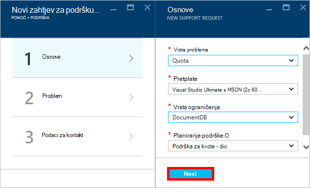

<properties
    pageTitle="Zahtjev za povećati DocumentDB računa kvote | Microsoft Azure"
    description="Saznajte kako da biste zatražili prilagođavanje DocumentDB kvote za bazu podataka kao što su za pohranu dokumenata i propusnost po zbirci."
    services="documentdb"
    authors="AndrewHoh"
    manager="jhubbard"
    editor="monicar"
    documentationCenter=""/>

<tags
    ms.service="documentdb"
    ms.workload="data-services"
    ms.tgt_pltfrm="na"
    ms.devlang="na"
    ms.topic="article"
    ms.date="08/25/2016"
    ms.author="anhoh"/>

# Zahtjev za veća ograničenja DocumentDB računa

[Microsoft Azure DocumentDB](https://azure.microsoft.com/services/documentdb/) ima postavljanje zadanog kvote koje možete prilagoditi tako da se obratite podršci za Azure.  U ovom se članku objašnjava da biste zatražili kvote povećava.

Kad pročitate članak ćete je moći odgovaraju na sljedeća pitanja:  

-   Kvota za baze podataka koji DocumentDB moguće je prilagoditi tako da se obratite podršci za Azure?
-   Kako zatražiti kvote Usklađivanje računa za DocumentDB?

##Kvota DocumentDB računa

U sljedećoj tablici opisane kvote DocumentDB. Kvota koje imaju zvjezdicu (*) moguće je prilagoditi tako da se obratite podršci za Azure:

[AZURE.INCLUDE [azure-documentdb-limits](../../includes/azure-documentdb-limits.md)]

##Zahtjev za kvote prilagodbe
Sljedeći koraci pokazuju kako da biste zatražili kvote prilagodbe.

1. [Portal za Azure](https://portal.azure.com)kliknite **Više servisa**, a zatim **Pomoć + podrška**.

    

2. U plohu **Pomoć + podršku** kliknite **Novi zahtjev za podršku**.

    

3. U plohu **Novi zahtjev za podršku** kliknite **Osnove**. Sljedeći, postavite **vrste problema** **kvote** **pretplate** na pretplatu koja hostira vaš DocumentDB računa, **Vrsta kvote** za **DocumentDB**i **Planiranje podrške** podršci **kvote - dio**. Zatim kliknite **Dalje**.

    

4. Odaberite na težinu plohu **Problem** i obuhvatiti informacije o vaše povećava kvote u **detalja**. Kliknite **Dalje**.

    

5. Na kraju, unesite svoje podatke za kontakt u plohu **Podaci za kontakt** i kliknite **Stvori**.

Nakon što zahtjev za podršku možete, trebali biste dobiti broj zahtjev za podršku putem e-pošte.  Zahtjev za podršku možete pogledati i tako da kliknete **zahtjeva za podršku za upravljanje** u plohu **Pomoć + podrška** .

##Daljnji koraci
- Da biste saznali više o DocumentDB, kliknite [ovdje](http://azure.com/docdb).
