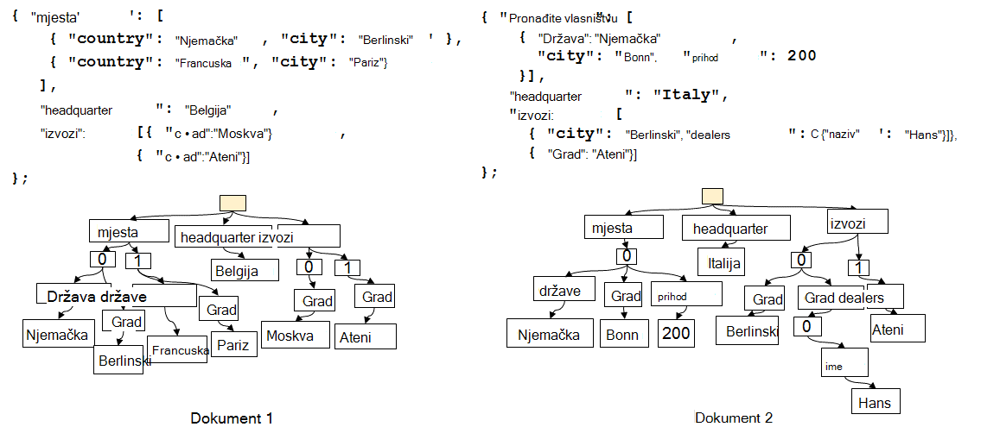
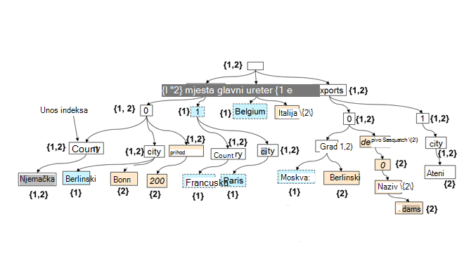

<properties 
    pageTitle="Automatsko indeksiranje u DocumentDB | Microsoft Azure" 
    description="Saznajte kako automatski radi indeksiranja u Azure DocumentDB." 
    services="documentdb" 
    authors="arramac" 
    manager="jhubbard" 
    editor="mimig" 
    documentationCenter=""/>

<tags 
    ms.service="documentdb" 
    ms.workload="data-services" 
    ms.tgt_pltfrm="na" 
    ms.devlang="na" 
    ms.topic="article" 
    ms.date="10/27/2016" 
    ms.author="arramac"/>
    
# Automatsko indeksiranje u Azure DocumentDB

U ovom se članku je isječak teksta papira ["sheme Agnostic indeksiranje s Azure DocumentDB"](http://www.vldb.org/pvldb/vol8/p1668-shukla.pdf) , koji će se prikazivati pri [41st Interna konferenciji na vrlo velike baze podataka](http://www.vldb.org/2015/) između kolovoz 31 - rujan 4, 2015, i je Uvod u načinu indeksiranja funkcioniranja u Azure DocumentDB. 

Kad pročitate, će odgovaraju na sljedeća pitanja:

- Kako DocumentDB izvesti shemu iz dokumenta JSON?
- Kako DocumentDB sastavljanje indeksa preko različitih dokumenata?
- Kako se DocumentDB izvođenje automatsko indeksiranje na razini?

##Kako funkcionira DocumentDB indeksiranja

[Microsoft Azure DocumentDB](https://azure.microsoft.com/services/documentdb/) je true baze podataka sheme slobodno svrhu za JSON. Ga ne očekujete ili potrebna sheme ili sekundarni definicije indeksirati podatke na razini. Omogućuje da brzo definiranje i iteracija na aplikaciju podatkovnim modelima pomoću DocumentDB. Prilikom dodavanja dokumenata zbirka DocumentDB automatski indeksi svih svojstava dokumenta da bi bili dostupni za upit. Automatsko indeksiranje omogućuje pohranu dokumenata koji pripadaju potpuno proizvoljne sheme bez brige o sheme ili sekundarni indeksi.

S ciljem da biste uklonili impedance nepodudaranje između baza podataka i modelima programiranje aplikacije, DocumentDB zloupotrebljava jednostavnosti JSON i njegov nedostatak specifikacija shemu. Čini bez pretpostavke o dokumentima i dokumentima u zbirci DocumentDB za razlikovanje u shemi, osim instancu određene vrijednosti omogućuje. Za razliku od drugih baza podataka dokument DocumentDB korisnika: Modul baze podataka radi izravno na razini gramatiku JSON, Preostali agnostic pojam shemu dokumenta i blurring granicu između vrijednosti strukture i instancu dokumenata. Ovaj u – uključivanje, omogućuje da biste automatski indeksa dokumenata bez shemu ili sekundarne.

Indeksiranje u DocumentDB vodi prednost fact dopušta li JSON gramatike dokumenata bude **prikazan kao stabla**. Da bi dokument JSON će biti predstavljeni kao stabla, sustava Korijenski čvor treba stvoriti koji parents ostatak stvarni čvorove u dokumentu ispod nje. Svaku pojedinu naljepnicu uključujući indekse polja u dokumentu JSON postaje Čvor stabla. Na slici u nastavku prikazuje se u dokument JSON primjer i njegov odgovarajući prikaz stabla.

>[AZURE.NOTE] Budući da je JSON koja se sama s opisom odnosno svaki dokument sadrži shema (metapodaci) i podatke, npr. `{"locationId": 5, "city": "Moscow"}` otkriva da postoje dva svojstva `locationId` i `city`, i imaju li vrijednosti nekretnina numeričke i niz. DocumentDB je mogućnost shemu dokumenata i indeksirati kada umetnuti ili ih neće zamijeniti, bez ikad potrebe da biste definirali sheme ili sekundarne.

**JSON dokumente kao stabala:**

Na primjer, u primjeru iznad:

- Svojstvo JSON `{"headquarters": "Belgium"}` odgovara put/sjedišta/Belgija svojstvo u primjeru iznad.
- Polja JSON `{"exports": [{"city": “Moscow"}`, `{"city": Athens"}]}` odgovara putovi `/exports/[]/city/Moscow` i `/exports/[]/city/Athens`.

Uz automatsko indeksiranje (1) svaki put unutar dokumenta stabla će se indeksirati (osim ako programer izričito konfigurirao indeksiranja pravila da biste izuzeli određene uzoraka put). (2) u svakom ažuriranju dokumenta za zbirku DocumentDB potencijalnih klijenata da biste ažurirali strukture indeksa (odnosno uzroci Dodavanje ili uklanjanje čvorove). Jednu primarnu potrebama automatsko indeksiranje dokumenata osigurava da trošak indeksa i upit dokumenta Duboko ugniježđene strukturu, izgovorite 10 razina, je ista kao paušalni JSON dokumenta koji se sastoji od parovima ključnih vrijednosti precizno samo jednu razinu. Stoga prikaz normaliziranu put je foundation na kojem se oba automatsko indeksiranje i upit podsustava komponenti.

Važno patentnim od tretira oba vrijednosti sheme i instancu jednoliko pomoću putovi je da logično, baš kao što su pojedinačne dokumente, indeks dva dokumenata prikazane koji čuva kartu između putova i ID-ova dokumenata koja sadrži taj put može prikazati i kao stabla. DocumentDB koristi ovaj fact radi stvaranja u indeks stabla koji konstruirana iz unije svih stabala koji predstavlja pojedinačne dokumente unutar zbirke. Indeks stabla u DocumentDB zbirke vremenom poveća kao nove dokumente dobiti dodati ili ažurirati zbirke.

**Indeks DocumentDB kao stablo:**

Bez obzira na koji se shema slobodno, SQL i JavaScript DocumentDB na upit jezika omogućuje relacijski projekcija i filtri, a zatim hijerarhijsku navigaciju dokumenata, prostorno operacije i poziva UDF-ove sastavljene u potpunosti JavaScript. Izvođenje upita u DocumentDB je moći podržavaju te upite jer se može raditi izravno u odnosu na ovaj indeks stabla prikaz podataka.

Zadani pravilnik o indeksiranja automatski indeksi sva svojstva sve dokumente i njihovi dosljedan upiti (značenje sinkronizirano ažuriranje indeksa s pisanje dokumenta). Kako DocumentDB podržava dosljedan ažuriranja indeksa stabla na razini? DocumentDB koristi pisanje optimizirana, zaključavanje besplatne i zapisnika strukturiranim tehnike Održavanje indeksa. To znači da je DocumentDB podržavaju osigurale trajne količinu brzo zapisivanje dok još uvijek posluživanje dosljedan upita. 

Indeksiranje DocumentDB na namijenjen je učinkovitosti prostora za pohranu i učiniti više tenancy. Učinkovitosti trošak indirektni prostora za pohranu na disku indeksa je slabe i predvidljivi. U okviru proračuna resursa sustava dodijeljeno po zbirci DocumentDB i izvršavaju ažuriranja indeksa.

##Daljnji koraci
- Preuzmite ["sheme Agnostic indeksiranje s Azure DocumentDB"](http://www.vldb.org/pvldb/vol8/p1668-shukla.pdf), da biste se prikazivati pri 41st Interna konferenciji na vrlo velike baze podataka, kolovoz 31 - rujan 4, 2015.
- [Upit s DocumentDB SQL](documentdb-sql-query.md)
- Dodatne informacije o prilagodbi indeks DocumentDB [ovdje](documentdb-indexing-policies.md)
 
