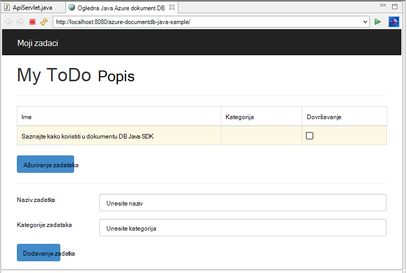

<properties
    pageTitle="Vodič razvoj aplikacija za Java pomoću DocumentDB | Microsoft Azure"
    description="Pomoću ovog praktičnog vodiča Java web aplikacije pokazuje kako pomoću servisa Azure DocumentDB za pohranu i podataka programa access iz aplikacije Java hostirane na Azure web-mjesta."
    keywords="Razvoj aplikacija, vodič baze podataka, java aplikacije, java web-aplikacije vodič, documentdb, azure, Microsoft azure"
    services="documentdb"
    documentationCenter="java"
    authors="dennyglee"
    manager="jhubbard"
    editor="mimig"/>

<tags
    ms.service="documentdb"
    ms.devlang="java"
    ms.topic="hero-article"
    ms.tgt_pltfrm="NA"
    ms.workload="data-services"
    ms.date="08/24/2016"
    ms.author="denlee"/>

# Stvaranje web-aplikacije Java pomoću DocumentDB

> [AZURE.SELECTOR]
- [.NET](documentdb-dotnet-application.md)
- [Node.js](documentdb-nodejs-application.md)
- [Java](documentdb-java-application.md)
- [Python](documentdb-python-application.md)

Pomoću ovog praktičnog vodiča Java web aplikacije pokazuje kako pomoću servisa [Microsoft Azure DocumentDB](https://portal.azure.com/#gallery/Microsoft.DocumentDB) za pohranu i podataka programa access iz aplikacije Java hostirane na Azure web-mjesta. U ovoj se temi saznat ćete:

- Upute za stvaranje osnovne aplikacije JSP u Eclipse.
- Upute za rad sa servisom Azure DocumentDB pomoću [DocumentDB Java SDK](https://github.com/Azure/azure-documentdb-java).

Pomoću ovog praktičnog vodiča aplikacije Java pokazuje kako stvoriti aplikaciju utemeljenu na web-upravljanje zadacima koji omogućuje stvaranje, dohvatiti i zadaci označiti kao dovršenu, kao što je prikazano na sljedećoj slici. Svih zadataka na popisu popis obveza se spremaju kao JSON dokumenata u Azure DocumentDB.

> [AZURE.TIP] Pomoću ovog praktičnog vodiča za razvoj aplikacija podrazumijeva prethodnog sučelje pomoću Java. Ako ste novi korisnik Java ili [pripremni Alati](#Prerequisites), preporučujemo da preuzimanje projekta cjelovit [popis obveza](https://github.com/Azure-Samples/documentdb-java-todo-app) s GitHub i izgradnji [prema](#GetProject)uputama na kraju ovog članka. Nakon što dodate ga u komponenti, možete pregledati u članku da biste dobili uvid kod u kontekstu projekta.  

##Preduvjeti za ovog praktičnog vodiča Java web aplikacije
Prije početka ovog praktičnog vodiča za razvoj aplikacija, morate imati sljedeće:

- Aktivni Azure račun. Ako nemate račun, možete stvoriti besplatnu probnu računa u samo nekoliko minuta. Detalje potražite u članku [Azure besplatnu probnu verziju](https://azure.microsoft.com/pricing/free-trial/).
- [Java Development Kit (JDK 7 +)](http://www.oracle.com/technetwork/java/javase/downloads/index.html).
- [Eclipse IDE za razvojne inženjere EE Java.](http://www.eclipse.org/downloads/packages/eclipse-ide-java-ee-developers/lunasr1)
- [Programa Azure web-mjesta s Java runtime okruženju (npr. Tomcat ili Jetty) omogućena.](../app-service-web/web-sites-java-get-started.md)

Ako instalirate te alate, coreservlets.com nudi walk-through procesa instalacije u odjeljku brzi početak rada njihove [Praktični vodič: instalacija TomCat7 i pomoću Eclipse](http://www.coreservlets.com/Apache-Tomcat-Tutorial/tomcat-7-with-eclipse.html) članka.

##Korak 1: Stvaranje računa DocumentDB baze podataka

Započnimo stvaranjem DocumentDB računa. Ako već imate postavljen račun, možete preskočiti [Korak 2: Stvaranje aplikacije Java JSP](#CreateJSP).

[AZURE.INCLUDE [documentdb-create-dbaccount](../../includes/documentdb-create-dbaccount.md)]

[AZURE.INCLUDE [documentdb-keys](../../includes/documentdb-keys.md)]

##Korak 2: Stvaranje aplikacije Java JSP

Da biste stvorili JSP aplikacije:

1. Najprije ćemo ćete pokrenuti stvaranjem Java projekta. Pokretanje Eclipse, a zatim kliknite **datoteka**, kliknite **Novo**, a zatim **Dinamički Project Web**. Ako ne vidite **Dinamički Project Web** naveden kao dostupne projekt, učinite sljedeće: kliknite **datoteka**, kliknite **Novo**, kliknite **projekt**..., proširite **Web**, kliknite **Dinamički Project Web**i kliknite **Dalje**.

    

2. Unesite naziv projekta u okvir **Naziv projekta** i u **Ciljne Runtime** padajući izbornik, po želji odaberite vrijednost (primjerice Apache Tomcat v7.0), a zatim **Završi**. Odaberite ciljni runtime omogućuje pokretanje projekta lokalno kroz Eclipse.
3. U Eclipse, u prikazu programa Project Explorer proširenje projekta. Desnom tipkom miša kliknite **WebContent**, kliknite **Novo**, a zatim kliknite **Datoteke JSP**.
4. U dijaloškom okviru **Nova datoteka JSP** naziv datoteke **index.jsp**. Zadržati nadređenu mapu kao **WebContent**, kao što je prikazano na sljedećoj slici, a zatim kliknite **Dalje**.

    

5. U dijaloškom okviru **Odabir predloška JSP** potrebe ovog praktičnog vodiča odaberite **Novu datoteku JSP (html)**, a zatim kliknite **Završi**.

6. Kada index.jsp datoteka se otvara u Eclipse, dodajte tekst za prikaz **Pozdrav svijete!** unutar postojeći <body> element. Vaš ažurirani <body> sadržaj trebao izgledati kao sljedeći kod:

        <body>
            <% out.println("Hello World!"); %>
        </body>

8. Spremite datoteku index.jsp.
9. Ako ste postavili cilj runtime u koraku 2, možete kliknuti **projekta** , a zatim **Pokreni** da biste pokrenuli aplikaciju JSP lokalno:

    

##Korak 3: Instalacija DocumentDB Java SDK ##

Da biste izvukli DocumentDB Java SDK i njezine ovisnosti najjednostavnije kroz [Apache Maven](http://maven.apache.org/).

Da biste to učinili, morat ćete pretvoriti projekta projekta maven tako da na sljedeći način:

1. Projekt programa Project Explorer desnom tipkom miša, kliknite **Konfiguriraj**, kliknite **Pretvori u Maven projekta**.
2. U prozoru za **Stvaranje novog POM** prihvatite zadane postavke, a zatim kliknite **Završi**.
3. U programu **Project Explorer**otvorite datoteku pom.xml.
4. Na kartici **ovisnosti** u oknu **ovisnosti** , kliknite **Dodaj**.
4. U prozoru **Odaberite ovisnost** , učinite sljedeće:
 - U okviru **GroupId** unesite com.microsoft.azure.
 - U okviru **Id artefakt** unesite azure documentdb.
 - U okvir **verzija** unesite 1.5.1.

    

    Ili ovisnost XML za GroupId i ArtifactId izravno dodati pom.xml putem programa za uređivanje teksta:

        <dependency>
            <groupId>com.microsoft.azure</groupId>
            <artifactId>azure-documentdb</artifactId>
            <version>1.5.1</version>
        </dependency>

5. Kliknite **u redu** i Maven instalirat će DocumentDB Java SDK.
6. Spremite datoteku pom.xml.

##Korak 4: Putem servisa DocumentDB u aplikaciji Java

1. Najprije ćemo definiranje TodoItem objekta:

        @Data
        @Builder
        public class TodoItem {
            private String category;
            private boolean complete;
            private String id;
            private String name;
        }

    U projektu, a ne možemo koriste [Lombok projekta](http://projectlombok.org/) radi generiranja u Graditelj, getters, setters i Sastavljač. Umjesto toga možete ručno pisanje kod ili ste IDE generiranje ga.

2. Pozvati servis DocumentDB, morate stvoriti novi **DocumentClient**. Općenito govoreći, najbolje je koristiti **DocumentClient** - umjesto Sastavljanje novog klijenta za svaki zahtjev za kasnije. Ne možemo možete ponovno koristiti klijent prelamanje klijent u **DocumentClientFactory**. To je tamo gdje vam je potreban da biste zalijepili URI i PRIMARNI KLJUČ vrijednost koju ste spremili na međuspremnik u [koraku 1](#CreateDB). Zamjena [vaš\_krajnjoj TOČKI\_ovdje] s URI i zamijeni [vaš\_KLJUČ\_ovdje] s PRIMARNI KLJUČ.

        private static final String HOST = "[YOUR_ENDPOINT_HERE]";
        private static final String MASTER_KEY = "[YOUR_KEY_HERE]";

        private static DocumentClient documentClient;

        public static DocumentClient getDocumentClient() {
            if (documentClient == null) {
                documentClient = new DocumentClient(HOST, MASTER_KEY,
                        ConnectionPolicy.GetDefault(), ConsistencyLevel.Session);
            }

            return documentClient;
        }

3. Sada Stvorimo na pristupa podacima objekta (DAO) da biste apstraktnog persisting naš obveze stavke DocumentDB.

    Da biste spremili obveze stavki u zbirku, klijent treba znati koji su baze podataka i zbirke održati da biste (kao referentni po koja se sama veze). Općenito govoreći, najbolje je u predmemoriju baze podataka i zbirka kada je moguće da biste izbjegli dodatne spajanja bazu podataka.

    Sljedeći kod prikazuje kako dohvatiti naš baze podataka i zbirka, ako postoji ili stvorite novi ako ne postoji:

        public class DocDbDao implements TodoDao {
            // The name of our database.
            private static final String DATABASE_ID = "TodoDB";

            // The name of our collection.
            private static final String COLLECTION_ID = "TodoCollection";

            // The DocumentDB Client
            private static DocumentClient documentClient = DocumentClientFactory
                    .getDocumentClient();

            // Cache for the database object, so we don't have to query for it to
            // retrieve self links.
            private static Database databaseCache;

            // Cache for the collection object, so we don't have to query for it to
            // retrieve self links.
            private static DocumentCollection collectionCache;

            private Database getTodoDatabase() {
                if (databaseCache == null) {
                    // Get the database if it exists
                    List<Database> databaseList = documentClient
                            .queryDatabases(
                                    "SELECT * FROM root r WHERE r.id='" + DATABASE_ID
                                            + "'", null).getQueryIterable().toList();

                    if (databaseList.size() > 0) {
                        // Cache the database object so we won't have to query for it
                        // later to retrieve the selfLink.
                        databaseCache = databaseList.get(0);
                    } else {
                        // Create the database if it doesn't exist.
                        try {
                            Database databaseDefinition = new Database();
                            databaseDefinition.setId(DATABASE_ID);

                            databaseCache = documentClient.createDatabase(
                                    databaseDefinition, null).getResource();
                        } catch (DocumentClientException e) {
                            // TODO: Something has gone terribly wrong - the app wasn't
                            // able to query or create the collection.
                            // Verify your connection, endpoint, and key.
                            e.printStackTrace();
                        }
                    }
                }

                return databaseCache;
            }

            private DocumentCollection getTodoCollection() {
                if (collectionCache == null) {
                    // Get the collection if it exists.
                    List<DocumentCollection> collectionList = documentClient
                            .queryCollections(
                                    getTodoDatabase().getSelfLink(),
                                    "SELECT * FROM root r WHERE r.id='" + COLLECTION_ID
                                            + "'", null).getQueryIterable().toList();

                    if (collectionList.size() > 0) {
                        // Cache the collection object so we won't have to query for it
                        // later to retrieve the selfLink.
                        collectionCache = collectionList.get(0);
                    } else {
                        // Create the collection if it doesn't exist.
                        try {
                            DocumentCollection collectionDefinition = new DocumentCollection();
                            collectionDefinition.setId(COLLECTION_ID);

                            collectionCache = documentClient.createCollection(
                                    getTodoDatabase().getSelfLink(),
                                    collectionDefinition, null).getResource();
                        } catch (DocumentClientException e) {
                            // TODO: Something has gone terribly wrong - the app wasn't
                            // able to query or create the collection.
                            // Verify your connection, endpoint, and key.
                            e.printStackTrace();
                        }
                    }
                }

                return collectionCache;
            }
        }

4. Sljedeći je korak da biste neki kod održati TodoItems u zbirci. U ovom primjeru koristit ćemo [Gson](https://code.google.com/p/google-gson/) Serijalizacija i njezini JSON dokumentima serijalizirati TodoItem običan stari Java objekte (POJOs). [Jackson](http://jackson.codehaus.org/) ili vlastite prilagođene serijalizatora također su odličan alternativa za Serijalizacija POJOs.

        // We'll use Gson for POJO <=> JSON serialization for this example.
        private static Gson gson = new Gson();

        @Override
        public TodoItem createTodoItem(TodoItem todoItem) {
            // Serialize the TodoItem as a JSON Document.
            Document todoItemDocument = new Document(gson.toJson(todoItem));

            // Annotate the document as a TodoItem for retrieval (so that we can
            // store multiple entity types in the collection).
            todoItemDocument.set("entityType", "todoItem");

            try {
                // Persist the document using the DocumentClient.
                todoItemDocument = documentClient.createDocument(
                        getTodoCollection().getSelfLink(), todoItemDocument, null,
                        false).getResource();
            } catch (DocumentClientException e) {
                e.printStackTrace();
                return null;
            }

            return gson.fromJson(todoItemDocument.toString(), TodoItem.class);
        }

5. Kao što je baza podataka DocumentDB pa zbirke dokumenata i referencirani po koja se sama veze. Sljedeće funkcije preglednika omogućuje nam dohvatiti dokumenata tako da drugi atribut (npr. "id") umjesto koja se sama veza:

        private Document getDocumentById(String id) {
            // Retrieve the document using the DocumentClient.
            List<Document> documentList = documentClient
                    .queryDocuments(getTodoCollection().getSelfLink(),
                            "SELECT * FROM root r WHERE r.id='" + id + "'", null)
                    .getQueryIterable().toList();

            if (documentList.size() > 0) {
                return documentList.get(0);
            } else {
                return null;
            }
        }

6. Ne možemo u koraku 5 upotrijebite metodu Pomoćnik za dohvaćanje TodoItem JSON dokument prema ID-a i zatim ukloniti serijski broj u POJO:

        @Override
        public TodoItem readTodoItem(String id) {
            // Retrieve the document by id using our helper method.
            Document todoItemDocument = getDocumentById(id);

            if (todoItemDocument != null) {
                // De-serialize the document in to a TodoItem.
                return gson.fromJson(todoItemDocument.toString(), TodoItem.class);
            } else {
                return null;
            }
        }

7. Da biste dobili zbirke ili popis TodoItems pomoću DocumentDB SQL ćemo možete koristiti i u DocumentClient:

        @Override
        public List<TodoItem> readTodoItems() {
            List<TodoItem> todoItems = new ArrayList<TodoItem>();

            // Retrieve the TodoItem documents
            List<Document> documentList = documentClient
                    .queryDocuments(getTodoCollection().getSelfLink(),
                            "SELECT * FROM root r WHERE r.entityType = 'todoItem'",
                            null).getQueryIterable().toList();

            // De-serialize the documents in to TodoItems.
            for (Document todoItemDocument : documentList) {
                todoItems.add(gson.fromJson(todoItemDocument.toString(),
                        TodoItem.class));
            }

            return todoItems;
        }

8. Da biste ažurirali dokument s na DocumentClient na više načina. U aplikaciji za popis naš obveze želimo moći uključivanje/isključivanje li na TodoItem. To se može postići ažuriranjem atribut "dovršeno" unutar dokumenta:

        @Override
        public TodoItem updateTodoItem(String id, boolean isComplete) {
            // Retrieve the document from the database
            Document todoItemDocument = getDocumentById(id);

            // You can update the document as a JSON document directly.
            // For more complex operations - you could de-serialize the document in
            // to a POJO, update the POJO, and then re-serialize the POJO back in to
            // a document.
            todoItemDocument.set("complete", isComplete);

            try {
                // Persist/replace the updated document.
                todoItemDocument = documentClient.replaceDocument(todoItemDocument,
                        null).getResource();
            } catch (DocumentClientException e) {
                e.printStackTrace();
                return null;
            }

            return gson.fromJson(todoItemDocument.toString(), TodoItem.class);
        }

9. Na kraju, želimo mogućnost da biste izbrisali s TodoItem našem popisu. Da biste to učinili, koristimo metodu helper smo neke starije verzije napisali za dohvaćanje koja se sama veza i recite klijent da biste je izbrisali:

        @Override
        public boolean deleteTodoItem(String id) {
            // DocumentDB refers to documents by self link rather than id.

            // Query for the document to retrieve the self link.
            Document todoItemDocument = getDocumentById(id);

            try {
                // Delete the document by self link.
                documentClient.deleteDocument(todoItemDocument.getSelfLink(), null);
            } catch (DocumentClientException e) {
                e.printStackTrace();
                return false;
            }

            return true;
        }

##Korak 5: Linije ostatak na projekta za razvoj Java aplikacije zajedno

Nakon što završite smo zabava bitova – sve je lijevo da biste sastavili brzi korisničko sučelje i slika do naše DAO.

1. Najprije Započnimo s sastavljanjem kontroler za pozivanje našeg DAO:

        public class TodoItemController {
            public static TodoItemController getInstance() {
                if (todoItemController == null) {
                    todoItemController = new TodoItemController(TodoDaoFactory.getDao());
                }
                return todoItemController;
            }

            private static TodoItemController todoItemController;

            private final TodoDao todoDao;

            TodoItemController(TodoDao todoDao) {
                this.todoDao = todoDao;
            }

            public TodoItem createTodoItem(@NonNull String name,
                    @NonNull String category, boolean isComplete) {
                TodoItem todoItem = TodoItem.builder().name(name).category(category)
                        .complete(isComplete).build();
                return todoDao.createTodoItem(todoItem);
            }

            public boolean deleteTodoItem(@NonNull String id) {
                return todoDao.deleteTodoItem(id);
            }

            public TodoItem getTodoItemById(@NonNull String id) {
                return todoDao.readTodoItem(id);
            }

            public List<TodoItem> getTodoItems() {
                return todoDao.readTodoItems();
            }

            public TodoItem updateTodoItem(@NonNull String id, boolean isComplete) {
                return todoDao.updateTodoItem(id, isComplete);
            }
        }

    U aplikaciji za složenije kontrolerom možda house složene poslovne logike pri vrhu u DAO.

2. Zatim ćemo stvoriti servlet za usmjeravanje HTTP zahtjeva s kontrolerom:

        public class TodoServlet extends HttpServlet {
            // API Keys
            public static final String API_METHOD = "method";

            // API Methods
            public static final String CREATE_TODO_ITEM = "createTodoItem";
            public static final String GET_TODO_ITEMS = "getTodoItems";
            public static final String UPDATE_TODO_ITEM = "updateTodoItem";

            // API Parameters
            public static final String TODO_ITEM_ID = "todoItemId";
            public static final String TODO_ITEM_NAME = "todoItemName";
            public static final String TODO_ITEM_CATEGORY = "todoItemCategory";
            public static final String TODO_ITEM_COMPLETE = "todoItemComplete";

            public static final String MESSAGE_ERROR_INVALID_METHOD = "{'error': 'Invalid method'}";

            private static final long serialVersionUID = 1L;
            private static final Gson gson = new Gson();

            @Override
            protected void doGet(HttpServletRequest request,
                    HttpServletResponse response) throws ServletException, IOException {

                String apiResponse = MESSAGE_ERROR_INVALID_METHOD;

                TodoItemController todoItemController = TodoItemController
                        .getInstance();

                String id = request.getParameter(TODO_ITEM_ID);
                String name = request.getParameter(TODO_ITEM_NAME);
                String category = request.getParameter(TODO_ITEM_CATEGORY);
                boolean isComplete = StringUtils.equalsIgnoreCase("true",
                        request.getParameter(TODO_ITEM_COMPLETE)) ? true : false;

                switch (request.getParameter(API_METHOD)) {
                case CREATE_TODO_ITEM:
                    apiResponse = gson.toJson(todoItemController.createTodoItem(name,
                            category, isComplete));
                    break;
                case GET_TODO_ITEMS:
                    apiResponse = gson.toJson(todoItemController.getTodoItems());
                    break;
                case UPDATE_TODO_ITEM:
                    apiResponse = gson.toJson(todoItemController.updateTodoItem(id,
                            isComplete));
                    break;
                default:
                    break;
                }

                response.getWriter().println(apiResponse);
            }

            @Override
            protected void doPost(HttpServletRequest request,
                    HttpServletResponse response) throws ServletException, IOException {
                doGet(request, response);
            }
        }

3. Ne možemo potreban vam je korisničko sučelje Web da se prikazuje korisniku. Pogledajmo ponovno pisanje na index.jsp ćemo ste ranije stvorili:

        <html>
        <head>
          <meta http-equiv="Content-Type" content="text/html; charset=ISO-8859-1">
          <meta http-equiv="X-UA-Compatible" content="IE=edge;" />
          <title>Azure DocumentDB Java Sample</title>

          <!-- Bootstrap -->
          <link href="//ajax.aspnetcdn.com/ajax/bootstrap/3.2.0/css/bootstrap.min.css" rel="stylesheet">

          
        </head>
        <body>
          <!-- Nav Bar -->
          

            

              

                <a class="navbar-brand" href="#">My Tasks</a>
              

            

          

          <!-- Body -->
          

            <h1>My ToDo List</h1>

            

            <!-- The ToDo List -->
            

              <table class="table table-bordered table-striped" id="todoItems">
                <thead>
                  <tr>
                    <th>Name</th>
                    <th>Category</th>
                    <th>Complete</th>
                  </tr>
                </thead>
                <tbody>
                </tbody>
              </table>

              <!-- Update Button -->
              

                <form class="form-horizontal" role="form">
                  <button type="button" class="btn btn-primary">Update Tasks</button>
                </form>
              

            

            

            <!-- Item Input Form -->
            

              <form class="form-horizontal" role="form">
                

                  <label for="inputItemName" class="col-sm-2">Task Name</label>
                  

                    <input type="text" class="form-control" id="inputItemName" placeholder="Enter name">
                  

                

                

                  <label for="inputItemCategory" class="col-sm-2">Task Category</label>
                  

                    <input type="text" class="form-control" id="inputItemCategory" placeholder="Enter category">
                  

                

                <button type="button" class="btn btn-primary">Add Task</button>
              </form>
            

          

          <!-- Placed at the end of the document so the pages load faster -->
          
          
          
        </body>
        </html>

4. I na kraju, pisanje neke Javascript klijentsko sve web korisničko sučelje na servlet zajedno:

        var todoApp = {
          /*
           * API methods to call Java backend.
           */
          apiEndpoint: "api",

          createTodoItem: function(name, category, isComplete) {
            $.post(todoApp.apiEndpoint, {
                "method": "createTodoItem",
                "todoItemName": name,
                "todoItemCategory": category,
                "todoItemComplete": isComplete
              },
              function(data) {
                var todoItem = data;
                todoApp.addTodoItemToTable(todoItem.id, todoItem.name, todoItem.category, todoItem.complete);
              },
              "json");
          },

          getTodoItems: function() {
            $.post(todoApp.apiEndpoint, {
                "method": "getTodoItems"
              },
              function(data) {
                var todoItemArr = data;
                $.each(todoItemArr, function(index, value) {
                  todoApp.addTodoItemToTable(value.id, value.name, value.category, value.complete);
                });
              },
              "json");
          },

          updateTodoItem: function(id, isComplete) {
            $.post(todoApp.apiEndpoint, {
                "method": "updateTodoItem",
                "todoItemId": id,
                "todoItemComplete": isComplete
              },
              function(data) {},
              "json");
          },

          /*
           * UI Methods
           */
          addTodoItemToTable: function(id, name, category, isComplete) {
            var rowColor = isComplete ? "active" : "warning";

            todoApp.ui_table().append($("<tr>")
              .append($("<td>").text(name))
              .append($("<td>").text(category))
              .append($("<td>")
                .append($("<input>")
                  .attr("type", "checkbox")
                  .attr("id", id)
                  .attr("checked", isComplete)
                  .attr("class", "isComplete")
                ))
              .addClass(rowColor)
            );
          },

          /*
           * UI Bindings
           */
          bindCreateButton: function() {
            todoApp.ui_createButton().click(function() {
              todoApp.createTodoItem(todoApp.ui_createNameInput().val(), todoApp.ui_createCategoryInput().val(), false);
              todoApp.ui_createNameInput().val("");
              todoApp.ui_createCategoryInput().val("");
            });
          },

          bindUpdateButton: function() {
            todoApp.ui_updateButton().click(function() {
              // Disable button temporarily.
              var myButton = $(this);
              var originalText = myButton.text();
              $(this).text("Updating...");
              $(this).prop("disabled", true);

              // Call api to update todo items.
              $.each(todoApp.ui_updateId(), function(index, value) {
                todoApp.updateTodoItem(value.name, value.value);
                $(value).remove();
              });

              // Re-enable button.
              setTimeout(function() {
                myButton.prop("disabled", false);
                myButton.text(originalText);
              }, 500);
            });
          },

          bindUpdateCheckboxes: function() {
            todoApp.ui_table().on("click", ".isComplete", function(event) {
              var checkboxElement = $(event.currentTarget);
              var rowElement = $(event.currentTarget).parents('tr');
              var id = checkboxElement.attr('id');
              var isComplete = checkboxElement.is(':checked');

              // Toggle table row color
              if (isComplete) {
                rowElement.addClass("active");
                rowElement.removeClass("warning");
              } else {
                rowElement.removeClass("active");
                rowElement.addClass("warning");
              }

              // Update hidden inputs for update panel.
              todoApp.ui_updateForm().children("input[name='" + id + "']").remove();

              todoApp.ui_updateForm().append($("<input>")
                .attr("type", "hidden")
                .attr("class", "updateComplete")
                .attr("name", id)
                .attr("value", isComplete));

            });
          },

          /*
           * UI Elements
           */
          ui_createNameInput: function() {
            return $(".todoForm #inputItemName");
          },

          ui_createCategoryInput: function() {
            return $(".todoForm #inputItemCategory");
          },

          ui_createButton: function() {
            return $(".todoForm button");
          },

          ui_table: function() {
            return $(".todoList table tbody");
          },

          ui_updateButton: function() {
            return $(".todoUpdatePanel button");
          },

          ui_updateForm: function() {
            return $(".todoUpdatePanel form");
          },

          ui_updateId: function() {
            return $(".todoUpdatePanel .updateComplete");
          },

          /*
           * Install the TodoApp
           */
          install: function() {
            todoApp.bindCreateButton();
            todoApp.bindUpdateButton();
            todoApp.bindUpdateCheckboxes();

            todoApp.getTodoItems();
          }
        };

        $(document).ready(function() {
          todoApp.install();
        });

5. Fenomenalna! Sve što je preostalo je sada da biste testirali aplikacije. Pokrenite aplikaciju lokalno i dodajte neke stavke obveze tako da ispunite naziv stavke i kategoriji te kliknite **Dodavanje zadataka**.

6. Kada se prikaže stavku, možete ažurirati hoće li je dovršeno prebacivanja potvrdni okvir, a zatim klikom **Ažuriranje zadataka**.

##Korak 6: Implementacija aplikacije Java Azure web-mjesta

Azure web-mjesta omogućuje implementacija aplikacije Java jednostavan izvoz aplikacije kao datoteku WAR i ili prijenosa pomoću izvor kontrole (npr. BROJKA) ili FTP.

1. Za izvoz aplikacije kao u WAR, desnom tipkom miša kliknite projekta u **Programu Project Explorer**, kliknite **Izvoz**, a zatim **WAR datoteka**.
2. U prozoru **Izvoz WAR** , učinite sljedeće:
 - U okviru projekta Web unesite azure documentdb-java-uzorka.
 - U okviru odredište, odaberite mjesto za spremanje datoteke WAR.
 - Kliknite **Završi**.

3. Sad kad ste WAR u ruci, jednostavno ga možete prenijeti u imeniku web Azure **webapps** . Upute o prijenosu datoteka potražite u odjeljku [Dodavanje aplikacije na web-mjesto Java na Azure](../app-service-web/web-sites-java-add-app.md).

    Nakon prijenosa datoteka WAR direktorij webapps okruženje za izvođenje će otkriti koje ste dodali i će automatski učitati.
4. Da biste vidjeli dovršene proizvoda, idite na http://YOUR\_web-mjesta\_NAME.azurewebsites.net/azure-documentdb-java-sample/ i započeli s dodavanjem zadataka!

##Dohvaćanje projekta iz GitHub

Svi uzorci ovog praktičnog vodiča nalaze se u programu project [obveze](https://github.com/Azure-Samples/documentdb-java-todo-app) na GitHub. Da biste uvezli popis obveza projekta u Eclipse, provjerite je li softver i resursima navedene u odjeljku [preduvjeti](#Prerequisites) , a zatim učinite sljedeće:

1. Instalirajte [Project Lombok](http://projectlombok.org/). Lombok koristi se za generiranje constructors, getters, setters u projektu. Nakon što ste preuzeli datoteke lombok.jar, dvokliknite je da biste ga instalirati ili ponovno instalirati iz naredbenog retka.
2. Ako je Eclipse otvorena, zatvorite je i ponovno ga da biste učitali Lombok.
3. U Eclipse, na izborniku **datoteka** kliknite **Uvoz**.
4. U prozoru **Uvoz** kliknite **brojka**, kliknite **projekt iz brojka**i zatim kliknite **Dalje**.
5. Na zaslonu za **Odabir izvora spremište** kliknite **Kloniraj URI**.
6. Na zaslonu **Spremištu brojka izvora** u okviru **URI** unesite https://github.com/Azure-Samples/documentdb-java-todo-app.git, a zatim kliknite **Dalje**.
7. Na zaslonu za **Odabir granu** provjerite je li taj **osnovne** odabran, a zatim kliknite **Dalje**.
8. Na zaslonu za **Lokalni odredište** kliknite **Pregledaj** da biste odabrali mapu u kojoj spremište mogu kopirati, a zatim kliknite **Dalje**.
9. Na zaslonu **odaberite Čarobnjak za uvoz projekata** bili sigurni da **Uvoz postojeće projekte** uključen, a zatim kliknite **Dalje**.
10. Na zaslonu za **Uvoz projekata** poništavanje **DocumentDB** projekta, a zatim **Završi**. Projekt DocumentDB sadrži Java SDK DocumentDB koji dodat ćemo kao ovisnosti umjesto toga.
11. U programu **Project Explorer**dođite do azure-documentdb-java-sample\src\com.microsoft.azure.documentdb.sample.dao\DocumentClientFactory.java i zamijenite vrijednosti glavno računalo i MASTER_KEY URI i PRIMARNI KLJUČ za račun DocumentDB, a zatim spremite datoteku. Dodatne informacije potražite u članku [Korak 1. Stvaranje baze podataka računa DocumentDB](#CreateDB).
12. U programu **Project Explorer**desnom tipkom miša kliknite **azure documentdb-java-uzorka**, kliknite **Sastavljanje put**, a zatim **Konfiguriranje sastavljanje put**.
13. Na zaslonu **Java sastavljanje put** u desnom oknu odaberite karticu **Biblioteka** , a zatim **Dodavanje vanjskog JARs**. Pomaknite se do mjesta datoteke lombok.jar i kliknite **Otvori**, a zatim **u redu**.
14. Korištenje korak 12 da biste ponovno otvorili prozor **Svojstva** , a zatim u lijevom oknu kliknite **Namijenjeno Runtimes**.
15. Na zaslonu **Namijenjeno Runtimes** kliknite **Novo**, odaberite **Apache Tomcat v7.0**pa kliknite **u redu**.
16. Korištenje korak 12 da biste ponovno otvorili prozor **Svojstva** , a zatim u lijevom oknu kliknite **Pozornici projekta**.
17. Na zaslonu **Pozornici projekta** odaberite **Dinamičke modul Web** i **Java**pa kliknite **u redu**.
18. Na kartici **poslužitelji** pri dnu zaslona, desnom tipkom miša kliknite **Tomcat v7.0 poslužitelja localhost** , a zatim kliknite **Dodavanje i uklanjanje**.
19. U prozoru **Dodavanje i uklanjanje** premještanje **azure documentdb-java-uzorka** **Configured** okvir, a zatim **Završi**.
20. Na kartici **poslužitelj** **Tomcat v7.0 poslužitelja localhost**desnom tipkom miša, a zatim **ponovno pokrenite**.
21. U pregledniku dođite do http://localhost:8080/azure-documentdb-java-uzorka / i počnite dodavati na popis zadataka. Imajte na umu da se ako ste promijenili zadane vrijednosti priključak, promijenite 8080 vrijednost koju ste odabrali.
22. Da biste implementirali projekta Azure web-mjesto, potražite u članku [korak 6. Implementacija aplikacije na web-mjesta Azure](#Deploy).

[1]: media/documentdb-java-application/keys.png
