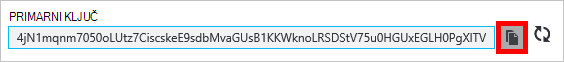

<properties
    pageTitle="Upravljanje računom DocumentDB putem portala za Azure | Microsoft Azure"
    description="Saznajte kako upravljati računom DocumentDB putem portala za Azure. Vodič za na pomoću portala za Azure prikaz, kopiranje, brisanje i pristup računa."
    keywords="Azure Portal documentdb, azure, Microsoft azure"
    services="documentdb"
    documentationCenter=""
    authors="kirillg"
    manager="jhubbard"
    editor="cgronlun"/>

<tags
    ms.service="documentdb"
    ms.workload="data-services"
    ms.tgt_pltfrm="na"
    ms.devlang="na"
    ms.topic="article"
    ms.date="10/14/2016"
    ms.author="kirillg"/>

# Kako upravljati računom DocumentDB

Saznajte kako postaviti globalni dosljednost, rad s tipkama i brisanje računa DocumentDB na portalu za Azure.

## Upravljanje postavkama dosljednost DocumentDB

Odabir razinu desnom dosljednost ovisi o semantiku aplikacije. Ste upoznati s razine dostupne dosljednost u DocumentDB tako da pročitate [Korištenje dosljednost razine Maksimiziranje dostupnosti i performanse DocumentDB] [consistency]. DocumentDB nudi dosljednost, dostupnost i jamstva za performanse, na svakoj razini dosljednost dostupno za vaš račun baze podataka. Konfiguriranje računa za bazu podataka s razinom dosljednost Strong zahtijeva da se podaci nalaze ograničeni na jedno područje Azure i globalno nije dostupna. Na drugim Ruka, razine Opuštena dosljednost - bounded staleness, sesiju ili konačnog Omogući koje želite pridružiti bilo koji broj Azure područja računa baze podataka. Sljedeće jednostavnih koraka Demonstracija odaberite Zadana razina dosljednost za vaš račun baze podataka. 

### Da biste odredili dosljednost zadane DocumentDB računa

1. [Portal za Azure](https://portal.azure.com/)pristup računu DocumentDB.
2. U plohu računa kliknite **Zadana dosljednost**.
3. U plohu **Zadani dosljednost** odaberite novu razinu dosljednost, a zatim kliknite **Spremi**.
    ![Zadani dosljednost sesiju][5]

## Prikaz, kopiranje i Obnovi pristupnih tipki
Kada stvorite račun za DocumentDB, servis generira dvije osnovne pristupnih tipki koje je moguće koristiti za provjeru autentičnosti prilikom pristupanja DocumentDB računa. Unosom dvije tipke za pristup DocumentDB omogućuje Obnovi tipki bez prekida u DocumentDB račun. 

[Portal za Azure](https://portal.azure.com/)pristupiti plohu **tipke** s izbornika resursa na plohu **DocumentDB računa** za prikaz, kopiranje i Obnovi pristupnih tipki koji se koriste za pristup računu DocumentDB.

> [AZURE.NOTE] **Tipke** plohu obuhvaća i nizove primarnih i sekundarnih veze koje je moguće koristiti da biste se povezali s računom iz [Alata za migraciju podataka](documentdb-import-data.md).

Samo za čitanje tipke su dostupne i na ovom plohu. Čitanje i upitima samo za čitanje operacije dok stvara, briše, a zamjenjuje nisu.

### Kopiranje tipkovni prečac na portalu za Azure

Na plohu **tipke** kliknite gumb **Kopiraj** s desne strane tipku koje želite kopirati.

### Obnovi pristupnih tipki

Promijenite tipke za pristup računu DocumentDB povremeno radi zaštite vaše veze. Dvije tipke za pristup dodjeljuju omogućuju vam da biste zadržali veze s računom DocumentDB korištenje jedne tipkovnog dok Obnovi ostale pristupna tipka.

> [AZURE.WARNING] Ponovno stvaranje pristupnih tipki utječe na sve programe koje ovise o trenutni ključ. Da biste koristili novi ključ mora se ažurirati sve klijente pomoću tipke programa access za pristup računu DocumentDB.

Ako imate programe ili servise u oblaku putem računa DocumentDB, izgubit ćete veze ako Obnovi tipke, osim ako se poništiti ključeva. Sljedeći koraci strukture postupka koji je uključen u vodoravnim ključeva.

1. Ažurirajte tipkovni prečac u kodu aplikacije referentni sekundarne pristupni ključ računa DocumentDB.
2. Obnovi primarni pristupni ključ za račun DocumentDB. [Portal za Azure](https://portal.azure.com/)pristup računu DocumentDB.
3. U plohu **DocumentDB računa** kliknite **tipke**.
4. Na plohu **tipke** kliknite gumb regenerate, a zatim kliknite **u redu** da biste potvrdili da želite stvoriti novi ključ.
    

5. Nakon što ste provjerili je li novi ključ dostupan za korištenje (više od pet minuta nakon regeneration), ažurirajte tipkovni prečac u kodu aplikacije referentni novog ključa primarni programa access.
6. Obnovi sekundarne tipkovni prečac.

    

> [AZURE.NOTE] To može potrajati nekoliko minuta prije nego što upravo generirani ključ može se koristiti za pristup računu DocumentDB.

## Dohvaćanje niza za povezivanje

Dohvaćanje niza za povezivanje, učinite sljedeće: 

1. [Portal za Azure](https://portal.azure.com)pristup računu DocumentDB.
2. Na izborniku resursa pritisnite **tipke**.
3. Kliknite gumb **Kopiraj** pokraj okvira **Primarni niz veze** ili **Sekundarni niz za povezivanje** . 

Ako koristite niz za povezivanje [Alata za migraciju DocumentDB baze podataka](documentdb-import-data.md), dodavanje naziv baze podataka na kraj niz za povezivanje. `AccountEndpoint=< >;AccountKey=< >;Database=< >`.

## Brisanje računa DocumentDB
Da biste uklonili račun DocumentDB na portalu Azure koji više ne koristite, pomoću naredbe **Izbriši račun** na plohu **DocumentDB računa** .

1. [Portal za Azure](https://portal.azure.com/)pristupiti DocumentDB račun koji želite izbrisati.
2. Na plohu **DocumentDB računa** kliknite **više**, a zatim **Izbrišite račun**. Ili, desnom tipkom miša kliknite naziv baze podataka, a zatim kliknite **Izbriši račun**.
3. Na dobivene plohu potvrdu upišite naziv računa DocumentDB da biste potvrdili da želite izbrisati račun.
4. Kliknite gumb **Izbriši** .

## Daljnji koraci

Saznajte kako započeti rad [sa svojim računom DocumentDB](http://go.microsoft.com/fwlink/p/?LinkId=402364).

Da biste saznali više o DocumentDB, potražite u dokumentaciji za Azure DocumentDB na [azure.com](http://go.microsoft.com/fwlink/?LinkID=402319&clcid=0x409).

<!--Image references-->
[1]: ./media/documentdb-manage-account/documentdb_add_region-1.png
[2]: ./media/documentdb-manage-account/documentdb_add_region-2.png
[3]: ./media/documentdb-manage-account/documentdb_change_write_region-1.png
[4]: ./media/documentdb-manage-account/documentdb_change_write_region-2.png
[5]: ./media/documentdb-manage-account/documentdb_change_consistency-1.png
[6]: ./media/documentdb-manage-account/chooseandsaveconsistency.png

<!--Reference style links - using these makes the source content way more readable than using inline links-->
[bcdr]: https://azure.microsoft.com/documentation/articles/best-practices-availability-paired-regions/
[consistency]: https://azure.microsoft.com/documentation/articles/documentdb-consistency-levels/
[azureregions]: https://azure.microsoft.com/en-us/regions/#services
[offers]: https://azure.microsoft.com/en-us/pricing/details/documentdb/
