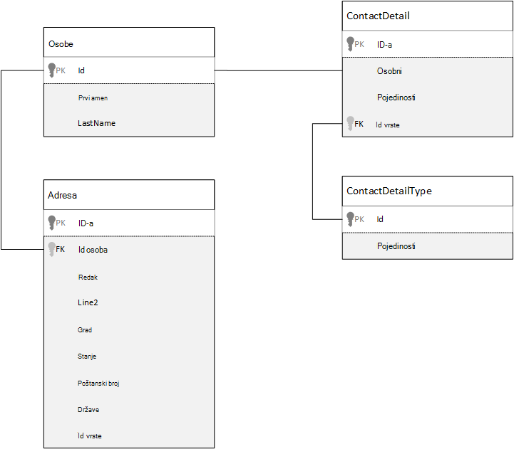
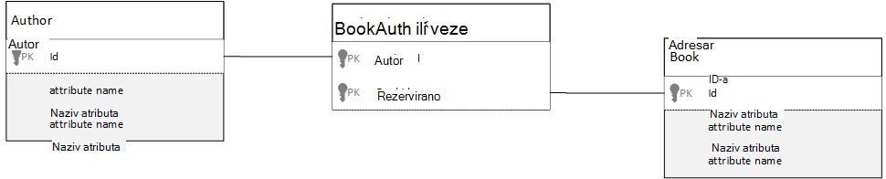

<properties 
    pageTitle="Modeliranje podataka u Azure DocumentDB | Microsoft Azure" 
    description="Saznajte više o Modeliranje podataka za DocumentDB, NoSQL dokumenta baze podataka." 
    keywords="Modeliranje podataka"
    services="documentdb" 
    authors="kiratp" 
    manager="jhubbard" 
    editor="mimig1" 
    documentationCenter=""/>

<tags 
    ms.service="documentdb" 
    ms.workload="data-services" 
    ms.tgt_pltfrm="na" 
    ms.devlang="na" 
    ms.topic="article" 
    ms.date="08/05/2016" 
    ms.author="kipandya"/>

#Modeliranje podataka u DocumentDB#
Dok sheme slobodno baze podataka, kao što su Azure DocumentDB postane super lako obuhvaćaju promjene podatkovnog modela trebali biste i dalje trošite mislili na vrijeme o vašim podacima. 

Kako podataka će biti pohranjen? Kako aplikacija će dohvatiti i slanje upita za podatke? Je li aplikacije podebljano čitanje ili pisanje podebljanom? 

Kad pročitate članak će se moći odgovaraju na sljedeća pitanja:

- Kako trebali biste razmisliti o dokumentu u bazi podataka za dokument?
- Što je Modeliranje podataka i zašto važnih treba li? 
- Kako se Modeliranje podataka u bazi podataka za dokument različite relacijske baze podataka?
- Kako express odnose podataka u bazi podataka koje nisu relacijski?
- Kada Ugradnja podataka i kada učinite povezivanje s podacima?

##Ugrađivanje podataka##
Kada pokrenete Modeliranje podataka u spremištu dokumenata, kao što su DocumentDB, pokušajte vaše entiteti Smatraj **samostalnih dokumenti** predstavljeni u JSON.

Prije nego smo prikazali previše mnogo dodatno Javite nam opozvali nekoliko koraka, a pogledati kako ćemo možda modela nešto u relacijske baze podataka, predmet većinu je dobra već poznajete. Sljedeći primjer pokazuje kako se osobe mogu nalaziti u relacijske baze podataka. 

Kada radite s relacijskim bazama podataka, pokazala smo ste je si godina normalizirati, normalizirati, normalizirati.

Normalizacija podataka obično podrazumijeva poduzimanja entitet, kao što je osoba, a najnovije ga prema dolje samostalni podatka. U gornjem primjeru osoba može imati više zapisa detaljima o kontaktu, kao i više adresa zapisa. Ćemo čak i vratiti jedan korak dodatno i raščlaniti detalje o kontaktu po daljnje izdvajanje uobičajenih polja kao vrstu. Istu adresu za svaki zapis je vrsta kao što su *Home* ili *tvrtke* 

Na navođenjem lokalnu kada je normalizacija podataka da biste **izbjegli spremanje suvišnih podataka** na svaki zapis i radije referirati na podatke. U ovom primjeru da biste pročitali neke osobe sa svim svojim detalje o kontaktu i adrese, morate koristiti SPOJEVE za učinkovito Zbrajanje podataka u vrijeme izvođenja.

    SELECT p.FirstName, p.LastName, a.City, cd.Detail
    FROM Person p
    JOIN ContactDetail cd ON cd.PersonId = p.Id
    JOIN ContactDetailType on cdt ON cdt.Id = cd.TypeId
    JOIN Address a ON a.PersonId = p.Id

Ažuriranje jednoj osobi s detaljima o kontaktu i adrese zahtijeva operacije pisanja preko više pojedinačnih tablica. 

Sada ćemo pogledajte kako bi modela iste podatke kao samostalnih entitet u bazi podataka za dokument.
        
    {
        "id": "1",
        "firstName": "Thomas",
        "lastName": "Andersen",
        "addresses": [
            {            
                "line1": "100 Some Street",
                "line2": "Unit 1",
                "city": "Seattle",
                "state": "WA",
                "zip": 98012
            }
        ],
        "contactDetails": [
            {"email: "thomas@andersen.com"},
            {"phone": "+1 555 555-5555", "extension": 5555}
        ] 
    }

Korištenje pristup iznad imamo sada **Denormalizirani** osobe snimanje gdje ćemo **ugrađene** sve podatke koji se odnose na tu osobu, kao što su njihove detalje o kontaktu i adrese, u jedan dokument JSON.
Osim toga, jer smo ste ograničeni na shemu fixed imamo fleksibilnost obavljati zadatke kao što potpuno pojavljuju detalje o kontaktu različitih oblika. 

Dohvaćanje dovršeno osoba zapisa iz baze podataka sada je jedan čitati operacija na temelju jednog zbirke i jednog dokumenta. Ažuriranje zapisa osobe, s detaljima o kontaktu i adrese, operacija i jedan pisanja na temelju jednog dokumenta.

Po denormalizing podataka aplikacije možda morati izdavanje manje upita i ažuriranja da biste dovršili uobičajenih operacija. 

###Kada je ugraditi

Općenito govoreći, koristi ugrađenu podatkovnu modelima kada:

- Postoje **sadrži** odnose između entiteti.
- Postoje **jedan nekoliko** odnosi između entiteti.
- Nema ugrađenu podataka te **promjene diskovni**.
- Postoji ugrađene podataka neće Povećaj **bez granica**.
- Nema ugrađenu podataka koje je **sastavni dio** s podacima u dokumentu.

> [AZURE.NOTE] Obično Denormalizirani podatkovne modele imaju bolje performanse za **čitanje** .

###Kada ne želite ugraditi

Dok je pravilo palca u bazi podataka za dokument da biste sve denormalize i Ugradi sve podatke u jedan dokument, to može dovesti do situacije moraju se izbjegavati.

Iskoristite ovaj JSON isječka.

    {
        "id": "1",
        "name": "What's new in the coolest Cloud",
        "summary": "A blog post by someone real famous",
        "comments": [
            {"id": 1, "author": "anon", "comment": "something useful, I'm sure"},
            {"id": 2, "author": "bob", "comment": "wisdom from the interwebs"},
            …
            {"id": 100001, "author": "jane", "comment": "and on we go ..."},
            …
            {"id": 1000000001, "author": "angry", "comment": "blah angry blah angry"},
            …
            {"id": ∞ + 1, "author": "bored", "comment": "oh man, will this ever end?"},
        ]
    }

To može biti kako objavu entitet s komentarima ugrađene izgledati ako su smo Modeliranje uobičajeni bloga ili a CMS sustava. Problem s ovom primjeru da je polje Komentari **neograničeno**, što znači da nema ograničenja (praktično) s brojem komentara svake objave jedan može imati. Kao što je veličina dokumenta ne može značajno Povećaj to neće biti problem.

> [AZURE.TIP] Dokumente u DocumentDB imaju maksimalnu veličinu. Dodatne informacije o tome potražite [DocumentDB ograničenja](documentdb-limits.md).

Kao što je veličina dokumenta rastom mogućnost prijenos podataka nad žičani kao i za čitanje i ažuriranja dokumenta na skaliranje će neće utjecati.

U ovom slučaju bi bolje treba uzeti u obzir sljedeće modela.
        
    Post document:
    {
        "id": "1",
        "name": "What's new in the coolest Cloud",
        "summary": "A blog post by someone real famous",
        "recentComments": [
            {"id": 1, "author": "anon", "comment": "something useful, I'm sure"},
            {"id": 2, "author": "bob", "comment": "wisdom from the interwebs"},
            {"id": 3, "author": "jane", "comment": "....."}
        ]
    }

    Comment documents:
    {
        "postId": "1"
        "comments": [
            {"id": 4, "author": "anon", "comment": "more goodness"},
            {"id": 5, "author": "bob", "comment": "tails from the field"},
            ...
            {"id": 99, "author": "angry", "comment": "blah angry blah angry"}
        ]
    },
    {
        "postId": "1"
        "comments": [
            {"id": 100, "author": "anon", "comment": "yet more"},
            ...
            {"id": 199, "author": "bored", "comment": "will this ever end?"}
        ]
    }

Ovaj model sadrži zadnja tri komentare ugrađene na objavu, koja je polje s na fiksni vezana ovaj put. Druge Komentari su grupirane u serijama od 100 komentare i pohranjene u zasebne dokumente. Veličina serije nije odabran kao 100 jer naš izmišljeni aplikacija omogućuje korisniku učitavanje 100 komentara odjednom.  

Drugi slučaj kojem ugrađivanje podataka nije dobro je kada ugrađenu podatkovnu se često koristi u dokumentu, a promijenit će se često. 

Iskoristite ovaj JSON isječka.

    {
        "id": "1",
        "firstName": "Thomas",
        "lastName": "Andersen",
        "holdings": [
            {
                "numberHeld": 100,
                "stock": { "symbol": "zaza", "open": 1, "high": 2, "low": 0.5 }
            },
            {
                "numberHeld": 50,
                "stock": { "symbol": "xcxc", "open": 89, "high": 93.24, "low": 88.87 }
            }
        ]
    }

To predstaviti burzovni portfelja te osobe. Ne možemo odabrali ste da biste ugradili podataka o dionicama u svakom dokumentu portfelja. U okruženju gdje povezanih podataka mijenja često, kao što su dionice trgovina aplikacija, ugrađivanje podataka koji se često mijenja će znači da neprestano ažurirate svakom dokumentu portfelja svaki put kada se razmjenjuju dionice.

Burzovni *zaza* razmjenjuju mnogo stotine vremena u jedan dan i tisuće korisnika nije uključeno *zaza* njihove portfelja. S podatkovnim modelom kao što su iznad smo se da biste ažurirali mnogo tisuće dokumenata portfelja više puta svakodnevno oni mogu dovesti do sustav koji se neće skaliranja vrlo. 

##Pozivate podataka##

Tako, ugrađivanje podataka radi boljeg radi mnogim slučajevima, ali je Očisti da su scenarija situacije denormalizing podataka mogla uzrokovati probleme više od vrijednosti. Tako što ne možemo? sada 

Relacijske baze podataka nisu samo mjesto na kojem možete stvarati odnose između entiteti. U dokumentu baze podataka mogu sadržavati podatke u jednom dokumentu zapravo odnosi s podacima u druge dokumente. Sada mogu se ne advocating čak i jedne minute da bismo stvoriti sustavima koji će biti prikladnije relacijske baze podataka u DocumentDB ili bilo koju drugu bazu podataka dokumenta, ali jednostavne odnose se precizno i može biti vrlo korisna. 

U JSON nastavku ćemo odlučili primjer burzovni portfelja iz neke starije verzije, ali ovaj put ne možemo odnose burzovni stavke na portfelja umjesto ulaganja. Na taj način, prilikom promjene burzovni stavke često tijekom dana samo dokument koji je potrebno ažurirati je jedan burzovni dokument. 

    Person document:
    {
        "id": "1",
        "firstName": "Thomas",
        "lastName": "Andersen",
        "holdings": [
            { "numberHeld":  100, "stockId": 1},
            { "numberHeld":  50, "stockId": 2}
        ]
    }
    
    Stock documents:
    {
        "id": "1",
        "symbol": "zaza",
        "open": 1,
        "high": 2,
        "low": 0.5,
        "vol": 11970000,
        "mkt-cap": 42000000,
        "pe": 5.89
    },
    {
        "id": "2",
        "symbol": "xcxc",
        "open": 89,
        "high": 93.24,
        "low": 88.87,
        "vol": 2970200,
        "mkt-cap": 1005000,
        "pe": 75.82
    }
    

Odmah negativna strana tog pristupa kroz je li vaša aplikacija potreban je da bi se podaci o svaki robe koja je riječ o javnom prilikom prikaza portfelja osobe; u ovom slučaju morate da biste više trips baze podataka da biste učitali podatke za svaki burzovni dokument. Ovdje unijeli smo odluku da biste poboljšali učinkovitost pisanje operacije dogoditi često tijekom dana, ali shodno ugrožena na operacije čitanja koji potencijalno imati manje utjecaj na performanse sustava određeni.

> [AZURE.NOTE] Normaliziranim podatke modela **može zahtijevati više trips zaokružiti** na poslužitelj.

### Je li moguće koristiti vanjski ključevi?
Budući da trenutno je pojam bez ograničenja, vanjski ključ niti ne izričitu, odnose među dokumenta koje imate u dokumentima su učinkovito "loš veze" i ne može provjeriti baze podataka u samu. Ako želite Pobrinite se da dokument referencira zapravo postoji podatke, morate učiniti u aplikaciji ili pomoću okidača poslužiteljsko ili pohranjene procedure na DocumentDB.

###Kada se referenca
Općenito govoreći, korištenje normaliziranu podataka modelima kada:

- Predstavljanje odnosa **jedan-prema-više** .
- Predstavljanje odnos **više-prema-više** .
- Povezani podaci **često promjene**.
- Referentni podaci mogu biti **neograničeno**.

> [AZURE.NOTE] Obično normalizacija omogućuje bolje performanse za **Pisanje** .

###Gdje se staviti odnosa?
Growth odnos će vam pomoći odrediti u koji dokument da biste pohranili referencu.

Ako ne možemo pogledajte JSON ispod koja oblikuje izdavači i knjiga.

    Publisher document:
    {
        "id": "mspress",
        "name": "Microsoft Press",
        "books": [ 1, 2, 3, ..., 100, ..., 1000]
    }

    Book documents:
    {"id": "1", "name": "DocumentDB 101" }
    {"id": "2", "name": "DocumentDB for RDBMS Users" }
    {"id": "3", "name": "Taking over the world one JSON doc at a time" }
    ...
    {"id": "100", "name": "Learn about Azure DocumentDB" }
    ...
    {"id": "1000", "name": "Deep Dive in to DocumentDB" }

Ako je broj s uklonjenim zaglavljem IDNarudžbe po publisher small s ograničenim rasta, može biti korisno pohrani adresara referencu u dokumentu programa publisher. Međutim, ako je broj s uklonjenim zaglavljem IDNarudžbe po publisher neograničeno, ovaj podatkovnog modela bi dovesti do mutable, sve veći polja, kao u gornji primjer publisher dokumenta. 

Prebacivanje stvari oko malo rezultat u modelu koji i dalje predstavlja iste podatke, ali sada izbjegava njihovi velike mutable.

    Publisher document: 
    {
        "id": "mspress",
        "name": "Microsoft Press"
    }
    
    Book documents: 
    {"id": "1","name": "DocumentDB 101", "pub-id": "mspress"}
    {"id": "2","name": "DocumentDB for RDBMS Users", "pub-id": "mspress"}
    {"id": "3","name": "Taking over the world one JSON doc at a time"}
    ...
    {"id": "100","name": "Learn about Azure DocumentDB", "pub-id": "mspress"}
    ...
    {"id": "1000","name": "Deep Dive in to DocumentDB", "pub-id": "mspress"}

U primjeru iznad smo odbacivanja neograničeno zbirke u dokumentu programa publisher. Umjesto toga samo imamo na vodič za publisher na svakom dokumentu adresara.

###Kako se model više: više odnosa?
Relacijske baze odnosa *više: više* se često katalog modeliran s tablicama spoj koji upravo spajanje zapisa iz druge tablice. 

Možda ćete poželjeti replicirati na isti način korištenja dokumenata i stvaranje podatkovnog modela koji izgleda otprilike ovako.

    Author documents: 
    {"id": "a1", "name": "Thomas Andersen" }
    {"id": "a2", "name": "William Wakefield" }
    
    Book documents:
    {"id": "b1", "name": "DocumentDB 101" }
    {"id": "b2", "name": "DocumentDB for RDBMS Users" }
    {"id": "b3", "name": "Taking over the world one JSON doc at a time" }
    {"id": "b4", "name": "Learn about Azure DocumentDB" }
    {"id": "b5", "name": "Deep Dive in to DocumentDB" }
    
    Joining documents: 
    {"authorId": "a1", "bookId": "b1" }
    {"authorId": "a2", "bookId": "b1" }
    {"authorId": "a1", "bookId": "b2" }
    {"authorId": "a1", "bookId": "b3" }

Želite raditi. Međutim, učitavanje ili autora uz njihove knjige ili učitavanje knjiga s njezin autor je uvijek potrebna barem dva dodatnih upita u bazi podataka. Jedan upit za spojno dokument, a zatim drugog upita radi dohvaćanja stvarni dokumenta koji se spajaju. 

Ako svi u ovoj su tablici spoja radi je lijepljenje zajedno dva podatka, zatim zašto je ispustite potpuno?
Imajte na umu sljedeće.

    Author documents:
    {"id": "a1", "name": "Thomas Andersen", "books": ["b1, "b2", "b3"]}
    {"id": "a2", "name": "William Wakefield", "books": ["b1", "b4"]}
    
    Book documents: 
    {"id": "b1", "name": "DocumentDB 101", "authors": ["a1", "a2"]}
    {"id": "b2", "name": "DocumentDB for RDBMS Users", "authors": ["a1"]}
    {"id": "b3", "name": "Learn about Azure DocumentDB", "authors": ["a1"]}
    {"id": "b4", "name": "Deep Dive in to DocumentDB", "authors": ["a2"]}

Ako li autor, odmah znati koje knjige oni ste napisali i obratno ako se dokument knjige učitan bi znam ID-ove u author(s). Time privremene upit protiv smanjivanje tablicu Uključi broj poslužitelja zaokružiti trips aplikacija ima da biste. 

##Hibridno podatkovnim modelima##
Ne možemo sada ste pokušavali ugrađivanje (ili denormalizing) i referentni (normalizacija podataka ili), svaka ima svoje upsides i imati kompromisa kao što smo pojavljuje. 

Ga ne mora uvijek biti ili ne može Uplašena malo kombinirati stvari prema gore. 

Na temelju uzoraka korištenja određene vaše aplikacije i radnih opterećenja može biti slučajeva u kojima Miješanje ugrađene i referentne podataka smisla i nije potencijalnog klijenta jednostavniji logike aplikacije s poslužiteljem za manje zaokružiti trips i dalje zadržavanje razine dobre performanse.

Razmislite o sljedećim JSON. 

    Author documents: 
    {
        "id": "a1",
        "firstName": "Thomas",
        "lastName": "Andersen",     
        "countOfBooks": 3,
        "books": ["b1", "b2", "b3"],
        "images": [
            {"thumbnail": "http://....png"}
            {"profile": "http://....png"}
            {"large": "http://....png"}
        ]
    },
    {
        "id": "a2",
        "firstName": "William",
        "lastName": "Wakefield",
        "countOfBooks": 1,
        "books": ["b1"],
        "images": [
            {"thumbnail": "http://....png"}
        ]
    }
    
    Book documents:
    {
        "id": "b1",
        "name": "DocumentDB 101",
        "authors": [
            {"id": "a1", "name": "Thomas Andersen", "thumbnailUrl": "http://....png"},
            {"id": "a2", "name": "William Wakefield", "thumbnailUrl": "http://....png"}
        ]
    },
    {
        "id": "b2",
        "name": "DocumentDB for RDBMS Users",
        "authors": [
            {"id": "a1", "name": "Thomas Andersen", "thumbnailUrl": "http://....png"},
        ]
    }

Ovdje možemo ste (uglavnom) iza ugrađene model, na kojoj su podatke iz druge entiteti ugrađene u dokumentu najviše razine, ali poziva druge podatke. 

Ako pogledate dokument adresara Vidimo nekoliko zanimljiv polja kada smo pogledajte polja autori. Postoji polje *id* koji je polje koristimo za upućivanje dokument autora, standardne vježbe normaliziranu modela, no zatim ćemo imate *naziv* i *thumbnailUrl*. Ćemo nije ste upravo zamrzne s *ID-om* i lijevo aplikacije da biste dobili dodatne informacije o ona potrebna iz odgovarajući autor dokumenta pomoću "veze", ali jer naš aplikacija prikazuje imenom autora i minijature slika s svaki knjige prikazuje smo možete spremiti trajanjem putovanja s poslužiteljem po knjiga na popisu na denormalizing **neke** podatke iz autora.

Sigurni, ako promijenili ime autora ili željeli ažuriranje njegovu fotografiju smo da biste otišli ažuriranje svaki adresara su ikad objavljen, ali za naše aplikaciju, koji se temelji na pretpostavci da autora nemojte mijenjati njihova imena često, to je programa odluka prihvatljiva dizajna.  

U ovom primjeru postoje **unaprijed izračunati ukupne** vrijednosti da biste spremili skupi obrada na operacija čitanja. U ovom primjeru neke podatke ugrađen u dokument Autor je podataka koji se izračunava pri izvođenju. Svaki put kada se nova knjiga objavljuje, adresara dokument se stvara **i** countOfBooks polje postavljeno na izračunate vrijednosti na temelju broj knjige dokumenata koji postoje za određenog autora. Ovaj postupak optimizacije bi dobro u čitanju podebljanom sustavima gdje možete smo smijete da biste učinili computations na zapisivanja da bi se optimiziranje čitanja.

Mogućnost model s unaprijed izračunata polja postala je moguće jer DocumentDB podržava **više dokumenata transakcije**. Mnogo NoSQL pohranjuje ne možete učiniti transakcije svim dokumentima i stoga advocate odluke dizajna, kao što su "uvijek Ugradi sve", zbog to ograničenje. S DocumentDB, možete koristiti poslužiteljsko okidača ili pohranjene procedure Umetanje knjige i ažurirati autora sve unutar ACID transakcije. Sada se ne **ste** da biste ugradili sve u jedan dokument da biste provjerite je li vaši podaci ostaju dosljedni.

##Daljnji koraci

Veličina najveće takeaways iz ovog članka je znati je li Modeliranje u svijetu sheme slobodno podataka samo kao važnu kao ikad. 

Baš kao i ne postoji jedan način predstavlja dio podataka na zaslonu, ne postoji jedan način oblikovanja podataka. Kasnije zatrebate da biste shvatili vaše aplikacije i kako ga će stvoriti, zauzeti i obrada podataka. Nakon toga primjenom neke od upute u nastavku prikazane možete postaviti o stvaranju modela koje rješava odmah potrebama vaše aplikacije. Kada aplikacija potrebna za promjenu, možete koristiti fleksibilnost sheme slobodno bazu podataka za obuhvaćaju promjenu i jednostavno poslovanja podatkovnog modela. 

Da biste saznali više o Azure DocumentDB, odnose se na servis [dokumentaciju](https://azure.microsoft.com/documentation/services/documentdb/) stranicu. 

Da biste saznali više o ugađanje indeksa u Azure DocumentDB, potražite u članku na [Indeksiranje pravila](documentdb-indexing-policies.md).

Da biste razumjeli kako da biste shard podataka preko više particija, pogledajte [Particija podataka u DocumentDB](documentdb-partition-data.md). 

I na kraju, upute i Modeliranje podataka sharding za više klijentske aplikacije, pogledajte [Skaliranje više klijentske aplikacije s Azure DocumentDB](http://blogs.msdn.com/b/documentdb/archive/2014/12/03/scaling-a-multi-tenant-application-with-azure-documentdb.aspx).
 
