<properties 
    pageTitle="Korištenje MongoChef s računom DocumentDB s podrškom za protokol za MongoDB | Microsoft Azure" 
    description="Saznajte kako koristiti MongoChef s računom DocumentDB s podrškom za protokol za MongoDB, sada dostupni za pretpregled." 
    keywords="mongochef"
    services="documentdb" 
    authors="AndrewHoh" 
    manager="jhubbard" 
    editor="" 
    documentationCenter=""/>

<tags 
    ms.service="documentdb" 
    ms.workload="data-services" 
    ms.tgt_pltfrm="na" 
    ms.devlang="na" 
    ms.topic="article" 
    ms.date="08/25/2016" 
    ms.author="anhoh"/>

# Korištenje MongoChef s računom DocumentDB s podrškom za protokol za MongoDB

Da biste se povezali s računom za Azure DocumentDB s podrškom za protokol za MongoDB pomoću MongoChef, morate:

- Preuzmite i instalirajte [MongoChef](http://3t.io/mongochef)
- Svoj račun DocumentDB s podrškom za protokol za MongoDB [niz za povezivanje](documentdb-connect-mongodb-account.md) podataka

## Stvaranje veza u MongoChef  

Da biste dodali račun DocumentDB s podrškom za protokol za MongoDB Upravitelja veze MongoChef, poduzeti sljedeće korake.

1. Dohvatiti vaše DocumentDB s podrškom za protokol za podatke o vezi MongoDB prema uputama [u nastavku](documentdb-connect-mongodb-account.md).

    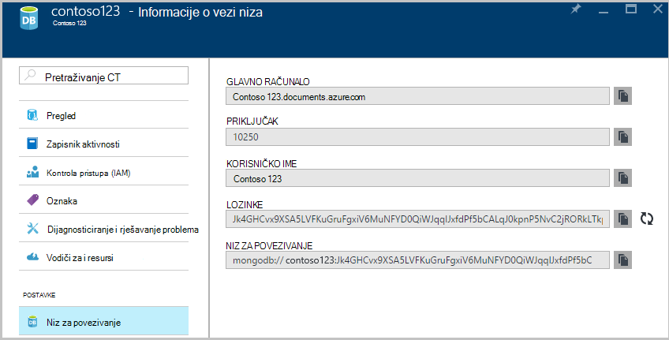

2. Kliknite **Poveži** da biste otvorili Upravitelj veze, a zatim kliknite **Nova veza**

    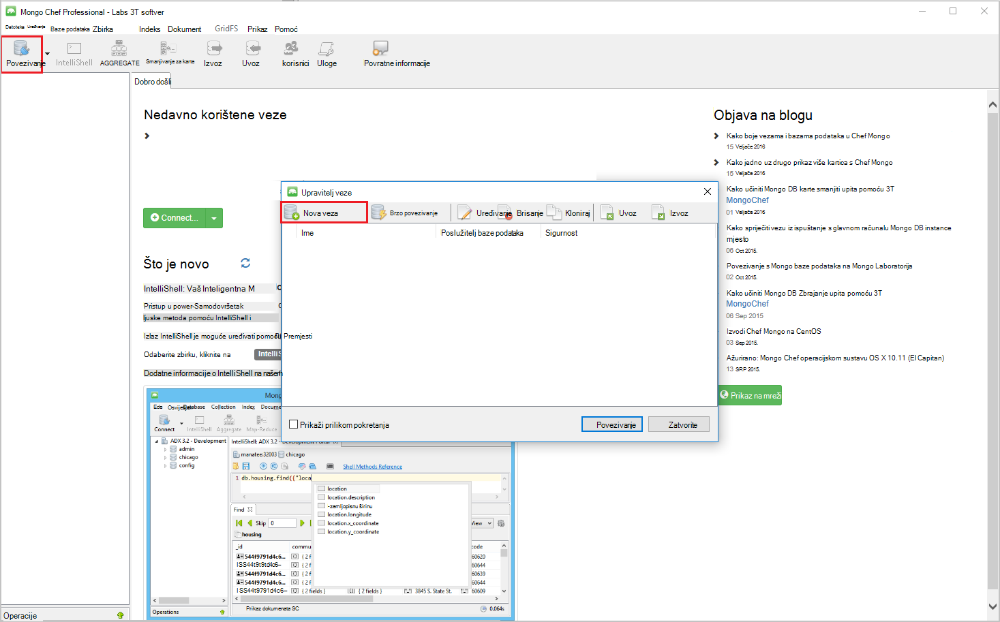
    
2. U prozoru **Nove veze** na kartici **poslužitelj** unesite glavnog računala (FQDN) DocumentDB računa s podrškom za protokol za web-mjesto MongoDB i u okvir za PRIKLJUČAK.
    
    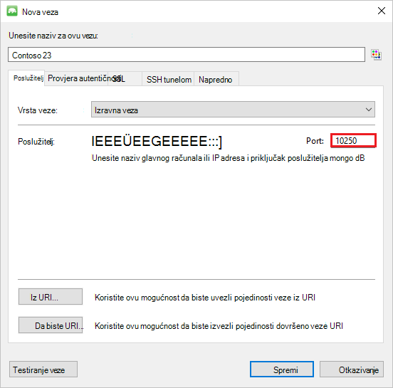

3. U prozoru **Nove veze** na kartici **provjere autentičnosti** odaberite način provjere autentičnosti **Standardno (MONGODB CR ili SCARM-SHA-1)** , a zatim unesite korisničko ime i lozinku.  Prihvatite zadani provjera autentičnosti baze podataka (administratora) ili vlastite vrijednost.

    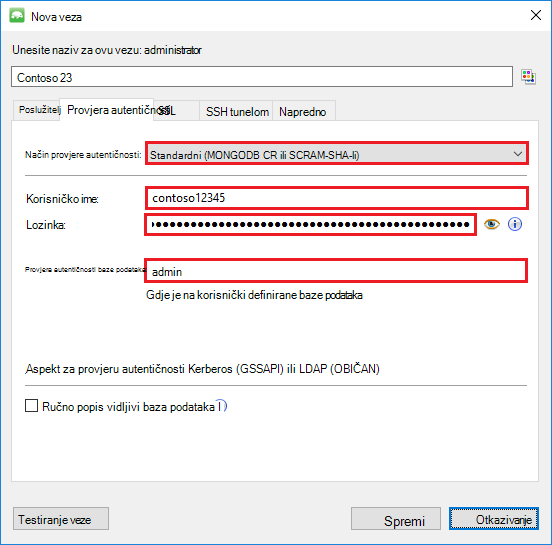

4. U prozoru **Nove veze** na kartici **SSL** potvrdite potvrdni okvir **Koristi SSL protokol za povezivanje** i izborni gumb **Prihvati samopotpisane potvrde SSL** .

    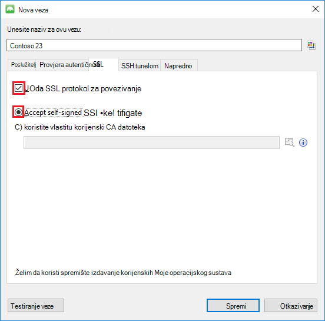

5. Kliknite gumb **Testiraj vezu** da biste podatke o vezi za provjeru valjanosti, kliknite **u redu** da biste se vratili u prozor novu vezu, a zatim **Spremi**.

    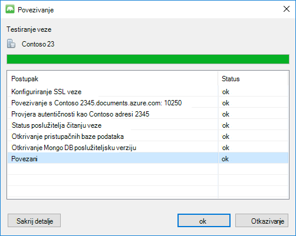

## Stvaranje baze podataka, zbirke i dokumenata pomoću MongoChef  

Prikupljanje i dokumenata pomoću MongoChef, da biste stvorili bazu podataka, izvršite sljedeće korake.

1. U **Upravitelja veze**, istaknite vezu, a zatim kliknite **Poveži**.

    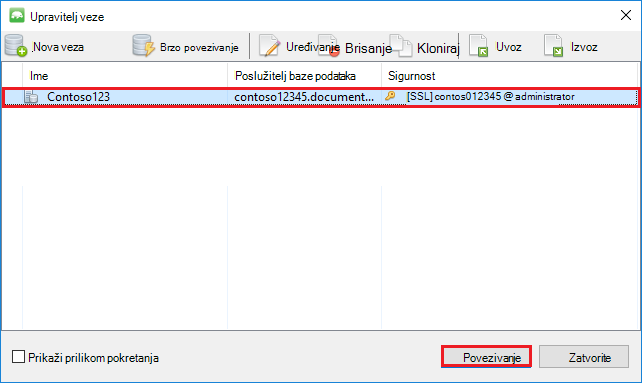

2. Desnom tipkom miša kliknite glavno računalo, a zatim odaberite **Dodaj baze podataka**.  Navedite naziv baze podataka, a zatim kliknite **u redu**.
    
    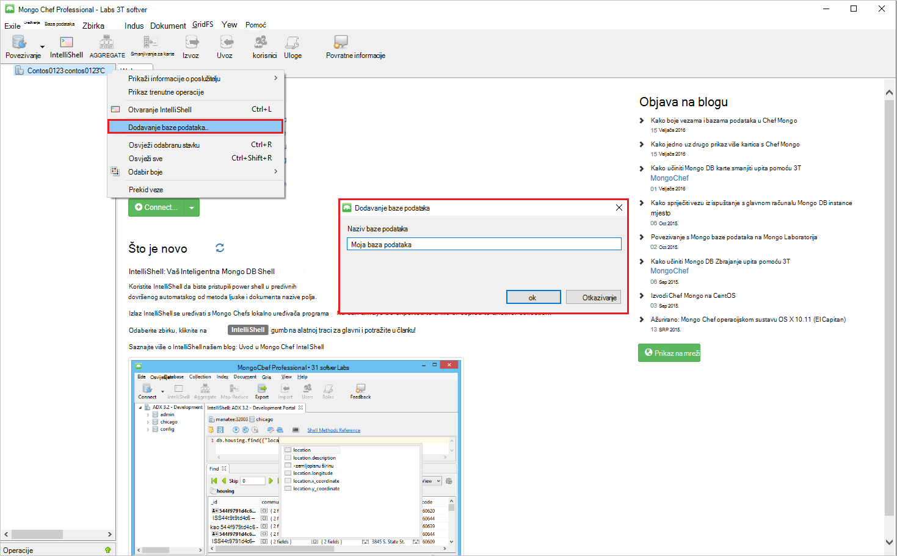

3. Desnom tipkom miša kliknite bazu podataka, a zatim odaberite **Dodaj zbirku**.  Navedite naziv zbirke, a zatim kliknite **Stvori**.

    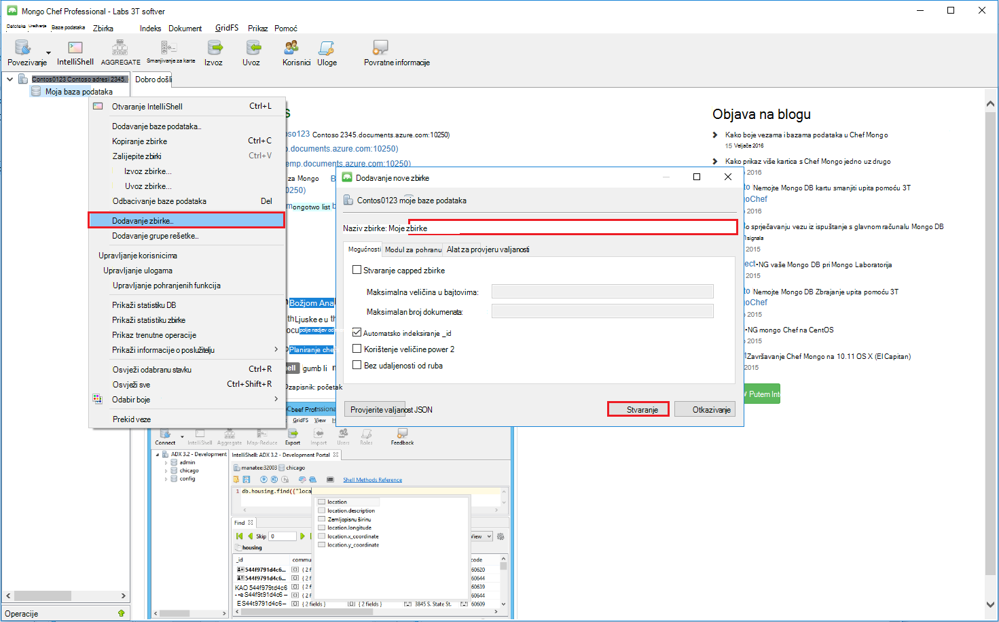

4. Kliknite stavku izbornika **zbirke** , a zatim kliknite **Dodaj dokument**.

    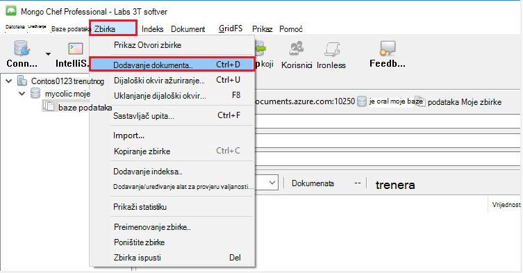

5. U dijaloškom okviru Dodavanje dokumenta zalijepite sljedeće, a zatim kliknite **Dodaj dokument**.

        {
        "_id": "AndersenFamily",
        "lastName": "Andersen",
        "parents": [
            { "firstName": "Thomas" },
            { "firstName": "Mary Kay"}
        ],
        "children": [
        {
            "firstName": "Henriette Thaulow", "gender": "female", "grade": 5,
            "pets": [{ "givenName": "Fluffy" }]
        }
        ],
        "address": { "state": "WA", "county": "King", "city": "seattle" },
        "isRegistered": true
        }

    
6. Dodavanje drugog dokumenta, ovaj put na sljedeće sadržaju.

        {
        "_id": "WakefieldFamily",
        "parents": [
            { "familyName": "Wakefield", "givenName": "Robin" },
            { "familyName": "Miller", "givenName": "Ben" }
        ],
        "children": [
            {
                "familyName": "Merriam", 
                "givenName": "Jesse", 
                "gender": "female", "grade": 1,
                "pets": [
                    { "givenName": "Goofy" },
                    { "givenName": "Shadow" }
                ]
            },
            { 
                "familyName": "Miller", 
                "givenName": "Lisa", 
                "gender": "female", 
                "grade": 8 }
        ],
        "address": { "state": "NY", "county": "Manhattan", "city": "NY" },
        "isRegistered": false
        }

7. Izvršavanje upita uzorka. Ako, na primjer, potražite linije ime i Prezime "Andersen" i povratna roditeljima i stanje polja.

    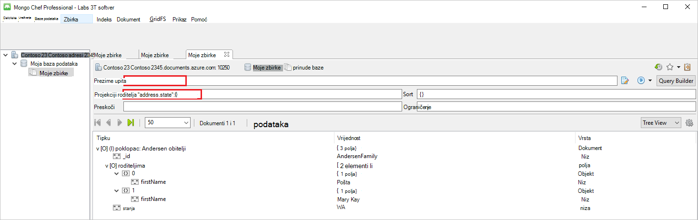
    

## Daljnji koraci

- Istražite DocumentDB s podrškom za protokol za MongoDB [uzorka](documentdb-mongodb-samples.md).

 
