<properties
    pageTitle="Praćenje DocumentDB zahtjeve i pohranu | Microsoft Azure"
    description="Saznajte kako praćenje računa DocumentDB metrika performanse, kao što su zahtjeve i pogreške na poslužitelju i korištenje metrika, kao što su potrošnje prostora za pohranu."
    services="documentdb"
    documentationCenter=""
    authors="mimig1"
    manager="jhubbard"
    editor="cgronlun"/>

<tags
    ms.service="documentdb"
    ms.workload="data-services"
    ms.tgt_pltfrm="na"
    ms.devlang="na"
    ms.topic="article"
    ms.date="10/17/2016"
    ms.author="mimig"/>

# Praćenje DocumentDB zahtjeva za korištenje te prostora za pohranu

Možete nadzirati računa Azure DocumentDB [Azure portal](https://portal.azure.com/). Za svaki račun DocumentDB dostupni su oba metrika performanse, kao što su zahtjeve i pogreške na poslužitelju i korištenje metrika, kao što su potrošnje prostora za pohranu.

Metriku mogu pregledavati na plohu računa ili novi plohu metriku.

## Prikaz performanse metriku na plohu mjerenja

1. U novom prozoru, otvorite [portal za Azure](https://portal.azure.com/), kliknite **Više usluge**, kliknite **DocumentDB (NoSQL)**, a zatim naziv računa DocumentDB za koji želite da biste pogledali metriku performansi.
2. Na izborniku resursa kliknite **metriku**.

Otvorit će se plohu metriku, a možete odabrati da biste pregledali. Možete pregledati dostupnost, zahtjeve, propusnost i pohranu metrika i usporedite SLA DocumentDB.

## Prikaz performanse metriku na plohu računa
1.  U novom prozoru, otvorite [portal za Azure](https://portal.azure.com/), kliknite **Više usluge**, kliknite **DocumentDB (NoSQL)**, a zatim naziv računa DocumentDB za koji želite da biste pogledali metriku performansi.

2.  Leća za **nadzor** po zadanom prikazuje sljedeće pločice:
    *   Ukupno zahtjeva za trenutni dan.
    *   Prostor za pohranu koriste.

    Ako tablica prikazuje **nema podataka dostupnih** i smatrate da nema podataka u bazi podataka, u odjeljku [Otklanjanje poteškoća](#troubleshooting) .

    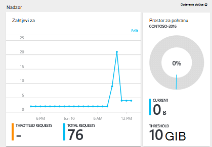

3.  Klikom na **zahtjeve** ili **prostora za pohranu** pločica otvara se detaljne plohu **metriku** .
4.  Plohu **metriku** prikazuje detalje o metrike koju ste odabrali.  Pri vrhu na plohu je grafikon zahtjeva za zaračunava ucrtavaju u grafikon, a ispod koje je tablica koja prikazuje Zbrajanje vrijednosti ograničeni i ukupnog zbroja zahtjeva za.  Metričkim plohu i prikazuje popis upozorenja koji su definirani, filtrirano metrike koji se prikazuju na trenutni metričkim plohu (na taj način, ako je broj upozorenja, vidjet ćete samo relevantnih one navedene u nastavku).   

    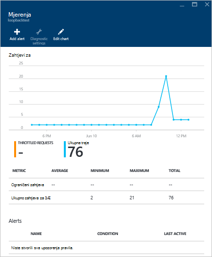

## Prilagodba prikaza mjerenja performansi na portalu

1.  Da biste prilagodili metrike koje se prikazuju na određeni grafikonu, kliknite grafikon da biste ga otvorili u plohu **metrika** , a zatim **Uređivanje grafikona**.  
    

2.  Na plohu **Uređivanje grafikona** postoji mogućnost da biste izmijenili metrike koje se prikazuju u grafikon, kao i njihovih vremenskog razdoblja.  
    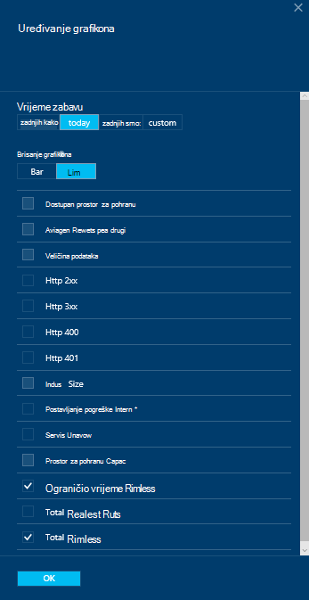

3.  Da biste promijenili metriku u dijelu, jednostavno odaberite ili poništite metriku dostupna performanse i pa kliknite **u redu** pri dnu zaslona u plohu.  
4.  Da biste promijenili vremenski raspon, odaberite neki drugi raspon (na primjer, **Prilagođeno**), a zatim **u redu** pri dnu zaslona u plohu.  

    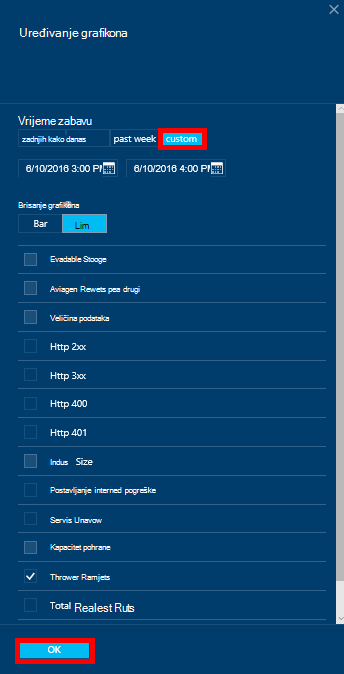

## Stvaranje grafikona tako da usporednu na portalu
Portal za Azure omogućuje stvaranje-usporednu metričkim grafikona.  

1.  Prvo, desnom tipkom miša kliknite grafikon koji želite kopirati, a zatim odaberite **Prilagodba**.

    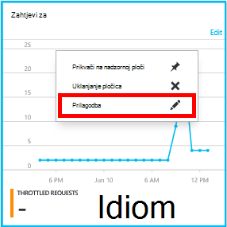

2.  Na izborniku za kopiranje dijela, a zatim kliknite **gotovo Prilagodba**kliknite **Kloniraj** .

    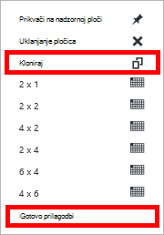  

Koje možda sada Smatraj taj dio bilo koji drugi metričkim dio, Prilagodba raspon metriku i vremena u dijelu.  Taj način, vidjet ćete dvije različite metriku grafikona tako da usporednu u isto vrijeme.  
    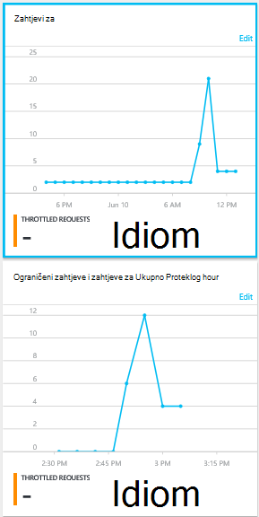  

## Postavljanje upozorenja na portalu
1.  [Portal za Azure](https://portal.azure.com/)kliknite **Više usluge**, kliknite **DocumentDB (NoSQL)**, a zatim naziv računa DocumentDB za koju želite performanse metričkim upozorenja za postavljanje.

2.  Na izborniku resursa kliknite **Pravila za upozorenja** da biste otvorili plohu upozorenja pravila.  
    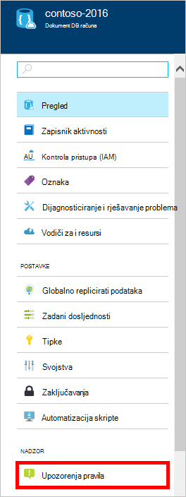

3.  U plohu **upozorenja pravila** kliknite **Dodaj upozorenje**.  
    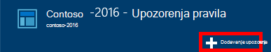

4.  **Dodajte pravilo upozorenja** plohu odredite:
    *   Naziv upozorenja pravilo koje postavljate.
    *   Opis novo pravilo upozorenja.
    *   Metriku upozorenja pravila.
    *   U uvjet, Prag i razdoblje koje određuju kada se aktivira upozorenje. Ako, na primjer, pogreška poslužitelja Brojanje veći od 5 putem posljednjih 15 minuta.
    *   Je li administrator servisa i coadministrators su je slali kada aktivira se upozorenje.
    *   Dodatne adrese za upozorenja.  
    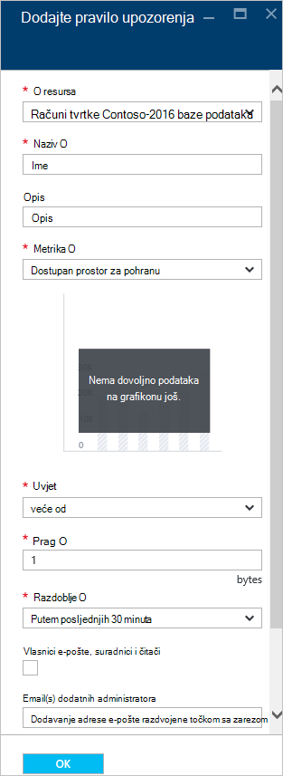

## Praćenje DocumentDB programatically
Račun razine metriku dostupni na portalu, kao što je račun za korištenje i ukupni zbroj zahtjeva za pohranu, nisu dostupne putem DocumentDB API-ji. Međutim, možete dohvatiti podatke o korištenju na razini zbirke pomoću DocumentDB API-ji. Da biste dohvatili zbirke razina podataka, učinite sljedeće:

- Da biste koristili REST API-JA, [izvođenje GET u zbirci](https://msdn.microsoft.com/library/mt489073.aspx). Informacije o kvota i način korištenja za zbirku vraćaju se u zaglavljima x-ms--kvota resursa i x-ms-– korištenje resursa u odgovoru.
- Da biste koristili .NET SDK, pomoću metode [DocumentClient.ReadDocumentCollectionAsync](https://msdn.microsoft.com/library/microsoft.azure.documents.client.documentclient.readdocumentcollectionasync.aspx) koja vraća [ResourceResponse](https://msdn.microsoft.com/library/dn799209.aspx) koja sadrži broj korištenje svojstva kao što su **CollectionSizeUsage** **DatabaseUsage**, **DocumentUsage**, itd.

Da biste pristupili dodatnim metriku, koristite [Azure Monitor SDK](https://www.nuget.org/packages/Microsoft.Azure.Insights). Dostupne metričke definicije mogu biti dohvaćeni tako da nazovete:

    https://management.azure.com/subscriptions/{SubscriptionId}/resourceGroups/{ResourceGroup}/providers/Microsoft.DocumentDb/databaseAccounts/{DocumentDBAccountName}/metricDefinitions?api-version=2015-04-08

Upiti za dohvaćanje pojedinačne metriku koristite sljedeći oblik:

    https://management.azure.com/subscriptions/{SubecriptionId}/resourceGroups/{ResourceGroup}/providers/Microsoft.DocumentDb/databaseAccounts/{DocumentDBAccountName}/metrics?api-version=2015-04-08&$filter=%28name.value%20eq%20%27Total%20Requests%27%29%20and%20timeGrain%20eq%20duration%27PT5M%27%20and%20startTime%20eq%202016-06-03T03%3A26%3A00.0000000Z%20and%20endTime%20eq%202016-06-10T03%3A26%3A00.0000000Z

Dodatne informacije potražite u članku [Dohvaćanje metriku resursa putem Azure Monitor REST API -JA](https://blogs.msdn.microsoft.com/cloud_solution_architect/2016/02/23/retrieving-resource-metrics-via-the-azure-insights-api/). Imajte na umu da je preimenovana "Azure Inights" "Azure Monitor".  Ovaj članak na blogu kojim se odnosi na naziv starije.

## Otklanjanje poteškoća
Ako nadzora pločica porukom **nema podataka dostupnih** i nedavno unijeli zahtjeve ili dodali podatke u bazu podataka, možete urediti pločicu u skladu s vizualnim nedavne korištenje.

### Uređivanje pločice da biste osvježili trenutnim podacima
1.  Da biste prilagodili metrike koje se prikazuju u određenog dijela, kliknite grafikon da biste otvorili plohu **metrika** , a zatim **Uređivanje grafikona**.  
    

2.  Na plohu **Uređivanje grafikona** , u odjeljku **Vremenski raspon** kliknite **prošle sat**, a zatim **u redu**.  
    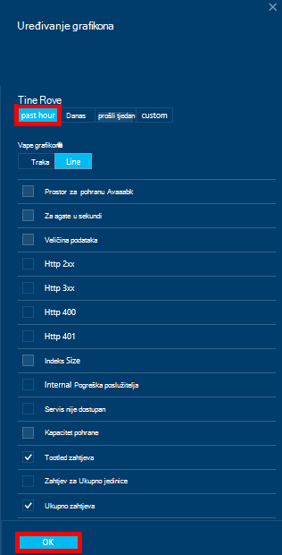

3.  Pločicu sada trebali biste osvježiti prikazanim trenutnim podacima i korištenje.  
    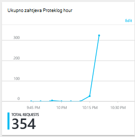

## Daljnji koraci
Da biste saznali više o DocumentDB kapacitet, potražite u članku [Upravljanje DocumentDB kapaciteta](documentdb-manage.md).
