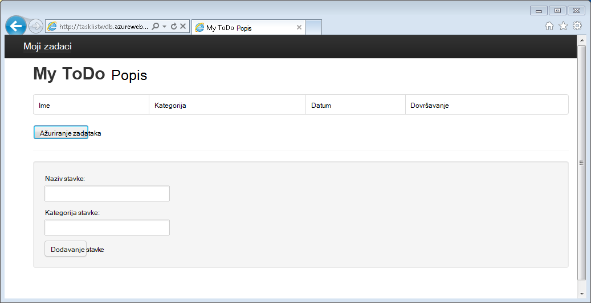
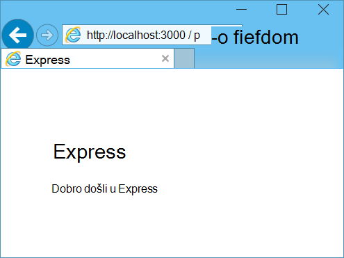
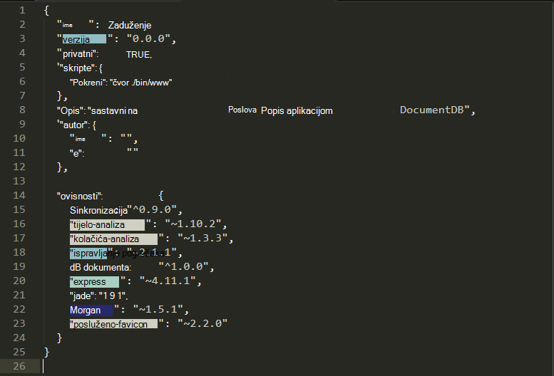
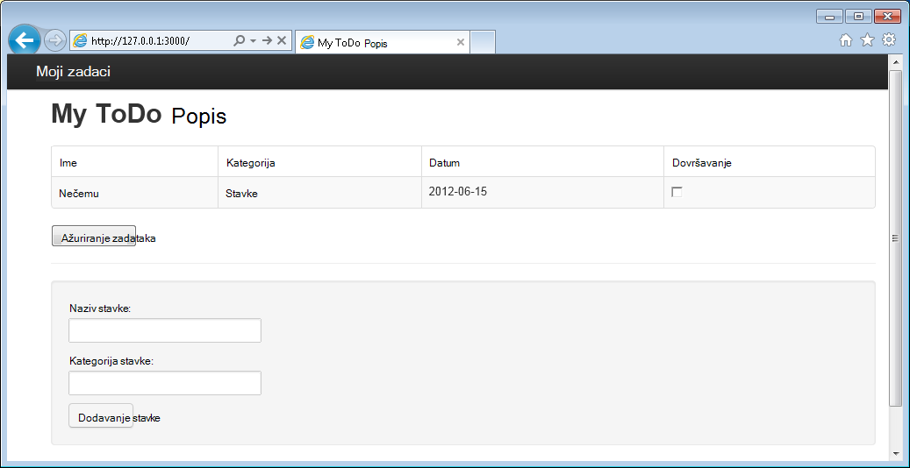

<properties 
    pageTitle="Naučite Node.js – vodič za Node.js DocumentDB | Microsoft Azure" 
    description="Naučite Node.js! Praktični vodič istražuje kako koristiti Microsoft Azure DocumentDB za pohranu i pristup podacima iz web-aplikacije Node.js Express hostirane na Azure web-mjesta." 
    keywords="Razvoj aplikacija, baza podataka ćete praktičnom vodiču dodatne node.js, node.js vodič, documentdb, azure, Microsoft azure"
    services="documentdb" 
    documentationCenter="nodejs" 
    authors="syamkmsft" 
    manager="jhubbard" 
    editor="cgronlun"/>

<tags 
    ms.service="documentdb" 
    ms.workload="data-services" 
    ms.tgt_pltfrm="na" 
    ms.devlang="nodejs" 
    ms.topic="hero-article" 
    ms.date="08/25/2016" 
    ms.author="syamk"/>

# Stvaranje web-aplikacije Node.js pomoću DocumentDB

> [AZURE.SELECTOR]
- [.NET](documentdb-dotnet-application.md)
- [Node.js](documentdb-nodejs-application.md)
- [Java](documentdb-java-application.md)
- [Python](documentdb-python-application.md)

Pomoću ovog praktičnog vodiča Node.js pokazuje kako pomoću servisa Azure DocumentDB za pohranu i podataka programa access iz aplikacije Node.js Express hostirane na Azure web-mjesta.

Preporučujemo da prvi koraci sljedeće videozapisu na kojem ćete naučiti Dodjela računa Azure DocumentDB baze podataka i Pohranjujte dokumente JSON u aplikaciji Node.js. 

> [AZURE.VIDEO azure-demo-getting-started-with-azure-documentdb-on-nodejs-in-linux]

Nakon toga vratiti ovog praktičnog vodiča Node.js gdje ćete Saznajte odgovore na sljedeća pitanja:

- Kako raditi DocumentDB npm modul documentdb?
- Kako implementirati web-aplikaciju za web-mjesta Azure?

Slijedeći ovog praktičnog vodiča baze podataka će izrađivati jednostavne utemeljen na web-upravljanje zadacima aplikacije koja omogućuje stvaranje, preuzimanja i dovršavanje zadataka. Zadaci spremit će se kao JSON dokumenata u Azure DocumentDB.

Ne vrijeme da biste dovršili vodič i želite da se potpuno rješenje? Nije problem, gotovi ogledni rješenje možete pristupiti iz [GitHub][].

## Preduvjeti

> [AZURE.TIP] Pomoću ovog praktičnog vodiča Node.js podrazumijeva iskustva prethodnog pomoću Node.js i Azure web-mjesta.

Prije nego što slijedeći upute u ovom članku, potrebno je provjeriti imate li sljedeće:

- Aktivni Azure račun. Ako nemate račun, možete stvoriti besplatnu probnu računa u samo nekoliko minuta. Detalje potražite u članku [Azure besplatnu probnu verziju](https://azure.microsoft.com/pricing/free-trial/).
- [Node.js][] verzija v0.10.29 ili noviji.
- [Generator Express](http://www.expressjs.com/starter/generator.html) (Ovo putem možete instalirati `npm install express-generator -g`)
- [Brojka][].

## Korak 1: Stvaranje računa DocumentDB baze podataka

Započnimo stvaranjem DocumentDB računa. Ako već imate postavljen račun, možete preskočiti [Korak 2: Stvorite novu aplikaciju Node.js](#_Toc395783178).

[AZURE.INCLUDE [documentdb-create-dbaccount](../../includes/documentdb-create-dbaccount.md)]

[AZURE.INCLUDE [documentdb-keys](../../includes/documentdb-keys.md)]

## Korak 2: Naučite kako stvoriti novu aplikaciju Node.js

Sada ćemo Naučite kako stvoriti osnovni pozdrav World Node.js projektu pomoću [Express](http://expressjs.com/) framework.

1. Otvorite svoje omiljene terminal.

2. Koristite eksplicitnih generator da biste generirali nove aplikacije pod nazivom **obveze**.

        express todo

3. Otvaranje nove **obveze** direktorija i instalirajte ovisnosti.

        cd todo
        npm install

4. Pokretanje nove aplikacije.

        npm start

5. Možete učiniti tako da odete vaš preglednik da biste [http://localhost:3000](http://localhost:3000)prikaz nove aplikacije.

    

## Korak 3: Instalacija dodatnih modula

Datoteka **package.json** jedan je od datoteke stvorene u korijenskom direktoriju projekta. Datoteka sadrži popis dodatnih modula koji su potrebni za svoju aplikaciju Node.js. Kasnije, kada implementirali ovu aplikaciju programa Azure web-mjesta, datoteka koristi se za određivanje koji moduli moraju biti instalirani na Azure za podršku aplikacije. I dalje moramo da biste instalirali dva više paketa za ovog praktičnog vodiča.

1. Vratite se u terminal, instalirajte modul **asinkrone** putem npm.

        npm install async --save

1. Instalirajte modul **documentdb** putem npm. Ovo je modul gdje će se dogoditi sve poseban DocumentDB.

        npm install documentdb --save

3. Brzu provjeru **package.json** datoteke aplikacije treba prikazati dodatne module. Datoteka će se obavještava Azure koje paketa da biste preuzeli i instalirali prilikom pokretanja aplikacije. Ga treba oblik sličan primjeru u nastavku.

    

    Ovo govori čvor (i noviji Azure) aplikacije ovisi te dodatne module.

## Korak 4: Putem servisa DocumentDB u aplikaciji čvor

Koji brine početne instalacije i konfiguracije, sada ćemo get prema dolje da biste Zašto ćemo, a to je neke kod pomoću Azure DocumentDB.

### Stvaranje modela

1. U direktoriju projekta, stvorite novi direktorij pod nazivom **modela**.
2. U imeniku **modela** stvoriti novu datoteku pod nazivom **taskDao.js**. Datoteka će sadržavati model za zadatke koji je stvorila naš aplikacija.
3. U direktoriju isti **modelima** stvorite drugi novu datoteku pod nazivom **docdbUtils.js**. Datoteka će sadržavati neke korisne ponovno iskoristiv, kod koji koristimo cijeloj naš aplikacije. 
4. Kopirajte sljedeći kod u **docdbUtils.js**

        var DocumentDBClient = require('documentdb').DocumentClient;
            
        var DocDBUtils = {
            getOrCreateDatabase: function (client, databaseId, callback) {
                var querySpec = {
                    query: 'SELECT * FROM root r WHERE r.id= @id',
                    parameters: [{
                        name: '@id',
                        value: databaseId
                    }]
                };
        
                client.queryDatabases(querySpec).toArray(function (err, results) {
                    if (err) {
                        callback(err);
        
                    } else {
                        if (results.length === 0) {
                            var databaseSpec = {
                                id: databaseId
                            };
        
                            client.createDatabase(databaseSpec, function (err, created) {
                                callback(null, created);
                            });
        
                        } else {
                            callback(null, results[0]);
                        }
                    }
                });
            },
        
            getOrCreateCollection: function (client, databaseLink, collectionId, callback) {
                var querySpec = {
                    query: 'SELECT * FROM root r WHERE r.id=@id',
                    parameters: [{
                        name: '@id',
                        value: collectionId
                    }]
                };             
                
                client.queryCollections(databaseLink, querySpec).toArray(function (err, results) {
                    if (err) {
                        callback(err);
        
                    } else {        
                        if (results.length === 0) {
                            var collectionSpec = {
                                id: collectionId
                            };
                            
                            client.createCollection(databaseLink, collectionSpec, function (err, created) {
                                callback(null, created);
                            });
        
                        } else {
                            callback(null, results[0]);
                        }
                    }
                });
            }
        };
                
        module.exports = DocDBUtils;

    > [AZURE.TIP] createCollection vodi na neobavezno requestOptions parametar koji se mogu koristiti da biste naveli vrstu ponude za zbirku. Ako se dodjeljuje vrijednost requestOptions.offerType zatim zbirke stvorit će se pomoću zadanih nude vrsta.
    >
    > Dodatne informacije o vrstama nude DocumentDB pogledajte [performanse razina u DocumentDB](documentdb-performance-levels.md) 
        
3. Spremite i zatvorite datoteku **docdbUtils.js** .

4. Na početku datoteke **taskDao.js** , dodajte sljedeći kod referentni **DocumentDBClient** i **docdbUtils.js** koju smo stvorili iznad:

        var DocumentDBClient = require('documentdb').DocumentClient;
        var docdbUtils = require('./docdbUtils');

4. Nakon toga će dodati kod da biste definirali i izvoz objekt zadatka. To je zadužen za pokretanje naš objekt zadatka i postavljanje baze podataka i zbirke dokumenata koristit ćemo.

        function TaskDao(documentDBClient, databaseId, collectionId) {
          this.client = documentDBClient;
          this.databaseId = databaseId;
          this.collectionId = collectionId;
        
          this.database = null;
          this.collection = null;
        }
        
        module.exports = TaskDao;

5. Nakon toga dodati sljedeći kod da biste definirali dodatne načine na objekt zadatka koje omogućuju interakcije s podatke pohranjene u DocumentDB.

        TaskDao.prototype = {
            init: function (callback) {
                var self = this;
        
                docdbUtils.getOrCreateDatabase(self.client, self.databaseId, function (err, db) {
                    if (err) {
                        callback(err);
                    } else {
                        self.database = db;
                        docdbUtils.getOrCreateCollection(self.client, self.database._self, self.collectionId, function (err, coll) {
                            if (err) {
                                callback(err);
        
                            } else {
                                self.collection = coll;
                            }
                        });
                    }
                });
            },
        
            find: function (querySpec, callback) {
                var self = this;
        
                self.client.queryDocuments(self.collection._self, querySpec).toArray(function (err, results) {
                    if (err) {
                        callback(err);
        
                    } else {
                        callback(null, results);
                    }
                });
            },
        
            addItem: function (item, callback) {
                var self = this;
        
                item.date = Date.now();
                item.completed = false;
        
                self.client.createDocument(self.collection._self, item, function (err, doc) {
                    if (err) {
                        callback(err);
        
                    } else {
                        callback(null, doc);
                    }
                });
            },
        
            updateItem: function (itemId, callback) {
                var self = this;
        
                self.getItem(itemId, function (err, doc) {
                    if (err) {
                        callback(err);
        
                    } else {
                        doc.completed = true;
        
                        self.client.replaceDocument(doc._self, doc, function (err, replaced) {
                            if (err) {
                                callback(err);
        
                            } else {
                                callback(null, replaced);
                            }
                        });
                    }
                });
            },
        
            getItem: function (itemId, callback) {
                var self = this;
        
                var querySpec = {
                    query: 'SELECT * FROM root r WHERE r.id = @id',
                    parameters: [{
                        name: '@id',
                        value: itemId
                    }]
                };
        
                self.client.queryDocuments(self.collection._self, querySpec).toArray(function (err, results) {
                    if (err) {
                        callback(err);
        
                    } else {
                        callback(null, results[0]);
                    }
                });
            }
        };

6. Spremite i zatvorite datoteku **taskDao.js** . 

### Stvaranje kontrolerom

1. U direktoriju **usmjerava** projekta, stvorite novu datoteku pod nazivom **tasklist.js**. 
2. Dodajte sljedeći kod **tasklist.js**. To se učitava module DocumentDBClient i asinkrone, koji se koriste u **tasklist.js**. To definirano i **TaskList** funkciju, koja se prenosi instancu objekta **zadatka** definirali ranije:

        var DocumentDBClient = require('documentdb').DocumentClient;
        var async = require('async');
        
        function TaskList(taskDao) {
          this.taskDao = taskDao;
        }
        
        module.exports = TaskList;

3. Nastavite dodavati datoteku **tasklist.js** dodavanjem metode **showTasks, addTask**i **completeTasks**:
        
        TaskList.prototype = {
            showTasks: function (req, res) {
                var self = this;
        
                var querySpec = {
                    query: 'SELECT * FROM root r WHERE r.completed=@completed',
                    parameters: [{
                        name: '@completed',
                        value: false
                    }]
                };
        
                self.taskDao.find(querySpec, function (err, items) {
                    if (err) {
                        throw (err);
                    }
        
                    res.render('index', {
                        title: 'My ToDo List ',
                        tasks: items
                    });
                });
            },
        
            addTask: function (req, res) {
                var self = this;
                var item = req.body;
        
                self.taskDao.addItem(item, function (err) {
                    if (err) {
                        throw (err);
                    }
        
                    res.redirect('/');
                });
            },
        
            completeTask: function (req, res) {
                var self = this;
                var completedTasks = Object.keys(req.body);
        
                async.forEach(completedTasks, function taskIterator(completedTask, callback) {
                    self.taskDao.updateItem(completedTask, function (err) {
                        if (err) {
                            callback(err);
                        } else {
                            callback(null);
                        }
                    });
                }, function goHome(err) {
                    if (err) {
                        throw err;
                    } else {
                        res.redirect('/');
                    }
                });
            }
        };

4. Spremite i zatvorite datoteku **tasklist.js** .
 
### Dodavanje config.js

1. U direktoriju projekta stvorite novu datoteku pod nazivom **config.js**.
2. Dodajte sljedeće **config.js**. Ovim se definira konfiguracijske postavke i vrijednosti koja su potrebna za naše aplikacije.

        var config = {}
        
        config.host = process.env.HOST || "[the URI value from the DocumentDB Keys blade on http://portal.azure.com]";
        config.authKey = process.env.AUTH_KEY || "[the PRIMARY KEY value from the DocumentDB Keys blade on http://portal.azure.com]";
        config.databaseId = "ToDoList";
        config.collectionId = "Items";
        
        module.exports = config;

3. U datoteci **config.js** ažuriranje vrijednosti glavnog računala i AUTH_KEY pomoću vrijednosti nalaze u plohu tipke DocumentDB računa za [Microsoft Azure Portal](https://portal.azure.com):

4. Spremite i zatvorite datoteku **config.js** .
 
### Izmjena app.js

1. U direktoriju projekt otvorite datoteku **app.js** . Datoteka je stvorena ranije prilikom stvaranja web-aplikacije Express.
2. Dodavanje koda za sljedeće na vrh **app.js**
    
        var DocumentDBClient = require('documentdb').DocumentClient;
        var config = require('./config');
        var TaskList = require('./routes/tasklist');
        var TaskDao = require('./models/taskDao');

3. Kod definira konfiguracijska datoteka će se koristiti i nastavlja se čitati vrijednosti iz ove datoteke u nekim varijablama koristit ćemo uskoro.
4. Zamijenite sljedeća dva retka u datoteci **app.js** :

        app.use('/', routes);
        app.use('/users', users); 

      pomoću sljedećih isječak:

        var docDbClient = new DocumentDBClient(config.host, {
            masterKey: config.authKey
        });
        var taskDao = new TaskDao(docDbClient, config.databaseId, config.collectionId);
        var taskList = new TaskList(taskDao);
        taskDao.init();
        
        app.get('/', taskList.showTasks.bind(taskList));
        app.post('/addtask', taskList.addTask.bind(taskList));
        app.post('/completetask', taskList.completeTask.bind(taskList));
        app.set('view engine', 'jade');

6. Te retke definiranje nove instance naše **TaskDao** objekta, s novu vezu DocumentDB (pomoću vrijednosti čitanja **config.js**), pokretanje zadatka objekt, a zatim povežite akcije obrasca načinima na našem **TaskList** kontroleru. 

7. Na kraju, spremite i zatvorite datoteku **app.js** , ne možemo gotovo gotovo.
 
## Korak 5: Stvaranje korisničkog sučelja

Sada ćemo uključivanje pozornost za stvaranje korisničkog sučelja da korisnik zapravo omogućuje interakciju s oglednim aplikacije. Aplikacija Express koju smo stvorili **Jade** koristi kao modul prikaz. Dodatne informacije o Jade pogledajte [http://jade-lang.com/](http://jade-lang.com/).

1. Datoteka **layout.jade** u direktoriju **Prikazi** se koristi kao globalni predložak za ostale datoteke **.jade** . U ovom ćete koraku će se promijeniti je za korištenje [Na Twitteru samopokretanja programa](https://github.com/twbs/bootstrap)koji je alata koji olakšava dizajniranje bolje izgleda web-mjesta. 
2. Otvaranje datoteke **layout.jade** nalazi u mapi **prikaza** i sadržaj zamijenite sljedećeg:
    
        doctype html
        html
          head
            title= title
            link(rel='stylesheet', href='//ajax.aspnetcdn.com/ajax/bootstrap/3.3.2/css/bootstrap.min.css')
            link(rel='stylesheet', href='/stylesheets/style.css')
          body
            nav.navbar.navbar-inverse.navbar-fixed-top
              div.navbar-header
                a.navbar-brand(href='#') My Tasks
            block content
            script(src='//ajax.aspnetcdn.com/ajax/jQuery/jquery-1.11.2.min.js')
            script(src='//ajax.aspnetcdn.com/ajax/bootstrap/3.3.2/bootstrap.min.js')

    To učinkovito govori o **Jade** modul za prikazivanje neke HTML za naše aplikaciju i stvara **bloka** naziva **sadržaja** koju smo je možete navesti raspored naše stranice sadržaja.
    Spremite i zatvorite datoteku **layout.jade** .

4. Sada otvorite datoteku **index.jade** , prikaz koji će se koristiti naše aplikacija i zamijenite sadržaj datoteke sljedeće:

        extends layout
        
        block content
          h1 #{title}
          br
        
          form(action="/completetask", method="post")
            table.table.table-striped.table-bordered
              tr
                td Name
                td Category
                td Date
                td Complete
              if (typeof tasks === "undefined")
                tr
                  td
              else
                each task in tasks
                  tr
                    td #{task.name}
                    td #{task.category}
                    - var date  = new Date(task.date);
                    - var day   = date.getDate();
                    - var month = date.getMonth() + 1;
                    - var year  = date.getFullYear();
                    td #{month + "/" + day + "/" + year}
                    td
                      input(type="checkbox", name="#{task.id}", value="#{!task.completed}", checked=task.completed)
            button.btn(type="submit") Update tasks
          hr
          form.well(action="/addtask", method="post")
            label Item Name:
            input(name="name", type="textbox")
            label Item Category:
            input(name="category", type="textbox")
            br
            button.btn(type="submit") Add item

    Proširuje izgleda i daje sadržaj za rezervirano mjesto za **sadržaj** smo vidjeli u datoteci **layout.jade** ranije.
    
    U ovom rasporedu koju smo stvorili dva HTML obrazaca. 
    Prvi obrazac sadrži tablicu za podatke i gumb koji omogućuje nam da biste ažurirali stavke njihovom objavom **/completetask** način naš kontrolera.
    Drugi obrazac sadrži dva polja za unos i gumb koji omogućuje nam da biste stvorili novu stavku njihovom objavom **/addtask** način naš kontrolera.
    
    Trebali biste sve što je potrebna za naše aplikaciju koja će raditi.

5. Otvorite datoteku **style.css** u direktoriju **public\stylesheets** i zamijeniti kod sljedeće:

        body {
          padding: 50px;
          font: 14px "Lucida Grande", Helvetica, Arial, sans-serif;
        }
        a {
          color: #00B7FF;
        }
        .well label {
          display: block;
        }
        .well input {
          margin-bottom: 5px;
        }
        .btn {
          margin-top: 5px;
          border: outset 1px #C8C8C8;
        }

    Spremite i zatvorite datoteku **style.css** .

## Korak 6: Pokretanje aplikacije lokalno

1. Da biste testirali aplikacije na lokalnom računalu, pokrenite `npm start` u terminal za pokretanje aplikacije i pokretanje preglednika sa stranicom koji izgleda kao na slici u nastavku:

    

2. Pomoću navedenih polja za stavku, naziv stavke i kategorija da biste unijeli podatke, a zatim kliknite **Dodaj stavku**.

3. Stranice se ažurira u prikaz novostvorenu stavke na popisu obveze.

    

4. Da biste dovršili zadatak, jednostavno potvrdite okvir u stupcu dovršen, a zatim **Ažuriraj zadatke**.

## Korak 7: Implementacija projekta razvoj aplikacija za Azure web-mjesta

1. Ako to već niste učinili, omogućite spremište brojka Azure web-mjesta. Možete pronaći upute o tome kako to učiniti u temi [Lokalne implementacije brojka aplikacije servisa za Azure](../app-service-web/app-service-deploy-local-git.md) .

2. Dodavanje web-mjesta Azure kao na udaljenom brojka.

        git remote add azure https://username@your-azure-website.scm.azurewebsites.net:443/your-azure-website.git

3. Implementacija pritiskom na alat za analizu daljinske.

        git push azure master

4. U nekoliko sekundi, brojka će završiti objavljivanje web-aplikacije i pokretanje preglednika prikazuju se pri ruci rad sa servisu Azure!

## Daljnji koraci

Čestitamo! Samo prvi Node.js Express web-aplikacije pomoću Azure DocumentDB u komponenti i objaviti na web-mjesta Azure.

Izvorni kod za aplikaciju za dovršavanje referenca mogu se preuzeti sa [GitHub][].

Dodatne informacije potražite u [Centru za razvojne inženjere Node.js](https://azure.microsoft.com/develop/nodejs/).

[Node.js]: http://nodejs.org/
[Brojka]: http://git-scm.com/
[Github]: https://github.com/Azure-Samples/documentdb-node-todo-app
 
