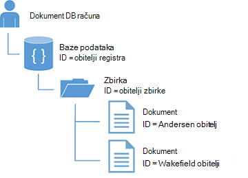
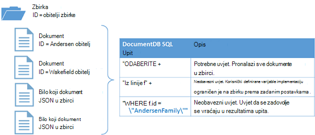

<properties
  pageTitle="Praktični vodič NoSQL Node.js za DocumentDB | Microsoft Azure"
  description="Vodič za NoSQL Node.js koji stvara u čvor baze podataka i konzole aplikacije pomoću DocumentDB Node.js SDK. DocumentDB je NoSQL baze podataka za JSON."
    keywords="Node.js ćete praktičnom vodiču čvor baze podataka"
  services="documentdb"
  documentationCenter="node.js"
  authors="AndrewHoh"
  manager="jhubbard"
  editor="monicar"/>

<tags
  ms.service="documentdb"
  ms.workload="data-services"
  ms.tgt_pltfrm="na"
  ms.devlang="node"
  ms.topic="hero-article"
  ms.date="08/11/2016"
  ms.author="anhoh"/>

# <a name="nosql-nodejs-tutorial-documentdb-nodejs-console-application"></a>Praktični vodič NoSQL Node.js: DocumentDB Node.js konzole za aplikaciju  

> [AZURE.SELECTOR]
- [.NET](documentdb-get-started.md)
- [Node.js](documentdb-nodejs-get-started.md)

Dobro došli u Node.js vodič za Node.js SDK za Azure DocumentDB! Nakon ovog praktičnog vodiča, imat ćete aplikacije konzole za stvara i upiti DocumentDB resursa, uključujući čvor baze podataka.

Ćemo objasniti:

- Stvaranje i veze s računom DocumentDB
- Postavljanje aplikacije
- Stvaranje baze podataka čvor
- Stvaranje zbirke
- Stvaranje JSON dokumenata
- Slanje upita za zbirku
- Zamjena dokumenta
- Brisanje dokumenta
- Brisanje baze podataka čvor

Nemate vremena? ne brini! Potpuno rješenje dostupna je na [GitHub](https://github.com/Azure-Samples/documentdb-node-getting-started). Potražite u članku [se potpuno rješenje](#GetSolution) za brzi upute.

Kada dovršite Node.js vodič, koristite gumbe za glasovanje na vrhu i dnu ove stranice da biste nam poslali povratne informacije. Želite li nam da biste izravno obratiti, slobodno da biste dodali adrese e-pošte u svoje komentare.

Sada krenimo!

## <a name="prerequisites-for-the-nodejs-tutorial"></a>Preduvjeti za vodič Node.js

Provjerite sljedeće:

- Aktivni Azure račun. Ako ga nemate, možete se prijaviti za [Besplatnu probnu verziju Azure](https://azure.microsoft.com/pricing/free-trial/).
- [Node.js](https://nodejs.org/) verzija v0.10.29 ili noviji.

## <a name="step-1-create-a-documentdb-account"></a>Korak 1: Stvaranje DocumentDB računa

Stvaranje DocumentDB računa. Ako već imate račun koji želite koristiti, možete preskočiti unaprijed za [Postavljanje aplikacija Node.js](#SetupNode).

[AZURE.INCLUDE [documentdb-create-dbaccount](../../includes/documentdb-create-dbaccount.md)]

## <a id="SetupNode"></a>Korak 2: Postavite Node.js aplikacije

1. Otvorite svoje omiljene terminal.
2. Pronađite mapu ili imenika gdje želite spremiti Node.js aplikacije.
3. Stvorite dva prazan JavaScript datoteke pomoću sljedeće naredbe:
  - Windows:
      * ```fsutil file createnew app.js 0```
        * ```fsutil file createnew config.js 0```
  - Linux/OS X:
      * ```touch app.js```
        * ```touch config.js```
4. Instalirajte modul documentdb putem npm. Koristite sljedeću naredbu:
    * ```npm install documentdb --save```

Sjajan! Sad kad ste završili s postavljanjem, Započnimo pisanja neke koda.

## <a id="Config"></a>Korak 3: Postavljanje konfiguracije pokrenite aplikaciju

Otvaranje ```config.js``` u uređivaču omiljene tekst.

Zatim, Kopiraj i Zalijepi isječak koda ispod i postaviti svojstva ```config.endpoint``` i ```config.primaryKey``` DocumentDB krajnjoj točki uri i primarni ključ. Obje ove konfiguracije pronaći ćete na [Portal za Azure](https://portal.azure.com).

![Praktični vodič Node.js – snimka zaslona s portala Azure prikazuje računom DocumentDB s središtu AKTIVNI istaknuta, gumb tipke istaknuta na račun plohu DocumentDB i vrijednosti URI, PRIMARNI KLJUČ i SEKUNDARNE KLJUČ istaknuta na tipke plohu - čvor baze podataka][keys]

    // ADD THIS PART TO YOUR CODE
    var config = {}

    config.endpoint = "~your DocumentDB endpoint uri here~";
    config.primaryKey = "~your primary key here~";

Kopiranje i lijepljenje u ```database id```, ```collection id```, i ```JSON documents``` za vaše ```config``` objekt ispod koju postavljate vaše ```config.endpoint``` i ```config.authKey``` svojstva. Ako već imate podatke koje želite pohraniti u bazi podataka, možete koristiti DocumentDB, [alata za migraciju podataka](documentdb-import-data.md) umjesto dodavanja definicije dokumenta.

    config.endpoint = "~your DocumentDB endpoint uri here~";
    config.primaryKey = "~your primary key here~";

    // ADD THIS PART TO YOUR CODE
    config.database = {
        "id": "FamilyDB"
    };

    config.collection = {
        "id": "FamilyColl"
    };

    config.documents = {
        "Andersen": {
            "id": "Anderson.1",
            "lastName": "Andersen",
            "parents": [{
                "firstName": "Thomas"
            }, {
                    "firstName": "Mary Kay"
                }],
            "children": [{
                "firstName": "Henriette Thaulow",
                "gender": "female",
                "grade": 5,
                "pets": [{
                    "givenName": "Fluffy"
                }]
            }],
            "address": {
                "state": "WA",
                "county": "King",
                "city": "Seattle"
            }
        },
        "Wakefield": {
            "id": "Wakefield.7",
            "parents": [{
                "familyName": "Wakefield",
                "firstName": "Robin"
            }, {
                    "familyName": "Miller",
                    "firstName": "Ben"
                }],
            "children": [{
                "familyName": "Merriam",
                "firstName": "Jesse",
                "gender": "female",
                "grade": 8,
                "pets": [{
                    "givenName": "Goofy"
                }, {
                        "givenName": "Shadow"
                    }]
            }, {
                    "familyName": "Miller",
                    "firstName": "Lisa",
                    "gender": "female",
                    "grade": 1
                }],
            "address": {
                "state": "NY",
                "county": "Manhattan",
                "city": "NY"
            },
            "isRegistered": false
        }
    };


Baze podataka, zbirke i definicije dokument će služiti kao vaše DocumentDB ```database id```, ```collection id```, i podataka iz dokumenata.

Na kraju, izvoz vaše ```config``` objekt tako da ga unutar možete referencirati na ```app.js``` datoteku.

            },
            "isRegistered": false
        }
    };

    // ADD THIS PART TO YOUR CODE
    module.exports = config;

##<a id="Connect"></a>Korak 4: Povezivanje s računom DocumentDB

Otvorite svoje isprazni ```app.js``` datoteku u uređivaču teksta. Kopirajte i zalijepite kod u nastavku da biste uvezli u ```documentdb``` modul i vaše novostvorenu ```config``` modul.

    // ADD THIS PART TO YOUR CODE
    "use strict";

    var documentClient = require("documentdb").DocumentClient;
    var config = require("./config");
    var url = require('url');

Kopirajte i zalijepite kod za korištenje prethodno spremljene ```config.endpoint``` i ```config.primaryKey``` da biste stvorili novi DocumentClient.

    var config = require("./config");
    var url = require('url');

    // ADD THIS PART TO YOUR CODE
    var client = new documentClient(config.endpoint, { "masterKey": config.primaryKey });

Sad kad ste kod za inicijalizaciju documentdb klijent, pogledajmo u rad s resursima DocumentDB.

## <a name="step-5-create-a-node-database"></a>Korak 5: Stvaranje čvor baze podataka
Kopirajte i zalijepite kod u nastavku da biste postavili HTTP status nije pronađen, url baze podataka i url zbirke. URL-ove su pronalaženje klijent DocumentDB prikupljanje i desno baze podataka.

    var client = new documentClient(config.endpoint, { "masterKey": config.primaryKey });

    // ADD THIS PART TO YOUR CODE
    var HttpStatusCodes = { NOTFOUND: 404 };
    var databaseUrl = `dbs/${config.database.id}`;
    var collectionUrl = `${databaseUrl}/colls/${config.collection.id}`;

Pomoću funkcije [createDatabase](https://azure.github.io/azure-documentdb-node/DocumentClient.html) klase **DocumentClient** moguće je stvoriti bazom [baze podataka](documentdb-resources.md#databases) . Baza podataka nije logičke spremnik za pohranu dokumenata particije u zbirkama.

Kopiranje i lijepljenje funkciju **getDatabase** za stvaranje nove baze podataka u datoteku app.js u ```id``` navedeno u na ```config``` objekt. Funkcija će provjeriti ako bazu podataka s istim ```FamilyRegistry``` id još ne postoji. Ako postoje, ne možemo će vratiti tu bazu podataka umjesto stvaranja novog.

    var collectionUrl = `${databaseUrl}/colls/${config.collection.id}`;

    // ADD THIS PART TO YOUR CODE
    function getDatabase() {
        console.log(`Getting database:\n${config.database.id}\n`);

        return new Promise((resolve, reject) => {
            client.readDatabase(databaseUrl, (err, result) => {
                if (err) {
                    if (err.code == HttpStatusCodes.NOTFOUND) {
                        client.createDatabase(config.database, (err, created) => {
                            if (err) reject(err)
                            else resolve(created);
                        });
                    } else {
                        reject(err);
                    }
                } else {
                    resolve(result);
                }
            });
        });
    }

Kopirajte i zalijepite kod ispod koju postavljate funkciju **getDatabase** da biste dodali Pomoćnik za funkciju **Izlaz** koji će se ispisati poruku Izlaz i poziv funkciji **getDatabase** .

                } else {
                    resolve(result);
                }
            });
        });
    }

    // ADD THIS PART TO YOUR CODE
    function exit(message) {
        console.log(message);
        console.log('Press any key to exit');
        process.stdin.setRawMode(true);
        process.stdin.resume();
        process.stdin.on('data', process.exit.bind(process, 0));
    }

    getDatabase()
    .then(() => { exit(`Completed successfully`); })
    .catch((error) => { exit(`Completed with error ${JSON.stringify(error)}`) });

U terminal, pronađite vaše ```app.js``` datoteku i pokrenite naredbu:```node app.js```

Čestitamo! Stvorili ste uspješno DocumentDB baze podataka.

##<a id="CreateColl"></a>Korak 6: Stvaranje zbirke  

> [AZURE.WARNING] **CreateDocumentCollectionAsync** će stvoriti novu zbirku koja ima cijene posljedice. Dodatne informacije, posjetite naš [cijene stranice](https://azure.microsoft.com/pricing/details/documentdb/).

[Zbirka](documentdb-resources.md#collections) moguće je i pomoću funkcije [createCollection](https://azure.github.io/azure-documentdb-node/DocumentClient.html) klase **DocumentClient** . Zbirka je spremnik JSON dokumenata i pridruženi logike aplikacije JavaScript.

Kopiranje i lijepljenje funkciju **getCollection** ispod funkciju **getDatabase** za stvaranje nove zbirke s na ```id``` navedeno u na ```config``` objekt. Ponovno ne možemo ćete provjerite zbirke s istim ```FamilyCollection``` id još ne postoji. Ako postoje, ne možemo će vratiti tu zbirku umjesto stvaranja novog.

                } else {
                    resolve(result);
                }
            });
        });
    }

    // ADD THIS PART TO YOUR CODE
    function getCollection() {
        console.log(`Getting collection:\n${config.collection.id}\n`);

        return new Promise((resolve, reject) => {
            client.readCollection(collectionUrl, (err, result) => {
                if (err) {
                    if (err.code == HttpStatusCodes.NOTFOUND) {
                        client.createCollection(databaseUrl, config.collection, { offerThroughput: 400 }, (err, created) => {
                            if (err) reject(err)
                            else resolve(created);
                        });
                    } else {
                        reject(err);
                    }
                } else {
                    resolve(result);
                }
            });
        });
    }

Kopirajte i zalijepite kod ispod poziv **getDatabase** izvršiti funkciju **getCollection** .

    getDatabase()

    // ADD THIS PART TO YOUR CODE
    .then(() => getCollection())
    // ENDS HERE

    .then(() => { exit(`Completed successfully`); })
    .catch((error) => { exit(`Completed with error ${JSON.stringify(error)}`) });

U terminal, pronađite vaše ```app.js``` datoteku i pokrenite naredbu:```node app.js```

Čestitamo! Stvorili ste uspješno DocumentDB zbirke.

##<a id="CreateDoc"></a>Korak 7: Stvaranje dokumenta
Pomoću funkcije [createDocument](https://azure.github.io/azure-documentdb-node/DocumentClient.html) klase **DocumentClient** moguće je stvoriti u [dokument](documentdb-resources.md#documents) . Dokumenti su korisnički definirane (proizvoljne) JSON sadržaj. Sada možete umetnuti u dokument u DocumentDB.

Kopiranje i lijepljenje funkciju **getFamilyDocument** ispod funkciju **getCollection** za stvaranje dokumenata koja sadrži podatke JSON spremljene u na ```config``` objekt. Ponovno ne možemo ćete provjerite dokument s istim ID-om još ne postoji.

                } else {
                    resolve(result);
                }
            });
        });
    }

    // ADD THIS PART TO YOUR CODE
    function getFamilyDocument(document) {
        let documentUrl = `${collectionUrl}/docs/${document.id}`;
        console.log(`Getting document:\n${document.id}\n`);

        return new Promise((resolve, reject) => {
            client.readDocument(documentUrl, { partitionKey: document.district }, (err, result) => {
                if (err) {
                    if (err.code == HttpStatusCodes.NOTFOUND) {
                        client.createDocument(collectionUrl, document, (err, created) => {
                            if (err) reject(err)
                            else resolve(created);
                        });
                    } else {
                        reject(err);
                    }
                } else {
                    resolve(result);
                }
            });
        });
    };

Kopirajte i zalijepite kod ispod poziv **getCollection** izvršiti funkciju **getFamilyDocument** .

    getDatabase()
    .then(() => getCollection())

    // ADD THIS PART TO YOUR CODE
    .then(() => getFamilyDocument(config.documents.Andersen))
    .then(() => getFamilyDocument(config.documents.Wakefield))
    // ENDS HERE

    .then(() => { exit(`Completed successfully`); })
    .catch((error) => { exit(`Completed with error ${JSON.stringify(error)}`) });

U terminal, pronađite vaše ```app.js``` datoteku i pokrenite naredbu:```node app.js```

Čestitamo! Stvorili ste uspješno DocumentDB dokumenata.



##<a id="Query"></a>Korak 8: Resursi za upit DocumentDB

DocumentDB podržava [Obogaćeni upita](documentdb-sql-query.md) odabiranja JSON dokumente pohranjene u svakoj zbirci. Sljedeći primjer kod prikazuje upit koji se može izvoditi na temelju dokumenata u zbirci web.

Kopiranje i lijepljenje funkciju **queryCollection** ispod funkciju **getFamilyDocument** . DocumentDB podržava nalik SQL upita kao što je prikazano u nastavku. Dodatne informacije o izradi složenih upita, pogledajte [Playground upita](https://www.documentdb.com/sql/demo) i [dokumentacije upita](documentdb-sql-query.md).

                } else {
                    resolve(result);
                }
            });
        });
    }

    // ADD THIS PART TO YOUR CODE
    function queryCollection() {
        console.log(`Querying collection through index:\n${config.collection.id}`);

        return new Promise((resolve, reject) => {
            client.queryDocuments(
                collectionUrl,
                'SELECT VALUE r.children FROM root r WHERE r.lastName = "Andersen"'
            ).toArray((err, results) => {
                if (err) reject(err)
                else {
                    for (var queryResult of results) {
                        let resultString = JSON.stringify(queryResult);
                        console.log(`\tQuery returned ${resultString}`);
                    }
                    console.log();
                    resolve(results);
                }
            });
        });
    };


Sljedeći dijagram prikazuje kako DocumentDB SQL sintaksa upita zove protiv zbirke ste stvorili.



Ključna riječ [FROM](documentdb-sql-query.md#from-clause) nisu obavezni u upitu jer DocumentDB upiti već iz djelokruga jednu zbirku. Zbog toga "Iz linije f" može se zamjenjuju s "Iz korijenske sa r" ili bilo koju varijablu ime koje odaberete. DocumentDB će izvesti tu linije, korijenski ili naziv varijable koju ste odabrali, referencu trenutne zbirke prema zadanim postavkama.

Kopirajte i zalijepite kod ispod poziv **getFamilyDocument** izvršiti funkciju **queryCollection** .

    .then(() => getFamilyDocument(config.documents.Andersen))
    .then(() => getFamilyDocument(config.documents.Wakefield))

    // ADD THIS PART TO YOUR CODE
    .then(() => queryCollection())
    // ENDS HERE

    .then(() => { exit(`Completed successfully`); })
    .catch((error) => { exit(`Completed with error ${JSON.stringify(error)}`) });

U terminal, pronađite vaše ```app.js``` datoteku i pokrenite naredbu:```node app.js```

Čestitamo! Uspješno su mu DocumentDB dokumenata.

##<a id="ReplaceDocument"></a>9 korak: Zamjena dokumenta
DocumentDB podržava zamjene JSON dokumenata.

Kopiranje i lijepljenje funkciju **replaceDocument** ispod funkciju **queryCollection** .

                    }
                    console.log();
                    resolve(result);
                }
            });
        });
    }

    // ADD THIS PART TO YOUR CODE
    function replaceFamilyDocument(document) {
        let documentUrl = `${collectionUrl}/docs/${document.id}`;
        console.log(`Replacing document:\n${document.id}\n`);
        document.children[0].grade = 6;

        return new Promise((resolve, reject) => {
            client.replaceDocument(documentUrl, document, (err, result) => {
                if (err) reject(err);
                else {
                    resolve(result);
                }
            });
        });
    };

Kopirajte i zalijepite kod ispod poziv **queryCollection** izvršiti funkciju **replaceDocument** . Osim toga, dodati kod da biste nazvali **queryCollection** ponovno da biste provjerili imali uspješno promijeni u dokument.

    .then(() => getFamilyDocument(config.documents.Andersen))
    .then(() => getFamilyDocument(config.documents.Wakefield))
    .then(() => queryCollection())

    // ADD THIS PART TO YOUR CODE
    .then(() => replaceFamilyDocument(config.documents.Andersen))
    .then(() => queryCollection())
    // ENDS HERE

    .then(() => { exit(`Completed successfully`); })
    .catch((error) => { exit(`Completed with error ${JSON.stringify(error)}`) });

U terminal, pronađite vaše ```app.js``` datoteku i pokrenite naredbu:```node app.js```

Čestitamo! Uspješno zamijenili DocumentDB dokumenta.

##<a id="DeleteDocument"></a>10 korak: Brisanje dokumenta
DocumentDB podržava brisanje JSON dokumente.

Kopiranje i lijepljenje funkciju **deleteDocument** ispod funkciju **replaceDocument** .

                else {
                    resolve(result);
                }
            });
        });
    };

    // ADD THIS PART TO YOUR CODE
    function deleteFamilyDocument(document) {
        let documentUrl = `${collectionUrl}/docs/${document.id}`;
        console.log(`Deleting document:\n${document.id}\n`);

        return new Promise((resolve, reject) => {
            client.deleteDocument(documentUrl, (err, result) => {
                if (err) reject(err);
                else {
                    resolve(result);
                }
            });
        });
    };

Kopirajte i zalijepite kod ispod poziv na drugi **queryCollection** izvršiti funkciju **deleteDocument** .

    .then(() => queryCollection())
    .then(() => replaceFamilyDocument(config.documents.Andersen))
    .then(() => queryCollection())

    // ADD THIS PART TO YOUR CODE
    .then(() => deleteFamilyDocument(config.documents.Andersen))
    // ENDS HERE

    .then(() => { exit(`Completed successfully`); })
    .catch((error) => { exit(`Completed with error ${JSON.stringify(error)}`) });

U terminal, pronađite vaše ```app.js``` datoteku i pokrenite naredbu:```node app.js```

Čestitamo! Uspješno ste izbrisali DocumentDB dokumenta.

##<a id="DeleteDatabase"></a>11 korak: Brisanje čvor baze podataka

Brisanje baze podataka stvorene uklonit će baza podataka i svih podređenih resursa (zbirke dokumenata, i Dr.).

Kopirajte i zalijepite sljedeće koda (funkcija **čišćenja**) da biste uklonili bazu podataka i svih podređenih resursa.

                else {
                    resolve(result);
                }
            });
        });
    };

    // ADD THIS PART TO YOUR CODE
    function cleanup() {
        console.log(`Cleaning up by deleting database ${config.database.id}`);

        return new Promise((resolve, reject) => {
            client.deleteDatabase(databaseUrl, (err) => {
                if (err) reject(err)
                else resolve(null);
            });
        });
    }

Kopirajte i zalijepite kod ispod poziv **deleteDocument** za izvršavanje funkcija **čišćenja** .

    .then(() => deleteFamilyDocument(config.documents.Andersen))

    // ADD THIS PART TO YOUR CODE
    .then(() => cleanup())
    // ENDS HERE

    .then(() => { exit(`Completed successfully`); })
    .catch((error) => { exit(`Completed with error ${JSON.stringify(error)}`) });

##<a id="Run"></a>Korak 12: Pokretanje aplikacije Node.js sve zajedno!

Potpuno, slijed za pozivanje vaše funkcija trebao bi izgledati ovako:

    getDatabase()
    .then(() => getCollection())
    .then(() => getFamilyDocument(config.documents.Andersen))
    .then(() => getFamilyDocument(config.documents.Wakefield))
    .then(() => queryCollection())
    .then(() => replaceFamilyDocument(config.documents.Andersen))
    .then(() => queryCollection())
    .then(() => deleteFamilyDocument(config.documents.Andersen))
    .then(() => cleanup())
    .then(() => { exit(`Completed successfully`); })
    .catch((error) => { exit(`Completed with error ${JSON.stringify(error)}`) });

U terminal, pronađite vaše ```app.js``` datoteku i pokrenite naredbu:```node app.js```

Trebali biste vidjeti Izlaz iz aplikacije početak rada. Izlaz moraju se podudarati primjer teksta.

    Getting database:
    FamilyDB

    Getting collection:
    FamilyColl

    Getting document:
    Anderson.1

    Getting document:
    Wakefield.7

    Querying collection through index:
    FamilyColl
        Query returned [{"firstName":"Henriette Thaulow","gender":"female","grade":5,"pets":[{"givenName":"Fluffy"}]}]

    Replacing document:
    Anderson.1

    Querying collection through index:
    FamilyColl
        Query returned [{"firstName":"Henriette Thaulow","gender":"female","grade":6,"pets":[{"givenName":"Fluffy"}]}]

    Deleting document:
    Anderson.1

    Cleaning up by deleting database FamilyDB
    Completed successfully
    Press any key to exit

Čestitamo! Koje ste stvorili obavljenog Node.js vodič, a imate aplikacija prvog DocumentDB konzole!

## <a id="GetSolution"></a>Početak potpuno rješenje vodiča Node.js
Da biste sastavili GetStarted rješenja koja sadrži sve uzorke u ovom članku, morate sljedeće:

-   [Račun DocumentDB][documentdb-create-account].
-   [GetStarted](https://github.com/Azure-Samples/documentdb-node-getting-started) rješenje dostupna na GitHub.

Instalirajte modul **documentdb** putem npm. Koristite sljedeću naredbu:
* ```npm install documentdb --save```

Sljedeći u na ```config.js``` datoteka, ažurirajte config.endpoint i config.authKey vrijednosti, kao što je opisano u [korak 3: postavljanje konfiguracije pokrenite aplikaciju](#Config).

## <a name="next-steps"></a>Daljnji koraci

-   Želite složenije uzorka Node.js? Potražite u članku [Stvaranje web-aplikacije Node.js pomoću DocumentDB](documentdb-nodejs-application.md).
-  Saznajte kako [monitor DocumentDB računa](documentdb-monitor-accounts.md).
-  Izvoditi upite na naše dataset uzorak u [Playground upita](https://www.documentdb.com/sql/demo).
-  Saznajte više o model programiranja u odjeljku razvoju [DocumentDB dokumentaciju stranice](https://azure.microsoft.com/documentation/services/documentdb/).

[documentdb-create-account]: documentdb-create-account.md
[documentdb-manage]: documentdb-manage.md

[keys]: media/documentdb-nodejs-get-started/node-js-tutorial-keys.png
