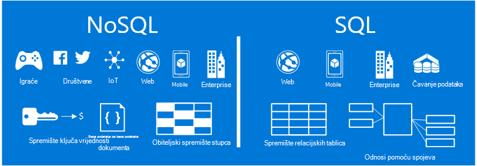
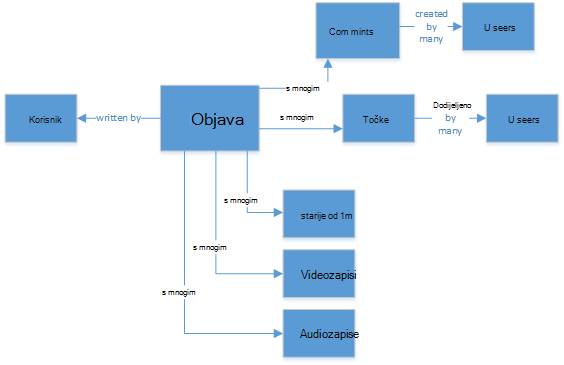
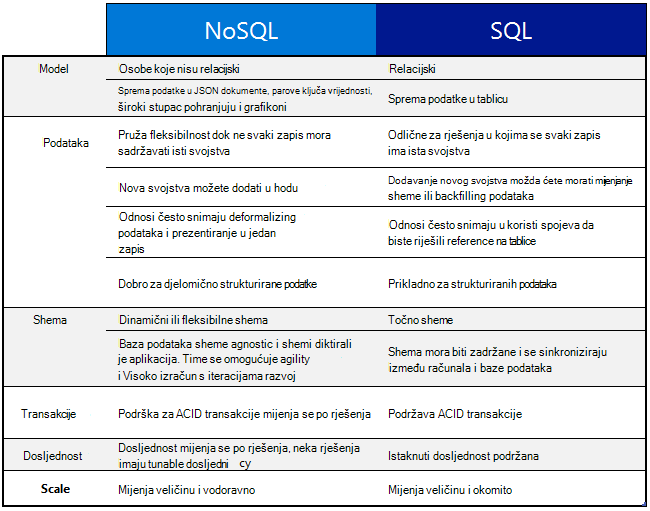
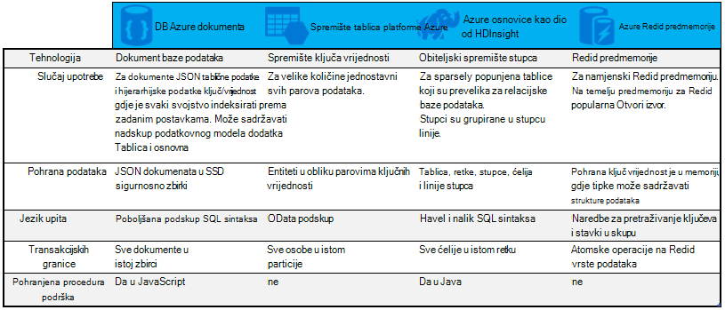

<properties
    pageTitle="Kada koristiti NoSQL Dodavanje veze za vanjskih SQL | Microsoft Azure"
    description="Usporedba prednosti korištenja NoSQL koje nisu relacijski rješenja nasuprot SQL rješenja. Saznajte li neku od servisa Microsoft Azure NoSQL ili SQL Server najbolje odgovara scenariju."
    keywords="sql Dodavanje veze za vanjskih nosql, kada se koristi NoSQL, nosql Dodavanje veze za vanjskih sql"
    services="documentdb"
    documentationCenter=""
    authors="mimig1"
    manager="jhubbard"
    editor=""/>

<tags
    ms.service="documentdb"
    ms.workload="data-services"
    ms.tgt_pltfrm="na"
    ms.devlang="dotnet"
    ms.topic="article" 
    ms.date="06/24/2016"
    ms.author="mimig"/>

# Dodavanje veze vanjskih NoSQL SQL

SQL Server i relacijske baze podataka (RDBMS) su Idi na baze podataka u više od 20 godina. Međutim, povećana potrebe za obradu veće količine i postoje vrste podataka brzinom brz je promijenio prirode potrebe za pohranu podataka za razvojne inženjere za aplikacije. Da biste omogućili scenarij NoSQL baze podataka u kojima se omogućilo spremanje nestrukturirane i heterogenih podataka na razini ste stekli popularnosti. 

NoSQL je kategorija različite iz baze podataka SQL baza podataka. NoSQL često se koristi za upućivanje na sustava za upravljanje podacima koji su "Ne SQL" ili pristup upravljanju podacima koji uključuje "ne samo SQL". Mnoga tehnologija u kategoriji NoSQL, uključujući dokument baze podataka, vrijednost ključa trgovine, stupac obitelji pohranjuju i grafikonu baze podataka koji su Popularni s društvene, igraće i IoT aplikacije.

Informirajte se o razlikama između NoSQL i SQL i ponuditi Uvod ponude NoSQL i SQL od Microsofta je cilja ovog članka.  

## Kada se koristi NoSQL?

Pogledajmo zamislite da se stvara novo web-mjesto social engagement. Korisnici mogu stvoriti objave i dodati slike, videozapise i glazbu na njih. Drugi korisnici možete komentirati objave i dati točaka (oznaka sviđanja) da biste ocijenili objave. Odredišna stranica će imati objave koje korisnici mogu zajednički koristiti i interakcije s sažetak sadržaja. 

Kako spremiti podatke Ako ste upoznati s SQL, možete započeti crtež otprilike ovako:

Stoga daleko, stoga dobar, no sada razmislite o strukturu objavu jedan i kako ga prikazati. Ako želite prikazati objave i povezane slike, zvuk, videozapis, komentare, točke i podaci o korisniku na web-mjesto ili aplikaciju promijenile za izvođenje upita s osam spojeva tablice samo za dohvaćanje sadržaj. Sada zamislite strujanje objave koje dinamički učitavanje i na zaslonu, a možete jednostavno predviđanje da se događa s obaveznim tisuće upita i mnogo spojeva za dovršenje zadatka.

Sada možete koristiti relacijskih rješenja kao što je SQL Server da biste pohranili podatke –, ali postoji mogućnost NoSQL mogućnost pojednostavljuje pristup. Po Pretvorba na sljedeći način objave u dokument JSON i pohrana u DocumentDB, na servis Azure NoSQL dokument baze podataka, možete poboljšati performanse i dohvaćanje cijeli članak s upita i bez spojeva. Je jednostavniji, više straightforward i dodatne performant rezultat.

    {
        "id":"ew12-res2-234e-544f",
        "title":"post title",
        "date":"2016-01-01",
        "body":"this is an awesome post stored on NoSQL",
        "createdBy":User,
        "images":["http://myfirstimage.png","http://mysecondimage.png"],
        "videos":[
            {"url":"http://myfirstvideo.mp4", "title":"The first video"},
            {"url":"http://mysecondvideo.mp4", "title":"The second video"}
        ],
        "audios":[
            {"url":"http://myfirstaudio.mp3", "title":"The first audio"},
            {"url":"http://mysecondaudio.mp3", "title":"The second audio"}
        ]
    }

Uz to, podatke možete particije po id objave dopuštanja Vremensko mjerilo prirodan i iskoristiti sve značajke skaliranje NoSQL podataka. Sustavi NoSQL omogućuju inženjerima omogućuje loosen dosljednost i ponuditi iznimno dostupnih aplikacija.  Na kraju ovog rješenja zahtijevaju inženjerima omogućuje definiranje, upravljanje i održavanje shemu u sloju podataka omogućuje brz iteracije.

Zatim možete izraditi na pomoću drugih servisa za Azure rješenja:

- Da biste omogućili korisnicima da biste potražili objave mogu se [Azure pretraživanja](https://azure.microsoft.com/services/search/) putem web-aplikaciji.
- [Azure aplikacije servisa](https://azure.microsoft.com/services/app-service/) može se koristiti za hostiranje aplikacije i pozadinski procesi.
- [Spremište blobova platforme Azure](https://azure.microsoft.com/services/storage/) može se koristiti za spremanje cijelog korisničkim profilima vrijedi i za slike.
- [Baze podataka SQL Azure](https://azure.microsoft.com/services/sql-database/) može se koristiti za pretraživanje velikog količine podataka kao što su podaci za prijavu i podataka za analitičkih podataka za pohranu.
- Da biste sastavili znanja i obavještavanje koji mogu povratne informacije za postupak i pomoći izlaganje odgovarajući sadržaj desnom korisnicima može se koristiti [Azure strojnog učenja](https://azure.microsoft.com/services/machine-learning/) .

Ovo web-mjesto social engagement je samo jedan scenarij u kojem je baza podataka NoSQL desnom podatkovnog modela za posao. Ako ste u načinu za čitanje dodatne informacije o ovom scenariju i kako se model podataka za DocumentDB u aplikacijama za društvene mreže, potražite u članku [Početak društvenih s DocumentDB](documentdb-social-media-apps.md). 

## NoSQL Dodavanje veze za vanjskih SQL usporedbe

U sljedećoj su tablici uspoređuje glavne razlike između web-mjesto NoSQL i u okvir za SQL. 

Ako bazu podataka NoSQL najbolje odgovara potrebama, prijeđite na sljedeći odjeljak dodatne informacije o NoSQL usluge dostupne s Azure. U suprotnom, ako bazom podataka SQL najbolje odgovara vašim potrebama, prijeđite na [koji su ponude Microsoft SQL?](#what-are-the-microsoft-sql-offerings)

## Što su ponude Microsoft Azure NoSQL?

Azure sastoji se od četiri potpuno upravlja NoSQL usluge: 

- [Azure DocumentDB](https://azure.microsoft.com/services/documentdb/)
- [Spremište tablica platforme Azure](https://azure.microsoft.com/services/storage/)
- [Azure HBase kao dio HDInsight](https://azure.microsoft.com/services/hdinsight/)
- [Azure Redis predmemorije](https://azure.microsoft.com/services/cache/)

Sljedeće grafikon s usporedbom karata odgovor ključa differentiators za svaki servis. Koji će Većina točno opisuju potrebama vaše aplikacije? 

Ako je jedan ili više od tih servisa možda ne odgovara potrebama vaše aplikacije, dodatne informacije s u sljedećim resursima: 

- [Tečaj DocumentDB](https://azure.microsoft.com/documentation/learning-paths/documentdb/) i [DocumentDB korištenje slučajeva](documentdb-use-cases.md)
- [Početak rada sa spremištem tablica platforme Azure](../storage/storage-dotnet-how-to-use-tables.md)
- [Što je HBase u HDInsight](../hdinsight/hdinsight-hbase-overview.md)
- [Redis predmemorije tečaj](https://azure.microsoft.com/documentation/learning-paths/redis-cache/)

Prijeđite na [sljedeće korake](#next-steps) da biste saznali besplatnu probnu.

## Što su Microsoft SQL ponude?

Microsoft sastoji se od pet ponuda SQL: 

- [Baze podataka Azure SQL](https://azure.microsoft.com/services/sql-database/)
- [SQL Server na virtualnim računalima za Azure](https://azure.microsoft.com/services/virtual-machines/sql-server/)
- [SQL Server](https://www.microsoft.com/server-cloud/products/sql-server-2016/)
- [Azure SQL Data Warehouse (pretpregled)](https://azure.microsoft.com/services/sql-data-warehouse/)
- [Analitički sustav u platformu (lokalni potražite)](https://www.microsoft.com/en-us/server-cloud/products/analytics-platform-system/)

Ako vas zanima SQL Server na virtualnog računala ili SQL baze podataka, a zatim pročitajte [Odaberite oblak mogućnost SQL Server: baze podataka SQL Azure (PaaS) ili SQL Server na Azure VMs (IaaS)](../sql-database/sql-database-paas-vs-sql-server-iaas.md) da biste saznali više o razlikama između njih.

Li SQL zvukove najbolja mogućnost, zatim idite na [SQL Server](https://www.microsoft.com/server-cloud/products/) da biste saznali više o što Microsoft SQL proizvoda i usluga imati nudi.

Prijeđite na [sljedeće korake](#next-steps) besplatno probne verzije i procjenu veze.

## Daljnji koraci

Pozivamo vas da biste saznali više o naši proizvodi SQL i NoSQL tako da ih besplatno isprobavate. 

- Za sve servise Azure registrirati za na [slobodno probnu verziju jedan mjesec](https://azure.microsoft.com/pricing/free-trial/) i primanje $200 potrošeno na neki od servisa Azure.
    - [Azure DocumentDB](https://azure.microsoft.com/services/documentdb/)
    - [Azure HBase kao dio HDInsight](https://azure.microsoft.com/services/hdinsight/)
    - [Azure Redis predmemorije](https://azure.microsoft.com/services/cache/)
    - [Azure SQL Data Warehouse (pretpregled)](https://azure.microsoft.com/services/sql-data-warehouse/)
    - [Baze podataka Azure SQL](https://azure.microsoft.com/services/sql-database/)
    - [Spremište tablica platforme Azure](https://azure.microsoft.com/services/storage/)

- Možete Okretni kopije [probna verzija sustava SQL Server 2016 na virtualnog računala](https://azure.microsoft.com/marketplace/partners/microsoft/sqlserver2016ctp33evaluationwindowsserver2012r2/) ili preuzeti [probna verzija sustava SQL Server](https://www.microsoft.com/en-us/evalcenter/evaluate-sql-server-2016).
    - [SQL Server](https://www.microsoft.com/server-cloud/products/sql-server-2016/)
    - [SQL Server na virtualnim računalima za Azure](https://azure.microsoft.com/services/virtual-machines/sql-server/)

