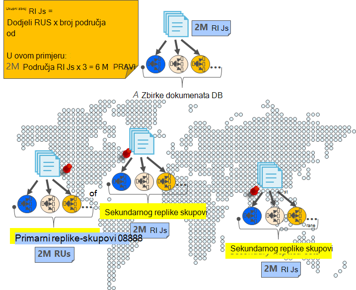

<properties
    pageTitle="Online sigurnosnog kopiranja i vraćanja s DocumentDB | Microsoft Azure"
    description="Saznajte kako izvesti automatske sigurnosnog kopiranja i vraćanja NoSQL baza podataka s Azure DocumentDB."
    keywords="sigurnosno kopiranje i vraćanje, mrežnog sigurnosnog kopiranja"
    services="documentdb"
    documentationCenter=""
    authors="RahulPrasad16"
    manager="jhubbard"
    editor="monicar"/>

<tags
    ms.service="documentdb"
    ms.workload="data-services"
    ms.tgt_pltfrm="na"
    ms.devlang="multiple"
    ms.topic="article"
    ms.date="09/23/2016"
    ms.author="raprasa"/>

# Automatsko mrežnog sigurnosnog kopiranja i vraćanja s DocumentDB 

Azure DocumentDB vodi sigurnosne kopije svih podataka u pravilnim vremenskim razmacima. Automatsko sigurnosno kopiranje uzimaju se bez utjecaja na performanse ili dostupnost vaša NoSQL postupaka baze podataka. Sigurnosne kopije spremaju se zasebno u neki drugi servis za pohranu, a te kopije se globalno replicirati za otpornost protiv regionalne disasters. Automatsko sigurnosno kopiranje su namijenjene scenariji kada slučajno izbrišete zbirka DocumentDB te kasnije zahtijevaju oporavak podataka ili oporavak rješenje Izrada.  

U ovom se članku počinje s kratkim recap redundanciju podataka jer i dostupnosti u DocumentDB i objašnjava sigurnosne kopije. 

## Visoke dostupnosti s DocumentDB - u recap

DocumentDB je dizajniran tako da se [globalno distributed](documentdb-distribute-data-globally.md) – omogućuje skaliranje propusnost preko više Azure regija uz pravila utemeljenima na prebacivanje i prozirne više homing API-ji. Kao sustava baze podataka koja nudi [99,99% dostupnost SLA](https://azure.microsoft.com/support/legal/sla/documentdb/v1_0/)zapisivanja u DocumentDB predaju durably na lokalni disk po kvorum replike lokalnih podataka u centru prije acknowledging klijentu. Imajte na umu da visoke dostupnosti DocumentDB ovisi lokalno spremište i ovise o sve tehnologije vanjskog prostora za pohranu. Osim toga, ako je vaš račun baze podataka povezan s više od jedne Azure regija, vaše zapisivanja su replicirati svim drugim regijama. Da biste skalirali podatke propusnost i pristup pri niskoj latencies, možete postaviti kao mnoge pročitati područja povezanu s računom za bazu podataka po želji. Na svakom području za čitanje (repliciranu) podataka je durably ista i u skupu rezultata replike.  

Kao što je prikazano na sljedećem su dijagramu, jednu zbirku DocumentDB je [Vodoravno particije](documentdb-partition-data.md). "Particije" označena po kruga u sljedećem su dijagramu, a svaki particija postala je vrlo dostupno putem skupu replike. To je lokalni raspodjele unutar jedno područje Azure (označena OS X). Nadalje, svaki particija (s njegova odgovarajući skup replike) pa globalno distribuira preko više područja povezan s računa za baze podataka (Ako, na primjer, u ovom ilustracija tri regije – Istočni SAD-a, Zapad SAD-a i središnje Indija). "Postavljanje particija" je globalno raspodijeljeno entitet comprising većeg broja primjeraka podataka u svakom području (označena os Y). Prioritet možete dodijeliti područja povezani s računom za bazu podataka, a DocumentDB će proziran prebacivanje na sljedeće područje u slučaju Izrada. Možete i ručno zamjenu prebacivanje testiranje dostupnosti završetka do kraja aplikacije.  

Sljedeća slika prikazuje veliku zalihosti s DocumentDB.

## Puni, automatsko, online sigurnosne kopije

Oops, izbrisane Moje zbirke ili u bazi podataka! S DocumentDB, ne samo podatke, ali sigurnosne kopije podataka stvaraju se iznimno redundantnih i prebacuju na regionalne disasters. Ove automatizirano sigurnosno kopiranje trenutno uzimaju otprilike svakih četiri sata. 

Sigurnosnih kopija uzimaju se bez utjecaja na performanse ili dostupnost vaša postupaka baze podataka. DocumentDB uzima sigurnosnu kopiju u pozadini bez troše vaše dodijeljenu RUs ili utječu na performanse i bez utjecaja na dostupnost NoSQL baze podataka. 

Za razliku od podataka pohranjenih u DocumentDB, automatsko sigurnosno kopiranje spremaju se u spremište blobova platforme Azure servisa. Da bi niskog kašnjenje/učinkovitog prijenos, snimka sigurnosnu kopiju prenošenja instance komponente Azure blobova na istom području kao trenutno područje za unos vašeg računa DocumentDB baze podataka. Za otpornost protiv regionalne Izrada svaki snimku sigurnosne kopije podataka u spremište blobova platforme Azure ponovno je replicirati putem zemlj suvišnih prostora za pohranu (GRS) u drugoj regiji. Sljedeći dijagram prikazuje cijelu zbirku DocumentDB (sa sve tri primarne u Zapad SAD-a u ovom primjeru) sigurnosne kopije na udaljenom računu spremište blobova platforme Azure u Zapad SAD-a, a zatim GRS replicirati na istočnoazijskim SAD-a. 

Sljedeća slika prikazuje periodičku cijelog sigurnosne kopije svi entiteti DocumentDB u spremište Azure GRS.

## Razdoblje zadržavanja za dani snimke

Prethodno opisan, ćemo povremeno poduzeti snimke podataka i po naš pravilnicima za usklađenost, možemo zadržali najnovije snimke prema gore za 90 dana prije nego što je ipak dobiva očišćene. Ako je izbrisana zbirka ili računa, DocumentDB pohranjuje zadnje sigurnosne kopije za 90 dana.

## Vraćanje baze podataka iz mrežnog sigurnosnog kopiranja

U slučaju da slučajno izbrišete podatke, možete ga [datoteke zahtjev za podršku možete](https://portal.azure.com/?#blade/Microsoft_Azure_Support/HelpAndSupportBlade) ili [nazvati podršku za Azure](https://azure.microsoft.com/support/options/) vratiti podatke iz zadnjeg automatskog sigurnosnog kopiranja. Za određene snimka sigurnosnu kopiju želite vratiti, DocumentDB zahtijeva podatke je da barem dostupne s nama trajanja sigurnosne kopije ciklusa za tu snimke.

## Daljnji koraci

Za replikaciju NoSQL baze podataka u više podataka potražite u članku [distribucija podataka globalno pomoću DocumentDB](documentdb-distribute-data-globally.md). 

Datoteka kontaktu podršku za Azure, [datoteka karata na portalu Azure](https://portal.azure.com/?#blade/Microsoft_Azure_Support/HelpAndSupportBlade).