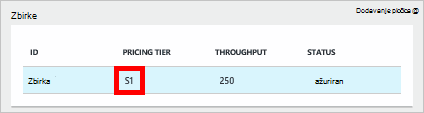
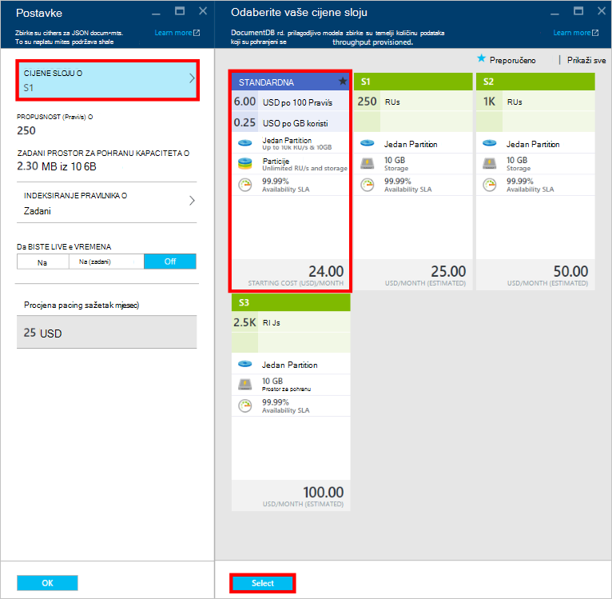
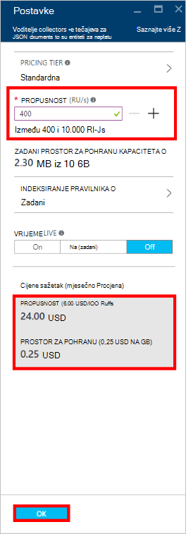
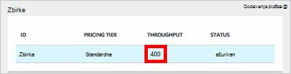

<properties
    pageTitle="Performanse razina u DocumentDB | Microsoft Azure"
    description="Saznajte kako performanse razina u DocumentDB omogućuju rezervirati propusnost na temelju po zbirke."
    services="documentdb"
    authors="mimig1"
    manager="jhubbard"
    editor="monicar"
    documentationCenter=""/>

<tags
    ms.service="documentdb"
    ms.workload="data-services"
    ms.tgt_pltfrm="na"
    ms.devlang="na"
    ms.topic="article"
    ms.date="08/26/2016"
    ms.author="mimig"/>

# Performanse razina u DocumentDB

Ovaj članak sadrži pregled performanse razina u [Programu Microsoft Azure DocumentDB](https://azure.microsoft.com/services/documentdb/).

Kad pročitate članak ćete je moći odgovaraju na sljedeća pitanja:  

-   Što je razinu performansi?
-   Kako je propusnost rezervirana za račun baze podataka?
-   Kako raditi razine performansi?
-   Kako se naplatiti za razine performansi?

## Uvod u razine performansi

Svakoj zbirci DocumentDB stvorena u odjeljku standardne račun je tamo uz razinu pridružene performansi. Svaku zbirku u bazi podataka može imati razinu različite performanse omogućujući vam da biste odredili dodatne propusnost za često pristupa zbirke i manje propusnost za diskovni pristupa zbirke. DocumentDB podržava obje razine korisnički definirane performanse i unaprijed definiranih razina performansi.  

Svaka razina performanse ima stopa ograničenja povezana [zahtjev jedinica (Pravi)](documentdb-request-units.md) . To je propusnost koje će biti rezervirana za zbirci web koji se temelji na njegovu razinu performanse i dostupna je za tu zbirku isključivo.

<table border="0" cellspacing="0" cellpadding="0">
    <tbody>
        <tr>
            <td valign="top">

</td>
            <td valign="top">
Pojedinosti
</td>
            <td valign="top">
Ograničenja propusnost
</td>
            <td valign="top">
Ograničenja prostora za pohranu
</td>
            <td valign="top">
Verzija
</td>
            <td valign="top">
API-ji
</td>            
        </tr>
        <tr>
            <td valign="top">
Korisnički definirane performansi
</td>
            <td valign="top">
Prostor za pohranu s ograničenim prometom ovisno o korištenju u GB.

Propusnost u jedinicama 100 Pravi/s
</td>
            <td valign="top">
Neograničeno. 400 - 250.000 zahtjev jedinice/s po zadanom (podignuti zahtjev)
</td>
            <td valign="top">
Neograničeno. 250 GB po zadanom (podignuti zahtjev) 
</td>
            <td valign="top">
V2
</td>
            <td valign="top">
API 2015-12-16 i noviji
</td>  
        </tr>
        <tr>
            <td valign="top">
Unaprijed definirani performansi
</td>
            <td valign="top">
10 GB rezervirana za pohranu.

S1 = 250 Pravi/s, S2 = 1000 Pravi/s, S3 = Pravi s 2500
</td>
            <td valign="top">
Pravi s 2500
</td>
            <td valign="top">
10 GB
</td>
            <td valign="top">
V1
</td>
            <td valign="top">
Sve
</td>  
        </tr>        
    </tbody>
</table>                

DocumentDB omogućuje bogatog skupa postupaka baze podataka obuhvaća upite, upiti s korisnički definirane funkcije (UDF) pohranjene procedure i okidača. Trošak obrada koji je povezan sa svakom od tih operacija će razlikuju se ovisno o procesora, IO i memorije potrebne da biste dovršili postupak. Umjesto toga mislim o i upravljanja resursima hardvera možete smatrati jedinice zahtjev za jednu mjeru za resurse moraju izvršiti razne operacije baze podataka i usluge zahtjeva aplikacije.

Zbirke možete stvoriti putem [portala sustava Microsoft Azure](https://portal.azure.com), [REST API -JA](https://msdn.microsoft.com/library/azure/mt489078.aspx) ili bilo koji od [DocumentDB SDK-ovi](https://msdn.microsoft.com/library/azure/dn781482.aspx). API-ji DocumentDB omogućuju vam da odredite razinu performanse zbirke.

> [AZURE.NOTE] Razina performanse zbirke može se prilagoditi kroz API-ji ili [portal Microsoft Azure](https://portal.azure.com/). Promjene na razini performanse se očekuje da biste dovršili unutar 3 minute.

## Postavljanje razine performansi za zbirke
Nakon stvaranja zbirke web Potpuna alokacija RUs koji se temelji na razini određenu performanse su rezervirana mjesta za zbirku.

Imajte na umu da i razina performanse korisnički definirane i unaprijed definirane DocumentDB pristajete ovisno o rezervacije propusnost. Stvaranjem zbirka aplikacija rezervira i naplate za rezervirana propusnost bez obzira na to koliko te propusnost je aktivno koriste. Razina korisnički definirane performanse prostora za pohranu je s ograničenim prometom na temelju potrošnje, ali razina unaprijed definiranih performanse 10 GB prostora za pohranu rezervirane prilikom stvaranja zbirke.  

Nakon stvaranja zbirke možete izmijeniti razinu performanse putem DocumentDB SDK-ovi ili putem portala za klasični Azure.

> [AZURE.IMPORTANT] Standardna DocumentDB zbirke se naplatiti svaki sat brzinom, a svake zbirke stvarate će se naplatiti za minimalne jedan sat upotrebe.

Ako ste prilagodili razinu performanse zbirke unutar jedan sat, će se naplatiti za najvišu razinu performansi postavlja tijekom sat. Ako, na primjer, ako povećati razinu zaštite performansi za zbirku na 8:53 am koju naplatiti za novu razinu počevši od 8:00 prijepodne. Isto tako, ako smanjili razinu zaštite performansi pri 8:53 se, stopu novi će se primijeniti na 9:00 prijepodne.

Zahtjev za jedinice su rezervirana za svaku zbirku koji se temelji na stranici Postavljanje razine performansi. Zahtjev jedinica potrošnje procjenjuje kao na po drugi stopa. Aplikacijama koje premašuju Dodjela resursa zahtjev jedinica stopa (ili razina performansi) u zbirci web će biti ograničio vrijeme dok stopu ispod razinu rezervirana za tu zbirku. Ako aplikacija zahtijeva više razine propusnost, možete povećati razinu performansi za svaku zbirku.

> [AZURE.NOTE] Kada aplikacija premašuje performanse razine za jednu ili više zbirki, zahtjevi će biti ograničio vrijeme na temelju po zbirke. To znači da zahtjevi za neke aplikacije mreži dok drugi mogu biti ograničio vrijeme. Preporučuje se da biste dodali mali broj ponovne pokušaje kada ograničio vrijeme da bi se rukovati krivina u zahtjev za promet.

## Rad s performansama razine
DocumentDB zbirke omogućuju da biste grupirali podatke na temelju uzoraka upita i performanse potrebama aplikacije. S DocumentDB na automatsko indeksiranje i podršku upita, je prilično zajedničkih collocate heterogenih dokumenata u istoj zbirci. Ključnim pitanjima u procjeni treba li koristiti odvojene zbirke obuhvaćaju sljedeće:

- Upiti – zbirka je opseg za izvršavanje upita. Ako vam je potrebna upita u skupu dokumenata, najučinkovitiji čitanja uzoraka potjecati iz collocating dokumenata u jednu zbirku.
- Transakcije – sve transakcije imaju ograničen prikaz samo u jednom zbirci. Ako imate dokumenti za koje je potrebno ažurirati unutar jedne pohranjena procedura ili okidača, mora biti pohranjena u istoj zbirci. Preciznije, ključ particija unutar zbirke je granicu transakcije. Dodatne informacije potražite u [Partitioning u DocumentDB](documentdb-partition-data.md) .
- Performanse odvajanja – zbirka ima razinu pridružene performanse. Provjerava ima li svaki zbirke predvidljivi performanse kroz rezervirane RUs. Podatke možete se dodijeliti različite skupove razina različite performanse, ovisno o učestalosti programa access.

> [AZURE.IMPORTANT] Važno je da razumijete vam naplaćivati pri potpuni standardne stope ovisno o broju zbirki stvorila vaša aplikacija.

Preporučuje se čini aplikacija koristi mali broj zbirki osim ako imate veliki preduvjeti za pohranu ili propusnost. Provjerite je li sasvim jasna uzoraka aplikaciju za stvaranje nove zbirke. Možete odabrati rezervirati Stvaranje zbirke kao upravljanje akciju rukuje izvan vaše aplikacije. Isto tako, prilagodite razinu performansi za zbirku, promijenite satu naplate zbirke. Trebali biste praćenje zbirke performanse razine ako aplikacija prilagođava te dinamički.

## Promjena iz S1, S2, S3 u korisnički definirane performansi

Slijedite ove korake da biste promijenili pomoću unaprijed definiranih propusnost razine korisnički definirane propusnost razine na portalu za Azure. Pomoću korisnički definiranih propusnost razine možete prilagodite na propusnost vašim potrebama. A ako i dalje koristite račun S1, možete povećati zadani propusnost od 250 Pravi/s 400 Pravi/s uz samo nekoliko klikova.

Dodatne informacije o cijene vezane uz korisnički definirane i unaprijed definirane propusnost promjene potražite u članku na blogu [DocumentDB: sve što trebate znati o korištenju nove cijene mogućnosti](https://azure.microsoft.com/blog/documentdb-use-the-new-pricing-options-on-your-existing-collections/).

> [AZURE.VIDEO changedocumentdbcollectionperformance]

1. U pregledniku idite na [**portal za Azure**](https://portal.azure.com).
2. Kliknite **Pregledaj** -> **DocumentDB računi**, a zatim odaberite DocumentDB račun koji želite izmijeniti.   
3. U leće **baze podataka** odaberite bazu podataka da biste izmijenili, a zatim u plohu **baze podataka** odaberite zbirke da biste izmijenili. Računi u pomoću unaprijed definiranih propusnost imaju cijene sloj S1, S2 ili S3.

      

4. U plohu **zbirke** kliknite **više**, zatim **Postavke** na gornjoj traci.   
5. U plohu **Postavke** kliknite **Sloju cijene** i obratite pozornost na to prikazuje li se mjesečni procjenu troškova za svaki plan u plohu **Odaberite vaše cijene sloju** . Da biste promijenili korisnički definirane propusnost, kliknite **Standard**, a zatim **Odaberite** da biste spremili promjene.

      

6. Vratite se u plohu **Postavke** **Cijene sloju** mijenja se u **standardni** i prikazat će se okvir **propusnost (Pravi na s)** uz zadanu vrijednost od 400. Postavljanje propusnost između 400 i 10 000 [zahtjev jedinice](documentdb-request-units.md)/second (Pravi na s). **Cijene sažetak** pri dnu stranice automatski ažurira omogućuje procjenu mjesečni trošak. Kliknite **u redu** da biste spremili promjene.

    

7. Ponovno uključite plohu **baze podataka** možete provjeriti novi propusnost zbirke.

    

Ako zaključite da trebate više propusnost (veće od 10 000 Pravi/s) ili dodatnog prostora za pohranu (veće od 10GB) možete stvoriti particioniranom zbirke. Da biste stvorili particioniranom zbirke, potražite u članku [Stvaranje zbirke](documentdb-create-collection.md).

>[AZURE.NOTE] Promjena performanse razine u zbirci može potrajati do dvije minute.

## Promjena razine performansi pomoću .NET SDK

Druge mogućnosti za promjenu razine performanse vaše zbirke je naš SDK-ovi. U ovom se odjeljku pokriva samo promijenite razinu performansi za zbirkom web pomoću naš [.NET SDK](https://msdn.microsoft.com/library/azure/dn948556.aspx), ali postupak je sličan za naše ostale [SDK-ovi](https://msdn.microsoft.com/library/azure/dn781482.aspx). Ako ste novi korisnik naše SDK .NET, posjetite naš [uvodni vodič](documentdb-get-started.md).

Evo isječak koda za promjenu propusnost ponuda za 50.000 jedinice zahtjev sekundi.

    //Fetch the resource to be updated
    Offer offer = client.CreateOfferQuery()
                      .Where(r => r.ResourceLink == collection.SelfLink)    
                      .AsEnumerable()
                      .SingleOrDefault();

    // Set the throughput to 5000 request units per second
    offer = new OfferV2(offer, 5000);

    //Now persist these changes to the database by replacing the original resource
    await client.ReplaceOfferAsync(offer);

    // Set the throughput to S2
    offer = new Offer(offer);
    offer.OfferType = "S2";

    //Now persist these changes to the database by replacing the original resource
    await client.ReplaceOfferAsync(offer);

> [AZURE.NOTE] Zbirke nudi u odjeljku 10 000 zahtjev jedinica po drugi moguće je premjestiti između ponuda za korisnički definirane propusnost i unaprijed definirane propusnost (S1, S2, S3) u bilo kojem trenutku. Zbirke koje su tamo uz iznad 10 000 zahtjev jedinica po drugi ne mogu pretvoriti u unaprijed definiranih propusnost razine.

Posjetite [MSDN](https://msdn.microsoft.com/library/azure/microsoft.azure.documents.client.documentclient.aspx) da biste pogledali dodatne primjere i dodatne informacije o naš ponudu metoda:

- [**ReadOfferAsync**](https://msdn.microsoft.com/library/azure/microsoft.azure.documents.client.documentclient.readofferasync.aspx)
- [**ReadOffersFeedAsync**](https://msdn.microsoft.com/library/azure/microsoft.azure.documents.client.documentclient.readoffersfeedasync.aspx)
- [**ReplaceOfferAsync**](https://msdn.microsoft.com/library/azure/microsoft.azure.documents.client.documentclient.replaceofferasync.aspx)
- [**CreateOfferQuery**](https://msdn.microsoft.com/library/azure/microsoft.azure.documents.linq.documentqueryable.createofferquery.aspx)

## Promjena propusnost zbirkom web

Ako već koristite korisnički definirane performanse, možete promijeniti propusnost zbirke tako da učinite sljedeće. Ako vam je potrebna promjena s performansama razinu S1, S2 ili S3 (unaprijed definiranih performanse) na korisnički definirane performanse, pročitajte članak [Promjena iz S1, S2, S3 da biste korisnički definirane performansi](#changing-performance-levels-using-the-azure-portal).

1. U pregledniku idite na [**portal za Azure**](https://portal.azure.com).
2. Kliknite **Pregledaj** -> **DocumentDB računi**, a zatim odaberite DocumentDB račun koji želite izmijeniti.   
3. Na plohu **DocumentDB računa** , u leće **baze podataka** odaberite bazu podataka da biste izmijenili, a zatim u plohu **baze podataka** odaberite zbirke da biste izmijenili.
4. U plohu **zbirke** na gornjoj traci kliknite **Postavke** .   
5. U plohu **Postavke** povećajte vrijednost u okviru **propusnost (Pravi na s)** , a zatim **u redu** da biste spremili promjenu. **Cijene sažetak** pri dnu ažuriranja plohu da bi se prikazala novi Procijenjena mjesečni trošak tu zbirku u jednom području.

    

Ako niste sigurni koliko je da biste povećali vaše propusnost, potražite u članku [treba Estimating propusnost](documentdb-request-units.md#estimating-throughput-needs) i [zahtjev Kalkulator jedinica](https://www.documentdb.com/capacityplanner).

## Daljnji koraci

Da biste saznali više o cijene i upravljanje podacima s Azure DocumentDB, proučite ove resurse:

- [Cijene DocumentDB](https://azure.microsoft.com/pricing/details/documentdb/)
- [Upravljanje DocumentDB kapaciteta](documentdb-manage.md)
- [Modeliranje podataka u DocumentDB](documentdb-modeling-data.md)
- [Stvaranje particija podataka u DocumentDB](documentdb-partition-data.md)
- [Zahtjev za jedinice](http://go.microsoft.com/fwlink/?LinkId=735027)

Dodatne informacije o DocumentDB potražite u članku Azure DocumentDB [dokumentacije](https://azure.microsoft.com/documentation/services/documentdb/).

Početak rada s promjenom veličine i performanse testiranjem DocumentDB, potražite u članku [performanse i skaliranje testiranjem Azure DocumentDB](documentdb-performance-testing.md).

[1]: ./media/documentdb-performance-levels/documentdb-change-collection-performance7-9.png
[2]: ./media/documentdb-performance-levels/documentdb-change-collection-performance10-11.png
