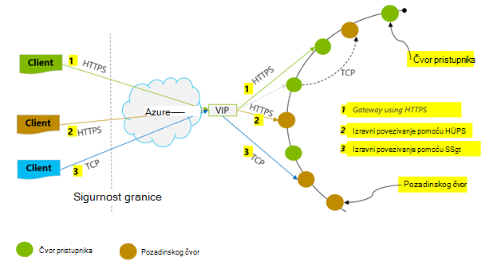
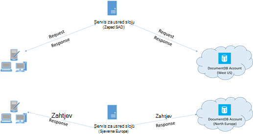

<properties 
    pageTitle="Savjeti za performanse DocumentDB | Microsoft Azure" 
    description="Dodatne mogućnosti konfiguracije klijenta radi poboljšanja performansi Azure DocumentDB baze podataka"
    keywords="Kako poboljšati performanse baze podataka"
    services="documentdb" 
    authors="mimig1" 
    manager="jhubbard" 
    editor="" 
    documentationCenter=""/>

<tags 
    ms.service="documentdb" 
    ms.workload="data-services" 
    ms.tgt_pltfrm="na" 
    ms.devlang="na" 
    ms.topic="article" 
    ms.date="10/17/2016" 
    ms.author="mimig"/>

# Performanse Savjeti za DocumentDB

Azure DocumentDB je brz i prilagodljivo raspodijeljeno bazu podataka koja se mijenja veličinu Integracija s sigurno Latencija i propusnost. Nemate promjene glavne arhitektura ili složene kod da biste skalirali bazu podataka s DocumentDB. Promjena veličine gore i dolje je dovoljno jedan API poziva ili [poziv SDK metode](documentdb-performance-levels.md#changing-performance-levels-using-the-net-sdk). Međutim, jer DocumentDB se pristupa putem mreže pozive ne postoje klijentsko optimizacije vam na raspolaganju da biste postigli Vršna performansi.

Da ako tražite "kako poboljšati performanse moje baze podataka?" Imajte na umu sljedeće mogućnosti:

## Povezivanje s mrežom

1. **Pravilnik za vezu: koristi način rada izravne veze**
    
    Način na koji se klijent povezuje s Azure DocumentDB sadrži važne utjecaju na performanse, osobito pomoću opaženih klijentsko Latencija. Dostupni za konfiguriranje klijentskih pravila veze – povezivanja *način* i [veze *protokol*](#connection-protocol)su dva ključa konfiguracijske postavke.  Dva načina dostupne su:

    1. Način pristupnika (zadano)
    2. Izravni načinu rada

    Budući da DocumentDB je sustav raspodijeljeno prostora za pohranu i DocumentDB resurse kao što su zbirke imaju na brojne računalima i svaki particija ponavlja se za visoke dostupnosti. Logička za prevođenje fizička adresa se sinkroniziraju usmjeravanje tablice, koja je dostupna i interno kao resurs.

    U načinu pristupnika pristupnika strojeva DocumentDB izvođenje proizvodnog postupka, time što omogućuje kod klijenta jednostavne i sažeti. Klijentska aplikacija problemi zahtjeve za pristupnik strojeva DocumentDB logičke URI zahtjeva za fizičke adrese čvor pozadinskog za prijevod, a komponenta prosljeđivanje zahtjeva.  Obratno, u načinu rada za izravno klijenti morate održavanje – i povremeno osvježite – kopiju usmjeravanje tablici i izravno povezati s DocumentDB čvorove pozadinskog.

    Pristupnik je podržano na svim platformama SDK i se konfiguriran zadani.  Ako aplikacija izvodi u korporacijskom mrežom uz ograničenja izričite vatrozid, pristupnika način je najbolji odabir jer koristi standardnu HTTPS priključak i jedan krajnje točke. Tradeoff performanse je način pristupnika da obuhvaća mjesto na dodatni mrežni svaki put podataka je pročitati ili zapisuju DocumentDB.   Zbog toga Izravni način nudi bolje performanse zbog manje preskakanja mreže.

2. **Pravilnik za vezu: korištenje protokola TCP**

    Kada korištenje Izravni načinu rada, postoje dvije protokol mogućnosti dostupne:

    - TCP
    - HTTPS

    DocumentDB nudi jednostavan i otvorite RESTful model programiranja putem HTTP. Osim toga, nudi učinkovitog TCP protokol koji je RESTful u modelu njegov komunikacije i je dostupan putem klijentskog programa .NET SDK. Izravni TCP i HTTP pomoću SSL za početne provjere autentičnosti i šifriranja promet. Za najbolje performanse, koristite protokolom TCP kada je to moguće. 

    Prilikom korištenja TCP u načinu pristupnika, TCP priključak 443 DocumentDB priključak, a 10250 priključak MongoDB API-JA. Prilikom korištenja TCP u načinu za Izravni osim priključke pristupnika, morat ćete osigurati priključak između 10000 i 20000 otvoren jer DocumentDB koristi dinamički TCP priključci. Ako nisu otvorene priključke i pokušate koristiti TCP, primit ćete pogrešku u 503 Servis nije dostupan. 

    Način povezivanja konfiguriran tijekom izrade DocumentClient instance s parametrom ConnectionPolicy. Ako se koristi Izravni način protokol moguće je postaviti i unutar parametar ConnectionPolicy.

        var serviceEndpoint = new Uri("https://contoso.documents.net");
        var authKey = new "your authKey from Azure Mngt Portal";
        DocumentClient client = new DocumentClient(serviceEndpoint, authKey, 
        new ConnectionPolicy
        {
            ConnectionMode = ConnectionMode.Direct,
            ConnectionProtocol = Protocol.Tcp
        });

    Jer TCP podržano je samo u načinu za izravno ako koristi način pristupnika, HTTPS protokola uvijek koristi za komunikaciju s pristupnika i vrijednost protokol u na ConnectionPolicy se zanemaruje.

    

3. **Pozivanje OpenAsync da biste izbjegli Latencija pokretanje na zahtjev za prvi**

    Prema zadanim postavkama, zahtjev za prvi će imati veći Latencija jer je tablici za usmjeravanje adresa za dohvaćanje. Da biste izbjegli ovo Latencija pokretanje na zahtjev za prvi, nazovite OpenAsync() jednom tijekom Inicijalizacija na sljedeći način.

        await client.OpenAsync();

4. **Collocate klijente u istom Azure području performanse**

    Kada je to moguće, postavite sve aplikacije pozivanje DocumentDB na istom području kao DocumentDB baza podataka. Za približno usporedbe, pozive DocumentDB unutar iste područja dovrši unutar ms 1-2, ali je latencije između zapada i obalna Istok Sjedinjenih Država > 50 ms. U ovom Latencija vjerojatno mogu se razlikovati iz zahtjeva za zahtjev ovisno o usmjeravanje zauzima zahtjev, kao što je prosljeđuje putem klijentskog programa granicu Azure podatkovnog centra. Najniže moguće kašnjenje postiže se jamči da se nalazi unutar iste Azure područja kao krajnja točka za dodijeljenu DocumentDB aplikacija. Popis dostupnih područja, potražite u članku [Azure područja](https://azure.microsoft.com/regions/#services).

    

5. **Povećava broj niti/zadataka**

    Budući da se pozivi DocumentDB vrše putem mreže, možda ćete morati razlikuju stupanj parallelism vašim zahtjevima tako da se klijentske aplikacije troši vrlo malo vremena čekanja između zahtjeva. Na primjer, ako koristite. Neto na [Zadatak paralelno biblioteke](https://msdn.microsoft.com//library/dd460717.aspx), stvaranje obliku 100s zadataka čitanje ili pisanje DocumentDB.

## Korištenje SDK

1. **Instalacija najnovije SDK**

    DocumentDB SDK-ovi su neprestano poboljšane pružanje najbolje performanse. U odjeljku [DocumentDB SDK](documentdb-sdk-dotnet.md) stranica da biste odredili najnovije SDK i pregledajte poboljšanja. 

2. **Da biste koristite jednočlana DocumentDB klijent za vrijeme trajanja aplikacije**
  
    Imajte na umu da svaku instancu DocumentClient niti sigurnih i provodi upravljanja učinkovitog vezama i adresu predmemoriranje kada u načinu rada za izravno. Omogućuje upravljanje učinkovitog veze i boljih performansi po DocumentClient preporučuje se korištenje instancu DocumentClient po AppDomain za vrijeme trajanja aplikacije.

3. **Povećavanje System.Net MaxConnections po glavnog računala**

    Zahtjevi za DocumentDB vrše putem HTTP/OSTALE po zadanom i su trpi li zadanog ograničenja veze po naziv glavnog računala ili IP adresa. Možda ćete morati postaviti na MaxConnections na veću vrijednost (100-1000) tako da se klijentska biblioteka mogu koristiti višestruke istodobno veze DocumentDB. U .NET SDK 1.8.0 iznad, zadana vrijednost za [ServicePointManager.DefaultConnectionLimit](https://msdn.microsoft.com/library/system.net.servicepointmanager.defaultconnectionlimit.aspx) iznosi 50 i promijenite vrijednost, možete postaviti [Documents.Client.ConnectionPolicy.MaxConnectionLimit](https://msdn.microsoft.com/en-us/library/azure/microsoft.azure.documents.client.connectionpolicy.maxconnectionlimit.aspx) na veću vrijednost.  

4. **Usklađivanje paralelno upite za particioniranom zbirke**

     SDK .NET DocumentDB verzije 1.9.0 i iznad podršku paralelno upita, koji vam omogućuju da upit particioniranom zbirke paralelno (potražite u članku [Rad s na SDK-ovi](documentdb-partition-data.md#working-with-the-sdks) i povezane [primjere koda](https://github.com/Azure/azure-documentdb-dotnet/blob/master/samples/code-samples/Queries/Program.cs) za dodatne informacije). Paralelni upiti su osmišljeni tako da biste poboljšali Latencija upita i propusnost putem postoji njihove serijski zamjena u obliku. Paralelni upita sadrže dva parametre koje korisnici mogu ugađanje prilagođeno prilagodi njihove preduvjeti MaxDegreeOfParallelism (a) za: da biste odredili maksimalni broj particije ne može poslati upit u paralelno i MaxBufferedItemCount (b): da biste upravljali brojem unaprijed dohvaćeni rezultata. 
    
    (a) ***Tuning MaxDegreeOfParallelism\: *** 
    upita radi napredne postavke preglednika tako da ispitivanje više particija paralelno. Međutim, podaci iz pojedinačne particioniranom prikupi je dohvaćanja serijskog spajanja vezana uz upit. Tako, postavka u MaxDegreeOfParallelism broj particije ima najveći izgledi za postizanje Većina upita performant navedene sve druge uvjete sustava ostaju iste. Ako ne znate broj particije, možete postaviti na MaxDegreeOfParallelism velik broj, a sustav će odaberite najmanje (broj particije, unos naveo korisnik) kao u MaxDegreeOfParallelism. 
    
    Nije važno Imajte na umu da upiti s paralelno proizvesti najbolje pogodnosti ako podatke jednoliko raspodijeliti sve particije vezana uz upit. Ako particioniranom zbirke particije tako da sve ili Većina podataka koji je vratio upit je concentrated u nekoliko particije (jedna particija u najgoreg slučaja), a zatim performanse upita će biti bottlenecked po te particije. 
    
    (b) ***Tuning MaxBufferedItemCount\: *** 
    paralelno upita namijenjen je unaprijed dohvaćanje rezultata tijekom trenutnog skupine rezultate obrade klijenta. Unaprijed dohvaćanje pomaže u cjelokupan unaprjeđivanja Latencija upita. MaxBufferedItemCount je parametar za ograničavanje unaprijed dohvaćeni rezultate. Postavljanje MaxBufferedItemCount očekivani broj vraćenih rezultata (ili veći broj) omogućuje upita primanje unaprijed Pribavljanje maksimalne prednosti. 
    
    Imajte na umu da unaprijed dohvaćanje funkcionira na isti način bez obzira na MaxDegreeOfParallelism i postoji jedan spremnik za podatke iz sve particije.  

5. **Uključivanje GC poslužiteljsko**
    
    Smanjivanje učestalost smeća mogu pomoći u nekim slučajevima. U .NET, postavite [gcServer](https://msdn.microsoft.com/library/ms229357.aspx) na true.

6. **Implementacija backoff intervalima RetryAfter**
 
    Tijekom testiranja performanse, trebali biste povećati učitavanja dok small stopa zahtjeva za početak ograničio vrijeme. Ako ograničio vrijeme, klijentska aplikacija treba backoff na ograničenja intervalu poslužitelja naveden pokušajte ponovno. Poštivanje na backoff osigurava trošite minimalnog količinu vremena na čekanju između ponovne pokušaje. Podrška za pravila Ponovi uključen u verziji 1.8.0 i iznad DocumentDB [.NET](documentdb-sdk-dotnet.md) i [Java](documentdb-sdk-java.md)i verzija 1.9.0 i iznad [Node.js](documentdb-sdk-node.md) i [Python](documentdb-sdk-python.md). Dodatne informacije potražite u članku [Exceeding rezervirane propusnost ograničenjima](documentdb-request-units.md#exceeding-reserved-throughput-limits) i [RetryAfter](https://msdn.microsoft.com/library/microsoft.azure.documents.documentclientexception.retryafter.aspx).

7. **Promjena veličine izgleda klijent-posla**

    Ako testirate na visok propusnost razinama (> 50.000 Pravi/s), klijentske aplikacije mogu postati usko grlo zbog strojno capping odgovor na Upotreba procesora ili mreže. Ako ne dođete do tog trenutka, možete i dalje da biste dodatno račun DocumentDB po skaliranje out klijentske aplikacije na više poslužiteljima.

8. **Dokument ji na donjem čitanja kašnjenje u predmemoriju**

    Predmemorija dokumenata ji kad god je moguće radi ostvarivanja najboljih performansi za čitanje.

9. **Podešavanje veličine stranice za sažetke sadržaja za upite/pročitano za bolje performanse**

    Prilikom izvođenja skupnog čitanje dokumenata pomoću čitanje sadržaja funkcionalnost (odnosno ReadDocumentFeedAsync) ili kada izdavanja DocumentDB SQL upita na rezultati se vraćaju segmentiranog način ako je prevelika skup rezultata. Prema zadanim postavkama, rezultati se vraćaju u blokova 100 stavki ili 1 MB, bez obzira ograničenje pronalazi prvi. 

    Da biste smanjili broj mreže zaokružiti trips potrebne za dohvaćanje svih primjenjivih rezultata, možete povećati veličinu stranice pomoću zaglavlja zahtjev za x-ms-max--broj stavki za do 1000. U slučajevima gdje želite prikazati samo nekoliko rezultate – primjerice, ako je korisničkog sučelja ili aplikacije API vraća samo 10 rezultata jedan, smanjivanjem veličine stranice na 10 da biste smanjili propusnost za čitanje i upitima.

    Također mogu postaviti veličine stranice pomoću dostupna SDK-ovi DocumentDB.  Ako, na primjer:
    
        IQueryable<dynamic> authorResults = client.CreateDocumentQuery(documentCollection.SelfLink, "SELECT p.Author FROM Pages p WHERE p.Title = 'About Seattle'", new FeedOptions { MaxItemCount = 1000 });

10. **Povećava broj niti/zadataka**

    Potražite u članku [povećati broj niti/zadataka](#increase-threads) u odjeljku povezivanje s mrežom.

## Indeksiranje pravila

1. **Korištenje drži indeksiranje za brže Vršna stope ingestion vremena**

    DocumentDB omogućuje vam da navedete – na razini zbirke – indeksiranja pravilnik, koji omogućuje vam da odaberete želite li dokumenata u zbirci automatski indeksirati ili ne.  Osim toga, možete i odabrati između sinkrono (jednak) i asinkronog ažuriranja indeksa (Lazy). Po zadanom je ažuriranje indeksa sinkronizirano na svakom Umetanje, zamjena ili Izbriši dokument u zbirku. Sinkrono način omogućuje upite za proslavu iste [razine dosljednost](documentdb-consistency-levels.md) kao čitanja dokument bez svako kašnjenje za indeks "privući pažnju".
    
    Drži indeksiranje može smatrati scenarije napisan podataka u bursts, a želite amortize radi što je potrebno sadržaju indeksa dulje vremenskom razdoblju. Drži indeksiranja i omogućuje učinkovito koristiti svoje dodijeljenu propusnost i posluživanje zahtjeva za pisanje Vršna vrijeme s minimalnim Latencija. Je važno je napomenuti da, no da kada drži omogućeno indeksiranje, rezultati upita bit će naposljetku dosljedan bez obzira na razinu dosljednost konfigurirali za DocumentDB račun.

    Dakle, dosljedan načina indeksiranja (IndexingPolicy.IndexingMode postavljeno je na jednak) uključuje najveće zahtjev jedinica trošak po pisanje tijekom Lazy indeksiranje način (IndexingPolicy.IndexingMode postavljeno je na Lazy) i ne indeksiranja (IndexingPolicy.Automatic postavljen na False) imaju nultu indeksiranja trošak vrijeme pisanja.

2. **Isključivanje Neiskorišteni putova iz indeksiranja za brže zapisivanja**

    DocumentDB-indeksiranja pravila omogućuje da navedete putove dokumenta za uključivanje ili isključivanje iz indeksiranja po korištenje indeksiranje putova (IndexingPolicy.IncludedPaths i IndexingPolicy.ExcludedPaths). Korištenje indeksiranje putova može ponuditi pisanje poboljšane performanse i donjem indeks prostor za pohranu scenariji u kojima uzoraka upita gube prije toga, kao što je indeksiranja troškove izravno se povezuju broj jedinstvenih putova indeksirati.  Na primjer, sljedeći kod prikazuje (poznatog izostavljanje cijeloj sekciji dokumenata podstablo) pomoću indeksiranja na "*" zamjenskih znakova.

        var collection = new DocumentCollection { Id = "excludedPathCollection" };
        collection.IndexingPolicy.IncludedPaths.Add(new IncludedPath { Path = "/*" });
        collection.IndexingPolicy.ExcludedPaths.Add(new ExcludedPath { Path = "/nonIndexedContent/*");
        collection = await client.CreateDocumentCollectionAsync(UriFactory.CreateDatabaseUri("db"), excluded);

    Dodatne informacije potražite u članku [DocumentDB indeksiranja pravila](documentdb-indexing-policies.md).

## Propusnost

1. **Izmjerite i ugađanje donjem zahtjeva za jedinice/sekundi korištenje**

    DocumentDB nudi bogatog skupa postupaka baze podataka uključujući relacijske i hijerarhijskih upiti s UDF-ove, pohranjene procedure i okidača – sve operacijske na dokumentima u zbirci baze podataka. Trošak povezan sa svakom od tih operacija razlikuju se ovisno o procesora, IO i memorije potrebne da biste dovršili postupak. Umjesto misle o i upravljanja resursima hardvera možete smatrati zahtjev jedinice (Pravi) jednu mjeru za resurse potrebne za izvođenje razne operacije baze podataka i servisa zahtjeva aplikacije.

    [Zahtjev za jedinice](documentdb-request-units.md) su resursi za svaki račun baze podataka koji se temelji na broj jedinica kapaciteta koji ste kupili. Zahtjev jedinica potrošnje vrednuje kao stopa sekundi. Aplikacije koje premašuju jedinica stopa Dodjela resursa zahtjev za svoj račun nije ograničena dok stopu ispod razinu rezervirana za račun. Ako aplikacija zahtijeva više razine propusnost, možete kupiti dodatni kapaciteta jedinice.

    Složenost upita utječe koliko jedinica zahtjev potrošiti za operaciju. Broj predikati, priroda predikata, broj UDF-ove i veličina skupa izvora podataka sve utjecati trošak operacije upita.

    Za mjerenje indirektni sve operacije (Stvaranje, ažuriranje i brisanje), provjera u zaglavlju x-ms-zahtjev – obavijesti (ili ekvivalentne svojstvo RequestCharge u ResourceResponse<T> ili FeedResponse<T> u .NET SDK) za mjerenje broj jedinica zahtjev troše te operacije.

        // Measure the performance (request units) of writes
        ResourceResponse<Document> response = await client.CreateDocumentAsync(collectionSelfLink, myDocument);
        Console.WriteLine("Insert of document consumed {0} request units", response.RequestCharge);
        // Measure the performance (request units) of queries
        IDocumentQuery<dynamic> queryable = client.CreateDocumentQuery(collectionSelfLink, queryString).AsDocumentQuery();
        while (queryable.HasMoreResults)
             {
                  FeedResponse<dynamic> queryResponse = await queryable.ExecuteNextAsync<dynamic>();
                  Console.WriteLine("Query batch consumed {0} request units", queryResponse.RequestCharge);
             }
        
    Vraća u ovom zaglavlju naknada za zahtjev je koliki dio vašeg dodijeljenu propusnost (odnosno 2000 RUs / drugoj). Na primjer, ako iznad upit vraća 1000 1KB dokumente, trošak operacije bit će 1000. Kao takve, unutar jedne sekunde poslužitelja poštuje samo dva takve zahtjeva prije ograničavanje daljnji zahtjevi. Dodatne informacije potražite u članku [jedinice zahtjev](documentdb-request-units.md) i [Kalkulator jedinica zahtjev](https://www.documentdb.com/capacityplanner).

2. **Učestalost za ograničavanje/zahtjeva ručicu stopa prevelika**

    Kada klijentsko pokuša premašuju rezervirane propusnost za račun, postoje smanjene performanse nema učinka na poslužitelju i ne koristi propusnost kapaciteta nakon rezervirane razine. Poslužitelj preemptively se završiti zahtjev s RequestRateTooLarge (HTTP Šifra stanja 429) i vratiti zaglavlje x-ms-Ponovi-nakon-ms koji označava vrijeme u milisekundama, korisnik mora čekati prije reattempting zahtjev.
 
        HTTP Status 429,
        Status Line: RequestRateTooLarge
        x-ms-retry-after-ms :100

    U SDK-ovi sve implicitno Uhvatite odgovor, poštovati poslužitelja naveden pokušaj nakon zaglavlje i ponovite zahtjev. Ako vaš račun nije pristupa istovremeno više klijenata, sljedeći pokušaj uspio.

    Ako imate više od jednog klijenta cumulatively radi dosljedno iznad učestalost zahtjeva, Brojanje pokušaj zadani trenutno postavljene do 9 interno klijenta se možda suffice; u ovom slučaju klijent throws DocumentClientException s Šifra stanja 429 aplikaciji. Pokušaj count zadani mogu se promijeniti tako da postavite na RetryOptions ConnectionPolicy instanci. Prema zadanim postavkama DocumentClientException s Šifra stanja 429 vraća se nakon vrijeme čekanja kumulativne od 30 sekundi ako zahtjev i dalje funkcionirati iznad učestalost zahtjeva. To se događa čak i kada trenutni pokušaj count je manji od broja Maks pokušaj, biti zadani od 9 ili korisnički definirane vrijednosti.

    Dok se ponašanje automatiziranog pokušaj pomaže radi poboljšanja stabilnosti i upotrebljivosti za većinu aplikacija, možda vam isporučen at odds pri izvođenju jednonitnih performanse, osobito kada mjerenje Latencija.  Latencija klijentskih opaženih Šiljak će ako pokusa dodirne ograničenja poslužitelja, a uzrokuje klijent SDK pokušati tihu. Da biste izbjegli Latencija krivina tijekom eksperimenata performanse, mjeriti trošak vratio svaki postupak i bili sigurni da se zahtjevi za operacijski ispod stopa rezervirane zahtjev. Dodatne informacije potražite u članku [zahtjev jedinice](documentdb-request-units.md).
   
3. **Dizajn manjih dokumenata za veću propusnost**

    Zahtjev za trošak (odnosno obrada zahtjeva trošak) operacije na navedeni izravno povezuju veličini dokumenta. Postupci za veliki dokumenti troška više postupci za small dokumente.

## Dosljednost razine

1. **Korištenje weaker dosljednost razine za bolje latencies za čitanje**

    Drugi važan faktor uzmete u obzir u ugađanju performansi DocumentDB aplikacija je razina dosljednost. Odabir razine dosljednost ima posljedice performansi za čitanja i pisanja. Zadana razina dosljednost možete konfigurirati na računu za bazu podataka i razinu odabranom dosljednost zatim primjenjuje na sve zbirke (preko svih baza podataka) subjekta DocumentDB. Pomoću operacije pisanja posljedice Promjena razine dosljednost opaženih će se kao Latencija zahtjev. Kao što je jače dosljednost razine koriste, pisanje latencies će se povećati. S druge strane, utjecaja dosljednost razine operacije čitanja opaženih je pomoću propusnost. Weaker dosljednost razine omogućuju veću propusnost za biti Rač klijenta za čitanje.

    Po zadanom sve čitanja i upiti poslani protiv resursi korisnički definirane koristit će Zadana razina dosljednost naveden na računu za bazu podataka. Međutim, možete, smanjite razinu dosljednost zahtjeva za određene čitanje/upit navođenjem zaglavlje zahtjev za x ms-dosljednost-razine. Dodatne informacije potražite u članku [dosljednost razine u DocumentDB](documentdb-consistency-levels.md).

## Daljnji koraci

Ogledna aplikacije koji se koristi za procjenu DocumentDB scenarije visokih performansi na nekoliko klijentskim računalima, potražite u članku [performanse i skaliranje testiranjem Azure DocumentDB](documentdb-performance-testing.md).

Dodatne informacije o dizajniranju aplikacija za promjenom veličine i visoke performanse, pogledajte [Partitioning i skaliranja u Azure DocumentDB](documentdb-partition-data.md).
