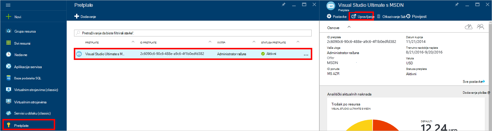
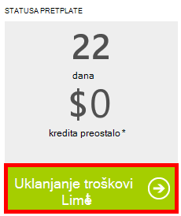

<properties
    pageTitle="Otklanjanje poteškoća s DocumentDB probleme s portalom | Microsoft Azure"
    description="Saznajte više da biste riješili probleme na portalu za DocumentDB Azure." 
    services="documentdb"
    documentationCenter=""
    authors="mimig1"
    manager="jhubbard"
    editor="monicar"/>

<tags
    ms.service="documentdb"
    ms.workload="data-services"
    ms.tgt_pltfrm="na"
    ms.devlang="na"
    ms.topic="article"
    ms.date="08/29/2016"
    ms.author="mimig"/>

# Portal za Azure DocumentDB Savjeti za otklanjanje poteškoća

U ovom se članku opisuje kako riješiti probleme DocumentDB na portalu za Azure. 

## Nedostaju resursi

**Simptoma**: baze podataka ili zbirke nedostaju vaše portala blades.

**Rješenje**: donji korištenje aplikacije raditi u odjeljku Maksimalna propusnost kvote zbirke. 

**Objašnjenje**: je portal programa kao što su bilo kojeg drugog upućivanje poziva za prikupljanje i DocumentDB baze podataka. Ako vašim zahtjevima su trenutno se ograničio vrijeme zbog pozive u tijeku s zasebna aplikacija, portala možda također biti ograničio vrijeme, uzrokuje resursa ne pojavi na portalu. Da biste riješili taj problem, adresa uzrok visoke propusnost korištenje, a zatim osvježite portala plohu. Informacije o kako se mjere i korištenje donjem propusnost pronaći ćete u odjeljku [propusnost](documentdb-performance-tips.md#throughput) članka [savjeta performansi](documentdb-performance-tips.md) .
 
## Stranica ili blades neće se učitati

**Simptoma**: stranica i blades na portalu za prikaz.

**Rješenje**: donji korištenje aplikacije raditi u odjeljku maksimalni propusnost kvote zbirke. 

**Objašnjenje**: je portal programa kao što su bilo kojeg drugog upućivanje poziva za prikupljanje i DocumentDB baze podataka. Ako vašim zahtjevima su trenutno se ograničio vrijeme zbog pozive u tijeku s zasebna aplikacija, portala možda također biti ograničio vrijeme, uzrokuje resursa ne pojavi na portalu. Da biste riješili taj problem, adresa uzrok korištenje visoke propusnost, a zatim osvježite portala plohu. Informacije o kako se mjere i korištenje donjem propusnost pronaći ćete u odjeljku [propusnost](documentdb-performance-tips.md#throughput) članka [savjeta performansi](documentdb-performance-tips.md) .

## Dodajte gumb zbirke nije omogućen

**Simptoma**: na plohu baze podataka je gumb **Dodaj zbirku** onemogućen.

**Objašnjenje**: jeste li pretplatu Azure pridružena pogodnost kredita, kao što su besplatno kredita nudi pretplate na MSDN i sve svoje kredita koju ste koristili za mjesec, nije moguće stvoriti neke dodatne zbirke u DocumentDB.

**Rješenje**: uklanjanje kupujete ograničenje iz računa.

1. Na portalu Azure u Jumpbar, kliknite **pretplate**, kliknite pretplate s bazom podataka DocumentDB i zatim plohu **pretplate** kliknite **Upravljanje**. 
    

2. U novom prozoru preglednika, vidjet ćete da imate bez kredita zadržavanje. Kliknite gumb **Ukloni kupujete ograničenje** da biste uklonili trošite samo trenutno razdoblje naplate ili beskonačno. Zatim dovršite čarobnjak da biste dodali ili potvrdite podatke o kreditnoj kartici. 
    

 
## Upit Explorer dovršava s pogreškama

Potražite u članku [Otklanjanje poteškoća s Explorer upita](documentdb-query-collections-query-explorer.md#troubleshoot).

## Nema podataka dostupnih u nadzorni pločice

Potražite u članku [Otklanjanje poteškoća s nadzor pločice](documentdb-monitor-accounts.md#troubleshooting).

## Nema dokumenata vratio u programu Explorer dokumenta

Potražite u članku [Otklanjanje poteškoća Explorer dokumenta](documentdb-view-json-document-explorer.md#troubleshoot).

## Daljnji koraci

Ako i dalje imate problema na portalu, pošaljite e-pošte [askdocdb@microsoft.com](mailto:askdocdb@microsoft.com) za pomoć ili datoteku podršku zatražite na portalu tako da kliknete **Pregled**, **Pomoć + podršku**, a zatim **Stvori zahtjev za podršku**.
