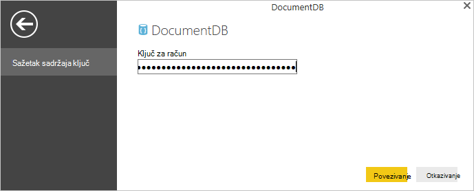

<properties
    pageTitle="Praktični vodič Power BI za poveznik DocumentDB | Microsoft Azure"
    description="Pomoću ovog praktičnog vodiča za Power BI uvoz JSON, stvaranje insightful izvješća i vizualizacija podataka pomoću poveznika DocumentDB i Power BI."
    keywords="Power bi vodič, vizualizaciju podataka, power bi poveznika"
    services="documentdb"
    authors="h0n"
    manager="jhubbard"
    editor="mimig"
    documentationCenter=""/>

<tags
    ms.service="documentdb"
    ms.workload="data-services"
    ms.tgt_pltfrm="na"
    ms.devlang="na"
    ms.topic="article"
    ms.date="09/22/2016"
    ms.author="hawong"/>

# Praktični vodič Power BI za DocumentDB: vizualizacija podataka pomoću dodatka Power BI connector

[PowerBI.com](https://powerbi.microsoft.com/) je na mrežni servis gdje možete stvoriti i zajedničko korištenje nadzornih ploča i izvješća s podatke koji su vam važne i tvrtke ili ustanove.  Power BI Desktop je namjenski alat koji omogućuje vam dohvaćanje podataka iz različitih izvora podataka, spajanje i pretvaranje podataka, stvaranje naprednih izvješća i vizualizacija i objavljivanje izvješća dodatka Power bi za stvaranje izvješća.  Najnoviju verziju dodatka Power BI Desktop, sada se možete povezati s računom DocumentDB putem DocumentDB poveznik za Power BI.   

U ovom praktičnom vodiču Power BI ne možemo prođite kroz korake za povezivanje s računom DocumentDB u Power BI Desktop, dođite do zbirke koje želimo za izdvajanje podataka pomoću navigatoru, pretvaranje JSON podataka u tabličnom obliku pomoću dodatka Power BI radna površina uređivač upita, i stvaranje i objava izvješća u PowerBI.com.

Po dovršetku ovog praktičnog vodiča za Power BI, prikazat će se moći odgovaraju na sljedeća pitanja:  

-   Kako stvarati izvješća s podacima iz DocumentDB pomoću dodatka Power BI Desktop?
-   Kako mogu povezati s računom DocumentDB u Power BI Desktop?
-   Kako dohvatiti podatke iz zbirke u Power BI Desktop?
-   Kako mogu transformirati ugniježđene JSON podataka u Power BI Desktop?
-   Kako objaviti i zajedničko korištenje Moje izvješća u PowerBI.com?

## Preduvjeti

Prije nego što slijedeći upute u ovom ćete praktičnom vodiču Power BI, provjerite možete li se sljedeće:

- [Najnoviju verziju dodatka Power BI Desktop](https://powerbi.microsoft.com/desktop).
- Pristup naš pokazni videozapis račun ili podatke u svoj račun za Azure DocumentDB.
    - Pokazni videozapis račun je popunjen vulkana podaci prikazani u ovom ćete praktičnom vodiču. Pokazni videozapis račun nije povezan po bilo kojem SLA i je namijenjena samo u svrhu pokazni.  Radimo rezervirati desno da biste izmijenite uključujući Ovaj pokazni videozapis računa, ali nije ograničena za prekidanje račun, promjene ključ, ograničavanje pristupa, promjena i brisanje podataka, u bilo kojem trenutku bez obavijesti ili razloga.
        - URL: https://analytics.documents.azure.com
        - Samo za čitanje ključ: MSr6kt7Gn0YRQbjd6RbTnTt7VHc5ohaAFu7osF0HdyQmfR + YhwCH2D2jcczVIR1LNK3nMPNBD31losN7lQ/fkw ==
    - Ili, da biste stvorili vlastiti račun, potražite u članku [Stvaranje računa DocumentDB baze podataka pomoću portala za Azure](https://azure.microsoft.com/documentation/articles/documentdb-create-account/). Zatim, da biste dobili vulkana oglednih podataka koje je slično onome što se koristi u ovom ćete praktičnom vodiču (ali ne sadrži blokova GeoJSON), potražite u članku [NOAA web-mjesta](https://www.ngdc.noaa.gov/nndc/struts/form?t=102557&s=5&d=5) i uvoz podataka pomoću [alata za migraciju podataka DocumentDB](https://azure.microsoft.com/documentation/articles/documentdb-import-data/).

Za zajedničko korištenje izvješća u PowerBI.com, morate imati račun u PowerBI.com.  Dodatne informacije o dodatku Power BI za slobodno i Power BI Pro, posjetite [https://powerbi.microsoft.com/pricing](https://powerbi.microsoft.com/pricing).

## Započnimo
U ovom ćete praktičnom vodiču recimo zamislite da su geologist učenje vulkani diljem svijeta.  Vulkana podaci se pohranjuju u DocumentDB računa i JSON dokumenti izgledaju kao jedan u nastavku.

    {
        "Volcano Name": "Rainier",
        "Country": "United States",
        "Region": "US-Washington",
        "Location": {
            "type": "Point",
            "coordinates": [
            -121.758,
            46.87
            ]
        },
        "Elevation": 4392,
        "Type": "Stratovolcano",
        "Status": "Dendrochronology",
        "Last Known Eruption": "Last known eruption from 1800-1899, inclusive"
    }

Želite dohvatiti podatke vulkana s računa za DocumentDB i vizualni prikaz podataka u interaktivnih izvješća servisa Power BI kao što je dolje.

Spremni ste za isprobajte sami? Započnimo.

1. Power BI Desktop se izvoditi na vaše radne stanice.
2. Kada se pokrene Power BI Desktop, prikazat će se na zaslonu *dobrodošlice* .

    

3. **Dohvati podatke**, potražite u članku **Nedavnim izvorima**ili **Otvaranje drugih izvješća** možete izravno na zaslonu *dobrodošlice* .  Kliknite X u gornjem desnom kutu da biste zatvorili zaslon. Prikaz **izvješća** alata Power BI Desktop se prikazuje.

    

4. Odaberite vrpce **Polazno** , a zatim kliknite **Dohvati podatke**.  Prozor za **Dohvaćanje podataka** prikazivati.

5. Kliknite na **Azure**, odaberite **Microsoft Azure DocumentDB (Beta)**i zatim kliknite **Poveži**.  Prozor za **Povezivanje za Microsoft Azure DocumentDB** prikazivati.

    

6. Navedite URL DocumentDB računa krajnja točka za dohvaćanje podataka iz kao što je prikazano u nastavku, a zatim kliknite **u redu**. Možete dohvatiti URL iz okvira URI plohu **[tipke](documentdb-manage-account.md#keys)** portala za Azure ili možete koristiti račun pokazni videozapis, u tom se slučaju je URL `https://analytics.documents.azure.com`. 

    Ostavite naziv baze podataka, naziv zbirke i SQL naredbe prazne ta polja nisu obavezna.  Umjesto toga koristit ćemo navigatoru da biste odabrali baze podataka i zbirke da biste odredili Odakle dolaze podaci.

    

7. Ako se povezujete s ovom krajnjoj točki prvi put, zatražit će se za ključ za račun.  Tipku možete dohvatiti iz okvira **Primarnog ključa** **[samo za čitanje tipke](documentdb-manage-account.md#keys)** plohu portala za Azure ili koristite račun pokazni videozapis, u kojem je predmet tipku `RcEBrRI2xVnlWheejXncHId6QRcKdCGQSW6uSUEgroYBWVnujW3YWvgiG2ePZ0P0TppsrMgscoxsO7cf6mOpcA==`. Unesite ključ za račun, a zatim kliknite **Poveži**.

    Preporučujemo da koristite samo za čitanje ključ kada stvaranje izvješća.  To će spriječiti nepotrebne izlaganje glavni ključ potencijalni sigurnosni rizik. Tipku samo za čitanje nalazi se u plohu [tipke](documentdb-manage-account.md#keys) portala za Azure ili možete koristiti podatke o računu pokazni videozapis gore navedene.

    

8. Kada uspješno je povezano s računom, pojavit će se **Navigator** .  **Navigator** prikazat će se popis baze podataka računa.
9. Kliknite, a zatim proširite stavku na bazu podataka odakle podaci za izvješće, ako koristite račun pokazni videozapis, odaberite **volcanodb**.   

10. Sada odaberite zbirke koji će dohvatiti podatke iz. Ako koristite račun pokazni videozapis, odaberite **volcano1**.

    Okno pretpregleda prikazuje popis stavki **zapis** .  Dokument predstavlja kao vrstu **zapisa** na servisu Power BI. Isto tako, ugniježđenih bloka JSON unutar dokumenta je **zapis**.

    

11. Kliknite **Uređivanje** da biste pokrenuli uređivač upita pa ćemo možete pretvaranje podataka.

## Stapanja i Pretvorba JSON dokumenata
1. U dodatku Power BI uređivač upita, trebali biste vidjeti stupca **dokumenata** središnjeg okna.

2. Kliknite expander na desnoj strani zaglavlja stupca **dokumenta** .  Pojavit će se Kontekstni izbornik s popisa polja.  Odaberite polja potrebnih za izvješće, na primjer, vulkana naziv, države, regija, mjesto, visinu, vrsta, Status i zadnji erupcija informacije, a zatim **u redu**.

    

3. U oknu centra za prikazat će se pretpregled rezultata s poljima odabrana.

    

4. U našem primjeru svojstvo mjesta je GeoJSON blok u dokumentu.  Kao što vidite, mjesto predstavlja se kao vrstu **zapisa** u Power BI Desktop.  
5. Kliknite expander na desnoj strani zaglavlja stupca mjesto.  Kontekstni izbornik s poljima Vrsta i koordinate će se pojaviti.  Pogledajmo koordinate polje pa kliknite **u redu**.

    

6. U oknu centra sada prikazuje koordinate stupac vrste **popisa** .  Kao što je prikazano na početku vodič GeoJSON ovog praktičnog vodiča podaci vrste točku zemljopisnu širinu i dužinu vrijednostima naveden u polju koordinate.

    Element koordinate [0] predstavlja dužinu dok koordinate [1] predstavlja zemljopisnu širinu.
    

7. Da biste stopi koordinate polja, ne možemo će stvoriti **Prilagođeni stupac** pod nazivom LatLong.  Odaberite **Dodaj stupac** vrpce pa kliknite **Dodaj stupac Prilagođeno**.  Prozor **Dodavanje prilagođenog stupca** prikazivati.

8. Navedite naziv za novi stupac, primjerice LatLong.

9. Nakon toga Navedite prilagođeni formulu za novi stupac.  Naš, primjerice, ne možemo će concatenate zemljopisnu širinu i dužinu vrijednosti odvojene zarezom, kao što je prikazano u nastavku pomoću sljedeće formule: `Text.From([Document.Location.coordinates]{1})&","&Text.From([Document.Location.coordinates]{0})`. Kliknite **u redu**.

    Dodatne informacije na analizu podataka izraza (DAX) uključujući DAX funkcije, posjetite [DAX osnovni u Power BI Desktop](https://support.powerbi.com/knowledgebase/articles/554619-dax-basics-in-power-bi-desktop).

    

10. Sada središnjeg okna prikazivat će se novi stupac LatLong popunjen zemljopisnu širinu i dužinu vrijednosti odvojenih zarezom.

    

    Ako primite poruku o pogrešci u novi stupac, provjerite je li da odgovara primijenjena korake u odjeljku postavke upita na slici u nastavku:

    

    Ako je vaš korak razlikuju, izbrišite dodatni koraci i pokušajte ponovno Dodavanje prilagođenog stupca. 

11. Ne možemo sada ste izvršili stapanja podatke u tabličnom obliku.  Možete pod utjecajem sve značajke dostupne u uređivaču upita oblik i pretvaranje podataka u DocumentDB.  Ako koristite uzorka, promijenite vrstu podataka za povećanje **cijeli** broj tako da promijenite **Vrstu podataka** na vrpci **Početna stranica** .

    

12. Kliknite **Zatvori i Primijeni** da biste spremili podatkovnog modela.

    

## Stvaranje izvješća
Power BI radna površina mikrofonom je gdje mogu početi stvarati izvješća vizualni prikaz podataka.  Mogućnost stvaranja izvješća povlačenjem i ispuštanjem polja u područje crtanja **izvješća** .

U prikazu izvješća, trebali biste pronašli:

 1. Okno **polja** to je mjesto vidjet ćete popis podatkovni modeli pomoću polja možete koristiti za izvješća.

 2. Okno **vizualizacije** . Izvješća mogu sadržavati jedan ili više vizualizacija.  Odaberite vizualni vrste prilagođavanje vašim potrebama iz okna **vizualizacije** .

 3. Područje crtanja **izvješća** , to je gdje će sastavljanje poboljšanjima za izvješća.

 4. Stranica **izvješća** . Možete dodati više stranica izvješća u Power BI Desktop.

Na sljedećoj je slici prikazan osnovne korake u stvaranju jednostavne interaktivnih izvješća prikaz karte.

1. Za našeg primjera smo će stvoriti prikaz karte pokazivanje mjesta svaki vulkana.  U oknu **vizualizacije** kliknite karta vizualne vrste kao što je istaknuta u snimku zaslona koja se nalazi iznad.  Trebali biste vidjeti vizualna vrsta karte Bojanja u području crtanja **izvješća** .  Okno **vizualizacije** treba prikazati skup svojstava koja se odnose na vrstu vizualne karta.

2. Sada, povucite i ispustite polja LatLong iz okna **polja** da biste svojstvo **mjesta** u oknu **vizualizacije** .
3. Nakon toga povucite i ispustite polje Naziv vulkana svojstvo **legende** .  

4. Nakon toga povucite i ispustite polja povećavanjem svojstvo **Veličina** .  

5. Sada trebali biste vidjeti kartu vizualne prikazuje skup s mjehurićima koji označava mjesto svaki vulkana veličina mjehurića correlating povećavanjem vulkana.

6. Sada stvorite osnovno izvješće.  Izvješće možete dodatno prilagoditi dodavanjem dodatnih vizualizacija.  U našem slučaju dodali smo vulkana vrsta rezača da bi se interaktivnih izvješća.  

    

## Objavljivanje i zajedničko korištenje izvješća
Da biste omogućili zajedničko korištenje izvješća, morate imati račun u PowerBI.com.

1. U Power BI Desktop, kliknite na vrpci **Početna stranica** .
2. Kliknite **Objavi**.  Zatražit će se da unesete korisničko ime i lozinku za račun PowerBI.com.
3. Kada je provjerena autentičnost vjerodajnicu, izvješće je objavljeno na odredište koje ste odabrali.
4. Kliknite **Otvori 'PowerBITutorial.pbix' u dodatku Power BI** da biste vidjeli i zajedničko korištenje izvješća na PowerBI.com.

    

## Stvaranje nadzorne ploče u PowerBI.com

Sad kad ste izvješća, omogućuje zajedničko korištenje na PowerBI.com

Kad objavite izvješća iz dodatka Power BI Desktop da biste PowerBI.com, generira **izvješće** i **skupa podataka** na klijentu PowerBI.com. Ako, na primjer, nakon što ste objavili izvješća pod nazivom **PowerBITutorial** PowerBI.com, vidjet ćete PowerBITutorial u odjeljcima **izvješća** i **skupova podataka** na PowerBI.com.

   

Da biste stvorili zajedničko korištenje nadzorne ploče, kliknite gumb **Stranice Live PIN-a** na PowerBI.com izvješća.

   

Zatim slijedite upute u [PIN-a na pločici iz izvješća](https://powerbi.microsoft.com/documentation/powerbi-service-pin-a-tile-to-a-dashboard-from-a-report/#pin-a-tile-from-a-report) da biste stvorili novu nadzornu ploču. 

Ad-hoc izmjene izvješća možete učiniti i prije stvaranja nadzorne ploče. Međutim, preporučuje se da izvršite željene promjene i ponovno objaviti izvješće da biste PowerBI.com koristite Power BI Desktop.

## Osvježavanje podataka u PowerBI.com

Da biste osvježili podatke, ad-hoc i zakazani na dva načina.

Ad-hoc Osvježi, jednostavno kliknite eclipses (...) tako da u **skupu podataka**, primjerice PowerBITutorial. Trebali biste vidjeti popis akcija uključujući **Osvježi odmah**. Kliknite **Osvježi odmah** da biste osvježili podatke.

Zakazano osvježavanje, učinite sljedeće:

1. Kliknite **Raspored osvježavanja** na popisu akcija. 
    

2. Na stranici s **postavkama** proširite **vjerodajnica za izvor podataka**. 

3. Kliknite **Uređivanje vjerodajnice**. 

    Pojavit će se skočni prozor za konfiguriranje. 

4. Unesite ključ za povezivanje s računom DocumentDB za taj skup podataka, a zatim kliknite **Prijava**. 

5. Proširite **Zakaži osvježavanje** i postavite željeni raspored osvježavanja skupu podataka. 
  
6. Kliknite **Primijeni** i završite postavljanje zakazano osvježavanje.

## Daljnji koraci
- Dodatne informacije o dodatku Power BI potražite u članku [Početak rada s dodatkom Power BI](https://powerbi.microsoft.com/documentation/powerbi-service-get-started/).
- Dodatne informacije o DocumentDB potražite u [dokumentaciji DocumentDB odredišne stranice](https://azure.microsoft.com/documentation/services/documentdb/).
