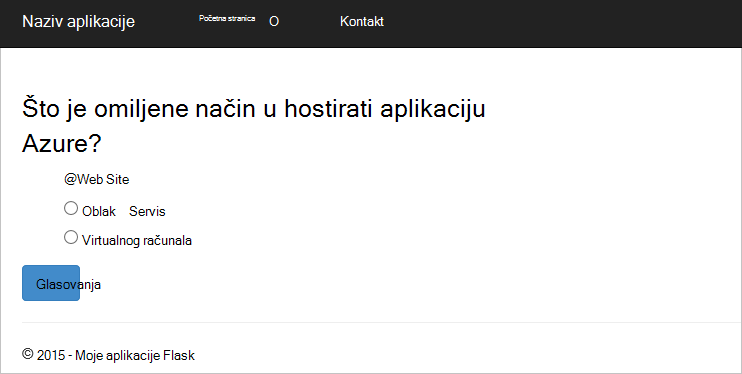
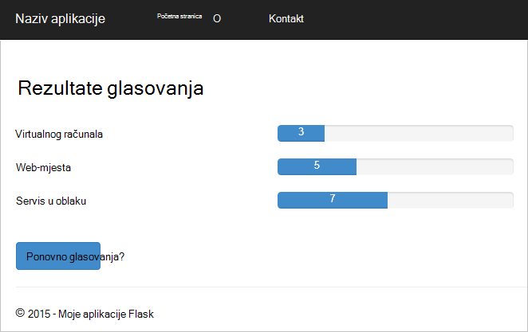

<properties
    pageTitle="Python Flask web-aplikacije razvoju s DocumentDB | Microsoft Azure"
    description="Pročitajte članak vodič za bazu podataka o korištenju DocumentDB pohranu i dohvaćanje podataka iz web-aplikacije Python Flask hostirane na Azure. Pronađite rješenja za razvoj aplikacija." 
    keywords="Razvoj aplikacija, vodič baze podataka, python flask, python web-aplikaciju, python web-razvoju, documentdb, azure, Microsoft azure"
    services="documentdb"
    documentationCenter="python"
    authors="syamkmsft"
    manager="jhubbard"
    editor="cgronlun"/>

<tags
    ms.service="documentdb"
    ms.workload="data-management"
    ms.tgt_pltfrm="na"
    ms.devlang="python"
    ms.topic="hero-article"
    ms.date="08/25/2016"
    ms.author="syamk"/>

# <a name="python-flask-web-application-development-with-documentdb"></a>Razvoj aplikacija Python Flask Web s DocumentDB

> [AZURE.SELECTOR]
- [.NET](documentdb-dotnet-application.md)
- [Node.js](documentdb-nodejs-application.md)
- [Java](documentdb-java-application.md)
- [Python](documentdb-python-application.md)

U ovom ćete praktičnom vodiču saznati kako koristiti Azure DocumentDB za pohranu i podataka programa access iz programa Python web-aplikacija koje se nalaze na Azure i presumes imate iskustva prethodnog pomoću Python i Azure web-mjesta.

Pomoću ovog praktičnog vodiča baze podataka obuhvaća:

1. Stvaranje i dodjeljivanje DocumentDB računa.
2. Stvaranje aplikacije Python MVC.
3. Povezivanje i pomoću Azure DocumentDB iz web-aplikacije.
4. Implementacija web-aplikaciji Azure web-mjesta.

Slijedeći ovog praktičnog vodiča će izrađivati jednostavne glasovanje aplikacije koja omogućuje glasati za ankete.


## <a name="database-tutorial-prerequisites"></a>Preduvjeti za vodiča baze podataka

Prije nego što slijedeći upute u ovom članku, potrebno je provjeriti imate li instalirano sljedeće:

- Aktivni Azure račun. Ako nemate račun, možete stvoriti besplatnu probnu računa u samo nekoliko minuta. Detalje potražite u članku [Azure besplatnu probnu verziju](https://azure.microsoft.com/pricing/free-trial/).
- [Visual Studio 2013](http://www.visualstudio.com/) ili noviji, ili [Visual Studio Express](), što je besplatna verzija. Upute u ovom ćete praktičnom vodiču zapisuju posebno za Visual Studio 2015. 
- Alati Python za Visual Studio iz [GitHub](http://microsoft.github.io/PTVS/). Pomoću ovog praktičnog vodiča koristi Python alate za dodavanje veze za VANJSKIH 2015. 
- Azure Python SDK za Visual Studio, verzija 2,4 ili novija verzija nudi [azure.com](https://azure.microsoft.com/downloads/). Koristi Microsoft Azure SDK za Python 2.7.
- Python 2.7 iz [python.org][2]. Koristi Python 2.7.11. 

> [AZURE.IMPORTANT] Ako instalirate Python 2.7, provjerite je li na zaslonu Prilagodba Python 2.7.11 odaberite **Dodavanje python.exe put**.
> 
>    

- Microsoft Visual C++ Compiler za Python 2.7 iz [Microsoftova centra za preuzimanje][3].

## <a name="step-1-create-a-documentdb-database-account"></a>Korak 1: Stvaranje računa DocumentDB baze podataka

Započnimo stvaranjem DocumentDB računa. Ako već imate postavljen račun, možete preskočiti [Korak 2: Stvaranje novog web-aplikacije Python Flask](#step-2:-create-a-new-python-flask-web-application).

[AZURE.INCLUDE [documentdb-create-dbaccount](../../includes/documentdb-create-dbaccount.md)]

<br/>
Ne možemo sada će voditi kroz stvaranje nove web-aplikacije Python Flask na prema gore.

## <a name="step-2-create-a-new-python-flask-web-application"></a>Korak 2: Stvaranje nove Python Flask web-aplikacije

1. U Visual Studio, na izborniku **datoteka** , pokažite na **Novo**, a zatim **projekta**.

    Pojavit će se dijaloški okvir **Novi projekt** .

2. U lijevom oknu proširite **Predlošci** , a zatim **Python**, a zatim **Web**. 

3. Odaberite **Flask Web Project** u oknu centra u **ime** okvir vrsta **Praktični vodič**, a zatim **u redu**. Imajte na umu da nazivi paketa Python treba mala slova, kao što je opisano u [Stilu Python koda](https://www.python.org/dev/peps/pep-0008/#package-and-module-names).

    Za one novi korisnik Python Flask, je razvoj framework aplikacije web koji olakšava stvaranje web-aplikacije Python brže.

    

4. U prozoru **Python Alati za Visual Studio** kliknite **Instaliraj u okruženje virtualne**. 

    

5. U prozoru **Dodavanje virtualne okruženje** možete prihvatiti zadane postavke i koristiti Python 2.7 kao osnovni okruženje jer PyDocumentDB trenutno ne podržava Python 3.x, a zatim kliknite **Stvori**. Postavlja potrebna okruženje virtualne Python projekta.

    

    U izlaznom prozoru prikazuje `Successfully installed Flask-0.10.1 Jinja2-2.8 MarkupSafe-0.23 Werkzeug-0.11.5 itsdangerous-0.24 'requirements.txt' was installed successfully.` kada je uspješno instaliran okruženje.

## <a name="step-3-modify-the-python-flask-web-application"></a>Korak 3: Izmjena Python Flask web-aplikacije

### <a name="add-the-python-flask-packages-to-your-project"></a>Dodajte pakete Python Flask projekta

Nakon postavljanja projekta, morat ćete dodajte potrebne pakete Flask projekta, uključujući pydocumentdb, Python paket za DocumentDB.

1. U pregledniku rješenja, otvorite datoteku pod nazivom **requirements.txt** i zamijenite sadržaj sljedeće:

        flask==0.9
        flask-mail==0.7.6
        sqlalchemy==0.7.9
        flask-sqlalchemy==0.16
        sqlalchemy-migrate==0.7.2
        flask-whooshalchemy==0.55a
        flask-wtf==0.8.4
        pytz==2013b
        flask-babel==0.8
        flup
        pydocumentdb>=1.0.0

2. Spremite datoteku **requirements.txt** . 
3. U pregledniku rješenja, desnom tipkom miša kliknite **env** , a zatim kliknite **Instaliraj s requirements.txt**.

    

    Nakon uspješne instalacije u izlaznom prozoru prikazuje sljedeće:

        Successfully installed Babel-2.3.2 Tempita-0.5.2 WTForms-2.1 Whoosh-2.7.4 blinker-1.4 decorator-4.0.9 flask-0.9 flask-babel-0.8 flask-mail-0.7.6 flask-sqlalchemy-0.16 flask-whooshalchemy-0.55a0 flask-wtf-0.8.4 flup-1.0.2 pydocumentdb-1.6.1 pytz-2013b0 speaklater-1.3 sqlalchemy-0.7.9 sqlalchemy-migrate-0.7.2

    > [AZURE.NOTE] U koje se rijetko pojavljuju se slučajevima možda će prikazati pogrešku u izlaznom prozoru. Ako se to dogodi, potvrdite okvir ako su pogreške vezane uz čišćenje diska. Ponekad ne uspije za čišćenje diska, ali instalacije i dalje neće biti uspješan (Pomicanje prema gore u izlaznom prozoru da biste to provjerili). Možete provjeriti instalaciju provjerom [virtualne okruženju](#verify-the-virtual-environment). Ako instalacija nije uspjela, ali je provjera uspješna, nije u redu da biste nastavili.

### <a name="verify-the-virtual-environment"></a>Provjerite je li okruženje virtualne

Pogledajmo provjerite je li sve što je li instaliran pravilno.

1. Stvaranje rješenja pritiskom na kombinaciju tipki **Ctrl**+**Shift**+**B**.
2. Nakon uspješnog sastavljanje započnite na web-mjestu pritiskom na tipku **F5**. Pokreće poslužitelj za razvoj Flask i pokreće web-pregledniku. Trebali biste vidjeti sljedeće stranice.

    

3. Zaustavite traženje pogrešaka na web-mjestu pritiskom na kombinaciju tipki **Shift**+**F5** u Visual Studio.

### <a name="create-database-collection-and-document-definitions"></a>Stvaranje baze podataka, zbirke i definicije dokumenta

Sada stvaranje glasovanje aplikacije dodavanjem nove datoteke i ažuriranjem drugim korisnicima.

1. U pregledniku rješenja, desnom tipkom miša kliknite projekt **Praktični vodič** , kliknite **Dodaj**i zatim kliknite **Nova stavka**. Odaberite **Prazan Python datoteku** i dajte naziv datoteci **forms.py**.  
2. Dodajte sljedeći kod forms.py datoteku, a zatim spremite datoteku.

```python
from flask.ext.wtf import Form
from wtforms import RadioField

class VoteForm(Form):
    deploy_preference  = RadioField('Deployment Preference', choices=[
        ('Web Site', 'Web Site'),
        ('Cloud Service', 'Cloud Service'),
        ('Virtual Machine', 'Virtual Machine')], default='Web Site')
```


### <a name="add-the-required-imports-to-viewspy"></a>Dodavanje potrebnih uvozi views.py

1. U pregledniku rješenja, proširite mapu **vodič** i otvorite datoteku **views.py** . 
2. Dodajte sljedeće uvoz naredbe na vrh **views.py** datoteku, a zatim spremite datoteku. Te uvesti PythonSDK DocumentDB korisnika i Flask paketa.

    ```python
    from forms import VoteForm
    import config
    import pydocumentdb.document_client as document_client
    ```


### <a name="create-database-collection-and-document"></a>Stvaranje baze podataka, zbirke i dokumenta

- Ne napuštajući **views.py**, dodajte sljedeći kod na kraj datoteke. To vodi brigu o stvaranja baze podataka koja se koristi obrazac. Nemojte brisati bilo koji od postojećih kod u **views.py**. Jednostavno dodati to do kraja.

```python
@app.route('/create')
def create():
    """Renders the contact page."""
    client = document_client.DocumentClient(config.DOCUMENTDB_HOST, {'masterKey': config.DOCUMENTDB_KEY})

    # Attempt to delete the database.  This allows this to be used to recreate as well as create
    try:
        db = next((data for data in client.ReadDatabases() if data['id'] == config.DOCUMENTDB_DATABASE))
        client.DeleteDatabase(db['_self'])
    except:
        pass

    # Create database
    db = client.CreateDatabase({ 'id': config.DOCUMENTDB_DATABASE })

    # Create collection
    collection = client.CreateCollection(db['_self'],{ 'id': config.DOCUMENTDB_COLLECTION })

    # Create document
    document = client.CreateDocument(collection['_self'],
        { 'id': config.DOCUMENTDB_DOCUMENT,
          'Web Site': 0,
          'Cloud Service': 0,
          'Virtual Machine': 0,
          'name': config.DOCUMENTDB_DOCUMENT 
        })

    return render_template(
       'create.html',
        title='Create Page',
        year=datetime.now().year,
        message='You just created a new database, collection, and document.  Your old votes have been deleted')
```

> [AZURE.TIP] Način **CreateCollection** uzima neobavezno **RequestOptions** kao parametar trećeg. To se može koristiti da biste naveli vrstu nude zbirke. Ako se dodjeljuje vrijednost offerType, zatim zbirke stvorit će se pomoću zadanih nude vrsta. Dodatne informacije o vrstama nude DocumentDB potražite u članku [performanse razine u DocumentDB](documentdb-performance-levels.md).


### <a name="read-database-collection-document-and-submit-form"></a>Čitanje baze podataka, zbirke dokumenata i slanje obrasca

- Ne napuštajući **views.py**, dodajte sljedeći kod na kraj datoteke. To vodi brigu o postavljanje na obrascu za čitanje baze podataka, zbirke i dokumenata. Nemojte brisati bilo koji od postojećih kod u **views.py**. Jednostavno dodati to do kraja.

```python
@app.route('/vote', methods=['GET', 'POST'])
def vote(): 
    form = VoteForm()
    replaced_document ={}
    if form.validate_on_submit(): # is user submitted vote  
        client = document_client.DocumentClient(config.DOCUMENTDB_HOST, {'masterKey': config.DOCUMENTDB_KEY})

        # Read databases and take first since id should not be duplicated.
        db = next((data for data in client.ReadDatabases() if data['id'] == config.DOCUMENTDB_DATABASE))

        # Read collections and take first since id should not be duplicated.
        coll = next((coll for coll in client.ReadCollections(db['_self']) if coll['id'] == config.DOCUMENTDB_COLLECTION))

        # Read documents and take first since id should not be duplicated.
        doc = next((doc for doc in client.ReadDocuments(coll['_self']) if doc['id'] == config.DOCUMENTDB_DOCUMENT))

        # Take the data from the deploy_preference and increment our database
        doc[form.deploy_preference.data] = doc[form.deploy_preference.data] + 1
        replaced_document = client.ReplaceDocument(doc['_self'], doc)

        # Create a model to pass to results.html
        class VoteObject:
            choices = dict()
            total_votes = 0

        vote_object = VoteObject()
        vote_object.choices = {
            "Web Site" : doc['Web Site'],
            "Cloud Service" : doc['Cloud Service'],
            "Virtual Machine" : doc['Virtual Machine']
        }
        vote_object.total_votes = sum(vote_object.choices.values())

        return render_template(
            'results.html', 
            year=datetime.now().year, 
            vote_object = vote_object)

    else :
        return render_template(
            'vote.html', 
            title = 'Vote',
            year=datetime.now().year,
            form = form)
```


### <a name="create-the-html-files"></a>Stvaranje HTML datoteke

1. U Eksploreru za rješenja u mapi **Praktični vodič** , desnom tipkom miša kliknite mapu **Predlošci** , kliknite **Dodaj**i zatim kliknite **Nova stavka**. 
2. Odaberite **HTML stranice**, a zatim u okvir Naziv upišite **create.html**. 
3. Ponovite korake od 1 i 2 da biste stvorili dvije dodatne HTML datoteke: results.html i vote.html.
4. Dodavanje koda za sljedeće **create.html** u na `<body>` element. Prikazuje poruku koju smo stvorili novu bazu podataka, zbirke i dokumenata.

    ```html
    
    
    <h2>{{ title }}.</h2>
    <h3>{{ message }}</h3>
    <p><a href="{{ url_for('vote') }}" class="btn btn-primary btn-large">Vote &raquo;</a></p>
    
    ```

5. Dodavanje koda za sljedeće **results.html** u na `<body`> element. Prikazuje rezultate ankete.

    ```html
    
    
    <h2>Results of the vote</h2>
        <br />
        
    
    <div class="row">
        <div class="col-sm-5">{{choice}}</div>
            <div class="col-sm-5">
                <div class="progress">
                    <div class="progress-bar" role="progressbar" aria-valuenow="{{vote_object.choices[choice]}}" aria-valuemin="0" aria-valuemax="{{vote_object.total_votes}}" style="width: {{(vote_object.choices[choice]/vote_object.total_votes)*100}}%;">
                                {{vote_object.choices[choice]}}
                </div>
            </div>
            </div>
    </div>
    
    
    <br />
    <a class="btn btn-primary" href="{{ url_for('vote') }}">Vote again?</a>
    
    ```

6. Dodavanje koda za sljedeće **vote.html** u na `<body`> element. Prikazuje ankete i prihvaća na glasova. Za registriranje na glasova, kontrole se prenosi views.py koje ćemo će prepoznaje glumcima glasovanja i dodavati dokument sukladno tome.

    ```html
    
    
    <h2>What is your favorite way to host an application on Azure?</h2>
    <form action="" method="post" name="vote">
        {{form.hidden_tag()}}
            {{form.deploy_preference}}
            <button class="btn btn-primary" type="submit">Vote</button>
    </form>
    
    ```

7. U mapi **Predlošci** zamijenite sadržaj **index.html** sljedeće. To služi kao odredišna stranica za svoju aplikaciju.
    
    ```html
    
    
    <h2>Python + DocumentDB Voting Application.</h2>
    <h3>This is a sample DocumentDB voting application using PyDocumentDB</h3>
    <p><a href="{{ url_for('create') }}" class="btn btn-primary btn-large">Create/Clear the Voting Database &raquo;</a></p>
    <p><a href="{{ url_for('vote') }}" class="btn btn-primary btn-large">Vote &raquo;</a></p>
    
    ```

### <a name="add-a-configuration-file-and-change-the-initpy"></a>Konfiguracijska datoteka za dodavanje i promjena u \_ \_init\_\_.py

1. U pregledniku rješenja, desnom tipkom miša kliknite **vodič** projekta kliknite **Dodaj**, kliknite **Nova stavka**, odaberite **Prazna Python datoteka**, a zatim dajte naziv datoteci **config.py**. U ovom konfiguracijskoj datoteci potreban je obrazaca u Flask. Možete je koristiti možete unijeti kao i tajnu ključ. Ovaj ključ nije potreban za ovaj vodič kroz.

2. Dodati sljedeći kod config.py, morat ćete promijeniti vrijednosti **DOCUMENTDB\_glavno računalo** i **DOCUMENTDB\_KLJUČ** u sljedećem koraku.

    ```python
    CSRF_ENABLED = True
    SECRET_KEY = 'you-will-never-guess'
    
    DOCUMENTDB_HOST = 'https://YOUR_DOCUMENTDB_NAME.documents.azure.com:443/'
    DOCUMENTDB_KEY = 'YOUR_SECRET_KEY_ENDING_IN_=='
    
    DOCUMENTDB_DATABASE = 'voting database'
    DOCUMENTDB_COLLECTION = 'voting collection'
    DOCUMENTDB_DOCUMENT = 'voting document'
    ```

3. [Portal za Azure](https://portal.azure.com/)dođite do **tipke** plohu tako da kliknete **Pregled**, **DocumentDB račune**, dvokliknite naziv računa za korištenje, a zatim gumb **tipke** u području **Essentials** . U plohu **tipke** kopirajte vrijednost **URI** ga i zalijepite datoteke **config.py** kao vrijednost u **DOCUMENTDB\_glavno računalo** svojstvo. 
4. Ponovno Azure portalu plohu **tipke** kopiranje vrijednosti za **Primarni ključ** ili **Sekundarni ključ**i zalijepiti ga u datoteku **config.py** kao vrijednost za u **DOCUMENTDB\_KLJUČ** svojstvo.
5. U u ** \_ \_init\_\_.py** datoteke, dodajte sljedeći redak. 

        app.config.from_object('config')

    Da bi sadržaj datoteke:

    ```python
    from flask import Flask
    app = Flask(__name__)
    app.config.from_object('config')
    import tutorial.views
    ```

6. Kad dodate sve datoteke, preglednik rješenja trebao bi izgledati ovako:

    


## <a name="step-4-run-your-web-application-locally"></a>Korak 4: Izvodi lokalno web-aplikacije

1. Stvaranje rješenja pritiskom na kombinaciju tipki **Ctrl**+**Shift**+**B**.
2. Nakon uspješnog sastavljanje započnite na web-mjestu pritiskom na tipku **F5**. Trebali biste vidjeti sljedeće na zaslonu.

    

3. Kliknite **Stvori/čišćenje glasovanja baze podataka** da biste generirali bazu podataka.

    

4. Nakon toga kliknite **glasovanja** i odaberite mogućnosti.

    

5. Za svaku glasovanja ste na anketu, prelazi odgovarajuće brojač.

    

6. Zaustavite ispravljanje pogrešaka projekta pritiskom na kombinaciju tipki Shift + F5.

## <a name="step-5-deploy-the-web-application-to-azure-websites"></a>Korak 5: Implementacija web-aplikaciju za web-mjesta za Azure

Sad kad imate potpuni računala radi ispravno u odnosu na DocumentDB, ne možemo ćete to implementirati Azure web-mjesta.

1. Desnom tipkom miša kliknite projekta u programu Explorer rješenje (Provjerite je li se i dalje izvodi lokalno), a zatim odaberite **Objavi**.  

    

2. U prozoru za **Objavljivanje Web** odaberite **Microsoft Azure web-aplikacije**, a zatim kliknite **Dalje**.

    

3. U prozoru **Microsoft Azure Web Apps prozora** kliknite **Novo**.

    

4. U prozoru za **Stvaranje web-mjestu Microsoft Azure** unesite **naziv aplikacije na web-mjesta**, **aplikacije servisa za planiranje**, **grupa resursa**i **regija**, a zatim kliknite **Stvori**.

    

5. U prozoru **Web objavljivanje** kliknite **Objavi**.

    

3. U nekoliko sekundi Visual Studio će završiti objavljivanje web-aplikacije i pokretanje preglednika prikazuju se pri ruci rad sa servisu Azure!

## <a name="troubleshooting"></a>Otklanjanje poteškoća

Ako je ovo prvi aplikaciju Python naiđete na vašem računalu, provjerite je li su uključeni u varijablu put sljedeće mape (ili mjesta ekvivalentan instalacije):

    C:\Python27\site-packages;C:\Python27\;C:\Python27\Scripts;

Ako primite poruku o pogrešci na stranici glasovanja i nazivu projekta brojem koji nije **Praktični vodič**, provjerite je li ** \_ \_init\_\_.py** odnosi naziv odgovarajuće projekta u retku: `import tutorial.view`.

## <a name="next-steps"></a>Daljnji koraci

Čestitamo! Samo dovršite prvi Python web-aplikacije pomoću Azure DocumentDB i objaviti na web-mjesta Azure.

Ne možemo ažutirati i poboljšati u ovoj se temi često na temelju povratne informacije.  Nakon provođenja vodič, provjerite pomoću gumba za glasovanje na vrhu i dnu ove stranice, a svakako uvrstite povratne informacije na što unijeli poboljšanja koje želite vidjeti. Želite li nam da biste izravno obratiti, slobodno da biste dodali adrese e-pošte u svoje komentare.

Da biste dodali dodatne funkcije web-aplikacije, pročitajte članak API-ji dostupni u [DocumentDB Python SDK](documentdb-sdk-python.md).

Dodatne informacije o Azure, Visual Studio i Python potražite u članku [Centar za razvojne inženjere Python](https://azure.microsoft.com/develop/python/). 

Vodiči za za dodatni Python Flask potražite u članku [u Flask Mega-praktičnom vodiču dio I: pozdrav, svijete!](http://blog.miguelgrinberg.com/post/the-flask-mega-tutorial-part-i-hello-world). 

  [Visual Studio Express]: http://www.visualstudio.com/products/visual-studio-express-vs.aspx
  [2]: https://www.python.org/downloads/windows/
  [3]: https://www.microsoft.com/download/details.aspx?id=44266
  [Microsoft Web Platform Installer]: http://www.microsoft.com/web/downloads/platform.aspx
  [Azure portal]: http://portal.azure.com
