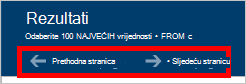

<properties
    pageTitle="Upit DocumentDB Explorer: SQL upita uređivaču | Microsoft Azure"
    description="Saznajte više o DocumentDB Explorer upita programa za uređivanje SQL upita na portalu za Azure za pisanje SQL upite i pokretanje ih protiv NoSQL DocumentDB zbirke."
    keywords="pisanje sql upitima sql uređivača upita"
    services="documentdb"
    authors="kirillg"
    manager="jhubbard"
    editor="monicar"
    documentationCenter=""/>

<tags
    ms.service="documentdb"
    ms.workload="data-services"
    ms.tgt_pltfrm="na"
    ms.devlang="na"
    ms.topic="article"
    ms.date="08/30/2016"
    ms.author="kirillg"/>

# Pisanje, uređivanje i pokretanje upita SQL za DocumentDB pomoću programa Explorer upita 

Ovaj članak sadrži pregled sustava [Microsoft Azure DocumentDB](https://azure.microsoft.com/services/documentdb/) Explorer upita Azure portala alat koji omogućuje pisanje, uređivanje i izvoditi SQL upite na [DocumentDB zbirke](documentdb-create-collection.md).

1. Na portalu Azure u Jumpbar, kliknite **DocumentDB (NoSQL)**. Ako **DocumentDB (NoSQL)** nije vidljivo, kliknite **Više servisa** , a zatim kliknite **DocumentDB (NoSQL)**.

2. Na izborniku resursa kliknite **Explorer upita**. 

    

3. U plohu **Explorer upita** odaberite upita **baze podataka** i **zbirki** s padajućeg popisa i upišite upit za pokretanje. 

    Padajuće popise **baze podataka** i **zbirki** već biti popunjena ovisno o kontekstu pokretanja upita Explorer. 

    Zadani upit `SELECT TOP 100 * FROM c` navedeni.  Možete prihvatiti zadani upit ili sastavljanje vlastitog upita pomoću jezika SQL upita opisan u [SQL upita cheat lista](documentdb-sql-query-cheat-sheet.md) ili članak [SQL upita i njegova SQL sintaksa](documentdb-sql-query.md) .

    Kliknite da biste vidjeli rezultate **pokretanja upita** .

    

4. Plohu **rezultata** prikazuje rezultat upita. 

    

## Rad s rezultatima

Prema zadanim postavkama Explorer upit vraća rezultate u skupovima od 100.  Ako upit proizvodi više od 100 rezultate, jednostavno koristite naredbe **Sljedeća stranica** ili **Prethodna stranica** da biste se kretali skup rezultata.

Za uspješan upite, okno s **podacima** sadrži metriku kao što je trošak zahtjev, broj zaokružiti trips upit unijeli, skup rezultata koji se trenutno prikazuje, i postoje li više rezultata, koji se zatim može pristupiti putem naredbu **Sljedeća stranica** , kao što je već rečeno.

## Korištenje većeg broja upita

Ako koristite više upita, a da biste se brzo prebacili između njih, koje unesite sve upite u okvir tekst upita plohu **Explorer upita** , a zatim isticanje onaj koji želite pokrenuti, a zatim **pokrenite upit** za prikaz rezultata.

## Dodavanje upita iz datoteke u uređivaču upita SQL

Možete učitati sadržaj postojeću datoteku pomoću naredbe za **Učitavanje datoteka** .

## Rješavanje problema

Ako upit dovrši s pogreškama, upit Explorer prikazuje popis pogrešaka koje omogućuju s otklanjanjem poteškoća naporima.

## Pokrenite DocumentDB SQL upite izvan portala

Explorer upita na portalu za Azure je samo jedan od načina izvoditi SQL upite na DocumentDB. Možete i pokrenuti SQL upita pomoću [REST API -JA](https://msdn.microsoft.com/library/azure/dn781481.aspx) ili [klijenta SDK-ovi](documentdb-sdk-dotnet.md). Dodatne informacije o korištenju ove metode potražite u članku [izvođenje SQL upita](documentdb-sql-query.md#executing-sql-queries)

## Daljnji koraci

Dodatne informacije o gramatike DocumentDB SQL podržani u programu Explorer upita potražite u članku [SQL upita i njegova SQL sintaksa](documentdb-sql-query.md) ili ispisati [SQL upita cheat lista](documentdb-sql-query-cheat-sheet.md).
Uživajte i eksperimentiranja s [Playground upita](https://www.documentdb.com/sql/demo) gdje možete testirajte upita putem uzorka skup podataka.
