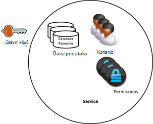
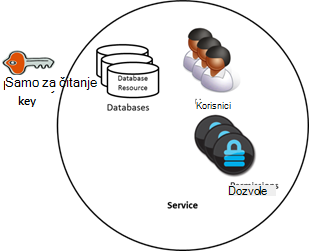
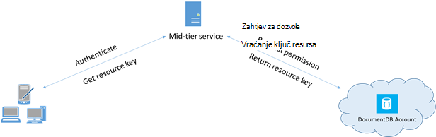

<properties 
    pageTitle="Saznajte kako siguran pristup s podacima u DocumentDB | Microsoft Azure" 
    description="Saznajte više o koncepte kontrole programa access u DocumentDB, uključujući matrica tipki, tipke samo za čitanje, korisnici i dozvole." 
    services="documentdb" 
    authors="kiratp" 
    manager="jhubbard" 
    editor="monicar" 
    documentationCenter=""/>

<tags 
    ms.service="documentdb" 
    ms.workload="data-services" 
    ms.tgt_pltfrm="na" 
    ms.devlang="na" 
    ms.topic="article" 
    ms.date="09/19/2016" 
    ms.author="kipandya"/>

# Zaštita pristup podacima DocumentDB

Ovaj članak sadrži pregled zaštita pristup podataka pohranjenih u [Programu Microsoft Azure DocumentDB](https://azure.microsoft.com/services/documentdb/).

Kad pročitate ovaj pregled ćete je moći odgovaraju na sljedeća pitanja:  

-   Što su tipke matrica DocumentDB?
-   Što su tipke DocumentDB samo za čitanje?
-   Što su DocumentDB resursa tokeni?
-   Kako koristiti DocumentDB korisnici i dozvole za zaštitu pristupa podacima DocumentDB?

## Koncepti za kontrolu pristupa DocumentDB

DocumentDB nudi prve klase koncepti za kontrolu pristupa resursima DocumentDB.  U svrhu u ovoj se temi DocumentDB Resursi su grupirane u dviju kategorija:

- Administrativni resursi
    - Računa
    - Baze podataka
    - Korisnik
    - Dozvole
- Resursi za aplikaciju
    - Zbirka
    - Ponude
    - Dokument
    - Privitak
    - Pohranjena procedura
    - Pokretanje
    - Korisnički definirana funkcija

U kontekstu tih dviju kategorija, DocumentDB podržava tri vrste osobe kontrole programa access: račun administrator, administrator samo za čitanje i korisnik baze podataka.  Prava za svakog korisnika kontrola pristupa su:
 
- Administratorski račun: puni pristup svim resursa (administratora i aplikacije) navedeni DocumentDB subjekta.
- Administrator samo za čitanje: samo za čitanje pristup svim resursa (administratora i aplikacije navedene DocumentDB subjekta. 
- Korisnik baze podataka: resursa za korisnika u DocumentDB pridružene određeni skup DocumentDB baze podataka resursa (npr. zbirke dokumenata, skripte).  Može imati jednu ili više korisnika resursa povezan s određenom bazom podataka i resursa svaki korisnik može imati jednu ili više dozvole povezane s njom.

S ispunjavaju prethodno navedene kategorije i resursima na umu, model kontrole pristupa DocumentDB definira tri vrste konstrukta programa access:

- Matrica ključevi: nakon stvaranja računa DocumentDB, se stvaraju dvije tipke matrica (primarnih i sekundarnih).  Ove tipke omogućiti potpuni Administrativni pristup svim resursima subjekta DocumentDB.

- Samo za čitanje ključevi: nakon stvaranja računa DocumentDB, se stvaraju dvije tipke samo za čitanje (primarnih i sekundarnih).  Ove tipke omogućuju pristup svim resursima subjekta DocumentDB samo za čitanje.

- Tokeni resursa: resursa token je pridružen resursa DocumentDB dozvola i snima odnos između korisnika baze podataka i dozvole se taj korisnik ima određenog DocumentDB aplikacije resursa (npr. zbirke, dokument).

## Rad s tipkama DocumentDB glavne i samo za čitanje

Kao što je rečeno ranije, DocumentDB matrica tipke omogućuju potpuni Administrativni pristup svim resursima unutar DocumentDB račun, dok je samo za čitanje tipke omogućuju pristup čitanju, pristup svim resursima unutar račun.  Sljedeće koda prikazuje kako koristiti krajnjoj točki DocumentDB računa i glavni ključ možete stvoriti instancu programa DocumentClient i stvoriti novu bazu podataka. 

    //Read the DocumentDB endpointUrl and authorization keys from config.
    //These values are available from the Azure Classic Portal on the DocumentDB Account Blade under "Keys".
    //NB > Keep these values in a safe and secure location. Together they provide Administrative access to your DocDB account.
    
    private static readonly string endpointUrl = ConfigurationManager.AppSettings["EndPointUrl"];
    private static readonly SecureString authorizationKey = ToSecureString(ConfigurationManager.AppSettings["AuthorizationKey"]);
        
    client = new DocumentClient(new Uri(endpointUrl), authorizationKey);
    
    // Create Database
    Database database = await client.CreateDatabaseAsync(
        new Database
        {
            Id = databaseName
        });

## Pregled DocumentDB resursa tokena

Koristite token resursa (stvaranjem DocumentDB korisnici i dozvole) kada želite li omogućiti pristup resursima na vašem računu DocumentDB klijentu koji se radi o nepouzdanoj s glavnog ključa. Matrica ključeva DocumentDB obuhvaćaju i primarnih i sekundarnih ključ, od kojih svaka daje Administrativni pristup vaš račun i sve resurse u njoj. Će se nešto ključeva matrica otvorit će se vaš račun za mogućnost nastanka zlonamjerni ili negligent upotrebu. 

Isto tako, DocumentDB samo za čitanje ključevi omogućuje pristup čitanju, pristup svim resursima - osim resurse za dozvolu, naravno - DocumentDB subjekta i ne može se koristiti da biste omogućili precizniji pristup određene DocumentDB resursima.

Tokeni resursa DocumentDB omogućuju sigurno zamjenski tekst koji klijentima omogućuje čitanje, pisanje i brisanje resursa na vašem računu DocumentDB ovisno o dozvolama koje ste izdaje i bez potrebe za matricu ili čitanje samo ključa.

Evo uzorak standardne dizajn što tokeni resursa možda ste tražili, generira i isporučuju klijenti:

1. Usred sloju servis postavljen za mobilnu aplikaciju za zajedničko korištenje fotografije korisnika.
2. Servis usred sloju sadrži sadrže glavni ključ računa DocumentDB.
3. Aplikacija fotografije je instalirana na mobilnim uređajima za krajnjeg korisnika. 
4. Na prijava, aplikaciju fotografiju uspostavlja identitet korisnika sa servisom usred sloju. U ovom mehanizam uspostavljanje identiteta je isključivo do aplikacija.
5. Uspostavljanja identiteta servisa usred sloju zahtjeva za dozvole na temelju identitet.
6. Servis usred sloju šalje resursa token natrag u mobilnoj aplikaciji.
7. Aplikaciju telefon možete nastaviti koristiti token resursa da biste izravno pristupali DocumentDB resursi s dozvolama definirani token resursa i intervalu dopušteno mjerodavnim token resursa. 
8. Kada istekne token resursa daljnji zahtjevi primit će 401 neovlašteno iznimke.  Sada mobilnoj aplikaciji ponovno uspostavlja identitet i zahtjeve novi token resursa.

## Rad s DocumentDB korisnici i dozvole
Resurs za korisnika DocumentDB povezan je s bazom podataka DocumentDB.  Svaki baze podataka može sadržavati nula ili više korisnika DocumentDB.  Sljedeći isječak koda pokazuje kako stvoriti korisnički resurs DocumentDB.

    //Create a user.
    User docUser = new User
    {
        Id = "mobileuser"
    };

    docUser = await client.CreateUserAsync(UriFactory.CreateDatabaseUri("db"), docUser);

> [AZURE.NOTE] Svaki korisnik DocumentDB ima svojstvo PermissionsLink kojih je moguće dohvatiti popis dozvole povezane s korisnikom.

Resurs dozvola DocumentDB povezan je s DocumentDB korisnika.  Svaki korisnik može sadržavati nula ili više DocumentDB dozvole.  Resurs dozvola omogućuje pristup sigurnosnog tokena koje korisnik mora prilikom pokušaja pristup resursu za određenu aplikaciju.
Postoje dvije razine dostupne access koje možda nudi dozvola resursa:

- Sve: Korisnik s dozvolom za potpunu resurs
- Čitanje: Korisnik može samo čitati sadržaj resursa no ne može izvršiti pisanja, ažuriranje ili operacija brisanja resurs.

> [AZURE.NOTE] Da biste pokrenuli DocumentDB pohranjene procedure korisnika morate imati dozvolu za sve u zbirci u kojem će se izvoditi pohranjena procedura.

Sljedeći isječak koda pokazuje kako stvoriti resurs dozvola, pročitajte token resursa resursa dozvola i pridružiti dozvole na korisnički stvorenim iznad.

    // Create a permission.
    Permission docPermission = new Permission
    {
        PermissionMode = PermissionMode.Read,
        ResourceLink = documentCollection.SelfLink,
        Id = "readperm"
    };
            
  docPermission = await klijenta. CreatePermissionAsync (UriFactory.CreateUserUri ("db", "korisnik"), docPermission) Console.WriteLine (docPermission.Id + "ima token:" + docPermission.Token);
  
Ako ste naveli particija ključ za svoju zbirku, a zatim dozvole za zbirku, dokument i privitak resursi mora obuhvaćati ResourcePartitionKey osim na ResourceLink.

Da bi se jednostavno dobili sve dozvole resurse povezan s određenom korisniku, čini DocumentDB dostupne dozvole sažetka sadržaja za svaki korisnik objekt.  Sljedeći isječak koda pokazuje kako dohvatiti dozvola pridruženih korisnički stvorenim iznad, slaganje popisa dozvola i stvoriti nove DocumentClient ime korisnika.

    //Read a permission feed.
    FeedResponse<Permission> permFeed = await client.ReadPermissionFeedAsync(
      UriFactory.CreateUserUri("db", "myUser"));

    List<Permission> permList = new List<Permission>();
      
    foreach (Permission perm in permFeed)
    {
        permList.Add(perm);
    }
            
    DocumentClient userClient = new DocumentClient(new Uri(endpointUrl), permList);

> [AZURE.TIP] Tokeni resursa imaju valjane vremenski raspon u zadanom od jednog sata.  Tokena vijek, no možda izričito navesti, najviše 5 sati.

## Daljnji koraci

- Da biste saznali više o DocumentDB, kliknite [ovdje](http://azure.com/docdb).
- Da biste saznali više o upravljanju tipke matrice i samo za čitanje, kliknite [ovdje](documentdb-manage-account.md).
- Da biste saznali kako se izgraditi DocumentDB autorizacije tokena, kliknite [ovdje](https://msdn.microsoft.com/library/azure/dn783368.aspx)
 
