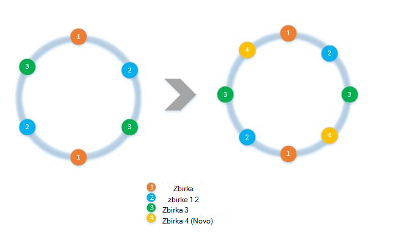
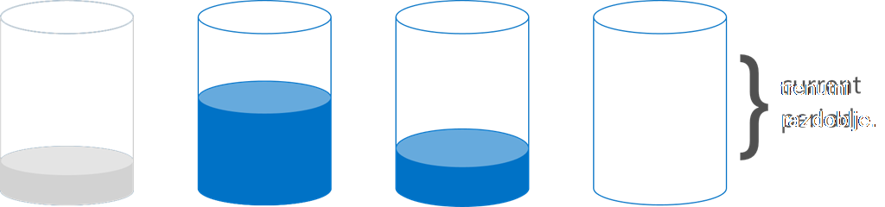

<properties 
    pageTitle="Kako implementirati klijent strani particija s na SDK-ovi | Microsoft Azure" 
    description="Saznajte kako koristiti u Azure DocumentDB SDK-ovi na zahtjeve za podatke i usmjeravanje particija (shard) u više zbirkama" 
    services="documentdb" 
    authors="arramac" 
    manager="jhubbard" 
    editor="cgronlun" 
    documentationCenter=""/>

<tags 
    ms.service="documentdb" 
    ms.workload="data-services" 
    ms.tgt_pltfrm="na" 
    ms.devlang="na" 
    ms.topic="article" 
    ms.date="10/27/2016" 
    ms.author="arramac"/>

# <a name="how-to-partition-data-using-client-side-support-in-documentdb"></a>Kako particija podataka pomoću klijentsko podrška u DocumentDB

Azure DocumentDB podržava [Automatsko particija zbirki](documentdb-partition-data.md). No postoje slučajevi koristi gdje je korisno precizno grained kontrolu nad particija ponašanje. Da biste smanjili standardni koda potrebnog za particija zadataka, ste dodali smo funkcionalnost u .NET, Node.js i Java SDK-ovi koji olakšava stvaranje aplikacije koje skalirana preko više zbirki.

U ovom se članku smo ćete pogledajte klase i sučelja u .NET SDK i kako ih možete koristiti za razvoj particioniranom aplikacije. Ostale SDK-ovi poput Java, Node.js i Python podržava slične sučelja i načina za klijentsko particija.

## <a name="client-side-partitioning-with-the-documentdb-sdk"></a>Klijentsko particija s DocumentDB SDK

Prije nego što smo pristupili ostalim particija, recimo recap neki osnovni koncepti DocumentDB koje se odnose na particija. Svaki račun za Azure DocumentDB bazi podataka sastoji se od skupa baze podataka, svaki koja sadrži više zbirki, od kojih svaki može sadržavati pohranjene procedure, okidača, UDF-ove, dokumenata i povezanih privici. Zbirke mogu jednom ili particioniranom same i imaju sljedeća svojstva:

- Zbirke nude odvajanja performansi. Dakle postoji pogodnost performanse u collating sličnim dokumentima u istoj zbirci. Na primjer, za vrijeme niz podataka, možda ćete morati smjestiti podatke za prošli mjesec, koji se često mu, unutar zbirke s veću propusnost dodijeljenu dok starijim podacima smješten unutar zbirke s malom dodijeljenu propusnost.
- ACID transakcije odnosno pohranjene procedure i okidača ne može obuhvaćati zbirku. Transakcije imaju ograničen prikaz samo unutar vrijednost ključa jedan particija unutar zbirke.
- Zbirke nametnuti shemu, tako da se koristi za dokumente JSON iste vrste ili različite vrste.

Počevši od verzije [1.5.x Azure DocumentDB SDK-ovi](documentdb-sdk-dotnet.md), možete izvršiti operacije dokument izravno u odnosu na bazu podataka. Interno [DocumentClient](https://msdn.microsoft.com/library/azure/microsoft.azure.documents.client.documentclient.aspx) koristi PartitionResolver koje ste naveli za bazu podataka na zahtjeve za usmjeravanje odgovarajuće zbirke.

>[AZURE.NOTE] [Poslužiteljsko particija](documentdb-partition-data.md) uvedena u OSTALE API 2015-12-16 i SDK-ovi 1.6.0+ deprecates pristup Razrješavanje klijentsko particija za slučaj da se jednostavno koristi. Klijentsko particija no je fleksibilnije i omogućuje kontrolu performanse odvajanja preko particija tipke, odrediti stupanj parallelism tijekom čitanja rezultata s više particija i koristiti raspon/prostorno particija pristupa nasuprot raspršivanje.

Ako, na primjer, u .NET, svaki PartitionResolver predmete je konkretni implementaciji sustava [IPartitionResolver](https://msdn.microsoft.com/library/azure/microsoft.azure.documents.client.ipartitionresolver.aspx) sučelja koja ima tri načina – [GetPartitionKey](https://msdn.microsoft.com/library/azure/microsoft.azure.documents.client.ipartitionresolver.getpartitionkey.aspx), [ResolveForCreate](https://msdn.microsoft.com/library/azure/microsoft.azure.documents.client.ipartitionresolver.resolveforcreate.aspx) i [ResolveForRead](https://msdn.microsoft.com/library/azure/microsoft.azure.documents.client.ipartitionresolver.resolveforread.aspx). Upiti LINQ i ReadFeed iterators interno upotrijebite metodu ResolveForRead za sve zbirke koji odgovara particija ključu za zahtjev za ponavljanje. Isto tako, stvorite operacije koristi metodu ResolveForCreate za usmjeravanje stvara radi desnom particije. Nema potrebne za Zamijeni promjena, brisanje i pročitajte Budući da koriste dokumente koje već sadrže referencu odgovarajuće zbirke.

U SDK-ovi uključuje i dva klase koji podržavaju dva Kanonski stvaranje particija tehnike, raspršivanje i raspon pretraživanja putem [HashPartitionResolver](https://msdn.microsoft.com/library/azure/microsoft.azure.documents.partitioning.hashpartitionresolver.aspx) i [RangePartitionResolver](https://msdn.microsoft.com/library/azure/mt126047.aspx). Pomoću ove klase jednostavno dodavanje logike za stvaranje particija aplikacije.  

## <a name="add-partitioning-logic-and-register-the-partitionresolver"></a>Dodavanje logike za stvaranje particija i registrirati u PartitionResolver 

Evo isječak s prikazom načina za stvaranje [HashPartitionResolver](https://msdn.microsoft.com/library/azure/microsoft.azure.documents.partitioning.hashpartitionresolver.aspx) i morate registrirati DocumentClient za bazu podataka.

```cs
// Create some collections to partition data.
DocumentCollection collection1 = await client.CreateDocumentCollectionAsync(...);
DocumentCollection collection2 = await client.CreateDocumentCollectionAsync(...);

// Initialize a HashPartitionResolver using the "UserId" property and the two collection self-links.
HashPartitionResolver hashResolver = new HashPartitionResolver(
    u => ((UserProfile)u).UserId, 
    new string[] { collection1.SelfLink, collection2.SelfLink });

// Register the PartitionResolver with the database.
this.client.PartitionResolvers[database.SelfLink] = hashResolver;

```

## <a name="create-documents-in-a-partition"></a>Stvaranje dokumenata u particije  

Kada je registrirana na PartitionResolver, na raspolaganju vam stvara i upitima izravno u odnosu na bazu podataka kao što je prikazano u nastavku. U ovom primjeru SDK koristi u PartitionResolver za izdvajanje na korisnički ID, raspršivanja ga, a zatim koristi tu vrijednost da biste usmjerili operacija stvaranja na odgovarajuće zbirke.

```cs
Document johnDocument = await this.client.CreateDocumentAsync(
    database.SelfLink, new UserProfile("J1", "@John", Region.UnitedStatesEast));
Document ryanDocument = await this.client.CreateDocumentAsync(
    database.SelfLink, new UserProfile("U4", "@Ryan", Region.AsiaPacific, UserStatus.AppearAway));
```

## <a name="create-queries-against-partitions"></a>Stvaranje upita na temelju particije  

Upit možete poslati pomoću metode [CreateDocumentQuery](https://msdn.microsoft.com/library/azure/microsoft.azure.documents.linq.documentqueryable.createdocumentquery.aspx) Prenos u bazu podataka i ključa particije. Upit vraća jedan skup rezultata preko svih zbirki baze podataka koje mapiraju tipku particija.  

```cs
// Query for John's document by ID - uses PartitionResolver to restrict the query to the partitions 
// containing @John. Again the query uses the database self link, and relies on the hash resolver 
// to route the appropriate collection.
var query = this.client.CreateDocumentQuery<UserProfile>(
    database.SelfLink, null, partitionResolver.GetPartitionKey(johnProfile))
    .Where(u => u.UserName == "@John");
johnProfile = query.AsEnumerable().FirstOrDefault();
```

## <a name="create-queries-against-all-collections-in-the-database"></a>Stvaranje upite odabiranja sve zbirke u bazi podataka 

Upit sve zbirke baze podataka i Nabrajanje rezultate kao što je prikaz ispod, prema preskakanje argument ključa particije.

```cs
// Query for all "Available" users. Here since there is no partition key, the query is serially executed 
// across each partition/collection and returns a single result-set. 
query = this.client.CreateDocumentQuery<UserProfile>(database.SelfLink)
    .Where(u => u.Status == UserStatus.Available);
foreach (UserProfile activeUser in query)
{
    Console.WriteLine(activeUser);
}
```

## <a name="hash-partition-resolver"></a>Raspršivanje particija prevoditelja
S raspršivanje particija, particije dodjeljuju na temelju vrijednosti u funkciji raspršivanje omogućujući vam da biste ravnomjerno raspodijelite zahtjeve i podataka Broj particije. Taj se način obično se koristi za particija podatke proizvodi ili potrošena s mnogo različitih klijenata i korisne su za spremanje korisničkih profila, stavki kataloga i IoT ("Internet od što") telemetrijskih podataka. Raspršivanje particija koristi DocumentDB na strani poslužitelja stvaranje particija podršku unutar zbirke.

**Raspršivanje Partitioning:**


Jednostavan raspršivanje particija shemu u zbirkama *N* bi da biste stvorili neki dokument, izračunati *hash(d) mod N* da biste utvrdili koji zbirka je potvrdili. Dok je problem s ove tehnike jednostavne da ga ne funkcionira dobro kada dodajete nove zbirke, ili uklanjanje zbirke kao što je to je potrebna gotovo sve podatke koje želite dohvatiti reshuffled. [Dosljedan raspršivanje] (http://citeseerx.ist.psu.edu/viewdoc/summary?doi=10.1.1.23.3738) je dobro poznatog algoritam koje rješava taj implementacijom raspršivanje shemu nužne premještanje podataka obavezan tijekom dodavanjem ili uklanjanjem zbirke.

Klase [HashPartitionResolver](https://msdn.microsoft.com/library/azure/microsoft.azure.documents.partitioning.hashpartitionresolver.aspx) implementira logike da biste sastavili dosljedan raspršivanje Nazovi preko funkciju raspršivanje naveden u sučelju [IHashGenerator](https://msdn.microsoft.com/library/azure/microsoft.azure.documents.partitioning.ihashgenerator.aspx) . Prema zadanim postavkama, u HashPartitionResolver koristi funkciji raspršivanje MD5, ali to izgleda Zamijeni i s raspršivanje implementaciju. Na HashPartitionResolver interno stvara 16 raspršivanja ili "virtualne čvorove" unutar Nazovi Raspršivanje za svaku zbirku da biste postigli jednolikiji distribucije skupa dokumenata preko zbirke, ali mogu se razlikovati taj broj za trgovinu isključivanje podataka asimetriju iznosom izračuni strani klijenta.

**Dosljedno raspršivanje s HashPartitionResolver:**


## <a name="range-partition-resolver"></a>Razrješavanje particija raspona

U rasponu particija, particije dodjeljuju ovisno o tome je li tipku particija unutar određenog raspona. To je obično koristi za particija sa svojstvima vremenske oznake (npr., eventTime između tra 1, 2015 i tra 14, 2015). Klase [RangePartitionResolver](https://msdn.microsoft.com/library/azure/mt126047.aspx) pomaže održavati mapiranja između raspona\<T\> i zbirka koja se sama veza. 

[Raspon\<T\> ](https://msdn.microsoft.com/library/azure/mt126048.aspx) je jednostavno klase koja upravlja raspona sve vrste koje implementirati IComparable\<T\> i IEquatable\<T\> kao što su nizovi ili brojeve. Za čita i stvara, možete proslijediti u bilo kojem proizvoljne rasponu, a na Razrješavanje označava sve zbirke kandidata tako da odredite raspone particije koje se ne sijeku tražene raspona. Ta je funkcija može biti korisna prilikom izvršavanja raspon upite odabiranja podataka niza vremena.

**U rasponu particija:**  

  

Posebne slova raspon particija je kada je raspon samo jednu samostalni vrijednost, ponekad se zove "pretraživanja particija". To se najčešće koristi za particija po regijama (npr. particija Skandinavije sadrži Norveška, Danska i Švedska) ili particija klijenata u aplikaciji za više korisnika.

## <a name="samples"></a>Uzorci 

Pogledajte [Github uzoraka particija DocumentDB projekta](https://github.com/Azure/azure-documentdb-dotnet/tree/287acafef76ad223577759b0170c8f08adb45755/samples/code-samples/Partitioning) koji sadrži koda za korištenje ove PartitionResolvers i proširivanje ih možete implementirati vlastite resolvers tako da stane određene korištenje slučajevima, kao što je sljedeća: 

* Kako odrediti proizvoljne lambda izraz za GetPartitionKey i pomoću implementirati složenih ključeva za stvaranje particija ili drugačije particija različite vrste objekata.
* Kako stvoriti jednostavan [LookupPartitionResolver](https://github.com/Azure/azure-documentdb-dotnet/blob/287acafef76ad223577759b0170c8f08adb45755/samples/code-samples/Partitioning/Partitioners/LookupPartitionResolver.cs) koju koristi tablica za ručno traženje za izvođenje particija. Ovaj uzorak obično se koristi za particija samostalni vrijednosti kao što su regija, ID klijenta ili aplikacija na temelju naziva.
* Kako stvoriti [ManagedPartitionResolver](https://github.com/Azure/azure-documentdb-dotnet/blob/287acafef76ad223577759b0170c8f08adb45755/samples/code-samples/Partitioning/Partitioners/ManagedHashPartitionResolver.cs) koji stvara zbirke automatski na temelju predloška koji definira shemu imenovanja, IndexingPolicy i pohranjene procedure koji moraju biti registriran u odnosu na nove zbirke.
* Kako stvoriti shemu manje [SpilloverPartitionResolver](https://github.com/Azure/azure-documentdb-dotnet/blob/287acafef76ad223577759b0170c8f08adb45755/samples/code-samples/Partitioning/Partitioners/SpilloverPartitionResolver.cs) koju jednostavno stvara nove zbirke kao stari zbirke popuniti.
* Kako se Serijalizacija i ukloniti serijski broj stanje PartitionResolver kao JSON, tako da možete zajednički koristiti između procesa i preko isključivanje računala. Zadržava te u config datoteke ili čak i u zbirci DocumentDB.
* [DocumentClientHashPartitioningManager](https://github.com/Azure/azure-documentdb-dotnet/blob/287acafef76ad223577759b0170c8f08adb45755/samples/code-samples/Partitioning/Util/DocumentClientHashPartitioningManager.cs) klase za dinamično Dodavanje i uklanjanje particije s bazom podataka particije na temelju dosljedan raspršivanje. Interno koristi [TransitionHashPartitionResolver](https://github.com/Azure/azure-documentdb-dotnet/blob/287acafef76ad223577759b0170c8f08adb45755/samples/code-samples/Partitioning/Partitioners/TransitionHashPartitionResolver.cs) usmjeravanje čitanja i pisanja tijekom migracije pomoću jednog od četiri načina rada – čitanje iz stare stvaranje particija shema (ReadCurrent), novi (ReadNext), spajanje rezultate iz obje (ReadBoth) ili nedostupan tijekom migracije (ništa).

Primjere su Otvori izvor i Pozivamo vas slanje zahtjeva za istaknuti prilozima koji nije moguće koristiti druge DocumentDB razvojnim inženjerima. Pogledajte [doprinos smjernice](https://github.com/Azure/azure-documentdb-net/blob/master/Contributing.md) za upute za suradnju.  

>[AZURE.NOTE] Stvara zbirke su stopa-ograničeno DocumentDB, tako da neke od metoda uzorka što je prikazano ovdje može potrajati nekoliko minuta.

##<a name="faq"></a>NAJČEŠĆA PITANJA
**DocumentDB podržava poslužiteljsko particija?**

Da, DocumentDB podržava [poslužiteljsko particija](documentdb-partition-data.md). DocumentDB podržava i klijentsko particija putem resolvers klijentsko particija za naprednije korištenje slučajeve.

**Kada koristiti poslužiteljsko nasuprot klijentsko particija?**
Većina korištenje slučajeva, preporučujemo korištenje poslužiteljsko particija jer je rukovanja administrativne zadatke particija podataka i zahtjevi za usmjeravanje. Međutim, ako trebate particija u rasponu ili ste slučaja specijalizirane koristi za performanse odvajanja različite vrijednosti particija tipke, zatim klijentsko particija možda najbolji način.

**Kako Dodavanje i uklanjanje Zbirka za moj shema particioniranja?**

Pogledajte implementacije DocumentClientHashPartitioningManager u programu project uzoraka primjer kako biste mogli implementirati ponovnog particioniranja.

**Kako održati ili Moje stvaranje particija konfiguracije za zajedničko korištenje s drugim klijentskim programima?**

Možete serijalizirati stanje partitioner kao JSON i spremiti u konfiguraciji datoteke ili čak i unutar zbirke DocumentDB. Pogledajte metodu RunSerializeDeserializeSample u programu project uzoraka primjer.

**Kako lanac različite tehnike za stvaranje particija?**

Možete povezati u lanac PartitionResolvers implementacijom vlastite IPartitionResolver koji interno koristi jedan ili više postojećih resolvers. Pogledajte TransitionHashPartitionResolver u programu project uzoraka primjer.

##<a name="references"></a>Reference
* [Poslužiteljsko particija u DocumentDB](documentdb-partition-data.md)
* [DocumentDB zbirke i performanse razine](documentdb-performance-levels.md)
* [Stvaranje particija primjere koda na Github](https://github.com/Azure/azure-documentdb-dotnet/tree/287acafef76ad223577759b0170c8f08adb45755/samples/code-samples/Partitioning)
* [DocumentDB .NET SDK dokumentaciji na MSDN](https://msdn.microsoft.com/library/azure/dn948556.aspx)
* [Uzorci DocumentDB .NET](https://github.com/Azure/azure-documentdb-net)
* [Ograničenja DocumentDB](documentdb-limits.md)
* [Savjeti za DocumentDB Blog na performanse](https://azure.microsoft.com/blog/2015/01/20/performance-tips-for-azure-documentdb-part-1-2/)
 
