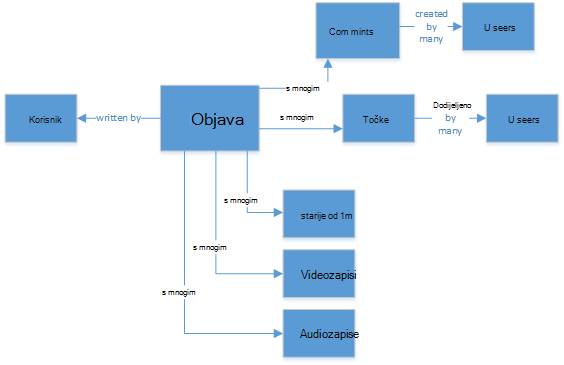
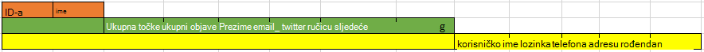
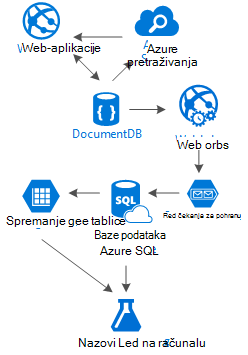

<properties 
    pageTitle="Uzorak DocumentDB dizajna: aplikacija društvenih mreža | Microsoft Azure" 
    description="Saznajte više o uzorak dizajna za društvenih mreža tako da korištenje prostora za pohranu fleksibilnost DocumentDB i drugim servisima za Azure." 
    keywords="aplikacija društvenih mreža"
    services="documentdb" 
    authors="ealsur" 
    manager="jhubbard" 
    editor="" 
    documentationCenter=""/>

<tags 
    ms.service="documentdb" 
    ms.workload="data-services" 
    ms.tgt_pltfrm="na" 
    ms.devlang="na" 
    ms.topic="article" 
    ms.date="09/27/2016" 
    ms.author="mimig"/>

# Odlazak društvenih s DocumentDB

Living u na massively povezana društva, to znači da u nekom trenutku u životu ćete postati **društvene mreže**. Koristimo društvenih mreža u suradnji s prijateljima, suradnicima, obitelji ili ponekad zajedničko korištenje naša strast s osobama sa zajedničkim interesima.

Kao inženjeri ili razvojnim inženjerima, ne možemo možda imaju wondered kako te mreže pohranu i interconnect oglednim podacima, ili možda ste čak i su tasked za stvaranje ili mijenjanje arhitekture novi društvene mreže za tržište određene niche yourselves. Kada je prevelik pitanje nastaje: kako se te podatke pohranjene?

Pretpostavimo da stvaranje nove i sjajan društvenu mrežu, gdje naš korisnicima možete objaviti članaka s odgovarajuće multimedijske kao što su slike, videozapise ili čak i glazbu. Korisnici mogu komentirati objave i dati točke za ocjena. Prikazat će se sažetak sadržaja objave koje će korisnici vidjeti i moći raditi s na odredišna stranica glavnom web-mjesta. To ne zvuk zaista složene (isprva) radi jednostavnosti, recimo onemogućuje postoji (smo nije delve u sažecima sadržaja korisnička utječe odnosi, ali premašuje cilj ovog članka).

Dakle, kako ne možemo pohranjuje to i mjesto?

Mnoge od vas može imati sučelje na baze podataka SQL ili barem notion od [relacijski Modeliranje podataka](https://en.wikipedia.org/wiki/Relational_model) , a može pokrenuti crtež otprilike ovako:

 

Struktura podataka savršeno normaliziranu i pretty... koji ne skaliranja. 

Ne, mi se pogrešan koje ste radili s bazama podataka SQL moj život, oni su odlične, ali kao što su platforme svaki uzorak, vježbe i softver nije savršen za svaki scenarij.

Zašto nije SQL najbolji odabir u ovom scenariju? Pogledajmo strukturu objavu jedan ako mogu istaknuti da biste prikazali taj unos u web-mjesto ili aplikaciju, želite li se učinite upit s... 8 spojeva tablice (!) samo da bi se prikazala jedan jedan poštanski, sada slike strujanje objave koje dinamički učitavanje i prikazuju se na zaslonu, a možda će se prikazati mjesto ću.

Nije moguće, Naravno, koristimo humongous SQL instanca s dovoljno power da biste riješili tisuće upiti s mnogo date da bi služio sadržaj, ali zapravo su jednostavni, zašto ne možemo bi kada postoji jednostavniji rješenja?

## Cesta NoSQL

Postoje baze podataka posebno grafikona koje možete [pokrenuti na Azure](http://neo4j.com/developer/guide-cloud-deployment/#_windows_azure) , no oni su jeftini i potreban IaaS services (Infrastruktura kao-na-usluga, virtualnim strojevima uglavnom) i održavanje. Ću usmjerite članka na donjem trošak rješenja koja će funkcionirati u većini scenarija koji se izvode na baze podataka, Azure NoSQL [DocumentDB](https://azure.microsoft.com/services/documentdb/). Korištenje [NoSQL](https://en.wikipedia.org/wiki/NoSQL) pristup, pohranjivanje podataka JSON OSNOVNI oblik i Primjena [denormalization](https://en.wikipedia.org/wiki/Denormalization)naš prethodno složene objavu možete pretvoriti u jedan [dokument](https://en.wikipedia.org/wiki/Document-oriented_database):

    {
        "id":"ew12-res2-234e-544f",
        "title":"post title",
        "date":"2016-01-01",
        "body":"this is an awesome post stored on NoSQL",
        "createdBy":User,
        "images":["http://myfirstimage.png","http://mysecondimage.png"],
        "videos":[
            {"url":"http://myfirstvideo.mp4", "title":"The first video"},
            {"url":"http://mysecondvideo.mp4", "title":"The second video"}
        ],
        "audios":[
            {"url":"http://myfirstaudio.mp3", "title":"The first audio"},
            {"url":"http://mysecondaudio.mp3", "title":"The second audio"}
        ]
    }

Te ga možete preuzeti s jednom upita, i ne spojeva. Ovo je vrlo jednostavne i jasan i budget-wise, bit će potrebno manje resursa da biste postigli boljih rezultata.

Azure DocumentDB jamči da sve svojstva indeksiraju s njegova [automatsko indeksiranje](documentdb-indexing.md), koje možete čak i se [prilagoditi](documentdb-indexing-policies.md). Omogućuje pristup sheme slobodno nam Pohranjujte dokumente s različitim i dinamički strukture, možda sutra želimo objava koje će se popis kategorija ili hashtags povezana s njima, DocumentDB će obrađivati nove dokumente s dodanim atributima s dodatni rad potrebnih us.

Komentari na objavu se smatrati samo druge objave uz svojstvo nadređenog (pojednostavljuje naš mapiranje objekta). 

    {
        "id":"1234-asd3-54ts-199a",
        "title":"Awesome post!",
        "date":"2016-01-02",
        "createdBy":User2,
        "parent":"ew12-res2-234e-544f"
    }

    {
        "id":"asd2-fee4-23gc-jh67",
        "title":"Ditto!",
        "date":"2016-01-03",
        "createdBy":User3,
        "parent":"ew12-res2-234e-544f"
    }

Te se sve interakcije društvenih mogu pohraniti na zasebni objekt kao mjerača:

    {
        "id":"dfe3-thf5-232s-dse4",
        "post":"ew12-res2-234e-544f",
        "comments":2,
        "likes":10,
        "points":200
    }

Stvaranje sažetaka sadržaja samo pitanje je stvaranje dokumenata koji mogu sadržavati popis objava ID-a s određenom važnosti redoslijed:

    [
        {"relevance":9, "post":"ew12-res2-234e-544f"},
        {"relevance":8, "post":"fer7-mnb6-fgh9-2344"},
        {"relevance":7, "post":"w34r-qeg6-ref6-8565"}
    ]

Imamo još "najnovije" strujanje objavama poredane po datumu stvaranja, "sigurnije" strujanje te objavama s više oznake sviđanja u zadnja 24 sata, ne možemo nije čak i implementirati prilagođeni strujanje za svakog korisnika koji se temelji na logiku kao što su prate i interesima i će i dalje biti popis članaka. Je pitanje sastavljanje te popise, ali performanse čitanje ostaje unhindered. Kada ćemo dobiti jednu od ovih popisa, ne možemo problema jedan upita da biste DocumentDB pomoću na [IN operator](documentdb-sql-query.md#where-clause) da biste dobili stranica članaka odjednom.

Sažetaka sadržaja strujanja se nije ugrađena pomoću [Servisa Azure aplikacije Services'](https://azure.microsoft.com/services/app-service/) pozadinski procesi: [Webjobs](../app-service-web/web-sites-create-web-jobs.md). Nakon stvaranja objavu pozadinska obrada može aktivirati pomoću [Prostora za pohranu Azure](https://azure.microsoft.com/services/storage/) [redovima](../storage/storage-dotnet-how-to-use-queues.md) i Webjobs aktivira pomoću [Azure Webjobs SDK](../app-service-web/websites-dotnet-webjobs-sdk.md), implementacijom prijenos objavu unutar strujanja koji se temelji na vlastitu prilagođenu logika. 

Točke i oznaka sviđanja na objavu možete biti obuhvaćene odgođena način pomoću ovog istu tehniku radi stvaranja naposljetku dosljedan okruženja.

Koje slijede su trickier. DocumentDB je ograničenje veličine dokumenta od 512Kb tako da mogu razmislite o pohrani prate kao dokument s sljedeću strukturu:

    {
        "id":"234d-sd23-rrf2-552d",
        "followersOf": "dse4-qwe2-ert4-aad2",
        "followers":[
            "ewr5-232d-tyrg-iuo2",
            "qejh-2345-sdf1-ytg5",
            //...
            "uie0-4tyg-3456-rwjh"
        ]
    }

To može funkcionirati za korisnika s nekoliko tisućica koje slijede, ali ako neki celebrity spaja naš sortira, to će pristup na koncu kliknite veličina kapaciteta dokumenta.

Da biste to riješili, koristimo mješovitom pristup. Ne možemo pohranjujete broj prate kao dio dokumenta Statistički podaci o korisnicima:

    {
        "id":"234d-sd23-rrf2-552d",
        "user": "dse4-qwe2-ert4-aad2",
        "followers":55230,
        "totalPosts":452,
        "totalPoints":11342
    }

Te se stvarni grafikon prate mogu pohraniti na Azure spremišta tablica pomoću datotečni [nastavak](https://github.com/richorama/AzureStorageExtensions#azuregraphstore) koja omogućuje jednostavno "A-prati-B" prostora za pohranu i dohvaćanje. Na taj način ne možemo možete delegirati ograničenu postupka Dohvaćanje popisa točno prate (kada je potrebna) koji je tablica Azure prostora za pohranu, ali za pretraživanje brzi brojeva, ne možemo nastaviti koristiti DocumentDB.

## "Vrh ljestava" dupliciranje uzorak i podataka

Kao što je možda ste primijetili u dokumentu JSON koja se odnosi na objavu, nema više pojavljivanja korisnika. I koje želite imati pogoditi desno, to znači da će se informacije koje predstavlja korisnika, navedene u ovom denormalization možda su prisutne u više mjesta.

Da biste omogućili brži upita, ne možemo plaćati dupliciranje podataka. Problem s ovom strani efektom je da ako tako da neke akcije, promjene podataka o korisniku, moramo da biste pronašli sve aktivnosti on ikad jeste li i ih ažurirati sve. Ne zvuk vrlo praktično, desno?

Baze podataka u grafikonu rješavanje vlastite način, ne možemo namjeravate riješiti tako da odredite ključ atributa korisnika koji Pokazat ćemo u naš program za svaku aktivnost. Ako ne možemo vizualno Prikaži objavu u našem računala i Prikaži samo na autora ime i slika, zašto pohraniti sve korisničke podatke u atributu "createdBy"? Ako je za svaki komentar samo Pokazat ćemo sliku korisnika, ne možemo nisu potrebni ostatak njegovog informacije. To je mjesto nešto se poziva "vrh ljestava uzorak" stupa Reproduciraj.

Pogledajmo o čemu podaci o korisniku, primjerice:

    {
        "id":"dse4-qwe2-ert4-aad2",
        "name":"John",
        "surname":"Doe",
        "address":"742 Evergreen Terrace",
        "birthday":"1983-05-07",
        "email":"john@doe.com",
        "twitterHandle":"@john",
        "username":"johndoe",
        "password":"some_encrypted_phrase",
        "totalPoints":100,
        "totalPosts":24
    }
    
Tako da pogledate ove informacije, možemo možete brzo prepoznati koji je ključnih informacija i koji nije, stoga stvaranje vrh na "ljestava":

Najmanji korak zove UserChunk s minimalnim informaciju koja služi za identifikaciju korisnika i koristi se za dupliciranje podataka. Smanjivanjem veličine dupliciranu podataka samo podatke "Pokazat ćemo" smo smanjili mogućnost pretraživanje velikog ažuriranja.

Srednji korak zove korisnika, to je svih podataka koji će se koristiti u većinu ovisne o performansama upita na DocumentDB, na najčešće pristupa i ključnih. Uključuje informacije predstavljene na UserChunk.

Najvećeg je korisnik prošireno. Obuhvaća sve ključne korisničke informacije i drugih podataka koji nije doista potreban brzo čitati ili je njegova korištenja usmjerenog (kao što je postupak prijave). Te podatke može se spremiti izvan DocumentDB baze podataka SQL Azure ili Azure spremišta tablica.

Zašto bi ćemo podijeliti korisnika i čak i pohrane tih podataka u različitim mjestima? Budući da je prostora za pohranu u DocumentDB [ne beskonačno](documentdb-limits.md) i iz na performanse pokažite prikaz, na veći dokumenata, u costlier upiti. Zadrži dokumente Tanki s odgovarajućih informacija učinite svih ovisne o performansama upita za društvene mreže i pohranu druge dodatnih informacija usmjerenog scenarijima poput uređivanja punog profila, prijave za, čak i dubinsko pretraživanje podataka za analitičkih i inicijative velikih skupova podataka. Ne možemo zaista nije važna ako su podaci prikupljanje za dubinsko pretraživanje podataka sporije jer se izvodi na baze podataka SQL Azure, ćemo imati tiču kroz da naš korisnici imaju brza i Tanki iskustvo. Korisniku, pohranjene na DocumentDB, izgleda ovako:

    {
        "id":"dse4-qwe2-ert4-aad2",
        "name":"John",
        "surname":"Doe",
        "username":"johndoe"
        "email":"john@doe.com",
        "twitterHandle":"@john"
    }

I objavu izgledati:

    {
        "id":"1234-asd3-54ts-199a",
        "title":"Awesome post!",
        "date":"2016-01-02",
        "createdBy":{
            "id":"dse4-qwe2-ert4-aad2",
            "username":"johndoe"
        }
    }

I prilikom uređivanja nastaje gdje nešto atributa blok izgledati, jednostavno je da biste pronašli problematične dokumente pomoću upita koji vode do indeksiranih atributa (odaberite * FROM objava p p.createdBy.id gdje == "edited_user_id") i ažuriranje na blokova.

## Okvir za pretraživanje

Korisnici će generirati, na sreću mnogo sadržaja. Ili ne možemo trebali biste moći nude sposobnost pretraživanje i pronalaženje sadržaja koji se možda neće biti izravno u njihove sadržaje, možda jer smo nemojte slijediti u kreatora, a možda ne možemo samo pokušavate pronaći da stare objavu smo niste prije 6 mjeseci.

Thankfully, i zato što smo koriste Azure DocumentDB, ne možemo možete jednostavno implementacija tražilicama pomoću [pretraživanja Azure](https://azure.microsoft.com/services/search/) na nekoliko minuta i bez upisivanja s jednim retkom kod (osim pogrešno, pretraživanje i korisničko Sučelje).

Zašto je to tako lako?

Azure pretraživanje implementira što pozivaju [Indexers](https://msdn.microsoft.com/library/azure/dn946891.aspx), pozadinski procesi privučete u vašem spremišta podataka i automagically dodavanje, ažuriranje i uklanjanje objekte u indeksi. Oni podržavaju programa [baze podataka SQL Azure indexers](https://blogs.msdn.microsoft.com/kaevans/2015/03/06/indexing-azure-sql-database-with-azure-search/), [indexers Azure blob-ova](../search/search-howto-indexing-azure-blob-storage.md) i thankfully, [indexers Azure DocumentDB](../documentdb/documentdb-search-indexer.md). Prijelaz informacije iz DocumentDB pretraživanje Azure jednostavne, kao i pohrane podataka u obliku JSON samo moramo da biste [stvorili naš indeks](../search/search-create-index-portal.md) koji karte koji se atributi iz naših dokumenata želimo indeksirana i koja ga je u samo nekoliko minuta (ovisi o veličini naš podataka), sve naše sadržaj neće biti dostupan za pretraživanje nakon, tako da najbolje rješenje kao-na-servisa za pretraživanje u infrastrukture u oblaku. 

Dodatne informacije o Azure pretraživanja možete posjetiti [Hitchhiker na vodič za pretraživanje](https://blogs.msdn.microsoft.com/mvpawardprogram/2016/02/02/a-hitchhikers-guide-to-search/).

## Temeljnih znanja

Nakon spremanje svih sadržaja koji se širi i poveća svakodnevno, ne možemo pronađenom nas mislim: što učiniti s ovom strujanja podataka s korisnicima?

Odgovor je jednostavne: staviti raditi i Saznajte iz nje.

No, što smo dodatne informacije? Nekoliko jednostavno Primjeri [šalju analizu](https://en.wikipedia.org/wiki/Sentiment_analysis), a zatim sadržaja preporuke na temelju korisničke preference ili čak i u automatiziranog sadržaja moderatora koji jamči sav sadržaj objavljuje naš društvene mreže da je sigurno za obitelj.

Koje priključiti postavljanja, vjerojatno ćete razmislite morate neke Doktorski u matematičke znanosti za izdvajanje te obrazaca i podatke iz jednostavne baze podataka i datoteke, ali će biti netočan.

[Azure strojnog učenja](https://azure.microsoft.com/services/machine-learning/)dio [Paketa obavještavanje Cortana](https://www.microsoft.com/en/server-cloud/cortana-analytics-suite/overview.aspx)je na potpuno upravljanih oblaka servis koji omogućuje stvaranje tijekove rada pomoću algoritmima pomoću jednostavne sučelja za povlačenje i ispuštanje kod vlastitu algoritama u [R](https://en.wikipedia.org/wiki/R_(programming_language)) ili pomoću neke od već ugrađeni i spremni za korištenje API-ji kao što su: [Analize tekst](https://gallery.cortanaanalytics.com/MachineLearningAPI/Text-Analytics-2), [Sadržaja moderatora](https://www.microsoft.com/moderator) ili [preporuke](https://gallery.cortanaanalytics.com/MachineLearningAPI/Recommendations-2).

Da biste postigli bilo koju od tih scenarija strojnog učenja, ne možemo možete pomoću [Azure podataka Lake](https://azure.microsoft.com/services/data-lake-store/) ingest podatke iz različitih izvora i koristiti [U SQL](https://azure.microsoft.com/documentation/videos/data-lake-u-sql-query-execution/) za obradu podataka i generiranje programa izlaza koji može obraditi Azure strojnog učenja.

Druga dostupna je mogućnost da biste koristili [Microsoft Kognitivne Services](https://www.microsoft.com/cognitive-services) da biste analizirali sadržaja naših korisnika ne samo možete uviđamo ih bolje (putem analiza oni pisanje s [API -jem analize tekst](https://www.microsoft.com/cognitive-services/en-us/text-analytics-api)), ali ćemo ne može otkriti neželjene ili starijih sadržaja i djelovanje u skladu s tim s [Vidom API -jem računala](https://www.microsoft.com/cognitive-services/en-us/computer-vision-api). Kognitivni usluge obuhvaćaju mnogo Izlaz u-tvorničke rješenja koja ne zahtijevaju bilo kakvu vrstu strojnog učenja znanja da biste koristili.

## Zaključak

U ovom se članku pokušava shed neke svijetlo u alternative stvaranje društvenih mreža potpuno Azure sa servisima najniža cijena i unosa odlične rezultate prema Potaknite korištenje distribucije višeslojnu prostora za pohranu rješenje i podataka pod nazivom "Vrh ljestava".

Istine se da postoji bez srebrni grafičke oznake za tu vrstu scenariji, je sinergija stvorio kombinaciju sjajno servise koje dopustite nam da biste sastavili sjajno sučelja: brzinu i slobode Azure DocumentDB možete unijeti u sjajno društvenih aplikaciju, obavještavanje iza rješenja za jednostavno prva liga pretraživanje kao što su pretraživanje Azure fleksibilnost Azure aplikacije servisa za glavno računalo ne čak i jezika agnostic aplikacije, ali Napredna pozadinski procesi i mogu proširiti Azure prostora za pohranu i baze podataka SQL Azure za Spremanje pretraživanje velikog količine podataka i analitički power Azure strojnog učenja da biste stvorili znanja i obavještavanje koji mu može poslati povratne informacije naš pomoći nam izlaganje odgovarajući sadržaj desnom korisnicima i procesa.

## Daljnji koraci

Saznajte više o Modeliranje tako da pročitate članak [Modeliranje podataka u DocumentDB](documentdb-modeling-data.md) podataka. Ako vas zanima drugim slučajevima koristi za DocumentDB potražite u članku [DocumentDB zajednički koristiti slučajeva](documentdb-use-cases.md).

Ili dodatne informacije o DocumentDB slijedeći [DocumentDB tečaj](https://azure.microsoft.com/documentation/learning-paths/documentdb/).
