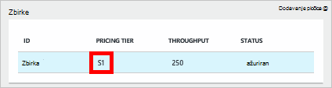
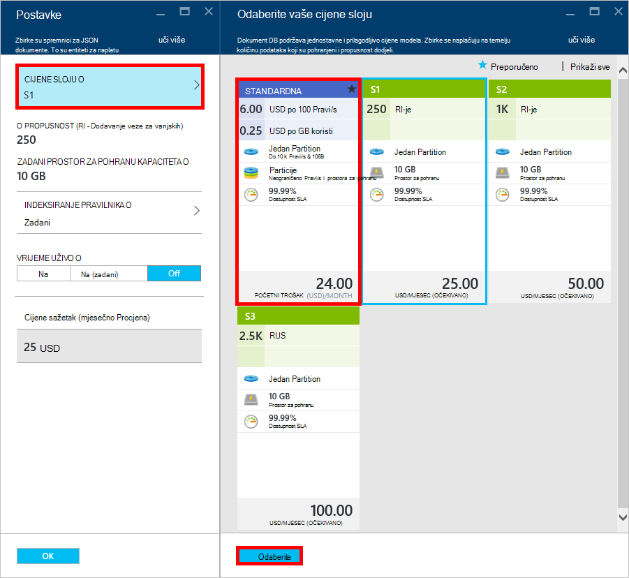
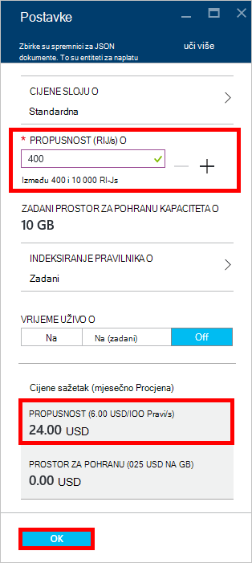
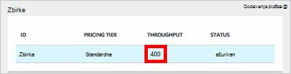

<properties 
    pageTitle="Supercharge računa DocumentDB S1 | Microsoft Azure" 
    description="Iskoristite prednost veću propusnost na vašem računu DocumentDB S1 promjenom nekoliko jednostavnih na portalu za Azure." 
    services="documentdb" 
    authors="mimig1" 
    manager="jhubbard" 
    editor="monicar" 
    documentationCenter=""/>

<tags 
    ms.service="documentdb" 
    ms.workload="data-services" 
    ms.tgt_pltfrm="na" 
    ms.devlang="na" 
    ms.topic="article" 
    ms.date="08/25/2016" 
    ms.author="mimig"/>

# Supercharge računa DocumentDB

Slijedite ove korake da biste iskoristili veću propusnost za vaš račun za Azure DocumentDB S1. S pretjerano bez dodatnih troškova, možete povećati propusnost postojeći račun S1 od 250 [Pravi/s](documentdb-request-units.md) 400 Pravi/s ili više!  

> [AZURE.VIDEO changedocumentdbcollectionperformance]

## Promjena korisnički definirane performanse na portalu za Azure

1. U pregledniku idite na [**portal za Azure**](https://portal.azure.com). 
2. Kliknite **Pregledaj** -> **DocumentDB (NoSQL)**, a zatim odaberite DocumentDB račun koji želite izmijeniti.   
3. U leće **baze podataka** odaberite bazu podataka da biste izmijenili, a zatim u plohu **baze podataka** odaberite zbirke s sloju cijene S1.

      

4. U plohu **zbirke** kliknite **više**, a zatim kliknite **Postavke**.   
5. U plohu **Postavke** kliknite **Sloju cijene** i obratite pozornost na to prikazuje se mjesečni procjenu troškova za svaki plan. U plohu **Odabir vaše cijene sloju** kliknite **Standard**, a zatim **Odaberite** da biste spremili promjene.

      

6. Vratite se u plohu **Postavke** **Cijene sloju** mijenja se u **standardni** i prikazat će se okvir **propusnost (Pravi na s)** uz zadanu vrijednost od 400. Kliknite **u redu** da biste spremili promjene. 

    > [AZURE.NOTE] Možete postaviti propusnost između 400 i 10 000 [zahtjev jedinice](../articles/documentdb/documentdb-request-units.md)/second (Pravi na s). **Cijene sažetak** pri dnu stranice automatski ažurira omogućuje procjenu mjesečni trošak.
    
    

8. Ponovno uključite plohu **baze podataka** možete provjeriti supercharged propusnost zbirke. 

    

Dodatne informacije o promjenama vezane uz korisnički definirane i unaprijed definirane propusnost potražite u članku na blogu [DocumentDB: sve što trebate znati o korištenju nove cijene mogućnosti](https://azure.microsoft.com/blog/documentdb-use-the-new-pricing-options-on-your-existing-collections/).

## Daljnji koraci

Ako zaključite da trebate više propusnost (veće od 10 000 Pravi/s) ili dodatnog prostora za pohranu (veće od 10GB) možete stvoriti particioniranom zbirke. Da biste stvorili particioniranom zbirke, potražite u članku [Stvaranje zbirke](documentdb-create-collection.md).