<properties
    pageTitle="DocumentDB Explorer dokument da biste pogledali JSON | Microsoft Azure"
    description="Saznajte više o DocumentDB Explorer dokument alat za Azure Portal za prikaz JSON, uređivanje, stvaranje i prijenos JSON dokumenata s DocumentDB, NoSQL dokumenta baze podataka."
        keywords="Prikaz json"
    services="documentdb"
    authors="kirillg"
    manager="jhubbard"
    editor="monicar"
    documentationCenter=""/>

<tags
    ms.service="documentdb"
    ms.workload="data-services"
    ms.tgt_pltfrm="na"
    ms.devlang="na"
    ms.topic="article"
    ms.date="08/30/2016"
    ms.author="kirillg"/>

# Prikaz, uređivanje, stvaranje i prijenos JSON dokumenata pomoću programa Explorer DocumentDB dokumenta

Ovaj članak sadrži pregled sustava [Microsoft Azure DocumentDB](https://azure.microsoft.com/services/documentdb/) Explorer dokument Azure portala alat koji omogućuje prikaz, uređivanje, stvaranje, prijenos i filtrirati JSON dokumenata s DocumentDB. 

Imajte na umu dokument Explorer nije omogućena na računima DocumentDB s podrškom za protokol za MongoDB. Ova stranica će se ažurirati kada je omogućen ovu značajku.

## Pokretanje programa Explorer dokumenta

1. Na portalu Azure u Jumpbar, kliknite **DocumentDB (NoSQL)**. Ako **DocumentDB (NoSQL)** nije vidljivo, kliknite **Više servisa** , a zatim kliknite **DocumentDB (NoSQL)**.

2. Odaberite naziv računa. 

3. Na izborniku resursa kliknite **Explorer dokumenta**. 
 
    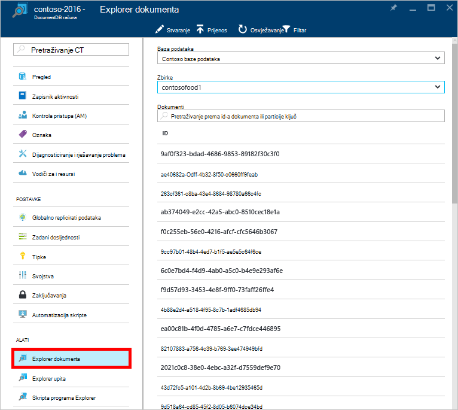

    U plohu **Dokument Explorer** padajućim popisima **baze podataka** i **zbirki** su unaprijed popunjeno ovisno o kontekstu pokretanja Explorer dokumenta. 

## Stvaranje dokumenta

1. [Pokretanje programa Explorer dokumenta](#launch-document-explorer).

2. U plohu **Explorer dokumenta** kliknite **Stvaranje dokumenta**. 

    Minimalna isječak JSON navedeni su u plohu **dokumenta** .

    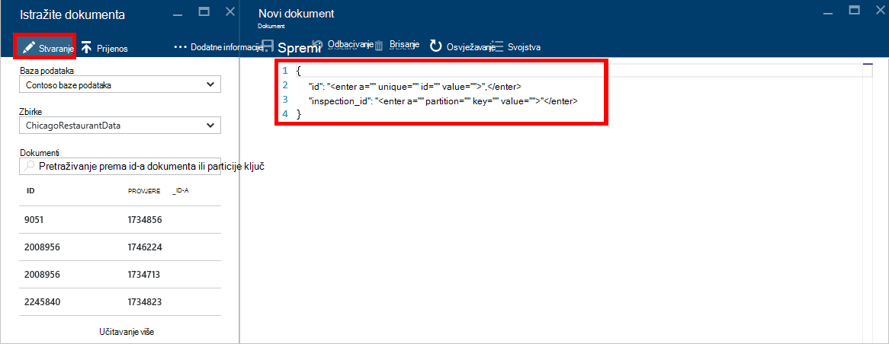

2. U plohu **dokument** upišite ili zalijepite u sadržaja dokumenta JSON koju želite stvoriti pa kliknite **Spremi** za primjenu dokumentu prikupljanje naveden u plohu **Explorer dokument** i baze podataka.

    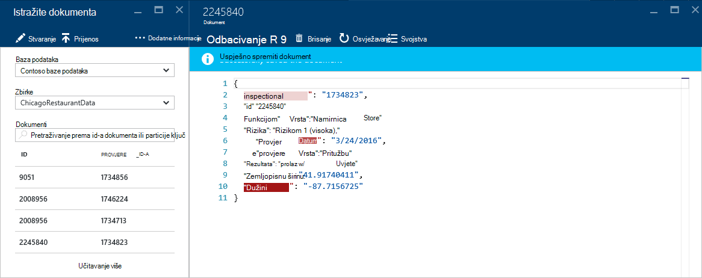

    > [AZURE.NOTE] Ako ne navedete svojstvo programa "id", zatim dokument Explorer automatski dodaje u svojstvo id i generira GUID kao vrijednost ID-a.

    Ako već imate podatke iz JSON datoteke, MongoDB, SQL Server, CSV datoteke, spremište tablica Azure, Amazon DynamoDB, HBase, ili iz drugih zbirki DocumentDB DocumentDB, [alata za migraciju podataka](documentdb-import-data.md) možete koristiti da biste brzo uvoz podataka.

## Uređivanje dokumenta

1. [Pokretanje programa Explorer dokumenta](#launch-document-explorer).

2. Da biste uredili postojeći dokument, odaberite ga u plohu **Explorer dokumenta** , uređivanje dokumenta u plohu **dokument** i kliknite **Spremi**.

    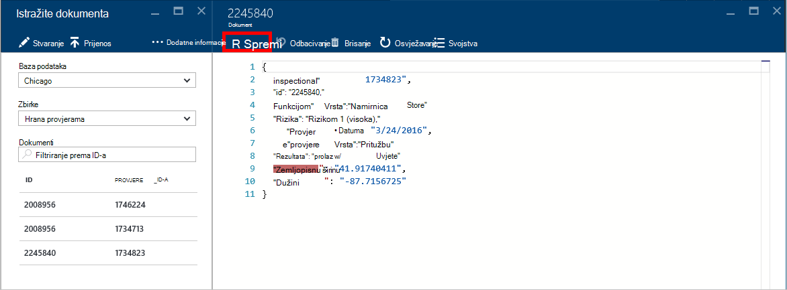

    Ako uređujete dokument i odlučiti koju želite odbaciti trenutnu skup izmjene, jednostavno kliknite **Odbaci** plohu **dokumenta** , potvrdite akciju Odbaci pa se ponovno učitati prethodno stanje dokumenta.

    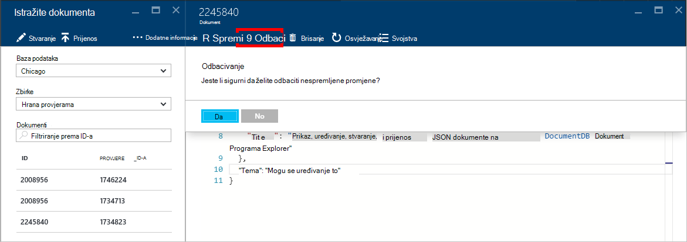

## Brisanje dokumenta

1. [Pokretanje programa Explorer dokumenta](#launch-document-explorer).

2. Odaberite dokument u **Programu Explorer dokumenta**, kliknite **Izbriši**, a zatim potvrdite brisanje. Nakon potvrde, dokument je uklonjeno s popisa Explorer dokumenta.

    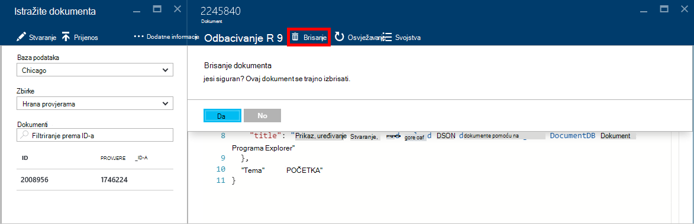

## Rad s dokumentima JSON

Dokument Explorer Provjeri valjanost da svaki novi ili uređivati dokument sadrži valjani JSON.  Možete čak i prikaz JSON pogrešaka tako iznad netočan sekcija da biste vidjeli detalje o pogrešci provjere valjanosti.

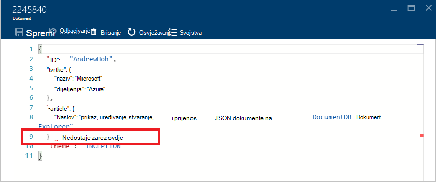

Osim toga, dokument Explorer sprječava spremanje dokumenta sa sadržajem koji nisu valjani JSON.

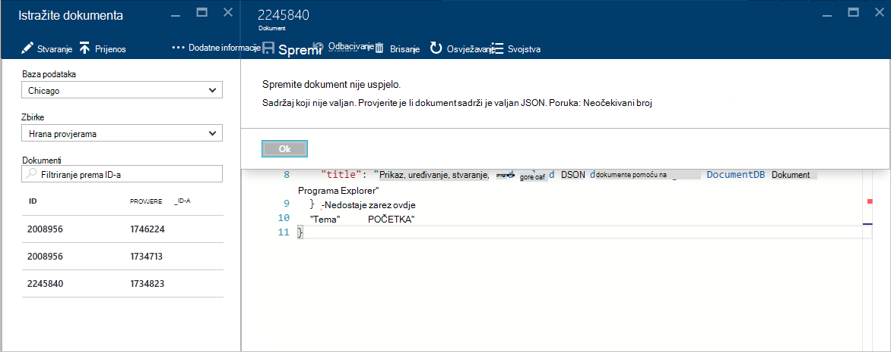

Na kraju dokumenta Explorer omogućuje jednostavno prikazati svojstva sustava trenutno učitani dokumenta klikom na naredbu **Svojstva** .

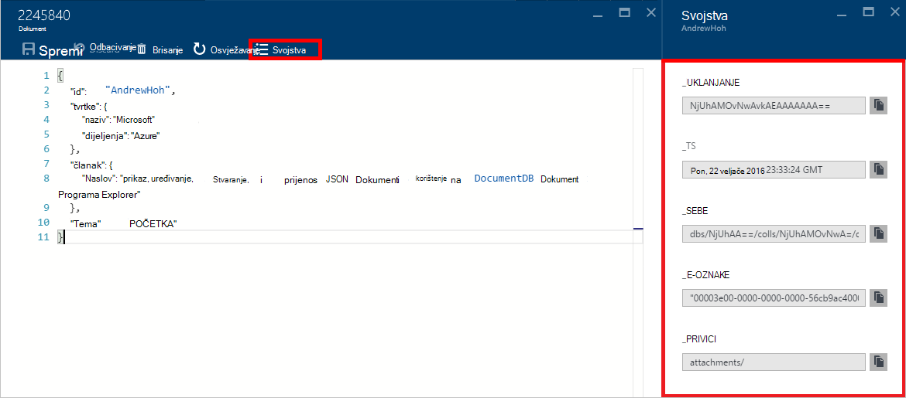

> [AZURE.NOTE] Svojstvo vremenske oznake (_ts) interno predstavljen kao epoch vremena, ali dokument Explorer prikazuje vrijednost u obliku Ljudski čitljiv GMT.

## Filtriranje dokumenata
Dokument Explorer podržava brojne mogućnosti navigacije i napredne postavke.

Prema zadanim postavkama, dokument Explorer učitava prema gore na prvo 100 dokumente na odabranu zbirku po njihove datumu stvaranja od najranijeg do najnoviji.  Odabirom mogućnosti **Učitavanje više** pri dnu plohu Explorer dokumenta možete učitati dodatne dokumente (u serijama od 100). Možete odabrati koje dokumente da biste učitali putem naredbe **Filtar** .

1. [Pokretanje programa Explorer dokumenta](#launch-document-explorer).

2. Pri vrhu plohu **Explorer dokumenta** , kliknite **Filtar**.  

    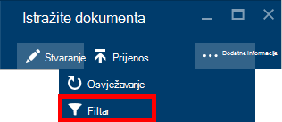
  
3.  Postavke filtra pojaviti ispod trake s naredbama. U odjeljku postavke filtra pružaju uvjet WHERE i/ili uvjet ORDER BY, a zatim **Filtar**.

    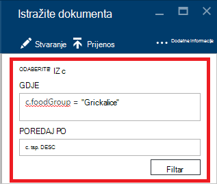

    Dokument Explorer osvježava rezultate s dokumentima koji se podudaraju upita filtriranja. Pročitajte više o DocumentDB SQL gramatike u [SQL upita i njegova SQL sintaksa](documentdb-sql-query.md) članak ili ispisati primjerak [SQL upita cheat lista](documentdb-sql-query-cheat-sheet.md).

    Padajući popis okvire **baze podataka** i **Zbirka** mogu se jednostavno promijeniti zbirke iz kojeg dokumenata su trenutno gleda bez potrebe za zatvorite i ponovno pokrenuli Explorer dokumenta.  

    Dokument Explorer podržava i filtriranje trenutno učitani skup dokumenata prema njihovim svojstvo ID-a.  Jednostavno upišite u filtru dokumenata po ID-a.

    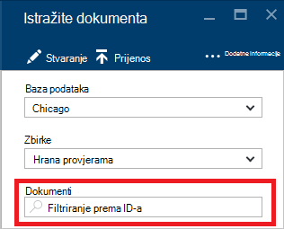

    Rezultati u programu Explorer dokumenta filtriraju popisa na temelju navedeni kriterij.

    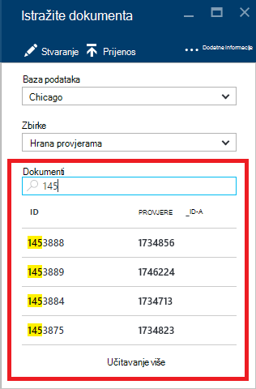

    > [AZURE.IMPORTANT] Dokument Explorer filtar funkcionalnost samo filtre iz na ***trenutno*** učitati skup dokumenata i izvršavanje upita na temelju trenutno odabranu zbirku.

4. Da biste osvježili popis dokumenata učitati Explorer dokumenta, kliknite **Osvježi** pri vrhu na plohu.

    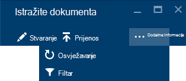

## Skupno dodavanje dokumenata

Dokument Explorer podržava skupno ingestion jedan ili više postojećih JSON dokumenata, najviše 100 datoteka JSON po operaciji prijenos.  

1. [Pokretanje programa Explorer dokumenta](#launch-document-explorer).

2. Da biste pokrenuli postupak za prijenos, kliknite **Prenesi dokument**.

    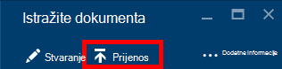

    Otvorit će se plohu **Prenesi dokument** . 

2. Kliknite gumb Pregledaj da biste otvorili prozor programa explorer datoteku, odaberite dokumenti JSON prenijeti, a zatim **otvorite**.

    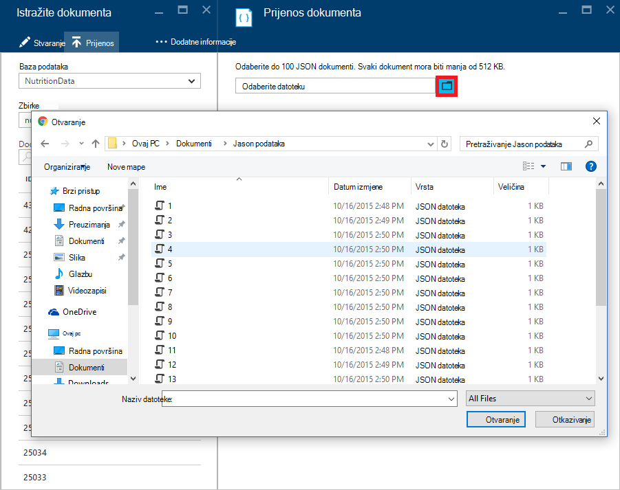

    > [AZURE.NOTE] Dokument Explorer trenutno podržava do 100 JSON dokumenata po operaciji pojedinačne prijenos.

3. Kada ste zadovoljni odabir, kliknite gumb **Prenesi** .  Dokumenti se automatski dodaju u rešetku Explorer dokument i prijenos Rezultati prikazuju se kao napreduje operacija. Uvoz pogreške su potrebnom za pojedinačne datoteke.

    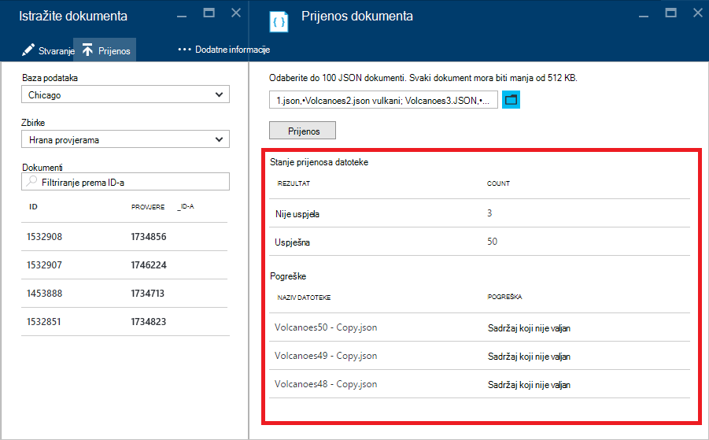

4. Nakon dovršetka postupka možete odabrati do druge 100 dokumenata da biste prenijeli.

## Rad s dokumentima JSON izvan portala

Explorer dokument na portalu za Azure je samo jedan od načina za rad s dokumentima u DocumentDB. Možete raditi i dokumenata pomoću [REST API -JA](https://msdn.microsoft.com/library/azure/mt489082.aspx) ili [klijenta SDK-ovi](documentdb-sdk-dotnet.md). Na primjer kod, potražite u članku [primjeri .NET SDK dokument](documentdb-dotnet-samples.md#document-examples) i [primjeri Node.js SDK dokumenta](documentdb-nodejs-samples.md#document-examples).

Ako vam je potrebna za uvoz ili migracija datoteka iz drugog izvora (JSON datoteke, MongoDB, SQL Server, CSV datoteke, Azure tablice za pohranu, Amazon DynamoDB ili HBase), poslužite se DocumentDB [alata za migraciju podataka](documentdb-import-data.md) da biste brzo DocumentDB uvesti podatke.

## Rješavanje problema

**Simptoma**: dokument Explorer vraća **pronađenih dokumenata**.

**Rješenje**: Provjerite je li koju ste odabrali ispravnu pretplatu, baza podataka i zbirke u kojem su umetati dokumente. Osim toga, provjerite je li se operacijski unutar kvote za propusnost. Ako radite na Maksimalna propusnost razine i dohvaćanje ograničio vrijeme, smanjite korištenje aplikacije raditi u odjeljku Maksimalna propusnost kvote zbirke.

**Objašnjenje**: je portal programa kao što su bilo kojeg drugog upućivanje poziva za prikupljanje i DocumentDB baze podataka. Ako vašim zahtjevima su trenutno se ograničio vrijeme zbog pozive u tijeku s zasebna aplikacija, portala možda također biti ograničio vrijeme, uzrokuje resursa ne pojavi na portalu. Da biste riješili taj problem, adresa uzrok visoke propusnost korištenje, a zatim osvježite portala plohu. Informacije o kako se mjere i korištenje donjem propusnost pronaći ćete u odjeljku [propusnost](documentdb-performance-tips.md#throughput) članka [savjeta performansi](documentdb-performance-tips.md) .

## Daljnji koraci

Da biste saznali više o gramatike DocumentDB SQL podržani u programu Explorer dokumenta, potražite u članku [SQL upita i njegova SQL sintaksa](documentdb-sql-query.md) ili ispisati [SQL upita cheat lista](documentdb-sql-query-cheat-sheet.md).

[Tečaj](https://azure.microsoft.com/documentation/learning-paths/documentdb/) i koristan je resurs će vas voditi kroz dok učite više o DocumentDB. 
