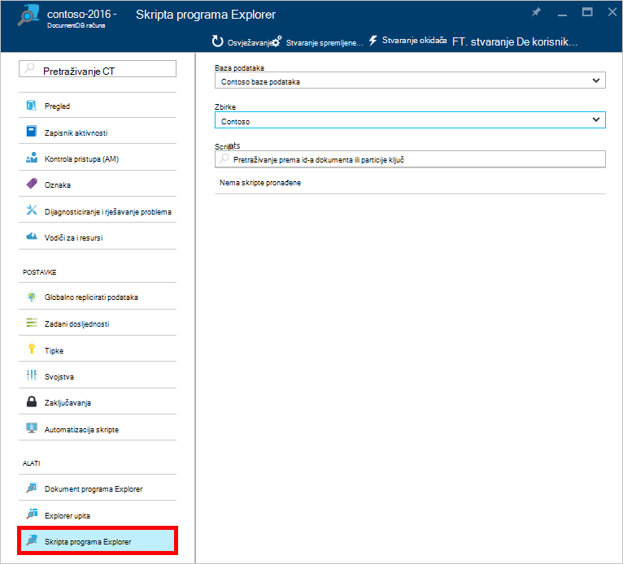
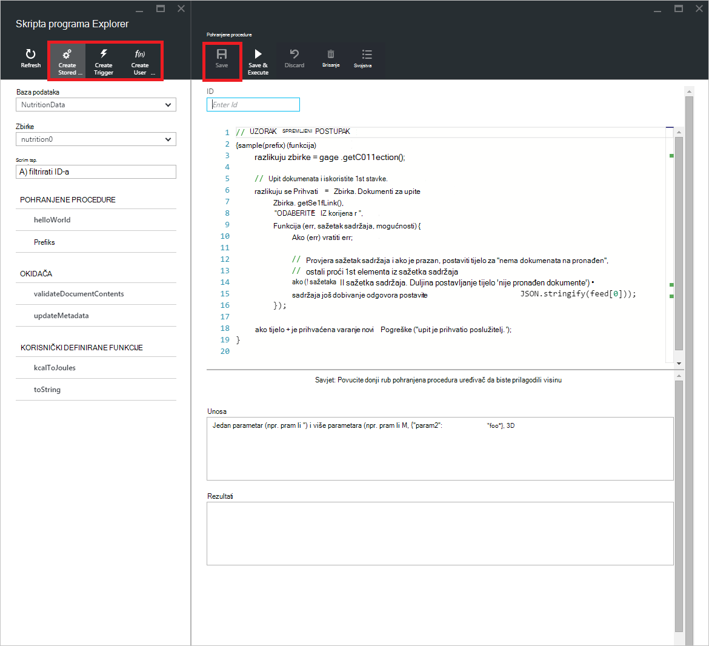

<properties
    pageTitle="Uređivač za JavaScript DocumentDB skripte Exploreru | Microsoft Azure"
    description="Saznajte više o DocumentDB Explorer skripte Azure Portal alat za upravljanje poslužiteljskim programiranje artefakte DocumentDB obuhvaća pohranjene procedure, okidača i korisnički definirane funkcije."
    keywords="Uređivač za JavaScript"
    services="documentdb"
    authors="kirillg"
    manager="jhubbard"
    editor="monicar"
    documentationCenter=""/>

<tags
    ms.service="documentdb"
    ms.workload="data-services"
    ms.tgt_pltfrm="na"
    ms.devlang="na"
    ms.topic="article"
    ms.date="08/30/2016"
    ms.author="kirillg"/>

# Stvaranje i pokretanje pohranjene procedure, okidača i korisnički definirane funkcije pomoću programa Explorer za skripte DocumentDB

Ovaj članak sadrži pregled programa Explorer [Microsoft Azure DocumentDB](https://azure.microsoft.com/services/documentdb/) skriptu koja je uređivač za JavaScript na portalu za Azure koja omogućuje prikaz i izvršiti DocumentDB poslužiteljsko programiranje artefakte obuhvaća pohranjene procedure, okidača i korisnički definirane funkcije. Dodatne informacije potražite u o DocumentDB poslužiteljsko programiranja u članku [procedure spremljene, okidača baze podataka i UDF-ove](documentdb-programming.md) .

## Pokretanje programa Explorer skripte

1. Na portalu Azure u Jumpbar, kliknite **DocumentDB (NoSQL)**. Ako **DocumentDB računa** nije vidljivo, kliknite **Više servisa** , a zatim kliknite **DocumentDB (NoSQL)**.

2. Na izborniku resurse kliknite **Skripta Explorer**.

    
 
    U **bazu podataka** i **Zbirka** padajućeg popisa unaprijed popunjavaju ovisno o kontekstu pokrenuti skriptu Explorer.  Ako, na primjer, ako pokretanje iz baze podataka plohu zatim Trenutna baza podataka je prethodno popunjen.  Pokretanje iz zbirke plohu tada trenutne zbirke je prethodno popunjen.

4.  Pomoću okvira padajućeg popisa **baze podataka** i **Zbirka** jednostavno promijeniti zbirke iz kojeg skripte su trenutno gleda bez potrebe za zatvorite i ponovno pokrenite skripte Explorer.  

5. Skripta Explorer podržava i filtriranje trenutno učitani skup skripte njihove svojstvo ID-a.  Jednostavno upišite u okvir filtar i rezultata na popisu Explorer skripte su filtrirani prema navedenom kriterije.

    

    > [AZURE.IMPORTANT] Skripta Explorer filtriranje funkcionalnost samo filtre iz skupa ***trenutno*** učitati skripte i ne automatsko osvježavanje trenutno odabranu zbirku.

5. Da biste osvježili popis skripte učitati Explorer skripte, jednostavno kliknite naredbu **Osvježi** pri vrhu na plohu.

    

## Stvaranje, prikaz i uređivanje pohranjene procedure, okidača i korisnički definirane funkcije

Skripta Explorer omogućuje jednostavno izvođenje operacije CRUD DocumentDB poslužiteljsko programiranje artefakte.  

- Da biste stvorili skriptu, jednostavno kliknite na odgovarajuće stvorite naredbe u programu explorer skripte, unijeti ID-ove, unesite sadržaj skripte i kliknite **Spremi**.

    

- Prilikom stvaranja okidač, morate navesti okidača operacija vrsta i okidača

    

- Da biste pogledali skriptu, jednostavno kliknite skripte u kojem koji vas zanima.

    

- Da biste uredili skriptu, jednostavno unesite željene promjene u JavaScript uređivač i kliknite **Spremi**.

    

- Da biste odbacili sve promjene na čekanju u skriptu, jednostavno kliknite naredbu **Odbaci** .

    

- Skripta Explorer omogućuje i jednostavno prikazati svojstva sustava trenutno učitani skripte klikom na naredbu **Svojstva** .

    

    > [AZURE.NOTE] Svojstvo vremenske oznake (_ts) interno predstavljen kao epoch vremena, ali skripte Explorer prikazuje vrijednost u obliku Ljudski čitljiv GMT.

- Da biste izbrisali skriptu, odaberite ga u programu Explorer skripte i kliknite naredbu za **Brisanje** .

    

- Potvrdite akciju brisanja tako **da** kliknete ili poništili akciju brisanja tako da kliknete **bez**.

    

## Izvršavanje pohranjena procedura

> [AZURE.WARNING] Izvođenje pohranjene procedure u programu Explorer skripte još nije podržana za poslužitelj strani particije zbirke. Dodatne informacije potražite u članku [Partitioning i promjena veličine u DocumentDB](documentdb-partition-data.md).

Skripta Explorer omogućuje izvršavanje poslužiteljsko pohranjene procedure s portala za Azure.

- Prilikom otvaranja nove plohu postupak stvaranja pohranjene zadanu skriptu (*prefiks*) se prethodno navesti. Da biste pokrenuli *prefiks* skripte ili vlastite skripte, dodajte *id* i *unosa*. Pohranjene procedure koji koriste više parametre, sve unose mora biti u polju (npr. *["odnožje", "traka"]*).

    

- Izvršavanje pohranjena procedura, jednostavno kliknite naredbu **Spremi i izvršiti** unutar okna script editor.

    > [AZURE.NOTE] Naredba za **Spremanje i izvršavanje** će spremiti vaše pohranjena procedura prije izvršavanja, što znači prebrisat će prethodno spremljene verzije pohranjena procedura.

- Uspješan pohranjena procedura izvršavanja sadržavat će *uspješno spremiti i izvršava pohranjena procedura* status, a opseg vraćenih rezultata će biti ispunjena u oknu *rezultata* .

    

- Ako izvršavanja naiđe na pogrešku, pogreška će unose u oknu s *rezultatima* .

    

## Rad s skripte izvan portala

Explorer skripte na portalu za Azure je samo jedan od načina za rad s pohranjenim procedurama, okidača i korisnički definiranih funkcija u DocumentDB. Možete i u suradnji s skripte koje koriste u [klijent SDK-ovi](documentdb-sdk-dotnet.md)i REST API-JA. Dokumentacija REST API-JA sadrži uzorke za rad s [pohranjene procedure pomoću REST](https://msdn.microsoft.com/library/azure/mt489092.aspx), [korisnički definirane funkcije pomoću REST](https://msdn.microsoft.com/library/azure/dn781481.aspx)i [pomoću okidača REST](https://msdn.microsoft.com/library/azure/mt489116.aspx). Uzorci također su dostupne prikazuje kako [raditi s skripti pomoću C#](documentdb-dotnet-samples.md#server-side-programming-examples) i [Rad s skripti pomoću Node.js](documentdb-nodejs-samples.md#server-side-programming-examples).

## Daljnji koraci

Dodatne informacije o DocumentDB poslužiteljsko programiranja u članku [procedure spremljene, okidača baze podataka i UDF-ove](documentdb-programming.md) .

[Tečaj](https://azure.microsoft.com/documentation/learning-paths/documentdb/) i koristan je resurs će vas voditi kroz dok učite više o DocumentDB.  
