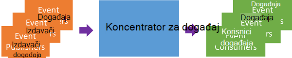
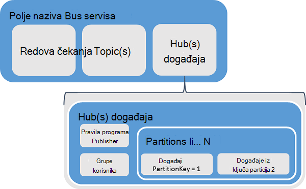
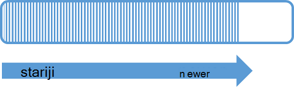
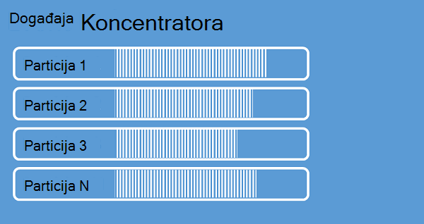
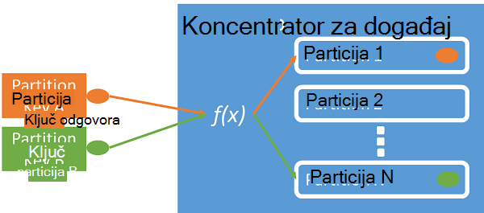
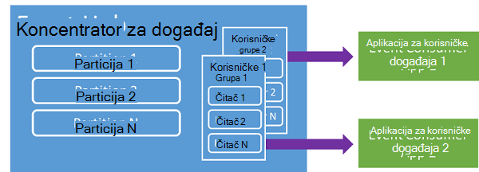
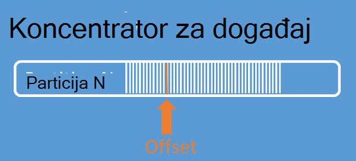
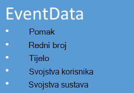

<properties 
    pageTitle="Pregled događaja Azure koncentratora | Microsoft Azure"
    description="Uvod i pregled Azure koncentratora za događaj."
    services="event-hubs"
    documentationCenter="na"
    authors="sethmanheim"
    manager="timlt"
    editor="" />
<tags 
    ms.service="event-hubs"
    ms.devlang="na"
    ms.topic="get-started-article"
    ms.tgt_pltfrm="na"
    ms.workload="na"
    ms.date="08/16/2016"
    ms.author="sethm" />

# Pregled Azure koncentratora događaja

Mnoge Moderna rješenja namjeravate omogućuje prilagodljivo korisnička sučelja ili poboljšanja proizvoda putem neprekinuti povratne informacije i automatiziranog telemetrijskih. Test način sigurno i pouzdano obrade vrlo velike količine podataka iz brojnih Istodobni izdavača se nađu takve rješenja. Microsoft Azure događaj koncentratora je servis upravljanih platformu koja omogućuje temelj za veliki podataka intake općenite brojne scenariji. Primjeri takvih Scenariji su ponašanje praćenja u mobilne aplikacije, promet podatke iz web farme, događaja u utakmica snimke u igrama konzole ili telemetrijskih podataka prikupljenih industrijske strojeva ili povezani vozila. Uobičajeni uloge koncentratora događaja koji se reproducira u rješenje arhitekturi je funkcionira li kao na "prednju kontaktiraju –" za kanal za događaj često se nazivaju *ingestor događaj*. Na događaj ingestor je komponenta ili servisa koji se nalazi između izdavači događaja i događaja koje korisnici decouple radni je strujanje događaj iz potrošnje događaje.

Azure koncentratora događaj je događaj obrade servis koji omogućuje događaj i telemetriju ingress oblak na pretraživanje velikog skala s niske latencije i visoke pouzdanosti. Ovaj servis koristiti s drugim servisima do je osobito je korisna u aplikaciju instrumentation, obrada korisničko sučelje ili tijeka rada i scenariji Internet stvari (IoT). Događaj koncentratora nudi poruke strujanje rukovanje mogućnost i iako koncentratora za događaj slične redovima i teme entitet, sadrži značajke koje su vrlo različit od tradicionalni enterprise poruka. Scenariji za razmjenu Enterprise najčešće zahtijevaju složene mogućnosti kao što su sequencing, reagira lettering, podrška za transakcije i istaknuti isporuke jamstva, dok je označile složen za događaj intake visoke propusnost i obradu fleksibilnost za događaj strujanja. Zbog toga događaj koncentratora mogućnosti razlikovati od servisa Bus teme iz tog svakako usmjeren prema visoke propusnost i događaja obrade scenarija. Kao takve, događaj koncentratora implementira neke od mogućnosti razmjene poruka koje su dostupne za teme. Ako vam je potrebna tim mogućnostima, teme ostaju optimalnih odabir.

Na razini događaj koncentratora prostor naziva slične servisa Bus redovima i teme stvorit će se koncentratora za događaj. Događaj koncentratora koristi AMQP i HTTP kao njegove primarne sučelja API-JA. Sljedeći dijagram prikazuje odnos između koncentratora za događaj i Bus servisa.

## Konceptualni pregled

Događaj koncentratora nudi poruke strujanje putem uzorak particioniranom potrošača. Redova i teme pomoću modela [Potrošača natječu](https://msdn.microsoft.com/library/dn568101.aspx) u kojem svaki korisnik pokuša čitati s istom redu ili resurs. Ovaj konkurencije za resurse konačni rezultat složenosti i skaliranje ograničenja za strujanje obrade aplikacije. Događaj koncentratora koristi particioniranom potrošača uzorak u kojem svaki korisnik samo čita određeni podskup ili particije toka poruke. Ovaj uzorak omogućuje vodoravno skaliranje za obradu događaja i njihovi druge strujanje odnosila značajke koje nisu dostupne u redovima i teme.

### Particije

Particija je do uređeni niz događaja koji čuva se koncentratora za događaj. Kad stignu novija događaje, ona se dodaju do kraja ovog niza. Particije možete smatrati "Potvrdi zapisnik."

Particije zadržati podatke put konfigurirani zadržavanja koja je postavljena na razini koncentratora za događaj. Ova postavka primjenjuje na sve particije u događaja koncentratora. Događaji istječe na temelju vremena; izričito ne možete izbrisati ih. Koncentratora za događaj sadrži više particija. Svaki particija neovisan je, a sadrži vlastitu niza podataka. Zbog toga particije često Povećaj prema različitim stopama..

Broj particije nije naveden u vrijeme stvaranja koncentratora za događaj i mora biti između 2 i 32 (zadano je 4). Particije su mehanizam podataka tvrtke ili ustanove, a dodatne informacije vezane uz stupanj do parallelism potreban u drugim programima od propusnost koncentratora za događaj. Odabir broj particije to čini u izravno povezani s broj Istodobni čitatelji očekujete da ćete imati koncentratora za događaj. Nakon stvaranja događaja koncentrator count particija nije promjenjivu; Razmislite o taj broj pomoću Dugoročne očekivani mjerilo. Ograničenje 32 particija možete povećati tako da se obratite tima Bus servisa.

Dok particije su za identifikaciju osobe, a može poslati izravno, najbolje je da biste izbjegli slanja podataka određene particije. Umjesto toga koristite višu razinu konstrukta uvedene u odjeljcima [publisher događaja](#event-publisher) i [Pravila u programu Publisher](#capacity-and-security) .

U kontekstu koncentratora događaj, poruke se nazivaju i *Podaci o događaju*. Podaci o događaju sadrži tijelo događaj, na korisnički definirane spremnika svojstava i razne metapodataka o događaju kao što su njegov pomak u particije i njegov broj u nizu strujanje. Particije popunjavaju se niz podaci o događaju.

## Publisher događaja

Bilo koji entitet koji šalje događaje ili podataka koncentratora za događaj je *publisher događaj*. Izdavači događaja možete objaviti događaja pomoću HTTPS ili AMQP 1.0. Izdavači događaja pomoću zajednički pristup potpis (SAS) tokena prepoznavanje same koncentrator za događaj i možete jedinstveni identitet ili pomoću uobičajenih SAS tokena, ovisno o preduvjetima scenarij.

Dodatne informacije o radu s SAS potražite u članku [Zajedničko korištenje programa Access potpis Authentication s Bus servisa](../service-bus-messaging/service-bus-shared-access-signature-authentication.md).

### Uobičajeni zadaci u programu publisher

U ovom se odjeljku opisuje uobičajene zadatke za događaj izdavači.

#### Nabava SAS tokena

Zajednički pristup potpis (SAS) je mehanizam provjere autentičnosti za događaj koncentratora. Servis Bus nudi SAS pravila u prostor naziva i razinu koncentratora za događaj. SAS token generira se iz SAS ključa, a je programa raspršivanje SHA URL-a, kodiran u određenom obliku. Pod nazivom ključ (pravila) i token servisa Bus možete Obnovi raspršivanje i stoga provjere autentičnosti pošiljatelja. Obično SAS tokeni za događaj izdavači stvaraju se s samo **Slanje** privilegijama za određene koncentratora za događaj. U ovom SAS tokena URL mehanizam je temelj za identifikaciju publisher uvedene u pravilima programa publisher. Dodatne informacije o radu s SAS potražite u članku [Zajedničko korištenje programa Access potpis Authentication s Bus servisa](../service-bus-messaging/service-bus-shared-access-signature-authentication.md).

#### Objavljivanje događaja

Možete objaviti događaja putem AMQP 1.0 ili HTTPS. Servis Bus daje programa klase [EventHubClient](https://msdn.microsoft.com/library/microsoft.servicebus.messaging.eventhubclient.aspx) za objavljivanje događaje koncentratora za događaj klijenata .NET. Za druge runtimes platforme, možete koristiti AMQP 1.0 klijent, kao što su [Apache Qpid](http://qpid.apache.org/). Koju možete objaviti događaje pojedinačno ili odbacivanja. Jednu publikaciju (događaj podataka instance) ima ograničenje od 256KB, neovisno o tome je jedan događaj ili grupu. Objavljivanje događaji veći od to rezultira pogreškom. Preporučenim načinom rada za izdavači bio ostalog razdjeljivanja u središtu događaja te navedite samo na *particije ključ* (uvedene u sljedećem odjeljku) ili njihov identitet putem njihove token SAS je.

Odabir da biste koristili AMQP ili HTTPS je za korištenje scenarij. AMQP zahtijeva uspostavljanje stalni Dvosmjeran socket uz prijenos razinu sigurnosti (TLS) ili SSL/TLS. To može biti skup operacija pomoću mrežnog prometa, ali samo se događa na početku sesiju AMQP. HTTPS ima manje početne dodataka, ali indirektni zahtijeva dodatne SSL za svaki zahtjev. Izdavači koji često objavljuju događaje, AMQP nudi performanse, Latencija i propusnost računanje.

### Ključ partition

Ključ particija je vrijednost koja se koristi za mapu dolazne podaci o događaju u određenim particije za analizu podataka tvrtke ili ustanove. Ključ particija je pošiljatelj unesena vrijednost ušli u koncentratora za događaj. Odvija se kroz statične raspršivanje funkcije, rezultat koji stvara Dodjela particije. Ako ne navedete ključa particija pri objavljivanju događaja, koristit će se kružnog dodjele. Kada koristite tipke particije, publisher događaj je samo svjesni particija ključ, ne particije na koje su objavljene događaje. U ovom decoupling ključ i particija insulates pošiljatelja iz koje je potrebno znati previše o do obrada i pohranu događaja. Tipke particija važna za organiziranje podataka za obradu do, ali su bitno nepovezanih particije sami. Po uređaj ili korisnika jedinstveni identiteta čini dobar particija ključ, ali druge atribute kao što su Zemljopis, možete koristiti za grupiranje povezanih događaje u jedna particija. Sljedeća slika prikazuje pošiljatelja događaja pomoću tipki particija da biste prikvačili particije.

Događaj koncentratora osigurava sve događaje zajedničko korištenje jednaku vrijednost ključa particija isporučuju redoslijedom, a da biste isti particije. Važno je napomenuti da, ako particija koriste se s pravilima programa publisher, što je opisano u sljedećoj sekciji, zatim identitet izdavača i vrijednost ključa particija mora podudarati. U suprotnom, javlja se pogreška.

### Korisničke događaja

Bilo koji entitet koja čita događaj podatke iz koncentratora za događaj je programa potrošača događaj. Svi korisnici događaj pročitajte strujanje događaja putem particije u grupu korisnika. Svaki particija mora imati samo jedan aktivni čitač odjednom. Svi korisnici događaj koncentratora povezati putem AMQP 1.0 sesiju, u kojem događaje iz njih isporučuju se čim postanu dostupne. Klijent ne treba provjeriti ima li dostupnost podataka.

#### Grupe korisnika

Mehanizam Objavi/pretplata od koncentratora događaj omogućena korisničke grupe. Grupa potrošača je prikaza (stanje, mjesto ili offset) cijelu koncentratora za događaj. Omogući grupe potrošača više dosta aplikacije za svaki imaju zaseban Prikaz toka događaja, a da biste pročitali toka neovisno vlastitim tempom i vlastite pomake. U strujanje obrade arhitektura, svaka do aplikacija daje rezultat u obliku grupu korisnika. Ako želite pisati podaci o događaju dugoročno spremanje tu aplikaciju za pohranu writer je grupu korisnika. Složena događaj se provode tako da drugi, zasebne korisničke grupe. Particije možete pristupiti samo putem korisničke grupe. Postoji uvijek zadanu grupu korisnika u koncentratora za događaj, a možete stvoriti do 20 korisničke grupe za standardne sloju koncentratora za događaj.

Slijede primjeri konvencije korisničke grupe URI:

    //<my namespace>.servicebus.windows.net/<event hub name>/<Consumer Group #1>
    //<my namespace>.servicebus.windows.net/<event hub name>/<Consumer Group #2>

Sljedeća slika prikazuje koje korisnici događaj unutar grupa korisnika.

#### Pomiče strujanje

Na pomak je položaj događaja unutar particije. Programa pomaka možete smatrati pokazivača na klijentskoj strani. Pomak je bajt numeriranje događaja. Time se omogućuje na događaj potrošača (čitač) da biste odredili točku u događaja strujanje iz kojeg želite da biste započeli događaje za čitanje. Možete navesti pomak kao vremenskog pečata ili offset vrijednost. Korisnici su odgovorni za pohranu vlastite offset vrijednosti izvan koncentratora događaja servisa.

Unutar particije svaki događaj sadrži programa pomak. Korisnici koristi ovaj pomak da biste prikazali na mjesto u nizu događaj za dani particije. Pomake možete proslijediti koncentrator događaj kao neki broj ili kao vrijednost vremenske oznake prilikom povezivanja čitača.

#### Checkpointing

*Checkpointing* je postupak koji čitatelji oznaku ili izvršavanje njihov položaj niz događaja particije. Checkpointing odgovornost korisnik je, a pojavljuje se na temelju po particija unutar grupe korisnika. To znači da za svaku grupu potrošača svaki čitač particija mora pratio trenutni položaj u događaja strujanje, a možete obavijestiti usluge kad je smatra toka podataka dovršeno. Ako čitač prekida vezu sa particije kada je ponovno poveže počinje čitanja Kontrolna točka koji je prethodno poslao posljednje čitač ta particija u toj grupi potrošača. Kada je reader poveže, prosljeđuje ovaj pomak koncentrator događaja da biste odredili mjesto na kojem želite pokrenuti za čitanje. Na taj način možete koristiti checkpointing na oba događaje Označi kao "dovršeno" do aplikacija i pružanja otpornost slučaju prebacivanje između čitači koji se izvode na različitim računalima. Budući da događaj podaci se zadržavaju intervalu zadržavanja naveden u vrijeme stvaranja središtu događaj, moguće je da biste se vratili stariju podatke navođenjem donjem pomak od postupak checkpointing. Pomoću ovog mehanizam checkpointing omogućuje prebacivanje stabilnosti i Ponovi strujanje nadziranim događajima.

#### Uobičajeni zadaci korisnika

U ovom se odjeljku opisuje uobičajene zadatke za koje korisnici događaj koncentratora događaj ili čitatelji. Svi korisnici događaj koncentratora povezati putem AMQP 1.0. AMQP 1.0 je sesije i stanje umu Dvosmjeran komunikacijskog kanala. Svaki particija ima sesiju AMQP 1.0 vezu koja olakšava prijenosa događaji segregated po particije.

##### Povezivanje s particije

Da bi se zauzeti događaje iz centra za događaj potrošača morate povezati s particije. Kao što je već rečeno, particije uvijek pristupiti putem korisničke grupe. Kao dio modela particioniranom potrošača, samo jedan čitač mora biti aktivna na particije na bilo kojem trenutku u skupini potrošača. Uobičajeno je pri povezivanju izravno s particije za korištenje lizinga mehanizam koordiniranje čitač veze s određenim particije. Na taj način, moguće je za svaki particije u grupu potrošača imate samo jedan aktivni čitač. Upravljanje položaj u nizu za čitač važan je zadatak koji se postiže kroz checkpointing. Ta je funkcija pojednostavnjeni je pomoću klase [EventProcessorHost](https://msdn.microsoft.com/library/microsoft.servicebus.messaging.eventprocessorhost.aspx) za .NET klijente. [EventProcessorHost](https://msdn.microsoft.com/library/microsoft.servicebus.messaging.eventprocessorhost.aspx) je agent Inteligentna potrošača te je opisano u sljedećem odjeljku.

##### Čitanje događaja

Nakon AMQP 1.0 sesije i veza otvaranja određene particije, događaji isporučuju klijent AMQP 1.0 servis koncentratora za događaj. Mehanizam za isporuku omogućuje veću propusnost i donjem latencije od utemeljen na istaknuti mehanizme kao što su HTTP GET. Kao što je događaje šalju se u klijent, svaku instancu podataka događaja sadrži važne metapodataka kao što su broj offset i niz koji se koriste da biste olakšali checkpointing na niz događaja.

Je odgovornost za upravljanje ovaj pomak na način koji najbolje omogućuje upravljanje tijeka obrade toka.

## Kapacitet i sigurnost

Događaj koncentratora je vrlo skalabilni paralelno arhitektura za strujanje ingress. Kao takve, postoje nekoliko ključa aspekti voditi računa prilikom za promjenu veličine i skaliranja rješenje na temelju koncentratora za događaj. Prvi te kontrole kapaciteta zove *propusnost jedinice*, što je opisano u sljedećoj sekciji.

### Propusnost jedinice

Kapacitet propusnost koncentratora događaj upravlja propusnost jedinice. Propusnost kupljene jedinice su unaprijed prikazuje jedinice kapaciteta. Jedan propusnost jedinica obuhvaća sljedeće:

- Ingress: Do 1 MB po drugu ili 1000 događaje u sekundi.

- Izlazne: Do 2 MB po sekundi.

Ingress ograničio je vrijeme za iznos kapaciteta nudi broj kupljenih jedinica propusnost. Slanje podataka iznad ovaj iznos rezultatima u iznimke za "premašenoj kvoti". Iznos je ili 1 MB po drugu ili 1000 događaje u sekundi ovisno o tome što dolaze prvi put. Izlazne proizvesti regulacije iznimke, ali je ograničeno na količinu nudi kupljeni propusnost jedinice za prijenos podataka: 2 MB sekundi po jedinici propusnost. Ako primate objavljivanje stopa iznimke ili očekujete da biste vidjeli veći izlazne Provjerite koliko jedinica propusnost koje ste kupili za polje naziva u kojem je stvorena koncentratora za događaj. Da biste dobili dodatne propusnost jedinice, možete prilagoditi postavke na stranici **prostorima naziva** na kartici **Skaliranje** [Azure klasični portal][]. Možete promijeniti i tu postavku korištenja API-ji Azure.

Dok su neki koncept podataka tvrtke ili ustanove, propusnost jedinice su isključivo kapaciteta pojam. Jedinice propusnost se naplatiti sat, a su unaprijed kupljeni. Kada kupili, propusnost jedinice se naplatiti za najmanje jedan sat. Do 20 propusnost može se kupiti jedinice za prostor naziva programa koncentratora događaja, a postoji račun za Azure ograničenje od 20 propusnost jedinica. Ove jedinice propusnost su zajedničke sve koncentratora događaja u određenom naziva.

Jedinice propusnost su dodjeli na temelju najbolje trudu i uvijek možda nije dostupna za kupnju odmah. Ako tražite određenog kapaciteta, preporučuje se kupite propusnost jedinice na vrijeme. Ako je potrebno više od 20 propusnost jedinica, možete se obratiti Azure podršku da biste kupili dodatne propusnost jedinice na temelju izvršenja u blokovima od 20 do prvog propusnost 100 jedinica. Osim toga, možete kupiti i blokova 100 jedinica propusnost.

Preporučuje se da vam pažljivo saldo jedinice propusnost i particije da biste postigli optimalne Skaliranje s koncentratorima događaj. Jedna particija ima maksimalno skaliranje jedan propusnost jedinice. Broj jedinica propusnost mora biti manja od ili jednaka broj particije koncentratora za događaj.

Detaljne informacije o cijenama, potražite [Događaj koncentratora cijene](https://azure.microsoft.com/pricing/details/event-hubs/).

### Pravila programa Publisher

Događaj koncentratora omogućuje zrnastog kontrolu nad izdavači događaja putem *pravila za publisher*. Publisher pravila su skup značajki izvođenju dizajniran da biste olakšali velikog broja izdavači neovisno događaj. S pravilima programa publisher svaki publisher koristi vlastitu Jedinstveni identifikator pri objavljivanju događaje koncentrator događaj, pomoću mehanizam za sljedeće:

    //<my namespace>.servicebus.windows.net/<event hub name>/publishers/<my publisher name>

Ne morate stvarati nazive publisher na vrijeme, no oni moraju podudarati token SAS koristi pri objavljivanju događaja, da biste osigurali identiteta neovisno publisher. Dodatne informacije o SAS potražite u članku [Zajedničko korištenje programa Access potpis Authentication s Bus servisa](../service-bus-messaging/service-bus-shared-access-signature-authentication.md). Prilikom korištenja programa publisher pravila **PartitionKey** vrijednosti je postavljeno na naziv izdavača. Ispravno funkcionirao, te vrijednosti mora se podudarati.

## Sažetak

Azure događaj koncentratora nudi hyper skaliranje događaja i telemetrijskih usluga koje je moguće koristiti za uobičajene aplikacije i korisnik tijek rada nadzor na bilo kojem skaliranje obrade. Mogućnost pružanja objavljivanja-pretplate mogućnosti s niske latencije i na pretraživanje velikog skaliranje događaj koncentratora služi kao "na krivulja" za velikih skupova podataka. Sa sustavom publisher identiteta i popisi opozvanih, ove mogućnosti se proteže u uobičajeni scenariji internetske mogućnosti. Dodatne informacije o razvoju aplikacija koncentratora događaja potražite u članku [Vodič za programiranje događaja koncentratora](event-hubs-programming-guide.md).

## Daljnji koraci

Sad kad ste naučili koncepata koncentratora događaj, možete premjestiti sljedećim scenarijima:

- Početak rada s [vodič koncentratora za događaj].
- U Dovršeno [Ogledni program koji koristi događaj koncentratora].

[Azure klasični portal]: http://manage.windowsazure.com
[Praktični vodič koncentratora događaja]: event-hubs-csharp-ephcs-getstarted.md
[primjer aplikacije koja koristi događaj koncentratora]: https://code.msdn.microsoft.com/windowsazure/Service-Bus-Event-Hub-286fd097
