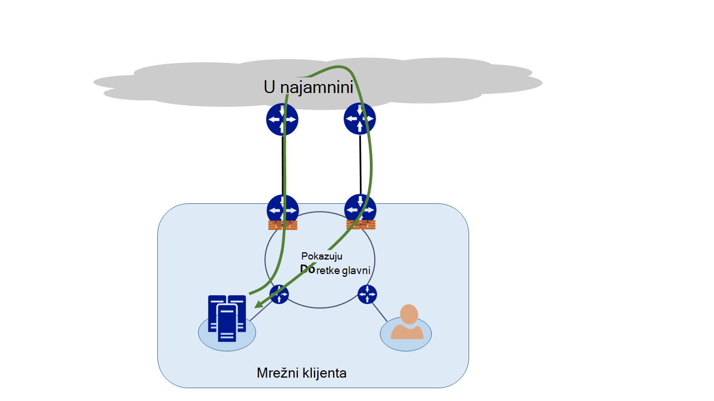
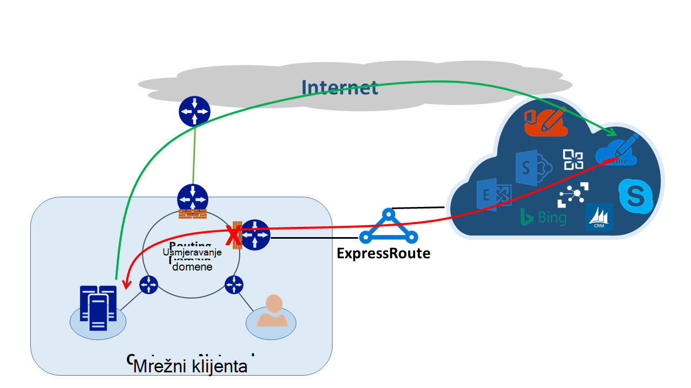
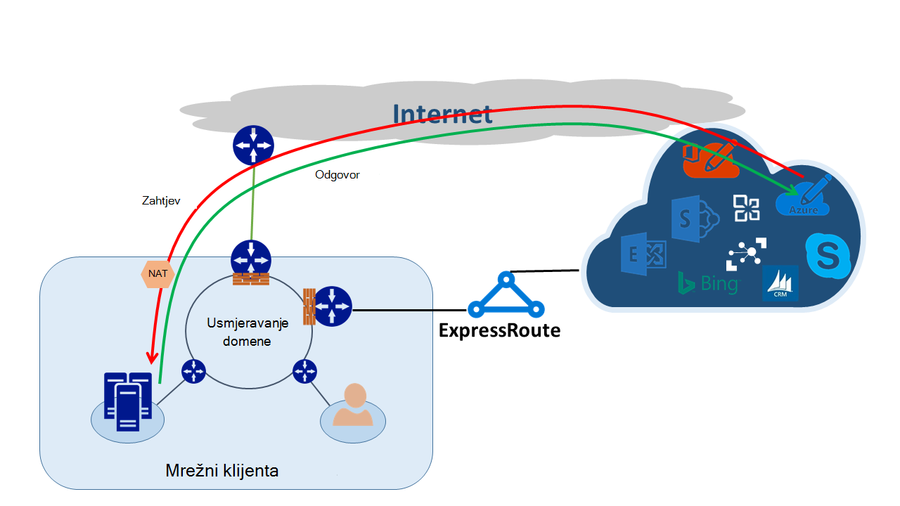

<properties
   pageTitle="Usmjeravanje asimetričnim | Microsoft Azure"
   description="U ovom se članku vodit će vas kroz problemi klijenta možda će biti namijenjeno s asimetričnim usmjeravanju u mrežu koja ima više veza na odredište."
   documentationCenter="na"
   services="expressroute"
   authors="osamazia"
   manager="carmonm"
   editor=""/>
<tags
   ms.service="expressroute"
   ms.devlang="na"
   ms.topic="get-started-article"
   ms.tgt_pltfrm="na"
   ms.workload="infrastructure-services"
   ms.date="10/10/2016"
   ms.author="osamazia"/>

# Asimetričnim usmjeravanje s više mrežne putove

U ovom se članku objašnjava kako naprijed i vratite mrežni promet može potrajati različite usmjerava kada su dostupni između mreže izvorišne i odredišne više putova.

Važno da biste shvatili koncepte dva da biste shvatili asimetričnim usmjeravanje je. Jedna je učinak više mrežne putove. Drugi je kako zadržati uređajima, kao što su vatrozid, stanje. Ove vrste uređaja nazivaju se s praćenjem stanja uređaja. Kombinacijom tih dvaju čimbenika stvara scenariji u svoju mrežu promet se prekine s praćenjem stanja uređaj jer otkrili da promet potječe s uređajem sam s praćenjem stanja uređaja.

## Više mrežne putove

Kad poslovne mreže sadrži samo jednu vezu s internetom putem njihove davatelj internetskih usluga, sve promet i s Interneta prelazi isti put. Često tvrtke kupite više krugova kao suvišnih putovi da biste poboljšali vrijeme aktivnosti mreže. Kada se to dogodi, moguće je da se promet koja stoji izvan mreže s Internetom prolazi kroz jedne veze i povrata promet prolazi kroz različite veze. To se obično naziva asimetričnim usmjeravanja. U asimetričnim usmjeravanje obrnutim mrežni promet vodi drugi put iz izvorne toka.

Iako se uglavnom se pojavljuje na Internetu, asimetričnim usmjeravanje i odnosi se na druge kombinacije više putova. Odnosi, na primjer, i put do Internet i privatni put s istim odredištem, a više privatne putova do istim odredištem.

Svaki usmjerivač usput iz izvora odredište, formula izračunava najbolje put dosegne odredište. Utvrđivanje usmjerivača puta najbolji mogući temelji se na dva glavna čimbenika:

-   Usmjeravanje između vanjskih mreža temelji se na protokol usmjeravanja, obrub pristupnika Protocol (BGP). BGP preuzima oglasa s susjeda i pokreće ih kroz niz koraka da biste odredili najbolje put na predviđeno odredište. Najbolji put sprema usmjeravanje tablici.
-   Duljina masku pridružene rutu utječe usmjeravanje putovi. Ako usmjerivač dobije više oglasa za istu IP adresu, ali s maske različite podmreže, usmjerivač želi oglašavanje s više masku jer je smatra određen usmjeravanje.

## Uređaji s praćenjem stanja

Usmjerivača pogledajte zaglavlje IP paketa radi usmjeravanja. Pogledajte neke uređaje čak i detaljnije unutar paket. Obično te uređaje pogledajte Layer4 (Transmission Control Protocol ili TCP; ili User Datagram Protocol ili UDP) ili čak Layer7 zaglavlja (aplikacijskom sloju). Ove vrste uređaja su sigurnosni uređaji ili optimizacije propusnosti uređaja. 

Vatrozid je uobičajenih primjera s praćenjem stanja uređaja. Vatrozid omogućuje ili onemogućava paket za proći kroz njegov sučelja koji se temelji na različitim poljima kao što su protokol, TCP/UDP priključaka i zaglavlja URL-a. Ta razina provjere paketa stavlja podebljano obrade Učitaj na uređaju. Da biste poboljšali performanse, vatrozida pregledava prvi paket u tijeku. Ako je dopušta paketa da biste nastavili, zadržava informacije o tijeku njegov tablici Država. Sve kasnije pakete vezane uz ovaj tijek dopušteno na temelju početnog određivanja. Paket koja je dio postojeći tijek možda dolaze vatrozida. Ako je vatrozid bez prethodnog stanje informacije o njoj, vatrozida izostavlja paket.

## Asimetričnim usmjeravanje s ExpressRoute

Kada se povežete s Microsoft kroz Azure ExpressRoute, promjene mreže ovako:

-   Imate više veza Microsoftu. Jedne veze postojeće internetske veze, a drugi putem ExpressRoute. Neke promet Microsoftu možda otvorite putem Interneta, ali vratite putem ExpressRoute ili obrnuto.
-   Primit ćete konkretne IP adrese putem ExpressRoute. Tako da radi prometa s mreže Microsoft za servise koje nudi putem ExpressRoute, usmjerivača uvijek radije ExpressRoute.

Da biste shvatili efekt su ove dvije promjene na mreži, recimo razmislite o nekim scenarijima. Primjerice, imate samo jedan elektronička s Internetom i zauzeti sve Microsoftove servise putem Interneta. Promet s mreže Microsoft i natrag putuje, a isti internetske veze i prolazi kroz vatrozid. Vatrozid zapisa tijeka dok ne vidi prvi paketa i povrata pakete dopuštene jer tijeka postoji u tablici Država.

Nakon toga uključite ExpressRoute i zauzeti servise koje nudi Microsoft putem ExpressRoute. Sve ostale servise od Microsofta potrošiti putem Interneta. Implementacija zasebnom vatrozid na vašem rub koji je povezan s ExpressRoute. Microsoft oglašava konkretne prefiksi s mrežom putem ExpressRoute za određene usluge. Infrastruktura za usmjeravanje odabire ExpressRoute za željeni put za te prefiksi. Ako se ne oglašavanje javnu IP adrese Microsoftu putem ExpressRoute, Microsoft komunicira s javnu IP adrese putem Interneta. Prosljeđivanje promet s mreže Microsoft koristi ExpressRoute i obrnutim promet od Microsofta koristi s Internetom. Kada vatrozid na rub vidi odgovor paketa za tijek koji ne nađe u tablici Država, izostavlja povratnu promet.

Ako odlučite koristiti isti skup prevođenje (NAT) adresu mreže za ExpressRoute i s Internetom, vidjet ćete slične probleme s klijente u vašoj mreži na privatnim IP adrese. Zahtjevi za servise kao što su Windows Update prijeći putem Interneta jer je IP adresa za te servise su objavljeno putem ExpressRoute. Međutim, povrata promet isporučuje se ponovno putem ExpressRoute. Ako Microsoft prima IP adresu s istom masku iz internetske i ExpressRoute, želi ExpressRoute putem Interneta. Ako je vatrozida ili neki drugi uređaj s praćenjem stanja koja se nalazi na rub na mreži i nasuprotne ExpressRoute bez prethodnog informacije o tijeka, izostavlja pakete koji pripadaju taj tijek.

## Asimetričnim usmjeravanje rješenja

Imate dvije glavne mogućnosti za rješavanje problema s asimetričnim usmjeravanja. Jedna je putem usmjeravanja, a drugi je pomoću koji se temelji na izvoru NAT (SNAT).

### Usmjeravanje

Provjerite je li da se javnu IP adrese objavljeno na odgovarajuće područje širine mreža (WAN) veze. Na primjer, ako želite koristiti Internet za provjeru autentičnosti promet i ExpressRoute za poštu prometa, koje treba ne Oglasite Active Directory Federation Services (AD FS) javne IP adresama putem ExpressRoute. Isto tako, obavezno ne izlažu lokalnog poslužitelja za AD FS s IP adresama usmjerivač prima putem ExpressRoute. Usmjerava primljene putem ExpressRoute vrijede više da bi provoditi ExpressRoute željeni put za provjeru autentičnosti promet Microsoftu. Zbog toga asimetričnim usmjeravanja.

Ako želite koristiti ExpressRoute za provjeru autentičnosti, provjerite je li se oglašavanje AD FS javnu IP adrese putem ExpressRoute bez NAT. Na taj način, promet koji potječu od tvrtke Microsoft i vodi do lokalnog poslužitelja za AD FS prijeđe preko ExpressRoute. Vratite se promet od klijenta Microsoft koristi ExpressRoute jer je Preferirani usmjeravanje putem Interneta.

### Koji se temelji na izvoru NAT

Drugi način rješavanja asimetričnim usmjeravanje problemi je pomoću SNAT. Na primjer, koju ste nije objavljeno javnu IP adresu lokalnog poslužitelja Simple Mail Transfer Protocol (SMTP) putem ExpressRoute jer je namjeravate koristiti Internet za tu vrstu komunikacije. Zahtjev za koji potječe s Microsoftom i odlazak lokalnog poslužitelja za SMTP putuje, a na Internetu. Koje SNAT dolazni zahtjev za interne IP adresa. Obrnuti promet s poslužitelja SMTP odlazak rub vatrozida (koristi se za NAT) umjesto putem ExpressRoute. Povrat promet povratak putem Interneta.

## Asimetričnim usmjeravanje otkrivanje

Traceroute je najbolji način da biste bili sigurni da mrežni promet traversing očekivani put. Ako očekujete promet s lokalnog poslužitelja za SMTP tvrtki Microsoft da bi put Internet, Očekivani traceroute je SMTP poslužitelja sustava Office 365. Rezultat Provjeri valjanost da promet se uistinu ostavite mrežom prema s Internetom, a ne prema ExpressRoute.
