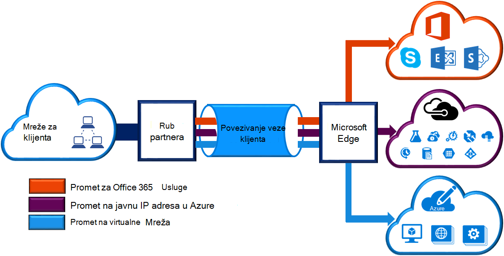
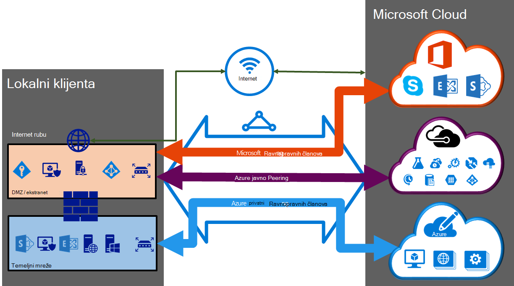

<properties 
   pageTitle="ExpressRoute krugova i usmjeravanje domene | Microsoft Azure"
   description="Ova stranica sadrži pregled ExpressRoute krugova i usmjeravanje domene."
   documentationCenter="na"
   services="expressroute"
   authors="cherylmc"
   manager="carmonm"
   editor=""/>
<tags 
   ms.service="expressroute"
   ms.devlang="na"
   ms.topic="article" 
   ms.tgt_pltfrm="na"
   ms.workload="infrastructure-services" 
   ms.date="10/10/2016"
   ms.author="cherylmc"/>

# ExpressRoute krugova i usmjeravanje domene

 Morate narudžbe *elektronička ExpressRoute* za povezivanje infrastruktura za lokalni Microsoftu putem davatelja povezivanja. Na slici u nastavku sadrži logičke prikaz veze između WAN i Microsoft.

## ExpressRoute krugova

*Elektronička ExpressRoute* predstavlja logičke veza između lokalnog Infrastruktura i Microsoftovim servisima u oblaku putem davatelja povezivanja. Redoslijed možete više ExpressRoute krugova. Svaki elektronička može biti u istom ili drugom regijama i moguće je povezati svoje lokalno putem davatelja različite povezivanje. 

ExpressRoute krugova mapirajte se svi fizičke entiteti. Na elektronička jedinstveno identificirati standardna GUID pozvati kao ključa usluge (s ključ). Ključ za servis je samo dio informacije razmjenjivati između Microsoft, davatelj usluga za povezivanje, a. Tipku s nije tajna sigurnosnih razloga. Postoji 1:1 mapiranja između programa elektronička ExpressRoute i tipku s.

Elektronička se ExpressRoute mogu imati do tri neovisno peerings: Azure privatnog javni, Azure i Microsoft. Svaki peering je par neovisno BGP sesije svaki od njih redundantly konfiguriran za visoke dostupnosti. Postoji na 1: n (1 < = N < = 3) mapiranja između programa elektronička ExpressRoute i usmjeravanje domene. Elektronička se ExpressRoute može imati nešto, dvije ili sve tri peerings omogućeno po ExpressRoute sklopovske.
 
Svaki elektronička ima fixed propusnosti (50 MB/s, 100 MB/s, 200 MB/s, 500 MB/s, 1 Gbps, 10 Gbps) i mapirati je davatelj usluga za povezivanje i peering mjesto. Propusnost odaberete je zajednički koristiti s peerings za na elektronička. 

### Kvota, ograničenja i ograničenja

Zadani kvotama i ograničenja primjenjuju se za svaki elektronička ExpressRoute. Odnosi se na stranicu [pretplate Azure i ograničenja servisa, kvote, i ograničenjima](../azure-subscription-service-limits.md) najnovije informacije o kvotama.

## ExpressRoute usmjeravanje domene

Elektronička se ExpressRoute sadrži više domena usmjeravanje pridružen: Azure privatnog javni, Azure i Microsoft. Svaku domenu za usmjeravanje jednak način je konfiguriran na par usmjerivača (Aktivno aktivno ili zajedničko korištenje učitavanja konfiguracije) za visoke dostupnosti. Azure services kategorizirane kao *Azure javne* i *privatne Azure* predstavlja IP adresama sheme.

### Privatni peering

Azure izračunati servise, odnosno virtualnim strojevima (IaaS) i servise u oblaku (PaaS), koje su uvedene unutar virtualne mreže mogu povezati putem privatne peering domene. Privatni peering domene smatra se pouzdanih nastavka mreže core u Microsoft Azure. Možete postaviti dvosmjerne veze između core mreže i Azure virtualne mreže (VNets). Ovaj peering možete povezati s virtualnim strojevima i uslugama izravno na svojim privatnim IP adresa u oblaku.  

Možete se povezati više mreža virtualne privatne peering domenu. Pregledajte [stranicu najčešća pitanja vezana uz](expressroute-faqs.md) informacije o ograničenjima i ograničenja. Možete posjetiti stranicu [pretplate Azure i ograničenja servisa, kvote, i ograničenjima](../azure-subscription-service-limits.md) za najnovije informacije na ograničenja.  Odnose se na stranicu [usmjeravanja](expressroute-routing.md) detaljne informacije o konfiguraciji usmjeravanja.

### Javni peering

Na javnu IP adrese se nude servise kao što je prostor za pohranu Azure, baze podataka SQL i web-mjesta. Privatno možete povezati usluga koje se nalaze na javnu IP adrese, uključujući VIPs servisa oblaka putem javne domene peering usmjeravanje. Možete povezati javno peering domene vaše DMZ i povezati se sve servise Azure na javnu IP adrese iz vaše WAN bez potrebe za povezivanje putem Interneta. 

Povezivanje uvijek pokrenuto iz vaše WAN Microsoft Azure servisima. Servisa Microsoft Azure nećete moći da biste započeli veze u mreži kroz ovu domenu za usmjeravanje. Kada javno peering omogućena, moći povezati sve Azure servise. Ne možemo ne dopušta selektivno odaberite servise koje ćemo Oglasite usmjerava na. Možete pregledati na popisu prefiksi smo Oglasite vas kroz ovaj peering na stranici [Microsoft Azure podatkovnog centra IP raspone](http://www.microsoft.com/download/details.aspx?id=41653) . Na stranici tjednih će se ažurirati.

Možete definirati prilagođeni usmjeravanje filtre u mreži trošiti samo usmjerava vam je potrebna. Odnose se na stranicu [usmjeravanja](expressroute-routing.md) detaljne informacije o konfiguraciji usmjeravanja. Možete definirati prilagođeni usmjeravanje filtre u mreži trošiti samo usmjerava vam je potrebna. 

Potražite u članku [Najčešća pitanja vezana uz stranice](expressroute-faqs.md) dodatne informacije na servisima podržane putem javne domene peering usmjeravanja. 
 
### Microsoft peering

[AZURE.INCLUDE [expressroute-office365-include](../../includes/expressroute-office365-include.md)]

Povezivanje na sve ostale Microsoft online services (kao što je Office 365 services) bit će kroz Microsoft peering. Ne možemo omogućiti dvosmjerne veze između WAN i Microsoft cloud servisa putem Microsoft peering za usmjeravanje domene. Morate se povezati s Microsoftovim servisima u oblaku samo na javnu IP adresa koji su vlasništvu vi ili vaš davatelj usluga za povezivanje i moraju biti definirani pravila. Posjetite stranicu [ExpressRoute preduvjeti](expressroute-prerequisites.md) za dodatne informacije.

Potražite u članku [Najčešća pitanja vezana uz stranice](expressroute-faqs.md) dodatne informacije na servise koje su podržane, troškove i konfiguracija pojedinosti. Posjetite stranicu [ExpressRoute mjesta](expressroute-locations.md) informacije na popisu povezivanje davatelja koja nudi peering Microsoftovoj službi za podršku.

## Usmjeravanje usporedbe domene

U tablici u nastavku uspoređuje tri usmjeravanje domene.

||**Privatni Peering**|**Javni Peering**|**Microsoft Peering**|
|---|---|---|---|
|**Max. # Prefiksi podržane po peering**|4000 prema zadanim postavkama, 10 000 s ExpressRoute Premium|200|200|
|**Podržani rasponi IP adresa**|Bilo koji valjani IPv4 adresa unutar vaše WAN.|Javni IPv4 adrese posjeduje vi ili vaš davatelj usluga za povezivanje.|Javni IPv4 adrese posjeduje vi ili vaš davatelj usluga za povezivanje.|
|**KAO broj preduvjeti**|Privatni i javni kao brojevi. Morate biti vlasnik javnosti kao broj ako odaberete da biste koristili neki. | Privatni i javni kao brojevi. Međutim, morate dokaz vlasništva nad javnu IP adrese.| Privatni i javni kao brojevi. Međutim, morate dokaz vlasništva nad javnu IP adrese.|
|**Usmjeravanje sučelja IP adresa**|RFC1918 i javnu IP adresa|Javnu IP adrese registrirati u smjeru registries.| Javnu IP adrese registrirati u smjeru registries.|
|**Podrška za raspršivanje MD5**| Da|Da|Da|

Možete odabrati da biste omogućili jednu ili više domena za usmjeravanje kao dio njihove elektronička ExpressRoute. Možete odabrati da bi se staviti na isti VPN ako želite da ih spojiti u jednu domenu za usmjeravanje usmjeravanje domene. Možete postaviti i ih na različitim usmjeravanje domena, slično kao na dijagram. Preporučena konfiguracija je privatna peering priključen izravno na mreži core i javnih i Microsoft peering veze spojeni na DMZ.
 
Ako se odlučite za tri peering istodobna, morate imati tri parova BGP sesije (para međusobno za svaku vrstu peering). Sesije parove BGP već iznimno dostupna veza. Ako se povezujete putem davatelja usluga 2 povezivanje sloja, bit će odgovoran za konfiguriranje i upravljanje usmjeravanja. Možete saznati više tako da pročitate [tijekova rada](expressroute-workflows.md) za postavljanje ExpressRoute.

## Daljnji koraci

- Pronađite davatelja usluge. Potražite u članku [ExpressRoute davateljima usluga i lokacije](expressroute-locations.md).
- Provjerite je li sve preduvjete zadovoljeni. Pogledajte [preduvjete ExpressRoute](expressroute-prerequisites.md).
- Konfiguriranje veza s ExpressRoute.
    - [Stvaranje je elektronička ExpressRoute](expressroute-howto-circuit-classic.md)
    - [Konfiguriranje usmjeravanje (sklopovske peerings)](expressroute-howto-routing-classic.md)
    - [Povezivanje s VNet je elektronička ExpressRoute](expressroute-howto-linkvnet-classic.md)
