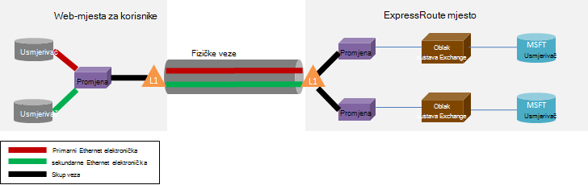

<properties
   pageTitle="ExpressRoute najčešća Pitanja"
   description="Najčešća pitanja o ExpressRoute sadrži informacije o podržane servisa Azure, cijena, podataka i veze, SLA, davatelje usluga i mjesta, propusnosti i dodatne tehničke pojedinosti."
   documentationCenter="na"
   services="expressroute"
   authors="cherylmc"
   manager="carmonm"
   editor=""/>
<tags
   ms.service="expressroute"
   ms.devlang="na"
   ms.topic="article" 
   ms.tgt_pltfrm="na"
   ms.workload="infrastructure-services"
   ms.date="10/10/2016"
   ms.author="cherylmc"/>

# ExpressRoute najčešća Pitanja

## Što je ExpressRoute?
ExpressRoute je Azure usluga koja omogućuje stvaranje privatne veze između podatkovnim centrima Microsoft i infrastrukture lokalno ili u colocation funkciji. ExpressRoute veze ne otvorite putem javnog Interneta, a nude veću sigurnost, pouzdanosti i brzine s donje latencies od standardne veze putem Interneta.

### Koje su prednosti korištenja ExpressRoute i veze privatne mreže?
ExpressRoute veze ne otvorite putem javnog Interneta, a nude veću sigurnost, pouzdanosti i brzine s donje i dosljedni latencies od standardne veze putem Interneta. U nekim slučajevima pomoću veza ExpressRoute za prijenos podataka između lokalnog uređaja i Azure možete yield pogodnosti značajan trošak.

### Koji su servisi Microsoft cloud su dostupne putem ExpressRoute?
ExpressRoute podržava većina servisa Microsoft Azure koje danas uključujući Office 365.  Potraži ažuriranja na uskoro Općenito dostupan.

### Gdje je servis dostupne?
Pogledajte ovu stranicu za mjesto servisa i dostupnost: [ExpressRoute partnera i lokacije](expressroute-locations.md).

### Kako koristiti ExpressRoute za povezivanje s Microsoft Ako nemam partnerstvo s jednim od partnera ExpressRoute prijenosni?
Možete odabrati regionalne prijenosni i krenuti Ethernet veze na neki od podržanih exchange mjesta davatelja usluga. Zatim možete ravnopravni s Microsoftom na mjestu davatelja usluga. Potvrdite okvir u odjeljku zadnju [ExpressRoute partnera i mjesta](expressroute-locations.md) da biste vidjeli ako je vaš davatelj usluga koje su prisutne u jednom od mjesta exchange. Redoslijed možete pa je elektronička ExpressRoute putem davatelja usluga za povezivanje s Azure.

### Koliko stoji ExpressRoute trošak?
Provjerite informacije o cijenama [cijene pojedinosti](https://azure.microsoft.com/pricing/details/expressroute/) .

### Ako je li platiti je elektronička ExpressRoute navedeni propusnosti VPN veza koje možete kupiti od davatelja usluga moju mrežu mora li se istom brzinom?
ne. VPN vezu s bilo kojeg brzinu možete kupiti od vašeg davatelja usluga. Međutim, vezu Azure bit će ograničeni na propusnost elektronička ExpressRoute koji ste kupili.

### Ako je li platiti je elektronička ExpressRoute navedeni propusnosti imam mogućnost brzi niz najviše veće brzine eventualno?
Da. ExpressRoute krugova konfigurirani tako da podržava slučajevima gdje ste možete brzi niz do dva puta ograničenje propusnosti nabavljaju bez dodatnih troškova. Ako oni podržavaju tu mogućnost, obratite se davatelju usluga.

### Možete koristiti istu vezu privatna mreža s virtualne mreže i drugim servisima za Azure istodobno?
Da. Elektronička se ExpressRoute jednom postavljanje će vam omogućiti da biste pristupili servisa unutar virtualne mreže i drugim servisima za Azure istodobno. Virtualna mrežama putem privatne peering put i ostale servise će se povezati putem javne peering put.

### Nudi sustav ExpressRoute servisa ugovor o razini (SLA)?
Pogledajte na [stranici ExpressRoute SLA](https://azure.microsoft.com/support/legal/sla/) dodatne informacije.

## Podržane usluge
Većina Azure services podržani su putem ExpressRoute.

- Veza s virtualnim strojevima i servise u oblaku implementiran u virtualne mreže podržani su iznad privatne peering put.
- Putem javne peering put podržani su Azure web-mjesta.
- Koncentrator IoT podržano je putem javne peering put.
- Office 365 podržano je putem Microsoft peering put.
- Sve ostale servise može se pristupiti putem javne peering put. Iznimke su.

    **Nisu podržani sljedeći servisi:**

    - CDN
    - Visual Studio Team Services testiranje učitavanja
    - Višestruka provjera autentičnosti
    - Upravitelj promet

## Podaci i veze

### Postoje li ograničenja količinu podataka koji se mogu prenijeti pomoću ExpressRoute?
Ne možemo postavili granicu na iznos prijenos podataka. Potražite informacije o propusnosti stope [cijene pojedinosti](https://azure.microsoft.com/pricing/details/expressroute/) .

### Što brzine veze podržava ExpressRoute?
Podržani ponuda za propusnost:

| 50 MB/s, 100 MB/s, 200 MB/s, 500 MB/s, 1Gbps, 2 Gbps, 5 Gbps, 10Gbps |

### Koje davatelje usluga su dostupne?
Potražite u članku [ExpressRoute partnera i mjesta](expressroute-locations.md) za popis davateljima usluga i mjesta.

## Tehničke pojedinosti

### Koji su Tehnički preduvjeti za povezivanje svoju lokaciju lokalnog Azure?
Pročitajte članak [ExpressRoute preduvjeti stranice](expressroute-prerequisites.md) preduvjete.

### Veza na ExpressRoute su suvišna?
Da. Svaki elektronička usmjeravanje Express ima suvišnih par unakrsni veze konfigurirana za pružanje visoke dostupnosti.

### Hoću li izgubiti povezivanje ako jednu od veza Moje ExpressRoute neće funkcionirati?
Povezivanje nećete izgubiti neke unakrsne veze ne uspije. Suvišne veze dostupna je za podršku opterećenje mreže. Osim toga možete stvoriti više krugova na neko drugo mjesto peering da biste postigli resilience nije uspjelo.

### Ako nisam Suradnja nalazi u oblak exchange, a zatim Moje usluga nudi point-to-point veze, morate narudžbe dva fizičke veze između moju lokalnu mrežu i Microsoft? 
Ne, morate samo jedan fizičke veze ako vaš davatelj usluga možete uspostaviti dva Ethernet virtualne krugova putem fizičke veze. Fizičke veze (npr. za optičko optičkog) prekinut je na sloj 1 (L1) uređaja (pogledajte slici u nastavku). Dva virtualne krugova Ethernet su označene različite VLAN ID-ove, jedan za primarni elektronička i jedan za sekundarne. ID-a te VLAN su vanjski 802.1Q Ethernet zaglavlja. Unutarnji 802.1Q Ethernet zaglavlje (koji nisu prikazani) mapirani na određenu [domenu za usmjeravanje ExpressRoute](expressroute-circuit-peerings.md). 

### Mogu li proširiti nešto Moje VLANs za Azure pomoću ExpressRoute?
ne. Ne podržavamo sloja 2 povezivanje proširenja u Azure.

### Možete imati više od jedne ExpressRoute elektronička u pretplate?
Da. Imate više od jedne elektronička ExpressRoute za pretplatu. Ograničenje zadani broj namjenski krugova postavljen je na 10. Možete se obratiti Microsoftovoj Support da biste povećali ograničenje prema potrebi.

### Mogu li koristiti ExpressRoute krugova s različitim davateljima usluga?
Da. Imate ExpressRoute krugova s mnogo davateljima usluga. Svaki elektronička ExpressRoute će biti povezan s jednog usluga samo.

### Kako povezati Moje virtualne mreže da biste je elektronička ExpressRoute
Osnovni koraci su strukturirane ispod.

- Morate uspostaviti je elektronička ExpressRoute, a usluga je omogućiti.
- Ili davatelja morate konfigurirati na BGP peering (s).
- Elektronička ExpressRoute morate povezati virtualne mreže.

Dodatne informacije potražite u članku [Tijekovi rada ExpressRoute za dodjelu resursa elektronička i elektronička stanja](expressroute-workflows.md) .

### Postoje li ograničenja povezivanja za moj elektronička ExpressRoute?
Da. [ExpressRoute partnera](expressroute-locations.md) i mjesta sadrži pregled granica povezivanje za je elektronička ExpressRoute. Povezivanja programa ExpressRoute elektronička ograničeno je na jedno područje Geopolitički. Povezivanje se proširuje Unakrsna Geopolitički područja tako da omogućite značajku ExpressRoute premium.

### Može li veza na više od jedne virtualne mreže da biste je elektronička ExpressRoute?
Da. Do 10 virtualne mreže možete povezati je elektronička ExpressRoute.

### Mogu imati više pretplata Azure koje sadrže virtualne mreže. Može li se povezati virtualne mrežama u zasebnom pretplate na jednom elektronička ExpressRoute?
Da. Možete Autorizirajte do 10 druge Azure pretplate da biste koristili jednu elektronička ExpressRoute. To ograničenje možete povećati tako da omogućite značajku ExpressRoute premium.

Dodatne informacije potražite u članku [zajedničko korištenje programa ExpressRoute elektronička preko višestruke pretplate](expressroute-howto-linkvnet-arm.md).

### Virtualne mreže povezani s istom elektronička Izolirani međusobno?
ne. Virtualne mreže povezane s istom elektronička ExpressRoute su dio na istom domenu i nisu Izolirani međusobno iz perspektive usmjeravanja. Ako vam je potrebna usmjeravanje odvajanja, morate stvoriti zasebnu elektronička ExpressRoute.

### Mogu li koristiti virtualne mreže s više od jedne elektronička ExpressRoute?
Da. Možete povezati jedan virtualne mreže s još 4 ExpressRoute krugova. Mora biti naručiti do 4 drugim [mjestima ExpressRoute](expressroute-locations.md).

### Mogu li pristupiti s Internetom iz moje virtualne mreža s ExpressRoute krugova?
Da. Ako ste nije objavljeno zadani usmjerava (0.0.0.0/0) ili internet usmjeravanje prefiksi kroz BGP sesiju, moći povezati s Internetom virtualne mreže povezane s je elektronička ExpressRoute.

### Je li moguće blokirati internetske veze, virtualne mrežama s ExpressRoute krugova?
Da. Možete Oglasite zadani usmjerava (0.0.0.0/0) da biste blokirali sva internetska veza na virtualnim strojevima implementiran unutar virtualne mreže i usmjeravanje sveg prometa out elektronička ExpressRoute. Imajte na umu da ako Oglasite usmjerava zadane, ne možemo će prisilno promet za servise koje nudi putem javne peering (kao što su i baze podataka SQL Azure prostor za pohranu) natrag na lokalni. Morat ćete konfigurirati svoje usmjerivača da biste se vratili promet Azure putem javne peering put ili putem Interneta.

### Možete virtualne mreže povezane s istom elektronička ExpressRoute razgovarati međusobno?
Da. Virtualnim strojevima implementiran u virtualne mreže s istom elektronička ExpressRoute mogu komunicirati s drugom.

### Mogu li koristiti povezivanje web-mjesto za virtualne mreže u kombinaciji s ExpressRoute?
Da. ExpressRoute mogu postojati zajedno sa VPN-ovi web-mjesto.

### Je li moguće premjestiti virtualne mreže s web-mjesto / točke web konfiguraciju ExpressRoute?
Da. Morat ćete stvaranje pristupnika za ExpressRoute unutar virtualne mreže. Pojavit će se mali nedostupnost povezanu s procesom.

### Što je potrebno za povezivanje sa spremištem Azure putem ExpressRoute?
Morate uspostaviti je elektronička ExpressRoute i konfigurirati za javne peering.

### Postoje li ograničenja broja usmjerava li možete Oglasite?
Da. Ne možemo prihvatiti do 4000 prefiksi usmjeravanje za privatne peering te 200 svaki za javne peering i Microsoft peering. Možete povećati na 10 000 usmjerava za privatne peering Ako omogućite značajku ExpressRoute premium.

### Postoje li ograničenja IP rasponi li možete Oglasite nad sesijom BGP?
Ne možemo prihvatiti privatne prefiksi (RFC1918) javnih i Microsoft peering BGP sesije.

### Što se događa ako li prijeći na BGP ograničava?
Sesije BGP će biti ispušteni. Će se vratiti kada count prefiks dolazi ispod ograničenje.

### Što je vrijeme čekanja ExpressRoute BGP? Je moguće prilagoditi?
Vrijeme čekanja je 180. Produžite poruke šalju svakih 60 sekundi. Te su fiksni postavke na strani Microsoft koje nije moguće promijeniti.

### Kad se moj virtualne mrežama Oglasite zadani smjer (0.0.0.0/0), nije moguće aktivirati Windows koji se izvode na moj VMs Azure. Kako na popraviti?
Sljedeći koraci omogućit će Azure prepoznaje zahtjev za aktivaciju:

1. Uspostavljanje javno peering vaše elektronička ExpressRoute.
2. Izvođenje DNS pretraživanja i pronađite IP adresu **kms.core.windows.net**
3. Zatim učinite nešto od sljedeće dvije stavke tako da se servisa za upravljanje ključ prepoznat će zahtjev za aktivaciju dolazi iz Azure te će poštovati zahtjev.
    - Promet namijenjene prikazivanju IP adresa (nabavili u koraku 2) natrag na Azure putem javne peering usmjerili na lokalnu mrežu.
    - Imati promet natrag na Azure putem javne peering NSP davatelja kosa-PIN-a.

### Je li moguće promijeniti propusnosti programa elektronička ExpressRoute?
Da. Možete povećati propusnosti programa elektronička ExpressRoute bez potrebe za tear prema dolje. Morat ćete daljnji rad s davateljem povezivanje da biste bili sigurni da ažurira Reguliranje unutar svoje mreže za podršku povećava propusnosti. Međutim, nećete moći smanjiti propusnosti programa elektronička ExpressRoute. Potrebe za donjem propusnosti prekinu s iscrtanim prema dolje i rekreacija je elektronička ExpressRoute.

### Kako promijeniti propusnosti programa elektronička ExpressRoute?
Možete ažurirati propusnosti elektronička ExpressRoute pomoću cmdlet ažuriranje namjenski elektronička API i PowerShell.

## ExpressRoute Premium

### Što je ExpressRoute premium?
ExpressRoute premium je skup značajki navedena u nastavku.

 - Povećana usmjeravanje tablice ograničenje od 4000 usmjerava 10 000 usmjerava za privatne peering.
 - Povećana broj VNets koje se mogu povezati elektronička ExpressRoute (Zadana vrijednost je 10). Pogledajte tablicu ispod više pojedinosti.
 - Globalni Povezivost putem mreže Microsoft core. Sada moći povezati VNet u jednom području Geopolitički s je elektronička ExpressRoute u drugoj regiji. **Primjer:** Možete povezati VNet stvorene u Europi Zapad da biste je elektronička ExpressRoute stvorene u Silicon udubljenje.
 - Povezivanje na servise sustava Office 365 i CRM Online.

### Koliko VNets možete se povezati je elektronička ExpressRoute ako je li omogućeno ExpressRoute premium?
U tablicama u nastavku Prikaži ExpressRoute ograničenja i broj VNets po ExpressRoute sklopovske.

[AZURE.INCLUDE [expressroute-limits](../../includes/expressroute-limits.md)]

### Kako omogućiti ExpressRoute premium?
Kada značajka je omogućena, a može isključiti ažuriranjem stanje elektronička mogu omogućiti ExpressRoute premium značajkama. Možete omogućiti ExpressRoute premium vrijeme stvaranja elektronička ili da biste uputili poziv elektronička ažuriranje namjenski API / cmdlet ljuske PowerShell da biste omogućili ExpressRoute premium.

### Kako onemogućiti ExpressRoute premium?
ExpressRoute premium možete onemogućiti tako da nazovete ažuriranje namjenski elektronička API / cmdlet ljuske PowerShell mora biti sigurni da imate skalirana stanje veze mora zadovoljavati ograničenja zadani prije no što onemogućite ExpressRoute premium. Ne možemo neće uspjeti zahtjev da biste onemogućili ExpressRoute premium ako vaš Upotreba mijenja veličinu izvan ograničenja zadani.

### Možete I odabrati značajke želim iz skup značajki premium?
ne. Nećete moći odabrati potrebne značajke. Kada uključite ExpressRoute premium ćemo Omogući sve značajke.

### Koliko stoji trošak ExpressRoute premium?
Pogledajte [detalje cijene](https://azure.microsoft.com/pricing/details/expressroute/) za trošak.

### Platiti za ExpressRoute premium osim standardni ExpressRoute troškove?
Da. ExpressRoute premium naplaćuje pri vrhu ExpressRoute elektronička naknade i troškove potrebnih davatelj usluga za povezivanje.

## ExpressRoute i servisa sustava Office 365 i CRM Online

[AZURE.INCLUDE [expressroute-office365-include](../../includes/expressroute-office365-include.md)]

### Kako stvoriti je elektronička ExpressRoute za povezivanje s servisima sustava Office 365 i CRM Online?

1. Pregledajte stranicu [ExpressRoute preduvjeti stranice](expressroute-prerequisites.md) da biste bili sigurni da ispunjavate uvjete.
2. Pregledajte popis davateljima usluga i mjesta na [partnere ExpressRoute i mjesta](expressroute-locations.md) da biste bili sigurni da su ispunjeni vaše potrebe za povezivanje.
3. Planiranje zahtjeva za kapacitetom tako da pročitate [Planiranje mreže i ugađanje performansi za Office 365](http://aka.ms/tune/).
4. Slijedite korake navedene u nastavku postavljanje povezivanje [ExpressRoute tijekova rada za dodjeljivanje elektronička i država elektronička](expressroute-workflows.md)tijekovima rada.

>[AZURE.IMPORTANT] Provjerite je li koje ste omogućili ExpressRoute premium dodatak prilikom konfiguriranja povezivanje na servise sustava Office 365 i CRM Online.

### Morate omogućiti Azure javno Peering da biste se povezali sa servisima sustava Office 365 i CRM Online?
Ne, samo morate omogućiti Microsoft Peering. Provjera autentičnosti promet za Azure AD poslat će se kroz Microsoft Peering. 

### Moje postojeće ExpressRoute krugova podržavaju povezivanje na servise sustava Office 365 i CRM Online?
Da. Na postojeće ExpressRoute elektronička se može konfigurirati podržava povezivanje sa servisima sustava Office 365. Provjerite imate li dovoljno kapacitet povežite se sa servisima sustava Office 365 i provjerite je li omogućeno premium dodatak. [Planiranje mreže i ugađanje performansi za Office 365](http://aka.ms/tune/) pronaći ćete planiranje vaše potrebe za povezivanje. Pogledajte [Stvaranje i izmjena je elektronička ExpressRoute](expressroute-howto-circuit-classic.md).

### Koje Office 365 services možete pristupiti putem veze ExpressRoute?

Odnosi se na stranicu [sustava Office 365 URL-ovi i rasponi IP adresa](http://aka.ms/o365endpoints) za ažurirani popis servisa podržano putem ExpressRoute.

### Koliko stoji ExpressRoute za servise sustava Office 365 i trošak CRM Online?
Servisi sustava Office 365 i CRM Online potreban je dodatak premium omogućiti. [Cijene stranicu s detaljima](https://azure.microsoft.com/pricing/details/expressroute/) sadrži detalje o troškovima za ExpressRoute.

### Što područja ExpressRoute za Office 365 podržava?
Pogledajte [ExpressRoute partnera i mjesta](expressroute-locations.md) za dodatne informacije o popisu partnera i mjesta na kojima je podržan ExpressRoute.

### Mogu li pristupiti sustavu Office 365 putem Interneta čak i ako ExpressRoute nije konfiguriran za moje tvrtke ili ustanove?
Da. Krajnje točke za Office 365 servisa su dostupan putem Interneta čak i ako je konfiguriran ExpressRoute za mrežu. Ako ste na mjesto kojemu je konfiguriran za povezivanje sa servisima sustava Office 365 putem ExpressRoute, će se povezati putem ExpressRoute.

### Dynamics AX za Outlook Online moguće pristupiti putem veze ExpressRoute?
Ne, nije podržan.
