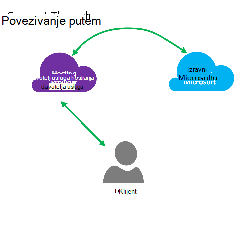
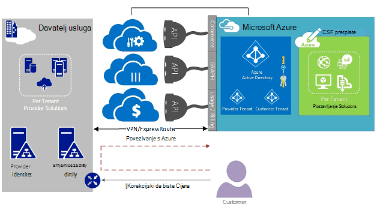
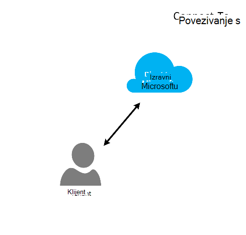
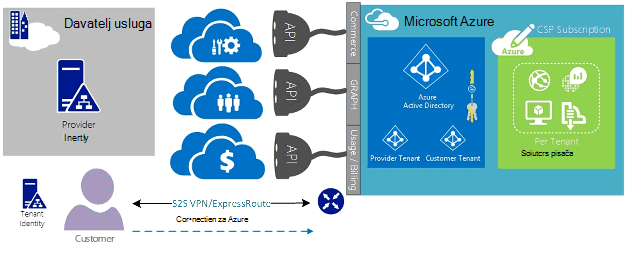
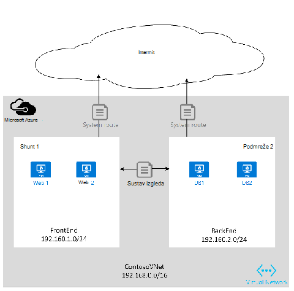
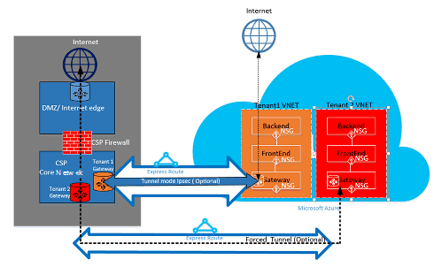

<properties
   pageTitle="Azure ExpressRoute za davatelji rješenja za oblak | Microsoft Azure"
   description="Ovaj članak sadrži informacije za oblak davateljima usluga koji želite ugraditi servisa Azure i ExpressRoute njihove ponude."
   documentationCenter="na"
   services="expressroute"
   authors="richcar"
   manager="carmonm"
   editor=""/>
<tags
   ms.service="expressroute"
   ms.devlang="na"
   ms.topic="get-started-article"
   ms.tgt_pltfrm="na"
   ms.workload="infrastructure-services"
   ms.date="10/10/2016"
   ms.author="richcar"/>

# ExpressRoute za davatelji rješenja za oblak (CSP)

Microsoft pruža Hyper skaliranje usluge za tradicionalni prodavača i distributeri (CSP) da biste mogli brzo dodjela novih servisa i rješenja za klijente bez potrebe za ulažete u razvoju te nove servise. Da biste omogućili oblaka rješenje davatelj (CSP) mogućnost izravno upravljanja te nove servise, Microsoft pruža programi i API-ji koji omogućuju CSP za upravljanje resursima sustava Microsoft Azure ime klijentima. Jedna od tih resursa je ExpressRoute. ExpressRoute omogućuje CSP povezati postojećih resursa za korisnike servisa Azure. ExpressRoute je velika brzina veze privatne komunikacije servisi u Azure. 

ExpresRoute sastoji se od par krugova visoke dostupnosti koje su priložene jednog klijenta subscription(s) i nije moguće zajednički koristiti tako da više korisnika. Svaki elektronička moraju se prekinuti u različitim usmjerivač da biste zadržali visoke dostupnosti.

>[AZURE.NOTE] Postoje caps propusnost i veze na ExpressRoute što znači velika/kompleksnog implementacije će zahtijevati više krugova ExpressRoute za jednog klijenta.

Microsoft Azure nudi sve veći broj servise koje može ponuditi klijentima.  Za preuzimanje najbolje iskoristiti od tih servisa zahtijevaju korištenje veze ExpressRoute za davanje velika brzina niske latencije pristup okruženje sustava Microsoft Azure.

## Upravljanje Microsoft Azure
Microsoft pruža CSPs s API-ji za upravljanje pretplatama Azure kupca dopuštanjem programski Integracija sa sustava za upravljanje vlastitim servisa. Mogućnosti podržane upravljanja možete pronaći [ovdje](https://msdn.microsoft.com/library/partnercenter/dn974944.aspx).

## Upravljanje resursima sustava Microsoft Azure
Ovisno o ugovora s klijentu će odrediti upravljanju pretplate. CSP izravno možete upravljati stvaranja i održavanje resursa ili klijenta možete kontrolirati pretplate Microsoft Azure i stvaranje Azure resursa, kao što je koje su im potrebne. Ako klijent upravlja stvaranje resursa u svoje pretplate na Microsoft Azure će se koristiti jedan od dva modela: modela "Povezivanje putem" ili "Izravno na" modela. Ove modelima su detaljno opisane u u sljedećim odjeljcima.  

### Povezivanje putem modela

  

U modelu povezivanje putem CSP stvara izravnu vezu između vaše podatkovnog centra i klijentovim Azure pretplate. Izravna veza postala je ExpressRoute, veze mreže s Azure. Zatim klijentu se povezuje s mrežom. Ovaj scenarij potreban je da je korisnik odabrao prolazi kroz CSP mreže da biste pristupili Azure services. 

Ako je klijent druge pretplate za Azure ne upravlja administrator koju, želite koristiti javnog Interneta ili vlastite privatne veze za povezivanje s tih servisa dodjeli u odjeljku pretplatu koja nije CSP. 

Za upravljanje uslugama Azure CSP, pretpostavlja se da CSP ima u trgovini identiteta prethodno utvrđene korisnike koje želite pa je replicirati u Azure Active Directory za upravljanje CSP pretplate putem Administrate-On-Behalf-Of (AOBO). Ključne upravljačke programe za taj scenarij obuhvaćaju gdje navedeni partnera ili davatelj usluge sadrži uobičajene odnosa s klijentom, kupca trenutno koristi davatelja usluga ili partnera sadrži želju omogućuju kombinaciju davatelja hostira i Azure hostira rješenja za imaju fleksibilnost i adresu kupca izazove koji ne može biti zadovoljeni po CSP samostalno. Ovaj model je prikazana na **slici**, ispod.

### Povezivanje u model

U modelu povezivanje za davatelja usluga stvara izravne veze između podatkovnog centra njihovih kupaca i s pretplatom CSP dodjeli Azure ExpressRoute putem klijenta (Kupac) mreže.

>[AZURE.NOTE] Za ExpressRoute kupca morate stvoriti i održavati elektronička ExpressRoute.  

Scenarij povezivanje potreban je da je korisnik odabrao povezuje izravno putem mreže klijenta za pristup CSP upravlja Azure pretplatu pomoću izravnu vezu na koji je stvoren, vlasnik i upravlja cijelosti ili djelomično koje je korisnik odabrao. Ti klijenti pretpostavlja se da davatelj trenutno nema uspostaviti spremišta identiteta klijenta i davatelj bi pomoći kupca u replikaciju trenutni iz trgovine otkrivanje u Azure Active Directory za upravljanje svoje pretplate putem AOBO. Ključne upravljačke programe za taj scenarij obuhvaćaju gdje navedeni partnera ili davatelj usluge sadrži uobičajene odnosa s klijentom, kupca trenutno koristi davatelja usluga ili partnera sadrži želju za usluge koje se temelje na isključivo rješenja Azure hostira bez potrebe za postojeće podatkovnog centra za davatelja usluga ili infrastrukture.

Odabir između tih dviju mogućnosti temelje se na web-mjesto potrebe klijenta i u okvir za trenutno morate Azure usluge. Kontrola pojedinosti te modela i pridruženi pristup na temelju uloga, mreže i identitet dizajn uzoraka su obuhvaćeno pojedinosti u sljedeće veze:
-   **Uloga temelji pristup kontrola (RBAC)** – RBAC temelji se na Azure Active Directory.  Dodatne informacije o Azure RBAC potražite [ovdje](../active-directory/role-based-access-control-configure.md).
-   **Povezivanje s mrežom** – pokriva različitih tema mrežni rad u programu Microsoft Azure.
-   **Azure Active Directory (AAD)** – AAD omogućuje upravljanje identitetom za Microsoft Azure i aplikacijama SaaS 3 proizvođača. Dodatne informacije o potražite u članku Azure AD [ovdje](https://azure.microsoft.com/documentation/services/active-directory/).  

## Brzina mreže
ExpressRoute podržava brzine mreže s 50 Mb/s 10Gb/s. Time se omogućuje klijentima za kupnju količinu koja su potrebna za svoje okruženje za jedinstveni propusnost mreže.

>[AZURE.NOTE] Propusnost mreže možete povećati prema potrebi ne prekida komunikacije, ali da biste smanjili mreže brzinu zahtijeva tearing prema dolje na elektronička i vraćanju pri donjem brzini mreže.  

ExpressRoute podržava veze više vNets u jednom elektronička ExpressRoute za bolje Upotreba većih brzina veze. Jedan ExpressRoute elektronička mogu zajednički koristiti višestruke pretplate Azure vlasništvu istog kupca.

## Konfiguriranje ExpressRoute
ExpressRoute možete biti konfigurirana tako da podržava tri vrste Promet ([usmjeravanje domene](#ExpressRoute-routing-domains)) putem jednog elektronička ExpressRoute. U ovom promet je segregated u Microsoft peering Azure javno peering i privatni peering. Možete odabrati jednu ili sve vrste promet se šalju putem jednog elektronička ExpressRoute ili koristiti više ExpressRoute krugova ovisno o veličini elektronička ExpressRoute i odvajanja potrebnih klijenta. Sigurnost posture vašeg klijenta ne dopuštaju javno promet i privatni promet prolaska putem isti elektronička.

### Povezivanje putem modela
Povezivanje konfiguraciji koju će odgovoran za sve mrežne underpinnings resurse podatkovnog centra korisnika s pretplata smješten u Azure. Svaki od korisnika koje želite koristiti Azure mogućnosti ćete vlastite ExpressRoute veze, koja će se upravlja koju. Koje će se koristiti isti metode kupca koristila za nabavu elektronička ExpressRoute. Koje će poduzmite iste korake navedene u članku [Tijekovi rada ExpressRoute](./expressroute-workflows.md) za dodjelu resursa elektronička i elektronička stanja. Koje će konfigurirati usmjerava obrub pristupnika Protocol (BGP) da biste odredili promet slijedi između lokalne mreže i Azure vNet.

### Povezivanje u model
U konfiguraciji za povezivanje, klijentu već ima postojeću vezu za Azure ili će započeti vezu davatelja internetskih usluga povezivanje ExpressRoute iz vaše podatkovnog centra korisnika vlastite izravno Azure, umjesto vaše podatkovnog centra. Da biste započeli postupak za dodjelu resursa, klijent će slijedite korake opisane u modelu povezivanje putem. Kada u elektronička uspostavljena klijentu morat ćete konfiguriranje lokalnog usmjerivača omogućiti pristup vašoj mreži i Azure vNets.

Uspostavljanje veze i konfiguriranja smjerovima mogu pomoći da biste omogućili resursa u vašem datacenter(s) komunikaciju s resursima za klijenta u vašem podatkovnog centra ili s resursima smješten u Azure.

## ExpressRoute usmjeravanje domene
ExpressRoute nudi tri usmjeravanje domene: javna, privatna i Microsoft peering. Svaku domenu za usmjeravanje konfiguriran s identičnim usmjerivača u konfiguraciji aktivno aktivno za visoke dostupnosti. Dodatne informacije o ExpressRoute usmjeravanje domena potražite [u nastavku](./expressroute-circuit-peerings.md).

Možete definirati prilagođeni usmjerava filtre da biste omogućili samo route(s) želite dopustiti ili potrebna. Dodatne informacije ili da biste vidjeli kako se te promjene potražite u članku: [Stvaranje i izmjena usmjeravanja za je elektronička ExpressRoute pomoću komponente PowerShell](./expressroute-howto-routing-classic.md) dodatne detalje o smjeru filtre.

>[AZURE.NOTE] Za Microsoft i Peering javno povezivanje mora biti kroz javnu IP adresu vlasništvu klijenta ili CSP i moraju biti sva definirani pravila. Dodatne informacije potražite u članku [Preduvjeti ExpressRoute](expressroute-prerequisites.md) stranice.  

## Usmjeravanje
ExpressRoute povezuje se s Azure mrežama putem mreže pristupnika virtualne Azure. Mrežni pristupnika pružaju usmjeravanja za Azure virtualne mreže.

Stvaranje virtualne mreže Azure stvara se tablicu usmjeravanja zadano za vNet da biste usmjerili promet iz podmreže na vNet. Ako je tablica usmjeravanje zadani dovoljno Prilagođena rješenja usmjerava moguće je da biste usmjerili odlazni promet za prilagođene aparata ili bloka usmjerava određene podmreže ili vanjskim mrežama.

### Zadani usmjeravanja
Zadane tablice usmjeravanje obuhvaća sljedeće usmjerava:

- Usmjeravanje unutar podmreži
- Podmreže po podmreže unutar virtualne mreže
- S Internetom
- Virtualne mreže-na-virtualne mreže pomoću pristupnika VPN-a
- Virtualne mreže-na-lokalne mreže pomoću VPN-a ili ExpressRoute pristupnika

  

### Korisnički definirane usmjeravanje (UDR)
Korisnički definirane usmjerava omogućuju kontrolu nad promet izlaznog iz dodijeljene podmreže za druge podmreže u virtualne mreže ili veće od drugih unaprijed definirane pristupnika (ExpressRoute; internet ili VPN-a). Korisnički definirane usmjeravanje tablicu koja zamijeniti zadanu tablicu za usmjeravanje prilagođene usmjerava mogu zamijeniti zadanu tablicu usmjeravanja sustava. Pomoću korisnički definiranih usmjeravanje, korisnici možete stvoriti određene usmjerava aparata kao što su vatrozida ili aparata otkrivanje podataka ili onemogućivanje programa access za određene podmreže podmreže hosting usmjeravanje korisnički definirane. Pregled korisnički definirana usmjerava potražite [ovdje](../virtual-network/virtual-networks-udr-overview.md). 

## Sigurnost
Ovisno o model koji se koristi za povezivanje ili povezivanje-putem klijenta definira sigurnosna pravila u svojim vNet ili nudi sigurnost zahtjeve pravila za CSP da biste definirali njihove vNets. Može se definirati sljedeće kriterije sigurnost:

1.  **Korisnička odvajanja** – u Azure platforme omogućuje kupac odvajanja spremanjem ID klijenta i vNet informacije u sigurne baze podataka, koji se koristi za Enkapsulacija promet svakog kupca u GRE tunelom.
2.  Pravila **Mreže sigurnosnih grupa (NSG)** su za definiranje dopušteno promet u i Odjava iz njega podmreže unutar vNets u Azure. Prema zadanim postavkama, u NSG sadrže pravila bloka promet s Interneta u vNet blokirati ili dopustiti pravila za promet unutar na vNet. Dodatne informacije o sigurnosnim grupama s mrežom potražite [u nastavku](https://azure.microsoft.com/blog/network-security-groups/).
3.  **Prisilno tuneliranje** – to je mogućnost za preusmjeravanje prometa internet vezana potječu u Azure petog putem ExpressRoute veze s podatkovnim centrom na lokalni. Dodatne informacije o tuneliranje Forced potražite [ovdje](./expressroute-routing.md#advertising-default-routes).  

4.  **Šifriranje** , čak i ako su krugova ExpressRoute trakom za određene korisnike, ne postoji mogućnost da davatelj mreže može biti breached, dopuštanje uljez da biste pregledali promet paketa. Da biste riješili ovaj potencijalni klijent ili CSP Šifrirajte promet putem veze definiranjem IPSec tunelom način pravila za sve promet slijedi između lokalni resurse i Azure resursi (pogledajte neobavezno tunelom načina rada IPSec za klijenta 1 u slici 5: ExpressRoute sigurnost, gore). Druga mogućnost bi da biste koristili vatrozida potražite na svakom krajnju točku elektronička ExpressRoute. To je potrebno dodatna zabava 3 vatrozida VMs/aparata instalaciju na oba kraja šifriranje promet putem elektronička ExpressRoute.

  

## Daljnji koraci
Servis davatelju rješenja oblaka pruža način da biste povećali vrijednosti klijentima bez potrebe za skupi Nabava Infrastruktura i mogućnostima, uz zadržavanje položaja kao primarni vanjskih davatelj. Objedinjenog Integracija s programom Microsoft Azure je moguće napraviti putem API CSP, koja omogućuje integraciju upravljanje Microsoft Azure unutar vaše postojeće upravljanje okviri.  

Dodatne informacije možete pronaći na sljedećim vezama:

[Program Microsoft Cloud rješenja usluga](https://partner.microsoft.com/en-US/Solutions/cloud-reseller-overview).  
[Priprema transakcija kao davatelj rješenja oblaka](https://partner.microsoft.com/en-us/solutions/cloud-reseller-pre-launch).  
[Davatelju rješenja za Microsoft Cloud resursi](https://partner.microsoft.com/en-us/solutions/cloud-reseller-resources).
